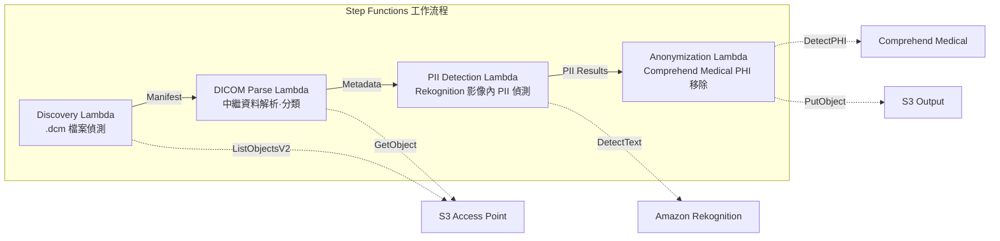

# UC5：醫療 — DICOM 影像的自動分類與匿名化

🌐 **Language / 言語**: [日本語](README.md) | [English](README.en.md) | [한국어](README.ko.md) | [简体中文](README.zh-CN.md) | 繁體中文 | [Français](README.fr.md) | [Deutsch](README.de.md) | [Español](README.es.md)

📚 **文件**: [架構圖](docs/architecture.md) | [示範指南](docs/demo-guide.md)

## 概述

利用 FSx for ONTAP 的 S3 Access Points，實現 DICOM 醫用影像的自動分類與匿名化的無伺服器工作流程。保護患者隱私並實現高效的影像管理。

### 適合此模式的情況

- 希望定期對從 PACS / VNA 保存到 FSx for ONTAP 的 DICOM 檔案進行匿名化
- 希望為建立研究用資料集自動移除 PHI（受保護健康資訊）
- 希望偵測影像中燒錄的患者資訊（Burned-in Annotation）
- 希望透過依模式·部位的自動分類來提升影像管理效率
- 希望建構符合 HIPAA / 個人資訊保護法的匿名化管線

### 不適合此模式的情況

- 即時 DICOM 路由（需要 DICOM MWL / MPPS 整合）
- 影像診斷輔助 AI（CAD）— 本模式專注於分類·匿名化
- 在 Comprehend Medical 不支援的區域，法規上不允許跨區域資料傳輸
- DICOM 檔案大小超過 5 GB（MR/CT 的多影格等）

### 主要功能

- 透過 S3 AP 自動偵測 .dcm 檔案
- DICOM 中繼資料解析（患者姓名、檢查日期、模式、部位）與分類
- 使用 Amazon Rekognition 偵測影像中燒錄的個人身分資訊（PII）
- 使用 Amazon Comprehend Medical 識別並移除 PHI（受保護健康資訊）
- 匿名化後的 DICOM 檔案附帶分類中繼資料輸出至 S3

## Success Metrics

### Outcome
透過 DICOM 影像的自動分類·匿名化，實現放射科檢索效率的提升與患者隱私保護。

### Metrics
| 指標 | 目標值（範例） |
|-----------|------------|
| 已處理 DICOM 檔案數 / 執行 | > 500 files |
| 分類精度 | > 90% |
| 匿名化成功率 | 100%（PHI 外洩為零） |
| 處理時間 / 檔案 | < 30 秒 |
| 成本 / 執行 | < $15 |
| Human Review 必需率 | 100%（建議對匿名化結果全部確認） |

> **100% Human Review 的理由**：由於匿名化遺漏會直接影響患者隱私，因此建議對全部檔案進行人工確認。

### Measurement Method
Step Functions 執行歷史、Comprehend Medical entity count、匿名化前後的 diff 審查、CloudWatch Metrics。審查結果記錄於 DynamoDB 中，以便在稽核時追蹤「誰·何時·確認了什麼」。

## 架構



### 工作流程步驟

1. **Discovery**：從 S3 AP 偵測 .dcm 檔案並產生 Manifest
2. **DICOM Parse**：解析 DICOM 中繼資料（patient name, study date, modality, body part），並依模式·部位進行分類
3. **PII Detection**：使用 Rekognition 偵測影像像素內燒錄的個人資訊
4. **Anonymization**：使用 Comprehend Medical 識別並移除 PHI，將匿名化的 DICOM 附帶分類中繼資料輸出至 S3

## 前提條件

- AWS 帳戶和適當的 IAM 權限
- FSx for ONTAP 檔案系統（ONTAP 9.17.1P4D3 以上）
- 已啟用 S3 Access Points 的磁碟區
- 已在 Secrets Manager 中註冊 ONTAP REST API 認證資訊
- VPC、私有子網
- 支援 Amazon Rekognition 和 Amazon Comprehend Medical 的區域

## 部署步驟

### 1. 參數準備

部署前請確認以下值：

- FSx for ONTAP S3 Access Point Alias
- ONTAP 管理 IP 位址
- Secrets Manager 密鑰名稱
- VPC ID、私有子網 ID

### 2. SAM 部署

```bash
# Prerequisite: AWS SAM CLI required. 'sam build' packages the code and shared layer automatically.
sam build

sam deploy \
  --stack-name fsxn-healthcare-dicom \
  --parameter-overrides \
    S3AccessPointAlias=<your-volume-ext-s3alias> \
    S3AccessPointName=<your-s3ap-name> \
    S3AccessPointOutputAlias=<your-output-volume-ext-s3alias> \
    OntapSecretName=<your-ontap-secret-name> \
    OntapManagementIp=<your-ontap-management-ip> \
    ScheduleExpression="rate(1 hour)" \
    VpcId=<your-vpc-id> \
    PrivateSubnetIds=<subnet-1>,<subnet-2> \
    NotificationEmail=<your-email@example.com> \
    EnableVpcEndpoints=false \
    EnableCloudWatchAlarms=false \
  --capabilities CAPABILITY_NAMED_IAM \
  --resolve-s3 \
  --region ap-northeast-1
```

> **注意**：`template.yaml` 用於 SAM CLI（`sam build` + `sam deploy`）。
> 如需使用 `aws cloudformation deploy` 命令直接部署，請使用 `template-deploy.yaml`（需要預先封裝 Lambda zip 檔案並上傳至 S3）。

> **注意**：請將 `<...>` 佔位符替換為實際的環境值。

### 3. 確認 SNS 訂閱

部署後，指定的電子郵件位址將收到 SNS 訂閱確認郵件。

> **注意**：如果省略 `S3AccessPointName`，IAM 策略將僅基於 Alias，可能導致 `AccessDenied` 錯誤。建議在生產環境中指定。詳細資訊請參閱 [疑難排解指南](../docs/guides/troubleshooting-guide.md#1-accessdenied-エラー)。

## 設定參數列表

| 參數 | 說明 | 預設值 | 必需 |
|-----------|------|----------|------|
| `S3AccessPointAlias` | FSx for ONTAP S3 AP Alias（輸入用） | — | ✅ |
| `S3AccessPointName` | S3 AP 名稱（用於基於 ARN 的 IAM 權限授予。省略時僅基於 Alias） | `""` | ⚠️ 建議 |
| `S3AccessPointOutputAlias` | FSx for ONTAP S3 AP Alias（輸出用） | — | ✅ |
| `OntapSecretName` | ONTAP 認證資訊的 Secrets Manager 密鑰名稱 | — | ✅ |
| `OntapManagementIp` | ONTAP 叢集管理 IP 位址 | — | ✅ |
| `ScheduleExpression` | EventBridge Scheduler 的排程運算式 | `rate(1 hour)` | |
| `VpcId` | VPC ID | — | ✅ |
| `PrivateSubnetIds` | 私有子網 ID 清單 | — | ✅ |
| `NotificationEmail` | SNS 通知目標電子郵件位址 | — | ✅ |
| `EnableVpcEndpoints` | 啟用 Interface VPC Endpoints | `false` | |
| `EnableCloudWatchAlarms` | 啟用 CloudWatch Alarms | `false` | |

## 成本結構

### 基於請求（按量付費）

| 服務 | 計費單位 | 概算（100 DICOM 檔案/月） |
|---------|---------|---------------------------|
| Lambda | 請求數 + 執行時間 | ~$0.01 |
| Step Functions | 狀態轉換數 | 免費額度內 |
| S3 API | 請求數 | ~$0.01 |
| Rekognition | 影像數 | ~$0.10 |
| Comprehend Medical | 單元數 | ~$0.05 |

### 常時運行（選用）

| 服務 | 參數 | 月額 |
|---------|-----------|------|
| Interface VPC Endpoints | `EnableVpcEndpoints=true` | ~$28.80 |
| CloudWatch Alarms | `EnableCloudWatchAlarms=true` | ~$0.20 |

> 在示範/概念驗證環境中，僅需變動費用即可從 **每月 ~$0.17** 起使用。

## 安全性與合規性

由於本工作流程處理醫療資料，因此實施以下安全措施：

- **加密**：S3 輸出儲存貯體使用 SSE-KMS 加密
- **VPC 內執行**：Lambda 函數在 VPC 內執行（建議啟用 VPC Endpoints）
- **最小權限 IAM**：為每個 Lambda 函數授予必要的最小 IAM 權限
- **PHI 移除**：使用 Comprehend Medical 自動偵測並移除受保護健康資訊
- **稽核日誌**：使用 CloudWatch Logs 記錄所有處理日誌

> **注意**：本模式為範例實作。在實際醫療環境中使用時，需要根據 HIPAA 等法規要求實施額外的安全措施和合規性審查。

## 清理

```bash
# Delete the CloudFormation stack
aws cloudformation delete-stack \
  --stack-name fsxn-healthcare-dicom \
  --region ap-northeast-1

# Wait for deletion to complete
aws cloudformation wait stack-delete-complete \
  --stack-name fsxn-healthcare-dicom \
  --region ap-northeast-1
```

> **注意**：如果 S3 儲存貯體中仍有物件，刪除堆疊可能會失敗。請提前清空儲存貯體。

## 支援的區域

UC5 使用以下服務：

| 服務 | 區域限制 |
|---------|-------------|
| Amazon Rekognition | 幾乎所有區域均可用 |
| Amazon Comprehend Medical | 僅支援有限區域。使用 `COMPREHEND_MEDICAL_REGION` 參數指定支援的區域（如 us-east-1） |
| AWS X-Ray | 幾乎所有區域均可用 |
| CloudWatch EMF | 幾乎所有區域均可用 |

> 透過 Cross-Region Client 呼叫 Comprehend Medical API。請確認資料駐留需求。詳細資訊請參閱 [區域相容性矩陣](../docs/region-compatibility.md)。

## 參考連結

### AWS 官方文件

- [FSx for ONTAP S3 Access Points 概述](https://docs.aws.amazon.com/fsx/latest/ONTAPGuide/accessing-data-via-s3-access-points.html)
- [使用 Lambda 進行無伺服器處理（官方教學）](https://docs.aws.amazon.com/fsx/latest/ONTAPGuide/tutorial-process-files-with-lambda.html)
- [Comprehend Medical DetectPHI API](https://docs.aws.amazon.com/comprehend-medical/latest/dev/API_DetectPHI.html)
- [Rekognition DetectText API](https://docs.aws.amazon.com/rekognition/latest/dg/API_DetectText.html)
- [HIPAA on AWS 白皮書](https://docs.aws.amazon.com/whitepapers/latest/architecting-hipaa-security-and-compliance-on-aws/welcome.html)

### AWS 部落格文章

- [S3 AP 發布部落格](https://aws.amazon.com/blogs/aws/amazon-fsx-for-netapp-ontap-now-integrates-with-amazon-s3-for-seamless-data-access/)
- [FSx for ONTAP + Bedrock RAG](https://aws.amazon.com/blogs/machine-learning/build-rag-based-generative-ai-applications-in-aws-using-amazon-fsx-for-netapp-ontap-with-amazon-bedrock/)

### GitHub 範例

- [aws-samples/amazon-rekognition-serverless-large-scale-image-and-video-processing](https://github.com/aws-samples/amazon-rekognition-serverless-large-scale-image-and-video-processing) — Rekognition 大規模處理
- [aws-samples/serverless-patterns](https://github.com/aws-samples/serverless-patterns) — 無伺服器模式集

## 已驗證的環境

| 項目 | 值 |
|------|-----|
| AWS 區域 | ap-northeast-1 (東京) |
| FSx for ONTAP 版本 | ONTAP 9.17.1P4D3 |
| FSx for ONTAP 配置 | SINGLE_AZ_1 |
| Python | 3.12 |
| 部署方式 | CloudFormation (標準) |

## Lambda VPC 配置架構

根據驗證中獲得的見解，Lambda 函數被分離部署在 VPC 內部/外部。

**VPC 內部 Lambda**（僅限需要 ONTAP REST API 存取的函數）：
- Discovery Lambda — S3 AP + ONTAP API

**VPC 外部 Lambda**（僅使用 AWS 受管服務 API）：
- 其他所有 Lambda 函數

> **理由**：從 VPC 內部 Lambda 存取 AWS 受管服務 API（Athena、Bedrock、Textract 等）需要 Interface VPC Endpoint（每個 $7.20/月）。VPC 外部 Lambda 可透過網際網路直接存取 AWS API，無需額外成本即可運行。

> **注意**：對於使用 ONTAP REST API 的 UC（UC1 法務·合規），`EnableVpcEndpoints=true` 是必需的。這是為了透過 Secrets Manager VPC Endpoint 取得 ONTAP 認證資訊。

---

## AWS 文件連結

| 服務 | 文件 |
|---------|------------|
| FSx for ONTAP | [FSx for ONTAP](https://docs.aws.amazon.com/fsx/latest/ONTAPGuide/what-is-fsx-ontap.html) |
| S3 Access Points | [S3 Access Points](https://docs.aws.amazon.com/fsx/latest/ONTAPGuide/s3-access-points.html) |
| Step Functions | [Step Functions](https://docs.aws.amazon.com/step-functions/latest/dg/welcome.html) |
| Amazon Comprehend Medical | [Amazon Comprehend Medical](https://docs.aws.amazon.com/comprehend-medical/latest/dev/comprehendmedical-welcome.html) |
| Amazon Bedrock | [Amazon Bedrock](https://docs.aws.amazon.com/bedrock/latest/userguide/what-is-bedrock.html) |
| AWS HIPAA 合規服務 | [AWS HIPAA 合規服務](https://aws.amazon.com/compliance/hipaa-eligible-services-reference/) |

### Well-Architected Framework 對應

| 支柱 | 對應 |
|----|------|
| 卓越營運 | X-Ray 追蹤、EMF 指標、匿名化稽核日誌 |
| 安全性 | 最小權限 IAM、KMS 加密、PII 偵測·匿名化、HIPAA 考量 |
| 可靠性 | Step Functions Retry/Catch、跨區域回退 |
| 效能效率 | Lambda 記憶體最佳化、DICOM 串流處理 |
| 成本最佳化 | 無伺服器、Comprehend Medical 按頁計費 |
| 永續性 | 隨需執行、匿名化資料的重複利用 |

---

## 本地測試

### Prerequisites 檢查

```bash
# Confirm prerequisites
aws --version          # AWS CLI v2
sam --version          # SAM CLI
python3 --version      # Python 3.9+
docker --version       # Docker (for sam local)
aws sts get-caller-identity  # AWS credentials
```

### sam local invoke

```bash
# Build
# Prerequisite: AWS SAM CLI required. 'sam build' packages the code and shared layer automatically.
sam build

# Run the Discovery Lambda locally
sam local invoke DiscoveryFunction --event events/discovery-event.json

# With environment variable overrides
sam local invoke DiscoveryFunction \
  --event events/discovery-event.json \
  --env-vars env.json
```

### 單元測試

```bash
python3 -m pytest tests/ -v
```

詳細資訊請參閱 [本地測試快速入門](../docs/local-testing-quick-start.md)。

---

## 輸出範例 (Output Sample)

DICOM 匿名化管線的輸出範例：

```json
{
  "discovery": {
    "status": "completed",
    "object_count": 12,
    "prefix": "dicom-inbox/"
  },
  "anonymization": [
    {
      "key": "dicom-inbox/study-001/series-001.dcm",
      "pii_detected": ["PatientName", "PatientID", "InstitutionName"],
      "pii_removed": 3,
      "anonymized_key": "anonymized/study-001/series-001.dcm",
      "integrity_hash": "sha256:a1b2c3..."
    }
  ],
  "report": {
    "total_files": 12,
    "anonymized": 12,
    "pii_fields_removed": 36,
    "compliance_status": "HIPAA_SAFE_HARBOR_COMPLIANT"
  }
}
```

> **備註**：以上為範例輸出，實際值因環境·輸入資料而異。基準數值為 sizing reference，而非 service limit。

---

## Governance Note

> 本模式提供技術架構指導，而非法律·合規·監管方面的建議。組織應諮詢合格的專業人士。

---

## S3AP Compatibility

有關 S3 Access Points for FSx for ONTAP 的相容性限制、疑難排解和觸發模式，請參閱 [S3AP Compatibility Notes](../docs/s3ap-compatibility-notes.md)。
