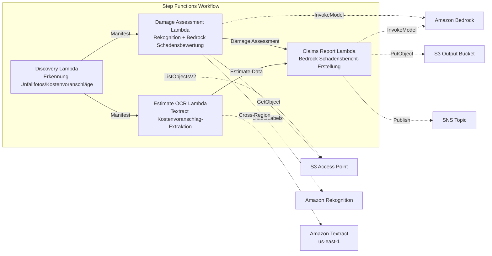

# UC14: Versicherung / Schadensbewertung — Schadensbewertung von Unfallfotos, Kostenvoranschlags-OCR, Gutachtenbericht

🌐 **Language / 言語**: [日本語](README.md) | [English](README.en.md) | [한국어](README.ko.md) | [简体中文](README.zh-CN.md) | [繁體中文](README.zh-TW.md) | [Français](README.fr.md) | Deutsch | [Español](README.es.md)

📚 **Dokumentation**: [Architekturdiagramm](docs/architecture.de.md) | [Demo-Leitfaden](docs/demo-guide.de.md)

## Überblick

Dies ist ein serverloser Workflow, der die S3 Access Points von Amazon FSx for NetApp ONTAP nutzt, um die Schadensbewertung von Unfallfotos, die OCR-Textextraktion aus Kostenvoranschlägen und die automatische Erstellung von Versicherungsschadensberichten zu realisieren.

### Wann sich dieses Muster eignet

- Unfallfotos und Kostenvoranschläge sind auf FSx for ONTAP angesammelt
- Sie möchten die Schadenserkennung auf Unfallfotos mit Rekognition automatisieren (Fahrzeugschadens-Labels, Schweregrad-Indikatoren, betroffene Bereiche)
- Sie möchten OCR für Kostenvoranschläge mit Textract durchführen (Reparaturpositionen, Kosten, Arbeitsstunden, Teile)
- Sie benötigen einen umfassenden Schadensbericht, der die fotobasierte Schadensbewertung mit den Kostenvoranschlagsdaten korreliert
- Sie möchten die Verwaltung von manuellen Prüfmarkierungen automatisieren, wenn keine Schadens-Labels erkannt werden

### Wann sich dieses Muster nicht eignet

- Sie benötigen ein Echtzeit-Schadensbearbeitungssystem
- Sie benötigen eine vollständige Schadensbegutachtungs-Engine (dedizierte Software ist geeigneter)
- Sie müssen umfangreiche Betrugserkennungsmodelle trainieren
- Eine Umgebung, in der die Netzwerkerreichbarkeit der ONTAP REST API nicht sichergestellt werden kann

### Hauptfunktionen

- Automatische Erkennung von Unfallfotos (.jpg, .jpeg, .png) und Kostenvoranschlägen (.pdf, .tiff) über S3 AP
- Schadenserkennung mit Rekognition (damage_type, severity_level, affected_components)
- Erstellung einer strukturierten Schadensbewertung mit Bedrock
- Kostenvoranschlags-OCR mit Textract (regionsübergreifend): Reparaturpositionen, Kosten, Arbeitsstunden, Teile
- Erstellung eines umfassenden Versicherungsschadensberichts mit Bedrock (JSON + menschenlesbares Format)
- Sofortige Freigabe der Ergebnisse über SNS-Benachrichtigung

## Success Metrics

### Outcome
Beschleunigung des Versicherungsbegutachtungsprozesses durch Automatisierung der Schadensbewertung von Unfallfotos, der Kostenvoranschlags-OCR und der Erstellung von Gutachtenberichten.

### Metrics
| Metrik | Zielwert (Beispiel) |
|-----------|------------|
| Bearbeitete Ansprüche / Lauf | > 100 claims |
| Genauigkeit der Schadensbewertung | > 85% |
| Erfolgsrate der OCR-Datenextraktion | > 90% |
| Erstellungszeit des Gutachtenberichts | < 2 Min / Fall |
| Kosten / Anspruch | < $0.50 |
| Erforderliche Human-Review-Rate | > 30% (alle hochwertigen Fälle geprüft) |

### Measurement Method
Step-Functions-Ausführungsverlauf, Rekognition-Schadenserkennung, Textract-Extraktionsergebnisse, Bedrock-Berichte, CloudWatch Metrics.

## Architektur



### Workflow-Schritte

1. **Discovery**: Unfallfotos und Kostenvoranschläge aus S3 AP erkennen
2. **Damage Assessment**: Schäden mit Rekognition erkennen, strukturierte Schadensbewertung mit Bedrock erstellen
3. **Estimate OCR**: Text und Tabellen aus Kostenvoranschlägen mit Textract (regionsübergreifend) extrahieren
4. **Claims Report**: Umfassenden Bericht mit Bedrock erstellen, der Schadensbewertung und Kostenvoranschlagsdaten korreliert

## Voraussetzungen

- AWS-Konto und geeignete IAM-Berechtigungen
- FSx for ONTAP-Dateisystem (ONTAP 9.17.1P4D3 oder höher)
- Volume mit aktiviertem S3 Access Point (zur Speicherung von Unfallfotos und Kostenvoranschlägen)
- VPC, private Subnetze
- Amazon Bedrock-Modellzugriff aktiviert (Claude / Nova)
- **Regionsübergreifend**: Da Textract in ap-northeast-1 nicht unterstützt wird, ist ein regionsübergreifender Aufruf nach us-east-1 erforderlich

## Bereitstellungsschritte

### 1. Regionsübergreifende Parameter prüfen

Da Textract in der Region Tokio nicht unterstützt wird, konfigurieren Sie den regionsübergreifenden Aufruf mit dem Parameter `CrossRegionTarget`.

### 2. SAM-Bereitstellung

```bash
# Voraussetzung: AWS SAM CLI ist erforderlich. 'sam build' paketiert Code und gemeinsame Ebene automatisch.
sam build

sam deploy \
  --stack-name fsxn-insurance-claims \
  --parameter-overrides \
    S3AccessPointAlias=<your-volume-ext-s3alias> \
    S3AccessPointName=<your-s3ap-name> \
    VpcId=<your-vpc-id> \
    PrivateSubnetIds=<subnet-1>,<subnet-2> \
    ScheduleExpression="rate(1 hour)" \
    NotificationEmail=<your-email@example.com> \
    CrossRegion=us-east-1 \
    EnableVpcEndpoints=false \
    EnableCloudWatchAlarms=false \
  --capabilities CAPABILITY_NAMED_IAM \
  --resolve-s3 \
  --region ap-northeast-1
```

> **Hinweis**: `template.yaml` wird mit der SAM CLI (`sam build` + `sam deploy`) verwendet.
> Um direkt mit dem Befehl `aws cloudformation deploy` bereitzustellen, verwenden Sie stattdessen `template-deploy.yaml` (dies erfordert das Vorab-Paketieren der Lambda-Zip-Dateien und das Hochladen nach S3).

## Liste der Konfigurationsparameter

| Parameter | Beschreibung | Standard | Erforderlich |
|-----------|------|----------|------|
| `S3AccessPointAlias` | FSx for ONTAP S3 AP Alias (für Eingabe) | — | ✅ |
| `S3AccessPointName` | S3 AP-Name (für ARN-basierte IAM-Berechtigungsvergabe; bei Auslassung nur Alias-basiert) | `""` | ⚠️ Empfohlen |
| `ScheduleExpression` | Zeitplanausdruck des EventBridge Scheduler | `rate(1 hour)` | |
| `VpcId` | VPC ID | — | ✅ |
| `PrivateSubnetIds` | Liste der privaten Subnetz-IDs | — | ✅ |
| `NotificationEmail` | SNS-Benachrichtigungs-E-Mail-Adresse | — | ✅ |
| `CrossRegionTarget` | Zielregion für Textract | `us-east-1` | |
| `MapConcurrency` | Anzahl paralleler Ausführungen des Map-Status | `10` | |
| `LambdaMemorySize` | Lambda-Speichergröße (MB) | `512` | |
| `LambdaTimeout` | Lambda-Timeout (Sekunden) | `300` | |
| `EnableVpcEndpoints` | Interface VPC Endpoints aktivieren | `false` | |
| `EnableCloudWatchAlarms` | CloudWatch Alarms aktivieren | `false` | |

## Bereinigung

```bash
aws s3 rm s3://fsxn-insurance-claims-output-${AWS_ACCOUNT_ID} --recursive

aws cloudformation delete-stack \
  --stack-name fsxn-insurance-claims \
  --region ap-northeast-1

aws cloudformation wait stack-delete-complete \
  --stack-name fsxn-insurance-claims \
  --region ap-northeast-1
```

## Supported Regions

UC14 verwendet die folgenden Dienste:

| Dienst | Regionsbeschränkung |
|---------|-------------|
| Amazon Rekognition | In fast allen Regionen verfügbar |
| Amazon Textract | In ap-northeast-1 nicht unterstützt. Geben Sie über den Parameter `TEXTRACT_REGION` eine unterstützte Region an (z. B. us-east-1) |
| Amazon Bedrock | Unterstützte Regionen prüfen ([Von Bedrock unterstützte Regionen](https://docs.aws.amazon.com/general/latest/gr/bedrock.html)) |
| AWS X-Ray | In fast allen Regionen verfügbar |
| CloudWatch EMF | In fast allen Regionen verfügbar |

> Die Textract-API wird über den Cross-Region Client aufgerufen. Prüfen Sie Ihre Anforderungen an die Datenresidenz. Weitere Informationen finden Sie in der [Regionskompatibilitätsmatrix](../docs/region-compatibility.md).

## Referenzlinks

- [Überblick über FSx for ONTAP S3 Access Points](https://docs.aws.amazon.com/fsx/latest/ONTAPGuide/accessing-data-via-s3-access-points.html)
- [Amazon Rekognition Label-Erkennung](https://docs.aws.amazon.com/rekognition/latest/dg/labels.html)
- [Amazon Textract Dokumentation](https://docs.aws.amazon.com/textract/latest/dg/what-is.html)
- [Amazon Bedrock API-Referenz](https://docs.aws.amazon.com/bedrock/latest/APIReference/API_runtime_InvokeModel.html)

---

## AWS-Dokumentationslinks

| Dienst | Dokumentation |
|---------|------------|
| FSx for ONTAP | [Benutzerhandbuch](https://docs.aws.amazon.com/fsx/latest/ONTAPGuide/what-is-fsx-ontap.html) |
| S3 Access Points | [S3 AP for FSx for ONTAP](https://docs.aws.amazon.com/fsx/latest/ONTAPGuide/s3-access-points.html) |
| Step Functions | [Entwicklerhandbuch](https://docs.aws.amazon.com/step-functions/latest/dg/welcome.html) |
| Amazon Textract | [Entwicklerhandbuch](https://docs.aws.amazon.com/textract/latest/dg/what-is.html) |
| Amazon Rekognition | [Entwicklerhandbuch](https://docs.aws.amazon.com/rekognition/latest/dg/what-is.html) |
| Amazon Bedrock | [Benutzerhandbuch](https://docs.aws.amazon.com/bedrock/latest/userguide/what-is-bedrock.html) |

### Well-Architected Framework-Ausrichtung

| Säule | Umsetzung |
|----|------|
| Operative Exzellenz | X-Ray-Tracing, EMF-Metriken, Überwachung der Bewertungsgenauigkeit |
| Sicherheit | IAM mit geringsten Rechten, KMS-Verschlüsselung, Zugriffskontrolle für Versicherungsdaten |
| Zuverlässigkeit | Step Functions Retry/Catch, Parallelverarbeitung (Schadensbewertung ∥ OCR) |
| Leistungseffizienz | Parallele Pfadverarbeitung, Rekognition-Stapelanalyse |
| Kostenoptimierung | Serverless, Textract-Abrechnung pro Seite |
| Nachhaltigkeit | On-Demand-Ausführung, inkrementelle Verarbeitung |

---

## Kostenschätzung (monatliche Näherung)

> **Anmerkung**: Die folgenden Angaben sind Näherungen für die Region ap-northeast-1, und die tatsächlichen Kosten variieren je nach Nutzung. Prüfen Sie die aktuellen Preise mit dem [AWS Pricing Calculator](https://calculator.aws/).

### Serverlose Komponenten (nutzungsbasierte Abrechnung)

| Dienst | Stückpreis | Geschätzte Nutzung | Monatliche Schätzung |
|---------|------|-----------|---------|
| Lambda | $0.0000166667/GB-sec | 4 Funktionen × 30 claims/Tag | ~$1-5 |
| S3 API (GetObject/ListObjects) | $0.0047/10K requests | ~10K requests/Tag | ~$1.5 |
| Step Functions | $0.025/1K state transitions | ~1K transitions/Tag | ~$0.75 |
| Bedrock (Nova Lite) | $0.00006/1K input tokens | ~40K tokens/Ausführung | ~$3-10 |
| Athena | $5/TB scanned | ~5 MB/Abfrage | ~$0.5-2 |
| SNS | $0.50/100K notifications | ~100 notifications/Tag | ~$0.15 |
| CloudWatch Logs | $0.76/GB ingested | ~1 GB/Monat | ~$0.76 |
| Rekognition | $0.001/image |

### Fixkosten (FSx for ONTAP — setzt vorhandene Umgebung voraus)

| Komponente | Monatlich |
|--------------|------|
| FSx for ONTAP (128 MBps, 1 TB) | ~$230 (teilt vorhandene Umgebung) |
| S3 Access Point | Keine zusätzlichen Kosten (nur S3-API-Kosten) |

### Gesamtschätzung

| Konfiguration | Monatliche Schätzung |
|------|---------|
| Minimale Konfiguration (täglich einmal) | ~$5-15 |
| Standardkonfiguration (stündlich) | ~$15-50 |
| Große Konfiguration (hohe Frequenz + Alarme) | ~$50-150 |

> **Governance Caveat**: Kostenschätzungen sind Näherungen und nicht garantiert. Die tatsächliche Abrechnung variiert je nach Nutzungsmuster, Datenvolumen und Region.

---

## Lokales Testen

### Prerequisites — Prüfung

```bash
# Voraussetzungen prüfen
aws --version          # AWS CLI v2
sam --version          # SAM CLI
python3 --version      # Python 3.9+
docker --version       # Docker (für sam local)
aws sts get-caller-identity  # AWS-Anmeldeinformationen
```

### sam local invoke

```bash
# Build
# Voraussetzung: AWS SAM CLI ist erforderlich. 'sam build' paketiert Code und gemeinsame Ebene automatisch.
sam build

# Lokale Ausführung des Discovery Lambda
sam local invoke DiscoveryFunction --event events/discovery-event.json

# Mit Überschreibungen von Umgebungsvariablen
sam local invoke DiscoveryFunction \
  --event events/discovery-event.json \
  --env-vars env.json
```

### Unit-Tests

```bash
python3 -m pytest tests/ -v
```

Weitere Informationen finden Sie im [Schnellstart für lokales Testen](../docs/local-testing-quick-start.md).

---

## Ausgabebeispiel (Output Sample)

Beispielausgabe der Schadensbegutachtungs-Pipeline:

```json
{
  "discovery": {
    "status": "completed",
    "object_count": 8,
    "categories": {"damage_photo": 5, "estimate_doc": 3}
  },
  "damage_assessment": [
    {
      "key": "claims/CLM-2026-001/photo-front.jpg",
      "damage_severity": "moderate",
      "damage_type": "dent",
      "affected_area": "front_bumper",
      "confidence": 0.91,
      "estimated_repair_cost_jpy": 150000
    }
  ],
  "estimate_ocr": [
    {
      "key": "claims/CLM-2026-001/repair-estimate.pdf",
      "total_amount": 180000,
      "parts_cost": 120000,
      "labor_cost": 60000,
      "vendor": "Auto Repair Tokyo"
    }
  ],
  "correlation_report": {
    "claim_id": "CLM-2026-001",
    "ai_estimate_vs_vendor": {"difference_pct": 16.7, "status": "WITHIN_THRESHOLD"},
    "recommendation": "approve_with_standard_review"
  }
}
```

> **Anmerkung**: Das Obige ist eine Beispielausgabe, und die tatsächlichen Werte variieren je nach Umgebung und Eingabedaten. Benchmark-Zahlen sind ein sizing reference, kein service limit.

---

## Governance Note

> Dieses Muster bietet technische Architekturberatung. Es handelt sich nicht um rechtliche, Compliance- oder aufsichtsrechtliche Beratung. Organisationen sollten qualifizierte Fachleute konsultieren.

---

## S3AP Compatibility

Informationen zu Kompatibilitätsbeschränkungen, Fehlerbehebung und Trigger-Mustern der S3 Access Points for FSx for ONTAP finden Sie in den [S3AP Compatibility Notes](../docs/s3ap-compatibility-notes.md).
