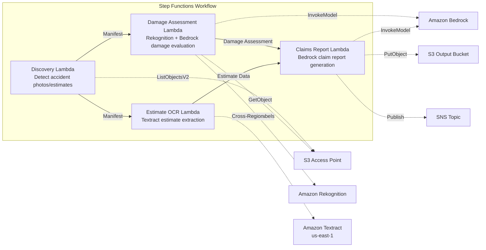

# UC14: Insurance / Damage Assessment — Accident Photo Damage Evaluation, Estimate OCR, and Assessment Report

🌐 **Language / 言語**: [日本語](README.md) | English | [한국어](README.ko.md) | [简体中文](README.zh-CN.md) | [繁體中文](README.zh-TW.md) | [Français](README.fr.md) | [Deutsch](README.de.md) | [Español](README.es.md)

📚 **Documentation**: [Architecture Diagram](docs/architecture.en.md) | [Demo Guide](docs/demo-guide.en.md)

## Overview

This is a serverless workflow that leverages S3 Access Points in Amazon FSx for NetApp ONTAP to enable damage evaluation of accident photos, OCR text extraction from estimates, and automatic generation of insurance claim reports.

### When this pattern is a good fit

- Accident photos and estimates are accumulated on FSx for ONTAP
- You want to automate damage detection on accident photos using Rekognition (vehicle damage labels, severity indicators, affected areas)
- You want to perform OCR on estimates using Textract (repair items, costs, labor hours, parts)
- You need a comprehensive insurance claim report that correlates photo-based damage evaluation with estimate data
- You want to automate manual review flag management when no damage labels are detected

### When this pattern is not a good fit

- You need a real-time claims processing system
- You need a complete claims assessment engine (dedicated software is more appropriate)
- You need to train large-scale fraud detection models
- An environment where network reachability to the ONTAP REST API cannot be ensured

### Key Features

- Automatic detection of accident photos (.jpg, .jpeg, .png) and estimates (.pdf, .tiff) via S3 AP
- Damage detection with Rekognition (damage_type, severity_level, affected_components)
- Structured damage evaluation generation with Bedrock
- Estimate OCR with Textract (cross-region): repair items, costs, labor hours, parts
- Comprehensive insurance claim report generation with Bedrock (JSON + human-readable format)
- Immediate sharing of results via SNS notification

## Success Metrics

### Outcome
Accelerate the insurance assessment process by automating accident photo damage evaluation, estimate OCR, and assessment report generation.

### Metrics
| Metric | Target (example) |
|-----------|------------|
| Processed claims / run | > 100 claims |
| Damage evaluation accuracy | > 85% |
| OCR data extraction success rate | > 90% |
| Assessment report generation time | < 2 min / case |
| Cost / claim | < $0.50 |
| Human Review required rate | > 30% (all high-value cases reviewed) |

### Measurement Method
Step Functions execution history, Rekognition damage detection, Textract extraction results, Bedrock reports, CloudWatch Metrics.

## Architecture



### Workflow Steps

1. **Discovery**: Detect accident photos and estimates from S3 AP
2. **Damage Assessment**: Detect damage with Rekognition, generate structured damage evaluation with Bedrock
3. **Estimate OCR**: Extract text and tables from estimates with Textract (cross-region)
4. **Claims Report**: Generate a comprehensive report with Bedrock that correlates damage evaluation and estimate data

## Prerequisites

- AWS account and appropriate IAM permissions
- FSx for ONTAP file system (ONTAP 9.17.1P4D3 or later)
- Volume with S3 Access Point enabled (storing accident photos and estimates)
- VPC, private subnets
- Amazon Bedrock model access enabled (Claude / Nova)
- **Cross-region**: Because Textract is not supported in ap-northeast-1, a cross-region call to us-east-1 is required

## Deployment Steps

### 1. Check the Cross-Region Parameters

Because Textract is not supported in the Tokyo region, configure the cross-region call with the `CrossRegionTarget` parameter.

### 2. SAM Deployment

```bash
# Prerequisite: AWS SAM CLI is required. 'sam build' automatically packages the code and shared layer.
sam build

sam deploy \
  --stack-name fsxn-insurance-claims \
  --parameter-overrides \
    S3AccessPointAlias=<your-volume-ext-s3alias> \
    S3AccessPointName=<your-s3ap-name> \
    VpcId=<your-vpc-id> \
    PrivateSubnetIds=<subnet-1>,<subnet-2> \
    ScheduleExpression="rate(1 hour)" \
    NotificationEmail=<your-email@example.com> \
    CrossRegion=us-east-1 \
    EnableVpcEndpoints=false \
    EnableCloudWatchAlarms=false \
  --capabilities CAPABILITY_NAMED_IAM \
  --resolve-s3 \
  --region ap-northeast-1
```

> **Note**: `template.yaml` is used with the SAM CLI (`sam build` + `sam deploy`).
> To deploy directly with the `aws cloudformation deploy` command, use `template-deploy.yaml` instead (this requires pre-packaging the Lambda zip files and uploading them to S3).

## Configuration Parameters

| Parameter | Description | Default | Required |
|-----------|------|----------|------|
| `S3AccessPointAlias` | FSx for ONTAP S3 AP Alias (for input) | — | ✅ |
| `S3AccessPointName` | S3 AP name (for ARN-based IAM permission grants; when omitted, only Alias-based) | `""` | ⚠️ Recommended |
| `ScheduleExpression` | EventBridge Scheduler schedule expression | `rate(1 hour)` | |
| `VpcId` | VPC ID | — | ✅ |
| `PrivateSubnetIds` | List of private subnet IDs | — | ✅ |
| `NotificationEmail` | SNS notification email address | — | ✅ |
| `CrossRegionTarget` | Target region for Textract | `us-east-1` | |
| `MapConcurrency` | Concurrency of the Map state | `10` | |
| `LambdaMemorySize` | Lambda memory size (MB) | `512` | |
| `LambdaTimeout` | Lambda timeout (seconds) | `300` | |
| `EnableVpcEndpoints` | Enable Interface VPC Endpoints | `false` | |
| `EnableCloudWatchAlarms` | Enable CloudWatch Alarms | `false` | |

## Cleanup

```bash
aws s3 rm s3://fsxn-insurance-claims-output-${AWS_ACCOUNT_ID} --recursive

aws cloudformation delete-stack \
  --stack-name fsxn-insurance-claims \
  --region ap-northeast-1

aws cloudformation wait stack-delete-complete \
  --stack-name fsxn-insurance-claims \
  --region ap-northeast-1
```

## Supported Regions

UC14 uses the following services:

| Service | Region Constraint |
|---------|-------------|
| Amazon Rekognition | Available in almost all regions |
| Amazon Textract | Not supported in ap-northeast-1. Specify a supported region (e.g. us-east-1) via the `TEXTRACT_REGION` parameter |
| Amazon Bedrock | Check supported regions ([Bedrock supported regions](https://docs.aws.amazon.com/general/latest/gr/bedrock.html)) |
| AWS X-Ray | Available in almost all regions |
| CloudWatch EMF | Available in almost all regions |

> The Textract API is called via the Cross-Region Client. Verify your data residency requirements. For details, see the [Region Compatibility Matrix](../docs/region-compatibility.md).

## References

- [FSx for ONTAP S3 Access Points Overview](https://docs.aws.amazon.com/fsx/latest/ONTAPGuide/accessing-data-via-s3-access-points.html)
- [Amazon Rekognition Label Detection](https://docs.aws.amazon.com/rekognition/latest/dg/labels.html)
- [Amazon Textract Documentation](https://docs.aws.amazon.com/textract/latest/dg/what-is.html)
- [Amazon Bedrock API Reference](https://docs.aws.amazon.com/bedrock/latest/APIReference/API_runtime_InvokeModel.html)

---

## AWS Documentation Links

| Service | Documentation |
|---------|------------|
| FSx for ONTAP | [User Guide](https://docs.aws.amazon.com/fsx/latest/ONTAPGuide/what-is-fsx-ontap.html) |
| S3 Access Points | [S3 AP for FSx for ONTAP](https://docs.aws.amazon.com/fsx/latest/ONTAPGuide/s3-access-points.html) |
| Step Functions | [Developer Guide](https://docs.aws.amazon.com/step-functions/latest/dg/welcome.html) |
| Amazon Textract | [Developer Guide](https://docs.aws.amazon.com/textract/latest/dg/what-is.html) |
| Amazon Rekognition | [Developer Guide](https://docs.aws.amazon.com/rekognition/latest/dg/what-is.html) |
| Amazon Bedrock | [User Guide](https://docs.aws.amazon.com/bedrock/latest/userguide/what-is-bedrock.html) |

### Well-Architected Framework Alignment

| Pillar | Implementation |
|----|------|
| Operational Excellence | X-Ray tracing, EMF metrics, assessment accuracy monitoring |
| Security | Least-privilege IAM, KMS encryption, insurance data access control |
| Reliability | Step Functions Retry/Catch, parallel processing (damage evaluation ∥ OCR) |
| Performance Efficiency | Parallel path processing, Rekognition batch analysis |
| Cost Optimization | Serverless, Textract per-page billing |
| Sustainability | On-demand execution, incremental processing |

---

## Cost Estimate (Monthly Approximate)

> **Note**: The following are estimates for the ap-northeast-1 region, and actual costs vary with usage. Check the latest pricing with the [AWS Pricing Calculator](https://calculator.aws/).

### Serverless Components (Pay-as-you-go)

| Service | Unit Price | Estimated Usage | Monthly Estimate |
|---------|------|-----------|---------|
| Lambda | $0.0000166667/GB-sec | 4 functions × 30 claims/day | ~$1-5 |
| S3 API (GetObject/ListObjects) | $0.0047/10K requests | ~10K requests/day | ~$1.5 |
| Step Functions | $0.025/1K state transitions | ~1K transitions/day | ~$0.75 |
| Bedrock (Nova Lite) | $0.00006/1K input tokens | ~40K tokens/execution | ~$3-10 |
| Athena | $5/TB scanned | ~5 MB/query | ~$0.5-2 |
| SNS | $0.50/100K notifications | ~100 notifications/day | ~$0.15 |
| CloudWatch Logs | $0.76/GB ingested | ~1 GB/month | ~$0.76 |
| Rekognition | $0.001/image |

### Fixed Costs (FSx for ONTAP — assumes existing environment)

| Component | Monthly |
|--------------|------|
| FSx for ONTAP (128 MBps, 1 TB) | ~$230 (shares existing environment) |
| S3 Access Point | No additional charge (S3 API charges only) |

### Total Estimate

| Configuration | Monthly Estimate |
|------|---------|
| Minimal configuration (daily, once) | ~$5-15 |
| Standard configuration (hourly) | ~$15-50 |
| Large-scale configuration (high frequency + alarms) | ~$50-150 |

> **Governance Caveat**: Cost estimates are approximate and not guaranteed. Actual billing varies with usage patterns, data volume, and region.

---

## Local Testing

### Prerequisites Check

```bash
# Verify prerequisites
aws --version          # AWS CLI v2
sam --version          # SAM CLI
python3 --version      # Python 3.9+
docker --version       # Docker (for sam local)
aws sts get-caller-identity  # AWS credentials
```

### sam local invoke

```bash
# Build
# Prerequisite: AWS SAM CLI is required. 'sam build' automatically packages the code and shared layer.
sam build

# Local execution of the Discovery Lambda
sam local invoke DiscoveryFunction --event events/discovery-event.json

# With environment variable overrides
sam local invoke DiscoveryFunction \
  --event events/discovery-event.json \
  --env-vars env.json
```

### Unit Tests

```bash
python3 -m pytest tests/ -v
```

For details, see the [Local Testing Quick Start](../docs/local-testing-quick-start.md).

---

## Output Sample

Example output of the damage assessment pipeline:

```json
{
  "discovery": {
    "status": "completed",
    "object_count": 8,
    "categories": {"damage_photo": 5, "estimate_doc": 3}
  },
  "damage_assessment": [
    {
      "key": "claims/CLM-2026-001/photo-front.jpg",
      "damage_severity": "moderate",
      "damage_type": "dent",
      "affected_area": "front_bumper",
      "confidence": 0.91,
      "estimated_repair_cost_jpy": 150000
    }
  ],
  "estimate_ocr": [
    {
      "key": "claims/CLM-2026-001/repair-estimate.pdf",
      "total_amount": 180000,
      "parts_cost": 120000,
      "labor_cost": 60000,
      "vendor": "Auto Repair Tokyo"
    }
  ],
  "correlation_report": {
    "claim_id": "CLM-2026-001",
    "ai_estimate_vs_vendor": {"difference_pct": 16.7, "status": "WITHIN_THRESHOLD"},
    "recommendation": "approve_with_standard_review"
  }
}
```

> **Note**: The above is sample output, and actual values vary with the environment and input data. Benchmark figures are a sizing reference, not a service limit.

---

## Governance Note

> This pattern provides technical architecture guidance. It is not legal, compliance, or regulatory advice. Organizations should consult qualified professionals.

---

## S3AP Compatibility

For compatibility constraints, troubleshooting, and trigger patterns of S3 Access Points for FSx for ONTAP, see the [S3AP Compatibility Notes](../docs/s3ap-compatibility-notes.md).
