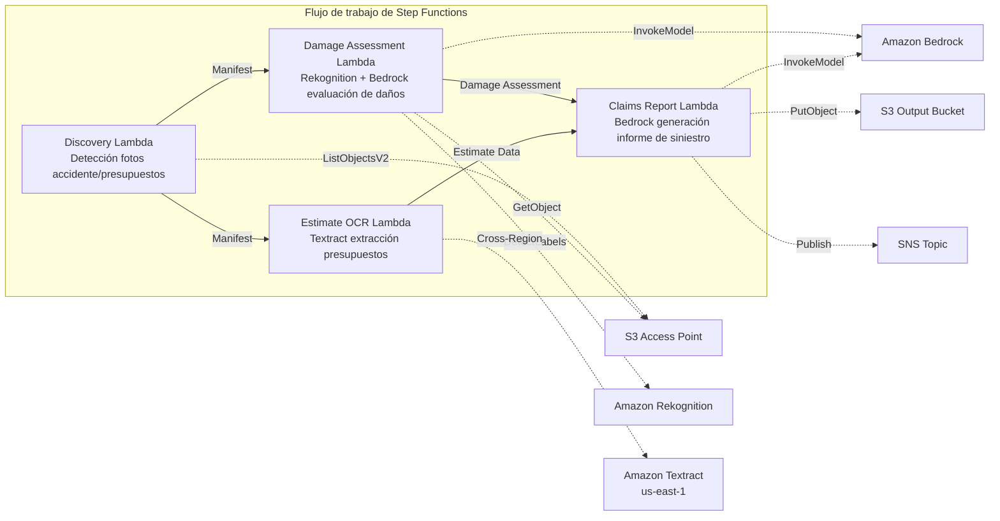

# UC14: Seguros / Evaluación de daños — Evaluación de daños en fotos de accidentes, OCR de presupuestos, informe de peritaje

🌐 **Language / 言語**: [日本語](README.md) | [English](README.en.md) | [한국어](README.ko.md) | [简体中文](README.zh-CN.md) | [繁體中文](README.zh-TW.md) | [Français](README.fr.md) | [Deutsch](README.de.md) | Español

📚 **Documentación**: [Diagrama de arquitectura](docs/architecture.es.md) | [Guía de demostración](docs/demo-guide.es.md)

## Descripción general

Este es un flujo de trabajo sin servidor que aprovecha los S3 Access Points de Amazon FSx for NetApp ONTAP para lograr la evaluación de daños en fotos de accidentes, la extracción de texto por OCR de presupuestos y la generación automática de informes de siniestros de seguros.

### Cuándo es adecuado este patrón

- Las fotos de accidentes y los presupuestos están acumulados en FSx for ONTAP
- Desea automatizar la detección de daños en fotos de accidentes con Rekognition (etiquetas de daños del vehículo, indicadores de gravedad, áreas afectadas)
- Desea realizar OCR de presupuestos con Textract (elementos de reparación, costos, horas de mano de obra, piezas)
- Necesita un informe de siniestro integral que correlacione la evaluación de daños basada en fotos con los datos del presupuesto
- Desea automatizar la gestión de marcas de revisión manual cuando no se detectan etiquetas de daños

### Cuándo no es adecuado este patrón

- Necesita un sistema de procesamiento de siniestros en tiempo real
- Necesita un motor completo de peritaje de siniestros (un software dedicado es más apropiado)
- Necesita entrenar modelos de detección de fraude a gran escala
- Un entorno donde no se puede garantizar la accesibilidad de red a la API REST de ONTAP

### Características principales

- Detección automática de fotos de accidentes (.jpg, .jpeg, .png) y presupuestos (.pdf, .tiff) a través de S3 AP
- Detección de daños con Rekognition (damage_type, severity_level, affected_components)
- Generación de evaluación estructurada de daños con Bedrock
- OCR de presupuestos con Textract (interregional): elementos de reparación, costos, horas de mano de obra, piezas
- Generación de informe integral de siniestro de seguro con Bedrock (JSON + formato legible por humanos)
- Uso compartido inmediato de resultados mediante notificación SNS

## Success Metrics

### Outcome
Acelerar el proceso de peritaje de seguros automatizando la evaluación de daños en fotos de accidentes, el OCR de presupuestos y la generación de informes de peritaje.

### Metrics
| Métrica | Objetivo (ejemplo) |
|-----------|------------|
| Reclamaciones procesadas / ejecución | > 100 claims |
| Precisión de la evaluación de daños | > 85% |
| Tasa de éxito de extracción OCR | > 90% |
| Tiempo de generación del informe de peritaje | < 2 min / caso |
| Costo / reclamación | < $0.50 |
| Tasa requerida de Human Review | > 30% (todos los casos de alto valor revisados) |

### Measurement Method
Historial de ejecución de Step Functions, detección de daños de Rekognition, resultados de extracción de Textract, informes de Bedrock, CloudWatch Metrics.

## Arquitectura



### Pasos del flujo de trabajo

1. **Discovery**: Detectar fotos de accidentes y presupuestos desde S3 AP
2. **Damage Assessment**: Detectar daños con Rekognition, generar evaluación estructurada de daños con Bedrock
3. **Estimate OCR**: Extraer texto y tablas de los presupuestos con Textract (interregional)
4. **Claims Report**: Generar un informe integral con Bedrock que correlacione la evaluación de daños y los datos del presupuesto

## Requisitos previos

- Cuenta de AWS y permisos IAM apropiados
- Sistema de archivos FSx for ONTAP (ONTAP 9.17.1P4D3 o posterior)
- Volumen con S3 Access Point habilitado (que almacena fotos de accidentes y presupuestos)
- VPC, subredes privadas
- Acceso a modelos de Amazon Bedrock habilitado (Claude / Nova)
- **Interregional**: Dado que Textract no es compatible con ap-northeast-1, se requiere una llamada interregional a us-east-1

## Pasos de implementación

### 1. Verificar los parámetros interregionales

Dado que Textract no es compatible con la región de Tokio, configure la llamada interregional con el parámetro `CrossRegionTarget`.

### 2. Implementación con SAM

```bash
# Requisito previo: se requiere AWS SAM CLI. 'sam build' empaqueta automáticamente el código y la capa compartida.
sam build

sam deploy \
  --stack-name fsxn-insurance-claims \
  --parameter-overrides \
    S3AccessPointAlias=<your-volume-ext-s3alias> \
    S3AccessPointName=<your-s3ap-name> \
    VpcId=<your-vpc-id> \
    PrivateSubnetIds=<subnet-1>,<subnet-2> \
    ScheduleExpression="rate(1 hour)" \
    NotificationEmail=<your-email@example.com> \
    CrossRegion=us-east-1 \
    EnableVpcEndpoints=false \
    EnableCloudWatchAlarms=false \
  --capabilities CAPABILITY_NAMED_IAM \
  --resolve-s3 \
  --region ap-northeast-1
```

> **Nota**: `template.yaml` se usa con la SAM CLI (`sam build` + `sam deploy`).
> Para implementar directamente con el comando `aws cloudformation deploy`, use `template-deploy.yaml` en su lugar (esto requiere el empaquetado previo de los archivos zip de Lambda y su carga a S3).

## Lista de parámetros de configuración

| Parámetro | Descripción | Predeterminado | Requerido |
|-----------|------|----------|------|
| `S3AccessPointAlias` | FSx for ONTAP S3 AP Alias (para entrada) | — | ✅ |
| `S3AccessPointName` | Nombre del S3 AP (para la concesión de permisos IAM basados en ARN; si se omite, solo basado en Alias) | `""` | ⚠️ Recomendado |
| `ScheduleExpression` | Expresión de programación de EventBridge Scheduler | `rate(1 hour)` | |
| `VpcId` | VPC ID | — | ✅ |
| `PrivateSubnetIds` | Lista de ID de subredes privadas | — | ✅ |
| `NotificationEmail` | Dirección de correo electrónico de notificación SNS | — | ✅ |
| `CrossRegionTarget` | Región de destino para Textract | `us-east-1` | |
| `MapConcurrency` | Número de ejecuciones paralelas del estado Map | `10` | |
| `LambdaMemorySize` | Tamaño de memoria de Lambda (MB) | `512` | |
| `LambdaTimeout` | Tiempo de espera de Lambda (segundos) | `300` | |
| `EnableVpcEndpoints` | Habilitar Interface VPC Endpoints | `false` | |
| `EnableCloudWatchAlarms` | Habilitar CloudWatch Alarms | `false` | |

## Limpieza

```bash
aws s3 rm s3://fsxn-insurance-claims-output-${AWS_ACCOUNT_ID} --recursive

aws cloudformation delete-stack \
  --stack-name fsxn-insurance-claims \
  --region ap-northeast-1

aws cloudformation wait stack-delete-complete \
  --stack-name fsxn-insurance-claims \
  --region ap-northeast-1
```

## Supported Regions

UC14 usa los siguientes servicios:

| Servicio | Restricción de región |
|---------|-------------|
| Amazon Rekognition | Disponible en casi todas las regiones |
| Amazon Textract | No compatible con ap-northeast-1. Especifique una región compatible (por ej. us-east-1) mediante el parámetro `TEXTRACT_REGION` |
| Amazon Bedrock | Verifique las regiones compatibles ([Regiones compatibles con Bedrock](https://docs.aws.amazon.com/general/latest/gr/bedrock.html)) |
| AWS X-Ray | Disponible en casi todas las regiones |
| CloudWatch EMF | Disponible en casi todas las regiones |

> La API de Textract se invoca a través del Cross-Region Client. Verifique sus requisitos de residencia de datos. Para más detalles, consulte la [Matriz de compatibilidad de regiones](../docs/region-compatibility.md).

## Enlaces de referencia

- [Descripción general de FSx for ONTAP S3 Access Points](https://docs.aws.amazon.com/fsx/latest/ONTAPGuide/accessing-data-via-s3-access-points.html)
- [Detección de etiquetas de Amazon Rekognition](https://docs.aws.amazon.com/rekognition/latest/dg/labels.html)
- [Documentación de Amazon Textract](https://docs.aws.amazon.com/textract/latest/dg/what-is.html)
- [Referencia de la API de Amazon Bedrock](https://docs.aws.amazon.com/bedrock/latest/APIReference/API_runtime_InvokeModel.html)

---

## Enlaces a la documentación de AWS

| Servicio | Documentación |
|---------|------------|
| FSx for ONTAP | [Guía del usuario](https://docs.aws.amazon.com/fsx/latest/ONTAPGuide/what-is-fsx-ontap.html) |
| S3 Access Points | [S3 AP for FSx for ONTAP](https://docs.aws.amazon.com/fsx/latest/ONTAPGuide/s3-access-points.html) |
| Step Functions | [Guía del desarrollador](https://docs.aws.amazon.com/step-functions/latest/dg/welcome.html) |
| Amazon Textract | [Guía del desarrollador](https://docs.aws.amazon.com/textract/latest/dg/what-is.html) |
| Amazon Rekognition | [Guía del desarrollador](https://docs.aws.amazon.com/rekognition/latest/dg/what-is.html) |
| Amazon Bedrock | [Guía del usuario](https://docs.aws.amazon.com/bedrock/latest/userguide/what-is-bedrock.html) |

### Alineación con el Well-Architected Framework

| Pilar | Implementación |
|----|------|
| Excelencia operativa | Rastreo X-Ray, métricas EMF, monitoreo de precisión de peritaje |
| Seguridad | IAM de privilegio mínimo, cifrado KMS, control de acceso a datos de seguros |
| Fiabilidad | Step Functions Retry/Catch, procesamiento paralelo (evaluación de daños ∥ OCR) |
| Eficiencia del rendimiento | Procesamiento de rutas paralelas, análisis por lotes de Rekognition |
| Optimización de costos | Sin servidor, facturación por página de Textract |
| Sostenibilidad | Ejecución bajo demanda, procesamiento incremental |

---

## Estimación de costos (aproximación mensual)

> **Nota**: Lo siguiente es una aproximación para la región ap-northeast-1, y los costos reales varían según el uso. Verifique los precios más recientes con la [AWS Pricing Calculator](https://calculator.aws/).

### Componentes sin servidor (pago por uso)

| Servicio | Precio unitario | Uso estimado | Estimación mensual |
|---------|------|-----------|---------|
| Lambda | $0.0000166667/GB-sec | 4 funciones × 30 claims/día | ~$1-5 |
| S3 API (GetObject/ListObjects) | $0.0047/10K requests | ~10K requests/día | ~$1.5 |
| Step Functions | $0.025/1K state transitions | ~1K transitions/día | ~$0.75 |
| Bedrock (Nova Lite) | $0.00006/1K input tokens | ~40K tokens/ejecución | ~$3-10 |
| Athena | $5/TB scanned | ~5 MB/consulta | ~$0.5-2 |
| SNS | $0.50/100K notifications | ~100 notifications/día | ~$0.15 |
| CloudWatch Logs | $0.76/GB ingested | ~1 GB/mes | ~$0.76 |
| Rekognition | $0.001/image |

### Costos fijos (FSx for ONTAP — supone un entorno existente)

| Componente | Mensual |
|--------------|------|
| FSx for ONTAP (128 MBps, 1 TB) | ~$230 (comparte el entorno existente) |
| S3 Access Point | Sin cargo adicional (solo cargos de S3 API) |

### Estimación total

| Configuración | Estimación mensual |
|------|---------|
| Configuración mínima (una vez al día) | ~$5-15 |
| Configuración estándar (por hora) | ~$15-50 |
| Configuración a gran escala (alta frecuencia + alarmas) | ~$50-150 |

> **Governance Caveat**: Las estimaciones de costos son aproximadas y no están garantizadas. La facturación real varía según los patrones de uso, el volumen de datos y la región.

---

## Pruebas locales

### Prerequisites — Verificación

```bash
# Verificar los requisitos previos
aws --version          # AWS CLI v2
sam --version          # SAM CLI
python3 --version      # Python 3.9+
docker --version       # Docker (para sam local)
aws sts get-caller-identity  # Credenciales de AWS
```

### sam local invoke

```bash
# Compilar
# Requisito previo: se requiere AWS SAM CLI. 'sam build' empaqueta automáticamente el código y la capa compartida.
sam build

# Ejecución local del Discovery Lambda
sam local invoke DiscoveryFunction --event events/discovery-event.json

# Con sustituciones de variables de entorno
sam local invoke DiscoveryFunction \
  --event events/discovery-event.json \
  --env-vars env.json
```

### Pruebas unitarias

```bash
python3 -m pytest tests/ -v
```

Para más detalles, consulte el [Inicio rápido de pruebas locales](../docs/local-testing-quick-start.md).

---

## Muestra de salida (Output Sample)

Ejemplo de salida de la canalización de peritaje de daños:

```json
{
  "discovery": {
    "status": "completed",
    "object_count": 8,
    "categories": {"damage_photo": 5, "estimate_doc": 3}
  },
  "damage_assessment": [
    {
      "key": "claims/CLM-2026-001/photo-front.jpg",
      "damage_severity": "moderate",
      "damage_type": "dent",
      "affected_area": "front_bumper",
      "confidence": 0.91,
      "estimated_repair_cost_jpy": 150000
    }
  ],
  "estimate_ocr": [
    {
      "key": "claims/CLM-2026-001/repair-estimate.pdf",
      "total_amount": 180000,
      "parts_cost": 120000,
      "labor_cost": 60000,
      "vendor": "Auto Repair Tokyo"
    }
  ],
  "correlation_report": {
    "claim_id": "CLM-2026-001",
    "ai_estimate_vs_vendor": {"difference_pct": 16.7, "status": "WITHIN_THRESHOLD"},
    "recommendation": "approve_with_standard_review"
  }
}
```

> **Nota**: Lo anterior es una salida de muestra, y los valores reales varían según el entorno y los datos de entrada. Las cifras de referencia son un sizing reference, no un service limit.

---

## Governance Note

> Este patrón proporciona orientación de arquitectura técnica. No es asesoramiento legal, de cumplimiento ni regulatorio. Las organizaciones deben consultar a profesionales cualificados.

---

## S3AP Compatibility

Para conocer las restricciones de compatibilidad, la resolución de problemas y los patrones de activación de los S3 Access Points for FSx for ONTAP, consulte las [S3AP Compatibility Notes](../docs/s3ap-compatibility-notes.md).
