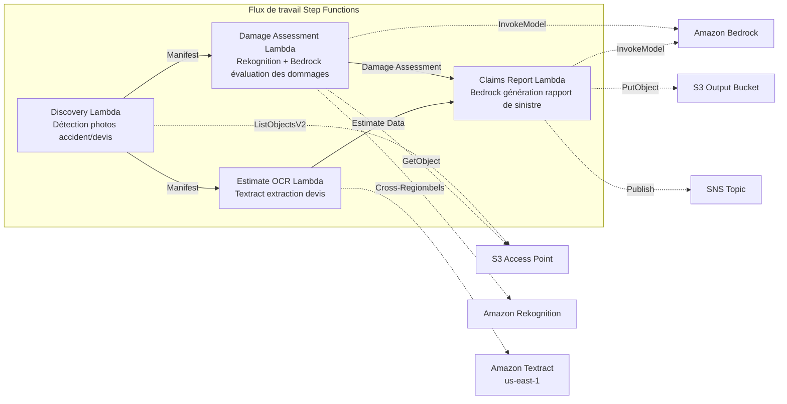

# UC14 : Assurance / Évaluation des dommages — Évaluation des dommages sur photos d'accident, OCR de devis, rapport d'expertise

🌐 **Language / 言語**: [日本語](README.md) | [English](README.en.md) | [한국어](README.ko.md) | [简体中文](README.zh-CN.md) | [繁體中文](README.zh-TW.md) | Français | [Deutsch](README.de.md) | [Español](README.es.md)

📚 **Documentation**: [Schéma d'architecture](docs/architecture.fr.md) | [Guide de démonstration](docs/demo-guide.fr.md)

## Aperçu

Il s'agit d'un flux de travail sans serveur qui exploite les S3 Access Points d'Amazon FSx for NetApp ONTAP pour réaliser l'évaluation des dommages sur les photos d'accident, l'extraction de texte par OCR à partir des devis et la génération automatique de rapports de sinistre d'assurance.

### Cas où ce modèle convient

- Les photos d'accident et les devis sont accumulés sur FSx for ONTAP
- Vous souhaitez automatiser la détection des dommages sur les photos d'accident avec Rekognition (étiquettes de dommages sur le véhicule, indicateurs de gravité, zones affectées)
- Vous souhaitez réaliser l'OCR des devis avec Textract (postes de réparation, coûts, heures de main-d'œuvre, pièces)
- Vous avez besoin d'un rapport de sinistre complet corrélant l'évaluation des dommages basée sur les photos avec les données de devis
- Vous souhaitez automatiser la gestion des indicateurs de revue manuelle lorsqu'aucune étiquette de dommage n'est détectée

### Cas où ce modèle ne convient pas

- Vous avez besoin d'un système de traitement des sinistres en temps réel
- Vous avez besoin d'un moteur complet d'expertise de sinistres (un logiciel dédié est plus approprié)
- Vous devez entraîner des modèles de détection de fraude à grande échelle
- Un environnement où l'accessibilité réseau à l'API REST ONTAP ne peut être assurée

### Fonctionnalités principales

- Détection automatique des photos d'accident (.jpg, .jpeg, .png) et des devis (.pdf, .tiff) via S3 AP
- Détection des dommages avec Rekognition (damage_type, severity_level, affected_components)
- Génération d'une évaluation structurée des dommages avec Bedrock
- OCR des devis avec Textract (inter-région) : postes de réparation, coûts, heures de main-d'œuvre, pièces
- Génération d'un rapport de sinistre complet avec Bedrock (JSON + format lisible par l'humain)
- Partage immédiat des résultats via notification SNS

## Success Metrics

### Outcome
Accélérer le processus d'expertise d'assurance en automatisant l'évaluation des dommages sur photos d'accident, l'OCR des devis et la génération de rapports d'expertise.

### Metrics
| Métrique | Objectif (exemple) |
|-----------|------------|
| Sinistres traités / exécution | > 100 claims |
| Précision de l'évaluation des dommages | > 85% |
| Taux de réussite de l'extraction OCR | > 90% |
| Temps de génération du rapport d'expertise | < 2 min / dossier |
| Coût / sinistre | < $0.50 |
| Taux de Human Review requis | > 30% (tous les dossiers à montant élevé vérifiés) |

### Measurement Method
Historique d'exécution Step Functions, détection de dommages Rekognition, résultats d'extraction Textract, rapports Bedrock, CloudWatch Metrics.

## Architecture



### Étapes du flux de travail

1. **Discovery** : Détecter les photos d'accident et les devis depuis S3 AP
2. **Damage Assessment** : Détecter les dommages avec Rekognition, générer une évaluation structurée des dommages avec Bedrock
3. **Estimate OCR** : Extraire le texte et les tableaux des devis avec Textract (inter-région)
4. **Claims Report** : Générer un rapport complet avec Bedrock qui corrèle l'évaluation des dommages et les données de devis

## Prérequis

- Compte AWS et autorisations IAM appropriées
- Système de fichiers FSx for ONTAP (ONTAP 9.17.1P4D3 ou ultérieur)
- Volume avec S3 Access Point activé (stockant les photos d'accident et les devis)
- VPC, sous-réseaux privés
- Accès aux modèles Amazon Bedrock activé (Claude / Nova)
- **Inter-région** : Étant donné que Textract n'est pas pris en charge dans ap-northeast-1, un appel inter-région vers us-east-1 est requis

## Étapes de déploiement

### 1. Vérifier les paramètres inter-région

Étant donné que Textract n'est pas pris en charge dans la région de Tokyo, configurez l'appel inter-région avec le paramètre `CrossRegionTarget`.

### 2. Déploiement SAM

```bash
# Prérequis : AWS SAM CLI est requis. 'sam build' empaquette automatiquement le code et la couche partagée.
sam build

sam deploy \
  --stack-name fsxn-insurance-claims \
  --parameter-overrides \
    S3AccessPointAlias=<your-volume-ext-s3alias> \
    S3AccessPointName=<your-s3ap-name> \
    VpcId=<your-vpc-id> \
    PrivateSubnetIds=<subnet-1>,<subnet-2> \
    ScheduleExpression="rate(1 hour)" \
    NotificationEmail=<your-email@example.com> \
    CrossRegion=us-east-1 \
    EnableVpcEndpoints=false \
    EnableCloudWatchAlarms=false \
  --capabilities CAPABILITY_NAMED_IAM \
  --resolve-s3 \
  --region ap-northeast-1
```

> **Remarque** : `template.yaml` s'utilise avec la SAM CLI (`sam build` + `sam deploy`).
> Pour déployer directement avec la commande `aws cloudformation deploy`, utilisez plutôt `template-deploy.yaml` (cela nécessite le pré-empaquetage des fichiers zip Lambda et leur téléversement vers S3).

## Liste des paramètres de configuration

| Paramètre | Description | Défaut | Requis |
|-----------|------|----------|------|
| `S3AccessPointAlias` | FSx for ONTAP S3 AP Alias (pour l'entrée) | — | ✅ |
| `S3AccessPointName` | Nom du S3 AP (pour l'octroi d'autorisations IAM basées sur l'ARN ; si omis, uniquement basé sur l'Alias) | `""` | ⚠️ Recommandé |
| `ScheduleExpression` | Expression de planification EventBridge Scheduler | `rate(1 hour)` | |
| `VpcId` | VPC ID | — | ✅ |
| `PrivateSubnetIds` | Liste des ID de sous-réseaux privés | — | ✅ |
| `NotificationEmail` | Adresse e-mail de notification SNS | — | ✅ |
| `CrossRegionTarget` | Région cible pour Textract | `us-east-1` | |
| `MapConcurrency` | Nombre d'exécutions parallèles de l'état Map | `10` | |
| `LambdaMemorySize` | Taille de mémoire Lambda (MB) | `512` | |
| `LambdaTimeout` | Délai d'expiration Lambda (secondes) | `300` | |
| `EnableVpcEndpoints` | Activer les Interface VPC Endpoints | `false` | |
| `EnableCloudWatchAlarms` | Activer les CloudWatch Alarms | `false` | |

## Nettoyage

```bash
aws s3 rm s3://fsxn-insurance-claims-output-${AWS_ACCOUNT_ID} --recursive

aws cloudformation delete-stack \
  --stack-name fsxn-insurance-claims \
  --region ap-northeast-1

aws cloudformation wait stack-delete-complete \
  --stack-name fsxn-insurance-claims \
  --region ap-northeast-1
```

## Supported Regions

UC14 utilise les services suivants :

| Service | Contrainte de région |
|---------|-------------|
| Amazon Rekognition | Disponible dans presque toutes les régions |
| Amazon Textract | Non pris en charge dans ap-northeast-1. Spécifiez une région prise en charge (par ex. us-east-1) via le paramètre `TEXTRACT_REGION` |
| Amazon Bedrock | Vérifiez les régions prises en charge ([Régions prises en charge par Bedrock](https://docs.aws.amazon.com/general/latest/gr/bedrock.html)) |
| AWS X-Ray | Disponible dans presque toutes les régions |
| CloudWatch EMF | Disponible dans presque toutes les régions |

> L'API Textract est appelée via le Cross-Region Client. Vérifiez vos exigences de résidence des données. Pour plus de détails, consultez la [Matrice de compatibilité des régions](../docs/region-compatibility.md).

## Liens de référence

- [Aperçu des FSx for ONTAP S3 Access Points](https://docs.aws.amazon.com/fsx/latest/ONTAPGuide/accessing-data-via-s3-access-points.html)
- [Détection d'étiquettes Amazon Rekognition](https://docs.aws.amazon.com/rekognition/latest/dg/labels.html)
- [Documentation Amazon Textract](https://docs.aws.amazon.com/textract/latest/dg/what-is.html)
- [Référence de l'API Amazon Bedrock](https://docs.aws.amazon.com/bedrock/latest/APIReference/API_runtime_InvokeModel.html)

---

## Liens vers la documentation AWS

| Service | Documentation |
|---------|------------|
| FSx for ONTAP | [Guide de l'utilisateur](https://docs.aws.amazon.com/fsx/latest/ONTAPGuide/what-is-fsx-ontap.html) |
| S3 Access Points | [S3 AP for FSx for ONTAP](https://docs.aws.amazon.com/fsx/latest/ONTAPGuide/s3-access-points.html) |
| Step Functions | [Guide du développeur](https://docs.aws.amazon.com/step-functions/latest/dg/welcome.html) |
| Amazon Textract | [Guide du développeur](https://docs.aws.amazon.com/textract/latest/dg/what-is.html) |
| Amazon Rekognition | [Guide du développeur](https://docs.aws.amazon.com/rekognition/latest/dg/what-is.html) |
| Amazon Bedrock | [Guide de l'utilisateur](https://docs.aws.amazon.com/bedrock/latest/userguide/what-is-bedrock.html) |

### Alignement avec le Well-Architected Framework

| Pilier | Mise en œuvre |
|----|------|
| Excellence opérationnelle | Traçage X-Ray, métriques EMF, surveillance de la précision d'expertise |
| Sécurité | IAM à moindre privilège, chiffrement KMS, contrôle d'accès aux données d'assurance |
| Fiabilité | Step Functions Retry/Catch, traitement parallèle (évaluation des dommages ∥ OCR) |
| Efficacité des performances | Traitement de chemins parallèles, analyse par lots Rekognition |
| Optimisation des coûts | Sans serveur, facturation à la page Textract |
| Durabilité | Exécution à la demande, traitement incrémentiel |

---

## Estimation des coûts (approximation mensuelle)

> **Note** : Ce qui suit sont des estimations pour la région ap-northeast-1, et les coûts réels varient selon l'utilisation. Vérifiez les tarifs les plus récents avec l'[AWS Pricing Calculator](https://calculator.aws/).

### Composants sans serveur (paiement à l'usage)

| Service | Prix unitaire | Utilisation estimée | Estimation mensuelle |
|---------|------|-----------|---------|
| Lambda | $0.0000166667/GB-sec | 4 fonctions × 30 claims/jour | ~$1-5 |
| S3 API (GetObject/ListObjects) | $0.0047/10K requests | ~10K requests/jour | ~$1.5 |
| Step Functions | $0.025/1K state transitions | ~1K transitions/jour | ~$0.75 |
| Bedrock (Nova Lite) | $0.00006/1K input tokens | ~40K tokens/exécution | ~$3-10 |
| Athena | $5/TB scanned | ~5 MB/requête | ~$0.5-2 |
| SNS | $0.50/100K notifications | ~100 notifications/jour | ~$0.15 |
| CloudWatch Logs | $0.76/GB ingested | ~1 GB/mois | ~$0.76 |
| Rekognition | $0.001/image |

### Coûts fixes (FSx for ONTAP — suppose un environnement existant)

| Composant | Mensuel |
|--------------|------|
| FSx for ONTAP (128 MBps, 1 TB) | ~$230 (partage l'environnement existant) |
| S3 Access Point | Aucun frais supplémentaire (frais S3 API uniquement) |

### Estimation totale

| Configuration | Estimation mensuelle |
|------|---------|
| Configuration minimale (une fois par jour) | ~$5-15 |
| Configuration standard (horaire) | ~$15-50 |
| Configuration à grande échelle (haute fréquence + alarmes) | ~$50-150 |

> **Governance Caveat** : Les estimations de coûts sont approximatives et non garanties. La facturation réelle varie selon les modèles d'utilisation, le volume de données et la région.

---

## Tests locaux

### Prerequisites — Vérification

```bash
# Vérifier les prérequis
aws --version          # AWS CLI v2
sam --version          # SAM CLI
python3 --version      # Python 3.9+
docker --version       # Docker (pour sam local)
aws sts get-caller-identity  # Identifiants AWS
```

### sam local invoke

```bash
# Compilation
# Prérequis : AWS SAM CLI est requis. 'sam build' empaquette automatiquement le code et la couche partagée.
sam build

# Exécution locale du Discovery Lambda
sam local invoke DiscoveryFunction --event events/discovery-event.json

# Avec remplacements de variables d'environnement
sam local invoke DiscoveryFunction \
  --event events/discovery-event.json \
  --env-vars env.json
```

### Tests unitaires

```bash
python3 -m pytest tests/ -v
```

Pour plus de détails, consultez le [Démarrage rapide des tests locaux](../docs/local-testing-quick-start.md).

---

## Exemple de sortie (Output Sample)

Exemple de sortie du pipeline d'expertise des dommages :

```json
{
  "discovery": {
    "status": "completed",
    "object_count": 8,
    "categories": {"damage_photo": 5, "estimate_doc": 3}
  },
  "damage_assessment": [
    {
      "key": "claims/CLM-2026-001/photo-front.jpg",
      "damage_severity": "moderate",
      "damage_type": "dent",
      "affected_area": "front_bumper",
      "confidence": 0.91,
      "estimated_repair_cost_jpy": 150000
    }
  ],
  "estimate_ocr": [
    {
      "key": "claims/CLM-2026-001/repair-estimate.pdf",
      "total_amount": 180000,
      "parts_cost": 120000,
      "labor_cost": 60000,
      "vendor": "Auto Repair Tokyo"
    }
  ],
  "correlation_report": {
    "claim_id": "CLM-2026-001",
    "ai_estimate_vs_vendor": {"difference_pct": 16.7, "status": "WITHIN_THRESHOLD"},
    "recommendation": "approve_with_standard_review"
  }
}
```

> **Note** : Ce qui précède est un exemple de sortie, et les valeurs réelles varient selon l'environnement et les données d'entrée. Les chiffres de référence sont un sizing reference, pas un service limit.

---

## Governance Note

> Ce modèle fournit des conseils d'architecture technique. Il ne s'agit pas de conseils juridiques, de conformité ou réglementaires. Les organisations doivent consulter des professionnels qualifiés.

---

## S3AP Compatibility

Pour les contraintes de compatibilité, le dépannage et les modèles de déclenchement des S3 Access Points for FSx for ONTAP, consultez les [S3AP Compatibility Notes](../docs/s3ap-compatibility-notes.md).
