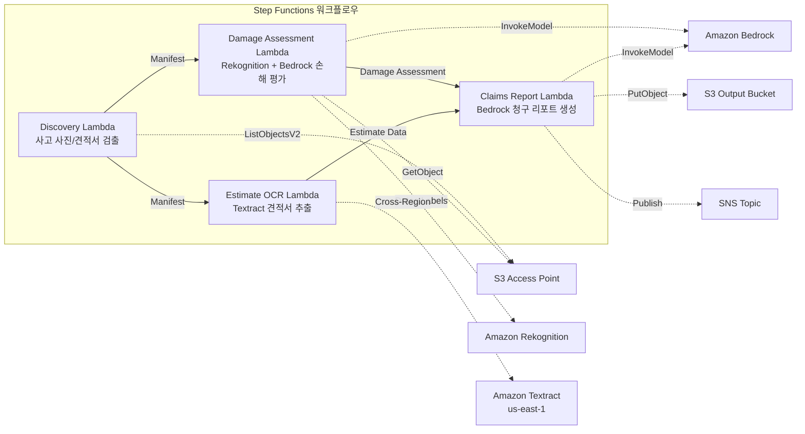

# UC14: 보험 / 손해 사정 — 사고 사진 손해 평가·견적서 OCR·사정 리포트

🌐 **Language / 言語**: [日本語](README.md) | [English](README.en.md) | 한국어 | [简体中文](README.zh-CN.md) | [繁體中文](README.zh-TW.md) | [Français](README.fr.md) | [Deutsch](README.de.md) | [Español](README.es.md)

📚 **문서**: [아키텍처 다이어그램](docs/architecture.ko.md) | [데모 가이드](docs/demo-guide.ko.md)

## 개요

Amazon FSx for NetApp ONTAP의 S3 Access Points를 활용하여 사고 사진의 손해 평가, 견적서의 OCR 텍스트 추출, 보험금 청구 리포트 자동 생성을 실현하는 서버리스 워크플로우입니다.

### 이 패턴이 적합한 경우

- 사고 사진이나 견적서가 FSx for ONTAP에 축적되어 있다
- Rekognition을 통한 사고 사진의 손해 검출(차량 손해 라벨, 심각도 지표, 영향 부위)을 자동화하고 싶다
- Textract를 통한 견적서 OCR(수리 항목, 비용, 공수, 부품)을 실시하고 싶다
- 사진 기반 손해 평가와 견적서 데이터를 상관시킨 포괄적 보험금 청구 리포트가 필요하다
- 손해 라벨 미검출 시의 수동 검토 플래그 관리를 자동화하고 싶다

### 이 패턴이 적합하지 않은 경우

- 실시간 보험금 청구 처리 시스템이 필요하다
- 완전한 보험금 사정 엔진(전용 소프트웨어가 적합)이 필요하다
- 대규모 부정 탐지 모델의 학습이 필요하다
- ONTAP REST API로의 네트워크 도달성을 확보할 수 없는 환경

### 주요 기능

- S3 AP를 통해 사고 사진(.jpg, .jpeg, .png)과 견적서(.pdf, .tiff)를 자동 검출
- Rekognition을 통한 손해 검출(damage_type, severity_level, affected_components)
- Bedrock을 통한 구조화된 손해 평가 생성
- Textract(크로스 리전)를 통한 견적서 OCR(수리 항목, 비용, 공수, 부품)
- Bedrock을 통한 포괄적 보험금 청구 리포트 생성(JSON + 사람이 읽을 수 있는 형식)
- SNS 알림을 통한 결과의 즉시 공유

## Success Metrics

### Outcome
사고 사진 손해 평가·견적서 OCR·사정 리포트 생성의 자동화를 통해 보험 사정 프로세스를 신속화한다.

### Metrics
| 메트릭 | 목표값(예) |
|-----------|------------|
| 처리된 청구 건수 / 실행 | > 100 claims |
| 손해 평가 정확도 | > 85% |
| OCR 데이터 추출 성공률 | > 90% |
| 사정 리포트 생성 시간 | < 2분 / 건 |
| 비용 / 청구 | < $0.50 |
| Human Review 필수 비율 | > 30%(고액 안건은 전건 확인) |

### Measurement Method
Step Functions 실행 이력, Rekognition 손해 검출, Textract 추출 결과, Bedrock 리포트, CloudWatch Metrics.

## 아키텍처



### 워크플로우 단계

1. **Discovery**: S3 AP에서 사고 사진과 견적서를 검출
2. **Damage Assessment**: Rekognition으로 손해 검출, Bedrock으로 구조화된 손해 평가 생성
3. **Estimate OCR**: Textract(크로스 리전)로 견적서에서 텍스트·테이블 추출
4. **Claims Report**: Bedrock으로 손해 평가와 견적서 데이터를 상관시킨 포괄적 리포트를 생성

## 전제 조건

- AWS 계정과 적절한 IAM 권한
- FSx for ONTAP 파일 시스템(ONTAP 9.17.1P4D3 이상)
- S3 Access Point가 활성화된 볼륨(사고 사진·견적서를 저장)
- VPC, 프라이빗 서브넷
- Amazon Bedrock 모델 액세스 활성화(Claude / Nova)
- **크로스 리전**: Textract는 ap-northeast-1 미지원이므로 us-east-1으로의 크로스 리전 호출이 필요

## 배포 절차

### 1. 크로스 리전 파라미터 확인

Textract는 도쿄 리전 미지원이므로 `CrossRegionTarget` 파라미터로 크로스 리전 호출을 설정합니다.

### 2. SAM 배포

```bash
# 전제: AWS SAM CLI가 필요합니다. 'sam build'가 코드와 공유 레이어를 자동으로 패키징합니다.
sam build

sam deploy \
  --stack-name fsxn-insurance-claims \
  --parameter-overrides \
    S3AccessPointAlias=<your-volume-ext-s3alias> \
    S3AccessPointName=<your-s3ap-name> \
    VpcId=<your-vpc-id> \
    PrivateSubnetIds=<subnet-1>,<subnet-2> \
    ScheduleExpression="rate(1 hour)" \
    NotificationEmail=<your-email@example.com> \
    CrossRegion=us-east-1 \
    EnableVpcEndpoints=false \
    EnableCloudWatchAlarms=false \
  --capabilities CAPABILITY_NAMED_IAM \
  --resolve-s3 \
  --region ap-northeast-1
```

> **주의**: `template.yaml`은 SAM CLI(`sam build` + `sam deploy`)로 사용합니다.
> `aws cloudformation deploy` 명령으로 직접 배포하는 경우 `template-deploy.yaml`을 사용하십시오(Lambda zip 파일의 사전 패키징과 S3 업로드가 필요합니다).

## 설정 파라미터 목록

| 파라미터 | 설명 | 기본값 | 필수 |
|-----------|------|----------|------|
| `S3AccessPointAlias` | FSx for ONTAP S3 AP Alias(입력용) | — | ✅ |
| `S3AccessPointName` | S3 AP 이름(ARN 기반 IAM 권한 부여용. 생략 시 Alias 기반만) | `""` | ⚠️ 권장 |
| `ScheduleExpression` | EventBridge Scheduler의 스케줄 식 | `rate(1 hour)` | |
| `VpcId` | VPC ID | — | ✅ |
| `PrivateSubnetIds` | 프라이빗 서브넷 ID 목록 | — | ✅ |
| `NotificationEmail` | SNS 알림 대상 이메일 주소 | — | ✅ |
| `CrossRegionTarget` | Textract의 대상 리전 | `us-east-1` | |
| `MapConcurrency` | Map 상태의 병렬 실행 수 | `10` | |
| `LambdaMemorySize` | Lambda 메모리 크기 (MB) | `512` | |
| `LambdaTimeout` | Lambda 타임아웃 (초) | `300` | |
| `EnableVpcEndpoints` | Interface VPC Endpoints 활성화 | `false` | |
| `EnableCloudWatchAlarms` | CloudWatch Alarms 활성화 | `false` | |

## 정리

```bash
aws s3 rm s3://fsxn-insurance-claims-output-${AWS_ACCOUNT_ID} --recursive

aws cloudformation delete-stack \
  --stack-name fsxn-insurance-claims \
  --region ap-northeast-1

aws cloudformation wait stack-delete-complete \
  --stack-name fsxn-insurance-claims \
  --region ap-northeast-1
```

## Supported Regions

UC14는 다음 서비스를 사용합니다:

| 서비스 | 리전 제약 |
|---------|-------------|
| Amazon Rekognition | 거의 모든 리전에서 사용 가능 |
| Amazon Textract | ap-northeast-1 미지원. `TEXTRACT_REGION` 파라미터로 지원 리전(us-east-1 등)을 지정 |
| Amazon Bedrock | 지원 리전을 확인([Bedrock 지원 리전](https://docs.aws.amazon.com/general/latest/gr/bedrock.html)) |
| AWS X-Ray | 거의 모든 리전에서 사용 가능 |
| CloudWatch EMF | 거의 모든 리전에서 사용 가능 |

> Cross-Region Client를 통해 Textract API를 호출합니다. 데이터 레지던시 요구 사항을 확인하십시오. 자세한 내용은 [리전 호환성 매트릭스](../docs/region-compatibility.md)를 참조하십시오.

## 참고 링크

- [FSx for ONTAP S3 Access Points 개요](https://docs.aws.amazon.com/fsx/latest/ONTAPGuide/accessing-data-via-s3-access-points.html)
- [Amazon Rekognition 라벨 검출](https://docs.aws.amazon.com/rekognition/latest/dg/labels.html)
- [Amazon Textract 문서](https://docs.aws.amazon.com/textract/latest/dg/what-is.html)
- [Amazon Bedrock API 레퍼런스](https://docs.aws.amazon.com/bedrock/latest/APIReference/API_runtime_InvokeModel.html)

---

## AWS 문서 링크

| 서비스 | 문서 |
|---------|------------|
| FSx for ONTAP | [사용자 가이드](https://docs.aws.amazon.com/fsx/latest/ONTAPGuide/what-is-fsx-ontap.html) |
| S3 Access Points | [S3 AP for FSx for ONTAP](https://docs.aws.amazon.com/fsx/latest/ONTAPGuide/s3-access-points.html) |
| Step Functions | [개발자 가이드](https://docs.aws.amazon.com/step-functions/latest/dg/welcome.html) |
| Amazon Textract | [개발자 가이드](https://docs.aws.amazon.com/textract/latest/dg/what-is.html) |
| Amazon Rekognition | [개발자 가이드](https://docs.aws.amazon.com/rekognition/latest/dg/what-is.html) |
| Amazon Bedrock | [사용자 가이드](https://docs.aws.amazon.com/bedrock/latest/userguide/what-is-bedrock.html) |

### Well-Architected Framework 대응

| 기둥 | 대응 |
|----|------|
| 운영 우수성 | X-Ray 추적, EMF 메트릭, 사정 정확도 모니터링 |
| 보안 | 최소 권한 IAM, KMS 암호화, 보험 데이터 액세스 제어 |
| 신뢰성 | Step Functions Retry/Catch, 병렬 처리(손해 평가 ∥ OCR) |
| 성능 효율성 | 병렬 경로 처리, Rekognition 배치 분석 |
| 비용 최적화 | 서버리스, Textract 페이지 단위 과금 |
| 지속 가능성 | 온디맨드 실행, 증분 처리 |

---

## 비용 견적(월액 개산)

> **비고**: 아래는 ap-northeast-1 리전의 개산이며, 실제 비용은 사용량에 따라 다릅니다. 최신 요금은 [AWS Pricing Calculator](https://calculator.aws/)에서 확인하십시오.

### 서버리스 컴포넌트(종량 과금)

| 서비스 | 단가 | 예상 사용량 | 월 예상액 |
|---------|------|-----------|---------|
| Lambda | $0.0000166667/GB-sec | 4 함수 × 30 claims/일 | ~$1-5 |
| S3 API (GetObject/ListObjects) | $0.0047/10K requests | ~10K requests/일 | ~$1.5 |
| Step Functions | $0.025/1K state transitions | ~1K transitions/일 | ~$0.75 |
| Bedrock (Nova Lite) | $0.00006/1K input tokens | ~40K tokens/실행 | ~$3-10 |
| Athena | $5/TB scanned | ~5 MB/쿼리 | ~$0.5-2 |
| SNS | $0.50/100K notifications | ~100 notifications/일 | ~$0.15 |
| CloudWatch Logs | $0.76/GB ingested | ~1 GB/월 | ~$0.76 |
| Rekognition | $0.001/image |

### 고정 비용(FSx for ONTAP — 기존 환경 전제)

| 컴포넌트 | 월액 |
|--------------|------|
| FSx for ONTAP (128 MBps, 1 TB) | ~$230 (기존 환경 공유) |
| S3 Access Point | 추가 요금 없음(S3 API 요금만) |

### 합계 개산

| 구성 | 월 예상액 |
|------|---------|
| 최소 구성(일 1회 실행) | ~$5-15 |
| 표준 구성(시간별 실행) | ~$15-50 |
| 대규모 구성(고빈도 + 알람) | ~$50-150 |

> **Governance Caveat**: 비용 견적은 개산이며 보증값이 아닙니다. 실제 청구액은 사용 패턴, 데이터 양, 리전에 따라 다릅니다.

---

## 로컬 테스트

### Prerequisites 확인

```bash
# 전제 조건 확인
aws --version          # AWS CLI v2
sam --version          # SAM CLI
python3 --version      # Python 3.9+
docker --version       # Docker (sam local 용)
aws sts get-caller-identity  # AWS 자격 증명
```

### sam local invoke

```bash
# 빌드
# 전제: AWS SAM CLI가 필요합니다. 'sam build'가 코드와 공유 레이어를 자동으로 패키징합니다.
sam build

# Discovery Lambda의 로컬 실행
sam local invoke DiscoveryFunction --event events/discovery-event.json

# 환경 변수 오버라이드 포함
sam local invoke DiscoveryFunction \
  --event events/discovery-event.json \
  --env-vars env.json
```

### 유닛 테스트

```bash
python3 -m pytest tests/ -v
```

자세한 내용은 [로컬 테스트 퀵 스타트](../docs/local-testing-quick-start.md)를 참조하십시오.

---

## 출력 샘플 (Output Sample)

손해 사정 파이프라인의 출력 예:

```json
{
  "discovery": {
    "status": "completed",
    "object_count": 8,
    "categories": {"damage_photo": 5, "estimate_doc": 3}
  },
  "damage_assessment": [
    {
      "key": "claims/CLM-2026-001/photo-front.jpg",
      "damage_severity": "moderate",
      "damage_type": "dent",
      "affected_area": "front_bumper",
      "confidence": 0.91,
      "estimated_repair_cost_jpy": 150000
    }
  ],
  "estimate_ocr": [
    {
      "key": "claims/CLM-2026-001/repair-estimate.pdf",
      "total_amount": 180000,
      "parts_cost": 120000,
      "labor_cost": 60000,
      "vendor": "오토리페어 도쿄"
    }
  ],
  "correlation_report": {
    "claim_id": "CLM-2026-001",
    "ai_estimate_vs_vendor": {"difference_pct": 16.7, "status": "WITHIN_THRESHOLD"},
    "recommendation": "approve_with_standard_review"
  }
}
```

> **비고**: 위는 샘플 출력이며, 실제 값은 환경·입력 데이터에 따라 다릅니다. 벤치마크 수치는 sizing reference이며 service limit이 아닙니다.

---

## Governance Note

> 본 패턴은 기술 아키텍처 가이던스를 제공합니다. 법적·컴플라이언스·규제상의 조언이 아닙니다. 조직은 자격을 갖춘 전문가에게 상담하십시오.

---

## S3AP Compatibility

S3 Access Points for FSx for ONTAP의 호환성 제약, 트러블슈팅, 트리거 패턴에 대해서는 [S3AP Compatibility Notes](../docs/s3ap-compatibility-notes.md)를 참조하십시오.
