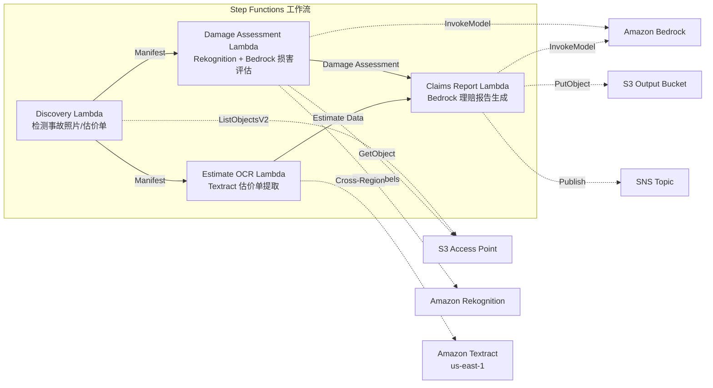

# UC14：保险 / 定损 — 事故照片损害评估、估价单 OCR、定损报告

🌐 **Language / 言語**: [日本語](README.md) | [English](README.en.md) | [한국어](README.ko.md) | 简体中文 | [繁體中文](README.zh-TW.md) | [Français](README.fr.md) | [Deutsch](README.de.md) | [Español](README.es.md)

📚 **文档**: [架构图](docs/architecture.zh-CN.md) | [演示指南](docs/demo-guide.zh-CN.md)

## 概述

这是一个利用 Amazon FSx for NetApp ONTAP 的 S3 Access Points 实现事故照片损害评估、估价单 OCR 文本提取、保险理赔报告自动生成的无服务器工作流。

### 适合此模式的场景

- 事故照片或估价单已积累在 FSx for ONTAP 上
- 希望自动化通过 Rekognition 进行的事故照片损害检测（车辆损害标签、严重程度指标、受影响部位）
- 希望通过 Textract 实施估价单 OCR（维修项目、费用、工时、部件）
- 需要将基于照片的损害评估与估价单数据相关联的综合保险理赔报告
- 希望自动化未检测到损害标签时的人工审核标志管理

### 不适合此模式的场景

- 需要实时的保险理赔处理系统
- 需要完整的保险定损引擎（专用软件更为合适）
- 需要训练大规模欺诈检测模型
- 无法确保到 ONTAP REST API 的网络可达性的环境

### 主要功能

- 通过 S3 AP 自动检测事故照片（.jpg, .jpeg, .png）和估价单（.pdf, .tiff）
- 通过 Rekognition 进行损害检测（damage_type, severity_level, affected_components）
- 通过 Bedrock 生成结构化损害评估
- 通过 Textract（跨区域）进行估价单 OCR（维修项目、费用、工时、部件）
- 通过 Bedrock 生成综合保险理赔报告（JSON + 人类可读格式）
- 通过 SNS 通知即时共享结果

## Success Metrics

### Outcome
通过自动化事故照片损害评估、估价单 OCR、定损报告生成，加快保险定损流程。

### Metrics
| 指标 | 目标值（示例） |
|-----------|------------|
| 已处理理赔件数 / 执行 | > 100 claims |
| 损害评估精度 | > 85% |
| OCR 数据提取成功率 | > 90% |
| 定损报告生成时间 | < 2 分钟 / 件 |
| 成本 / 理赔 | < $0.50 |
| Human Review 必需率 | > 30%（高额案件全部审核） |

### Measurement Method
Step Functions 执行历史、Rekognition 损害检测、Textract 提取结果、Bedrock 报告、CloudWatch Metrics。

## 架构



### 工作流步骤

1. **Discovery**: 从 S3 AP 检测事故照片和估价单
2. **Damage Assessment**: 用 Rekognition 检测损害，用 Bedrock 生成结构化损害评估
3. **Estimate OCR**: 用 Textract（跨区域）从估价单提取文本和表格
4. **Claims Report**: 用 Bedrock 生成将损害评估与估价单数据相关联的综合报告

## 前提条件

- AWS 账户和适当的 IAM 权限
- FSx for ONTAP 文件系统（ONTAP 9.17.1P4D3 或更高版本）
- 已启用 S3 Access Point 的卷（存储事故照片·估价单）
- VPC、私有子网
- 已启用 Amazon Bedrock 模型访问（Claude / Nova）
- **跨区域**: 由于 Textract 不支持 ap-northeast-1，因此需要跨区域调用 us-east-1

## 部署步骤

### 1. 确认跨区域参数

由于 Textract 不支持东京区域，请使用 `CrossRegionTarget` 参数配置跨区域调用。

### 2. SAM 部署

```bash
# 前提：需要 AWS SAM CLI。'sam build' 会自动打包代码和共享层。
sam build

sam deploy \
  --stack-name fsxn-insurance-claims \
  --parameter-overrides \
    S3AccessPointAlias=<your-volume-ext-s3alias> \
    S3AccessPointName=<your-s3ap-name> \
    VpcId=<your-vpc-id> \
    PrivateSubnetIds=<subnet-1>,<subnet-2> \
    ScheduleExpression="rate(1 hour)" \
    NotificationEmail=<your-email@example.com> \
    CrossRegion=us-east-1 \
    EnableVpcEndpoints=false \
    EnableCloudWatchAlarms=false \
  --capabilities CAPABILITY_NAMED_IAM \
  --resolve-s3 \
  --region ap-northeast-1
```

> **注意**: `template.yaml` 用于 SAM CLI（`sam build` + `sam deploy`）。
> 若使用 `aws cloudformation deploy` 命令直接部署，请改用 `template-deploy.yaml`（需要事先打包 Lambda zip 文件并上传到 S3）。

## 配置参数一览

| 参数 | 说明 | 默认值 | 必填 |
|-----------|------|----------|------|
| `S3AccessPointAlias` | FSx for ONTAP S3 AP Alias（输入用） | — | ✅ |
| `S3AccessPointName` | S3 AP 名称（用于基于 ARN 的 IAM 权限授予。省略时仅基于 Alias） | `""` | ⚠️ 推荐 |
| `ScheduleExpression` | EventBridge Scheduler 的调度表达式 | `rate(1 hour)` | |
| `VpcId` | VPC ID | — | ✅ |
| `PrivateSubnetIds` | 私有子网 ID 列表 | — | ✅ |
| `NotificationEmail` | SNS 通知目标邮箱地址 | — | ✅ |
| `CrossRegionTarget` | Textract 的目标区域 | `us-east-1` | |
| `MapConcurrency` | Map 状态的并行执行数 | `10` | |
| `LambdaMemorySize` | Lambda 内存大小 (MB) | `512` | |
| `LambdaTimeout` | Lambda 超时 (秒) | `300` | |
| `EnableVpcEndpoints` | 启用 Interface VPC Endpoints | `false` | |
| `EnableCloudWatchAlarms` | 启用 CloudWatch Alarms | `false` | |

## 清理

```bash
aws s3 rm s3://fsxn-insurance-claims-output-${AWS_ACCOUNT_ID} --recursive

aws cloudformation delete-stack \
  --stack-name fsxn-insurance-claims \
  --region ap-northeast-1

aws cloudformation wait stack-delete-complete \
  --stack-name fsxn-insurance-claims \
  --region ap-northeast-1
```

## Supported Regions

UC14 使用以下服务：

| 服务 | 区域限制 |
|---------|-------------|
| Amazon Rekognition | 几乎所有区域均可使用 |
| Amazon Textract | 不支持 ap-northeast-1。通过 `TEXTRACT_REGION` 参数指定支持的区域（如 us-east-1） |
| Amazon Bedrock | 确认支持的区域（[Bedrock 支持区域](https://docs.aws.amazon.com/general/latest/gr/bedrock.html)） |
| AWS X-Ray | 几乎所有区域均可使用 |
| CloudWatch EMF | 几乎所有区域均可使用 |

> 通过 Cross-Region Client 调用 Textract API。请确认数据驻留要求。详情请参阅 [区域兼容性矩阵](../docs/region-compatibility.md)。

## 参考链接

- [FSx for ONTAP S3 Access Points 概述](https://docs.aws.amazon.com/fsx/latest/ONTAPGuide/accessing-data-via-s3-access-points.html)
- [Amazon Rekognition 标签检测](https://docs.aws.amazon.com/rekognition/latest/dg/labels.html)
- [Amazon Textract 文档](https://docs.aws.amazon.com/textract/latest/dg/what-is.html)
- [Amazon Bedrock API 参考](https://docs.aws.amazon.com/bedrock/latest/APIReference/API_runtime_InvokeModel.html)

---

## AWS 文档链接

| 服务 | 文档 |
|---------|------------|
| FSx for ONTAP | [用户指南](https://docs.aws.amazon.com/fsx/latest/ONTAPGuide/what-is-fsx-ontap.html) |
| S3 Access Points | [S3 AP for FSx for ONTAP](https://docs.aws.amazon.com/fsx/latest/ONTAPGuide/s3-access-points.html) |
| Step Functions | [开发者指南](https://docs.aws.amazon.com/step-functions/latest/dg/welcome.html) |
| Amazon Textract | [开发者指南](https://docs.aws.amazon.com/textract/latest/dg/what-is.html) |
| Amazon Rekognition | [开发者指南](https://docs.aws.amazon.com/rekognition/latest/dg/what-is.html) |
| Amazon Bedrock | [用户指南](https://docs.aws.amazon.com/bedrock/latest/userguide/what-is-bedrock.html) |

### Well-Architected Framework 对应

| 支柱 | 对应 |
|----|------|
| 卓越运营 | X-Ray 跟踪、EMF 指标、定损精度监控 |
| 安全性 | 最小权限 IAM、KMS 加密、保险数据访问控制 |
| 可靠性 | Step Functions Retry/Catch、并行处理（损害评估 ∥ OCR） |
| 性能效率 | 并行路径处理、Rekognition 批量分析 |
| 成本优化 | 无服务器、Textract 按页计费 |
| 可持续性 | 按需执行、增量处理 |

---

## 成本估算（每月概算）

> **备注**: 以下为 ap-northeast-1 区域的概算，实际成本因使用量而异。请通过 [AWS Pricing Calculator](https://calculator.aws/) 确认最新价格。

### 无服务器组件（按量计费）

| 服务 | 单价 | 预估用量 | 每月概算 |
|---------|------|-----------|---------|
| Lambda | $0.0000166667/GB-sec | 4 个函数 × 30 claims/天 | ~$1-5 |
| S3 API (GetObject/ListObjects) | $0.0047/10K requests | ~10K requests/天 | ~$1.5 |
| Step Functions | $0.025/1K state transitions | ~1K transitions/天 | ~$0.75 |
| Bedrock (Nova Lite) | $0.00006/1K input tokens | ~40K tokens/次执行 | ~$3-10 |
| Athena | $5/TB scanned | ~5 MB/查询 | ~$0.5-2 |
| SNS | $0.50/100K notifications | ~100 notifications/天 | ~$0.15 |
| CloudWatch Logs | $0.76/GB ingested | ~1 GB/月 | ~$0.76 |
| Rekognition | $0.001/image |

### 固定成本（FSx for ONTAP — 以现有环境为前提）

| 组件 | 每月 |
|--------------|------|
| FSx for ONTAP (128 MBps, 1 TB) | ~$230（共享现有环境） |
| S3 Access Point | 无额外费用（仅 S3 API 费用） |

### 合计概算

| 配置 | 每月概算 |
|------|---------|
| 最小配置（每日执行 1 次） | ~$5-15 |
| 标准配置（每小时执行） | ~$15-50 |
| 大规模配置（高频 + 告警） | ~$50-150 |

> **Governance Caveat**: 成本估算为概算，并非保证值。实际账单因使用模式、数据量、区域而异。

---

## 本地测试

### Prerequisites 检查

```bash
# 确认前提条件
aws --version          # AWS CLI v2
sam --version          # SAM CLI
python3 --version      # Python 3.9+
docker --version       # Docker (sam local 用)
aws sts get-caller-identity  # AWS 凭证
```

### sam local invoke

```bash
# 构建
# 前提：需要 AWS SAM CLI。'sam build' 会自动打包代码和共享层。
sam build

# Discovery Lambda 的本地执行
sam local invoke DiscoveryFunction --event events/discovery-event.json

# 附带环境变量覆盖
sam local invoke DiscoveryFunction \
  --event events/discovery-event.json \
  --env-vars env.json
```

### 单元测试

```bash
python3 -m pytest tests/ -v
```

详情请参阅 [本地测试快速入门](../docs/local-testing-quick-start.md)。

---

## 输出示例 (Output Sample)

损害定损管道的输出示例：

```json
{
  "discovery": {
    "status": "completed",
    "object_count": 8,
    "categories": {"damage_photo": 5, "estimate_doc": 3}
  },
  "damage_assessment": [
    {
      "key": "claims/CLM-2026-001/photo-front.jpg",
      "damage_severity": "moderate",
      "damage_type": "dent",
      "affected_area": "front_bumper",
      "confidence": 0.91,
      "estimated_repair_cost_jpy": 150000
    }
  ],
  "estimate_ocr": [
    {
      "key": "claims/CLM-2026-001/repair-estimate.pdf",
      "total_amount": 180000,
      "parts_cost": 120000,
      "labor_cost": 60000,
      "vendor": "东京汽车修理厂"
    }
  ],
  "correlation_report": {
    "claim_id": "CLM-2026-001",
    "ai_estimate_vs_vendor": {"difference_pct": 16.7, "status": "WITHIN_THRESHOLD"},
    "recommendation": "approve_with_standard_review"
  }
}
```

> **备注**: 以上为示例输出，实际值因环境·输入数据而异。基准数值为 sizing reference，并非 service limit。

---

## Governance Note

> 本模式提供技术架构指导。它不是法律、合规或监管方面的建议。组织应咨询合格的专业人士。

---

## S3AP Compatibility

有关 S3 Access Points for FSx for ONTAP 的兼容性约束、故障排除和触发模式，请参阅 [S3AP Compatibility Notes](../docs/s3ap-compatibility-notes.md)。
