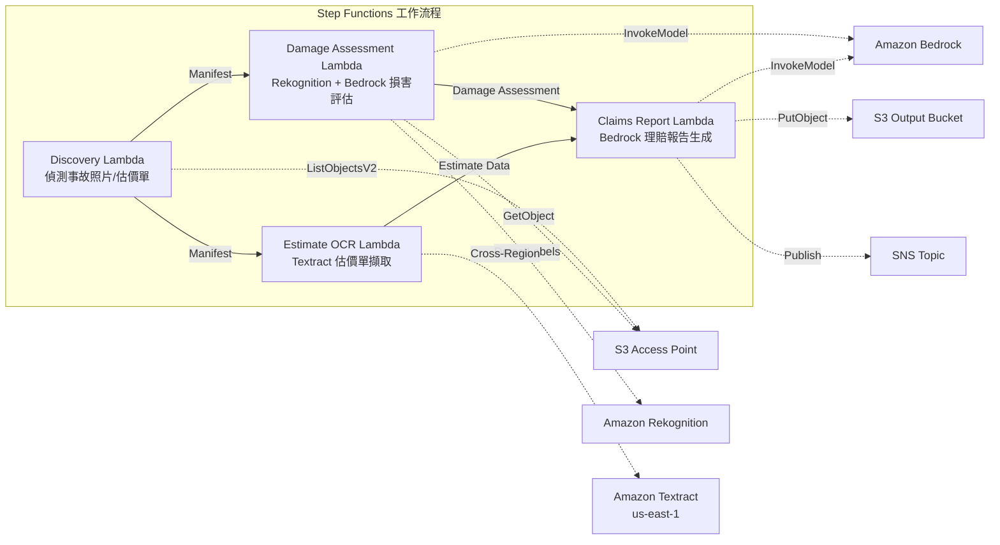

# UC14：保險 / 定損 — 事故照片損害評估、估價單 OCR、定損報告

🌐 **Language / 言語**: [日本語](README.md) | [English](README.en.md) | [한국어](README.ko.md) | [简体中文](README.zh-CN.md) | 繁體中文 | [Français](README.fr.md) | [Deutsch](README.de.md) | [Español](README.es.md)

📚 **文件**: [架構圖](docs/architecture.zh-TW.md) | [示範指南](docs/demo-guide.zh-TW.md)

## 概述

這是一個利用 Amazon FSx for NetApp ONTAP 的 S3 Access Points 實現事故照片損害評估、估價單 OCR 文字擷取、保險理賠報告自動生成的無伺服器工作流程。

### 適合此模式的情境

- 事故照片或估價單已累積在 FSx for ONTAP 上
- 希望自動化透過 Rekognition 進行的事故照片損害偵測（車輛損害標籤、嚴重程度指標、受影響部位）
- 希望透過 Textract 實施估價單 OCR（維修項目、費用、工時、零件）
- 需要將以照片為基礎的損害評估與估價單資料相關聯的綜合保險理賠報告
- 希望自動化未偵測到損害標籤時的人工審查旗標管理

### 不適合此模式的情境

- 需要即時的保險理賠處理系統
- 需要完整的保險定損引擎（專用軟體更為合適）
- 需要訓練大規模詐欺偵測模型
- 無法確保連接到 ONTAP REST API 的網路可達性的環境

### 主要功能

- 透過 S3 AP 自動偵測事故照片（.jpg, .jpeg, .png）和估價單（.pdf, .tiff）
- 透過 Rekognition 進行損害偵測（damage_type, severity_level, affected_components）
- 透過 Bedrock 生成結構化損害評估
- 透過 Textract（跨區域）進行估價單 OCR（維修項目、費用、工時、零件）
- 透過 Bedrock 生成綜合保險理賠報告（JSON + 人類可讀格式）
- 透過 SNS 通知即時共享結果

## Success Metrics

### Outcome
透過自動化事故照片損害評估、估價單 OCR、定損報告生成，加快保險定損流程。

### Metrics
| 指標 | 目標值（範例） |
|-----------|------------|
| 已處理理賠件數 / 執行 | > 100 claims |
| 損害評估精度 | > 85% |
| OCR 資料擷取成功率 | > 90% |
| 定損報告生成時間 | < 2 分鐘 / 件 |
| 成本 / 理賠 | < $0.50 |
| Human Review 必需率 | > 30%（高額案件全部審查） |

### Measurement Method
Step Functions 執行歷史、Rekognition 損害偵測、Textract 擷取結果、Bedrock 報告、CloudWatch Metrics。

## 架構



### 工作流程步驟

1. **Discovery**: 從 S3 AP 偵測事故照片和估價單
2. **Damage Assessment**: 用 Rekognition 偵測損害，用 Bedrock 生成結構化損害評估
3. **Estimate OCR**: 用 Textract（跨區域）從估價單擷取文字和表格
4. **Claims Report**: 用 Bedrock 生成將損害評估與估價單資料相關聯的綜合報告

## 前提條件

- AWS 帳戶和適當的 IAM 權限
- FSx for ONTAP 檔案系統（ONTAP 9.17.1P4D3 或更新版本）
- 已啟用 S3 Access Point 的磁碟區（儲存事故照片·估價單）
- VPC、私有子網路
- 已啟用 Amazon Bedrock 模型存取（Claude / Nova）
- **跨區域**: 由於 Textract 不支援 ap-northeast-1，因此需要跨區域呼叫 us-east-1

## 部署步驟

### 1. 確認跨區域參數

由於 Textract 不支援東京區域，請使用 `CrossRegionTarget` 參數設定跨區域呼叫。

### 2. SAM 部署

```bash
# 前提：需要 AWS SAM CLI。'sam build' 會自動封裝程式碼和共享層。
sam build

sam deploy \
  --stack-name fsxn-insurance-claims \
  --parameter-overrides \
    S3AccessPointAlias=<your-volume-ext-s3alias> \
    S3AccessPointName=<your-s3ap-name> \
    VpcId=<your-vpc-id> \
    PrivateSubnetIds=<subnet-1>,<subnet-2> \
    ScheduleExpression="rate(1 hour)" \
    NotificationEmail=<your-email@example.com> \
    CrossRegion=us-east-1 \
    EnableVpcEndpoints=false \
    EnableCloudWatchAlarms=false \
  --capabilities CAPABILITY_NAMED_IAM \
  --resolve-s3 \
  --region ap-northeast-1
```

> **注意**: `template.yaml` 用於 SAM CLI（`sam build` + `sam deploy`）。
> 若使用 `aws cloudformation deploy` 命令直接部署，請改用 `template-deploy.yaml`（需要事先封裝 Lambda zip 檔案並上傳到 S3）。

## 設定參數一覽

| 參數 | 說明 | 預設值 | 必填 |
|-----------|------|----------|------|
| `S3AccessPointAlias` | FSx for ONTAP S3 AP Alias（輸入用） | — | ✅ |
| `S3AccessPointName` | S3 AP 名稱（用於以 ARN 為基礎的 IAM 權限授予。省略時僅以 Alias 為基礎） | `""` | ⚠️ 建議 |
| `ScheduleExpression` | EventBridge Scheduler 的排程運算式 | `rate(1 hour)` | |
| `VpcId` | VPC ID | — | ✅ |
| `PrivateSubnetIds` | 私有子網路 ID 清單 | — | ✅ |
| `NotificationEmail` | SNS 通知目標電子郵件地址 | — | ✅ |
| `CrossRegionTarget` | Textract 的目標區域 | `us-east-1` | |
| `MapConcurrency` | Map 狀態的平行執行數 | `10` | |
| `LambdaMemorySize` | Lambda 記憶體大小 (MB) | `512` | |
| `LambdaTimeout` | Lambda 逾時 (秒) | `300` | |
| `EnableVpcEndpoints` | 啟用 Interface VPC Endpoints | `false` | |
| `EnableCloudWatchAlarms` | 啟用 CloudWatch Alarms | `false` | |

## 清理

```bash
aws s3 rm s3://fsxn-insurance-claims-output-${AWS_ACCOUNT_ID} --recursive

aws cloudformation delete-stack \
  --stack-name fsxn-insurance-claims \
  --region ap-northeast-1

aws cloudformation wait stack-delete-complete \
  --stack-name fsxn-insurance-claims \
  --region ap-northeast-1
```

## Supported Regions

UC14 使用以下服務：

| 服務 | 區域限制 |
|---------|-------------|
| Amazon Rekognition | 幾乎所有區域均可使用 |
| Amazon Textract | 不支援 ap-northeast-1。透過 `TEXTRACT_REGION` 參數指定支援的區域（如 us-east-1） |
| Amazon Bedrock | 確認支援的區域（[Bedrock 支援區域](https://docs.aws.amazon.com/general/latest/gr/bedrock.html)） |
| AWS X-Ray | 幾乎所有區域均可使用 |
| CloudWatch EMF | 幾乎所有區域均可使用 |

> 透過 Cross-Region Client 呼叫 Textract API。請確認資料駐留要求。詳情請參閱 [區域相容性矩陣](../docs/region-compatibility.md)。

## 參考連結

- [FSx for ONTAP S3 Access Points 概述](https://docs.aws.amazon.com/fsx/latest/ONTAPGuide/accessing-data-via-s3-access-points.html)
- [Amazon Rekognition 標籤偵測](https://docs.aws.amazon.com/rekognition/latest/dg/labels.html)
- [Amazon Textract 文件](https://docs.aws.amazon.com/textract/latest/dg/what-is.html)
- [Amazon Bedrock API 參考](https://docs.aws.amazon.com/bedrock/latest/APIReference/API_runtime_InvokeModel.html)

---

## AWS 文件連結

| 服務 | 文件 |
|---------|------------|
| FSx for ONTAP | [使用者指南](https://docs.aws.amazon.com/fsx/latest/ONTAPGuide/what-is-fsx-ontap.html) |
| S3 Access Points | [S3 AP for FSx for ONTAP](https://docs.aws.amazon.com/fsx/latest/ONTAPGuide/s3-access-points.html) |
| Step Functions | [開發者指南](https://docs.aws.amazon.com/step-functions/latest/dg/welcome.html) |
| Amazon Textract | [開發者指南](https://docs.aws.amazon.com/textract/latest/dg/what-is.html) |
| Amazon Rekognition | [開發者指南](https://docs.aws.amazon.com/rekognition/latest/dg/what-is.html) |
| Amazon Bedrock | [使用者指南](https://docs.aws.amazon.com/bedrock/latest/userguide/what-is-bedrock.html) |

### Well-Architected Framework 對應

| 支柱 | 對應 |
|----|------|
| 卓越營運 | X-Ray 追蹤、EMF 指標、定損精度監控 |
| 安全性 | 最小權限 IAM、KMS 加密、保險資料存取控制 |
| 可靠性 | Step Functions Retry/Catch、平行處理（損害評估 ∥ OCR） |
| 效能效率 | 平行路徑處理、Rekognition 批次分析 |
| 成本最佳化 | 無伺服器、Textract 按頁計費 |
| 永續性 | 隨需執行、增量處理 |

---

## 成本估算（每月概算）

> **備註**: 以下為 ap-northeast-1 區域的概算，實際成本因使用量而異。請透過 [AWS Pricing Calculator](https://calculator.aws/) 確認最新價格。

### 無伺服器元件（按量計費）

| 服務 | 單價 | 預估用量 | 每月概算 |
|---------|------|-----------|---------|
| Lambda | $0.0000166667/GB-sec | 4 個函式 × 30 claims/天 | ~$1-5 |
| S3 API (GetObject/ListObjects) | $0.0047/10K requests | ~10K requests/天 | ~$1.5 |
| Step Functions | $0.025/1K state transitions | ~1K transitions/天 | ~$0.75 |
| Bedrock (Nova Lite) | $0.00006/1K input tokens | ~40K tokens/次執行 | ~$3-10 |
| Athena | $5/TB scanned | ~5 MB/查詢 | ~$0.5-2 |
| SNS | $0.50/100K notifications | ~100 notifications/天 | ~$0.15 |
| CloudWatch Logs | $0.76/GB ingested | ~1 GB/月 | ~$0.76 |
| Rekognition | $0.001/image |

### 固定成本（FSx for ONTAP — 以現有環境為前提）

| 元件 | 每月 |
|--------------|------|
| FSx for ONTAP (128 MBps, 1 TB) | ~$230（共用現有環境） |
| S3 Access Point | 無額外費用（僅 S3 API 費用） |

### 合計概算

| 配置 | 每月概算 |
|------|---------|
| 最小配置（每日執行 1 次） | ~$5-15 |
| 標準配置（每小時執行） | ~$15-50 |
| 大規模配置（高頻 + 警報） | ~$50-150 |

> **Governance Caveat**: 成本估算為概算，並非保證值。實際帳單因使用模式、資料量、區域而異。

---

## 本機測試

### Prerequisites 檢查

```bash
# 確認前提條件
aws --version          # AWS CLI v2
sam --version          # SAM CLI
python3 --version      # Python 3.9+
docker --version       # Docker (sam local 用)
aws sts get-caller-identity  # AWS 憑證
```

### sam local invoke

```bash
# 建置
# 前提：需要 AWS SAM CLI。'sam build' 會自動封裝程式碼和共享層。
sam build

# Discovery Lambda 的本機執行
sam local invoke DiscoveryFunction --event events/discovery-event.json

# 附帶環境變數覆寫
sam local invoke DiscoveryFunction \
  --event events/discovery-event.json \
  --env-vars env.json
```

### 單元測試

```bash
python3 -m pytest tests/ -v
```

詳情請參閱 [本機測試快速入門](../docs/local-testing-quick-start.md)。

---

## 輸出範例 (Output Sample)

損害定損管線的輸出範例：

```json
{
  "discovery": {
    "status": "completed",
    "object_count": 8,
    "categories": {"damage_photo": 5, "estimate_doc": 3}
  },
  "damage_assessment": [
    {
      "key": "claims/CLM-2026-001/photo-front.jpg",
      "damage_severity": "moderate",
      "damage_type": "dent",
      "affected_area": "front_bumper",
      "confidence": 0.91,
      "estimated_repair_cost_jpy": 150000
    }
  ],
  "estimate_ocr": [
    {
      "key": "claims/CLM-2026-001/repair-estimate.pdf",
      "total_amount": 180000,
      "parts_cost": 120000,
      "labor_cost": 60000,
      "vendor": "東京汽車修理廠"
    }
  ],
  "correlation_report": {
    "claim_id": "CLM-2026-001",
    "ai_estimate_vs_vendor": {"difference_pct": 16.7, "status": "WITHIN_THRESHOLD"},
    "recommendation": "approve_with_standard_review"
  }
}
```

> **備註**: 以上為範例輸出，實際值因環境·輸入資料而異。基準數值為 sizing reference，並非 service limit。

---

## Governance Note

> 本模式提供技術架構指導。它不是法律、合規或監管方面的建議。組織應諮詢合格的專業人士。

---

## S3AP Compatibility

有關 S3 Access Points for FSx for ONTAP 的相容性約束、疑難排解和觸發模式，請參閱 [S3AP Compatibility Notes](../docs/s3ap-compatibility-notes.md)。
