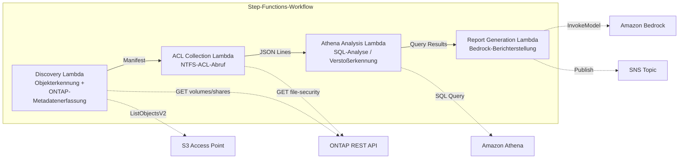

# UC1: Recht & Compliance — Dateiserver-Audit & Data Governance

🌐 **Language / 言語**: [日本語](README.md) | [English](README.en.md) | [한국어](README.ko.md) | [简体中文](README.zh-CN.md) | [繁體中文](README.zh-TW.md) | [Français](README.fr.md) | Deutsch | [Español](README.es.md)

📚 **Dokumentation**: [Architekturdiagramm](docs/architecture.de.md) | [Demo-Leitfaden](docs/demo-guide.de.md)

## Überblick

Dies ist ein serverloser Workflow, der die S3 Access Points von Amazon FSx for NetApp ONTAP nutzt, um die NTFS-ACL-Informationen eines Dateiservers automatisch zu erfassen und zu analysieren und Compliance-Berichte zu erstellen.

### Wann dieses Muster geeignet ist

- Regelmäßige Governance- und Compliance-Scans von NAS-Daten sind erforderlich
- S3-Ereignisbenachrichtigungen sind nicht verfügbar oder ein Polling-basiertes Audit ist vorzuziehen
- Sie möchten Dateidaten auf ONTAP belassen und den bestehenden SMB/NFS-Zugriff beibehalten
- Sie möchten die Änderungshistorie von NTFS-ACLs übergreifend mit Athena analysieren
- Sie möchten Compliance-Berichte in natürlicher Sprache automatisch erstellen

### Wann dieses Muster nicht geeignet ist

- Eine echtzeitfähige, ereignisgesteuerte Verarbeitung ist erforderlich (sofortige Erkennung von Dateiänderungen)
- Eine vollständige S3-Bucket-Semantik (Benachrichtigungen, vorsignierte URLs) ist erforderlich
- Eine EC2-basierte Batch-Verarbeitung ist bereits im Betrieb und die Migrationskosten sind nicht gerechtfertigt
- Eine Umgebung, in der die Netzwerkerreichbarkeit der ONTAP REST API nicht sichergestellt werden kann

### Hauptfunktionen

- Automatische Erfassung von NTFS-ACL-, CIFS-Freigabe- und Export-Policy-Informationen über die ONTAP REST API
- Erkennung überberechtigter Freigaben, veralteter Zugriffe und Richtlinienverstöße mit Athena SQL
- Automatische Erstellung von Compliance-Berichten in natürlicher Sprache mit Amazon Bedrock
- Sofortige Weitergabe der Audit-Ergebnisse über SNS-Benachrichtigungen

## Success Metrics

### Outcome
Reduzierung des manuellen Audit-Aufwands durch Automatisierung von Dateiserver-Audits und Compliance-Prüfungen.

### Metrics
| Metrik | Zielwert (Beispiel) |
|-----------|------------|
| Anzahl gescannter Dateien pro Ausführung | > 1,000 files |
| Anzahl erkannter Überberechtigungen pro Scan | Visualisierung (Basislinie etablieren) |
| Erstellungszeit des Compliance-Berichts | < 5 Min. |
| Reduktionsrate des manuellen Audit-Aufwands | > 50% |
| Kosten pro Scan | < $1 |
| Human-Review-Zielquote | < 10 % (nur risikoreiche Erkennungen) |

### Measurement Method
Step-Functions-Ausführungshistorie, CloudWatch Metrics (FilesProcessed, Duration), Metadaten der erstellten Berichte, SNS-Benachrichtigungsprotokolle.

### Sample Run Results (Gemessenes Beispiel)

**Umgebung**: FSx for ONTAP Single-AZ, 128 MBps, ap-northeast-1, S3AP Internet Origin

| Kennzahl | Before (manuell) | After (S3AP-Automatisierung) |
|------|-------------|-------------------|
| Dateierkennung | Mehrere Stunden (manuelle Bestandsaufnahme) | 36 ms (10 files) |
| Dateilesen | Einzelzugriff | avg 37 ms / file |
| Gesamtverarbeitungszeit | Stunden bis Tage | 404 ms (10 files, sequential) |
| Berichtsformat | Nicht standardisiert | JSON-Metadaten + Audit-Bericht |
| Prüfprozess | Von der zuständigen Person abhängig | Human Review Queue |
| Audit-Trail | Persönliche Aufzeichnungen | DynamoDB + CloudWatch |

> **Hinweis**: Die obigen Werte sind Ergebnisse eines kleinen Sample Runs; sie sind weder eine Durchsatzschätzung für die Produktion noch eine Leistungsgarantie. Der Sample Run von UC1 verwendet synthetische oder nicht sensible Beispieldateien und stellt keine juristischen Dokumente von Kunden dar. Dieser Sample Run validiert lediglich den Verarbeitungspfad. Rechtsgültigkeit, Klassifizierungsqualität und Prüfvollständigkeit sind separat in einem kundenspezifischen PoC zu bewerten.

## Architektur



### Workflow-Schritte

1. **Discovery**: Objektliste vom S3 AP abrufen und ONTAP-Metadaten erfassen (Security Style, Export-Policy, CIFS-Freigabe-ACL)
2. **ACL Collection**: Die NTFS-ACL-Informationen jedes Objekts über die ONTAP REST API abrufen und im JSON-Lines-Format mit Datumspartitionierung nach S3 ausgeben
3. **Athena Analysis**: Die Glue-Data-Catalog-Tabelle erstellen/aktualisieren und mit Athena SQL Überberechtigungen, veraltete Zugriffe und Richtlinienverstöße erkennen
4. **Report Generation**: Mit Bedrock einen Compliance-Bericht in natürlicher Sprache erstellen, nach S3 ausgeben und eine SNS-Benachrichtigung senden

## Voraussetzungen

- Ein AWS-Konto und geeignete IAM-Berechtigungen
- Ein FSx for ONTAP-Dateisystem (ONTAP 9.17.1P4D3 oder höher)
- Ein Volume mit aktivierten S3 Access Points
- In Secrets Manager registrierte ONTAP-REST-API-Anmeldedaten
- Eine VPC und private Subnetze
- Aktivierter Zugriff auf Amazon-Bedrock-Modelle (Claude / Nova)

### Hinweise zur Ausführung von Lambda innerhalb einer VPC

> **Wichtige, bei der Bereitstellungsprüfung (2026-05-03) bestätigte Punkte**

- **PoC-/Demo-Umgebungen**: Es wird empfohlen, Lambda außerhalb der VPC auszuführen. Wenn die Network Origin des S3 AP `internet` ist, ist der Zugriff von einer Lambda außerhalb der VPC problemlos möglich
- **Produktionsumgebungen**: Geben Sie den Parameter `PrivateRouteTableId` an und verknüpfen Sie die Routing-Tabelle mit dem S3 Gateway Endpoint. Wird er nicht angegeben, kommt es beim Zugriff einer Lambda innerhalb der VPC auf den S3 AP zu einem Timeout
- Weitere Details finden Sie im [Leitfaden zur Fehlerbehebung](../docs/guides/troubleshooting-guide.md#6-lambda-vpc-内実行時の-s3-ap-タイムアウト)

## Bereitstellungsschritte

### 1. Vorbereitung der Parameter

Prüfen Sie vor der Bereitstellung die folgenden Werte:

- FSx for ONTAP S3 Access Point Alias
- ONTAP-Verwaltungs-IP-Adresse
- Secrets-Manager-Secret-Name
- SVM UUID, Volume UUID
- VPC ID, Private-Subnetz-ID

### 2. SAM-Bereitstellung

```bash
# Voraussetzung: AWS SAM CLI ist erforderlich. sam build verpackt den Code und die Shared Layer automatisch.
sam build

sam deploy \
  --stack-name fsxn-legal-compliance \
  --parameter-overrides \
    S3AccessPointAlias=<your-volume-ext-s3alias> \
    S3AccessPointName=<your-s3ap-name> \
    S3AccessPointOutputAlias=<your-output-volume-ext-s3alias> \
    OntapSecretName=<your-ontap-secret-name> \
    OntapManagementIp=<your-ontap-management-ip> \
    SvmUuid=<your-svm-uuid> \
    VolumeUuid=<your-volume-uuid> \
    ScheduleExpression="rate(1 hour)" \
    VpcId=<your-vpc-id> \
    PrivateSubnetIds=<subnet-1>,<subnet-2> \
    PrivateRouteTableIds=<rtb-1>,<rtb-2> \
    NotificationEmail=<your-email@example.com> \
    EnableVpcEndpoints=false \
    EnableCloudWatchAlarms=false \
  --capabilities CAPABILITY_NAMED_IAM \
  --resolve-s3 \
  --region ap-northeast-1
```

> **Achtung**: `template.yaml` wird mit der SAM CLI (`sam build` + `sam deploy`) verwendet.
> Um direkt mit dem Befehl `aws cloudformation deploy` bereitzustellen, verwenden Sie `template-deploy.yaml` (dies erfordert das vorherige Verpacken der Lambda-Zip-Dateien und deren Upload nach S3).

> **Achtung**: Ersetzen Sie die Platzhalter `<...>` durch die tatsächlichen Werte Ihrer Umgebung.

### 3. Bestätigung des SNS-Abonnements

Nach der Bereitstellung wird eine SNS-Abonnement-Bestätigungs-E-Mail an die angegebene E-Mail-Adresse gesendet. Klicken Sie auf den Link in der E-Mail, um zu bestätigen.

> **Achtung**: Wenn Sie `S3AccessPointName` weglassen, wird die IAM-Richtlinie nur Alias-basiert, was einen `AccessDenied`-Fehler verursachen kann. In Produktionsumgebungen wird die Angabe empfohlen. Weitere Details finden Sie im [Leitfaden zur Fehlerbehebung](../docs/guides/troubleshooting-guide.md#1-accessdenied-エラー).

## Liste der Konfigurationsparameter

| Parameter | Beschreibung | Standard | Erforderlich |
|-----------|------|----------|------|
| `S3AccessPointAlias` | FSx for ONTAP S3 AP Alias (für Eingabe) | — | ✅ |
| `S3AccessPointName` | S3-AP-Name (für ARN-basierte IAM-Berechtigungsvergabe; nur Alias-basiert bei Weglassen) | `""` | ⚠️ Empfohlen |
| `S3AccessPointOutputAlias` | FSx for ONTAP S3 AP Alias (für Ausgabe) | — | ✅ |
| `OntapSecretName` | Secrets-Manager-Secret-Name für ONTAP-Anmeldedaten | — | ✅ |
| `OntapManagementIp` | ONTAP-Cluster-Verwaltungs-IP-Adresse | — | ✅ |
| `SvmUuid` | ONTAP SVM UUID | — | ✅ |
| `VolumeUuid` | ONTAP Volume UUID | — | ✅ |
| `ScheduleExpression` | Zeitplanausdruck des EventBridge Scheduler | `rate(1 hour)` | |
| `VpcId` | VPC ID | — | ✅ |
| `PrivateSubnetIds` | Liste der privaten Subnetz-IDs | — | ✅ |
| `PrivateRouteTableIds` | Liste der Routing-Tabellen-IDs der privaten Subnetze (kommagetrennt) | — | ✅ |
| `NotificationEmail` | Ziel-E-Mail-Adresse für SNS-Benachrichtigungen | — | ✅ |
| `EnableVpcEndpoints` | Interface VPC Endpoints aktivieren | `false` | |
| `EnableCloudWatchAlarms` | CloudWatch Alarms aktivieren | `false` | |
| `EnableAthenaWorkgroup` | Athena Workgroup / Glue Data Catalog aktivieren | `true` | |

## Kostenstruktur

### Anfragebasiert (nutzungsabhängig)

| Service | Abrechnungseinheit | Schätzung (100 Dateien/Monat) |
|---------|---------|---------------------|
| Lambda | Anzahl der Anfragen + Ausführungszeit | ~$0.01 |
| Step Functions | Anzahl der Zustandsübergänge | Innerhalb des kostenlosen Kontingents |
| S3 API | Anzahl der Anfragen | ~$0.01 |
| Athena | Volumen der gescannten Daten | ~$0.01 |
| Bedrock | Anzahl der Token | ~$0.10 |

### Dauerbetrieb (optional)

| Service | Parameter | Monatlich |
|---------|-----------|------|
| Interface VPC Endpoints | `EnableVpcEndpoints=true` | ~$28.80 |
| CloudWatch Alarms | `EnableCloudWatchAlarms=true` | ~$0.30 |

> In Demo-/PoC-Umgebungen ist die Nutzung bereits ab **~$0.13/Monat** mit ausschließlich variablen Kosten möglich.

## Bereinigung

```bash
# Den CloudFormation-Stack löschen
aws cloudformation delete-stack \
  --stack-name fsxn-legal-compliance \
  --region ap-northeast-1

# Auf Abschluss der Löschung warten
aws cloudformation wait stack-delete-complete \
  --stack-name fsxn-legal-compliance \
  --region ap-northeast-1
```

> **Achtung**: Wenn im S3-Bucket noch Objekte vorhanden sind, kann die Stack-Löschung fehlschlagen. Leeren Sie den Bucket vorab.

## Supported Regions

UC1 verwendet die folgenden Services:

| Service | Regionsbeschränkung |
|---------|-------------|
| Amazon Athena | In nahezu allen Regionen verfügbar |
| Amazon Bedrock | Unterstützte Regionen prüfen ([Von Bedrock unterstützte Regionen](https://docs.aws.amazon.com/general/latest/gr/bedrock.html)) |
| AWS X-Ray | In nahezu allen Regionen verfügbar |
| CloudWatch EMF | In nahezu allen Regionen verfügbar |

> Weitere Details finden Sie in der [Regionskompatibilitätsmatrix](../docs/region-compatibility.md).

## Referenzlinks

### Offizielle AWS-Dokumentation

- [Überblick über FSx for ONTAP S3 Access Points](https://docs.aws.amazon.com/fsx/latest/ONTAPGuide/accessing-data-via-s3-access-points.html)
- [SQL-Abfragen mit Athena (offizielles Tutorial)](https://docs.aws.amazon.com/fsx/latest/ONTAPGuide/tutorial-query-data-with-athena.html)
- [Serverlose Verarbeitung mit Lambda (offizielles Tutorial)](https://docs.aws.amazon.com/fsx/latest/ONTAPGuide/tutorial-process-files-with-lambda.html)
- [Referenz der Bedrock InvokeModel API](https://docs.aws.amazon.com/bedrock/latest/APIReference/API_runtime_InvokeModel.html)
- [Referenz der ONTAP REST API](https://docs.netapp.com/us-en/ontap-automation/)

### AWS-Blogbeiträge

- [S3-AP-Ankündigungsblog](https://aws.amazon.com/blogs/aws/amazon-fsx-for-netapp-ontap-now-integrates-with-amazon-s3-for-seamless-data-access/)
- [AD-Integrationsblog](https://aws.amazon.com/blogs/storage/enabling-ai-powered-analytics-on-enterprise-file-data-configuring-s3-access-points-for-amazon-fsx-for-netapp-ontap-with-active-directory/)
- [Drei serverlose Architekturmuster](https://aws.amazon.com/blogs/storage/bridge-legacy-and-modern-applications-with-amazon-s3-access-points-for-amazon-fsx/)

### GitHub-Beispiele

- [aws-samples/serverless-patterns](https://github.com/aws-samples/serverless-patterns) — Sammlung serverloser Muster
- [aws-samples/aws-stepfunctions-examples](https://github.com/aws-samples/aws-stepfunctions-examples) — Step-Functions-Beispiele

## Verifizierte Umgebung

| Element | Wert |
|------|-----|
| AWS-Region | ap-northeast-1 (Tokio) |
| FSx for ONTAP-Version | ONTAP 9.17.1P4D3 |
| FSx-Konfiguration | SINGLE_AZ_1 |
| Python | 3.12 |
| Bereitstellungsmethode | CloudFormation (Standard) |

## Lambda-VPC-Platzierungsarchitektur

Basierend auf den Erkenntnissen aus der Verifizierung sind die Lambda-Funktionen innerhalb und außerhalb der VPC aufgeteilt.

**Lambda innerhalb der VPC** (nur Funktionen, die Zugriff auf die ONTAP REST API benötigen):
- Discovery Lambda — S3 AP + ONTAP API
- AclCollection Lambda — ONTAP file-security API

**Lambda außerhalb der VPC** (nutzen nur AWS-Managed-Service-APIs):
- Alle übrigen Lambda-Funktionen

> **Grund**: Um von einer Lambda innerhalb der VPC auf AWS-Managed-Service-APIs (Athena, Bedrock, Textract usw.) zuzugreifen, ist ein Interface VPC Endpoint erforderlich (jeweils 7,20 $/Monat). Eine Lambda außerhalb der VPC kann direkt über das Internet auf die AWS-APIs zugreifen und funktioniert ohne zusätzliche Kosten.

> **Achtung**: Bei UCs, die die ONTAP REST API verwenden (UC1 Recht & Compliance), ist `EnableVpcEndpoints=true` zwingend erforderlich. Dies liegt daran, dass die ONTAP-Anmeldedaten über den Secrets Manager VPC Endpoint abgerufen werden.

---

## Links zur AWS-Dokumentation

| Service | Dokumentation |
|---------|------------|
| FSx for ONTAP | [Benutzerhandbuch](https://docs.aws.amazon.com/fsx/latest/ONTAPGuide/what-is-fsx-ontap.html) |
| S3 Access Points | [S3 AP for FSx for ONTAP](https://docs.aws.amazon.com/fsx/latest/ONTAPGuide/s3-access-points.html) |
| Step Functions | [Entwicklerhandbuch](https://docs.aws.amazon.com/step-functions/latest/dg/welcome.html) |
| Amazon Athena | [Benutzerhandbuch](https://docs.aws.amazon.com/athena/latest/ug/what-is.html) |
| Amazon Bedrock | [Benutzerhandbuch](https://docs.aws.amazon.com/bedrock/latest/userguide/what-is-bedrock.html) |
| ONTAP REST API | [Referenz der NetApp ONTAP REST API](https://docs.netapp.com/us-en/ontap-automation/) |

### Ausrichtung am Well-Architected Framework

| Säule | Ausrichtung |
|----|------|
| Operative Exzellenz | X-Ray-Tracing, EMF-Metriken, CloudWatch Alarms |
| Sicherheit | IAM mit geringsten Rechten, KMS-Verschlüsselung, VPC-Isolierung, Secrets Manager |
| Zuverlässigkeit | Step Functions Retry/Catch, Map-State-Parallelverarbeitung |
| Leistungseffizienz | Lambda-Speicheroptimierung, parallele ACL-Erfassung |
| Kostenoptimierung | Serverlos (nur bei Nutzung berechnet), bedingte VPC Endpoints |
| Nachhaltigkeit | On-Demand-Ausführung, automatisches Herunterfahren nicht benötigter Ressourcen |

---

## Lokale Tests

### Prerequisites-Prüfung

```bash
# Die Voraussetzungen prüfen
aws --version          # AWS CLI v2
sam --version          # SAM CLI
python3 --version      # Python 3.9+
docker --version       # Docker (für sam local)
aws sts get-caller-identity  # AWS-Anmeldedaten
```

### sam local invoke

```bash
# Build
# Voraussetzung: AWS SAM CLI ist erforderlich. sam build verpackt den Code und die Shared Layer automatisch.
sam build

# Die Discovery Lambda lokal ausführen
sam local invoke DiscoveryFunction --event events/discovery-event.json

# Mit Überschreibungen von Umgebungsvariablen
sam local invoke DiscoveryFunction \
  --event events/discovery-event.json \
  --env-vars env.json
```

### Unit-Tests

```bash
python3 -m pytest tests/ -v
```

Weitere Details finden Sie im [Schnellstart für lokale Tests](../docs/local-testing-quick-start.md).

---

## Ausgabebeispiel (Output Sample)

Beispiel für die endgültige Ausgabe nach Abschluss der Step-Functions-Ausführung:

```json
{
  "discovery": {
    "status": "completed",
    "object_count": 549,
    "prefix": "legal-docs/",
    "timestamp": 1716480000
  },
  "acl_collection": {
    "processed": 549,
    "acl_records_written": 2847,
    "output_prefix": "s3://output-bucket/acl-data/"
  },
  "athena_analysis": {
    "findings": {
      "excessive_permissions": 12,
      "stale_access": 34,
      "policy_violations": 3
    },
    "query_execution_id": "a1b2c3d4-..."
  },
  "report_generation": {
    "report_key": "reports/compliance-2026-05-23T09:00:00.md",
    "total_findings": 49,
    "sns_message_id": "msg-12345..."
  }
}
```

> **Hinweis**: Das Obige ist eine Beispielausgabe; die tatsächlichen Werte variieren je nach Umgebung und Eingabedaten. Die Benchmark-Zahlen sind ein sizing reference, kein service limit.

---

## Governance Note

> Dieses Muster bietet technische Architekturberatung. Es stellt keine rechtliche, Compliance- oder regulatorische Beratung dar. Organisationen sollten qualifizierte Fachleute konsultieren.

---

## S3AP Compatibility

Informationen zu Kompatibilitätsbeschränkungen, Fehlerbehebung und Trigger-Mustern der S3 Access Points for FSx for ONTAP finden Sie in den [S3AP Compatibility Notes](../docs/s3ap-compatibility-notes.md).
