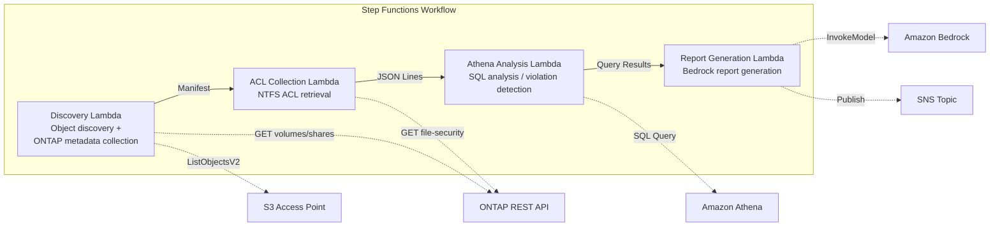

# UC1: Legal & Compliance — File Server Audit & Data Governance

🌐 **Language / 言語**: [日本語](README.md) | English | [한국어](README.ko.md) | [简体中文](README.zh-CN.md) | [繁體中文](README.zh-TW.md) | [Français](README.fr.md) | [Deutsch](README.de.md) | [Español](README.es.md)

📚 **Documentation**: [Architecture Diagram](docs/architecture.en.md) | [Demo Guide](docs/demo-guide.en.md)

## Overview

This is a serverless workflow that leverages the S3 Access Points of Amazon FSx for NetApp ONTAP to automatically collect and analyze the NTFS ACL information of a file server and generate compliance reports.

### When this pattern is a good fit

- You need periodic governance and compliance scans of NAS data
- S3 event notifications are unavailable, or polling-based auditing is preferable
- You want to keep file data on ONTAP and maintain existing SMB/NFS access
- You want to analyze NTFS ACL change history across the board with Athena
- You want to automatically generate natural-language compliance reports

### When this pattern is not a good fit

- You need real-time, event-driven processing (immediate detection of file changes)
- You need full S3 bucket semantics (notifications, presigned URLs)
- EC2-based batch processing is already running and the migration cost is not justified
- You are in an environment where network reachability to the ONTAP REST API cannot be ensured

### Key features

- Automatically collect NTFS ACL, CIFS share, and export policy information via the ONTAP REST API
- Detect over-permissioned shares, stale access, and policy violations with Athena SQL
- Automatically generate natural-language compliance reports with Amazon Bedrock
- Instantly share audit results via SNS notifications

## Success Metrics

### Outcome
Reduce manual audit effort by automating file server audits and compliance checks.

### Metrics
| Metric | Target (example) |
|-----------|------------|
| Files scanned per run | > 1,000 files |
| Over-permissions detected per scan | Visualization (establish a baseline) |
| Compliance report generation time | < 5 min |
| Manual audit effort reduction rate | > 50% |
| Cost per scan | < $1 |
| Human Review target rate | < 10% (high-risk detections only) |

### Measurement Method
Step Functions execution history, CloudWatch Metrics (FilesProcessed, Duration), generated report metadata, and SNS notification logs.

### Sample Run Results (Measured Example)

**Environment**: FSx for ONTAP Single-AZ, 128 MBps, ap-northeast-1, S3AP Internet Origin

| Indicator | Before (manual) | After (S3AP automation) |
|------|-------------|-------------------|
| File discovery | Several hours (manual inventory) | 36 ms (10 files) |
| File read | Individual access | avg 37 ms / file |
| Overall processing time | Hours to days | 404 ms (10 files, sequential) |
| Report format | Non-standardized | JSON metadata + audit report |
| Review process | Dependent on the assignee | Human Review Queue |
| Audit trail | Personal records | DynamoDB + CloudWatch |

> **Note**: The figures above are results of a small-scale sample run; they are not production throughput estimates or performance guarantees. The UC1 sample run uses synthetic or non-sensitive sample files and does not represent customer legal documents. This sample run validates the processing path only. Legal validity, classification quality, and review completeness must be evaluated separately in a customer-specific PoC.

## Architecture



### Workflow steps

1. **Discovery**: Retrieve the object list from the S3 AP and collect ONTAP metadata (security style, export policy, CIFS share ACL)
2. **ACL Collection**: Retrieve the NTFS ACL information of each object via the ONTAP REST API and write it to S3 in JSON Lines format with date partitioning
3. **Athena Analysis**: Create/update the Glue Data Catalog table and use Athena SQL to detect over-permissions, stale access, and policy violations
4. **Report Generation**: Generate a natural-language compliance report with Bedrock, write it to S3, and send an SNS notification

## Prerequisites

- An AWS account and appropriate IAM permissions
- An FSx for ONTAP file system (ONTAP 9.17.1P4D3 or later)
- A volume with S3 Access Points enabled
- ONTAP REST API credentials registered in Secrets Manager
- A VPC and private subnets
- Amazon Bedrock model access enabled (Claude / Nova)

### Notes for running Lambda inside a VPC

> **Important items confirmed during deployment verification (2026-05-03)**

- **PoC / demo environments**: Running Lambda outside the VPC is recommended. If the S3 AP network origin is `internet`, it can be accessed without issue from a Lambda outside the VPC
- **Production environments**: Specify the `PrivateRouteTableId` parameter and associate the route table with the S3 Gateway Endpoint. If it is not specified, access from an in-VPC Lambda to the S3 AP will time out
- For details, see the [Troubleshooting Guide](../docs/guides/troubleshooting-guide.md#6-lambda-vpc-内実行時の-s3-ap-タイムアウト)

## Deployment steps

### 1. Prepare parameters

Confirm the following values before deployment:

- FSx for ONTAP S3 Access Point Alias
- ONTAP management IP address
- Secrets Manager secret name
- SVM UUID, volume UUID
- VPC ID, private subnet IDs

### 2. SAM deploy

```bash
# Prerequisite: AWS SAM CLI is required. sam build automatically packages the code and the shared layer.
sam build

sam deploy \
  --stack-name fsxn-legal-compliance \
  --parameter-overrides \
    S3AccessPointAlias=<your-volume-ext-s3alias> \
    S3AccessPointName=<your-s3ap-name> \
    S3AccessPointOutputAlias=<your-output-volume-ext-s3alias> \
    OntapSecretName=<your-ontap-secret-name> \
    OntapManagementIp=<your-ontap-management-ip> \
    SvmUuid=<your-svm-uuid> \
    VolumeUuid=<your-volume-uuid> \
    ScheduleExpression="rate(1 hour)" \
    VpcId=<your-vpc-id> \
    PrivateSubnetIds=<subnet-1>,<subnet-2> \
    PrivateRouteTableIds=<rtb-1>,<rtb-2> \
    NotificationEmail=<your-email@example.com> \
    EnableVpcEndpoints=false \
    EnableCloudWatchAlarms=false \
  --capabilities CAPABILITY_NAMED_IAM \
  --resolve-s3 \
  --region ap-northeast-1
```

> **Note**: `template.yaml` is used with the SAM CLI (`sam build` + `sam deploy`).
> To deploy directly with the `aws cloudformation deploy` command, use `template-deploy.yaml` (which requires pre-packaging the Lambda zip files and uploading them to S3).

> **Note**: Replace the `<...>` placeholders with your actual environment values.

### 3. Confirm the SNS subscription

After deployment, an SNS subscription confirmation email is sent to the specified email address. Click the link in the email to confirm.

> **Note**: If you omit `S3AccessPointName`, the IAM policy becomes Alias-based only, which may cause an `AccessDenied` error. Specifying it is recommended in production environments. For details, see the [Troubleshooting Guide](../docs/guides/troubleshooting-guide.md#1-accessdenied-エラー).

## Configuration parameters

| Parameter | Description | Default | Required |
|-----------|------|----------|------|
| `S3AccessPointAlias` | FSx for ONTAP S3 AP Alias (for input) | — | ✅ |
| `S3AccessPointName` | S3 AP name (for ARN-based IAM permission grants; Alias-based only if omitted) | `""` | ⚠️ Recommended |
| `S3AccessPointOutputAlias` | FSx for ONTAP S3 AP Alias (for output) | — | ✅ |
| `OntapSecretName` | Secrets Manager secret name for ONTAP credentials | — | ✅ |
| `OntapManagementIp` | ONTAP cluster management IP address | — | ✅ |
| `SvmUuid` | ONTAP SVM UUID | — | ✅ |
| `VolumeUuid` | ONTAP volume UUID | — | ✅ |
| `ScheduleExpression` | EventBridge Scheduler schedule expression | `rate(1 hour)` | |
| `VpcId` | VPC ID | — | ✅ |
| `PrivateSubnetIds` | List of private subnet IDs | — | ✅ |
| `PrivateRouteTableIds` | List of route table IDs for the private subnets (comma-separated) | — | ✅ |
| `NotificationEmail` | SNS notification destination email address | — | ✅ |
| `EnableVpcEndpoints` | Enable Interface VPC Endpoints | `false` | |
| `EnableCloudWatchAlarms` | Enable CloudWatch Alarms | `false` | |
| `EnableAthenaWorkgroup` | Enable Athena Workgroup / Glue Data Catalog | `true` | |

## Cost structure

### Request-based (pay-per-use)

| Service | Billing unit | Estimate (100 files/month) |
|---------|---------|---------------------|
| Lambda | Number of requests + execution time | ~$0.01 |
| Step Functions | Number of state transitions | Within free tier |
| S3 API | Number of requests | ~$0.01 |
| Athena | Volume of data scanned | ~$0.01 |
| Bedrock | Number of tokens | ~$0.10 |

### Always-on (optional)

| Service | Parameter | Monthly |
|---------|-----------|------|
| Interface VPC Endpoints | `EnableVpcEndpoints=true` | ~$28.80 |
| CloudWatch Alarms | `EnableCloudWatchAlarms=true` | ~$0.30 |

> In demo/PoC environments, you can start from **~$0.13/month** with variable costs only.

## Cleanup

```bash
# Delete the CloudFormation stack
aws cloudformation delete-stack \
  --stack-name fsxn-legal-compliance \
  --region ap-northeast-1

# Wait for deletion to complete
aws cloudformation wait stack-delete-complete \
  --stack-name fsxn-legal-compliance \
  --region ap-northeast-1
```

> **Note**: If objects remain in the S3 bucket, stack deletion may fail. Empty the bucket beforehand.

## Supported Regions

UC1 uses the following services:

| Service | Region constraint |
|---------|-------------|
| Amazon Athena | Available in almost all regions |
| Amazon Bedrock | Check supported regions ([Bedrock supported regions](https://docs.aws.amazon.com/general/latest/gr/bedrock.html)) |
| AWS X-Ray | Available in almost all regions |
| CloudWatch EMF | Available in almost all regions |

> See the [Region Compatibility Matrix](../docs/region-compatibility.md) for details.

## Reference links

### AWS official documentation

- [FSx for ONTAP S3 Access Points overview](https://docs.aws.amazon.com/fsx/latest/ONTAPGuide/accessing-data-via-s3-access-points.html)
- [Query data with SQL in Athena (official tutorial)](https://docs.aws.amazon.com/fsx/latest/ONTAPGuide/tutorial-query-data-with-athena.html)
- [Serverless processing with Lambda (official tutorial)](https://docs.aws.amazon.com/fsx/latest/ONTAPGuide/tutorial-process-files-with-lambda.html)
- [Bedrock InvokeModel API reference](https://docs.aws.amazon.com/bedrock/latest/APIReference/API_runtime_InvokeModel.html)
- [ONTAP REST API reference](https://docs.netapp.com/us-en/ontap-automation/)

### AWS blog posts

- [S3 AP announcement blog](https://aws.amazon.com/blogs/aws/amazon-fsx-for-netapp-ontap-now-integrates-with-amazon-s3-for-seamless-data-access/)
- [AD integration blog](https://aws.amazon.com/blogs/storage/enabling-ai-powered-analytics-on-enterprise-file-data-configuring-s3-access-points-for-amazon-fsx-for-netapp-ontap-with-active-directory/)
- [Three serverless architecture patterns](https://aws.amazon.com/blogs/storage/bridge-legacy-and-modern-applications-with-amazon-s3-access-points-for-amazon-fsx/)

### GitHub samples

- [aws-samples/serverless-patterns](https://github.com/aws-samples/serverless-patterns) — Serverless patterns collection
- [aws-samples/aws-stepfunctions-examples](https://github.com/aws-samples/aws-stepfunctions-examples) — Step Functions samples

## Verified Environment

| Item | Value |
|------|-----|
| AWS Region | ap-northeast-1 (Tokyo) |
| FSx for ONTAP version | ONTAP 9.17.1P4D3 |
| FSx configuration | SINGLE_AZ_1 |
| Python | 3.12 |
| Deployment method | CloudFormation (standard) |

## Lambda VPC placement architecture

Based on insights gained during verification, the Lambda functions are split between inside and outside the VPC.

**In-VPC Lambda** (only functions that require ONTAP REST API access):
- Discovery Lambda — S3 AP + ONTAP API
- AclCollection Lambda — ONTAP file-security API

**Out-of-VPC Lambda** (functions that use only AWS managed service APIs):
- All other Lambda functions

> **Reason**: To access AWS managed service APIs (Athena, Bedrock, Textract, etc.) from an in-VPC Lambda, an Interface VPC Endpoint is required (each $7.20/month). An out-of-VPC Lambda can access the AWS APIs directly over the internet and works with no additional cost.

> **Note**: For UCs that use the ONTAP REST API (UC1 Legal & Compliance), `EnableVpcEndpoints=true` is mandatory. This is because ONTAP credentials are retrieved via the Secrets Manager VPC Endpoint.

---

## AWS documentation links

| Service | Documentation |
|---------|------------|
| FSx for ONTAP | [User Guide](https://docs.aws.amazon.com/fsx/latest/ONTAPGuide/what-is-fsx-ontap.html) |
| S3 Access Points | [S3 AP for FSx for ONTAP](https://docs.aws.amazon.com/fsx/latest/ONTAPGuide/s3-access-points.html) |
| Step Functions | [Developer Guide](https://docs.aws.amazon.com/step-functions/latest/dg/welcome.html) |
| Amazon Athena | [User Guide](https://docs.aws.amazon.com/athena/latest/ug/what-is.html) |
| Amazon Bedrock | [User Guide](https://docs.aws.amazon.com/bedrock/latest/userguide/what-is-bedrock.html) |
| ONTAP REST API | [NetApp ONTAP REST API reference](https://docs.netapp.com/us-en/ontap-automation/) |

### Well-Architected Framework alignment

| Pillar | Alignment |
|----|------|
| Operational Excellence | X-Ray tracing, EMF metrics, CloudWatch Alarms |
| Security | Least-privilege IAM, KMS encryption, VPC isolation, Secrets Manager |
| Reliability | Step Functions Retry/Catch, Map state parallelism |
| Performance Efficiency | Lambda memory optimization, parallel ACL collection |
| Cost Optimization | Serverless (billed only when used), conditional VPC Endpoints |
| Sustainability | On-demand execution, automatic shutdown of unneeded resources |

---

## Local testing

### Prerequisites check

```bash
# Confirm the prerequisites
aws --version          # AWS CLI v2
sam --version          # SAM CLI
python3 --version      # Python 3.9+
docker --version       # Docker (for sam local)
aws sts get-caller-identity  # AWS credentials
```

### sam local invoke

```bash
# Build
# Prerequisite: AWS SAM CLI is required. sam build automatically packages the code and the shared layer.
sam build

# Run the Discovery Lambda locally
sam local invoke DiscoveryFunction --event events/discovery-event.json

# With environment variable overrides
sam local invoke DiscoveryFunction \
  --event events/discovery-event.json \
  --env-vars env.json
```

### Unit tests

```bash
python3 -m pytest tests/ -v
```

For details, see the [Local Testing Quick Start](../docs/local-testing-quick-start.md).

---

## Output Sample (Output Sample)

Example of the final output when the Step Functions execution completes:

```json
{
  "discovery": {
    "status": "completed",
    "object_count": 549,
    "prefix": "legal-docs/",
    "timestamp": 1716480000
  },
  "acl_collection": {
    "processed": 549,
    "acl_records_written": 2847,
    "output_prefix": "s3://output-bucket/acl-data/"
  },
  "athena_analysis": {
    "findings": {
      "excessive_permissions": 12,
      "stale_access": 34,
      "policy_violations": 3
    },
    "query_execution_id": "a1b2c3d4-..."
  },
  "report_generation": {
    "report_key": "reports/compliance-2026-05-23T09:00:00.md",
    "total_findings": 49,
    "sns_message_id": "msg-12345..."
  }
}
```

> **Note**: The above is sample output; actual values differ depending on the environment and input data. Benchmark figures are a sizing reference, not a service limit.

---

## Governance Note

> This pattern provides technical architecture guidance. It is not legal, compliance, or regulatory advice. Organizations should consult qualified professionals.

---

## S3AP Compatibility

For compatibility constraints, troubleshooting, and trigger patterns of S3 Access Points for FSx for ONTAP, see the [S3AP Compatibility Notes](../docs/s3ap-compatibility-notes.md).
