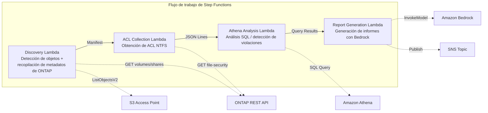

# UC1: Legal y cumplimiento — Auditoría de servidor de archivos y gobernanza de datos

🌐 **Language / 言語**: [日本語](README.md) | [English](README.en.md) | [한국어](README.ko.md) | [简体中文](README.zh-CN.md) | [繁體中文](README.zh-TW.md) | [Français](README.fr.md) | [Deutsch](README.de.md) | Español

📚 **Documentación**: [Diagrama de arquitectura](docs/architecture.es.md) | [Guía de demostración](docs/demo-guide.es.md)

## Resumen

Este es un flujo de trabajo sin servidor que aprovecha los S3 Access Points de Amazon FSx for NetApp ONTAP para recopilar y analizar automáticamente la información de ACL NTFS de un servidor de archivos y generar informes de cumplimiento.

### Cuándo es adecuado este patrón

- Se requieren análisis periódicos de gobernanza y cumplimiento de los datos NAS
- Las notificaciones de eventos de S3 no están disponibles, o se prefiere una auditoría basada en sondeo (polling)
- Desea mantener los datos de archivos en ONTAP y conservar el acceso SMB/NFS existente
- Desea analizar de forma transversal el historial de cambios de ACL NTFS con Athena
- Desea generar automáticamente informes de cumplimiento en lenguaje natural

### Cuándo no es adecuado este patrón

- Se requiere un procesamiento en tiempo real basado en eventos (detección inmediata de cambios de archivos)
- Se requiere una semántica completa de bucket de S3 (notificaciones, URL prefirmadas)
- Ya está en funcionamiento un procesamiento por lotes basado en EC2 y el coste de migración no está justificado
- Un entorno en el que no se puede garantizar la accesibilidad de red a la API REST de ONTAP

### Funciones principales

- Recopilación automática de información de ACL NTFS, recursos compartidos CIFS y políticas de exportación a través de la API REST de ONTAP
- Detección de recursos compartidos con permisos excesivos, accesos obsoletos y violaciones de políticas con Athena SQL
- Generación automática de informes de cumplimiento en lenguaje natural con Amazon Bedrock
- Uso compartido inmediato de los resultados de auditoría mediante notificaciones de SNS

## Success Metrics

### Outcome
Reducir el esfuerzo de auditoría manual mediante la automatización de las auditorías de servidores de archivos y las comprobaciones de cumplimiento.

### Metrics
| Métrica | Valor objetivo (ejemplo) |
|-----------|------------|
| Número de archivos analizados por ejecución | > 1,000 files |
| Número de permisos excesivos detectados por análisis | Visualización (establecer una línea base) |
| Tiempo de generación del informe de cumplimiento | < 5 min |
| Tasa de reducción del esfuerzo de auditoría manual | > 50% |
| Coste por análisis | < $1 |
| Tasa objetivo de Human Review | < 10 % (solo detecciones de alto riesgo) |

### Measurement Method
Historial de ejecución de Step Functions, CloudWatch Metrics (FilesProcessed, Duration), metadatos de los informes generados, registros de notificación de SNS.

### Sample Run Results (Ejemplo medido)

**Entorno**: FSx for ONTAP Single-AZ, 128 MBps, ap-northeast-1, S3AP Internet Origin

| Indicador | Before (manual) | After (automatización S3AP) |
|------|-------------|-------------------|
| Detección de archivos | Varias horas (inventario manual) | 36 ms (10 files) |
| Lectura de archivos | Acceso individual | avg 37 ms / file |
| Tiempo total de procesamiento | De horas a días | 404 ms (10 files, sequential) |
| Formato del informe | No estandarizado | Metadatos JSON + informe de auditoría |
| Proceso de revisión | Dependiente del responsable | Human Review Queue |
| Registro de auditoría | Registros personales | DynamoDB + CloudWatch |

> **Nota**: Los valores anteriores son los resultados de una ejecución de muestra a pequeña escala; no constituyen una estimación de rendimiento en producción ni una garantía de rendimiento. El sample run de UC1 utiliza archivos de muestra sintéticos o no sensibles y no representa los documentos legales del cliente. Este sample run solo valida la ruta de procesamiento. La validez legal, la calidad de la clasificación y la exhaustividad de la revisión deben evaluarse por separado en un PoC específico del cliente.

## Arquitectura



### Pasos del flujo de trabajo

1. **Discovery**: Obtener la lista de objetos desde el S3 AP y recopilar los metadatos de ONTAP (estilo de seguridad, política de exportación, ACL de recurso compartido CIFS)
2. **ACL Collection**: Obtener la información de ACL NTFS de cada objeto a través de la API REST de ONTAP y escribirla en S3 en formato JSON Lines con partición por fecha
3. **Athena Analysis**: Crear/actualizar la tabla de Glue Data Catalog y usar Athena SQL para detectar permisos excesivos, accesos obsoletos y violaciones de políticas
4. **Report Generation**: Generar un informe de cumplimiento en lenguaje natural con Bedrock, escribirlo en S3 y enviar una notificación de SNS

## Requisitos previos

- Una cuenta de AWS y los permisos de IAM adecuados
- Un sistema de archivos FSx for ONTAP (ONTAP 9.17.1P4D3 o posterior)
- Un volumen con los S3 Access Points habilitados
- Credenciales de la API REST de ONTAP registradas en Secrets Manager
- Una VPC y subredes privadas
- Acceso a los modelos de Amazon Bedrock habilitado (Claude / Nova)

### Consideraciones al ejecutar Lambda dentro de una VPC

> **Puntos importantes confirmados en la verificación de la implementación (2026-05-03)**

- **Entornos PoC / demo**: Se recomienda ejecutar Lambda fuera de la VPC. Si la network origin del S3 AP es `internet`, se puede acceder sin problemas desde una Lambda fuera de la VPC
- **Entornos de producción**: Especifique el parámetro `PrivateRouteTableId` y asocie la tabla de rutas al S3 Gateway Endpoint. Si no se especifica, el acceso desde una Lambda dentro de la VPC al S3 AP agotará el tiempo de espera
- Para más detalles, consulte la [Guía de solución de problemas](../docs/guides/troubleshooting-guide.md#6-lambda-vpc-内実行時の-s3-ap-タイムアウト)

## Procedimiento de implementación

### 1. Preparación de los parámetros

Confirme los siguientes valores antes de la implementación:

- FSx for ONTAP S3 Access Point Alias
- Dirección IP de gestión de ONTAP
- Nombre del secreto de Secrets Manager
- SVM UUID, volume UUID
- VPC ID, ID de subred privada

### 2. Implementación con SAM

```bash
# Requisito previo: se necesita AWS SAM CLI. sam build empaqueta automáticamente el código y la capa compartida.
sam build

sam deploy \
  --stack-name fsxn-legal-compliance \
  --parameter-overrides \
    S3AccessPointAlias=<your-volume-ext-s3alias> \
    S3AccessPointName=<your-s3ap-name> \
    S3AccessPointOutputAlias=<your-output-volume-ext-s3alias> \
    OntapSecretName=<your-ontap-secret-name> \
    OntapManagementIp=<your-ontap-management-ip> \
    SvmUuid=<your-svm-uuid> \
    VolumeUuid=<your-volume-uuid> \
    ScheduleExpression="rate(1 hour)" \
    VpcId=<your-vpc-id> \
    PrivateSubnetIds=<subnet-1>,<subnet-2> \
    PrivateRouteTableIds=<rtb-1>,<rtb-2> \
    NotificationEmail=<your-email@example.com> \
    EnableVpcEndpoints=false \
    EnableCloudWatchAlarms=false \
  --capabilities CAPABILITY_NAMED_IAM \
  --resolve-s3 \
  --region ap-northeast-1
```

> **Nota**: `template.yaml` se usa con la SAM CLI (`sam build` + `sam deploy`).
> Para implementar directamente con el comando `aws cloudformation deploy`, use `template-deploy.yaml` (requiere el empaquetado previo de los archivos zip de Lambda y su carga en S3).

> **Nota**: Reemplace los marcadores de posición `<...>` por los valores reales de su entorno.

### 3. Confirmación de la suscripción a SNS

Después de la implementación, se envía un correo de confirmación de suscripción a SNS a la dirección de correo electrónico especificada. Haga clic en el enlace del correo para confirmar.

> **Nota**: Si omite `S3AccessPointName`, la política de IAM queda basada únicamente en el Alias, lo que puede provocar un error `AccessDenied`. Se recomienda especificarlo en entornos de producción. Para más detalles, consulte la [Guía de solución de problemas](../docs/guides/troubleshooting-guide.md#1-accessdenied-エラー).

## Lista de parámetros de configuración

| Parámetro | Descripción | Predeterminado | Obligatorio |
|-----------|------|----------|------|
| `S3AccessPointAlias` | FSx for ONTAP S3 AP Alias (para entrada) | — | ✅ |
| `S3AccessPointName` | Nombre del S3 AP (para conceder permisos de IAM basados en ARN; solo basado en Alias si se omite) | `""` | ⚠️ Recomendado |
| `S3AccessPointOutputAlias` | FSx for ONTAP S3 AP Alias (para salida) | — | ✅ |
| `OntapSecretName` | Nombre del secreto de Secrets Manager para las credenciales de ONTAP | — | ✅ |
| `OntapManagementIp` | Dirección IP de gestión del clúster de ONTAP | — | ✅ |
| `SvmUuid` | ONTAP SVM UUID | — | ✅ |
| `VolumeUuid` | ONTAP volume UUID | — | ✅ |
| `ScheduleExpression` | Expresión de programación de EventBridge Scheduler | `rate(1 hour)` | |
| `VpcId` | VPC ID | — | ✅ |
| `PrivateSubnetIds` | Lista de ID de subredes privadas | — | ✅ |
| `PrivateRouteTableIds` | Lista de ID de tablas de rutas de las subredes privadas (separadas por comas) | — | ✅ |
| `NotificationEmail` | Dirección de correo electrónico de destino de las notificaciones de SNS | — | ✅ |
| `EnableVpcEndpoints` | Habilitar Interface VPC Endpoints | `false` | |
| `EnableCloudWatchAlarms` | Habilitar CloudWatch Alarms | `false` | |
| `EnableAthenaWorkgroup` | Habilitar Athena Workgroup / Glue Data Catalog | `true` | |

## Estructura de costes

### Basado en solicitudes (pago por uso)

| Servicio | Unidad de facturación | Estimación (100 archivos/mes) |
|---------|---------|---------------------|
| Lambda | Número de solicitudes + tiempo de ejecución | ~$0.01 |
| Step Functions | Número de transiciones de estado | Dentro del nivel gratuito |
| S3 API | Número de solicitudes | ~$0.01 |
| Athena | Volumen de datos analizados | ~$0.01 |
| Bedrock | Número de tokens | ~$0.10 |

### Siempre activo (opcional)

| Servicio | Parámetro | Mensual |
|---------|-----------|------|
| Interface VPC Endpoints | `EnableVpcEndpoints=true` | ~$28.80 |
| CloudWatch Alarms | `EnableCloudWatchAlarms=true` | ~$0.30 |

> En entornos de demo/PoC, puede empezar desde **~$0.13/mes** solo con costes variables.

## Limpieza

```bash
# Eliminar la pila de CloudFormation
aws cloudformation delete-stack \
  --stack-name fsxn-legal-compliance \
  --region ap-northeast-1

# Esperar a que finalice la eliminación
aws cloudformation wait stack-delete-complete \
  --stack-name fsxn-legal-compliance \
  --region ap-northeast-1
```

> **Nota**: Si quedan objetos en el bucket de S3, la eliminación de la pila puede fallar. Vacíe el bucket de antemano.

## Supported Regions

UC1 utiliza los siguientes servicios:

| Servicio | Restricción de región |
|---------|-------------|
| Amazon Athena | Disponible en casi todas las regiones |
| Amazon Bedrock | Consulte las regiones compatibles ([Regiones compatibles con Bedrock](https://docs.aws.amazon.com/general/latest/gr/bedrock.html)) |
| AWS X-Ray | Disponible en casi todas las regiones |
| CloudWatch EMF | Disponible en casi todas las regiones |

> Para más detalles, consulte la [Matriz de compatibilidad de regiones](../docs/region-compatibility.md).

## Enlaces de referencia

### Documentación oficial de AWS

- [Descripción general de FSx for ONTAP S3 Access Points](https://docs.aws.amazon.com/fsx/latest/ONTAPGuide/accessing-data-via-s3-access-points.html)
- [Consultas SQL con Athena (tutorial oficial)](https://docs.aws.amazon.com/fsx/latest/ONTAPGuide/tutorial-query-data-with-athena.html)
- [Procesamiento sin servidor con Lambda (tutorial oficial)](https://docs.aws.amazon.com/fsx/latest/ONTAPGuide/tutorial-process-files-with-lambda.html)
- [Referencia de la API InvokeModel de Bedrock](https://docs.aws.amazon.com/bedrock/latest/APIReference/API_runtime_InvokeModel.html)
- [Referencia de la API REST de ONTAP](https://docs.netapp.com/us-en/ontap-automation/)

### Artículos del blog de AWS

- [Blog de anuncio del S3 AP](https://aws.amazon.com/blogs/aws/amazon-fsx-for-netapp-ontap-now-integrates-with-amazon-s3-for-seamless-data-access/)
- [Blog de integración con AD](https://aws.amazon.com/blogs/storage/enabling-ai-powered-analytics-on-enterprise-file-data-configuring-s3-access-points-for-amazon-fsx-for-netapp-ontap-with-active-directory/)
- [Tres patrones de arquitectura sin servidor](https://aws.amazon.com/blogs/storage/bridge-legacy-and-modern-applications-with-amazon-s3-access-points-for-amazon-fsx/)

### Ejemplos de GitHub

- [aws-samples/serverless-patterns](https://github.com/aws-samples/serverless-patterns) — Colección de patrones sin servidor
- [aws-samples/aws-stepfunctions-examples](https://github.com/aws-samples/aws-stepfunctions-examples) — Ejemplos de Step Functions

## Entorno verificado

| Elemento | Valor |
|------|-----|
| Región de AWS | ap-northeast-1 (Tokio) |
| Versión de FSx for ONTAP | ONTAP 9.17.1P4D3 |
| Configuración de FSx | SINGLE_AZ_1 |
| Python | 3.12 |
| Método de implementación | CloudFormation (estándar) |

## Arquitectura de ubicación de Lambda en la VPC

Basándose en los conocimientos obtenidos durante la verificación, las funciones Lambda se distribuyen dentro y fuera de la VPC.

**Lambda dentro de la VPC** (solo funciones que requieren acceso a la API REST de ONTAP):
- Discovery Lambda — S3 AP + ONTAP API
- AclCollection Lambda — ONTAP file-security API

**Lambda fuera de la VPC** (que solo usan las API de servicios gestionados de AWS):
- Todas las demás funciones Lambda

> **Motivo**: Para acceder a las API de servicios gestionados de AWS (Athena, Bedrock, Textract, etc.) desde una Lambda dentro de la VPC, se necesita un Interface VPC Endpoint (cada uno $7.20/mes). Una Lambda fuera de la VPC puede acceder directamente a las API de AWS a través de internet y funciona sin coste adicional.

> **Nota**: Para los UC que usan la API REST de ONTAP (UC1 Legal y cumplimiento), `EnableVpcEndpoints=true` es obligatorio. Esto se debe a que las credenciales de ONTAP se obtienen a través del Secrets Manager VPC Endpoint.

---

## Enlaces a la documentación de AWS

| Servicio | Documentación |
|---------|------------|
| FSx for ONTAP | [Guía del usuario](https://docs.aws.amazon.com/fsx/latest/ONTAPGuide/what-is-fsx-ontap.html) |
| S3 Access Points | [S3 AP for FSx for ONTAP](https://docs.aws.amazon.com/fsx/latest/ONTAPGuide/s3-access-points.html) |
| Step Functions | [Guía del desarrollador](https://docs.aws.amazon.com/step-functions/latest/dg/welcome.html) |
| Amazon Athena | [Guía del usuario](https://docs.aws.amazon.com/athena/latest/ug/what-is.html) |
| Amazon Bedrock | [Guía del usuario](https://docs.aws.amazon.com/bedrock/latest/userguide/what-is-bedrock.html) |
| ONTAP REST API | [Referencia de la API REST de NetApp ONTAP](https://docs.netapp.com/us-en/ontap-automation/) |

### Alineación con el Well-Architected Framework

| Pilar | Alineación |
|----|------|
| Excelencia operativa | Rastreo con X-Ray, métricas EMF, CloudWatch Alarms |
| Seguridad | IAM de privilegio mínimo, cifrado KMS, aislamiento de VPC, Secrets Manager |
| Fiabilidad | Step Functions Retry/Catch, procesamiento paralelo con Map state |
| Eficiencia del rendimiento | Optimización de memoria de Lambda, recopilación de ACL en paralelo |
| Optimización de costes | Sin servidor (se factura solo cuando se usa), VPC Endpoint condicional |
| Sostenibilidad | Ejecución bajo demanda, detención automática de recursos innecesarios |

---

## Pruebas locales

### Comprobación de Prerequisites

```bash
# Confirmar los requisitos previos
aws --version          # AWS CLI v2
sam --version          # SAM CLI
python3 --version      # Python 3.9+
docker --version       # Docker (para sam local)
aws sts get-caller-identity  # Credenciales de AWS
```

### sam local invoke

```bash
# Compilación
# Requisito previo: se necesita AWS SAM CLI. sam build empaqueta automáticamente el código y la capa compartida.
sam build

# Ejecución local de la Discovery Lambda
sam local invoke DiscoveryFunction --event events/discovery-event.json

# Con anulaciones de variables de entorno
sam local invoke DiscoveryFunction \
  --event events/discovery-event.json \
  --env-vars env.json
```

### Pruebas unitarias

```bash
python3 -m pytest tests/ -v
```

Para más detalles, consulte el [Inicio rápido de pruebas locales](../docs/local-testing-quick-start.md).

---

## Ejemplo de salida (Output Sample)

Ejemplo de la salida final cuando finaliza la ejecución de Step Functions:

```json
{
  "discovery": {
    "status": "completed",
    "object_count": 549,
    "prefix": "legal-docs/",
    "timestamp": 1716480000
  },
  "acl_collection": {
    "processed": 549,
    "acl_records_written": 2847,
    "output_prefix": "s3://output-bucket/acl-data/"
  },
  "athena_analysis": {
    "findings": {
      "excessive_permissions": 12,
      "stale_access": 34,
      "policy_violations": 3
    },
    "query_execution_id": "a1b2c3d4-..."
  },
  "report_generation": {
    "report_key": "reports/compliance-2026-05-23T09:00:00.md",
    "total_findings": 49,
    "sns_message_id": "msg-12345..."
  }
}
```

> **Nota**: Lo anterior es una salida de muestra; los valores reales varían según el entorno y los datos de entrada. Las cifras de referencia son un sizing reference, no un service limit.

---

## Governance Note

> Este patrón proporciona orientación de arquitectura técnica. No constituye asesoramiento legal, de cumplimiento ni regulatorio. Las organizaciones deben consultar a profesionales cualificados.

---

## S3AP Compatibility

Para conocer las restricciones de compatibilidad, la solución de problemas y los patrones de activación de los S3 Access Points for FSx for ONTAP, consulte las [S3AP Compatibility Notes](../docs/s3ap-compatibility-notes.md).
