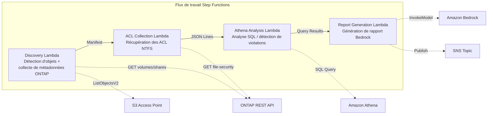

# UC1 : Juridique et conformité — Audit de serveur de fichiers et gouvernance des données

🌐 **Language / 言語**: [日本語](README.md) | [English](README.en.md) | [한국어](README.ko.md) | [简体中文](README.zh-CN.md) | [繁體中文](README.zh-TW.md) | Français | [Deutsch](README.de.md) | [Español](README.es.md)

📚 **Documentation**: [Schéma d'architecture](docs/architecture.fr.md) | [Guide de démonstration](docs/demo-guide.fr.md)

## Aperçu

Il s'agit d'un flux de travail serverless qui exploite les S3 Access Points d'Amazon FSx for NetApp ONTAP pour collecter et analyser automatiquement les informations d'ACL NTFS d'un serveur de fichiers et générer des rapports de conformité.

### Quand ce modèle est adapté

- Des analyses régulières de gouvernance et de conformité des données NAS sont nécessaires
- Les notifications d'événements S3 sont indisponibles, ou un audit basé sur l'interrogation (polling) est préférable
- Vous souhaitez conserver les données de fichiers sur ONTAP et maintenir l'accès SMB/NFS existant
- Vous souhaitez analyser transversalement l'historique des modifications d'ACL NTFS avec Athena
- Vous souhaitez générer automatiquement des rapports de conformité en langage naturel

### Quand ce modèle n'est pas adapté

- Un traitement piloté par les événements en temps réel est requis (détection immédiate des modifications de fichiers)
- Une sémantique complète de bucket S3 (notifications, URL présignées) est requise
- Un traitement par lots basé sur EC2 est déjà en production et le coût de migration n'est pas justifié
- Un environnement où la joignabilité réseau de l'API REST ONTAP ne peut pas être garantie

### Fonctionnalités principales

- Collecte automatique des informations d'ACL NTFS, de partages CIFS et de politiques d'export via l'API REST ONTAP
- Détection des partages sur-autorisés, des accès obsolètes et des violations de politique avec Athena SQL
- Génération automatique de rapports de conformité en langage naturel avec Amazon Bedrock
- Partage immédiat des résultats d'audit via des notifications SNS

## Success Metrics

### Outcome
Réduire l'effort d'audit manuel en automatisant les audits de serveur de fichiers et les vérifications de conformité.

### Metrics
| Métrique | Valeur cible (exemple) |
|-----------|------------|
| Nombre de fichiers analysés par exécution | > 1,000 files |
| Nombre de sur-autorisations détectées par analyse | Visualisation (établir une référence) |
| Temps de génération du rapport de conformité | < 5 min |
| Taux de réduction de l'effort d'audit manuel | > 50% |
| Coût par analyse | < $1 |
| Taux ciblé par Human Review | < 10 % (détections à haut risque uniquement) |

### Measurement Method
Historique d'exécution de Step Functions, CloudWatch Metrics (FilesProcessed, Duration), métadonnées des rapports générés, journaux de notification SNS.

### Sample Run Results (Exemple mesuré)

**Environnement** : FSx for ONTAP Single-AZ, 128 MBps, ap-northeast-1, S3AP Internet Origin

| Indicateur | Before (manuel) | After (automatisation S3AP) |
|------|-------------|-------------------|
| Détection de fichiers | Plusieurs heures (inventaire manuel) | 36 ms (10 files) |
| Lecture de fichiers | Accès individuel | avg 37 ms / file |
| Temps de traitement global | Heures à jours | 404 ms (10 files, sequential) |
| Format du rapport | Non standardisé | Métadonnées JSON + rapport d'audit |
| Processus de revue | Dépendant du responsable | Human Review Queue |
| Piste d'audit | Enregistrements personnels | DynamoDB + CloudWatch |

> **Note** : Les valeurs ci-dessus sont les résultats d'une exécution d'échantillon à petite échelle ; elles ne constituent ni une estimation de débit en production ni une garantie de performance. Le sample run d'UC1 utilise des fichiers d'échantillon synthétiques ou non sensibles et ne représente pas les documents juridiques du client. Ce sample run ne valide que le chemin de traitement. La validité juridique, la qualité de classification et l'exhaustivité de la revue doivent être évaluées séparément dans un PoC propre au client.

## Architecture



### Étapes du flux de travail

1. **Discovery** : Récupérer la liste des objets depuis le S3 AP et collecter les métadonnées ONTAP (style de sécurité, politique d'export, ACL de partage CIFS)
2. **ACL Collection** : Récupérer les informations d'ACL NTFS de chaque objet via l'API REST ONTAP et les écrire dans S3 au format JSON Lines avec partitionnement par date
3. **Athena Analysis** : Créer/mettre à jour la table Glue Data Catalog et utiliser Athena SQL pour détecter les sur-autorisations, les accès obsolètes et les violations de politique
4. **Report Generation** : Générer un rapport de conformité en langage naturel avec Bedrock, l'écrire dans S3 et envoyer une notification SNS

## Prérequis

- Un compte AWS et les autorisations IAM appropriées
- Un système de fichiers FSx for ONTAP (ONTAP 9.17.1P4D3 ou version ultérieure)
- Un volume avec les S3 Access Points activés
- Des identifiants d'API REST ONTAP enregistrés dans Secrets Manager
- Un VPC et des sous-réseaux privés
- L'accès aux modèles Amazon Bedrock activé (Claude / Nova)

### Remarques pour l'exécution de Lambda dans un VPC

> **Éléments importants confirmés lors de la vérification du déploiement (2026-05-03)**

- **Environnements PoC / démo** : Il est recommandé d'exécuter Lambda en dehors du VPC. Si la network origin du S3 AP est `internet`, l'accès depuis une Lambda hors VPC est possible sans problème
- **Environnements de production** : Spécifiez le paramètre `PrivateRouteTableId` et associez la table de routage au S3 Gateway Endpoint. S'il n'est pas spécifié, l'accès d'une Lambda dans le VPC au S3 AP expirera
- Pour plus de détails, consultez le [Guide de dépannage](../docs/guides/troubleshooting-guide.md#6-lambda-vpc-内実行時の-s3-ap-タイムアウト)

## Procédure de déploiement

### 1. Préparation des paramètres

Vérifiez les valeurs suivantes avant le déploiement :

- FSx for ONTAP S3 Access Point Alias
- Adresse IP de gestion ONTAP
- Nom du secret Secrets Manager
- SVM UUID, volume UUID
- VPC ID, ID de sous-réseau privé

### 2. Déploiement SAM

```bash
# Prérequis : AWS SAM CLI est requis. sam build empaquette automatiquement le code et la couche partagée.
sam build

sam deploy \
  --stack-name fsxn-legal-compliance \
  --parameter-overrides \
    S3AccessPointAlias=<your-volume-ext-s3alias> \
    S3AccessPointName=<your-s3ap-name> \
    S3AccessPointOutputAlias=<your-output-volume-ext-s3alias> \
    OntapSecretName=<your-ontap-secret-name> \
    OntapManagementIp=<your-ontap-management-ip> \
    SvmUuid=<your-svm-uuid> \
    VolumeUuid=<your-volume-uuid> \
    ScheduleExpression="rate(1 hour)" \
    VpcId=<your-vpc-id> \
    PrivateSubnetIds=<subnet-1>,<subnet-2> \
    PrivateRouteTableIds=<rtb-1>,<rtb-2> \
    NotificationEmail=<your-email@example.com> \
    EnableVpcEndpoints=false \
    EnableCloudWatchAlarms=false \
  --capabilities CAPABILITY_NAMED_IAM \
  --resolve-s3 \
  --region ap-northeast-1
```

> **Remarque** : `template.yaml` s'utilise avec la SAM CLI (`sam build` + `sam deploy`).
> Pour déployer directement avec la commande `aws cloudformation deploy`, utilisez `template-deploy.yaml` (cela nécessite l'empaquetage préalable des fichiers zip Lambda et leur téléversement vers S3).

> **Remarque** : Remplacez les espaces réservés `<...>` par les valeurs réelles de votre environnement.

### 3. Confirmation de l'abonnement SNS

Après le déploiement, un e-mail de confirmation d'abonnement SNS est envoyé à l'adresse e-mail spécifiée. Cliquez sur le lien dans l'e-mail pour confirmer.

> **Remarque** : Si vous omettez `S3AccessPointName`, la politique IAM devient basée uniquement sur l'Alias, ce qui peut provoquer une erreur `AccessDenied`. Il est recommandé de le spécifier dans les environnements de production. Pour plus de détails, consultez le [Guide de dépannage](../docs/guides/troubleshooting-guide.md#1-accessdenied-エラー).

## Liste des paramètres de configuration

| Paramètre | Description | Par défaut | Requis |
|-----------|------|----------|------|
| `S3AccessPointAlias` | FSx for ONTAP S3 AP Alias (pour l'entrée) | — | ✅ |
| `S3AccessPointName` | Nom du S3 AP (pour l'octroi d'autorisations IAM basées sur l'ARN ; basé uniquement sur l'Alias si omis) | `""` | ⚠️ Recommandé |
| `S3AccessPointOutputAlias` | FSx for ONTAP S3 AP Alias (pour la sortie) | — | ✅ |
| `OntapSecretName` | Nom du secret Secrets Manager pour les identifiants ONTAP | — | ✅ |
| `OntapManagementIp` | Adresse IP de gestion du cluster ONTAP | — | ✅ |
| `SvmUuid` | ONTAP SVM UUID | — | ✅ |
| `VolumeUuid` | ONTAP volume UUID | — | ✅ |
| `ScheduleExpression` | Expression de planification d'EventBridge Scheduler | `rate(1 hour)` | |
| `VpcId` | VPC ID | — | ✅ |
| `PrivateSubnetIds` | Liste des ID de sous-réseaux privés | — | ✅ |
| `PrivateRouteTableIds` | Liste des ID de tables de routage des sous-réseaux privés (séparés par des virgules) | — | ✅ |
| `NotificationEmail` | Adresse e-mail de destination des notifications SNS | — | ✅ |
| `EnableVpcEndpoints` | Activer les Interface VPC Endpoints | `false` | |
| `EnableCloudWatchAlarms` | Activer les CloudWatch Alarms | `false` | |
| `EnableAthenaWorkgroup` | Activer Athena Workgroup / Glue Data Catalog | `true` | |

## Structure des coûts

### Basé sur les requêtes (paiement à l'usage)

| Service | Unité de facturation | Estimation (100 fichiers/mois) |
|---------|---------|---------------------|
| Lambda | Nombre de requêtes + temps d'exécution | ~$0.01 |
| Step Functions | Nombre de transitions d'état | Dans le niveau gratuit |
| S3 API | Nombre de requêtes | ~$0.01 |
| Athena | Volume de données analysées | ~$0.01 |
| Bedrock | Nombre de jetons | ~$0.10 |

### Toujours actif (facultatif)

| Service | Paramètre | Mensuel |
|---------|-----------|------|
| Interface VPC Endpoints | `EnableVpcEndpoints=true` | ~$28.80 |
| CloudWatch Alarms | `EnableCloudWatchAlarms=true` | ~$0.30 |

> Dans les environnements démo/PoC, vous pouvez démarrer à partir de **~$0.13/mois** avec uniquement des coûts variables.

## Nettoyage

```bash
# Supprimer la pile CloudFormation
aws cloudformation delete-stack \
  --stack-name fsxn-legal-compliance \
  --region ap-northeast-1

# Attendre la fin de la suppression
aws cloudformation wait stack-delete-complete \
  --stack-name fsxn-legal-compliance \
  --region ap-northeast-1
```

> **Remarque** : Si des objets subsistent dans le bucket S3, la suppression de la pile peut échouer. Videz le bucket au préalable.

## Supported Regions

UC1 utilise les services suivants :

| Service | Contrainte de région |
|---------|-------------|
| Amazon Athena | Disponible dans presque toutes les régions |
| Amazon Bedrock | Vérifier les régions prises en charge ([Régions prises en charge par Bedrock](https://docs.aws.amazon.com/general/latest/gr/bedrock.html)) |
| AWS X-Ray | Disponible dans presque toutes les régions |
| CloudWatch EMF | Disponible dans presque toutes les régions |

> Pour plus de détails, consultez la [Matrice de compatibilité des régions](../docs/region-compatibility.md).

## Liens de référence

### Documentation officielle AWS

- [Présentation des FSx for ONTAP S3 Access Points](https://docs.aws.amazon.com/fsx/latest/ONTAPGuide/accessing-data-via-s3-access-points.html)
- [Requêtes SQL avec Athena (tutoriel officiel)](https://docs.aws.amazon.com/fsx/latest/ONTAPGuide/tutorial-query-data-with-athena.html)
- [Traitement serverless avec Lambda (tutoriel officiel)](https://docs.aws.amazon.com/fsx/latest/ONTAPGuide/tutorial-process-files-with-lambda.html)
- [Référence de l'API Bedrock InvokeModel](https://docs.aws.amazon.com/bedrock/latest/APIReference/API_runtime_InvokeModel.html)
- [Référence de l'API REST ONTAP](https://docs.netapp.com/us-en/ontap-automation/)

### Articles de blog AWS

- [Blog d'annonce du S3 AP](https://aws.amazon.com/blogs/aws/amazon-fsx-for-netapp-ontap-now-integrates-with-amazon-s3-for-seamless-data-access/)
- [Blog d'intégration AD](https://aws.amazon.com/blogs/storage/enabling-ai-powered-analytics-on-enterprise-file-data-configuring-s3-access-points-for-amazon-fsx-for-netapp-ontap-with-active-directory/)
- [Trois modèles d'architecture serverless](https://aws.amazon.com/blogs/storage/bridge-legacy-and-modern-applications-with-amazon-s3-access-points-for-amazon-fsx/)

### Exemples GitHub

- [aws-samples/serverless-patterns](https://github.com/aws-samples/serverless-patterns) — Collection de modèles serverless
- [aws-samples/aws-stepfunctions-examples](https://github.com/aws-samples/aws-stepfunctions-examples) — Exemples Step Functions

## Environnement vérifié

| Élément | Valeur |
|------|-----|
| Région AWS | ap-northeast-1 (Tokyo) |
| Version de FSx for ONTAP | ONTAP 9.17.1P4D3 |
| Configuration FSx | SINGLE_AZ_1 |
| Python | 3.12 |
| Méthode de déploiement | CloudFormation (standard) |

## Architecture de placement des Lambda dans le VPC

Sur la base des enseignements tirés de la vérification, les fonctions Lambda sont réparties à l'intérieur et à l'extérieur du VPC.

**Lambda dans le VPC** (uniquement les fonctions nécessitant l'accès à l'API REST ONTAP) :
- Discovery Lambda — S3 AP + ONTAP API
- AclCollection Lambda — ONTAP file-security API

**Lambda hors VPC** (utilisant uniquement les API des services gérés AWS) :
- Toutes les autres fonctions Lambda

> **Raison** : Pour accéder aux API des services gérés AWS (Athena, Bedrock, Textract, etc.) depuis une Lambda dans le VPC, un Interface VPC Endpoint est nécessaire (chacun 7,20 $/mois). Une Lambda hors VPC peut accéder directement aux API AWS via Internet et fonctionne sans coût supplémentaire.

> **Remarque** : Pour les UC qui utilisent l'API REST ONTAP (UC1 Juridique et conformité), `EnableVpcEndpoints=true` est obligatoire. En effet, les identifiants ONTAP sont récupérés via le Secrets Manager VPC Endpoint.

---

## Liens vers la documentation AWS

| Service | Documentation |
|---------|------------|
| FSx for ONTAP | [Guide de l'utilisateur](https://docs.aws.amazon.com/fsx/latest/ONTAPGuide/what-is-fsx-ontap.html) |
| S3 Access Points | [S3 AP for FSx for ONTAP](https://docs.aws.amazon.com/fsx/latest/ONTAPGuide/s3-access-points.html) |
| Step Functions | [Guide du développeur](https://docs.aws.amazon.com/step-functions/latest/dg/welcome.html) |
| Amazon Athena | [Guide de l'utilisateur](https://docs.aws.amazon.com/athena/latest/ug/what-is.html) |
| Amazon Bedrock | [Guide de l'utilisateur](https://docs.aws.amazon.com/bedrock/latest/userguide/what-is-bedrock.html) |
| ONTAP REST API | [Référence de l'API REST NetApp ONTAP](https://docs.netapp.com/us-en/ontap-automation/) |

### Alignement sur le Well-Architected Framework

| Pilier | Alignement |
|----|------|
| Excellence opérationnelle | Traçage X-Ray, métriques EMF, CloudWatch Alarms |
| Sécurité | IAM au moindre privilège, chiffrement KMS, isolation VPC, Secrets Manager |
| Fiabilité | Step Functions Retry/Catch, traitement parallèle Map state |
| Efficacité des performances | Optimisation de la mémoire Lambda, collecte parallèle des ACL |
| Optimisation des coûts | Serverless (facturé uniquement à l'usage), VPC Endpoint conditionnel |
| Durabilité | Exécution à la demande, arrêt automatique des ressources inutiles |

---

## Tests locaux

### Vérification des Prerequisites

```bash
# Vérifier les prérequis
aws --version          # AWS CLI v2
sam --version          # SAM CLI
python3 --version      # Python 3.9+
docker --version       # Docker (pour sam local)
aws sts get-caller-identity  # Identifiants AWS
```

### sam local invoke

```bash
# Compilation
# Prérequis : AWS SAM CLI est requis. sam build empaquette automatiquement le code et la couche partagée.
sam build

# Exécution locale de la Discovery Lambda
sam local invoke DiscoveryFunction --event events/discovery-event.json

# Avec surcharges de variables d'environnement
sam local invoke DiscoveryFunction \
  --event events/discovery-event.json \
  --env-vars env.json
```

### Tests unitaires

```bash
python3 -m pytest tests/ -v
```

Pour plus de détails, consultez le [Démarrage rapide des tests locaux](../docs/local-testing-quick-start.md).

---

## Exemple de sortie (Output Sample)

Exemple de sortie finale à la fin de l'exécution de Step Functions :

```json
{
  "discovery": {
    "status": "completed",
    "object_count": 549,
    "prefix": "legal-docs/",
    "timestamp": 1716480000
  },
  "acl_collection": {
    "processed": 549,
    "acl_records_written": 2847,
    "output_prefix": "s3://output-bucket/acl-data/"
  },
  "athena_analysis": {
    "findings": {
      "excessive_permissions": 12,
      "stale_access": 34,
      "policy_violations": 3
    },
    "query_execution_id": "a1b2c3d4-..."
  },
  "report_generation": {
    "report_key": "reports/compliance-2026-05-23T09:00:00.md",
    "total_findings": 49,
    "sns_message_id": "msg-12345..."
  }
}
```

> **Note** : Ce qui précède est un exemple de sortie ; les valeurs réelles varient selon l'environnement et les données d'entrée. Les chiffres de référence sont un sizing reference, et non une service limit.

---

## Governance Note

> Ce modèle fournit des conseils d'architecture technique. Il ne constitue pas un avis juridique, de conformité ou réglementaire. Les organisations doivent consulter des professionnels qualifiés.

---

## S3AP Compatibility

Pour les contraintes de compatibilité, le dépannage et les modèles de déclenchement des S3 Access Points for FSx for ONTAP, consultez les [S3AP Compatibility Notes](../docs/s3ap-compatibility-notes.md).
