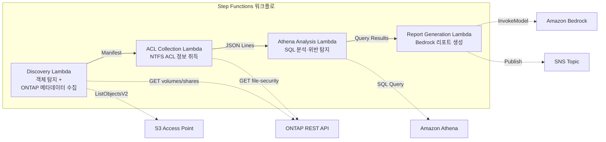

# UC1: 법무·컴플라이언스 — 파일 서버 감사·데이터 거버넌스

🌐 **Language / 言語**: [日本語](README.md) | [English](README.en.md) | 한국어 | [简体中文](README.zh-CN.md) | [繁體中文](README.zh-TW.md) | [Français](README.fr.md) | [Deutsch](README.de.md) | [Español](README.es.md)

📚 **문서**: [아키텍처 다이어그램](docs/architecture.ko.md) | [데모 가이드](docs/demo-guide.ko.md)

## 개요

Amazon FSx for NetApp ONTAP의 S3 Access Points를 활용하여 파일 서버의 NTFS ACL 정보를 자동으로 수집·분석하고 컴플라이언스 리포트를 생성하는 서버리스 워크플로입니다.

### 이 패턴이 적합한 경우

- NAS 데이터에 대한 정기적인 거버넌스·컴플라이언스 스캔이 필요함
- S3 이벤트 알림을 사용할 수 없거나 폴링 기반 감사가 바람직함
- 파일 데이터는 ONTAP에 보관하고 기존 SMB/NFS 액세스를 유지하고 싶음
- NTFS ACL 변경 이력을 Athena로 횡단 분석하고 싶음
- 자연어 컴플라이언스 리포트를 자동 생성하고 싶음

### 이 패턴이 적합하지 않은 경우

- 실시간 이벤트 기반 처리가 필요함(파일 변경 즉시 감지)
- 완전한 S3 버킷 시맨틱(알림, Presigned URL)이 필요함
- EC2 기반 배치 처리가 이미 가동 중이며 마이그레이션 비용이 타당하지 않음
- ONTAP REST API에 대한 네트워크 도달성을 확보할 수 없는 환경

### 주요 기능

- ONTAP REST API를 통해 NTFS ACL, CIFS 공유, 익스포트 정책 정보를 자동 수집
- Athena SQL로 과도한 권한 공유, 오래된 액세스, 정책 위반을 탐지
- Amazon Bedrock으로 자연어 컴플라이언스 리포트를 자동 생성
- SNS 알림으로 감사 결과를 즉시 공유

## Success Metrics

### Outcome
파일 서버 감사·컴플라이언스 점검을 자동화하여 수동 감사 공수를 절감합니다.

### Metrics
| 메트릭 | 목표값(예) |
|-----------|------------|
| 실행당 스캔 대상 파일 수 | > 1,000 files |
| 스캔당 과도한 권한 탐지 수 | 시각화(기준선 확립) |
| 컴플라이언스 리포트 생성 시간 | < 5분 |
| 수동 감사 공수 절감률 | > 50% |
| 스캔당 비용 | < $1 |
| Human Review 대상 비율 | < 10%(고위험 탐지만) |

### Measurement Method
Step Functions 실행 이력, CloudWatch Metrics(FilesProcessed, Duration), 생성된 리포트의 메타데이터, SNS 알림 로그.

### Sample Run Results (실측 예)

**환경**: FSx for ONTAP Single-AZ, 128 MBps, ap-northeast-1, S3AP Internet Origin

| 지표 | Before (수동) | After (S3AP 자동화) |
|------|-------------|-------------------|
| 파일 탐지 | 수 시간(수동 재고 조사) | 36 ms (10 files) |
| 파일 읽기 | 개별 액세스 | avg 37 ms / file |
| 전체 처리 시간 | 수 시간~수일 | 404 ms (10 files, sequential) |
| 리포트 형식 | 비표준화 | JSON 메타데이터 + 감사 리포트 |
| 리뷰 체계 | 담당자 의존 | Human Review Queue |
| 감사 추적 | 개인 기록 | DynamoDB + CloudWatch |

> **참고**: 위 값은 소규모 샘플 런의 결과이며, 프로덕션 환경의 스루풋 추정치나 성능 보장이 아닙니다. UC1의 sample run은 합성 또는 비민감 샘플 파일을 사용하며 고객의 법무 문서를 나타내지 않습니다. 본 sample run은 처리 경로의 검증만을 위한 것입니다. 법적 타당성, 분류 품질, 리뷰 완전성은 고객 고유의 PoC에서 별도로 평가하십시오.

## 아키텍처



### 워크플로 단계

1. **Discovery**: S3 AP에서 객체 목록을 취득하고 ONTAP 메타데이터(보안 스타일, 익스포트 정책, CIFS 공유 ACL)를 수집
2. **ACL Collection**: 각 객체의 NTFS ACL 정보를 ONTAP REST API를 통해 취득하고 JSON Lines 형식으로 날짜 파티션이 적용된 S3에 출력
3. **Athena Analysis**: Glue Data Catalog 테이블을 생성/갱신하고 Athena SQL로 과도한 권한·오래된 액세스·정책 위반을 탐지
4. **Report Generation**: Bedrock으로 자연어 컴플라이언스 리포트를 생성하고 S3에 출력 + SNS 알림

## 전제 조건

- AWS 계정과 적절한 IAM 권한
- FSx for ONTAP 파일 시스템(ONTAP 9.17.1P4D3 이상)
- S3 Access Points가 활성화된 볼륨
- ONTAP REST API 인증 정보가 Secrets Manager에 등록됨
- VPC, 프라이빗 서브넷
- Amazon Bedrock 모델 액세스가 활성화됨(Claude / Nova)

### VPC 내 Lambda 실행 시 주의 사항

> **배포 검증(2026-05-03)에서 확인된 중요 사항**

- **PoC / 데모 환경**: Lambda를 VPC 외부에서 실행하는 것을 권장. S3 AP의 network origin이 `internet`이면 VPC 외부 Lambda에서 문제없이 액세스 가능
- **프로덕션 환경**: `PrivateRouteTableId` 파라미터를 지정하고 S3 Gateway Endpoint에 라우트 테이블을 연결할 것. 지정하지 않으면 VPC 내 Lambda에서 S3 AP로의 액세스가 타임아웃됨
- 자세한 내용은 [트러블슈팅 가이드](../docs/guides/troubleshooting-guide.md#6-lambda-vpc-内実行時の-s3-ap-タイムアウト)를 참조

## 배포 절차

### 1. 파라미터 준비

배포 전에 다음 값을 확인하십시오:

- FSx for ONTAP S3 Access Point Alias
- ONTAP 관리 IP 주소
- Secrets Manager 시크릿 이름
- SVM UUID, 볼륨 UUID
- VPC ID, 프라이빗 서브넷 ID

### 2. SAM 배포

```bash
# 전제: AWS SAM CLI가 필요합니다. sam build가 코드와 공유 레이어를 자동으로 패키징합니다.
sam build

sam deploy \
  --stack-name fsxn-legal-compliance \
  --parameter-overrides \
    S3AccessPointAlias=<your-volume-ext-s3alias> \
    S3AccessPointName=<your-s3ap-name> \
    S3AccessPointOutputAlias=<your-output-volume-ext-s3alias> \
    OntapSecretName=<your-ontap-secret-name> \
    OntapManagementIp=<your-ontap-management-ip> \
    SvmUuid=<your-svm-uuid> \
    VolumeUuid=<your-volume-uuid> \
    ScheduleExpression="rate(1 hour)" \
    VpcId=<your-vpc-id> \
    PrivateSubnetIds=<subnet-1>,<subnet-2> \
    PrivateRouteTableIds=<rtb-1>,<rtb-2> \
    NotificationEmail=<your-email@example.com> \
    EnableVpcEndpoints=false \
    EnableCloudWatchAlarms=false \
  --capabilities CAPABILITY_NAMED_IAM \
  --resolve-s3 \
  --region ap-northeast-1
```

> **주의**: `template.yaml`은 SAM CLI(`sam build` + `sam deploy`)로 사용합니다.
> `aws cloudformation deploy` 명령으로 직접 배포하는 경우에는 `template-deploy.yaml`을 사용하십시오(Lambda zip 파일의 사전 패키징과 S3 업로드가 필요합니다).

> **주의**: `<...>` 플레이스홀더를 실제 환경 값으로 치환하십시오.

### 3. SNS 구독 확인

배포 후 지정한 이메일 주소로 SNS 구독 확인 메일이 도착합니다. 메일 내의 링크를 클릭하여 확인하십시오.

> **주의**: `S3AccessPointName`을 생략하면 IAM 정책이 Alias 기반만으로 되어 `AccessDenied` 오류가 발생할 수 있습니다. 프로덕션 환경에서는 지정을 권장합니다. 자세한 내용은 [트러블슈팅 가이드](../docs/guides/troubleshooting-guide.md#1-accessdenied-エラー)를 참조하십시오.

## 설정 파라미터 목록

| 파라미터 | 설명 | 기본값 | 필수 |
|-----------|------|----------|------|
| `S3AccessPointAlias` | FSx for ONTAP S3 AP Alias(입력용) | — | ✅ |
| `S3AccessPointName` | S3 AP 이름(ARN 기반 IAM 권한 부여용. 생략 시 Alias 기반만) | `""` | ⚠️ 권장 |
| `S3AccessPointOutputAlias` | FSx for ONTAP S3 AP Alias(출력용) | — | ✅ |
| `OntapSecretName` | ONTAP 인증 정보의 Secrets Manager 시크릿 이름 | — | ✅ |
| `OntapManagementIp` | ONTAP 클러스터 관리 IP 주소 | — | ✅ |
| `SvmUuid` | ONTAP SVM UUID | — | ✅ |
| `VolumeUuid` | ONTAP 볼륨 UUID | — | ✅ |
| `ScheduleExpression` | EventBridge Scheduler의 스케줄 식 | `rate(1 hour)` | |
| `VpcId` | VPC ID | — | ✅ |
| `PrivateSubnetIds` | 프라이빗 서브넷 ID 목록 | — | ✅ |
| `PrivateRouteTableIds` | 프라이빗 서브넷의 라우트 테이블 ID 목록(쉼표 구분) | — | ✅ |
| `NotificationEmail` | SNS 알림 대상 이메일 주소 | — | ✅ |
| `EnableVpcEndpoints` | Interface VPC Endpoints 활성화 | `false` | |
| `EnableCloudWatchAlarms` | CloudWatch Alarms 활성화 | `false` | |
| `EnableAthenaWorkgroup` | Athena Workgroup / Glue Data Catalog 활성화 | `true` | |

## 비용 구조

### 요청 기반(종량 과금)

| 서비스 | 과금 단위 | 개략(100 파일/월) |
|---------|---------|---------------------|
| Lambda | 요청 수 + 실행 시간 | ~$0.01 |
| Step Functions | 상태 전이 수 | 무료 범위 내 |
| S3 API | 요청 수 | ~$0.01 |
| Athena | 스캔 데이터량 | ~$0.01 |
| Bedrock | 토큰 수 | ~$0.10 |

### 상시 가동(옵션)

| 서비스 | 파라미터 | 월액 |
|---------|-----------|------|
| Interface VPC Endpoints | `EnableVpcEndpoints=true` | ~$28.80 |
| CloudWatch Alarms | `EnableCloudWatchAlarms=true` | ~$0.30 |

> 데모/PoC 환경에서는 변동비만으로 **~$0.13/월**부터 이용 가능합니다.

## 클린업

```bash
# CloudFormation 스택 삭제
aws cloudformation delete-stack \
  --stack-name fsxn-legal-compliance \
  --region ap-northeast-1

# 삭제 완료 대기
aws cloudformation wait stack-delete-complete \
  --stack-name fsxn-legal-compliance \
  --region ap-northeast-1
```

> **주의**: S3 버킷에 객체가 남아 있으면 스택 삭제가 실패할 수 있습니다. 사전에 버킷을 비우십시오.

## Supported Regions

UC1은 다음 서비스를 사용합니다:

| 서비스 | 리전 제약 |
|---------|-------------|
| Amazon Athena | 거의 모든 리전에서 이용 가능 |
| Amazon Bedrock | 지원 리전 확인([Bedrock 지원 리전](https://docs.aws.amazon.com/general/latest/gr/bedrock.html)) |
| AWS X-Ray | 거의 모든 리전에서 이용 가능 |
| CloudWatch EMF | 거의 모든 리전에서 이용 가능 |

> 자세한 내용은 [리전 호환성 매트릭스](../docs/region-compatibility.md)를 참조.

## 참고 링크

### AWS 공식 문서

- [FSx for ONTAP S3 Access Points 개요](https://docs.aws.amazon.com/fsx/latest/ONTAPGuide/accessing-data-via-s3-access-points.html)
- [Athena에서 SQL 쿼리(공식 튜토리얼)](https://docs.aws.amazon.com/fsx/latest/ONTAPGuide/tutorial-query-data-with-athena.html)
- [Lambda로 서버리스 처리(공식 튜토리얼)](https://docs.aws.amazon.com/fsx/latest/ONTAPGuide/tutorial-process-files-with-lambda.html)
- [Bedrock InvokeModel API 레퍼런스](https://docs.aws.amazon.com/bedrock/latest/APIReference/API_runtime_InvokeModel.html)
- [ONTAP REST API 레퍼런스](https://docs.netapp.com/us-en/ontap-automation/)

### AWS 블로그 게시글

- [S3 AP 발표 블로그](https://aws.amazon.com/blogs/aws/amazon-fsx-for-netapp-ontap-now-integrates-with-amazon-s3-for-seamless-data-access/)
- [AD 통합 블로그](https://aws.amazon.com/blogs/storage/enabling-ai-powered-analytics-on-enterprise-file-data-configuring-s3-access-points-for-amazon-fsx-for-netapp-ontap-with-active-directory/)
- [3가지 서버리스 아키텍처 패턴](https://aws.amazon.com/blogs/storage/bridge-legacy-and-modern-applications-with-amazon-s3-access-points-for-amazon-fsx/)

### GitHub 샘플

- [aws-samples/serverless-patterns](https://github.com/aws-samples/serverless-patterns) — 서버리스 패턴 모음
- [aws-samples/aws-stepfunctions-examples](https://github.com/aws-samples/aws-stepfunctions-examples) — Step Functions 샘플

## 검증 완료 환경

| 항목 | 값 |
|------|-----|
| AWS 리전 | ap-northeast-1 (도쿄) |
| FSx for ONTAP 버전 | ONTAP 9.17.1P4D3 |
| FSx 구성 | SINGLE_AZ_1 |
| Python | 3.12 |
| 배포 방식 | CloudFormation (표준) |

## Lambda VPC 배치 아키텍처

검증에서 얻은 지견에 기반하여 Lambda 함수는 VPC 내/외로 분리 배치되어 있습니다.

**VPC 내 Lambda**(ONTAP REST API 액세스가 필요한 함수만):
- Discovery Lambda — S3 AP + ONTAP API
- AclCollection Lambda — ONTAP file-security API

**VPC 외 Lambda**(AWS 관리형 서비스 API만 사용):
- 그 외 모든 Lambda 함수

> **이유**: VPC 내 Lambda에서 AWS 관리형 서비스 API(Athena, Bedrock, Textract 등)에 액세스하려면 Interface VPC Endpoint가 필요합니다(각 $7.20/월). VPC 외 Lambda는 인터넷을 통해 직접 AWS API에 액세스할 수 있으며 추가 비용 없이 동작합니다.

> **주의**: ONTAP REST API를 사용하는 UC(UC1 법무·컴플라이언스)에서는 `EnableVpcEndpoints=true`가 필수입니다. Secrets Manager VPC Endpoint를 통해 ONTAP 인증 정보를 취득하기 때문입니다.

---

## AWS 문서 링크

| 서비스 | 문서 |
|---------|------------|
| FSx for ONTAP | [사용자 가이드](https://docs.aws.amazon.com/fsx/latest/ONTAPGuide/what-is-fsx-ontap.html) |
| S3 Access Points | [S3 AP for FSx for ONTAP](https://docs.aws.amazon.com/fsx/latest/ONTAPGuide/s3-access-points.html) |
| Step Functions | [개발자 가이드](https://docs.aws.amazon.com/step-functions/latest/dg/welcome.html) |
| Amazon Athena | [사용자 가이드](https://docs.aws.amazon.com/athena/latest/ug/what-is.html) |
| Amazon Bedrock | [사용자 가이드](https://docs.aws.amazon.com/bedrock/latest/userguide/what-is-bedrock.html) |
| ONTAP REST API | [NetApp ONTAP REST API 레퍼런스](https://docs.netapp.com/us-en/ontap-automation/) |

### Well-Architected Framework 대응

| 기둥 | 대응 |
|----|------|
| 운영 우수성 | X-Ray 트레이싱, EMF 메트릭, CloudWatch Alarms |
| 보안 | 최소 권한 IAM, KMS 암호화, VPC 분리, Secrets Manager |
| 신뢰성 | Step Functions Retry/Catch, Map state 병렬 처리 |
| 성능 효율성 | Lambda 메모리 최적화, 병렬 ACL 수집 |
| 비용 최적화 | 서버리스(사용 시에만 과금), 조건부 VPC Endpoint |
| 지속 가능성 | 온디맨드 실행, 불필요한 리소스의 자동 정지 |

---

## 로컬 테스트

### Prerequisites 점검

```bash
# 전제 조건 확인
aws --version          # AWS CLI v2
sam --version          # SAM CLI
python3 --version      # Python 3.9+
docker --version       # Docker (sam local용)
aws sts get-caller-identity  # AWS 인증 정보
```

### sam local invoke

```bash
# 빌드
# 전제: AWS SAM CLI가 필요합니다. sam build가 코드와 공유 레이어를 자동으로 패키징합니다.
sam build

# Discovery Lambda의 로컬 실행
sam local invoke DiscoveryFunction --event events/discovery-event.json

# 환경 변수 오버라이드 포함
sam local invoke DiscoveryFunction \
  --event events/discovery-event.json \
  --env-vars env.json
```

### 유닛 테스트

```bash
python3 -m pytest tests/ -v
```

자세한 내용은 [로컬 테스트 퀵 스타트](../docs/local-testing-quick-start.md)를 참조하십시오.

---

## 출력 샘플 (Output Sample)

Step Functions 실행 완료 시의 최종 출력 예:

```json
{
  "discovery": {
    "status": "completed",
    "object_count": 549,
    "prefix": "legal-docs/",
    "timestamp": 1716480000
  },
  "acl_collection": {
    "processed": 549,
    "acl_records_written": 2847,
    "output_prefix": "s3://output-bucket/acl-data/"
  },
  "athena_analysis": {
    "findings": {
      "excessive_permissions": 12,
      "stale_access": 34,
      "policy_violations": 3
    },
    "query_execution_id": "a1b2c3d4-..."
  },
  "report_generation": {
    "report_key": "reports/compliance-2026-05-23T09:00:00.md",
    "total_findings": 49,
    "sns_message_id": "msg-12345..."
  }
}
```

> **참고**: 위 값은 샘플 출력이며 실제 값은 환경·입력 데이터에 따라 다릅니다. 벤치마크 수치는 sizing reference이며 service limit이 아닙니다.

---

## Governance Note

> 본 패턴은 기술 아키텍처 가이던스를 제공합니다. 법적·컴플라이언스·규제상의 조언이 아닙니다. 조직은 적격한 전문가에게 상담하십시오.

---

## S3AP Compatibility

S3 Access Points for FSx for ONTAP의 호환성 제약, 트러블슈팅, 트리거 패턴에 대해서는 [S3AP Compatibility Notes](../docs/s3ap-compatibility-notes.md)를 참조하십시오.
