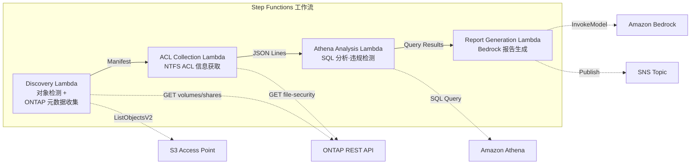

# UC1：法务与合规 — 文件服务器审计与数据治理

🌐 **Language / 言語**: [日本語](README.md) | [English](README.en.md) | [한국어](README.ko.md) | 简体中文 | [繁體中文](README.zh-TW.md) | [Français](README.fr.md) | [Deutsch](README.de.md) | [Español](README.es.md)

📚 **文档**: [架构图](docs/architecture.zh-CN.md) | [演示指南](docs/demo-guide.zh-CN.md)

## 概述

本方案是一个无服务器工作流，利用 Amazon FSx for NetApp ONTAP 的 S3 Access Points 自动收集并分析文件服务器的 NTFS ACL 信息，并生成合规报告。

### 适合使用此模式的场景

- 需要对 NAS 数据进行定期的治理与合规扫描
- S3 事件通知不可用，或更倾向于基于轮询的审计
- 希望将文件数据保留在 ONTAP 上，并维持现有的 SMB/NFS 访问
- 希望使用 Athena 对 NTFS ACL 变更历史进行横向分析
- 希望自动生成自然语言合规报告

### 不适合使用此模式的场景

- 需要实时的事件驱动型处理（即时检测文件变更）
- 需要完整的 S3 存储桶语义（通知、Presigned URL）
- 已经运行基于 EC2 的批处理，且迁移成本不划算
- 无法确保对 ONTAP REST API 的网络可达性的环境

### 主要功能

- 通过 ONTAP REST API 自动收集 NTFS ACL、CIFS 共享、导出策略信息
- 使用 Athena SQL 检测过度授权共享、陈旧访问和策略违规
- 使用 Amazon Bedrock 自动生成自然语言合规报告
- 通过 SNS 通知即时共享审计结果

## Success Metrics

### Outcome
通过自动化文件服务器审计与合规检查，减少人工审计工时。

### Metrics
| 指标 | 目标值（示例） |
|-----------|------------|
| 每次执行的扫描目标文件数 | > 1,000 files |
| 每次扫描检测到的过度授权数 | 可视化（建立基线） |
| 合规报告生成时间 | < 5 分钟 |
| 人工审计工时削减率 | > 50% |
| 每次扫描的成本 | < $1 |
| Human Review 对象比例 | < 10%（仅高风险检测） |

### Measurement Method
Step Functions 执行历史、CloudWatch Metrics（FilesProcessed、Duration）、生成报告的元数据、SNS 通知日志。

### Sample Run Results (实测示例)

**环境**：FSx for ONTAP Single-AZ, 128 MBps, ap-northeast-1, S3AP Internet Origin

| 指标 | Before（手动） | After（S3AP 自动化） |
|------|-------------|-------------------|
| 文件检测 | 数小时（手动盘点） | 36 ms (10 files) |
| 文件读取 | 单独访问 | avg 37 ms / file |
| 整体处理时间 | 数小时至数天 | 404 ms (10 files, sequential) |
| 报告格式 | 未标准化 | JSON 元数据 + 审计报告 |
| 审查体系 | 依赖负责人 | Human Review Queue |
| 审计轨迹 | 个人记录 | DynamoDB + CloudWatch |

> **注记**：以上为小规模样本运行的结果，并非生产环境的吞吐量估算或性能保证。UC1 的 sample run 使用合成或非敏感样本文件，并不代表客户的法务文档。本 sample run 仅用于验证处理路径。法律有效性、分类质量、审查完整性请在客户特定的 PoC 中另行评估。

## 架构



### 工作流步骤

1. **Discovery**：从 S3 AP 获取对象列表，并收集 ONTAP 元数据（安全样式、导出策略、CIFS 共享 ACL）
2. **ACL Collection**：通过 ONTAP REST API 获取各对象的 NTFS ACL 信息，并以 JSON Lines 格式带日期分区输出到 S3
3. **Athena Analysis**：创建/更新 Glue Data Catalog 表，使用 Athena SQL 检测过度授权、陈旧访问和策略违规
4. **Report Generation**：使用 Bedrock 生成自然语言合规报告，输出到 S3 + SNS 通知

## 前提条件

- AWS 账户和适当的 IAM 权限
- FSx for ONTAP 文件系统（ONTAP 9.17.1P4D3 或更高版本）
- 已启用 S3 Access Points 的卷
- 已在 Secrets Manager 中注册 ONTAP REST API 认证信息
- VPC、私有子网
- 已启用 Amazon Bedrock 模型访问（Claude / Nova）

### 在 VPC 内运行 Lambda 时的注意事项

> **部署验证（2026-05-03）中确认的重要事项**

- **PoC / 演示环境**：建议在 VPC 外运行 Lambda。若 S3 AP 的 network origin 为 `internet`，则可从 VPC 外 Lambda 顺利访问
- **生产环境**：请指定 `PrivateRouteTableId` 参数，并将路由表关联到 S3 Gateway Endpoint。若未指定，从 VPC 内 Lambda 访问 S3 AP 将超时
- 详情请参阅[故障排除指南](../docs/guides/troubleshooting-guide.md#6-lambda-vpc-内実行時の-s3-ap-タイムアウト)

## 部署步骤

### 1. 准备参数

部署前请确认以下值：

- FSx for ONTAP S3 Access Point Alias
- ONTAP 管理 IP 地址
- Secrets Manager 密钥名称
- SVM UUID、卷 UUID
- VPC ID、私有子网 ID

### 2. SAM 部署

```bash
# 前提：需要 AWS SAM CLI。sam build 会自动打包代码和共享层。
sam build

sam deploy \
  --stack-name fsxn-legal-compliance \
  --parameter-overrides \
    S3AccessPointAlias=<your-volume-ext-s3alias> \
    S3AccessPointName=<your-s3ap-name> \
    S3AccessPointOutputAlias=<your-output-volume-ext-s3alias> \
    OntapSecretName=<your-ontap-secret-name> \
    OntapManagementIp=<your-ontap-management-ip> \
    SvmUuid=<your-svm-uuid> \
    VolumeUuid=<your-volume-uuid> \
    ScheduleExpression="rate(1 hour)" \
    VpcId=<your-vpc-id> \
    PrivateSubnetIds=<subnet-1>,<subnet-2> \
    PrivateRouteTableIds=<rtb-1>,<rtb-2> \
    NotificationEmail=<your-email@example.com> \
    EnableVpcEndpoints=false \
    EnableCloudWatchAlarms=false \
  --capabilities CAPABILITY_NAMED_IAM \
  --resolve-s3 \
  --region ap-northeast-1
```

> **注意**：`template.yaml` 用于 SAM CLI（`sam build` + `sam deploy`）。
> 若使用 `aws cloudformation deploy` 命令直接部署，请使用 `template-deploy.yaml`（需要预先打包 Lambda zip 文件并上传到 S3）。

> **注意**：请将 `<...>` 占位符替换为实际的环境值。

### 3. 确认 SNS 订阅

部署后，将向指定的电子邮件地址发送 SNS 订阅确认邮件。请点击邮件中的链接进行确认。

> **注意**：如果省略 `S3AccessPointName`，IAM 策略将仅基于 Alias，可能会发生 `AccessDenied` 错误。生产环境建议指定。详情请参阅[故障排除指南](../docs/guides/troubleshooting-guide.md#1-accessdenied-エラー)。

## 配置参数一览

| 参数 | 说明 | 默认值 | 必填 |
|-----------|------|----------|------|
| `S3AccessPointAlias` | FSx for ONTAP S3 AP Alias（输入用） | — | ✅ |
| `S3AccessPointName` | S3 AP 名称（用于基于 ARN 的 IAM 授权。省略时仅基于 Alias） | `""` | ⚠️ 推荐 |
| `S3AccessPointOutputAlias` | FSx for ONTAP S3 AP Alias（输出用） | — | ✅ |
| `OntapSecretName` | ONTAP 认证信息的 Secrets Manager 密钥名称 | — | ✅ |
| `OntapManagementIp` | ONTAP 集群管理 IP 地址 | — | ✅ |
| `SvmUuid` | ONTAP SVM UUID | — | ✅ |
| `VolumeUuid` | ONTAP 卷 UUID | — | ✅ |
| `ScheduleExpression` | EventBridge Scheduler 的调度表达式 | `rate(1 hour)` | |
| `VpcId` | VPC ID | — | ✅ |
| `PrivateSubnetIds` | 私有子网 ID 列表 | — | ✅ |
| `PrivateRouteTableIds` | 私有子网的路由表 ID 列表（逗号分隔） | — | ✅ |
| `NotificationEmail` | SNS 通知目标电子邮件地址 | — | ✅ |
| `EnableVpcEndpoints` | 启用 Interface VPC Endpoints | `false` | |
| `EnableCloudWatchAlarms` | 启用 CloudWatch Alarms | `false` | |
| `EnableAthenaWorkgroup` | 启用 Athena Workgroup / Glue Data Catalog | `true` | |

## 成本结构

### 基于请求（按量计费）

| 服务 | 计费单位 | 概算（100 文件/月） |
|---------|---------|---------------------|
| Lambda | 请求数 + 执行时间 | ~$0.01 |
| Step Functions | 状态转换数 | 免费额度内 |
| S3 API | 请求数 | ~$0.01 |
| Athena | 扫描数据量 | ~$0.01 |
| Bedrock | 令牌数 | ~$0.10 |

### 常驻运行（可选）

| 服务 | 参数 | 月费 |
|---------|-----------|------|
| Interface VPC Endpoints | `EnableVpcEndpoints=true` | ~$28.80 |
| CloudWatch Alarms | `EnableCloudWatchAlarms=true` | ~$0.30 |

> 在演示/PoC 环境中，仅凭变动费用即可从 **~$0.13/月** 起使用。

## 清理

```bash
# 删除 CloudFormation 堆栈
aws cloudformation delete-stack \
  --stack-name fsxn-legal-compliance \
  --region ap-northeast-1

# 等待删除完成
aws cloudformation wait stack-delete-complete \
  --stack-name fsxn-legal-compliance \
  --region ap-northeast-1
```

> **注意**：如果 S3 存储桶中仍有对象，堆栈删除可能会失败。请事先清空存储桶。

## Supported Regions

UC1 使用以下服务：

| 服务 | 区域限制 |
|---------|-------------|
| Amazon Athena | 几乎所有区域均可用 |
| Amazon Bedrock | 请确认支持的区域（[Bedrock 支持区域](https://docs.aws.amazon.com/general/latest/gr/bedrock.html)） |
| AWS X-Ray | 几乎所有区域均可用 |
| CloudWatch EMF | 几乎所有区域均可用 |

> 详情请参阅[区域兼容性矩阵](../docs/region-compatibility.md)。

## 参考链接

### AWS 官方文档

- [FSx for ONTAP S3 Access Points 概述](https://docs.aws.amazon.com/fsx/latest/ONTAPGuide/accessing-data-via-s3-access-points.html)
- [使用 Athena 进行 SQL 查询（官方教程）](https://docs.aws.amazon.com/fsx/latest/ONTAPGuide/tutorial-query-data-with-athena.html)
- [使用 Lambda 进行无服务器处理（官方教程）](https://docs.aws.amazon.com/fsx/latest/ONTAPGuide/tutorial-process-files-with-lambda.html)
- [Bedrock InvokeModel API 参考](https://docs.aws.amazon.com/bedrock/latest/APIReference/API_runtime_InvokeModel.html)
- [ONTAP REST API 参考](https://docs.netapp.com/us-en/ontap-automation/)

### AWS 博客文章

- [S3 AP 发布博客](https://aws.amazon.com/blogs/aws/amazon-fsx-for-netapp-ontap-now-integrates-with-amazon-s3-for-seamless-data-access/)
- [AD 集成博客](https://aws.amazon.com/blogs/storage/enabling-ai-powered-analytics-on-enterprise-file-data-configuring-s3-access-points-for-amazon-fsx-for-netapp-ontap-with-active-directory/)
- [3 种无服务器架构模式](https://aws.amazon.com/blogs/storage/bridge-legacy-and-modern-applications-with-amazon-s3-access-points-for-amazon-fsx/)

### GitHub 示例

- [aws-samples/serverless-patterns](https://github.com/aws-samples/serverless-patterns) — 无服务器模式合集
- [aws-samples/aws-stepfunctions-examples](https://github.com/aws-samples/aws-stepfunctions-examples) — Step Functions 示例

## 已验证环境

| 项目 | 值 |
|------|-----|
| AWS 区域 | ap-northeast-1（东京） |
| FSx for ONTAP 版本 | ONTAP 9.17.1P4D3 |
| FSx 配置 | SINGLE_AZ_1 |
| Python | 3.12 |
| 部署方式 | CloudFormation（标准） |

## Lambda VPC 部署架构

基于验证获得的经验，Lambda 函数被分离部署在 VPC 内/外。

**VPC 内 Lambda**（仅需要 ONTAP REST API 访问的函数）：
- Discovery Lambda — S3 AP + ONTAP API
- AclCollection Lambda — ONTAP file-security API

**VPC 外 Lambda**（仅使用 AWS 托管服务 API）：
- 其他所有 Lambda 函数

> **原因**：要从 VPC 内 Lambda 访问 AWS 托管服务 API（Athena、Bedrock、Textract 等），需要 Interface VPC Endpoint（每个 $7.20/月）。VPC 外 Lambda 可通过互联网直接访问 AWS API，无需额外成本即可运行。

> **注意**：对于使用 ONTAP REST API 的 UC（UC1 法务与合规），`EnableVpcEndpoints=true` 是必需的。这是因为需要通过 Secrets Manager VPC Endpoint 获取 ONTAP 认证信息。

---

## AWS 文档链接

| 服务 | 文档 |
|---------|------------|
| FSx for ONTAP | [用户指南](https://docs.aws.amazon.com/fsx/latest/ONTAPGuide/what-is-fsx-ontap.html) |
| S3 Access Points | [S3 AP for FSx for ONTAP](https://docs.aws.amazon.com/fsx/latest/ONTAPGuide/s3-access-points.html) |
| Step Functions | [开发者指南](https://docs.aws.amazon.com/step-functions/latest/dg/welcome.html) |
| Amazon Athena | [用户指南](https://docs.aws.amazon.com/athena/latest/ug/what-is.html) |
| Amazon Bedrock | [用户指南](https://docs.aws.amazon.com/bedrock/latest/userguide/what-is-bedrock.html) |
| ONTAP REST API | [NetApp ONTAP REST API 参考](https://docs.netapp.com/us-en/ontap-automation/) |

### Well-Architected Framework 对应

| 支柱 | 对应 |
|----|------|
| 卓越运营 | X-Ray 跟踪、EMF 指标、CloudWatch Alarms |
| 安全性 | 最小权限 IAM、KMS 加密、VPC 隔离、Secrets Manager |
| 可靠性 | Step Functions Retry/Catch、Map state 并行处理 |
| 性能效率 | Lambda 内存优化、并行 ACL 收集 |
| 成本优化 | 无服务器（仅使用时计费）、条件性 VPC Endpoint |
| 可持续性 | 按需执行、自动停止不需要的资源 |

---

## 本地测试

### Prerequisites 检查

```bash
# 确认前提条件
aws --version          # AWS CLI v2
sam --version          # SAM CLI
python3 --version      # Python 3.9+
docker --version       # Docker (sam local 用)
aws sts get-caller-identity  # AWS 认证信息
```

### sam local invoke

```bash
# 构建
# 前提：需要 AWS SAM CLI。sam build 会自动打包代码和共享层。
sam build

# 在本地运行 Discovery Lambda
sam local invoke DiscoveryFunction --event events/discovery-event.json

# 带环境变量覆盖
sam local invoke DiscoveryFunction \
  --event events/discovery-event.json \
  --env-vars env.json
```

### 单元测试

```bash
python3 -m pytest tests/ -v
```

详情请参阅[本地测试快速入门](../docs/local-testing-quick-start.md)。

---

## 输出示例 (Output Sample)

Step Functions 执行完成时的最终输出示例：

```json
{
  "discovery": {
    "status": "completed",
    "object_count": 549,
    "prefix": "legal-docs/",
    "timestamp": 1716480000
  },
  "acl_collection": {
    "processed": 549,
    "acl_records_written": 2847,
    "output_prefix": "s3://output-bucket/acl-data/"
  },
  "athena_analysis": {
    "findings": {
      "excessive_permissions": 12,
      "stale_access": 34,
      "policy_violations": 3
    },
    "query_execution_id": "a1b2c3d4-..."
  },
  "report_generation": {
    "report_key": "reports/compliance-2026-05-23T09:00:00.md",
    "total_findings": 49,
    "sns_message_id": "msg-12345..."
  }
}
```

> **注记**：以上为示例输出，实际值因环境和输入数据而异。基准数值为 sizing reference，并非 service limit。

---

## Governance Note

> 本模式提供技术架构指导。它不是法律、合规或监管方面的建议。组织应咨询合格的专业人士。

---

## S3AP Compatibility

关于 S3 Access Points for FSx for ONTAP 的兼容性约束、故障排除和触发模式，请参阅 [S3AP Compatibility Notes](../docs/s3ap-compatibility-notes.md)。
