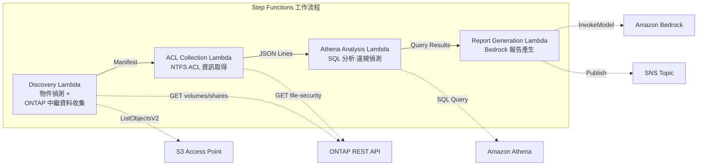

# UC1：法務與合規 — 檔案伺服器稽核與資料治理

🌐 **Language / 言語**: [日本語](README.md) | [English](README.en.md) | [한국어](README.ko.md) | [简体中文](README.zh-CN.md) | 繁體中文 | [Français](README.fr.md) | [Deutsch](README.de.md) | [Español](README.es.md)

📚 **文件**: [架構圖](docs/architecture.zh-TW.md) | [示範指南](docs/demo-guide.zh-TW.md)

## 概述

本方案是一個無伺服器工作流程，運用 Amazon FSx for NetApp ONTAP 的 S3 Access Points 自動收集並分析檔案伺服器的 NTFS ACL 資訊，並產生合規報告。

### 適合使用此模式的情境

- 需要對 NAS 資料進行定期的治理與合規掃描
- S3 事件通知無法使用，或較偏好以輪詢為基礎的稽核
- 希望將檔案資料保留在 ONTAP 上，並維持既有的 SMB/NFS 存取
- 希望使用 Athena 對 NTFS ACL 變更歷史進行橫向分析
- 希望自動產生自然語言合規報告

### 不適合使用此模式的情境

- 需要即時的事件驅動型處理（即時偵測檔案變更）
- 需要完整的 S3 儲存貯體語意（通知、Presigned URL）
- 已經運行以 EC2 為基礎的批次處理，且遷移成本不划算
- 無法確保對 ONTAP REST API 的網路可達性的環境

### 主要功能

- 透過 ONTAP REST API 自動收集 NTFS ACL、CIFS 共用、匯出原則資訊
- 使用 Athena SQL 偵測過度授權共用、陳舊存取和原則違規
- 使用 Amazon Bedrock 自動產生自然語言合規報告
- 透過 SNS 通知即時共享稽核結果

## Success Metrics

### Outcome
透過自動化檔案伺服器稽核與合規檢查，減少人工稽核工時。

### Metrics
| 指標 | 目標值（範例） |
|-----------|------------|
| 每次執行的掃描目標檔案數 | > 1,000 files |
| 每次掃描偵測到的過度授權數 | 視覺化（建立基準線） |
| 合規報告產生時間 | < 5 分鐘 |
| 人工稽核工時削減率 | > 50% |
| 每次掃描的成本 | < $1 |
| Human Review 對象比例 | < 10%（僅高風險偵測） |

### Measurement Method
Step Functions 執行歷史、CloudWatch Metrics（FilesProcessed、Duration）、產生報告的中繼資料、SNS 通知記錄。

### Sample Run Results (實測範例)

**環境**：FSx for ONTAP Single-AZ, 128 MBps, ap-northeast-1, S3AP Internet Origin

| 指標 | Before（手動） | After（S3AP 自動化） |
|------|-------------|-------------------|
| 檔案偵測 | 數小時（手動盤點） | 36 ms (10 files) |
| 檔案讀取 | 個別存取 | avg 37 ms / file |
| 整體處理時間 | 數小時至數天 | 404 ms (10 files, sequential) |
| 報告格式 | 未標準化 | JSON 中繼資料 + 稽核報告 |
| 審查體系 | 依賴負責人 | Human Review Queue |
| 稽核軌跡 | 個人記錄 | DynamoDB + CloudWatch |

> **附註**：以上為小規模樣本執行的結果，並非生產環境的輸送量估算或效能保證。UC1 的 sample run 使用合成或非敏感樣本檔案，並不代表客戶的法務文件。本 sample run 僅用於驗證處理路徑。法律有效性、分類品質、審查完整性請於客戶特定的 PoC 中另行評估。

## 架構



### 工作流程步驟

1. **Discovery**：從 S3 AP 取得物件清單，並收集 ONTAP 中繼資料（安全樣式、匯出原則、CIFS 共用 ACL）
2. **ACL Collection**：透過 ONTAP REST API 取得各物件的 NTFS ACL 資訊，並以 JSON Lines 格式帶日期分割輸出至 S3
3. **Athena Analysis**：建立/更新 Glue Data Catalog 資料表，使用 Athena SQL 偵測過度授權、陳舊存取和原則違規
4. **Report Generation**：使用 Bedrock 產生自然語言合規報告，輸出至 S3 + SNS 通知

## 前提條件

- AWS 帳戶和適當的 IAM 權限
- FSx for ONTAP 檔案系統（ONTAP 9.17.1P4D3 或更新版本）
- 已啟用 S3 Access Points 的磁碟區
- 已在 Secrets Manager 中註冊 ONTAP REST API 認證資訊
- VPC、私有子網路
- 已啟用 Amazon Bedrock 模型存取（Claude / Nova）

### 在 VPC 內執行 Lambda 時的注意事項

> **部署驗證（2026-05-03）中確認的重要事項**

- **PoC / 示範環境**：建議在 VPC 外執行 Lambda。若 S3 AP 的 network origin 為 `internet`，則可從 VPC 外 Lambda 順利存取
- **生產環境**：請指定 `PrivateRouteTableId` 參數，並將路由表關聯至 S3 Gateway Endpoint。若未指定，從 VPC 內 Lambda 存取 S3 AP 將逾時
- 詳情請參閱[疑難排解指南](../docs/guides/troubleshooting-guide.md#6-lambda-vpc-内実行時の-s3-ap-タイムアウト)

## 部署步驟

### 1. 準備參數

部署前請確認以下值：

- FSx for ONTAP S3 Access Point Alias
- ONTAP 管理 IP 位址
- Secrets Manager 密鑰名稱
- SVM UUID、磁碟區 UUID
- VPC ID、私有子網路 ID

### 2. SAM 部署

```bash
# 前提：需要 AWS SAM CLI。sam build 會自動封裝程式碼和共用層。
sam build

sam deploy \
  --stack-name fsxn-legal-compliance \
  --parameter-overrides \
    S3AccessPointAlias=<your-volume-ext-s3alias> \
    S3AccessPointName=<your-s3ap-name> \
    S3AccessPointOutputAlias=<your-output-volume-ext-s3alias> \
    OntapSecretName=<your-ontap-secret-name> \
    OntapManagementIp=<your-ontap-management-ip> \
    SvmUuid=<your-svm-uuid> \
    VolumeUuid=<your-volume-uuid> \
    ScheduleExpression="rate(1 hour)" \
    VpcId=<your-vpc-id> \
    PrivateSubnetIds=<subnet-1>,<subnet-2> \
    PrivateRouteTableIds=<rtb-1>,<rtb-2> \
    NotificationEmail=<your-email@example.com> \
    EnableVpcEndpoints=false \
    EnableCloudWatchAlarms=false \
  --capabilities CAPABILITY_NAMED_IAM \
  --resolve-s3 \
  --region ap-northeast-1
```

> **注意**：`template.yaml` 用於 SAM CLI（`sam build` + `sam deploy`）。
> 若使用 `aws cloudformation deploy` 命令直接部署，請使用 `template-deploy.yaml`（需要預先封裝 Lambda zip 檔案並上傳至 S3）。

> **注意**：請將 `<...>` 佔位符替換為實際的環境值。

### 3. 確認 SNS 訂閱

部署後，將向指定的電子郵件地址傳送 SNS 訂閱確認郵件。請點擊郵件中的連結進行確認。

> **注意**：如果省略 `S3AccessPointName`，IAM 原則將僅以 Alias 為基礎，可能會發生 `AccessDenied` 錯誤。生產環境建議指定。詳情請參閱[疑難排解指南](../docs/guides/troubleshooting-guide.md#1-accessdenied-エラー)。

## 設定參數一覽

| 參數 | 說明 | 預設值 | 必填 |
|-----------|------|----------|------|
| `S3AccessPointAlias` | FSx for ONTAP S3 AP Alias（輸入用） | — | ✅ |
| `S3AccessPointName` | S3 AP 名稱（用於以 ARN 為基礎的 IAM 授權。省略時僅以 Alias 為基礎） | `""` | ⚠️ 建議 |
| `S3AccessPointOutputAlias` | FSx for ONTAP S3 AP Alias（輸出用） | — | ✅ |
| `OntapSecretName` | ONTAP 認證資訊的 Secrets Manager 密鑰名稱 | — | ✅ |
| `OntapManagementIp` | ONTAP 叢集管理 IP 位址 | — | ✅ |
| `SvmUuid` | ONTAP SVM UUID | — | ✅ |
| `VolumeUuid` | ONTAP 磁碟區 UUID | — | ✅ |
| `ScheduleExpression` | EventBridge Scheduler 的排程運算式 | `rate(1 hour)` | |
| `VpcId` | VPC ID | — | ✅ |
| `PrivateSubnetIds` | 私有子網路 ID 清單 | — | ✅ |
| `PrivateRouteTableIds` | 私有子網路的路由表 ID 清單（逗號分隔） | — | ✅ |
| `NotificationEmail` | SNS 通知目標電子郵件地址 | — | ✅ |
| `EnableVpcEndpoints` | 啟用 Interface VPC Endpoints | `false` | |
| `EnableCloudWatchAlarms` | 啟用 CloudWatch Alarms | `false` | |
| `EnableAthenaWorkgroup` | 啟用 Athena Workgroup / Glue Data Catalog | `true` | |

## 成本結構

### 以請求為基礎（按量計費）

| 服務 | 計費單位 | 概算（100 檔案/月） |
|---------|---------|---------------------|
| Lambda | 請求數 + 執行時間 | ~$0.01 |
| Step Functions | 狀態轉換數 | 免費額度內 |
| S3 API | 請求數 | ~$0.01 |
| Athena | 掃描資料量 | ~$0.01 |
| Bedrock | 權杖數 | ~$0.10 |

### 持續運行（選用）

| 服務 | 參數 | 月費 |
|---------|-----------|------|
| Interface VPC Endpoints | `EnableVpcEndpoints=true` | ~$28.80 |
| CloudWatch Alarms | `EnableCloudWatchAlarms=true` | ~$0.30 |

> 在示範/PoC 環境中，僅憑變動費用即可從 **~$0.13/月** 起使用。

## 清理

```bash
# 刪除 CloudFormation 堆疊
aws cloudformation delete-stack \
  --stack-name fsxn-legal-compliance \
  --region ap-northeast-1

# 等待刪除完成
aws cloudformation wait stack-delete-complete \
  --stack-name fsxn-legal-compliance \
  --region ap-northeast-1
```

> **注意**：如果 S3 儲存貯體中仍有物件，堆疊刪除可能會失敗。請事先清空儲存貯體。

## Supported Regions

UC1 使用以下服務：

| 服務 | 區域限制 |
|---------|-------------|
| Amazon Athena | 幾乎所有區域均可使用 |
| Amazon Bedrock | 請確認支援的區域（[Bedrock 支援區域](https://docs.aws.amazon.com/general/latest/gr/bedrock.html)） |
| AWS X-Ray | 幾乎所有區域均可使用 |
| CloudWatch EMF | 幾乎所有區域均可使用 |

> 詳情請參閱[區域相容性矩陣](../docs/region-compatibility.md)。

## 參考連結

### AWS 官方文件

- [FSx for ONTAP S3 Access Points 概述](https://docs.aws.amazon.com/fsx/latest/ONTAPGuide/accessing-data-via-s3-access-points.html)
- [使用 Athena 進行 SQL 查詢（官方教學）](https://docs.aws.amazon.com/fsx/latest/ONTAPGuide/tutorial-query-data-with-athena.html)
- [使用 Lambda 進行無伺服器處理（官方教學）](https://docs.aws.amazon.com/fsx/latest/ONTAPGuide/tutorial-process-files-with-lambda.html)
- [Bedrock InvokeModel API 參考](https://docs.aws.amazon.com/bedrock/latest/APIReference/API_runtime_InvokeModel.html)
- [ONTAP REST API 參考](https://docs.netapp.com/us-en/ontap-automation/)

### AWS 部落格文章

- [S3 AP 發布部落格](https://aws.amazon.com/blogs/aws/amazon-fsx-for-netapp-ontap-now-integrates-with-amazon-s3-for-seamless-data-access/)
- [AD 整合部落格](https://aws.amazon.com/blogs/storage/enabling-ai-powered-analytics-on-enterprise-file-data-configuring-s3-access-points-for-amazon-fsx-for-netapp-ontap-with-active-directory/)
- [3 種無伺服器架構模式](https://aws.amazon.com/blogs/storage/bridge-legacy-and-modern-applications-with-amazon-s3-access-points-for-amazon-fsx/)

### GitHub 範例

- [aws-samples/serverless-patterns](https://github.com/aws-samples/serverless-patterns) — 無伺服器模式合集
- [aws-samples/aws-stepfunctions-examples](https://github.com/aws-samples/aws-stepfunctions-examples) — Step Functions 範例

## 已驗證環境

| 項目 | 值 |
|------|-----|
| AWS 區域 | ap-northeast-1（東京） |
| FSx for ONTAP 版本 | ONTAP 9.17.1P4D3 |
| FSx 組態 | SINGLE_AZ_1 |
| Python | 3.12 |
| 部署方式 | CloudFormation（標準） |

## Lambda VPC 部署架構

基於驗證獲得的經驗，Lambda 函數被分離部署在 VPC 內/外。

**VPC 內 Lambda**（僅需要 ONTAP REST API 存取的函數）：
- Discovery Lambda — S3 AP + ONTAP API
- AclCollection Lambda — ONTAP file-security API

**VPC 外 Lambda**（僅使用 AWS 受管服務 API）：
- 其他所有 Lambda 函數

> **原因**：要從 VPC 內 Lambda 存取 AWS 受管服務 API（Athena、Bedrock、Textract 等），需要 Interface VPC Endpoint（每個 $7.20/月）。VPC 外 Lambda 可透過網際網路直接存取 AWS API，無需額外成本即可運行。

> **注意**：對於使用 ONTAP REST API 的 UC（UC1 法務與合規），`EnableVpcEndpoints=true` 是必需的。這是因為需要透過 Secrets Manager VPC Endpoint 取得 ONTAP 認證資訊。

---

## AWS 文件連結

| 服務 | 文件 |
|---------|------------|
| FSx for ONTAP | [使用者指南](https://docs.aws.amazon.com/fsx/latest/ONTAPGuide/what-is-fsx-ontap.html) |
| S3 Access Points | [S3 AP for FSx for ONTAP](https://docs.aws.amazon.com/fsx/latest/ONTAPGuide/s3-access-points.html) |
| Step Functions | [開發人員指南](https://docs.aws.amazon.com/step-functions/latest/dg/welcome.html) |
| Amazon Athena | [使用者指南](https://docs.aws.amazon.com/athena/latest/ug/what-is.html) |
| Amazon Bedrock | [使用者指南](https://docs.aws.amazon.com/bedrock/latest/userguide/what-is-bedrock.html) |
| ONTAP REST API | [NetApp ONTAP REST API 參考](https://docs.netapp.com/us-en/ontap-automation/) |

### Well-Architected Framework 對應

| 支柱 | 對應 |
|----|------|
| 卓越營運 | X-Ray 追蹤、EMF 指標、CloudWatch Alarms |
| 安全性 | 最小權限 IAM、KMS 加密、VPC 隔離、Secrets Manager |
| 可靠性 | Step Functions Retry/Catch、Map state 平行處理 |
| 效能效率 | Lambda 記憶體最佳化、平行 ACL 收集 |
| 成本最佳化 | 無伺服器（僅使用時計費）、條件式 VPC Endpoint |
| 永續性 | 隨需執行、自動停止不需要的資源 |

---

## 本機測試

### Prerequisites 檢查

```bash
# 確認前提條件
aws --version          # AWS CLI v2
sam --version          # SAM CLI
python3 --version      # Python 3.9+
docker --version       # Docker (sam local 用)
aws sts get-caller-identity  # AWS 認證資訊
```

### sam local invoke

```bash
# 建置
# 前提：需要 AWS SAM CLI。sam build 會自動封裝程式碼和共用層。
sam build

# 在本機執行 Discovery Lambda
sam local invoke DiscoveryFunction --event events/discovery-event.json

# 帶環境變數覆寫
sam local invoke DiscoveryFunction \
  --event events/discovery-event.json \
  --env-vars env.json
```

### 單元測試

```bash
python3 -m pytest tests/ -v
```

詳情請參閱[本機測試快速入門](../docs/local-testing-quick-start.md)。

---

## 輸出範例 (Output Sample)

Step Functions 執行完成時的最終輸出範例：

```json
{
  "discovery": {
    "status": "completed",
    "object_count": 549,
    "prefix": "legal-docs/",
    "timestamp": 1716480000
  },
  "acl_collection": {
    "processed": 549,
    "acl_records_written": 2847,
    "output_prefix": "s3://output-bucket/acl-data/"
  },
  "athena_analysis": {
    "findings": {
      "excessive_permissions": 12,
      "stale_access": 34,
      "policy_violations": 3
    },
    "query_execution_id": "a1b2c3d4-..."
  },
  "report_generation": {
    "report_key": "reports/compliance-2026-05-23T09:00:00.md",
    "total_findings": 49,
    "sns_message_id": "msg-12345..."
  }
}
```

> **附註**：以上為範例輸出，實際值因環境和輸入資料而異。基準數值為 sizing reference，並非 service limit。

---

## Governance Note

> 本模式提供技術架構指導。它不是法律、合規或監管方面的建議。組織應諮詢合格的專業人士。

---

## S3AP Compatibility

關於 S3 Access Points for FSx for ONTAP 的相容性約束、疑難排解和觸發模式，請參閱 [S3AP Compatibility Notes](../docs/s3ap-compatibility-notes.md)。
