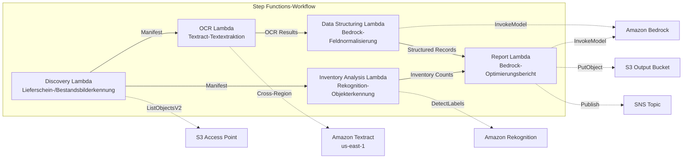

# UC12: Logistik / Lieferkette — Lieferschein-OCR & Lagerbestandsbildanalyse

🌐 **Language / 言語**: [日本語](README.md) | [English](README.en.md) | [한국어](README.ko.md) | [简体中文](README.zh-CN.md) | [繁體中文](README.zh-TW.md) | [Français](README.fr.md) | Deutsch | [Español](README.es.md)

📚 **Dokumentation**: [Architekturdiagramm](docs/architecture.md) | [Demo-Leitfaden](docs/demo-guide.md)

## Übersicht

Dieser serverlose Workflow nutzt die S3 Access Points von FSx for ONTAP, um die OCR-Textextraktion von Lieferscheinen, die Objekterkennung und -zählung in Lagerbestandsbildern sowie die Erstellung von Berichten zur Lieferroutenoptimierung zu automatisieren.

### Fälle, in denen dieses Muster geeignet ist

- Lieferscheinbilder und Lagerbestandsbilder werden auf FSx for ONTAP gespeichert
- Sie möchten die OCR von Lieferscheinen (Absender, Empfänger, Tracking-Nummer, Artikel) mit Textract automatisieren
- Die Normalisierung der extrahierten Felder und die Generierung strukturierter Lieferdatensätze mit Bedrock ist erforderlich
- Sie möchten die Objekterkennung und -zählung (Paletten, Kisten, Regalauslastung) von Lagerbestandsbildern mit Rekognition durchführen
- Sie möchten Berichte zur Lieferroutenoptimierung automatisch generieren

### Fälle, in denen dieses Muster nicht geeignet ist

- Ein Echtzeit-Lieferverfolgungssystem ist erforderlich
- Eine direkte Integration mit einem großen WMS (Warehouse Management System) ist erforderlich
- Eine vollständige Engine zur Lieferroutenoptimierung ist erforderlich (spezialisierte Software ist angemessen)
- Eine Umgebung, in der keine Netzwerkerreichbarkeit zur ONTAP REST API sichergestellt werden kann

### Hauptfunktionen

- Automatische Erkennung von Lieferscheinbildern (.jpg, .jpeg, .png, .tiff, .pdf) und Lagerbestandsbildern über S3 AP
- OCR von Lieferscheinen (Text- und Formularextraktion) über Textract (Cross-Region)
- Setzen eines Flags zur manuellen Überprüfung für Ergebnisse mit geringer Zuverlässigkeit
- Normalisierung extrahierter Felder und Generierung strukturierter Lieferdatensätze über Bedrock
- Objekterkennung und -zählung von Lagerbestandsbildern über Rekognition
- Generierung von Berichten zur Lieferroutenoptimierung über Bedrock

## Success Metrics

### Outcome
Steigerung der Effizienz des Logistikbetriebs durch Automatisierung der Lieferschein-OCR und der Lagerbestandsbildanalyse.

### Metrics
| Metrik | Zielwert (Beispiel) |
|-----------|------------|
| Verarbeitete Dokumente / Ausführung | > 300 documents |
| OCR-Genauigkeit | > 95% |
| Erfolgsrate der Datenextraktion | > 90% |
| Verarbeitungszeit / Dokument | < 20 Sek. |
| Kosten / Ausführung | < $5 |
| Human-Review-Quote | < 15% (unlesbar / geringe Zuverlässigkeit) |

### Measurement Method
Step Functions-Ausführungsverlauf, Textract confidence score, Rekognition-Erkennungsergebnisse, CloudWatch Metrics.

## Architektur



### Workflow-Schritte

1. **Discovery**: Erkennung von Lieferscheinbildern und Lagerbestandsbildern aus S3 AP
2. **OCR**: Extraktion von Text und Formularen aus Lieferscheinen mit Textract (Cross-Region)
3. **Data Structuring**: Normalisierung der extrahierten Felder mit Bedrock und Generierung strukturierter Lieferdatensätze
4. **Inventory Analysis**: Objekterkennung und -zählung von Lagerbestandsbildern mit Rekognition
5. **Report**: Generierung eines Berichts zur Lieferroutenoptimierung mit Bedrock, Ausgabe nach S3 + SNS-Benachrichtigung

## Voraussetzungen

- AWS-Konto und geeignete IAM-Berechtigungen
- FSx for ONTAP-Dateisystem (ONTAP 9.17.1P4D3 oder höher)
- Volume mit aktiviertem S3 Access Point (speichert Lieferscheine und Bestandsbilder)
- VPC, private Subnetze
- Amazon Bedrock-Modellzugriff aktiviert (Claude / Nova)
- **Cross-Region**: Da Textract in ap-northeast-1 nicht unterstützt wird, ist ein Cross-Region-Aufruf nach us-east-1 erforderlich

## Bereitstellungsschritte

### 1. Überprüfung der Cross-Region-Parameter

Da Textract in einigen Regionen (z. B. ap-northeast-1) nicht unterstützt wird, konfigurieren Sie einen Cross-Region-Aufruf mit dem Parameter `CrossRegion`.

### 2. Vorbereitung

```bash
# AWS SAM CLI installieren (falls noch nicht installiert)
# https://docs.aws.amazon.com/serverless-application-model/latest/developerguide/install-sam-cli.html

# Repository klonen
git clone https://github.com/Yoshiki0705/FSx-for-ONTAP-S3AccessPoints-Serverless-Patterns.git
cd FSx-for-ONTAP-S3AccessPoints-Serverless-Patterns/solutions/industry/logistics-ocr
```

### 3. samconfig.toml konfigurieren

```bash
cp samconfig.toml.example samconfig.toml
# Bearbeiten Sie samconfig.toml und ersetzen Sie die Werte durch Ihre tatsächlichen Werte
```

### 4. Build und Bereitstellung mit SAM CLI

```bash
# Build (packt automatisch den Lambda-Code + generiert die shared/-Layer)
# Voraussetzung: AWS SAM CLI erforderlich. „sam build“ verpackt Code und Shared Layer automatisch.
sam build

# Bereitstellung
sam deploy --config-file samconfig.toml
```

Es ist auch möglich, ohne `samconfig.toml` durch direkte Angabe der Parameter bereitzustellen:

```bash
# Voraussetzung: AWS SAM CLI erforderlich. „sam build“ verpackt Code und Shared Layer automatisch.
sam build

sam deploy \
  --stack-name fsxn-logistics-ocr \
  --parameter-overrides \
    S3AccessPointAlias=<your-volume-ext-s3alias> \
    OntapSecretName=<your-ontap-secret-name> \
    OntapManagementIp=<your-ontap-mgmt-ip> \
    SvmUuid=<your-svm-uuid> \
    VpcId=<your-vpc-id> \
    PrivateSubnetIds=<subnet-1>,<subnet-2> \
    NotificationEmail=<your-email@example.com> \
    CrossRegion=us-east-1 \
    EnableVpcEndpoints=false \
    EnableCloudWatchAlarms=false \
  --capabilities CAPABILITY_NAMED_IAM \
  --resolve-s3 \
  --region <your-region>
```

> **Hinweis**: `template.yaml` wird mit der SAM CLI (`sam build` + `sam deploy`) verwendet.
> Für eine direkte Bereitstellung mit dem Befehl `aws cloudformation deploy` verwenden Sie stattdessen `template-deploy.yaml` (erfordert das vorherige Packen der Lambda-Zip-Dateien und das Hochladen in einen S3-Bucket).

## Liste der Konfigurationsparameter

| Parameter | Beschreibung | Standard | Erforderlich |
|-----------|------|----------|------|
| `S3AccessPointAlias` | FSx for ONTAP S3 AP Alias (für die Eingabe) | — | ✅ |
| `S3AccessPointName` | S3 AP-Name (für ARN-basierte IAM-Berechtigungen; bei Weglassen nur Alias-basiert) | `""` | ⚠️ Empfohlen |
| `ScheduleExpression` | Zeitplanausdruck des EventBridge Scheduler | `rate(1 hour)` | |
| `VpcId` | VPC ID | — | ✅ |
| `PrivateSubnetIds` | Liste der privaten Subnetz-IDs | — | ✅ |
| `NotificationEmail` | SNS-Benachrichtigungs-E-Mail-Adresse | — | ✅ |
| `CrossRegionTarget` | Zielregion von Textract | `us-east-1` | |
| `MapConcurrency` | Anzahl paralleler Ausführungen des Map-Status | `10` | |
| `LambdaMemorySize` | Lambda-Speichergröße (MB) | `512` | |
| `LambdaTimeout` | Lambda-Timeout (Sek.) | `300` | |
| `EnableVpcEndpoints` | Interface VPC Endpoints aktivieren | `false` | |
| `EnableCloudWatchAlarms` | CloudWatch Alarms aktivieren | `false` | |

## Bereinigung

```bash
aws s3 rm s3://fsxn-logistics-ocr-output-${AWS_ACCOUNT_ID} --recursive

aws cloudformation delete-stack \
  --stack-name fsxn-logistics-ocr \
  --region ap-northeast-1

aws cloudformation wait stack-delete-complete \
  --stack-name fsxn-logistics-ocr \
  --region ap-northeast-1
```

## Supported Regions

UC12 verwendet die folgenden Dienste:

| Dienst | Regionale Einschränkung |
|---------|-------------|
| Amazon Textract | Nicht in ap-northeast-1 verfügbar. Geben Sie über den Parameter `TEXTRACT_REGION` eine unterstützte Region (z. B. us-east-1) an |
| Amazon Rekognition | In fast allen Regionen verfügbar |
| Amazon Bedrock | Unterstützte Regionen prüfen ([Von Bedrock unterstützte Regionen](https://docs.aws.amazon.com/general/latest/gr/bedrock.html)) |
| AWS X-Ray | In fast allen Regionen verfügbar |
| CloudWatch EMF | In fast allen Regionen verfügbar |

> Rufen Sie die Textract API über den Cross-Region Client auf. Überprüfen Sie die Anforderungen an die Datenresidenz. Weitere Informationen finden Sie in der [Regionskompatibilitätsmatrix](../docs/region-compatibility.md).

## Referenzlinks

- [Übersicht über FSx for ONTAP S3 Access Points](https://docs.aws.amazon.com/fsx/latest/ONTAPGuide/accessing-data-via-s3-access-points.html)
- [Amazon Textract-Dokumentation](https://docs.aws.amazon.com/textract/latest/dg/what-is.html)
- [Amazon Rekognition Label-Erkennung](https://docs.aws.amazon.com/rekognition/latest/dg/labels.html)
- [Amazon Bedrock API-Referenz](https://docs.aws.amazon.com/bedrock/latest/APIReference/API_runtime_InvokeModel.html)

---

## AWS-Dokumentationslinks

| Dienst | Dokumentation |
|---------|------------|
| FSx for ONTAP | [Benutzerhandbuch](https://docs.aws.amazon.com/fsx/latest/ONTAPGuide/what-is-fsx-ontap.html) |
| S3 Access Points | [S3 AP for FSx for ONTAP](https://docs.aws.amazon.com/fsx/latest/ONTAPGuide/s3-access-points.html) |
| Step Functions | [Entwicklerhandbuch](https://docs.aws.amazon.com/step-functions/latest/dg/welcome.html) |
| Amazon Textract | [Entwicklerhandbuch](https://docs.aws.amazon.com/textract/latest/dg/what-is.html) |
| Amazon Rekognition | [Entwicklerhandbuch](https://docs.aws.amazon.com/rekognition/latest/dg/what-is.html) |
| Amazon Bedrock | [Benutzerhandbuch](https://docs.aws.amazon.com/bedrock/latest/userguide/what-is-bedrock.html) |

### Well-Architected Framework-Abgleich

| Säule | Abgleich |
|----|------|
| Operative Exzellenz | X-Ray-Tracing, EMF-Metriken, Überwachung der OCR-Genauigkeit |
| Sicherheit | IAM mit geringsten Rechten, KMS-Verschlüsselung, Zugriffskontrolle für Lieferdaten |
| Zuverlässigkeit | Step Functions Retry/Catch, Cross-Region-Textract |
| Leistungseffizienz | Dual-Path-Verarbeitung (OCR + Bildanalyse), parallele Verarbeitung |
| Kostenoptimierung | Serverlos, Textract-Abrechnung pro Seite |
| Nachhaltigkeit | Bedarfsgesteuerte Ausführung, inkrementelle Verarbeitung |

---

## Kostenschätzung (monatlich, ungefähr)

> **Hinweis**: Das Folgende ist eine Näherung für die Region ap-northeast-1; die tatsächlichen Kosten variieren je nach Nutzung. Prüfen Sie die aktuellen Preise mit dem [AWS Pricing Calculator](https://calculator.aws/).

### Serverlose Komponenten (nutzungsbasierte Abrechnung)

| Dienst | Stückpreis | Angenommene Nutzung | Monatliche Schätzung |
|---------|------|-----------|---------|
| Lambda | $0.0000166667/GB-sec | 5 Funktionen × 100 docs/Tag | ~$1-5 |
| S3 API (GetObject/ListObjects) | $0.0047/10K requests | ~10K requests/Tag | ~$1.5 |
| Step Functions | $0.025/1K state transitions | ~1K transitions/Tag | ~$0.75 |
| Bedrock (Nova Lite) | $0.00006/1K input tokens | ~40K tokens/Ausführung | ~$3-10 |
| Athena | $5/TB scanned | ~10 MB/Abfrage | ~$0.5-2 |
| SNS | $0.50/100K notifications | ~100 notifications/Tag | ~$0.15 |
| CloudWatch Logs | $0.76/GB ingested | ~1 GB/Monat | ~$0.76 |
| Textract (Cross-Region) | $1.50/1000 pages | — | — |

### Fixkosten (FSx for ONTAP — setzt eine bestehende Umgebung voraus)

| Komponente | Monatlich |
|--------------|------|
| FSx for ONTAP (128 MBps, 1 TB) | ~$230 (mit der bestehenden Umgebung geteilt) |
| S3 Access Point | Keine zusätzlichen Gebühren (nur S3 API-Gebühren) |

### Gesamtschätzung

| Konfiguration | Monatliche Schätzung |
|------|---------|
| Minimal (einmal täglich) | ~$5-15 |
| Standard (stündlich) | ~$15-50 |
| Große Skala (hohe Frequenz + Alarme) | ~$50-150 |

> **Governance Caveat**: Kostenschätzungen sind Näherungswerte, keine Garantie. Die tatsächlichen Gebühren variieren je nach Nutzungsmuster, Datenvolumen und Region.

---

## Lokale Tests

### Prüfung der Voraussetzungen

```bash
# Voraussetzungen prüfen
aws --version          # AWS CLI v2
sam --version          # SAM CLI
python3 --version      # Python 3.9+
docker --version       # Docker (für sam local)
aws sts get-caller-identity  # AWS-Anmeldeinformationen
```

### sam local invoke

```bash
# Build
# Voraussetzung: AWS SAM CLI erforderlich. „sam build“ verpackt Code und Shared Layer automatisch.
sam build

# Das Discovery Lambda lokal ausführen
sam local invoke DiscoveryFunction --event events/discovery-event.json

# Mit Überschreibungen von Umgebungsvariablen
sam local invoke DiscoveryFunction \
  --event events/discovery-event.json \
  --env-vars env.json
```

### Unit-Tests

```bash
python3 -m pytest tests/ -v
```

Weitere Informationen finden Sie im [Schnellstart für lokale Tests](../docs/local-testing-quick-start.md).

---

## Beispielausgabe (Output Sample)

Beispielausgabe der Lieferschein-OCR + Bestandsbildanalyse:

```json
{
  "discovery": {
    "status": "completed",
    "object_count": 30,
    "categories": {"shipping_label": 20, "inventory_image": 10}
  },
  "ocr_results": [
    {
      "key": "labels/waybill-2026-001.pdf",
      "tracking_number": "1Z999AA10123456784",
      "sender": "Tokyo Warehouse",
      "recipient": "Osaka Branch",
      "weight_kg": 12.5,
      "confidence": 0.96
    }
  ],
  "inventory_analysis": [
    {
      "key": "inventory/shelf-A3.jpg",
      "item_count": 24,
      "occupancy_pct": 75,
      "anomalies": ["misplaced_item_detected"]
    }
  ],
  "route_optimization": {
    "suggested_route": "Tokyo → Nagoya → Osaka",
    "estimated_savings_pct": 12
  }
}
```

> **Hinweis**: Das Obige ist eine Beispielausgabe; die tatsächlichen Werte variieren je nach Umgebung und Eingabedaten. Benchmark-Zahlen sind eine Dimensionierungsreferenz, kein Service-Limit.

---

## Governance Note

> Dieses Muster bietet technische Architekturhinweise. Es handelt sich nicht um rechtliche, Compliance- oder regulatorische Beratung. Organisationen sollten qualifizierte Fachleute konsultieren.

---

## S3AP Compatibility

Informationen zu Kompatibilitätsbeschränkungen, Fehlerbehebung und Trigger-Mustern der S3 Access Points for FSx for ONTAP finden Sie in den [S3AP Compatibility Notes](../docs/s3ap-compatibility-notes.md).
