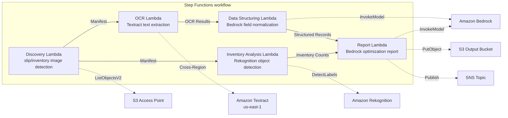

# UC12: Logistics / Supply Chain — Delivery Slip OCR and Warehouse Inventory Image Analysis

🌐 **Language / 言語**: [日本語](README.md) | English | [한국어](README.ko.md) | [简体中文](README.zh-CN.md) | [繁體中文](README.zh-TW.md) | [Français](README.fr.md) | [Deutsch](README.de.md) | [Español](README.es.md)

📚 **Documentation**: [Architecture Diagram](docs/architecture.en.md) | [Demo Guide](docs/demo-guide.en.md)

## Overview
Leveraging S3 Access Points in FSx for ONTAP, this serverless workflow automates OCR text extraction for delivery notes, object detection and counting in warehouse inventory images, and generation of delivery route optimization reports.
### When this pattern is appropriate
- Delivery slip images and warehouse inventory images are accumulated on FSx for ONTAP
- I want to automate the OCR of delivery slips (sender, recipient, tracking number, items) using Textract
- Normalization of extracted fields and generation of structured delivery records is required using Bedrock
- I want to perform object detection and counting (pallets, boxes, shelf occupancy rate) of warehouse inventory images using Rekognition
- I want to automatically generate delivery route optimization reports
### Cases where this pattern is not suitable
- A real-time shipment tracking system is required
- Direct integration with a large-scale WMS (Warehouse Management System) is necessary
- A complete delivery route optimization engine (dedicated software is appropriate)
- An environment where network reachability to the ONTAP REST API cannot be ensured
### Main Features
- Automatic detection of delivery slip images (.jpg,.jpeg,.png, .tiff, .pdf) and warehouse inventory images via S3 AP
- OCR (text and form extraction) of delivery slips via Textract (cross-region)
- Setting a manual verification flag for low confidence results
- Normalization of extracted fields and generation of structured delivery records via Bedrock
- Object detection and counting of warehouse inventory images via Rekognition
- Generation of delivery route optimization reports via Bedrock

## Success Metrics

### Outcome
Improve logistics operations efficiency by automating delivery-slip OCR and warehouse inventory image analysis.

### Metrics
| Metric | Target (example) |
|--------|------------------|
| Documents processed / run | > 300 documents |
| OCR accuracy | > 95% |
| Data extraction success rate | > 90% |
| Processing time / document | < 20 sec |
| Cost / run | < $5 |
| Human review rate | < 15% (unreadable / low confidence) |

### Measurement Method
Step Functions execution history, Textract confidence score, Rekognition detection results, CloudWatch Metrics.

## Architecture



### Workflow Steps
1. **Discovery**: Detect delivery ticket images and warehouse inventory images from S3 AP
2. **OCR**: Extract text and form from delivery tickets using Textract (cross-region)
3. **Data Structuring**: Normalize extracted fields with Bedrock and generate structured delivery records
4. **Inventory Analysis**: Detect and count objects in warehouse inventory images with Rekognition
5. **Report**: Generate delivery route optimization reports with Bedrock, output to S3 + SNS notification
## Prerequisites
- AWS account and appropriate IAM permissions
- FSx for ONTAP file system (ONTAP 9.17.1P4D3 or later)
- S3 Access Point-enabled volume (stores delivery tickets and inventory images)
- VPC, private subnets
- Amazon Bedrock model access enabled (Claude / Nova)
- **Cross-region**: Textract is not supported in ap-northeast-1, so a cross-region call to us-east-1 is required
## Deployment steps

### 1. Verifying Cross-Region Parameters
Textract is not supported in some regions (e.g., ap-northeast-1), so configure a cross-region call with the `CrossRegion` parameter.

### 2. Prerequisites

```bash
# Install AWS SAM CLI (if not already installed)
# https://docs.aws.amazon.com/serverless-application-model/latest/developerguide/install-sam-cli.html

# Clone the repository
git clone https://github.com/Yoshiki0705/FSx-for-ONTAP-S3AccessPoints-Serverless-Patterns.git
cd FSx-for-ONTAP-S3AccessPoints-Serverless-Patterns/solutions/industry/logistics-ocr
```

### 3. Configure samconfig.toml

```bash
cp samconfig.toml.example samconfig.toml
# Edit samconfig.toml and replace placeholders with your actual values
```

### 4. Build and Deploy with SAM CLI

```bash
# Build (automatically packages Lambda code + creates shared/ Layer)
# Prerequisite: AWS SAM CLI required. 'sam build' packages the code and shared layer automatically.
sam build

# Deploy
sam deploy --config-file samconfig.toml
```

Alternatively, deploy with inline parameters (without samconfig.toml):

```bash
# Prerequisite: AWS SAM CLI required. 'sam build' packages the code and shared layer automatically.
sam build

sam deploy \
  --stack-name fsxn-logistics-ocr \
  --parameter-overrides \
    S3AccessPointAlias=<your-volume-ext-s3alias> \
    OntapSecretName=<your-ontap-secret-name> \
    OntapManagementIp=<your-ontap-mgmt-ip> \
    SvmUuid=<your-svm-uuid> \
    VpcId=<your-vpc-id> \
    PrivateSubnetIds=<subnet-1>,<subnet-2> \
    NotificationEmail=<your-email@example.com> \
    CrossRegion=us-east-1 \
    EnableVpcEndpoints=false \
    EnableCloudWatchAlarms=false \
  --capabilities CAPABILITY_NAMED_IAM \
  --resolve-s3 \
  --region <your-region>
```

> **Note**: `template.yaml` is designed for use with SAM CLI (`sam build` + `sam deploy`).
> To deploy with raw `aws cloudformation deploy`, use `template-deploy.yaml` instead (requires pre-packaging Lambda zip files and uploading them to an S3 bucket).

## List of Configuration Parameters

| Parameter | Description | Default | Required |
|-----------|-------------|---------|----------|
| `S3AccessPointAlias` | FSx for ONTAP S3 AP alias (for input) | — | ✅ |
| `S3AccessPointName` | S3 AP name (for ARN-based IAM permissions; alias-based only if omitted) | `""` | ⚠️ Recommended |
| `ScheduleExpression` | EventBridge Scheduler schedule expression | `rate(1 hour)` | |
| `VpcId` | VPC ID | — | ✅ |
| `PrivateSubnetIds` | Private subnet ID list | — | ✅ |
| `NotificationEmail` | SNS notification email address | — | ✅ |
| `CrossRegionTarget` | Textract target region | `us-east-1` | |
| `MapConcurrency` | Map state parallelism | `10` | |
| `LambdaMemorySize` | Lambda memory size (MB) | `512` | |
| `LambdaTimeout` | Lambda timeout (sec) | `300` | |
| `EnableVpcEndpoints` | Enable Interface VPC Endpoints | `false` | |
| `EnableCloudWatchAlarms` | Enable CloudWatch Alarms | `false` | |

## Cleanup

```bash
aws s3 rm s3://fsxn-logistics-ocr-output-${AWS_ACCOUNT_ID} --recursive

aws cloudformation delete-stack \
  --stack-name fsxn-logistics-ocr \
  --region ap-northeast-1

aws cloudformation wait stack-delete-complete \
  --stack-name fsxn-logistics-ocr \
  --region ap-northeast-1
```

## Supported Regions
UC12 uses the following services:
| Service | Region constraint |
|---------|-------------------|
| Amazon Textract | Not available in ap-northeast-1. Specify a supported region (e.g. us-east-1) via the `TEXTRACT_REGION` parameter |
| Amazon Rekognition | Available in almost all regions |
| Amazon Bedrock | Check supported regions ([Bedrock supported regions](https://docs.aws.amazon.com/general/latest/gr/bedrock.html)) |
| AWS X-Ray | Available in almost all regions |
| CloudWatch EMF | Available in almost all regions |
> Call the Textract API via the Cross-Region Client. Verify data residency requirements. For more information, refer to the [Region Compatibility Matrix](../docs/region-compatibility.md).
## References
- [Amazon FSx for ONTAP S3 Access Points Overview](https://docs.aws.amazon.com/fsx/latest/ONTAPGuide/accessing-data-via-s3-access-points.html)
- [Amazon Textract Documentation](https://docs.aws.amazon.com/textract/latest/dg/what-is.html)
- [Amazon Rekognition Label Detection](https://docs.aws.amazon.com/rekognition/latest/dg/labels.html)
- [Amazon Bedrock API Reference](https://docs.aws.amazon.com/bedrock/latest/APIReference/API_runtime_InvokeModel.html)

---

## AWS Documentation Links

| Service | Documentation |
|---------|---------------|
| FSx for ONTAP | [User Guide](https://docs.aws.amazon.com/fsx/latest/ONTAPGuide/what-is-fsx-ontap.html) |
| S3 Access Points | [S3 AP for FSx for ONTAP](https://docs.aws.amazon.com/fsx/latest/ONTAPGuide/s3-access-points.html) |
| Step Functions | [Developer Guide](https://docs.aws.amazon.com/step-functions/latest/dg/welcome.html) |
| Amazon Textract | [Developer Guide](https://docs.aws.amazon.com/textract/latest/dg/what-is.html) |
| Amazon Rekognition | [Developer Guide](https://docs.aws.amazon.com/rekognition/latest/dg/what-is.html) |
| Amazon Bedrock | [User Guide](https://docs.aws.amazon.com/bedrock/latest/userguide/what-is-bedrock.html) |

### Well-Architected Framework alignment

| Pillar | Alignment |
|--------|-----------|
| Operational excellence | X-Ray tracing, EMF metrics, OCR accuracy monitoring |
| Security | Least-privilege IAM, KMS encryption, delivery-data access control |
| Reliability | Step Functions Retry/Catch, cross-region Textract |
| Performance efficiency | Dual-path processing (OCR + image analysis), parallel processing |
| Cost optimization | Serverless, Textract per-page billing |
| Sustainability | On-demand execution, incremental processing |

---

## Cost Estimate (approximate monthly)

> **Note**: The following is an approximation for the ap-northeast-1 region; actual costs vary with usage. Check the latest pricing with the [AWS Pricing Calculator](https://calculator.aws/).

### Serverless components (pay-as-you-go)

| Service | Unit price | Assumed usage | Monthly estimate |
|---------|-----------|---------------|------------------|
| Lambda | $0.0000166667/GB-sec | 5 functions × 100 docs/day | ~$1-5 |
| S3 API (GetObject/ListObjects) | $0.0047/10K requests | ~10K requests/day | ~$1.5 |
| Step Functions | $0.025/1K state transitions | ~1K transitions/day | ~$0.75 |
| Bedrock (Nova Lite) | $0.00006/1K input tokens | ~40K tokens/run | ~$3-10 |
| Athena | $5/TB scanned | ~10 MB/query | ~$0.5-2 |
| SNS | $0.50/100K notifications | ~100 notifications/day | ~$0.15 |
| CloudWatch Logs | $0.76/GB ingested | ~1 GB/month | ~$0.76 |
| Textract (cross-region) | $1.50/1000 pages | — | — |

### Fixed costs (FSx for ONTAP — assumes an existing environment)

| Component | Monthly |
|-----------|---------|
| FSx for ONTAP (128 MBps, 1 TB) | ~$230 (shared with the existing environment) |
| S3 Access Point | No additional charge (S3 API charges only) |

### Total estimate

| Configuration | Monthly estimate |
|---------------|------------------|
| Minimal (once daily) | ~$5-15 |
| Standard (hourly) | ~$15-50 |
| Large-scale (high frequency + alarms) | ~$50-150 |

> **Governance Caveat**: Cost estimates are approximate, not guaranteed. Actual charges vary with usage patterns, data volume, and region.

---

## Local Testing

### Prerequisites check

```bash
# Verify prerequisites
aws --version          # AWS CLI v2
sam --version          # SAM CLI
python3 --version      # Python 3.9+
docker --version       # Docker (for sam local)
aws sts get-caller-identity  # AWS credentials
```

### sam local invoke

```bash
# Build
# Prerequisite: AWS SAM CLI required. 'sam build' packages the code and shared layer automatically.
sam build

# Run the Discovery Lambda locally
sam local invoke DiscoveryFunction --event events/discovery-event.json

# With environment variable overrides
sam local invoke DiscoveryFunction \
  --event events/discovery-event.json \
  --env-vars env.json
```

### Unit tests

```bash
python3 -m pytest tests/ -v
```

For details, see the [Local Testing Quick Start](../docs/local-testing-quick-start.md).

---

## Output Sample

Example output of delivery-slip OCR + inventory image analysis:

```json
{
  "discovery": {
    "status": "completed",
    "object_count": 30,
    "categories": {"shipping_label": 20, "inventory_image": 10}
  },
  "ocr_results": [
    {
      "key": "labels/waybill-2026-001.pdf",
      "tracking_number": "1Z999AA10123456784",
      "sender": "Tokyo Warehouse",
      "recipient": "Osaka Branch",
      "weight_kg": 12.5,
      "confidence": 0.96
    }
  ],
  "inventory_analysis": [
    {
      "key": "inventory/shelf-A3.jpg",
      "item_count": 24,
      "occupancy_pct": 75,
      "anomalies": ["misplaced_item_detected"]
    }
  ],
  "route_optimization": {
    "suggested_route": "Tokyo → Nagoya → Osaka",
    "estimated_savings_pct": 12
  }
}
```

> **Note**: The above is sample output; actual values vary with the environment and input data. Benchmark figures are a sizing reference, not a service limit.

---

## Governance Note

> This pattern provides technical architecture guidance. It is not legal, compliance, or regulatory advice. Organizations should consult qualified professionals.

---

## S3AP Compatibility

For the compatibility constraints, troubleshooting, and trigger patterns of S3 Access Points for FSx for ONTAP, see the [S3AP Compatibility Notes](../docs/s3ap-compatibility-notes.md).
