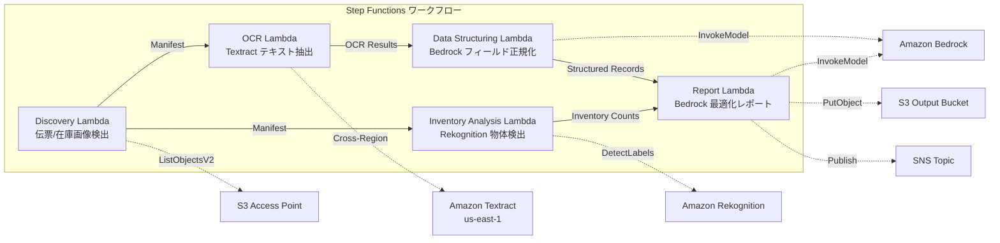

# UC12: Logistics / Supply Chain — Delivery Slip OCR and Warehouse Inventory Image Analysis

🌐 **Language / 言語**: [日本語](README.md) | English | [한국어](README.ko.md) | [简体中文](README.zh-CN.md) | [繁體中文](README.zh-TW.md) | [Français](README.fr.md) | [Deutsch](README.de.md) | [Español](README.es.md)

📚 **Documentation**: [Architecture Diagram](docs/architecture.en.md) | [Demo Guide](docs/demo-guide.en.md)

## Overview
Leveraging S3 Access Points in FSx for ONTAP, this serverless workflow automates OCR text extraction for delivery notes, object detection and counting in warehouse inventory images, and generation of delivery route optimization reports.
### When this pattern is appropriate
- Delivery slip images and warehouse inventory images are accumulated on FSx for ONTAP
- I want to automate the OCR of delivery slips (sender, recipient, tracking number, items) using Textract
- Normalization of extracted fields and generation of structured delivery records is required using Bedrock
- I want to perform object detection and counting (pallets, boxes, shelf occupancy rate) of warehouse inventory images using Rekognition
- I want to automatically generate delivery route optimization reports
### Cases where this pattern is not suitable
- A real-time shipment tracking system is required
- Direct integration with a large-scale WMS (Warehouse Management System) is necessary
- A complete delivery route optimization engine (dedicated software is appropriate)
- An environment where network reachability to the ONTAP REST API cannot be ensured
### Main Features
- Automatic detection of delivery slip images (.jpg,.jpeg,.png, .tiff, .pdf) and warehouse inventory images via S3 AP
- OCR (text and form extraction) of delivery slips via Textract (cross-region)
- Setting a manual verification flag for low confidence results
- Normalization of extracted fields and generation of structured delivery records via Bedrock
- Object detection and counting of warehouse inventory images via Rekognition
- Generation of delivery route optimization reports via Bedrock
## Architecture



### Workflow Steps
1. **Discovery**: Detect delivery ticket images and warehouse inventory images from S3 AP
2. **OCR**: Extract text and form from delivery tickets using Textract (cross-region)
3. **Data Structuring**: Normalize extracted fields with Bedrock and generate structured delivery records
4. **Inventory Analysis**: Detect and count objects in warehouse inventory images with Rekognition
5. **Report**: Generate delivery route optimization reports with Bedrock, output to S3 + SNS notification
## Prerequisites
- AWS account and appropriate IAM permissions
- FSx for ONTAP file system (ONTAP 9.17.1P4D3 or later)
- S3 Access Point-enabled volume (stores delivery tickets and inventory images)
- VPC, private subnets
- Amazon Bedrock model access enabled (Claude / Nova)
- **Cross-region**: Textract is not supported in ap-northeast-1, so a cross-region call to us-east-1 is required
## Deployment steps

### 1. Verifying Cross-Region Parameters
Textract is not supported in some regions (e.g., ap-northeast-1), so configure a cross-region call with the `CrossRegion` parameter.

### 2. Prerequisites

```bash
# Install AWS SAM CLI (if not already installed)
# https://docs.aws.amazon.com/serverless-application-model/latest/developerguide/install-sam-cli.html

# Clone the repository
git clone https://github.com/Yoshiki0705/FSx-for-ONTAP-S3AccessPoints-Serverless-Patterns.git
cd FSx-for-ONTAP-S3AccessPoints-Serverless-Patterns/solutions/industry/logistics-ocr
```

### 3. Configure samconfig.toml

```bash
cp samconfig.toml.example samconfig.toml
# Edit samconfig.toml and replace placeholders with your actual values
```

### 4. Build and Deploy with SAM CLI

```bash
# Build (automatically packages Lambda code + creates shared/ Layer)
# Prerequisite: AWS SAM CLI required. 'sam build' packages the code and shared layer automatically.
sam build

# Deploy
sam deploy --config-file samconfig.toml
```

Alternatively, deploy with inline parameters (without samconfig.toml):

```bash
# Prerequisite: AWS SAM CLI required. 'sam build' packages the code and shared layer automatically.
sam build

sam deploy \
  --stack-name fsxn-logistics-ocr \
  --parameter-overrides \
    S3AccessPointAlias=<your-volume-ext-s3alias> \
    OntapSecretName=<your-ontap-secret-name> \
    OntapManagementIp=<your-ontap-mgmt-ip> \
    SvmUuid=<your-svm-uuid> \
    VpcId=<your-vpc-id> \
    PrivateSubnetIds=<subnet-1>,<subnet-2> \
    NotificationEmail=<your-email@example.com> \
    CrossRegion=us-east-1 \
    EnableVpcEndpoints=false \
    EnableCloudWatchAlarms=false \
  --capabilities CAPABILITY_NAMED_IAM \
  --resolve-s3 \
  --region <your-region>
```

> **Note**: `template.yaml` is designed for use with SAM CLI (`sam build` + `sam deploy`).
> To deploy with raw `aws cloudformation deploy`, use `template-deploy.yaml` instead (requires pre-packaging Lambda zip files and uploading them to an S3 bucket).

## List of Configuration Parameters

| パラメータ | 説明 | デフォルト | 必須 |
|-----------|------|----------|------|
| `S3AccessPointAlias` | FSx for ONTAP S3 AP Alias（入力用） | — | ✅ |
| `S3AccessPointName` | S3 AP 名（ARN ベースの IAM 権限付与用。省略時は Alias ベースのみ） | `""` | ⚠️ 推奨 |
| `ScheduleExpression` | EventBridge Scheduler のスケジュール式 | `rate(1 hour)` | |
| `VpcId` | VPC ID | — | ✅ |
| `PrivateSubnetIds` | プライベートサブネット ID リスト | — | ✅ |
| `NotificationEmail` | SNS 通知先メールアドレス | — | ✅ |
| `CrossRegionTarget` | Textract のターゲットリージョン | `us-east-1` | |
| `MapConcurrency` | Map ステートの並列実行数 | `10` | |
| `LambdaMemorySize` | Lambda メモリサイズ (MB) | `512` | |
| `LambdaTimeout` | Lambda タイムアウト (秒) | `300` | |
| `EnableVpcEndpoints` | Interface VPC Endpoints の有効化 | `false` | |
| `EnableCloudWatchAlarms` | CloudWatch Alarms の有効化 | `false` | |

## Cleanup

```bash
aws s3 rm s3://fsxn-logistics-ocr-output-${AWS_ACCOUNT_ID} --recursive

aws cloudformation delete-stack \
  --stack-name fsxn-logistics-ocr \
  --region ap-northeast-1

aws cloudformation wait stack-delete-complete \
  --stack-name fsxn-logistics-ocr \
  --region ap-northeast-1
```

## Supported Regions
UC12 uses the following services:
| サービス | リージョン制約 |
|---------|-------------|
| Amazon Textract | ap-northeast-1 非対応。`TEXTRACT_REGION` パラメータで対応リージョン（us-east-1 等）を指定 |
| Amazon Rekognition | ほぼ全リージョンで利用可能 |
| Amazon Bedrock | 対応リージョンを確認（[Bedrock 対応リージョン](https://docs.aws.amazon.com/general/latest/gr/bedrock.html)） |
| AWS X-Ray | ほぼ全リージョンで利用可能 |
| CloudWatch EMF | ほぼ全リージョンで利用可能 |
> Call the Textract API via the Cross-Region Client. Verify data residency requirements. For more information, refer to the [Region Compatibility Matrix](../docs/region-compatibility.md).
## References
- [Amazon FSx for ONTAP S3 Access Points Overview](https://docs.aws.amazon.com/fsx/latest/ONTAPGuide/accessing-data-via-s3-access-points.html)
- [Amazon Textract Documentation](https://docs.aws.amazon.com/textract/latest/dg/what-is.html)
- [Amazon Rekognition Label Detection](https://docs.aws.amazon.com/rekognition/latest/dg/labels.html)
- [Amazon Bedrock API Reference](https://docs.aws.amazon.com/bedrock/latest/APIReference/API_runtime_InvokeModel.html)