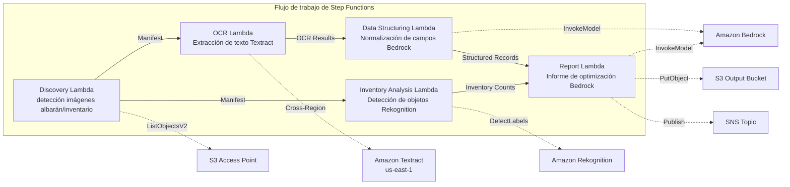

# UC12: Logística / Cadena de Suministro — OCR de albaranes de entrega y análisis de imágenes de inventario de almacén

🌐 **Language / 言語**: [日本語](README.md) | [English](README.en.md) | [한국어](README.ko.md) | [简体中文](README.zh-CN.md) | [繁體中文](README.zh-TW.md) | [Français](README.fr.md) | [Deutsch](README.de.md) | Español

📚 **Documentación**: [Diagrama de arquitectura](docs/architecture.md) | [Guía de demostración](docs/demo-guide.md)

## Resumen

Aprovechando los S3 Access Points de FSx for ONTAP, este flujo de trabajo sin servidor automatiza la extracción de texto OCR de los albaranes de entrega, la detección y el conteo de objetos en imágenes de inventario de almacén, y la generación de informes de optimización de rutas de entrega.

### Casos en los que este patrón es adecuado

- Las imágenes de albaranes de entrega y de inventario de almacén se acumulan en FSx for ONTAP
- Desea automatizar el OCR de los albaranes de entrega (remitente, destinatario, número de seguimiento, artículos) con Textract
- Se requiere la normalización de los campos extraídos y la generación de registros de entrega estructurados con Bedrock
- Desea realizar la detección y el conteo de objetos (palés, cajas, tasa de ocupación de estantes) en las imágenes de inventario de almacén con Rekognition
- Desea generar automáticamente informes de optimización de rutas de entrega

### Casos en los que este patrón no es adecuado

- Se necesita un sistema de seguimiento de envíos en tiempo real
- Se necesita una integración directa con un WMS (Sistema de Gestión de Almacén) a gran escala
- Se necesita un motor completo de optimización de rutas de entrega (el software dedicado es apropiado)
- Un entorno en el que no se puede garantizar la accesibilidad de red a la API REST de ONTAP

### Características principales

- Detección automática de imágenes de albaranes de entrega (.jpg, .jpeg, .png, .tiff, .pdf) e imágenes de inventario de almacén a través de S3 AP
- OCR de albaranes de entrega (extracción de texto y formularios) a través de Textract (entre regiones)
- Establecimiento de un indicador de verificación manual para resultados de baja fiabilidad
- Normalización de campos extraídos y generación de registros de entrega estructurados a través de Bedrock
- Detección y conteo de objetos en imágenes de inventario de almacén a través de Rekognition
- Generación de informes de optimización de rutas de entrega a través de Bedrock

## Success Metrics

### Outcome
Mejorar la eficiencia de las operaciones logísticas mediante la automatización del OCR de albaranes de entrega y el análisis de imágenes de inventario de almacén.

### Metrics
| Métrica | Objetivo (ejemplo) |
|-----------|------------|
| Documentos procesados / ejecución | > 300 documents |
| Precisión del OCR | > 95% |
| Tasa de éxito de extracción de datos | > 90% |
| Tiempo de procesamiento / documento | < 20 s |
| Coste / ejecución | < $5 |
| Tasa sujeta a Human Review | < 15% (ilegibles / baja fiabilidad) |

### Measurement Method
Historial de ejecución de Step Functions, Textract confidence score, resultados de detección de Rekognition, CloudWatch Metrics.

## Arquitectura



### Pasos del flujo de trabajo

1. **Discovery**: Detectar imágenes de albaranes de entrega e imágenes de inventario de almacén desde S3 AP
2. **OCR**: Extraer texto y formularios de los albaranes de entrega con Textract (entre regiones)
3. **Data Structuring**: Normalizar los campos extraídos con Bedrock y generar registros de entrega estructurados
4. **Inventory Analysis**: Detectar y contar objetos en imágenes de inventario de almacén con Rekognition
5. **Report**: Generar un informe de optimización de rutas de entrega con Bedrock, salida a S3 + notificación SNS

## Requisitos previos

- Cuenta de AWS y permisos de IAM apropiados
- Sistema de archivos FSx for ONTAP (ONTAP 9.17.1P4D3 o superior)
- Volumen con S3 Access Point habilitado (almacena albaranes de entrega e imágenes de inventario)
- VPC, subredes privadas
- Acceso a modelos de Amazon Bedrock habilitado (Claude / Nova)
- **Entre regiones**: Textract no es compatible con ap-northeast-1, por lo que se necesita una llamada entre regiones a us-east-1

## Pasos de implementación

### 1. Verificación de los parámetros entre regiones

Textract no es compatible con algunas regiones (p. ej., ap-northeast-1), por lo que debe configurar una llamada entre regiones con el parámetro `CrossRegion`.

### 2. Preparación previa

```bash
# Instalar AWS SAM CLI (si aún no está instalado)
# https://docs.aws.amazon.com/serverless-application-model/latest/developerguide/install-sam-cli.html

# Clonar el repositorio
git clone https://github.com/Yoshiki0705/FSx-for-ONTAP-S3AccessPoints-Serverless-Patterns.git
cd FSx-for-ONTAP-S3AccessPoints-Serverless-Patterns/solutions/industry/logistics-ocr
```

### 3. Configurar samconfig.toml

```bash
cp samconfig.toml.example samconfig.toml
# Edite samconfig.toml y reemplace los valores por sus valores reales
```

### 4. Compilar e implementar con SAM CLI

```bash
# Compilar (empaqueta automáticamente el código Lambda + genera la capa shared/)
# Requisito: se necesita AWS SAM CLI. «sam build» empaqueta automáticamente el código y la capa compartida.
sam build

# Implementar
sam deploy --config-file samconfig.toml
```

También es posible implementar especificando directamente los parámetros, sin `samconfig.toml`:

```bash
# Requisito: se necesita AWS SAM CLI. «sam build» empaqueta automáticamente el código y la capa compartida.
sam build

sam deploy \
  --stack-name fsxn-logistics-ocr \
  --parameter-overrides \
    S3AccessPointAlias=<your-volume-ext-s3alias> \
    OntapSecretName=<your-ontap-secret-name> \
    OntapManagementIp=<your-ontap-mgmt-ip> \
    SvmUuid=<your-svm-uuid> \
    VpcId=<your-vpc-id> \
    PrivateSubnetIds=<subnet-1>,<subnet-2> \
    NotificationEmail=<your-email@example.com> \
    CrossRegion=us-east-1 \
    EnableVpcEndpoints=false \
    EnableCloudWatchAlarms=false \
  --capabilities CAPABILITY_NAMED_IAM \
  --resolve-s3 \
  --region <your-region>
```

> **Nota**: `template.yaml` se usa con SAM CLI (`sam build` + `sam deploy`).
> Para implementar directamente con el comando `aws cloudformation deploy`, use `template-deploy.yaml` en su lugar (requiere empaquetar previamente los archivos zip de Lambda y subirlos a un bucket de S3).

## Lista de parámetros de configuración

| Parámetro | Descripción | Predeterminado | Requerido |
|-----------|------|----------|------|
| `S3AccessPointAlias` | FSx for ONTAP S3 AP Alias (para la entrada) | — | ✅ |
| `S3AccessPointName` | Nombre del S3 AP (para permisos de IAM basados en ARN; solo basado en Alias si se omite) | `""` | ⚠️ Recomendado |
| `ScheduleExpression` | Expresión de programación de EventBridge Scheduler | `rate(1 hour)` | |
| `VpcId` | VPC ID | — | ✅ |
| `PrivateSubnetIds` | Lista de ID de subredes privadas | — | ✅ |
| `NotificationEmail` | Dirección de correo electrónico de notificación de SNS | — | ✅ |
| `CrossRegionTarget` | Región de destino de Textract | `us-east-1` | |
| `MapConcurrency` | Número de ejecuciones paralelas del estado Map | `10` | |
| `LambdaMemorySize` | Tamaño de memoria de Lambda (MB) | `512` | |
| `LambdaTimeout` | Tiempo de espera de Lambda (s) | `300` | |
| `EnableVpcEndpoints` | Habilitar Interface VPC Endpoints | `false` | |
| `EnableCloudWatchAlarms` | Habilitar CloudWatch Alarms | `false` | |

## Limpieza

```bash
aws s3 rm s3://fsxn-logistics-ocr-output-${AWS_ACCOUNT_ID} --recursive

aws cloudformation delete-stack \
  --stack-name fsxn-logistics-ocr \
  --region ap-northeast-1

aws cloudformation wait stack-delete-complete \
  --stack-name fsxn-logistics-ocr \
  --region ap-northeast-1
```

## Supported Regions

UC12 utiliza los siguientes servicios:

| Servicio | Restricción de región |
|---------|-------------|
| Amazon Textract | No disponible en ap-northeast-1. Especifique una región compatible (p. ej. us-east-1) mediante el parámetro `TEXTRACT_REGION` |
| Amazon Rekognition | Disponible en casi todas las regiones |
| Amazon Bedrock | Compruebe las regiones compatibles ([Regiones compatibles con Bedrock](https://docs.aws.amazon.com/general/latest/gr/bedrock.html)) |
| AWS X-Ray | Disponible en casi todas las regiones |
| CloudWatch EMF | Disponible en casi todas las regiones |

> Llame a la API de Textract a través del Cross-Region Client. Verifique los requisitos de residencia de datos. Para obtener más detalles, consulte la [Matriz de compatibilidad de regiones](../docs/region-compatibility.md).

## Enlaces de referencia

- [Descripción general de los FSx for ONTAP S3 Access Points](https://docs.aws.amazon.com/fsx/latest/ONTAPGuide/accessing-data-via-s3-access-points.html)
- [Documentación de Amazon Textract](https://docs.aws.amazon.com/textract/latest/dg/what-is.html)
- [Detección de etiquetas de Amazon Rekognition](https://docs.aws.amazon.com/rekognition/latest/dg/labels.html)
- [Referencia de la API de Amazon Bedrock](https://docs.aws.amazon.com/bedrock/latest/APIReference/API_runtime_InvokeModel.html)

---

## Enlaces de documentación de AWS

| Servicio | Documentación |
|---------|------------|
| FSx for ONTAP | [Guía del usuario](https://docs.aws.amazon.com/fsx/latest/ONTAPGuide/what-is-fsx-ontap.html) |
| S3 Access Points | [S3 AP for FSx for ONTAP](https://docs.aws.amazon.com/fsx/latest/ONTAPGuide/s3-access-points.html) |
| Step Functions | [Guía para desarrolladores](https://docs.aws.amazon.com/step-functions/latest/dg/welcome.html) |
| Amazon Textract | [Guía para desarrolladores](https://docs.aws.amazon.com/textract/latest/dg/what-is.html) |
| Amazon Rekognition | [Guía para desarrolladores](https://docs.aws.amazon.com/rekognition/latest/dg/what-is.html) |
| Amazon Bedrock | [Guía del usuario](https://docs.aws.amazon.com/bedrock/latest/userguide/what-is-bedrock.html) |

### Alineación con el Well-Architected Framework

| Pilar | Alineación |
|----|------|
| Excelencia operativa | Trazado X-Ray, métricas EMF, monitoreo de la precisión del OCR |
| Seguridad | IAM de privilegio mínimo, cifrado KMS, control de acceso a los datos de entrega |
| Fiabilidad | Step Functions Retry/Catch, Textract entre regiones |
| Eficiencia del rendimiento | Procesamiento de doble vía (OCR + análisis de imágenes), procesamiento paralelo |
| Optimización de costes | Sin servidor, facturación de Textract por página |
| Sostenibilidad | Ejecución bajo demanda, procesamiento incremental |

---

## Estimación de costes (mensual aproximada)

> **Nota**: Lo siguiente es una aproximación para la región ap-northeast-1; los costes reales varían según el uso. Compruebe los precios más recientes con la [AWS Pricing Calculator](https://calculator.aws/).

### Componentes sin servidor (pago por uso)

| Servicio | Precio unitario | Uso supuesto | Estimación mensual |
|---------|------|-----------|---------|
| Lambda | $0.0000166667/GB-sec | 5 funciones × 100 docs/día | ~$1-5 |
| S3 API (GetObject/ListObjects) | $0.0047/10K requests | ~10K requests/día | ~$1.5 |
| Step Functions | $0.025/1K state transitions | ~1K transitions/día | ~$0.75 |
| Bedrock (Nova Lite) | $0.00006/1K input tokens | ~40K tokens/ejecución | ~$3-10 |
| Athena | $5/TB scanned | ~10 MB/consulta | ~$0.5-2 |
| SNS | $0.50/100K notifications | ~100 notifications/día | ~$0.15 |
| CloudWatch Logs | $0.76/GB ingested | ~1 GB/mes | ~$0.76 |
| Textract (entre regiones) | $1.50/1000 pages | — | — |

### Costes fijos (FSx for ONTAP — supone un entorno existente)

| Componente | Mensual |
|--------------|------|
| FSx for ONTAP (128 MBps, 1 TB) | ~$230 (compartido con el entorno existente) |
| S3 Access Point | Sin cargo adicional (solo cargos de S3 API) |

### Estimación total

| Configuración | Estimación mensual |
|------|---------|
| Mínima (una vez al día) | ~$5-15 |
| Estándar (cada hora) | ~$15-50 |
| Gran escala (alta frecuencia + alarmas) | ~$50-150 |

> **Governance Caveat**: Las estimaciones de costes son aproximadas, no garantizadas. Los cargos reales varían según los patrones de uso, el volumen de datos y la región.

---

## Pruebas locales

### Comprobación de requisitos previos

```bash
# Verificar los requisitos previos
aws --version          # AWS CLI v2
sam --version          # SAM CLI
python3 --version      # Python 3.9+
docker --version       # Docker (para sam local)
aws sts get-caller-identity  # Credenciales de AWS
```

### sam local invoke

```bash
# Compilar
# Requisito: se necesita AWS SAM CLI. «sam build» empaqueta automáticamente el código y la capa compartida.
sam build

# Ejecutar el Discovery Lambda localmente
sam local invoke DiscoveryFunction --event events/discovery-event.json

# Con anulaciones de variables de entorno
sam local invoke DiscoveryFunction \
  --event events/discovery-event.json \
  --env-vars env.json
```

### Pruebas unitarias

```bash
python3 -m pytest tests/ -v
```

Para obtener más detalles, consulte el [Inicio rápido de pruebas locales](../docs/local-testing-quick-start.md).

---

## Ejemplo de salida (Output Sample)

Ejemplo de salida del OCR de albaranes de entrega + análisis de imágenes de inventario:

```json
{
  "discovery": {
    "status": "completed",
    "object_count": 30,
    "categories": {"shipping_label": 20, "inventory_image": 10}
  },
  "ocr_results": [
    {
      "key": "labels/waybill-2026-001.pdf",
      "tracking_number": "1Z999AA10123456784",
      "sender": "Tokyo Warehouse",
      "recipient": "Osaka Branch",
      "weight_kg": 12.5,
      "confidence": 0.96
    }
  ],
  "inventory_analysis": [
    {
      "key": "inventory/shelf-A3.jpg",
      "item_count": 24,
      "occupancy_pct": 75,
      "anomalies": ["misplaced_item_detected"]
    }
  ],
  "route_optimization": {
    "suggested_route": "Tokyo → Nagoya → Osaka",
    "estimated_savings_pct": 12
  }
}
```

> **Nota**: Lo anterior es una salida de ejemplo; los valores reales varían según el entorno y los datos de entrada. Las cifras de referencia son una base de dimensionamiento, no un límite de servicio.

---

## Governance Note

> Este patrón proporciona orientación de arquitectura técnica. No constituye asesoramiento legal, de cumplimiento ni normativo. Las organizaciones deben consultar a profesionales cualificados.

---

## S3AP Compatibility

Para conocer las restricciones de compatibilidad, la resolución de problemas y los patrones de activación de los S3 Access Points for FSx for ONTAP, consulte las [S3AP Compatibility Notes](../docs/s3ap-compatibility-notes.md).
