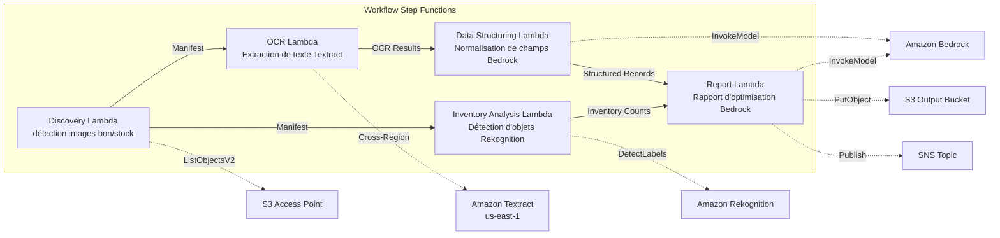

# UC12 : Logistique / Chaîne d'approvisionnement — OCR des bons de livraison et analyse d'images de stock d'entrepôt

🌐 **Language / 言語**: [日本語](README.md) | [English](README.en.md) | [한국어](README.ko.md) | [简体中文](README.zh-CN.md) | [繁體中文](README.zh-TW.md) | Français | [Deutsch](README.de.md) | [Español](README.es.md)

📚 **Documentation** : [Schéma d'architecture](docs/architecture.md) | [Guide de démonstration](docs/demo-guide.md)

## Aperçu

En s'appuyant sur les S3 Access Points de FSx for ONTAP, ce workflow sans serveur automatise l'extraction de texte OCR des bons de livraison, la détection et le comptage d'objets sur les images de stock d'entrepôt, et la génération de rapports d'optimisation des itinéraires de livraison.

### Cas où ce modèle est approprié

- Les images des bons de livraison et des stocks d'entrepôt sont accumulées sur FSx for ONTAP
- Vous souhaitez automatiser l'OCR des bons de livraison (expéditeur, destinataire, numéro de suivi, articles) avec Textract
- La normalisation des champs extraits et la génération d'enregistrements de livraison structurés avec Bedrock sont nécessaires
- Vous souhaitez effectuer la détection et le comptage d'objets (palettes, boîtes, taux d'occupation des étagères) sur les images de stock d'entrepôt avec Rekognition
- Vous souhaitez générer automatiquement des rapports d'optimisation des itinéraires de livraison

### Cas où ce modèle ne convient pas

- Un système de suivi des livraisons en temps réel est nécessaire
- Une intégration directe avec un WMS (Warehouse Management System) à grande échelle est nécessaire
- Un moteur complet d'optimisation des itinéraires de livraison est nécessaire (un logiciel spécialisé est approprié)
- Un environnement où la connectivité réseau vers l'API REST ONTAP ne peut être assurée

### Principales fonctionnalités

- Détection automatique des images de bons de livraison (.jpg, .jpeg, .png, .tiff, .pdf) et des images de stock d'entrepôt via S3 AP
- OCR des bons de livraison (extraction de texte et de formulaires) via Textract (inter-régions)
- Marquage pour vérification manuelle des résultats à faible fiabilité
- Normalisation des champs extraits et génération d'enregistrements de livraison structurés via Bedrock
- Détection et comptage d'objets sur les images de stock d'entrepôt via Rekognition
- Génération de rapports d'optimisation des itinéraires de livraison via Bedrock

## Success Metrics

### Outcome
Améliorer l'efficacité des opérations logistiques en automatisant l'OCR des bons de livraison et l'analyse d'images de stock d'entrepôt.

### Metrics
| Métrique | Cible (exemple) |
|-----------|------------|
| Documents traités / exécution | > 300 documents |
| Précision de l'OCR | > 95% |
| Taux de réussite de l'extraction de données | > 90% |
| Temps de traitement / document | < 20 s |
| Coût / exécution | < $5 |
| Taux soumis à Human Review | < 15% (illisibles / faible fiabilité) |

### Measurement Method
Historique d'exécution Step Functions, Textract confidence score, résultats de détection Rekognition, CloudWatch Metrics.

## Architecture



### Étapes du workflow

1. **Discovery** : Détecter les images de bons de livraison et de stock d'entrepôt depuis S3 AP
2. **OCR** : Extraire le texte et les formulaires des bons de livraison avec Textract (inter-régions)
3. **Data Structuring** : Normaliser les champs extraits avec Bedrock et générer des enregistrements de livraison structurés
4. **Inventory Analysis** : Détecter et compter les objets sur les images de stock d'entrepôt avec Rekognition
5. **Report** : Générer un rapport d'optimisation des itinéraires de livraison avec Bedrock, sortie vers S3 + notification SNS

## Prérequis

- Compte AWS et permissions IAM appropriées
- Système de fichiers FSx for ONTAP (ONTAP 9.17.1P4D3 ou version ultérieure)
- Volume avec S3 Access Point activé (stocke les bons de livraison et les images de stock)
- VPC, sous-réseaux privés
- Accès aux modèles Amazon Bedrock activé (Claude / Nova)
- **Inter-régions** : Textract n'est pas pris en charge dans ap-northeast-1, un appel inter-régions vers us-east-1 est donc nécessaire

## Étapes de déploiement

### 1. Vérification des paramètres inter-régions

Textract n'est pas pris en charge dans certaines régions (par ex. ap-northeast-1), configurez donc un appel inter-régions avec le paramètre `CrossRegion`.

### 2. Préparation préalable

```bash
# Installer AWS SAM CLI (si ce n'est pas déjà fait)
# https://docs.aws.amazon.com/serverless-application-model/latest/developerguide/install-sam-cli.html

# Cloner le dépôt
git clone https://github.com/Yoshiki0705/FSx-for-ONTAP-S3AccessPoints-Serverless-Patterns.git
cd FSx-for-ONTAP-S3AccessPoints-Serverless-Patterns/solutions/industry/logistics-ocr
```

### 3. Configurer samconfig.toml

```bash
cp samconfig.toml.example samconfig.toml
# Modifiez samconfig.toml et remplacez les valeurs par vos valeurs réelles
```

### 4. Build et déploiement avec SAM CLI

```bash
# Build (empaquette automatiquement le code Lambda + génère la couche shared/)
# Prérequis : AWS SAM CLI requis. « sam build » empaquette automatiquement le code et la couche partagée.
sam build

# Déploiement
sam deploy --config-file samconfig.toml
```

Il est également possible de déployer en spécifiant directement les paramètres, sans `samconfig.toml` :

```bash
# Prérequis : AWS SAM CLI requis. « sam build » empaquette automatiquement le code et la couche partagée.
sam build

sam deploy \
  --stack-name fsxn-logistics-ocr \
  --parameter-overrides \
    S3AccessPointAlias=<your-volume-ext-s3alias> \
    OntapSecretName=<your-ontap-secret-name> \
    OntapManagementIp=<your-ontap-mgmt-ip> \
    SvmUuid=<your-svm-uuid> \
    VpcId=<your-vpc-id> \
    PrivateSubnetIds=<subnet-1>,<subnet-2> \
    NotificationEmail=<your-email@example.com> \
    CrossRegion=us-east-1 \
    EnableVpcEndpoints=false \
    EnableCloudWatchAlarms=false \
  --capabilities CAPABILITY_NAMED_IAM \
  --resolve-s3 \
  --region <your-region>
```

> **Remarque** : `template.yaml` s'utilise avec SAM CLI (`sam build` + `sam deploy`).
> Pour un déploiement direct avec la commande `aws cloudformation deploy`, utilisez plutôt `template-deploy.yaml` (nécessite le pré-empaquetage des fichiers zip Lambda et leur téléversement dans S3).

## Liste des paramètres de configuration

| Paramètre | Description | Par défaut | Requis |
|-----------|------|----------|------|
| `S3AccessPointAlias` | FSx for ONTAP S3 AP Alias (pour l'entrée) | — | ✅ |
| `S3AccessPointName` | Nom du S3 AP (pour l'octroi de permissions IAM basées sur l'ARN ; basé uniquement sur l'Alias si omis) | `""` | ⚠️ Recommandé |
| `ScheduleExpression` | Expression de planification d'EventBridge Scheduler | `rate(1 hour)` | |
| `VpcId` | VPC ID | — | ✅ |
| `PrivateSubnetIds` | Liste des ID de sous-réseaux privés | — | ✅ |
| `NotificationEmail` | Adresse e-mail de notification SNS | — | ✅ |
| `CrossRegionTarget` | Région cible de Textract | `us-east-1` | |
| `MapConcurrency` | Nombre d'exécutions parallèles de l'état Map | `10` | |
| `LambdaMemorySize` | Taille mémoire Lambda (MB) | `512` | |
| `LambdaTimeout` | Délai d'expiration Lambda (s) | `300` | |
| `EnableVpcEndpoints` | Activer les Interface VPC Endpoints | `false` | |
| `EnableCloudWatchAlarms` | Activer les CloudWatch Alarms | `false` | |

## Nettoyage

```bash
aws s3 rm s3://fsxn-logistics-ocr-output-${AWS_ACCOUNT_ID} --recursive

aws cloudformation delete-stack \
  --stack-name fsxn-logistics-ocr \
  --region ap-northeast-1

aws cloudformation wait stack-delete-complete \
  --stack-name fsxn-logistics-ocr \
  --region ap-northeast-1
```

## Supported Regions

UC12 utilise les services suivants :

| Service | Contrainte de région |
|---------|-------------|
| Amazon Textract | Non pris en charge dans ap-northeast-1. Spécifiez une région prise en charge (par ex. us-east-1) via le paramètre `TEXTRACT_REGION` |
| Amazon Rekognition | Disponible dans presque toutes les régions |
| Amazon Bedrock | Vérifiez les régions prises en charge ([Régions prises en charge par Bedrock](https://docs.aws.amazon.com/general/latest/gr/bedrock.html)) |
| AWS X-Ray | Disponible dans presque toutes les régions |
| CloudWatch EMF | Disponible dans presque toutes les régions |

> Appelez l'API Textract via le Cross-Region Client. Vérifiez les exigences de résidence des données. Pour plus de détails, consultez la [Matrice de compatibilité des régions](../docs/region-compatibility.md).

## Liens utiles

- [Aperçu des FSx for ONTAP S3 Access Points](https://docs.aws.amazon.com/fsx/latest/ONTAPGuide/accessing-data-via-s3-access-points.html)
- [Documentation Amazon Textract](https://docs.aws.amazon.com/textract/latest/dg/what-is.html)
- [Détection de labels Amazon Rekognition](https://docs.aws.amazon.com/rekognition/latest/dg/labels.html)
- [Référence de l'API Amazon Bedrock](https://docs.aws.amazon.com/bedrock/latest/APIReference/API_runtime_InvokeModel.html)

---

## Liens de documentation AWS

| Service | Documentation |
|---------|------------|
| FSx for ONTAP | [Guide de l'utilisateur](https://docs.aws.amazon.com/fsx/latest/ONTAPGuide/what-is-fsx-ontap.html) |
| S3 Access Points | [S3 AP for FSx for ONTAP](https://docs.aws.amazon.com/fsx/latest/ONTAPGuide/s3-access-points.html) |
| Step Functions | [Guide du développeur](https://docs.aws.amazon.com/step-functions/latest/dg/welcome.html) |
| Amazon Textract | [Guide du développeur](https://docs.aws.amazon.com/textract/latest/dg/what-is.html) |
| Amazon Rekognition | [Guide du développeur](https://docs.aws.amazon.com/rekognition/latest/dg/what-is.html) |
| Amazon Bedrock | [Guide de l'utilisateur](https://docs.aws.amazon.com/bedrock/latest/userguide/what-is-bedrock.html) |

### Conformité au Well-Architected Framework

| Pilier | Alignement |
|----|------|
| Excellence opérationnelle | Traçage X-Ray, métriques EMF, surveillance de la précision OCR |
| Sécurité | IAM à moindre privilège, chiffrement KMS, contrôle d'accès aux données de livraison |
| Fiabilité | Step Functions Retry/Catch, Textract inter-régions |
| Efficacité des performances | Traitement à double voie (OCR + analyse d'images), traitement parallèle |
| Optimisation des coûts | Sans serveur, facturation Textract à la page |
| Durabilité | Exécution à la demande, traitement incrémental |

---

## Estimation des coûts (mensuel approximatif)

> **Note** : Ce qui suit est une approximation pour la région ap-northeast-1 ; les coûts réels varient selon l'utilisation. Vérifiez les tarifs les plus récents avec l'[AWS Pricing Calculator](https://calculator.aws/).

### Composants sans serveur (paiement à l'usage)

| Service | Prix unitaire | Utilisation supposée | Estimation mensuelle |
|---------|------|-----------|---------|
| Lambda | $0.0000166667/GB-sec | 5 fonctions × 100 docs/jour | ~$1-5 |
| S3 API (GetObject/ListObjects) | $0.0047/10K requests | ~10K requests/jour | ~$1.5 |
| Step Functions | $0.025/1K state transitions | ~1K transitions/jour | ~$0.75 |
| Bedrock (Nova Lite) | $0.00006/1K input tokens | ~40K tokens/exécution | ~$3-10 |
| Athena | $5/TB scanned | ~10 MB/requête | ~$0.5-2 |
| SNS | $0.50/100K notifications | ~100 notifications/jour | ~$0.15 |
| CloudWatch Logs | $0.76/GB ingested | ~1 GB/mois | ~$0.76 |
| Textract (inter-régions) | $1.50/1000 pages | — | — |

### Coûts fixes (FSx for ONTAP — suppose un environnement existant)

| Composant | Mensuel |
|--------------|------|
| FSx for ONTAP (128 MBps, 1 TB) | ~$230 (partagé avec l'environnement existant) |
| S3 Access Point | Aucun frais supplémentaire (frais S3 API uniquement) |

### Estimation totale

| Configuration | Estimation mensuelle |
|------|---------|
| Minimale (une fois par jour) | ~$5-15 |
| Standard (toutes les heures) | ~$15-50 |
| Grande échelle (haute fréquence + alarmes) | ~$50-150 |

> **Governance Caveat** : Les estimations de coûts sont approximatives, non garanties. Les frais réels varient selon les modèles d'utilisation, le volume de données et la région.

---

## Tests locaux

### Vérification des prérequis

```bash
# Vérifier les prérequis
aws --version          # AWS CLI v2
sam --version          # SAM CLI
python3 --version      # Python 3.9+
docker --version       # Docker (pour sam local)
aws sts get-caller-identity  # Identifiants AWS
```

### sam local invoke

```bash
# Build
# Prérequis : AWS SAM CLI requis. « sam build » empaquette automatiquement le code et la couche partagée.
sam build

# Exécuter le Discovery Lambda en local
sam local invoke DiscoveryFunction --event events/discovery-event.json

# Avec surcharges de variables d'environnement
sam local invoke DiscoveryFunction \
  --event events/discovery-event.json \
  --env-vars env.json
```

### Tests unitaires

```bash
python3 -m pytest tests/ -v
```

Pour plus de détails, consultez le [Démarrage rapide des tests locaux](../docs/local-testing-quick-start.md).

---

## Exemple de sortie (Output Sample)

Exemple de sortie de l'OCR des bons de livraison + analyse d'images de stock :

```json
{
  "discovery": {
    "status": "completed",
    "object_count": 30,
    "categories": {"shipping_label": 20, "inventory_image": 10}
  },
  "ocr_results": [
    {
      "key": "labels/waybill-2026-001.pdf",
      "tracking_number": "1Z999AA10123456784",
      "sender": "Tokyo Warehouse",
      "recipient": "Osaka Branch",
      "weight_kg": 12.5,
      "confidence": 0.96
    }
  ],
  "inventory_analysis": [
    {
      "key": "inventory/shelf-A3.jpg",
      "item_count": 24,
      "occupancy_pct": 75,
      "anomalies": ["misplaced_item_detected"]
    }
  ],
  "route_optimization": {
    "suggested_route": "Tokyo → Nagoya → Osaka",
    "estimated_savings_pct": 12
  }
}
```

> **Note** : Ce qui précède est un exemple de sortie ; les valeurs réelles varient selon l'environnement et les données d'entrée. Les chiffres de référence sont une base de dimensionnement, pas une limite de service.

---

## Governance Note

> Ce modèle fournit des orientations d'architecture technique. Il ne s'agit pas de conseils juridiques, de conformité ou réglementaires. Les organisations doivent consulter des professionnels qualifiés.

---

## S3AP Compatibility

Pour les contraintes de compatibilité, le dépannage et les modèles de déclenchement des S3 Access Points for FSx for ONTAP, consultez les [S3AP Compatibility Notes](../docs/s3ap-compatibility-notes.md).
