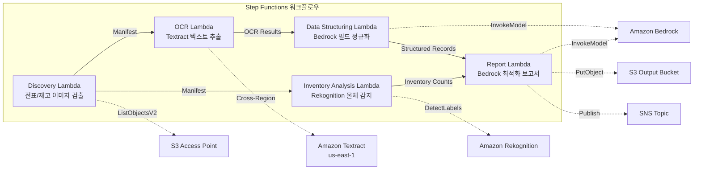

# UC12: 물류 / 공급망 — 배송 전표 OCR 및 창고 재고 이미지 분석

🌐 **Language / 言語**: [日本語](README.md) | [English](README.en.md) | 한국어 | [简体中文](README.zh-CN.md) | [繁體中文](README.zh-TW.md) | [Français](README.fr.md) | [Deutsch](README.de.md) | [Español](README.es.md)

📚 **문서**: [아키텍처 다이어그램](docs/architecture.md) | [데모 가이드](docs/demo-guide.md)

## 개요

FSx for ONTAP의 S3 Access Points를 활용하여 배송 전표의 OCR 텍스트 추출, 창고 재고 이미지의 물체 감지 및 카운트, 배송 경로 최적화 보고서 생성을 자동화하는 서버리스 워크플로우입니다.

### 이 패턴이 적합한 경우

- 배송 전표 이미지와 창고 재고 이미지가 FSx for ONTAP에 축적되어 있습니다
- Textract를 사용하여 배송 전표의 OCR(발송인, 수령인, 추적 번호, 품목)를 자동화하고 싶습니다
- Bedrock을 사용하여 추출 필드의 정규화와 구조화된 배송 레코드 생성이 필요합니다
- Rekognition을 사용하여 창고 재고 이미지의 물체 감지 및 카운트(팔레트, 상자, 선반 점유율)를 수행하고 싶습니다
- 배송 경로 최적화 보고서를 자동으로 생성하고 싶습니다

### 이 패턴이 적합하지 않은 경우

- 실시간 배송 추적 시스템이 필요합니다
- 대규모 WMS(Warehouse Management System)와의 직접 통합이 필요합니다
- 전체 배송 경로 최적화 엔진이 필요합니다(전용 소프트웨어가 적합)
- ONTAP REST API에 대한 네트워크 연결을 확보할 수 없는 환경

### 주요 기능

- S3 AP 경로를 통한 배송 전표 이미지(.jpg, .jpeg, .png, .tiff, .pdf) 및 창고 재고 이미지 자동 검출
- Textract(크로스 리전)를 통한 배송 전표 OCR(텍스트 및 양식 추출)
- 낮은 신뢰도 결과의 수동 검증 플래그 설정
- Bedrock을 통한 추출 필드 정규화 및 구조화된 배송 레코드 생성
- Rekognition을 통한 창고 재고 이미지의 물체 감지 및 카운트
- Bedrock을 통한 배송 경로 최적화 보고서 생성

## Success Metrics

### Outcome
배송 전표 OCR 및 창고 재고 이미지 분석을 자동화하여 물류 운영 효율을 향상합니다.

### Metrics
| 메트릭 | 목표값(예시) |
|-----------|------------|
| 처리된 전표 수 / 실행 | > 300 documents |
| OCR 정확도 | > 95% |
| 데이터 추출 성공률 | > 90% |
| 처리 시간 / 전표 | < 20 초 |
| 비용 / 실행 | < $5 |
| Human Review 대상률 | < 15%(판독 불가·낮은 신뢰도) |

### Measurement Method
Step Functions 실행 이력, Textract confidence score, Rekognition 검출 결과, CloudWatch Metrics.

## 아키텍처



### 워크플로우 단계

1. **Discovery**: S3 AP에서 배송 전표 이미지와 창고 재고 이미지 검출
2. **OCR**: Textract(크로스 리전)로 배송 전표에서 텍스트 및 양식 추출
3. **Data Structuring**: Bedrock으로 추출 필드를 정규화하고 구조화된 배송 레코드 생성
4. **Inventory Analysis**: Rekognition으로 창고 재고 이미지의 물체 감지 및 카운트
5. **Report**: Bedrock으로 배송 경로 최적화 보고서를 생성하고 S3 출력 + SNS 알림

## 전제 조건

- AWS 계정과 적절한 IAM 권한
- FSx for ONTAP 파일 시스템(ONTAP 9.17.1P4D3 이상)
- S3 Access Point가 활성화된 볼륨(배송 전표·재고 이미지 저장)
- VPC, 프라이빗 서브넷
- Amazon Bedrock 모델 액세스 활성화(Claude / Nova)
- **크로스 리전**: Textract가 ap-northeast-1을 지원하지 않으므로, us-east-1로의 크로스 리전 호출이 필요함

## 배포 절차

### 1. 크로스 리전 파라미터 확인

Textract는 도쿄 리전을 지원하지 않으므로, `CrossRegion` 파라미터를 사용하여 크로스 리전 호출을 설정합니다.

### 2. 사전 준비

```bash
# AWS SAM CLI 설치 (미설치 시)
# https://docs.aws.amazon.com/serverless-application-model/latest/developerguide/install-sam-cli.html

# 리포지토리 클론
git clone https://github.com/Yoshiki0705/FSx-for-ONTAP-S3AccessPoints-Serverless-Patterns.git
cd FSx-for-ONTAP-S3AccessPoints-Serverless-Patterns/solutions/industry/logistics-ocr
```

### 3. samconfig.toml 설정

```bash
cp samconfig.toml.example samconfig.toml
# samconfig.toml을 편집하여 실제 값으로 치환
```

### 4. SAM CLI를 사용한 빌드 및 배포

```bash
# 빌드 (Lambda 코드 패키징 + shared/ Layer 생성을 자동 수행)
# 사전 요구사항: AWS SAM CLI가 필요합니다. 'sam build'가 코드와 공유 레이어를 자동으로 패키징합니다.
sam build

# 배포
sam deploy --config-file samconfig.toml
```

또는 `samconfig.toml` 없이 직접 파라미터를 지정하여 배포할 수도 있습니다:

```bash
# 사전 요구사항: AWS SAM CLI가 필요합니다. 'sam build'가 코드와 공유 레이어를 자동으로 패키징합니다.
sam build

sam deploy \
  --stack-name fsxn-logistics-ocr \
  --parameter-overrides \
    S3AccessPointAlias=<your-volume-ext-s3alias> \
    OntapSecretName=<your-ontap-secret-name> \
    OntapManagementIp=<your-ontap-mgmt-ip> \
    SvmUuid=<your-svm-uuid> \
    VpcId=<your-vpc-id> \
    PrivateSubnetIds=<subnet-1>,<subnet-2> \
    NotificationEmail=<your-email@example.com> \
    CrossRegion=us-east-1 \
    EnableVpcEndpoints=false \
    EnableCloudWatchAlarms=false \
  --capabilities CAPABILITY_NAMED_IAM \
  --resolve-s3 \
  --region <your-region>
```

> **참고**: `template.yaml`은 SAM CLI(`sam build` + `sam deploy`)에서 사용합니다.
> `aws cloudformation deploy` 명령으로 직접 배포하려면 `template-deploy.yaml`을 사용하세요(Lambda zip 파일의 사전 패키징 및 S3 업로드가 필요합니다).

## 설정 파라미터 목록

| 파라미터 | 설명 | 기본값 | 필수 |
|-----------|------|----------|------|
| `S3AccessPointAlias` | FSx for ONTAP S3 AP Alias(입력용) | — | ✅ |
| `S3AccessPointName` | S3 AP 이름(ARN 기반 IAM 권한 부여용. 생략 시 Alias 기반만) | `""` | ⚠️ 권장 |
| `ScheduleExpression` | EventBridge Scheduler의 스케줄 식 | `rate(1 hour)` | |
| `VpcId` | VPC ID | — | ✅ |
| `PrivateSubnetIds` | 프라이빗 서브넷 ID 목록 | — | ✅ |
| `NotificationEmail` | SNS 통지 대상 이메일 주소 | — | ✅ |
| `CrossRegionTarget` | Textract의 대상 리전 | `us-east-1` | |
| `MapConcurrency` | Map 상태의 병렬 실행 수 | `10` | |
| `LambdaMemorySize` | Lambda 메모리 크기 (MB) | `512` | |
| `LambdaTimeout` | Lambda 타임아웃 (초) | `300` | |
| `EnableVpcEndpoints` | Interface VPC Endpoints 활성화 | `false` | |
| `EnableCloudWatchAlarms` | CloudWatch Alarms 활성화 | `false` | |

## 정리

```bash
aws s3 rm s3://fsxn-logistics-ocr-output-${AWS_ACCOUNT_ID} --recursive

aws cloudformation delete-stack \
  --stack-name fsxn-logistics-ocr \
  --region ap-northeast-1

aws cloudformation wait stack-delete-complete \
  --stack-name fsxn-logistics-ocr \
  --region ap-northeast-1
```

## Supported Regions

UC12는 다음 서비스를 사용합니다:

| 서비스 | 리전 제약 |
|---------|-------------|
| Amazon Textract | ap-northeast-1 미지원. `TEXTRACT_REGION` 파라미터로 지원 리전(us-east-1 등)을 지정 |
| Amazon Rekognition | 거의 모든 리전에서 사용 가능 |
| Amazon Bedrock | 지원 리전 확인([Bedrock 지원 리전](https://docs.aws.amazon.com/general/latest/gr/bedrock.html)) |
| AWS X-Ray | 거의 모든 리전에서 사용 가능 |
| CloudWatch EMF | 거의 모든 리전에서 사용 가능 |

> Cross-Region Client를 통해 Textract API를 호출합니다. 데이터 레지던시 요건을 확인하세요. 자세한 내용은 [리전 호환성 매트릭스](../docs/region-compatibility.md)를 참조하세요.

## 참조 링크

- [FSx for ONTAP S3 Access Points 개요](https://docs.aws.amazon.com/fsx/latest/ONTAPGuide/accessing-data-via-s3-access-points.html)
- [Amazon Textract 문서](https://docs.aws.amazon.com/textract/latest/dg/what-is.html)
- [Amazon Rekognition 레이블 감지](https://docs.aws.amazon.com/rekognition/latest/dg/labels.html)
- [Amazon Bedrock API 참조](https://docs.aws.amazon.com/bedrock/latest/APIReference/API_runtime_InvokeModel.html)

---

## AWS 문서 링크

| 서비스 | 문서 |
|---------|------------|
| FSx for ONTAP | [사용자 가이드](https://docs.aws.amazon.com/fsx/latest/ONTAPGuide/what-is-fsx-ontap.html) |
| S3 Access Points | [S3 AP for FSx for ONTAP](https://docs.aws.amazon.com/fsx/latest/ONTAPGuide/s3-access-points.html) |
| Step Functions | [개발자 가이드](https://docs.aws.amazon.com/step-functions/latest/dg/welcome.html) |
| Amazon Textract | [개발자 가이드](https://docs.aws.amazon.com/textract/latest/dg/what-is.html) |
| Amazon Rekognition | [개발자 가이드](https://docs.aws.amazon.com/rekognition/latest/dg/what-is.html) |
| Amazon Bedrock | [사용자 가이드](https://docs.aws.amazon.com/bedrock/latest/userguide/what-is-bedrock.html) |

### Well-Architected Framework 대응

| 기둥 | 대응 |
|----|------|
| 운영 우수성 | X-Ray 트레이싱, EMF 메트릭, OCR 정확도 모니터링 |
| 보안 | 최소 권한 IAM, KMS 암호화, 배송 데이터 액세스 제어 |
| 신뢰성 | Step Functions Retry/Catch, 크로스 리전 Textract |
| 성능 효율성 | 듀얼 패스 처리(OCR + 이미지 분석), 병렬 처리 |
| 비용 최적화 | 서버리스, Textract 페이지 단위 과금 |
| 지속 가능성 | 온디맨드 실행, 차분 처리 |

---

## 비용 예상(월간 개략)

> **참고**: 다음은 ap-northeast-1 리전의 개략치이며, 실제 비용은 사용량에 따라 다릅니다. 최신 요금은 [AWS Pricing Calculator](https://calculator.aws/)에서 확인하세요.

### 서버리스 컴포넌트(종량 과금)

| 서비스 | 단가 | 예상 사용량 | 월간 개략 |
|---------|------|-----------|---------|
| Lambda | $0.0000166667/GB-sec | 5 함수 × 100 docs/일 | ~$1-5 |
| S3 API (GetObject/ListObjects) | $0.0047/10K requests | ~10K requests/일 | ~$1.5 |
| Step Functions | $0.025/1K state transitions | ~1K transitions/일 | ~$0.75 |
| Bedrock (Nova Lite) | $0.00006/1K input tokens | ~40K tokens/실행 | ~$3-10 |
| Athena | $5/TB scanned | ~10 MB/쿼리 | ~$0.5-2 |
| SNS | $0.50/100K notifications | ~100 notifications/일 | ~$0.15 |
| CloudWatch Logs | $0.76/GB ingested | ~1 GB/월 | ~$0.76 |
| Textract (크로스 리전) | $1.50/1000 pages | — | — |

### 고정 비용(FSx for ONTAP — 기존 환경 전제)

| 컴포넌트 | 월간 |
|--------------|------|
| FSx for ONTAP (128 MBps, 1 TB) | ~$230 (기존 환경을 공유) |
| S3 Access Point | 추가 요금 없음(S3 API 요금만) |

### 합계 개략

| 구성 | 월간 개략 |
|------|---------|
| 최소 구성(일 1회 실행) | ~$5-15 |
| 표준 구성(시간별 실행) | ~$15-50 |
| 대규모 구성(고빈도 + 알람) | ~$50-150 |

> **Governance Caveat**: 비용 예상은 개략치이며, 보증값이 아닙니다. 실제 청구액은 사용 패턴, 데이터 양, 리전에 따라 다릅니다.

---

## 로컬 테스트

### Prerequisites 체크

```bash
# 전제 조건 확인
aws --version          # AWS CLI v2
sam --version          # SAM CLI
python3 --version      # Python 3.9+
docker --version       # Docker (sam local 용)
aws sts get-caller-identity  # AWS 인증 정보
```

### sam local invoke

```bash
# 빌드
# 사전 요구사항: AWS SAM CLI가 필요합니다. 'sam build'가 코드와 공유 레이어를 자동으로 패키징합니다.
sam build

# Discovery Lambda의 로컬 실행
sam local invoke DiscoveryFunction --event events/discovery-event.json

# 환경 변수 오버라이드 포함
sam local invoke DiscoveryFunction \
  --event events/discovery-event.json \
  --env-vars env.json
```

### 유닛 테스트

```bash
python3 -m pytest tests/ -v
```

자세한 내용은 [로컬 테스트 퀵 스타트](../docs/local-testing-quick-start.md)를 참조하세요.

---

## 출력 샘플 (Output Sample)

배송 전표 OCR + 재고 이미지 분석의 출력 예:

```json
{
  "discovery": {
    "status": "completed",
    "object_count": 30,
    "categories": {"shipping_label": 20, "inventory_image": 10}
  },
  "ocr_results": [
    {
      "key": "labels/waybill-2026-001.pdf",
      "tracking_number": "1Z999AA10123456784",
      "sender": "Tokyo Warehouse",
      "recipient": "Osaka Branch",
      "weight_kg": 12.5,
      "confidence": 0.96
    }
  ],
  "inventory_analysis": [
    {
      "key": "inventory/shelf-A3.jpg",
      "item_count": 24,
      "occupancy_pct": 75,
      "anomalies": ["misplaced_item_detected"]
    }
  ],
  "route_optimization": {
    "suggested_route": "Tokyo → Nagoya → Osaka",
    "estimated_savings_pct": 12
  }
}
```

> **참고**: 위는 샘플 출력이며, 실제 값은 환경·입력 데이터에 따라 다릅니다. 벤치마크 수치는 sizing reference이며, service limit이 아닙니다.

---

## Governance Note

> 본 패턴은 기술 아키텍처 가이던스를 제공합니다. 법적·컴플라이언스·규제상의 조언이 아닙니다. 조직은 적격한 전문가와 상담하시기 바랍니다.

---

## S3AP Compatibility

S3 Access Points for FSx for ONTAP의 호환성 제약, 문제 해결, 트리거 패턴에 대해서는 [S3AP Compatibility Notes](../docs/s3ap-compatibility-notes.md)를 참조하세요.
