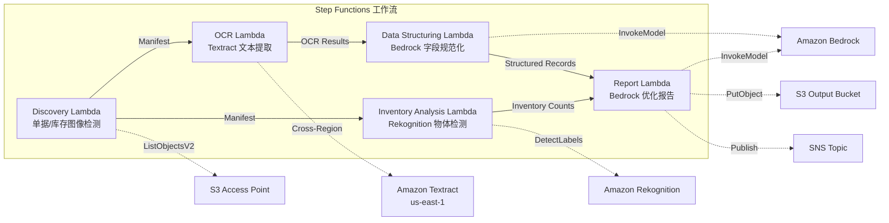

# UC12: 物流 / 供应链 — 配送单 OCR 和仓库库存图像分析

🌐 **Language / 言語**: [日本語](README.md) | [English](README.en.md) | [한국어](README.ko.md) | 简体中文 | [繁體中文](README.zh-TW.md) | [Français](README.fr.md) | [Deutsch](README.de.md) | [Español](README.es.md)

📚 **文档**: [架构图](docs/architecture.md) | [演示指南](docs/demo-guide.md)

## 概述

利用 FSx for ONTAP 的 S3 Access Points，实现无服务器工作流，自动完成配送单的 OCR 文本提取、仓库库存图像的物体检测与计数，以及配送路线优化报告的生成。

### 此模式适用的情况

- 配送单图像和仓库库存图像已积累在 FSx for ONTAP 上
- 希望通过 Textract 自动化配送单的 OCR（发件人、收件人、追踪号、物品）
- 需要通过 Bedrock 实现提取字段的规范化和生成结构化的配送记录
- 希望通过 Rekognition 实现仓库库存图像的物体检测和计数（托盘、箱子、货架占用率）
- 希望自动生成配送路线优化报告

### 此模式不适用的情况

- 需要实时配送跟踪系统
- 需要与大型 WMS（仓库管理系统）直接集成
- 需要完整的配送路线优化引擎（专用软件更合适）
- 无法确保对 ONTAP REST API 的网络可达性的环境

### 主要功能

- 通过 S3 AP 自动检测配送单图像（.jpg, .jpeg, .png, .tiff, .pdf）和仓库库存图像
- 使用 Textract（跨区域）进行配送单 OCR（文本和表单提取）
- 设置低可信度结果的手动验证标志
- 使用 Bedrock 对提取字段进行规范化并生成结构化配送记录
- 使用 Rekognition 对仓库库存图像进行物体检测和计数
- 使用 Bedrock 生成配送路线优化报告

## Success Metrics

### Outcome
通过自动化配送单 OCR 和仓库库存图像分析，提升物流运营效率。

### Metrics
| 指标 | 目标值（示例） |
|-----------|------------|
| 已处理单据数 / 次执行 | > 300 documents |
| OCR 精度 | > 95% |
| 数据提取成功率 | > 90% |
| 处理时间 / 单据 | < 20 秒 |
| 成本 / 次执行 | < $5 |
| Human Review 对象率 | < 15%（不可读·低可信度） |

### Measurement Method
Step Functions 执行历史、Textract confidence score、Rekognition 检测结果、CloudWatch Metrics。

## 架构



### 工作流程步骤

1. **Discovery**：从 S3 AP 检测配送单图像和仓库库存图像
2. **OCR**：使用 Textract（跨区域）从配送单中提取文本和表单
3. **Data Structuring**：使用 Bedrock 规范化提取字段并生成结构化配送记录
4. **Inventory Analysis**：使用 Rekognition 对仓库库存图像进行物体检测和计数
5. **Report**：使用 Bedrock 生成配送路线优化报告，输出到 S3 + SNS 通知

## 前提条件

- AWS 账户和适当的 IAM 权限
- FSx for ONTAP 文件系统（ONTAP 9.17.1P4D3 及以上版本）
- 已启用 S3 Access Point 的卷（用于存储配送单和库存图像）
- VPC、私有子网
- 已启用 Amazon Bedrock 模型访问（Claude / Nova）
- **跨区域**：由于 Textract 不支持 ap-northeast-1，因此需要跨区域调用 us-east-1

## 部署步骤

### 1. 确认跨区域参数

由于 Textract 在某些区域（如 ap-northeast-1）不受支持，请使用 `CrossRegion` 参数配置跨区域调用。

### 2. 事前准备

```bash
# 安装 AWS SAM CLI（如尚未安装）
# https://docs.aws.amazon.com/serverless-application-model/latest/developerguide/install-sam-cli.html

# 克隆仓库
git clone https://github.com/Yoshiki0705/FSx-for-ONTAP-S3AccessPoints-Serverless-Patterns.git
cd FSx-for-ONTAP-S3AccessPoints-Serverless-Patterns/solutions/industry/logistics-ocr
```

### 3. 配置 samconfig.toml

```bash
cp samconfig.toml.example samconfig.toml
# 编辑 samconfig.toml 并替换为实际的值
```

### 4. 使用 SAM CLI 构建和部署

```bash
# 构建（自动打包 Lambda 代码 + 生成 shared/ Layer）
# 前提条件：需要 AWS SAM CLI。'sam build' 会自动打包代码和共享层。
sam build

# 部署
sam deploy --config-file samconfig.toml
```

也可以不使用 `samconfig.toml` 而直接指定参数进行部署：

```bash
# 前提条件：需要 AWS SAM CLI。'sam build' 会自动打包代码和共享层。
sam build

sam deploy \
  --stack-name fsxn-logistics-ocr \
  --parameter-overrides \
    S3AccessPointAlias=<your-volume-ext-s3alias> \
    OntapSecretName=<your-ontap-secret-name> \
    OntapManagementIp=<your-ontap-mgmt-ip> \
    SvmUuid=<your-svm-uuid> \
    VpcId=<your-vpc-id> \
    PrivateSubnetIds=<subnet-1>,<subnet-2> \
    NotificationEmail=<your-email@example.com> \
    CrossRegion=us-east-1 \
    EnableVpcEndpoints=false \
    EnableCloudWatchAlarms=false \
  --capabilities CAPABILITY_NAMED_IAM \
  --resolve-s3 \
  --region <your-region>
```

> **注意**: `template.yaml` 用于 SAM CLI（`sam build` + `sam deploy`）。
> 如需使用原生 `aws cloudformation deploy` 部署，请改用 `template-deploy.yaml`（需要预先打包 Lambda zip 文件并上传到 S3 存储桶）。

## 配置参数列表

| 参数 | 说明 | 默认值 | 必需 |
|-----------|------|----------|------|
| `S3AccessPointAlias` | FSx for ONTAP S3 AP Alias（输入用） | — | ✅ |
| `S3AccessPointName` | S3 AP 名称（用于基于 ARN 的 IAM 权限授予。省略时仅基于 Alias） | `""` | ⚠️ 推荐 |
| `ScheduleExpression` | EventBridge Scheduler 的调度表达式 | `rate(1 hour)` | |
| `VpcId` | VPC ID | — | ✅ |
| `PrivateSubnetIds` | 私有子网 ID 列表 | — | ✅ |
| `NotificationEmail` | SNS 通知目标邮箱地址 | — | ✅ |
| `CrossRegionTarget` | Textract 的目标区域 | `us-east-1` | |
| `MapConcurrency` | Map 状态的并行执行数 | `10` | |
| `LambdaMemorySize` | Lambda 内存大小 (MB) | `512` | |
| `LambdaTimeout` | Lambda 超时时间 (秒) | `300` | |
| `EnableVpcEndpoints` | 启用 Interface VPC Endpoints | `false` | |
| `EnableCloudWatchAlarms` | 启用 CloudWatch Alarms | `false` | |

## 清理

```bash
aws s3 rm s3://fsxn-logistics-ocr-output-${AWS_ACCOUNT_ID} --recursive

aws cloudformation delete-stack \
  --stack-name fsxn-logistics-ocr \
  --region ap-northeast-1

aws cloudformation wait stack-delete-complete \
  --stack-name fsxn-logistics-ocr \
  --region ap-northeast-1
```

## Supported Regions

UC12 使用以下服务：

| 服务 | 区域限制 |
|---------|-------------|
| Amazon Textract | 不支持 ap-northeast-1。通过 `TEXTRACT_REGION` 参数指定支持的区域（如 us-east-1） |
| Amazon Rekognition | 几乎所有区域均可用 |
| Amazon Bedrock | 确认支持的区域（[Bedrock 支持的区域](https://docs.aws.amazon.com/general/latest/gr/bedrock.html)） |
| AWS X-Ray | 几乎所有区域均可用 |
| CloudWatch EMF | 几乎所有区域均可用 |

> 通过 Cross-Region Client 调用 Textract API。请确认数据驻留要求。详情请参见 [区域兼容性矩阵](../docs/region-compatibility.md)。

## 参考链接

- [FSx for ONTAP S3 Access Points 概述](https://docs.aws.amazon.com/fsx/latest/ONTAPGuide/accessing-data-via-s3-access-points.html)
- [Amazon Textract 文档](https://docs.aws.amazon.com/textract/latest/dg/what-is.html)
- [Amazon Rekognition 标签检测](https://docs.aws.amazon.com/rekognition/latest/dg/labels.html)
- [Amazon Bedrock API 参考](https://docs.aws.amazon.com/bedrock/latest/APIReference/API_runtime_InvokeModel.html)

---

## AWS 文档链接

| 服务 | 文档 |
|---------|------------|
| FSx for ONTAP | [用户指南](https://docs.aws.amazon.com/fsx/latest/ONTAPGuide/what-is-fsx-ontap.html) |
| S3 Access Points | [S3 AP for FSx for ONTAP](https://docs.aws.amazon.com/fsx/latest/ONTAPGuide/s3-access-points.html) |
| Step Functions | [开发者指南](https://docs.aws.amazon.com/step-functions/latest/dg/welcome.html) |
| Amazon Textract | [开发者指南](https://docs.aws.amazon.com/textract/latest/dg/what-is.html) |
| Amazon Rekognition | [开发者指南](https://docs.aws.amazon.com/rekognition/latest/dg/what-is.html) |
| Amazon Bedrock | [用户指南](https://docs.aws.amazon.com/bedrock/latest/userguide/what-is-bedrock.html) |

### Well-Architected Framework 对应

| 支柱 | 对应 |
|----|------|
| 卓越运营 | X-Ray 跟踪、EMF 指标、OCR 精度监控 |
| 安全性 | 最小权限 IAM、KMS 加密、配送数据访问控制 |
| 可靠性 | Step Functions Retry/Catch、跨区域 Textract |
| 性能效率 | 双路径处理（OCR + 图像分析）、并行处理 |
| 成本优化 | 无服务器、Textract 按页计费 |
| 可持续性 | 按需执行、增量处理 |

---

## 成本估算（每月概算）

> **注记**: 以下为 ap-northeast-1 区域的概算，实际成本因使用量而异。请在 [AWS Pricing Calculator](https://calculator.aws/) 中确认最新价格。

### 无服务器组件（按量计费）

| 服务 | 单价 | 预计使用量 | 每月概算 |
|---------|------|-----------|---------|
| Lambda | $0.0000166667/GB-sec | 5 个函数 × 100 docs/天 | ~$1-5 |
| S3 API (GetObject/ListObjects) | $0.0047/10K requests | ~10K requests/天 | ~$1.5 |
| Step Functions | $0.025/1K state transitions | ~1K transitions/天 | ~$0.75 |
| Bedrock (Nova Lite) | $0.00006/1K input tokens | ~40K tokens/次执行 | ~$3-10 |
| Athena | $5/TB scanned | ~10 MB/查询 | ~$0.5-2 |
| SNS | $0.50/100K notifications | ~100 notifications/天 | ~$0.15 |
| CloudWatch Logs | $0.76/GB ingested | ~1 GB/月 | ~$0.76 |
| Textract (跨区域) | $1.50/1000 pages | — | — |

### 固定成本（FSx for ONTAP — 以现有环境为前提）

| 组件 | 每月 |
|--------------|------|
| FSx for ONTAP (128 MBps, 1 TB) | ~$230 (与现有环境共享) |
| S3 Access Point | 无额外费用（仅 S3 API 费用） |

### 合计概算

| 配置 | 每月概算 |
|------|---------|
| 最小配置（每日执行 1 次） | ~$5-15 |
| 标准配置（每小时执行） | ~$15-50 |
| 大规模配置（高频 + 告警） | ~$50-150 |

> **Governance Caveat**: 成本估算为概算，并非保证值。实际账单金额因使用模式、数据量和区域而异。

---

## 本地测试

### Prerequisites 检查

```bash
# 确认前提条件
aws --version          # AWS CLI v2
sam --version          # SAM CLI
python3 --version      # Python 3.9+
docker --version       # Docker (用于 sam local)
aws sts get-caller-identity  # AWS 凭证
```

### sam local invoke

```bash
# 构建
# 前提条件：需要 AWS SAM CLI。'sam build' 会自动打包代码和共享层。
sam build

# 本地运行 Discovery Lambda
sam local invoke DiscoveryFunction --event events/discovery-event.json

# 带环境变量覆盖
sam local invoke DiscoveryFunction \
  --event events/discovery-event.json \
  --env-vars env.json
```

### 单元测试

```bash
python3 -m pytest tests/ -v
```

详情请参见 [本地测试快速入门](../docs/local-testing-quick-start.md)。

---

## 输出示例 (Output Sample)

配送单 OCR + 库存图像分析的输出示例：

```json
{
  "discovery": {
    "status": "completed",
    "object_count": 30,
    "categories": {"shipping_label": 20, "inventory_image": 10}
  },
  "ocr_results": [
    {
      "key": "labels/waybill-2026-001.pdf",
      "tracking_number": "1Z999AA10123456784",
      "sender": "Tokyo Warehouse",
      "recipient": "Osaka Branch",
      "weight_kg": 12.5,
      "confidence": 0.96
    }
  ],
  "inventory_analysis": [
    {
      "key": "inventory/shelf-A3.jpg",
      "item_count": 24,
      "occupancy_pct": 75,
      "anomalies": ["misplaced_item_detected"]
    }
  ],
  "route_optimization": {
    "suggested_route": "Tokyo → Nagoya → Osaka",
    "estimated_savings_pct": 12
  }
}
```

> **注记**: 以上为示例输出，实际值因环境和输入数据而异。基准数值为 sizing reference，而非 service limit。

---

## Governance Note

> 本模式提供技术架构指导。它不构成法律、合规或监管建议。组织应咨询合格的专业人士。

---

## S3AP Compatibility

有关 S3 Access Points for FSx for ONTAP 的兼容性限制、故障排查和触发模式，请参见 [S3AP Compatibility Notes](../docs/s3ap-compatibility-notes.md)。
