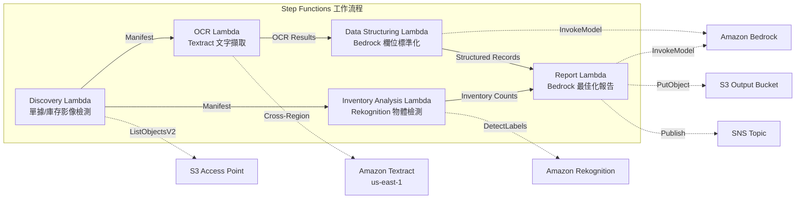

# UC12：物流 / 供應鏈 — 配送單據 OCR 與倉庫庫存影像分析

🌐 **Language / 言語**: [日本語](README.md) | [English](README.en.md) | [한국어](README.ko.md) | [简体中文](README.zh-CN.md) | 繁體中文 | [Français](README.fr.md) | [Deutsch](README.de.md) | [Español](README.es.md)

📚 **文件**: [架構圖](docs/architecture.md) | [示範指南](docs/demo-guide.md)

## 概覽

利用 FSx for ONTAP 的 S3 Access Points，實現無伺服器工作流程，自動完成配送單據的 OCR 文字提取、倉庫庫存影像的物體檢測與計數，以及配送路線最佳化報告的生成。

### 此模式適用的情況

- 配送單據影像和倉庫庫存影像已在 FSx for ONTAP 上累積
- 希望透過 Textract 自動化配送單據的 OCR（寄件人、收件人、追蹤號碼、物品）
- 需要透過 Bedrock 進行提取欄位的標準化並生成結構化配送記錄
- 希望透過 Rekognition 對倉庫庫存影像進行物體檢測與計數（棧板、箱子、貨架佔用率）
- 希望自動生成配送路線最佳化報告

### 此模式不適用的情況

- 需要即時配送追蹤系統
- 需要與大型 WMS（倉庫管理系統）直接整合
- 需要完整的配送路線最佳化引擎（專用軟體較適合）
- 無法確保對 ONTAP REST API 的網路可達性的環境

### 主要功能

- 透過 S3 AP 自動檢測配送單據影像（.jpg, .jpeg, .png, .tiff, .pdf）及倉庫庫存影像
- 透過 Textract（跨區域）進行配送單據 OCR（文字與表單擷取）
- 設定低信任度結果的手動檢查旗標
- 透過 Bedrock 進行擷取欄位標準化並生成結構化配送記錄
- 透過 Rekognition 進行倉庫庫存影像的物件檢測與計數
- 透過 Bedrock 生成配送路線最佳化報告

## Success Metrics

### Outcome
透過自動化配送單據 OCR 與倉庫庫存影像分析，提升物流營運效率。

### Metrics
| 指標 | 目標值（範例） |
|-----------|------------|
| 已處理單據數 / 每次執行 | > 300 documents |
| OCR 精度 | > 95% |
| 資料擷取成功率 | > 90% |
| 處理時間 / 單據 | < 20 秒 |
| 成本 / 每次執行 | < $5 |
| Human Review 對象率 | < 15%（無法判讀·低信任度） |

### Measurement Method
Step Functions 執行歷程、Textract confidence score、Rekognition 檢測結果、CloudWatch Metrics。

## 架構



### 工作流程步驟

1. **Discovery**：從 S3 AP 檢測配送單據影像和倉庫庫存影像
2. **OCR**：使用 Textract（跨區域）從配送單據中擷取文字和表單
3. **Data Structuring**：使用 Bedrock 標準化擷取欄位並生成結構化配送記錄
4. **Inventory Analysis**：使用 Rekognition 對倉庫庫存影像進行物體檢測與計數
5. **Report**：使用 Bedrock 生成配送路線最佳化報告，輸出至 S3 + SNS 通知

## 前提條件

- AWS 帳戶和適當的 IAM 權限
- FSx for ONTAP 檔案系統（ONTAP 9.17.1P4D3 或更高版本）
- 已啟用 S3 Access Point 的磁碟區（用於儲存配送單據和庫存影像）
- VPC、私有子網路
- 已啟用 Amazon Bedrock 模型存取（Claude / Nova）
- **跨區域**：由於 Textract 不支援 ap-northeast-1，因此需要跨區域呼叫 us-east-1

## 部署步驟

### 1. 確認跨區域參數

由於 Textract 在某些區域（如 ap-northeast-1）不受支援，請使用 `CrossRegion` 參數設定跨區域呼叫。

### 2. 事前準備

```bash
# 安裝 AWS SAM CLI（如尚未安裝）
# https://docs.aws.amazon.com/serverless-application-model/latest/developerguide/install-sam-cli.html

# 複製儲存庫
git clone https://github.com/Yoshiki0705/FSx-for-ONTAP-S3AccessPoints-Serverless-Patterns.git
cd FSx-for-ONTAP-S3AccessPoints-Serverless-Patterns/solutions/industry/logistics-ocr
```

### 3. 設定 samconfig.toml

```bash
cp samconfig.toml.example samconfig.toml
# 編輯 samconfig.toml 並替換為實際的值
```

### 4. 使用 SAM CLI 建置與部署

```bash
# 建置（自動封裝 Lambda 程式碼 + 生成 shared/ Layer）
# 前提條件：需要 AWS SAM CLI。'sam build' 會自動封裝程式碼與共用層。
sam build

# 部署
sam deploy --config-file samconfig.toml
```

也可以不使用 `samconfig.toml` 而直接指定參數進行部署：

```bash
# 前提條件：需要 AWS SAM CLI。'sam build' 會自動封裝程式碼與共用層。
sam build

sam deploy \
  --stack-name fsxn-logistics-ocr \
  --parameter-overrides \
    S3AccessPointAlias=<your-volume-ext-s3alias> \
    OntapSecretName=<your-ontap-secret-name> \
    OntapManagementIp=<your-ontap-mgmt-ip> \
    SvmUuid=<your-svm-uuid> \
    VpcId=<your-vpc-id> \
    PrivateSubnetIds=<subnet-1>,<subnet-2> \
    NotificationEmail=<your-email@example.com> \
    CrossRegion=us-east-1 \
    EnableVpcEndpoints=false \
    EnableCloudWatchAlarms=false \
  --capabilities CAPABILITY_NAMED_IAM \
  --resolve-s3 \
  --region <your-region>
```

> **注意**: `template.yaml` 用於 SAM CLI（`sam build` + `sam deploy`）。
> 如需使用原生 `aws cloudformation deploy` 部署，請改用 `template-deploy.yaml`（需要預先封裝 Lambda zip 檔案並上傳至 S3 儲存貯體）。

## 設定參數列表

| 參數 | 說明 | 預設值 | 必填 |
|-----------|------|----------|------|
| `S3AccessPointAlias` | FSx for ONTAP S3 AP Alias（輸入用） | — | ✅ |
| `S3AccessPointName` | S3 AP 名稱（用於基於 ARN 的 IAM 權限授予。省略時僅基於 Alias） | `""` | ⚠️ 建議 |
| `ScheduleExpression` | EventBridge Scheduler 的排程運算式 | `rate(1 hour)` | |
| `VpcId` | VPC ID | — | ✅ |
| `PrivateSubnetIds` | 私有子網路 ID 列表 | — | ✅ |
| `NotificationEmail` | SNS 通知目標電子郵件地址 | — | ✅ |
| `CrossRegionTarget` | Textract 的目標區域 | `us-east-1` | |
| `MapConcurrency` | Map 狀態的並行執行數 | `10` | |
| `LambdaMemorySize` | Lambda 記憶體大小 (MB) | `512` | |
| `LambdaTimeout` | Lambda 逾時 (秒) | `300` | |
| `EnableVpcEndpoints` | 啟用 Interface VPC Endpoints | `false` | |
| `EnableCloudWatchAlarms` | 啟用 CloudWatch Alarms | `false` | |

## 清理

```bash
aws s3 rm s3://fsxn-logistics-ocr-output-${AWS_ACCOUNT_ID} --recursive

aws cloudformation delete-stack \
  --stack-name fsxn-logistics-ocr \
  --region ap-northeast-1

aws cloudformation wait stack-delete-complete \
  --stack-name fsxn-logistics-ocr \
  --region ap-northeast-1
```

## Supported Regions

UC12 使用以下服務：

| 服務 | 區域限制 |
|---------|-------------|
| Amazon Textract | 不支援 ap-northeast-1。透過 `TEXTRACT_REGION` 參數指定支援的區域（如 us-east-1） |
| Amazon Rekognition | 幾乎所有區域皆可使用 |
| Amazon Bedrock | 確認支援的區域（[Bedrock 支援的區域](https://docs.aws.amazon.com/general/latest/gr/bedrock.html)） |
| AWS X-Ray | 幾乎所有區域皆可使用 |
| CloudWatch EMF | 幾乎所有區域皆可使用 |

> 透過 Cross-Region Client 呼叫 Textract API。請確認資料常駐要求。詳細資訊請參閱 [區域相容性矩陣](../docs/region-compatibility.md)。

## 參考連結

- [FSx for ONTAP S3 Access Points 概觀](https://docs.aws.amazon.com/fsx/latest/ONTAPGuide/accessing-data-via-s3-access-points.html)
- [Amazon Textract 文件](https://docs.aws.amazon.com/textract/latest/dg/what-is.html)
- [Amazon Rekognition 標籤檢測](https://docs.aws.amazon.com/rekognition/latest/dg/labels.html)
- [Amazon Bedrock API 參考](https://docs.aws.amazon.com/bedrock/latest/APIReference/API_runtime_InvokeModel.html)

---

## AWS 文件連結

| 服務 | 文件 |
|---------|------------|
| FSx for ONTAP | [使用者指南](https://docs.aws.amazon.com/fsx/latest/ONTAPGuide/what-is-fsx-ontap.html) |
| S3 Access Points | [S3 AP for FSx for ONTAP](https://docs.aws.amazon.com/fsx/latest/ONTAPGuide/s3-access-points.html) |
| Step Functions | [開發人員指南](https://docs.aws.amazon.com/step-functions/latest/dg/welcome.html) |
| Amazon Textract | [開發人員指南](https://docs.aws.amazon.com/textract/latest/dg/what-is.html) |
| Amazon Rekognition | [開發人員指南](https://docs.aws.amazon.com/rekognition/latest/dg/what-is.html) |
| Amazon Bedrock | [使用者指南](https://docs.aws.amazon.com/bedrock/latest/userguide/what-is-bedrock.html) |

### Well-Architected Framework 對應

| 支柱 | 對應 |
|----|------|
| 卓越營運 | X-Ray 追蹤、EMF 指標、OCR 精度監控 |
| 安全性 | 最小權限 IAM、KMS 加密、配送資料存取控制 |
| 可靠性 | Step Functions Retry/Catch、跨區域 Textract |
| 效能效率 | 雙路徑處理（OCR + 影像分析）、平行處理 |
| 成本最佳化 | 無伺服器、Textract 按頁計費 |
| 永續性 | 隨需執行、增量處理 |

---

## 成本估算（每月概算）

> **註記**: 以下為 ap-northeast-1 區域的概算，實際成本因使用量而異。請在 [AWS Pricing Calculator](https://calculator.aws/) 中確認最新價格。

### 無伺服器元件（依用量計費）

| 服務 | 單價 | 預計使用量 | 每月概算 |
|---------|------|-----------|---------|
| Lambda | $0.0000166667/GB-sec | 5 個函數 × 100 docs/日 | ~$1-5 |
| S3 API (GetObject/ListObjects) | $0.0047/10K requests | ~10K requests/日 | ~$1.5 |
| Step Functions | $0.025/1K state transitions | ~1K transitions/日 | ~$0.75 |
| Bedrock (Nova Lite) | $0.00006/1K input tokens | ~40K tokens/每次執行 | ~$3-10 |
| Athena | $5/TB scanned | ~10 MB/查詢 | ~$0.5-2 |
| SNS | $0.50/100K notifications | ~100 notifications/日 | ~$0.15 |
| CloudWatch Logs | $0.76/GB ingested | ~1 GB/月 | ~$0.76 |
| Textract (跨區域) | $1.50/1000 pages | — | — |

### 固定成本（FSx for ONTAP — 以現有環境為前提）

| 元件 | 每月 |
|--------------|------|
| FSx for ONTAP (128 MBps, 1 TB) | ~$230 (與現有環境共用) |
| S3 Access Point | 無額外費用（僅 S3 API 費用） |

### 合計概算

| 組態 | 每月概算 |
|------|---------|
| 最小組態（每日執行 1 次） | ~$5-15 |
| 標準組態（每小時執行） | ~$15-50 |
| 大規模組態（高頻率 + 警報） | ~$50-150 |

> **Governance Caveat**: 成本估算為概算，並非保證值。實際帳單金額因使用模式、資料量和區域而異。

---

## 本地測試

### Prerequisites 檢查

```bash
# 確認前提條件
aws --version          # AWS CLI v2
sam --version          # SAM CLI
python3 --version      # Python 3.9+
docker --version       # Docker (用於 sam local)
aws sts get-caller-identity  # AWS 憑證
```

### sam local invoke

```bash
# 建置
# 前提條件：需要 AWS SAM CLI。'sam build' 會自動封裝程式碼與共用層。
sam build

# 本地執行 Discovery Lambda
sam local invoke DiscoveryFunction --event events/discovery-event.json

# 帶環境變數覆寫
sam local invoke DiscoveryFunction \
  --event events/discovery-event.json \
  --env-vars env.json
```

### 單元測試

```bash
python3 -m pytest tests/ -v
```

詳細資訊請參閱 [本地測試快速入門](../docs/local-testing-quick-start.md)。

---

## 輸出範例 (Output Sample)

配送單據 OCR + 庫存影像分析的輸出範例：

```json
{
  "discovery": {
    "status": "completed",
    "object_count": 30,
    "categories": {"shipping_label": 20, "inventory_image": 10}
  },
  "ocr_results": [
    {
      "key": "labels/waybill-2026-001.pdf",
      "tracking_number": "1Z999AA10123456784",
      "sender": "Tokyo Warehouse",
      "recipient": "Osaka Branch",
      "weight_kg": 12.5,
      "confidence": 0.96
    }
  ],
  "inventory_analysis": [
    {
      "key": "inventory/shelf-A3.jpg",
      "item_count": 24,
      "occupancy_pct": 75,
      "anomalies": ["misplaced_item_detected"]
    }
  ],
  "route_optimization": {
    "suggested_route": "Tokyo → Nagoya → Osaka",
    "estimated_savings_pct": 12
  }
}
```

> **註記**: 以上為範例輸出，實際值因環境和輸入資料而異。基準數值為 sizing reference，而非 service limit。

---

## Governance Note

> 本模式提供技術架構指導。它不構成法律、合規或法規建議。組織應諮詢合格的專業人士。

---

## S3AP Compatibility

有關 S3 Access Points for FSx for ONTAP 的相容性限制、疑難排解和觸發模式，請參閱 [S3AP Compatibility Notes](../docs/s3ap-compatibility-notes.md)。
