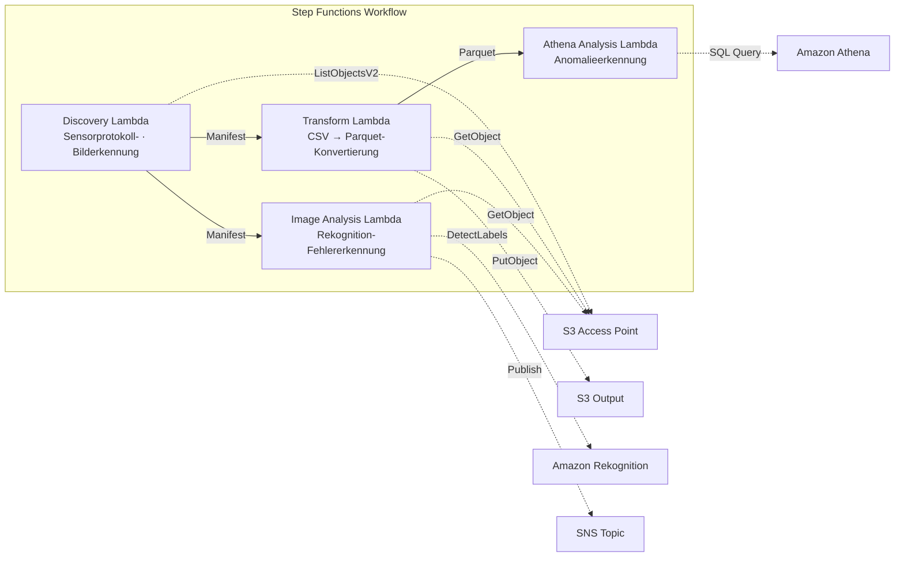

# UC3: Fertigungsindustrie — Analyse von IoT-Sensorprotokollen und Qualitätsprüfbildern

🌐 **Language / 言語**: [日本語](README.md) | [English](README.en.md) | [한국어](README.ko.md) | [简体中文](README.zh-CN.md) | [繁體中文](README.zh-TW.md) | [Français](README.fr.md) | Deutsch | [Español](README.es.md)

📚 **Dokumentation**: [Architekturdiagramm](docs/architecture.de.md) | [Demo-Leitfaden](docs/demo-guide.de.md)

## Überblick

Ein serverloser Workflow, der die S3 Access Points von Amazon FSx for NetApp ONTAP nutzt, um die Anomalieerkennung in IoT-Sensorprotokollen und die Fehlererkennung in Qualitätsprüfbildern zu automatisieren.

### Wann dieses Muster geeignet ist

- Sie möchten die auf dem Datei-Server der Fabrik gesammelten CSV-Sensorprotokolle regelmäßig analysieren
- Sie möchten die Sichtprüfung von Qualitätsprüfbildern mit KI automatisieren und effizienter gestalten
- Sie möchten Analysen hinzufügen, ohne den bestehenden NAS-basierten Datenerfassungsablauf (SPS → Datei-Server) zu ändern
- Sie möchten eine flexible schwellenwertbasierte Anomalieerkennung mit Athena SQL realisieren
- Sie benötigen eine stufenweise Bewertung (automatisch bestanden / manuelle Prüfung / automatisch durchgefallen) basierend auf den Konfidenzwerten von Rekognition

### Wann dieses Muster nicht geeignet ist

- Sie benötigen eine Echtzeit-Anomalieerkennung im Millisekundenbereich (IoT Core + Kinesis empfohlen)
- Sie müssen Sensorprotokolle im TB-Maßstab im Batch verarbeiten (EMR Serverless Spark empfohlen)
- Die Bildfehlererkennung erfordert ein eigens trainiertes Modell (SageMaker-Endpunkt empfohlen)
- Die Sensordaten sind bereits in einer Zeitreihen-Datenbank (z. B. Timestream) gespeichert

### Hauptfunktionen

- Automatische Erkennung von CSV-Sensorprotokollen und JPEG/PNG-Prüfbildern über den S3 AP
- Effizientere Analyse durch CSV → Parquet-Konvertierung
- Schwellenwertbasierte Erkennung anormaler Sensorwerte mit Amazon Athena SQL
- Fehlererkennung und Setzen eines Flags für die manuelle Prüfung mit Amazon Rekognition

## Success Metrics

### Outcome
Die automatische Analyse von IoT-Sensorprotokollen und Qualitätsprüfbildern beschleunigt die Anomalieerkennung und reduziert den Aufwand für das Qualitätsmanagement.

### Metrics
| Metrik | Zielwert (Beispiel) |
|-----------|------------|
| Analysierte Dateien / pro Ausführung | > 1,000 files |
| Latenz der Anomalieerkennung | < 1 Stunde (POLLING) |
| Falsch-Positiv-Rate (False Positive) | < 5% |
| Verarbeitungsdurchsatz | > 500 files/hour |
| Kosten / Scan | < $5 |
| Anteil an Human Review | < 5% (nur Alarmbenachrichtigungen) |

### Measurement Method
CloudWatch Metrics (FilesProcessed, AnomaliesDetected), Athena-Abfrageergebnisse, SNS-Benachrichtigungsprotokolle.

## Architektur



### Workflow-Schritte

1. **Discovery**: CSV-Sensorprotokolle und JPEG/PNG-Prüfbilder aus dem S3 AP erkennen und ein Manifest generieren
2. **Transform**: CSV-Dateien in das Parquet-Format konvertieren und in die S3-Ausgabe schreiben (verbessert die Analyseeffizienz)
3. **Athena Analysis**: anormale Sensorwerte schwellenwertbasiert mit Athena SQL erkennen
4. **Image Analysis**: Fehler mit Rekognition erkennen; ein Flag für die manuelle Prüfung setzen, wenn die Konfidenz unter dem Schwellenwert liegt

## Voraussetzungen

- Ein AWS-Konto und geeignete IAM-Berechtigungen
- Ein FSx for ONTAP-Dateisystem (ONTAP 9.17.1P4D3 oder höher)
- Ein Volume mit aktiviertem S3 Access Point
- ONTAP-REST-API-Anmeldeinformationen im Secrets Manager registriert
- Ein VPC und private Subnetze
- Eine Region, in der Amazon Rekognition verfügbar ist

## Bereitstellungsschritte

### 1. Vorbereitung der Parameter

Überprüfen Sie vor der Bereitstellung die folgenden Werte:

- FSx for ONTAP S3 Access Point Alias
- ONTAP-Management-IP-Adresse
- Secrets-Manager-Secret-Name
- VPC-ID, private Subnetz-IDs
- Schwellenwert für die Anomalieerkennung, Konfidenzschwellenwert für die Fehlererkennung

### 2. SAM-Bereitstellung

```bash
# Voraussetzung: AWS SAM CLI ist erforderlich. sam build paketiert den Code und den gemeinsamen Layer automatisch.
sam build

sam deploy \
  --stack-name fsxn-manufacturing-analytics \
  --parameter-overrides \
    S3AccessPointAlias=<your-volume-ext-s3alias> \
    S3AccessPointName=<your-s3ap-name> \
    S3AccessPointOutputAlias=<your-output-volume-ext-s3alias> \
    OntapSecretName=<your-ontap-secret-name> \
    OntapManagementIp=<your-ontap-management-ip> \
    ScheduleExpression="rate(1 hour)" \
    VpcId=<your-vpc-id> \
    PrivateSubnetIds=<subnet-1>,<subnet-2> \
    NotificationEmail=<your-email@example.com> \
    AnomalyThreshold=3.0 \
    ConfidenceThreshold=80.0 \
    EnableVpcEndpoints=false \
    EnableCloudWatchAlarms=false \
  --capabilities CAPABILITY_NAMED_IAM \
  --resolve-s3 \
  --region ap-northeast-1
```

> **Hinweis**: `template.yaml` ist für die Verwendung mit dem SAM CLI (`sam build` + `sam deploy`) vorgesehen.
> Um direkt mit dem Befehl `aws cloudformation deploy` bereitzustellen, verwenden Sie stattdessen `template-deploy.yaml` (erfordert das Vorpaketieren der Lambda-Zip-Dateien und deren Hochladen zu S3).

> **Hinweis**: Ersetzen Sie die Platzhalter `<...>` durch Ihre tatsächlichen Umgebungswerte.

### 3. Bestätigung des SNS-Abonnements

Nach der Bereitstellung wird eine SNS-Abonnement-Bestätigungs-E-Mail an die von Ihnen angegebene Adresse gesendet.

> **Hinweis**: Wenn Sie `S3AccessPointName` weglassen, wird die IAM-Richtlinie nur Alias-basiert, was einen `AccessDenied`-Fehler verursachen kann. Für Produktionsumgebungen wird die Angabe empfohlen. Weitere Einzelheiten finden Sie im [Leitfaden zur Fehlerbehebung](../docs/guides/troubleshooting-guide.md#1-accessdenied-エラー).

## Liste der Konfigurationsparameter

| Parameter | Beschreibung | Standard | Erforderlich |
|-----------|------|----------|------|
| `S3AccessPointAlias` | FSx for ONTAP S3 AP Alias (Eingabe) | — | ✅ |
| `S3AccessPointName` | S3-AP-Name (für ARN-basierte IAM-Berechtigungserteilung; nur Alias-basiert bei Weglassen) | `""` | ⚠️ Empfohlen |
| `S3AccessPointOutputAlias` | FSx for ONTAP S3 AP Alias (Ausgabe) | — | ✅ |
| `OntapSecretName` | Secrets-Manager-Secret-Name für ONTAP-Anmeldeinformationen | — | ✅ |
| `OntapManagementIp` | ONTAP-Cluster-Management-IP-Adresse | — | ✅ |
| `ScheduleExpression` | Zeitplanausdruck des EventBridge Scheduler | `rate(1 hour)` | |
| `VpcId` | VPC-ID | — | ✅ |
| `PrivateSubnetIds` | Liste der privaten Subnetz-IDs | — | ✅ |
| `NotificationEmail` | SNS-Benachrichtigungs-E-Mail-Adresse | — | ✅ |
| `AnomalyThreshold` | Schwellenwert für die Anomalieerkennung (Vielfaches der Standardabweichung) | `3.0` | |
| `ConfidenceThreshold` | Konfidenzschwellenwert für die Rekognition-Fehlererkennung | `80.0` | |
| `EnableVpcEndpoints` | Aktivierung der Interface VPC Endpoints | `false` | |
| `EnableCloudWatchAlarms` | Aktivierung der CloudWatch Alarms | `false` | |
| `EnableAthenaWorkgroup` | Aktivierung von Athena Workgroup / Glue Data Catalog | `true` | |

## Kostenstruktur

### Anfragebasiert (nutzungsabhängig)

| Dienst | Abrechnungseinheit | Schätzung (100 Dateien/Monat) |
|---------|---------|---------------------|
| Lambda | Anzahl der Anfragen + Ausführungszeit | ~$0.01 |
| Step Functions | Anzahl der Zustandsübergänge | Innerhalb des kostenlosen Kontingents |
| S3 API | Anzahl der Anfragen | ~$0.01 |
| Athena | Umfang der gescannten Daten | ~$0.01 |
| Rekognition | Anzahl der Bilder | ~$0.10 |

### Dauerbetrieb (optional)

| Dienst | Parameter | Monatlich |
|---------|-----------|------|
| Interface VPC Endpoints | `EnableVpcEndpoints=true` | ~$28.80 |
| CloudWatch Alarms | `EnableCloudWatchAlarms=true` | ~$0.30 |

> In Demo-/PoC-Umgebungen können Sie bereits ab **~$0.13/Monat** ausschließlich mit variablen Kosten starten.

## Bereinigung

```bash
# Löschen des CloudFormation-Stacks
aws cloudformation delete-stack \
  --stack-name fsxn-manufacturing-analytics \
  --region ap-northeast-1

# Auf Abschluss des Löschvorgangs warten
aws cloudformation wait stack-delete-complete \
  --stack-name fsxn-manufacturing-analytics \
  --region ap-northeast-1
```

> **Hinweis**: Wenn im S3-Bucket noch Objekte vorhanden sind, kann das Löschen des Stacks fehlschlagen. Leeren Sie den Bucket im Voraus.

## Supported Regions

UC3 verwendet die folgenden Dienste:

| Dienst | Regionsbeschränkung |
|---------|-------------|
| Amazon Athena | In fast allen Regionen verfügbar |
| Amazon Rekognition | In fast allen Regionen verfügbar |
| AWS X-Ray | In fast allen Regionen verfügbar |
| CloudWatch EMF | In fast allen Regionen verfügbar |

> Weitere Einzelheiten finden Sie in der [Regionskompatibilitätsmatrix](../docs/region-compatibility.md).

## Referenzlinks

### Offizielle AWS-Dokumentation

- [Überblick über FSx for ONTAP S3 Access Points](https://docs.aws.amazon.com/fsx/latest/ONTAPGuide/accessing-data-via-s3-access-points.html)
- [SQL-Abfragen mit Athena (offizielles Tutorial)](https://docs.aws.amazon.com/fsx/latest/ONTAPGuide/tutorial-query-data-with-athena.html)
- [ETL-Pipelines mit Glue (offizielles Tutorial)](https://docs.aws.amazon.com/fsx/latest/ONTAPGuide/tutorial-transform-data-with-glue.html)
- [Serverlose Verarbeitung mit Lambda (offizielles Tutorial)](https://docs.aws.amazon.com/fsx/latest/ONTAPGuide/tutorial-process-files-with-lambda.html)
- [Rekognition DetectLabels API](https://docs.aws.amazon.com/rekognition/latest/dg/API_DetectLabels.html)

### AWS-Blogbeiträge

- [S3-AP-Ankündigungsblog](https://aws.amazon.com/blogs/aws/amazon-fsx-for-netapp-ontap-now-integrates-with-amazon-s3-for-seamless-data-access/)
- [Drei serverlose Architekturmuster](https://aws.amazon.com/blogs/storage/bridge-legacy-and-modern-applications-with-amazon-s3-access-points-for-amazon-fsx/)

### GitHub-Beispiele

- [aws-samples/amazon-rekognition-serverless-large-scale-image-and-video-processing](https://github.com/aws-samples/amazon-rekognition-serverless-large-scale-image-and-video-processing) — Rekognition-Verarbeitung im großen Maßstab
- [aws-samples/serverless-patterns](https://github.com/aws-samples/serverless-patterns) — Sammlung serverloser Muster
- [aws-samples/aws-stepfunctions-examples](https://github.com/aws-samples/aws-stepfunctions-examples) — Step Functions-Beispiele

## Validierte Umgebung

| Element | Wert |
|------|-----|
| AWS-Region | ap-northeast-1 (Tokio) |
| FSx for ONTAP-Version | ONTAP 9.17.1P4D3 |
| FSx-Konfiguration | SINGLE_AZ_1 |
| Python | 3.12 |
| Bereitstellungsmethode | CloudFormation (Standard) |

## Lambda-VPC-Platzierungsarchitektur

Basierend auf den Erkenntnissen aus der Validierung werden die Lambda-Funktionen getrennt innerhalb bzw. außerhalb des VPC platziert.

**Lambda innerhalb des VPC** (nur Funktionen, die ONTAP-REST-API-Zugriff erfordern):
- Discovery Lambda — S3 AP + ONTAP API

**Lambda außerhalb des VPC** (nur unter Verwendung der APIs verwalteter AWS-Dienste):
- Alle anderen Lambda-Funktionen

> **Grund**: Für den Zugriff auf die APIs verwalteter AWS-Dienste (Athena, Bedrock, Textract usw.) von einer Lambda innerhalb des VPC ist ein Interface VPC Endpoint erforderlich (je 7,20 $/Monat). Lambda-Funktionen außerhalb des VPC können über das Internet direkt auf AWS-APIs zugreifen und arbeiten ohne zusätzliche Kosten.

> **Hinweis**: Für UCs, die die ONTAP-REST-API verwenden (UC1 Recht & Compliance), ist `EnableVpcEndpoints=true` obligatorisch, da die ONTAP-Anmeldeinformationen über den Secrets Manager VPC Endpoint abgerufen werden.

---

## AWS-Dokumentationslinks

| Dienst | Dokumentation |
|---------|------------|
| FSx for ONTAP | [FSx for ONTAP](https://docs.aws.amazon.com/fsx/latest/ONTAPGuide/what-is-fsx-ontap.html) |
| S3 Access Points | [S3 Access Points](https://docs.aws.amazon.com/fsx/latest/ONTAPGuide/s3-access-points.html) |
| Step Functions | [Step Functions](https://docs.aws.amazon.com/step-functions/latest/dg/welcome.html) |
| AWS Glue | [AWS Glue](https://docs.aws.amazon.com/glue/latest/dg/what-is-glue.html) |
| Amazon Athena | [Amazon Athena](https://docs.aws.amazon.com/athena/latest/ug/what-is.html) |
| Amazon Rekognition | [Amazon Rekognition](https://docs.aws.amazon.com/rekognition/latest/dg/what-is.html) |

### Ausrichtung am Well-Architected Framework

| Säule | Umsetzung |
|----|------|
| Operative Exzellenz | X-Ray-Tracing, EMF-Metriken, Glue-Job-Überwachung |
| Sicherheit | IAM mit geringsten Rechten, KMS-Verschlüsselung, VPC-Isolierung |
| Zuverlässigkeit | Step Functions Retry/Catch, Wiederholungsversuche für Glue-Jobs |
| Leistungseffizienz | Glue-ETL-Parallelverarbeitung, Athena-Partitionen |
| Kostenoptimierung | Serverless, automatische Skalierung der Glue-DPUs |
| Nachhaltigkeit | Bedarfsgesteuerte Ausführung, Verwaltung des Datenlebenszyklus |

---

## Lokale Tests

### Voraussetzungsprüfung

```bash
# Voraussetzungen prüfen
aws --version          # AWS CLI v2
sam --version          # SAM CLI
python3 --version      # Python 3.9+
docker --version       # Docker (für sam local)
aws sts get-caller-identity  # AWS-Anmeldeinformationen
```

### sam local invoke

```bash
# Build
# Voraussetzung: AWS SAM CLI ist erforderlich. sam build paketiert den Code und den gemeinsamen Layer automatisch.
sam build

# Lokale Ausführung des Discovery Lambda
sam local invoke DiscoveryFunction --event events/discovery-event.json

# Mit Überschreibung von Umgebungsvariablen
sam local invoke DiscoveryFunction \
  --event events/discovery-event.json \
  --env-vars env.json
```

### Unit-Tests

```bash
python3 -m pytest tests/ -v
```

Weitere Einzelheiten finden Sie im [Schnellstart für lokale Tests](../docs/local-testing-quick-start.md).

---

## Ausgabebeispiel (Output Sample)

Beispielausgabe von Sensordaten-ETL + Bildanalyse:

```json
{
  "discovery": {
    "status": "completed",
    "object_count": 150,
    "categories": {"csv_sensor": 120, "image_inspection": 30}
  },
  "etl_results": {
    "records_processed": 45000,
    "anomalies_detected": 7,
    "output_table": "manufacturing_metrics"
  },
  "image_analysis": [
    {
      "key": "inspection/line-A/frame-001.jpg",
      "defect_detected": true,
      "defect_type": "scratch",
      "confidence": 0.92,
      "bounding_box": {"x": 120, "y": 80, "w": 45, "h": 30}
    }
  ],
  "athena_summary": {
    "oee_score": 0.87,
    "defect_rate_pct": 2.3,
    "query_execution_id": "qe-abc123..."
  }
}
```

> **Anmerkung**: Das Obige ist eine Beispielausgabe; die tatsächlichen Werte variieren je nach Umgebung und Eingabedaten. Benchmark-Zahlen sind Dimensionierungsreferenzen (sizing reference), keine Dienstgrenzen (service limit).

---

## Governance Note

> Dieses Muster bietet technische Architekturempfehlungen. Es stellt keine rechtliche, Compliance- oder regulatorische Beratung dar. Organisationen sollten qualifizierte Fachleute konsultieren.

---

## S3AP Compatibility

Informationen zu Kompatibilitätsbeschränkungen, Fehlerbehebung und Trigger-Mustern der S3 Access Points for FSx for ONTAP finden Sie in den [S3AP Compatibility Notes](../docs/s3ap-compatibility-notes.md).
