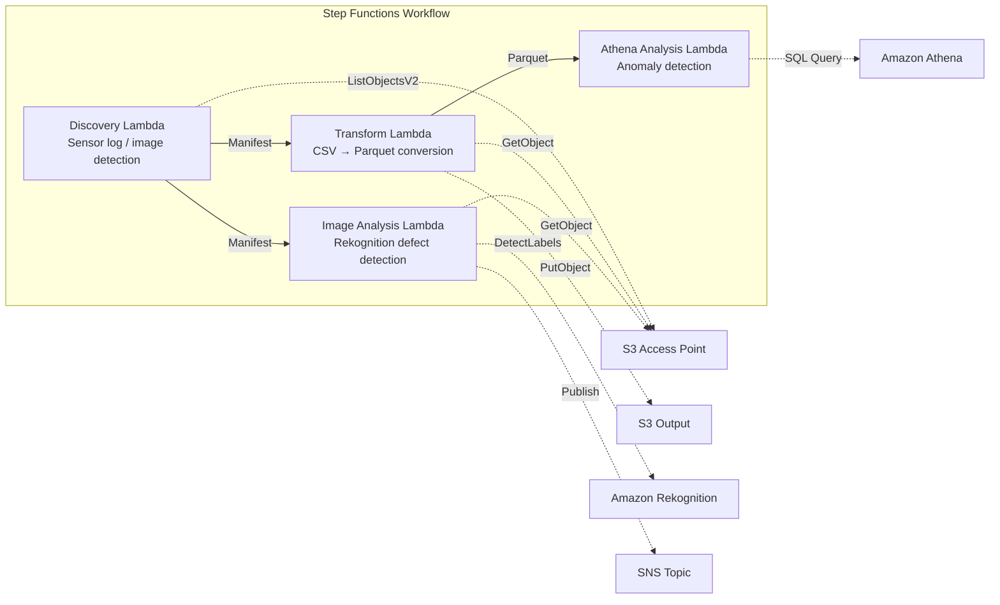

# UC3: Manufacturing Industry — Analysis of IoT Sensor Logs and Quality Inspection Images

🌐 **Language / 言語**: [日本語](README.md) | English | [한국어](README.ko.md) | [简体中文](README.zh-CN.md) | [繁體中文](README.zh-TW.md) | [Français](README.fr.md) | [Deutsch](README.de.md) | [Español](README.es.md)

📚 **Documentation**: [Architecture Diagram](docs/architecture.en.md) | [Demo Guide](docs/demo-guide.en.md)

## Overview

A serverless workflow that leverages the S3 Access Points of Amazon FSx for NetApp ONTAP to automate anomaly detection in IoT sensor logs and defect detection in quality inspection images.

### When this pattern is a good fit

- You want to periodically analyze CSV sensor logs accumulated on a factory file server
- You want to automate and streamline the visual inspection of quality inspection images with AI
- You want to add analytics without changing the existing NAS-based data collection flow (PLC → file server)
- You want flexible threshold-based anomaly detection with Athena SQL
- You need phased judgments (automatic pass / manual review / automatic fail) based on Rekognition confidence scores

### When this pattern is not a good fit

- You need real-time anomaly detection at millisecond granularity (IoT Core + Kinesis recommended)
- You need to batch-process TB-scale sensor logs (EMR Serverless Spark recommended)
- You need a custom trained model for image defect detection (SageMaker endpoint recommended)
- Your sensor data is already stored in a time-series database (such as Timestream)

### Key features

- Automatic detection of CSV sensor logs and JPEG/PNG inspection images via S3 AP
- More efficient analysis through CSV → Parquet conversion
- Threshold-based detection of abnormal sensor values with Amazon Athena SQL
- Defect detection and manual review flagging with Amazon Rekognition

## Success Metrics

### Outcome
Automated analysis of IoT sensor logs and quality inspection images speeds up anomaly detection and reduces quality-management effort.

### Metrics
| Metric | Target (example) |
|-----------|------------|
| Files analyzed per run | > 1,000 files |
| Anomaly detection latency | < 1 hour (POLLING) |
| False positive rate | < 5% |
| Processing throughput | > 500 files/hour |
| Cost per scan | < $5 |
| Human Review rate | < 5% (alert notifications only) |

### Measurement Method
CloudWatch Metrics (FilesProcessed, AnomaliesDetected), Athena query results, SNS notification logs.

## Architecture



### Workflow Steps

1. **Discovery**: Detect CSV sensor logs and JPEG/PNG inspection images from S3 AP and generate a Manifest
2. **Transform**: Convert CSV files to Parquet format and write to S3 output (improves analysis efficiency)
3. **Athena Analysis**: Detect abnormal sensor values on a threshold basis with Athena SQL
4. **Image Analysis**: Detect defects with Rekognition; set a manual review flag when confidence is below the threshold

## Prerequisites

- An AWS account and appropriate IAM permissions
- An FSx for ONTAP file system (ONTAP 9.17.1P4D3 or later)
- A volume with S3 Access Point enabled
- ONTAP REST API credentials registered in Secrets Manager
- A VPC and private subnets
- A region where Amazon Rekognition is available

## Deployment Steps

### 1. Preparing parameters

Confirm the following values before deployment:

- FSx for ONTAP S3 Access Point Alias
- ONTAP management IP address
- Secrets Manager secret name
- VPC ID, private subnet IDs
- Anomaly detection threshold, defect detection confidence threshold

### 2. SAM deployment

```bash
# Prerequisite: AWS SAM CLI is required. sam build packages the code and shared layer automatically.
sam build

sam deploy \
  --stack-name fsxn-manufacturing-analytics \
  --parameter-overrides \
    S3AccessPointAlias=<your-volume-ext-s3alias> \
    S3AccessPointName=<your-s3ap-name> \
    S3AccessPointOutputAlias=<your-output-volume-ext-s3alias> \
    OntapSecretName=<your-ontap-secret-name> \
    OntapManagementIp=<your-ontap-management-ip> \
    ScheduleExpression="rate(1 hour)" \
    VpcId=<your-vpc-id> \
    PrivateSubnetIds=<subnet-1>,<subnet-2> \
    NotificationEmail=<your-email@example.com> \
    AnomalyThreshold=3.0 \
    ConfidenceThreshold=80.0 \
    EnableVpcEndpoints=false \
    EnableCloudWatchAlarms=false \
  --capabilities CAPABILITY_NAMED_IAM \
  --resolve-s3 \
  --region ap-northeast-1
```

> **Note**: `template.yaml` is for use with the SAM CLI (`sam build` + `sam deploy`).
> To deploy directly with the `aws cloudformation deploy` command, use `template-deploy.yaml` instead (this requires pre-packaging the Lambda zip files and uploading them to S3).

> **Note**: Replace the `<...>` placeholders with your actual environment values.

### 3. Confirming the SNS subscription

After deployment, an SNS subscription confirmation email is sent to the address you specified.

> **Note**: If you omit `S3AccessPointName`, the IAM policy becomes Alias-based only, which can cause an `AccessDenied` error. Specifying it is recommended for production environments. For details, see the [Troubleshooting Guide](../docs/guides/troubleshooting-guide.md#1-accessdenied-エラー).

## Configuration Parameters

| Parameter | Description | Default | Required |
|-----------|------|----------|------|
| `S3AccessPointAlias` | FSx for ONTAP S3 AP Alias (input) | — | ✅ |
| `S3AccessPointName` | S3 AP name (for ARN-based IAM permission grants; Alias-based only when omitted) | `""` | ⚠️ Recommended |
| `S3AccessPointOutputAlias` | FSx for ONTAP S3 AP Alias (output) | — | ✅ |
| `OntapSecretName` | Secrets Manager secret name for ONTAP credentials | — | ✅ |
| `OntapManagementIp` | ONTAP cluster management IP address | — | ✅ |
| `ScheduleExpression` | EventBridge Scheduler schedule expression | `rate(1 hour)` | |
| `VpcId` | VPC ID | — | ✅ |
| `PrivateSubnetIds` | Private subnet ID list | — | ✅ |
| `NotificationEmail` | SNS notification email address | — | ✅ |
| `AnomalyThreshold` | Anomaly detection threshold (multiple of standard deviation) | `3.0` | |
| `ConfidenceThreshold` | Confidence threshold for Rekognition defect detection | `80.0` | |
| `EnableVpcEndpoints` | Enable Interface VPC Endpoints | `false` | |
| `EnableCloudWatchAlarms` | Enable CloudWatch Alarms | `false` | |
| `EnableAthenaWorkgroup` | Enable Athena Workgroup / Glue Data Catalog | `true` | |

## Cost Structure

### Request-based (pay-as-you-go)

| Service | Billing unit | Estimate (100 files/month) |
|---------|---------|---------------------|
| Lambda | Requests + execution time | ~$0.01 |
| Step Functions | State transitions | Within free tier |
| S3 API | Requests | ~$0.01 |
| Athena | Data scanned | ~$0.01 |
| Rekognition | Number of images | ~$0.10 |

### Always on (optional)

| Service | Parameter | Monthly |
|---------|-----------|------|
| Interface VPC Endpoints | `EnableVpcEndpoints=true` | ~$28.80 |
| CloudWatch Alarms | `EnableCloudWatchAlarms=true` | ~$0.30 |

> In demo/PoC environments, you can start from just **~$0.13/month** with variable costs only.

## Cleanup

```bash
# Delete the CloudFormation stack
aws cloudformation delete-stack \
  --stack-name fsxn-manufacturing-analytics \
  --region ap-northeast-1

# Wait for deletion to complete
aws cloudformation wait stack-delete-complete \
  --stack-name fsxn-manufacturing-analytics \
  --region ap-northeast-1
```

> **Note**: If objects remain in the S3 bucket, stack deletion may fail. Empty the bucket beforehand.

## Supported Regions

UC3 uses the following services:

| Service | Region constraint |
|---------|-------------|
| Amazon Athena | Available in almost all regions |
| Amazon Rekognition | Available in almost all regions |
| AWS X-Ray | Available in almost all regions |
| CloudWatch EMF | Available in almost all regions |

> See the [Region Compatibility Matrix](../docs/region-compatibility.md) for details.

## References

### AWS official documentation

- [FSx for ONTAP S3 Access Points overview](https://docs.aws.amazon.com/fsx/latest/ONTAPGuide/accessing-data-via-s3-access-points.html)
- [SQL queries with Athena (official tutorial)](https://docs.aws.amazon.com/fsx/latest/ONTAPGuide/tutorial-query-data-with-athena.html)
- [ETL pipelines with Glue (official tutorial)](https://docs.aws.amazon.com/fsx/latest/ONTAPGuide/tutorial-transform-data-with-glue.html)
- [Serverless processing with Lambda (official tutorial)](https://docs.aws.amazon.com/fsx/latest/ONTAPGuide/tutorial-process-files-with-lambda.html)
- [Rekognition DetectLabels API](https://docs.aws.amazon.com/rekognition/latest/dg/API_DetectLabels.html)

### AWS blog posts

- [S3 AP announcement blog](https://aws.amazon.com/blogs/aws/amazon-fsx-for-netapp-ontap-now-integrates-with-amazon-s3-for-seamless-data-access/)
- [Three serverless architecture patterns](https://aws.amazon.com/blogs/storage/bridge-legacy-and-modern-applications-with-amazon-s3-access-points-for-amazon-fsx/)

### GitHub samples

- [aws-samples/amazon-rekognition-serverless-large-scale-image-and-video-processing](https://github.com/aws-samples/amazon-rekognition-serverless-large-scale-image-and-video-processing) — Large-scale Rekognition processing
- [aws-samples/serverless-patterns](https://github.com/aws-samples/serverless-patterns) — Collection of serverless patterns
- [aws-samples/aws-stepfunctions-examples](https://github.com/aws-samples/aws-stepfunctions-examples) — Step Functions samples

## Validated Environment

| Item | Value |
|------|-----|
| AWS Region | ap-northeast-1 (Tokyo) |
| FSx for ONTAP version | ONTAP 9.17.1P4D3 |
| FSx configuration | SINGLE_AZ_1 |
| Python | 3.12 |
| Deployment method | CloudFormation (standard) |

## Lambda VPC Placement Architecture

Based on findings from validation, Lambda functions are placed either inside or outside the VPC.

**Lambda inside the VPC** (only functions that require ONTAP REST API access):
- Discovery Lambda — S3 AP + ONTAP API

**Lambda outside the VPC** (using only AWS managed service APIs):
- All other Lambda functions

> **Reason**: Accessing AWS managed service APIs (Athena, Bedrock, Textract, etc.) from a Lambda inside the VPC requires Interface VPC Endpoints ($7.20/month each). Lambda functions outside the VPC can access AWS APIs directly over the internet and run at no additional cost.

> **Note**: For UCs that use the ONTAP REST API (UC1 Legal & Compliance), `EnableVpcEndpoints=true` is mandatory, because ONTAP credentials are retrieved via the Secrets Manager VPC Endpoint.

---

## AWS Documentation Links

| Service | Documentation |
|---------|------------|
| FSx for ONTAP | [FSx for ONTAP](https://docs.aws.amazon.com/fsx/latest/ONTAPGuide/what-is-fsx-ontap.html) |
| S3 Access Points | [S3 Access Points](https://docs.aws.amazon.com/fsx/latest/ONTAPGuide/s3-access-points.html) |
| Step Functions | [Step Functions](https://docs.aws.amazon.com/step-functions/latest/dg/welcome.html) |
| AWS Glue | [AWS Glue](https://docs.aws.amazon.com/glue/latest/dg/what-is-glue.html) |
| Amazon Athena | [Amazon Athena](https://docs.aws.amazon.com/athena/latest/ug/what-is.html) |
| Amazon Rekognition | [Amazon Rekognition](https://docs.aws.amazon.com/rekognition/latest/dg/what-is.html) |

### Well-Architected Framework alignment

| Pillar | Implementation |
|----|------|
| Operational Excellence | X-Ray tracing, EMF metrics, Glue job monitoring |
| Security | Least-privilege IAM, KMS encryption, VPC isolation |
| Reliability | Step Functions Retry/Catch, Glue job retries |
| Performance Efficiency | Glue ETL parallel processing, Athena partitions |
| Cost Optimization | Serverless, Glue DPU auto-scaling |
| Sustainability | On-demand execution, data lifecycle management |

---

## Local Testing

### Prerequisites check

```bash
# Check prerequisites
aws --version          # AWS CLI v2
sam --version          # SAM CLI
python3 --version      # Python 3.9+
docker --version       # Docker (for sam local)
aws sts get-caller-identity  # AWS credentials
```

### sam local invoke

```bash
# Build
# Prerequisite: AWS SAM CLI is required. sam build packages the code and shared layer automatically.
sam build

# Run the Discovery Lambda locally
sam local invoke DiscoveryFunction --event events/discovery-event.json

# With environment variable overrides
sam local invoke DiscoveryFunction \
  --event events/discovery-event.json \
  --env-vars env.json
```

### Unit tests

```bash
python3 -m pytest tests/ -v
```

For details, see the [Local Testing Quick Start](../docs/local-testing-quick-start.md).

---

## Output Sample

Example output from sensor-data ETL + image analysis:

```json
{
  "discovery": {
    "status": "completed",
    "object_count": 150,
    "categories": {"csv_sensor": 120, "image_inspection": 30}
  },
  "etl_results": {
    "records_processed": 45000,
    "anomalies_detected": 7,
    "output_table": "manufacturing_metrics"
  },
  "image_analysis": [
    {
      "key": "inspection/line-A/frame-001.jpg",
      "defect_detected": true,
      "defect_type": "scratch",
      "confidence": 0.92,
      "bounding_box": {"x": 120, "y": 80, "w": 45, "h": 30}
    }
  ],
  "athena_summary": {
    "oee_score": 0.87,
    "defect_rate_pct": 2.3,
    "query_execution_id": "qe-abc123..."
  }
}
```

> **Note**: The above is sample output; actual values vary by environment and input data. Benchmark figures are sizing references, not service limits.

---

## Governance Note

> This pattern provides technical architecture guidance. It is not legal, compliance, or regulatory advice. Organizations should consult qualified professionals.

---

## S3AP Compatibility

For S3 Access Points for FSx for ONTAP compatibility constraints, troubleshooting, and trigger patterns, see the [S3AP Compatibility Notes](../docs/s3ap-compatibility-notes.md).
