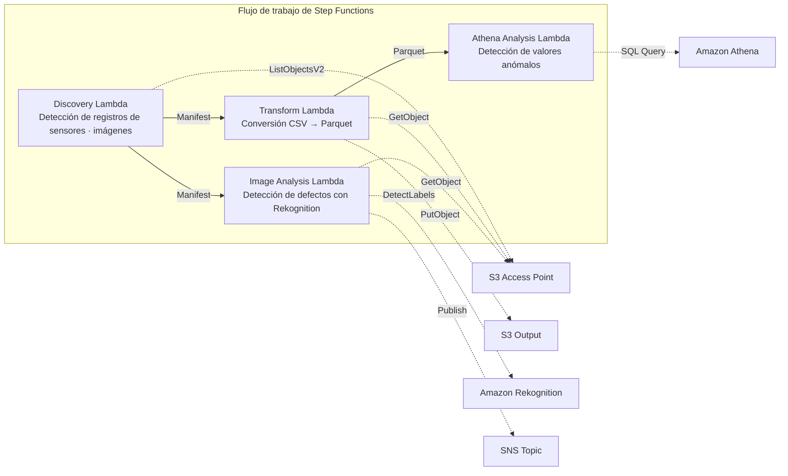

# UC3: Industria manufacturera — Análisis de registros de sensores IoT e imágenes de inspección de calidad

🌐 **Language / 言語**: [日本語](README.md) | [English](README.en.md) | [한국어](README.ko.md) | [简体中文](README.zh-CN.md) | [繁體中文](README.zh-TW.md) | [Français](README.fr.md) | [Deutsch](README.de.md) | Español

📚 **Documentación**: [Diagrama de arquitectura](docs/architecture.es.md) | [Guía de demostración](docs/demo-guide.es.md)

## Descripción general

Es un flujo de trabajo sin servidor que aprovecha los S3 Access Points de Amazon FSx for NetApp ONTAP para automatizar la detección de anomalías en los registros de sensores IoT y la detección de defectos en las imágenes de inspección de calidad.

### Cuándo es adecuado este patrón

- Desea analizar periódicamente los registros de sensores CSV acumulados en el servidor de archivos de la fábrica
- Desea automatizar y agilizar la verificación visual de las imágenes de inspección de calidad con IA
- Desea añadir análisis sin cambiar el flujo de recopilación de datos existente basado en NAS (PLC → servidor de archivos)
- Desea lograr una detección de anomalías flexible basada en umbrales con Athena SQL
- Necesita un juicio por fases (aprobación automática / revisión manual / rechazo automático) basado en las puntuaciones de confianza de Rekognition

### Cuándo no es adecuado este patrón

- Necesita detección de anomalías en tiempo real con precisión de milisegundos (se recomienda IoT Core + Kinesis)
- Necesita procesar por lotes registros de sensores a escala de TB (se recomienda EMR Serverless Spark)
- La detección de defectos en imágenes requiere un modelo entrenado personalizado (se recomienda un endpoint de SageMaker)
- Los datos de los sensores ya están almacenados en una base de datos de series temporales (como Timestream)

### Funciones principales

- Detección automática de registros de sensores CSV e imágenes de inspección JPEG/PNG a través del S3 AP
- Mayor eficiencia del análisis mediante la conversión de CSV → Parquet
- Detección de valores de sensores anómalos basada en umbrales con Amazon Athena SQL
- Detección de defectos y establecimiento de un indicador de revisión manual con Amazon Rekognition

## Success Metrics

### Outcome
El análisis automático de los registros de sensores IoT y las imágenes de inspección de calidad acelera la detección de anomalías y reduce el esfuerzo de gestión de la calidad.

### Metrics
| Métrica | Valor objetivo (ejemplo) |
|-----------|------------|
| Archivos analizados / por ejecución | > 1,000 files |
| Latencia de detección de anomalías | < 1 hora (POLLING) |
| Tasa de falsos positivos (False Positive) | < 5% |
| Rendimiento de procesamiento | > 500 files/hour |
| Coste / escaneo | < $5 |
| Tasa de objetos en Human Review | < 5% (solo notificaciones de alerta) |

### Measurement Method
CloudWatch Metrics (FilesProcessed, AnomaliesDetected), resultados de consultas de Athena, registros de notificaciones de SNS.

## Arquitectura



### Pasos del flujo de trabajo

1. **Discovery**: detectar los registros de sensores CSV y las imágenes de inspección JPEG/PNG desde el S3 AP y generar un Manifest
2. **Transform**: convertir los archivos CSV al formato Parquet y escribirlos en la salida de S3 (mejora la eficiencia del análisis)
3. **Athena Analysis**: detectar valores de sensores anómalos basándose en umbrales con Athena SQL
4. **Image Analysis**: detectar defectos con Rekognition; establecer un indicador de revisión manual cuando la confianza esté por debajo del umbral

## Requisitos previos

- Una cuenta de AWS y permisos de IAM adecuados
- Un sistema de archivos FSx for ONTAP (ONTAP 9.17.1P4D3 o posterior)
- Un volumen con S3 Access Point habilitado
- Credenciales de la API REST de ONTAP registradas en Secrets Manager
- Una VPC y subredes privadas
- Una región donde Amazon Rekognition esté disponible

## Pasos de implementación

### 1. Preparación de los parámetros

Antes de la implementación, confirme los siguientes valores:

- FSx for ONTAP S3 Access Point Alias
- Dirección IP de administración de ONTAP
- Nombre del secreto de Secrets Manager
- ID de VPC, ID de subredes privadas
- Umbral de detección de anomalías, umbral de confianza de detección de defectos

### 2. Implementación de SAM

```bash
# Requisito previo: se requiere AWS SAM CLI. sam build empaqueta el código y la capa compartida automáticamente.
sam build

sam deploy \
  --stack-name fsxn-manufacturing-analytics \
  --parameter-overrides \
    S3AccessPointAlias=<your-volume-ext-s3alias> \
    S3AccessPointName=<your-s3ap-name> \
    S3AccessPointOutputAlias=<your-output-volume-ext-s3alias> \
    OntapSecretName=<your-ontap-secret-name> \
    OntapManagementIp=<your-ontap-management-ip> \
    ScheduleExpression="rate(1 hour)" \
    VpcId=<your-vpc-id> \
    PrivateSubnetIds=<subnet-1>,<subnet-2> \
    NotificationEmail=<your-email@example.com> \
    AnomalyThreshold=3.0 \
    ConfidenceThreshold=80.0 \
    EnableVpcEndpoints=false \
    EnableCloudWatchAlarms=false \
  --capabilities CAPABILITY_NAMED_IAM \
  --resolve-s3 \
  --region ap-northeast-1
```

> **Nota**: `template.yaml` está pensado para usarse con el SAM CLI (`sam build` + `sam deploy`).
> Para implementar directamente con el comando `aws cloudformation deploy`, utilice en su lugar `template-deploy.yaml` (requiere empaquetar previamente los archivos zip de Lambda y subirlos a S3).

> **Nota**: reemplace los marcadores de posición `<...>` con los valores reales de su entorno.

### 3. Confirmación de la suscripción a SNS

Después de la implementación, se envía un correo electrónico de confirmación de suscripción a SNS a la dirección que especificó.

> **Nota**: si omite `S3AccessPointName`, la política de IAM se basa solo en el Alias, lo que puede provocar un error `AccessDenied`. Se recomienda especificarlo en entornos de producción. Para obtener más detalles, consulte la [guía de solución de problemas](../docs/guides/troubleshooting-guide.md#1-accessdenied-エラー).

## Lista de parámetros de configuración

| Parámetro | Descripción | Predeterminado | Obligatorio |
|-----------|------|----------|------|
| `S3AccessPointAlias` | FSx for ONTAP S3 AP Alias (entrada) | — | ✅ |
| `S3AccessPointName` | Nombre del S3 AP (para la concesión de permisos de IAM basados en ARN; solo basado en Alias si se omite) | `""` | ⚠️ Recomendado |
| `S3AccessPointOutputAlias` | FSx for ONTAP S3 AP Alias (salida) | — | ✅ |
| `OntapSecretName` | Nombre del secreto de Secrets Manager para las credenciales de ONTAP | — | ✅ |
| `OntapManagementIp` | Dirección IP de administración del clúster de ONTAP | — | ✅ |
| `ScheduleExpression` | Expresión de programación de EventBridge Scheduler | `rate(1 hour)` | |
| `VpcId` | ID de VPC | — | ✅ |
| `PrivateSubnetIds` | Lista de ID de subredes privadas | — | ✅ |
| `NotificationEmail` | Dirección de correo electrónico de destino de las notificaciones de SNS | — | ✅ |
| `AnomalyThreshold` | Umbral de detección de anomalías (múltiplo de la desviación estándar) | `3.0` | |
| `ConfidenceThreshold` | Umbral de confianza para la detección de defectos de Rekognition | `80.0` | |
| `EnableVpcEndpoints` | Habilitación de Interface VPC Endpoints | `false` | |
| `EnableCloudWatchAlarms` | Habilitación de CloudWatch Alarms | `false` | |
| `EnableAthenaWorkgroup` | Habilitación de Athena Workgroup / Glue Data Catalog | `true` | |

## Estructura de costes

### Basado en solicitudes (pago por uso)

| Servicio | Unidad de facturación | Estimación (100 archivos/mes) |
|---------|---------|---------------------|
| Lambda | Número de solicitudes + tiempo de ejecución | ~$0.01 |
| Step Functions | Número de transiciones de estado | Dentro del nivel gratuito |
| S3 API | Número de solicitudes | ~$0.01 |
| Athena | Volumen de datos escaneados | ~$0.01 |
| Rekognition | Número de imágenes | ~$0.10 |

### En funcionamiento continuo (opcional)

| Servicio | Parámetro | Mensual |
|---------|-----------|------|
| Interface VPC Endpoints | `EnableVpcEndpoints=true` | ~$28.80 |
| CloudWatch Alarms | `EnableCloudWatchAlarms=true` | ~$0.30 |

> En entornos de demostración/PoC, puede empezar desde tan solo **~$0.13/mes** solo con costes variables.

## Limpieza

```bash
# Eliminación de la pila de CloudFormation
aws cloudformation delete-stack \
  --stack-name fsxn-manufacturing-analytics \
  --region ap-northeast-1

# Esperar a que se complete la eliminación
aws cloudformation wait stack-delete-complete \
  --stack-name fsxn-manufacturing-analytics \
  --region ap-northeast-1
```

> **Nota**: si quedan objetos en el bucket de S3, la eliminación de la pila puede fallar. Vacíe el bucket de antemano.

## Supported Regions

UC3 utiliza los siguientes servicios:

| Servicio | Restricción de región |
|---------|-------------|
| Amazon Athena | Disponible en casi todas las regiones |
| Amazon Rekognition | Disponible en casi todas las regiones |
| AWS X-Ray | Disponible en casi todas las regiones |
| CloudWatch EMF | Disponible en casi todas las regiones |

> Consulte la [matriz de compatibilidad de regiones](../docs/region-compatibility.md) para obtener más detalles.

## Enlaces de referencia

### Documentación oficial de AWS

- [Descripción general de FSx for ONTAP S3 Access Points](https://docs.aws.amazon.com/fsx/latest/ONTAPGuide/accessing-data-via-s3-access-points.html)
- [Consultas SQL con Athena (tutorial oficial)](https://docs.aws.amazon.com/fsx/latest/ONTAPGuide/tutorial-query-data-with-athena.html)
- [Canalizaciones ETL con Glue (tutorial oficial)](https://docs.aws.amazon.com/fsx/latest/ONTAPGuide/tutorial-transform-data-with-glue.html)
- [Procesamiento sin servidor con Lambda (tutorial oficial)](https://docs.aws.amazon.com/fsx/latest/ONTAPGuide/tutorial-process-files-with-lambda.html)
- [Rekognition DetectLabels API](https://docs.aws.amazon.com/rekognition/latest/dg/API_DetectLabels.html)

### Artículos del blog de AWS

- [Blog de anuncio del S3 AP](https://aws.amazon.com/blogs/aws/amazon-fsx-for-netapp-ontap-now-integrates-with-amazon-s3-for-seamless-data-access/)
- [Tres patrones de arquitectura sin servidor](https://aws.amazon.com/blogs/storage/bridge-legacy-and-modern-applications-with-amazon-s3-access-points-for-amazon-fsx/)

### Ejemplos de GitHub

- [aws-samples/amazon-rekognition-serverless-large-scale-image-and-video-processing](https://github.com/aws-samples/amazon-rekognition-serverless-large-scale-image-and-video-processing) — Procesamiento a gran escala con Rekognition
- [aws-samples/serverless-patterns](https://github.com/aws-samples/serverless-patterns) — Colección de patrones sin servidor
- [aws-samples/aws-stepfunctions-examples](https://github.com/aws-samples/aws-stepfunctions-examples) — Ejemplos de Step Functions

## Entorno validado

| Elemento | Valor |
|------|-----|
| Región de AWS | ap-northeast-1 (Tokio) |
| Versión de FSx for ONTAP | ONTAP 9.17.1P4D3 |
| Configuración de FSx | SINGLE_AZ_1 |
| Python | 3.12 |
| Método de implementación | CloudFormation (estándar) |

## Arquitectura de ubicación de Lambda en la VPC

Según las conclusiones obtenidas de la validación, las funciones Lambda se ubican de forma separada dentro o fuera de la VPC.

**Lambda dentro de la VPC** (solo las funciones que requieren acceso a la API REST de ONTAP):
- Discovery Lambda — S3 AP + ONTAP API

**Lambda fuera de la VPC** (que utilizan únicamente las API de servicios gestionados de AWS):
- Todas las demás funciones Lambda

> **Motivo**: para acceder a las API de servicios gestionados de AWS (Athena, Bedrock, Textract, etc.) desde una Lambda dentro de la VPC se requiere un Interface VPC Endpoint (7,20 $/mes cada uno). Las funciones Lambda fuera de la VPC pueden acceder directamente a las API de AWS a través de internet y funcionan sin costes adicionales.

> **Nota**: para los UC que utilizan la API REST de ONTAP (UC1 Legal y Cumplimiento), `EnableVpcEndpoints=true` es obligatorio, ya que las credenciales de ONTAP se recuperan a través del Secrets Manager VPC Endpoint.

---

## Enlaces a la documentación de AWS

| Servicio | Documentación |
|---------|------------|
| FSx for ONTAP | [FSx for ONTAP](https://docs.aws.amazon.com/fsx/latest/ONTAPGuide/what-is-fsx-ontap.html) |
| S3 Access Points | [S3 Access Points](https://docs.aws.amazon.com/fsx/latest/ONTAPGuide/s3-access-points.html) |
| Step Functions | [Step Functions](https://docs.aws.amazon.com/step-functions/latest/dg/welcome.html) |
| AWS Glue | [AWS Glue](https://docs.aws.amazon.com/glue/latest/dg/what-is-glue.html) |
| Amazon Athena | [Amazon Athena](https://docs.aws.amazon.com/athena/latest/ug/what-is.html) |
| Amazon Rekognition | [Amazon Rekognition](https://docs.aws.amazon.com/rekognition/latest/dg/what-is.html) |

### Alineación con el Well-Architected Framework

| Pilar | Implementación |
|----|------|
| Excelencia operativa | Rastreo con X-Ray, métricas EMF, supervisión de trabajos de Glue |
| Seguridad | IAM con privilegios mínimos, cifrado KMS, aislamiento de VPC |
| Fiabilidad | Step Functions Retry/Catch, reintentos de trabajos de Glue |
| Eficiencia del rendimiento | Procesamiento paralelo de Glue ETL, particiones de Athena |
| Optimización de costes | Sin servidor, escalado automático de las DPU de Glue |
| Sostenibilidad | Ejecución bajo demanda, gestión del ciclo de vida de los datos |

---

## Pruebas locales

### Comprobación de requisitos previos

```bash
# Comprobación de los requisitos previos
aws --version          # AWS CLI v2
sam --version          # SAM CLI
python3 --version      # Python 3.9+
docker --version       # Docker (para sam local)
aws sts get-caller-identity  # Credenciales de AWS
```

### sam local invoke

```bash
# Compilación
# Requisito previo: se requiere AWS SAM CLI. sam build empaqueta el código y la capa compartida automáticamente.
sam build

# Ejecución local del Discovery Lambda
sam local invoke DiscoveryFunction --event events/discovery-event.json

# Con anulación de variables de entorno
sam local invoke DiscoveryFunction \
  --event events/discovery-event.json \
  --env-vars env.json
```

### Pruebas unitarias

```bash
python3 -m pytest tests/ -v
```

Para obtener más detalles, consulte la [guía de inicio rápido de pruebas locales](../docs/local-testing-quick-start.md).

---

## Ejemplo de salida (Output Sample)

Ejemplo de salida del ETL de datos de sensores + análisis de imágenes:

```json
{
  "discovery": {
    "status": "completed",
    "object_count": 150,
    "categories": {"csv_sensor": 120, "image_inspection": 30}
  },
  "etl_results": {
    "records_processed": 45000,
    "anomalies_detected": 7,
    "output_table": "manufacturing_metrics"
  },
  "image_analysis": [
    {
      "key": "inspection/line-A/frame-001.jpg",
      "defect_detected": true,
      "defect_type": "scratch",
      "confidence": 0.92,
      "bounding_box": {"x": 120, "y": 80, "w": 45, "h": 30}
    }
  ],
  "athena_summary": {
    "oee_score": 0.87,
    "defect_rate_pct": 2.3,
    "query_execution_id": "qe-abc123..."
  }
}
```

> **Nota**: lo anterior es una salida de ejemplo; los valores reales varían según el entorno y los datos de entrada. Las cifras de referencia son referencias de dimensionamiento (sizing reference), no límites de servicio (service limit).

---

## Governance Note

> Este patrón proporciona orientación de arquitectura técnica. No constituye asesoramiento legal, de cumplimiento ni regulatorio. Las organizaciones deben consultar a profesionales cualificados.

---

## S3AP Compatibility

Para conocer las restricciones de compatibilidad, la solución de problemas y los patrones de activación de los S3 Access Points for FSx for ONTAP, consulte las [S3AP Compatibility Notes](../docs/s3ap-compatibility-notes.md).
