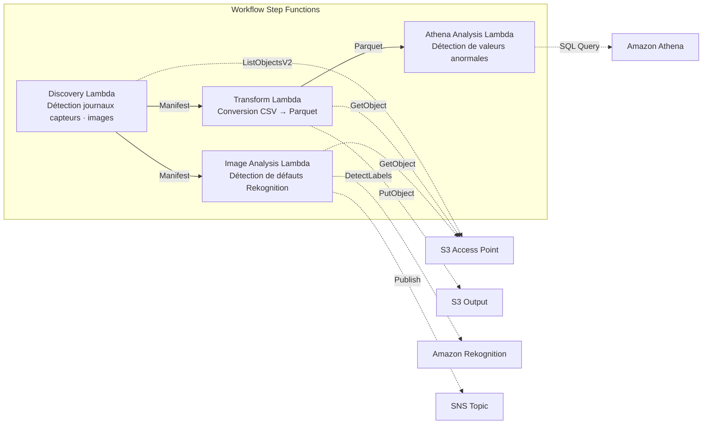

# UC3 : Industrie manufacturière — Analyse des journaux de capteurs IoT et des images d'inspection qualité

🌐 **Language / 言語**: [日本語](README.md) | [English](README.en.md) | [한국어](README.ko.md) | [简体中文](README.zh-CN.md) | [繁體中文](README.zh-TW.md) | Français | [Deutsch](README.de.md) | [Español](README.es.md)

📚 **Documentation** : [Schéma d'architecture](docs/architecture.fr.md) | [Guide de démonstration](docs/demo-guide.fr.md)

## Aperçu

Il s'agit d'un workflow serverless qui exploite les S3 Access Points d'Amazon FSx for NetApp ONTAP pour automatiser la détection d'anomalies dans les journaux de capteurs IoT et la détection de défauts dans les images d'inspection qualité.

### Cas où ce modèle est adapté

- Vous souhaitez analyser régulièrement les journaux de capteurs CSV accumulés sur le serveur de fichiers de l'usine
- Vous souhaitez automatiser et rationaliser la vérification visuelle des images d'inspection qualité avec l'IA
- Vous souhaitez ajouter de l'analyse sans modifier le flux de collecte de données existant basé sur le NAS (automate → serveur de fichiers)
- Vous souhaitez réaliser une détection d'anomalies flexible basée sur des seuils avec Athena SQL
- Vous avez besoin d'un jugement par étapes (réussite automatique / revue manuelle / échec automatique) basé sur les scores de confiance de Rekognition

### Cas où ce modèle n'est pas adapté

- Vous avez besoin d'une détection d'anomalies en temps réel à la milliseconde près (IoT Core + Kinesis recommandé)
- Vous devez traiter par lots des journaux de capteurs à l'échelle du To (EMR Serverless Spark recommandé)
- La détection de défauts d'image nécessite un modèle entraîné sur mesure (point de terminaison SageMaker recommandé)
- Les données de capteurs sont déjà stockées dans une base de données de séries temporelles (telle que Timestream)

### Fonctionnalités principales

- Détection automatique des journaux de capteurs CSV et des images d'inspection JPEG/PNG via le S3 AP
- Amélioration de l'efficacité de l'analyse grâce à la conversion CSV → Parquet
- Détection des valeurs de capteurs anormales basée sur des seuils avec Amazon Athena SQL
- Détection de défauts et définition d'un indicateur de revue manuelle avec Amazon Rekognition

## Success Metrics

### Outcome
L'analyse automatique des journaux de capteurs IoT et des images d'inspection qualité accélère la détection d'anomalies et réduit la charge de gestion de la qualité.

### Metrics
| Métrique | Valeur cible (exemple) |
|-----------|------------|
| Nombre de fichiers analysés / par exécution | > 1,000 files |
| Latence de détection d'anomalies | < 1 heure (POLLING) |
| Taux de faux positifs (False Positive) | < 5% |
| Débit de traitement | > 500 files/hour |
| Coût / analyse | < $5 |
| Taux d'objets en Human Review | < 5% (notifications d'alerte uniquement) |

### Measurement Method
CloudWatch Metrics (FilesProcessed, AnomaliesDetected), résultats de requêtes Athena, journaux de notifications SNS.

## Architecture



### Étapes du workflow

1. **Discovery** : détecter les journaux de capteurs CSV et les images d'inspection JPEG/PNG depuis le S3 AP et générer un Manifest
2. **Transform** : convertir les fichiers CSV au format Parquet et les écrire vers la sortie S3 (amélioration de l'efficacité de l'analyse)
3. **Athena Analysis** : détecter les valeurs de capteurs anormales sur la base de seuils avec Athena SQL
4. **Image Analysis** : détecter les défauts avec Rekognition ; définir un indicateur de revue manuelle si la confiance est inférieure au seuil

## Prérequis

- Un compte AWS et des autorisations IAM appropriées
- Un système de fichiers FSx for ONTAP (ONTAP 9.17.1P4D3 ou ultérieur)
- Un volume avec S3 Access Point activé
- Les informations d'identification de l'API REST ONTAP enregistrées dans Secrets Manager
- Un VPC et des sous-réseaux privés
- Une région où Amazon Rekognition est disponible

## Étapes de déploiement

### 1. Préparation des paramètres

Avant le déploiement, vérifiez les valeurs suivantes :

- FSx for ONTAP S3 Access Point Alias
- Adresse IP de gestion ONTAP
- Nom du secret Secrets Manager
- ID du VPC, ID des sous-réseaux privés
- Seuil de détection d'anomalies, seuil de confiance de détection de défauts

### 2. Déploiement SAM

```bash
# Prérequis : AWS SAM CLI est requis. sam build empaquette automatiquement le code et la couche partagée.
sam build

sam deploy \
  --stack-name fsxn-manufacturing-analytics \
  --parameter-overrides \
    S3AccessPointAlias=<your-volume-ext-s3alias> \
    S3AccessPointName=<your-s3ap-name> \
    S3AccessPointOutputAlias=<your-output-volume-ext-s3alias> \
    OntapSecretName=<your-ontap-secret-name> \
    OntapManagementIp=<your-ontap-management-ip> \
    ScheduleExpression="rate(1 hour)" \
    VpcId=<your-vpc-id> \
    PrivateSubnetIds=<subnet-1>,<subnet-2> \
    NotificationEmail=<your-email@example.com> \
    AnomalyThreshold=3.0 \
    ConfidenceThreshold=80.0 \
    EnableVpcEndpoints=false \
    EnableCloudWatchAlarms=false \
  --capabilities CAPABILITY_NAMED_IAM \
  --resolve-s3 \
  --region ap-northeast-1
```

> **Remarque** : `template.yaml` est destiné à être utilisé avec le SAM CLI (`sam build` + `sam deploy`).
> Pour déployer directement avec la commande `aws cloudformation deploy`, utilisez plutôt `template-deploy.yaml` (nécessite le pré-empaquetage des fichiers zip Lambda et leur téléversement vers S3).

> **Remarque** : remplacez les espaces réservés `<...>` par les valeurs réelles de votre environnement.

### 3. Confirmation de l'abonnement SNS

Après le déploiement, un e-mail de confirmation d'abonnement SNS est envoyé à l'adresse que vous avez indiquée.

> **Remarque** : si vous omettez `S3AccessPointName`, la politique IAM devient uniquement basée sur l'Alias, ce qui peut provoquer une erreur `AccessDenied`. Sa spécification est recommandée pour les environnements de production. Pour plus de détails, consultez le [guide de dépannage](../docs/guides/troubleshooting-guide.md#1-accessdenied-エラー).

## Liste des paramètres de configuration

| Paramètre | Description | Par défaut | Requis |
|-----------|------|----------|------|
| `S3AccessPointAlias` | FSx for ONTAP S3 AP Alias (entrée) | — | ✅ |
| `S3AccessPointName` | Nom du S3 AP (pour l'octroi d'autorisations IAM basées sur l'ARN ; basé sur l'Alias uniquement si omis) | `""` | ⚠️ Recommandé |
| `S3AccessPointOutputAlias` | FSx for ONTAP S3 AP Alias (sortie) | — | ✅ |
| `OntapSecretName` | Nom du secret Secrets Manager pour les informations d'identification ONTAP | — | ✅ |
| `OntapManagementIp` | Adresse IP de gestion du cluster ONTAP | — | ✅ |
| `ScheduleExpression` | Expression de planification d'EventBridge Scheduler | `rate(1 hour)` | |
| `VpcId` | ID du VPC | — | ✅ |
| `PrivateSubnetIds` | Liste des ID de sous-réseaux privés | — | ✅ |
| `NotificationEmail` | Adresse e-mail de destination des notifications SNS | — | ✅ |
| `AnomalyThreshold` | Seuil de détection d'anomalies (multiple de l'écart-type) | `3.0` | |
| `ConfidenceThreshold` | Seuil de confiance pour la détection de défauts Rekognition | `80.0` | |
| `EnableVpcEndpoints` | Activation des Interface VPC Endpoints | `false` | |
| `EnableCloudWatchAlarms` | Activation des CloudWatch Alarms | `false` | |
| `EnableAthenaWorkgroup` | Activation d'Athena Workgroup / Glue Data Catalog | `true` | |

## Structure des coûts

### À la demande (paiement à l'usage)

| Service | Unité de facturation | Estimation (100 fichiers/mois) |
|---------|---------|---------------------|
| Lambda | Nombre de requêtes + temps d'exécution | ~$0.01 |
| Step Functions | Nombre de transitions d'état | Dans l'offre gratuite |
| S3 API | Nombre de requêtes | ~$0.01 |
| Athena | Volume de données analysées | ~$0.01 |
| Rekognition | Nombre d'images | ~$0.10 |

### En fonctionnement permanent (optionnel)

| Service | Paramètre | Mensuel |
|---------|-----------|------|
| Interface VPC Endpoints | `EnableVpcEndpoints=true` | ~$28.80 |
| CloudWatch Alarms | `EnableCloudWatchAlarms=true` | ~$0.30 |

> Dans les environnements de démonstration/PoC, vous pouvez démarrer à partir de seulement **~$0.13/mois** avec des coûts variables uniquement.

## Nettoyage

```bash
# Suppression de la pile CloudFormation
aws cloudformation delete-stack \
  --stack-name fsxn-manufacturing-analytics \
  --region ap-northeast-1

# Attendre la fin de la suppression
aws cloudformation wait stack-delete-complete \
  --stack-name fsxn-manufacturing-analytics \
  --region ap-northeast-1
```

> **Remarque** : si des objets subsistent dans le bucket S3, la suppression de la pile peut échouer. Videz le bucket au préalable.

## Supported Regions

UC3 utilise les services suivants :

| Service | Contrainte de région |
|---------|-------------|
| Amazon Athena | Disponible dans presque toutes les régions |
| Amazon Rekognition | Disponible dans presque toutes les régions |
| AWS X-Ray | Disponible dans presque toutes les régions |
| CloudWatch EMF | Disponible dans presque toutes les régions |

> Consultez la [matrice de compatibilité des régions](../docs/region-compatibility.md) pour plus de détails.

## Liens de référence

### Documentation officielle AWS

- [Aperçu des FSx for ONTAP S3 Access Points](https://docs.aws.amazon.com/fsx/latest/ONTAPGuide/accessing-data-via-s3-access-points.html)
- [Requêtes SQL avec Athena (tutoriel officiel)](https://docs.aws.amazon.com/fsx/latest/ONTAPGuide/tutorial-query-data-with-athena.html)
- [Pipelines ETL avec Glue (tutoriel officiel)](https://docs.aws.amazon.com/fsx/latest/ONTAPGuide/tutorial-transform-data-with-glue.html)
- [Traitement serverless avec Lambda (tutoriel officiel)](https://docs.aws.amazon.com/fsx/latest/ONTAPGuide/tutorial-process-files-with-lambda.html)
- [Rekognition DetectLabels API](https://docs.aws.amazon.com/rekognition/latest/dg/API_DetectLabels.html)

### Articles de blog AWS

- [Blog d'annonce du S3 AP](https://aws.amazon.com/blogs/aws/amazon-fsx-for-netapp-ontap-now-integrates-with-amazon-s3-for-seamless-data-access/)
- [Trois modèles d'architecture serverless](https://aws.amazon.com/blogs/storage/bridge-legacy-and-modern-applications-with-amazon-s3-access-points-for-amazon-fsx/)

### Exemples GitHub

- [aws-samples/amazon-rekognition-serverless-large-scale-image-and-video-processing](https://github.com/aws-samples/amazon-rekognition-serverless-large-scale-image-and-video-processing) — Traitement Rekognition à grande échelle
- [aws-samples/serverless-patterns](https://github.com/aws-samples/serverless-patterns) — Collection de modèles serverless
- [aws-samples/aws-stepfunctions-examples](https://github.com/aws-samples/aws-stepfunctions-examples) — Exemples Step Functions

## Environnement validé

| Élément | Valeur |
|------|-----|
| Région AWS | ap-northeast-1 (Tokyo) |
| Version FSx for ONTAP | ONTAP 9.17.1P4D3 |
| Configuration FSx | SINGLE_AZ_1 |
| Python | 3.12 |
| Méthode de déploiement | CloudFormation (standard) |

## Architecture de placement VPC des Lambda

Sur la base des enseignements tirés de la validation, les fonctions Lambda sont placées à l'intérieur ou à l'extérieur du VPC.

**Lambda à l'intérieur du VPC** (uniquement les fonctions nécessitant un accès à l'API REST ONTAP) :
- Discovery Lambda — S3 AP + ONTAP API

**Lambda à l'extérieur du VPC** (utilisant uniquement les API des services managés AWS) :
- Toutes les autres fonctions Lambda

> **Raison** : pour accéder aux API des services managés AWS (Athena, Bedrock, Textract, etc.) depuis une Lambda à l'intérieur du VPC, un Interface VPC Endpoint est requis (7,20 $/mois chacun). Les fonctions Lambda à l'extérieur du VPC peuvent accéder directement aux API AWS via Internet et fonctionnent sans coût supplémentaire.

> **Remarque** : pour les UC qui utilisent l'API REST ONTAP (UC1 Juridique et conformité), `EnableVpcEndpoints=true` est obligatoire, car les informations d'identification ONTAP sont récupérées via le Secrets Manager VPC Endpoint.

---

## Liens vers la documentation AWS

| Service | Documentation |
|---------|------------|
| FSx for ONTAP | [FSx for ONTAP](https://docs.aws.amazon.com/fsx/latest/ONTAPGuide/what-is-fsx-ontap.html) |
| S3 Access Points | [S3 Access Points](https://docs.aws.amazon.com/fsx/latest/ONTAPGuide/s3-access-points.html) |
| Step Functions | [Step Functions](https://docs.aws.amazon.com/step-functions/latest/dg/welcome.html) |
| AWS Glue | [AWS Glue](https://docs.aws.amazon.com/glue/latest/dg/what-is-glue.html) |
| Amazon Athena | [Amazon Athena](https://docs.aws.amazon.com/athena/latest/ug/what-is.html) |
| Amazon Rekognition | [Amazon Rekognition](https://docs.aws.amazon.com/rekognition/latest/dg/what-is.html) |

### Alignement sur le Well-Architected Framework

| Pilier | Mise en œuvre |
|----|------|
| Excellence opérationnelle | Traçage X-Ray, métriques EMF, surveillance des jobs Glue |
| Sécurité | IAM à moindre privilège, chiffrement KMS, isolation VPC |
| Fiabilité | Step Functions Retry/Catch, nouvelles tentatives des jobs Glue |
| Efficacité des performances | Traitement parallèle Glue ETL, partitions Athena |
| Optimisation des coûts | Serverless, mise à l'échelle automatique des DPU Glue |
| Durabilité | Exécution à la demande, gestion du cycle de vie des données |

---

## Tests locaux

### Vérification des prérequis

```bash
# Vérification des prérequis
aws --version          # AWS CLI v2
sam --version          # SAM CLI
python3 --version      # Python 3.9+
docker --version       # Docker (pour sam local)
aws sts get-caller-identity  # Informations d'identification AWS
```

### sam local invoke

```bash
# Build
# Prérequis : AWS SAM CLI est requis. sam build empaquette automatiquement le code et la couche partagée.
sam build

# Exécution locale du Discovery Lambda
sam local invoke DiscoveryFunction --event events/discovery-event.json

# Avec substitution de variables d'environnement
sam local invoke DiscoveryFunction \
  --event events/discovery-event.json \
  --env-vars env.json
```

### Tests unitaires

```bash
python3 -m pytest tests/ -v
```

Pour plus de détails, consultez le [guide de démarrage rapide des tests locaux](../docs/local-testing-quick-start.md).

---

## Exemple de sortie (Output Sample)

Exemple de sortie de l'ETL de données de capteurs + analyse d'images :

```json
{
  "discovery": {
    "status": "completed",
    "object_count": 150,
    "categories": {"csv_sensor": 120, "image_inspection": 30}
  },
  "etl_results": {
    "records_processed": 45000,
    "anomalies_detected": 7,
    "output_table": "manufacturing_metrics"
  },
  "image_analysis": [
    {
      "key": "inspection/line-A/frame-001.jpg",
      "defect_detected": true,
      "defect_type": "scratch",
      "confidence": 0.92,
      "bounding_box": {"x": 120, "y": 80, "w": 45, "h": 30}
    }
  ],
  "athena_summary": {
    "oee_score": 0.87,
    "defect_rate_pct": 2.3,
    "query_execution_id": "qe-abc123..."
  }
}
```

> **Note** : ce qui précède est un exemple de sortie ; les valeurs réelles varient selon l'environnement et les données d'entrée. Les chiffres de référence sont des références de dimensionnement (sizing reference), pas des limites de service (service limit).

---

## Governance Note

> Ce modèle fournit des recommandations d'architecture technique. Il ne constitue pas un conseil juridique, de conformité ou réglementaire. Les organisations doivent consulter des professionnels qualifiés.

---

## S3AP Compatibility

Pour les contraintes de compatibilité, le dépannage et les modèles de déclenchement des S3 Access Points for FSx for ONTAP, consultez les [S3AP Compatibility Notes](../docs/s3ap-compatibility-notes.md).
