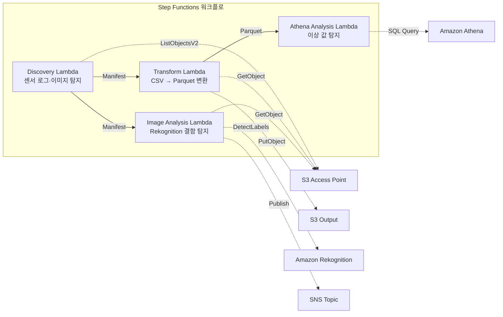

# UC3: 제조업 — IoT 센서 로그·품질 검사 이미지 분석

🌐 **Language / 言語**: [日本語](README.md) | [English](README.en.md) | 한국어 | [简体中文](README.zh-CN.md) | [繁體中文](README.zh-TW.md) | [Français](README.fr.md) | [Deutsch](README.de.md) | [Español](README.es.md)

📚 **문서**: [아키텍처 다이어그램](docs/architecture.ko.md) | [데모 가이드](docs/demo-guide.ko.md)

## 개요

Amazon FSx for NetApp ONTAP의 S3 Access Points를 활용하여 IoT 센서 로그의 이상 탐지와 품질 검사 이미지의 결함 탐지를 자동화하는 서버리스 워크플로입니다.

### 이 패턴이 적합한 경우

- 공장 파일 서버에 축적되는 CSV 센서 로그를 정기적으로 분석하고 싶은 경우
- 품질 검사 이미지의 육안 확인을 AI로 자동화·효율화하고 싶은 경우
- 기존 NAS 기반 데이터 수집 흐름(PLC → 파일 서버)을 변경하지 않고 분석을 추가하고 싶은 경우
- Athena SQL을 통한 유연한 임계값 기반 이상 탐지를 실현하고 싶은 경우
- Rekognition 신뢰도 점수에 기반한 단계적 판정(자동 합격 / 수동 검토 / 자동 불합격)이 필요한 경우

### 이 패턴이 적합하지 않은 경우

- 밀리초 단위의 실시간 이상 탐지가 필요한 경우(IoT Core + Kinesis 권장)
- TB 규모의 센서 로그를 일괄 처리하는 경우(EMR Serverless Spark 권장)
- 이미지 결함 탐지에 자체 학습된 모델이 필요한 경우(SageMaker 엔드포인트 권장)
- 센서 데이터가 이미 시계열 DB(Timestream 등)에 저장되어 있는 경우

### 주요 기능

- S3 AP를 통한 CSV 센서 로그와 JPEG/PNG 검사 이미지 자동 탐지
- CSV → Parquet 변환을 통한 분석 효율화
- Amazon Athena SQL을 통한 임계값 기반 이상 센서 값 탐지
- Amazon Rekognition을 통한 결함 탐지 및 수동 검토 플래그 설정

## Success Metrics

### Outcome
IoT 센서 로그·품질 검사 이미지의 자동 분석을 통해 이상 탐지를 신속화하고 품질 관리 공수를 절감합니다.

### Metrics
| 메트릭 | 목표값(예시) |
|-----------|------------|
| 분석 대상 파일 수 / 실행당 | > 1,000 files |
| 이상 탐지 지연 시간 | < 1시간(POLLING) |
| 오탐률(False Positive) | < 5% |
| 처리 처리량 | > 500 files/hour |
| 스캔당 비용 | < $5 |
| Human Review 대상 비율 | < 5%(알림 통지만) |

### Measurement Method
CloudWatch Metrics(FilesProcessed, AnomaliesDetected), Athena 쿼리 결과, SNS 통지 로그.

## 아키텍처



### 워크플로 단계

1. **Discovery**: S3 AP에서 CSV 센서 로그와 JPEG/PNG 검사 이미지를 탐지하고 Manifest를 생성
2. **Transform**: CSV 파일을 Parquet 형식으로 변환하여 S3에 출력(분석 효율화)
3. **Athena Analysis**: Athena SQL로 이상 센서 값을 임계값 기반으로 탐지
4. **Image Analysis**: Rekognition으로 결함을 탐지하고, 신뢰도가 임계값 미만인 경우 수동 검토 플래그를 설정

## 전제 조건

- AWS 계정과 적절한 IAM 권한
- FSx for ONTAP 파일 시스템(ONTAP 9.17.1P4D3 이상)
- S3 Access Point가 활성화된 볼륨
- ONTAP REST API 자격 증명이 Secrets Manager에 등록됨
- VPC, 프라이빗 서브넷
- Amazon Rekognition을 사용할 수 있는 리전

## 배포 절차

### 1. 파라미터 준비

배포 전에 다음 값을 확인하십시오:

- FSx for ONTAP S3 Access Point Alias
- ONTAP 관리 IP 주소
- Secrets Manager 시크릿 이름
- VPC ID, 프라이빗 서브넷 ID
- 이상 탐지 임계값, 결함 탐지 신뢰도 임계값

### 2. SAM 배포

```bash
# 전제: AWS SAM CLI가 필요합니다. sam build가 코드와 공유 레이어를 자동으로 패키징합니다.
sam build

sam deploy \
  --stack-name fsxn-manufacturing-analytics \
  --parameter-overrides \
    S3AccessPointAlias=<your-volume-ext-s3alias> \
    S3AccessPointName=<your-s3ap-name> \
    S3AccessPointOutputAlias=<your-output-volume-ext-s3alias> \
    OntapSecretName=<your-ontap-secret-name> \
    OntapManagementIp=<your-ontap-management-ip> \
    ScheduleExpression="rate(1 hour)" \
    VpcId=<your-vpc-id> \
    PrivateSubnetIds=<subnet-1>,<subnet-2> \
    NotificationEmail=<your-email@example.com> \
    AnomalyThreshold=3.0 \
    ConfidenceThreshold=80.0 \
    EnableVpcEndpoints=false \
    EnableCloudWatchAlarms=false \
  --capabilities CAPABILITY_NAMED_IAM \
  --resolve-s3 \
  --region ap-northeast-1
```

> **참고**: `template.yaml`은 SAM CLI(`sam build` + `sam deploy`)에서 사용합니다.
> `aws cloudformation deploy` 명령으로 직접 배포하는 경우에는 `template-deploy.yaml`을 사용하십시오(Lambda zip 파일의 사전 패키징과 S3 업로드가 필요합니다).

> **참고**: `<...>` 플레이스홀더를 실제 환경 값으로 교체하십시오.

### 3. SNS 구독 확인

배포 후 지정한 이메일 주소로 SNS 구독 확인 메일이 도착합니다.

> **참고**: `S3AccessPointName`을 생략하면 IAM 정책이 Alias 기반 전용이 되어 `AccessDenied` 오류가 발생할 수 있습니다. 프로덕션 환경에서는 지정을 권장합니다. 자세한 내용은 [문제 해결 가이드](../docs/guides/troubleshooting-guide.md#1-accessdenied-エラー)를 참조하십시오.

## 설정 파라미터 목록

| 파라미터 | 설명 | 기본값 | 필수 |
|-----------|------|----------|------|
| `S3AccessPointAlias` | FSx for ONTAP S3 AP Alias(입력용) | — | ✅ |
| `S3AccessPointName` | S3 AP 이름(ARN 기반 IAM 권한 부여용. 생략 시 Alias 기반 전용) | `""` | ⚠️ 권장 |
| `S3AccessPointOutputAlias` | FSx for ONTAP S3 AP Alias(출력용) | — | ✅ |
| `OntapSecretName` | ONTAP 자격 증명의 Secrets Manager 시크릿 이름 | — | ✅ |
| `OntapManagementIp` | ONTAP 클러스터 관리 IP 주소 | — | ✅ |
| `ScheduleExpression` | EventBridge Scheduler의 스케줄 식 | `rate(1 hour)` | |
| `VpcId` | VPC ID | — | ✅ |
| `PrivateSubnetIds` | 프라이빗 서브넷 ID 목록 | — | ✅ |
| `NotificationEmail` | SNS 통지 대상 이메일 주소 | — | ✅ |
| `AnomalyThreshold` | 이상 탐지 임계값(표준편차의 배수) | `3.0` | |
| `ConfidenceThreshold` | Rekognition 결함 탐지의 신뢰도 임계값 | `80.0` | |
| `EnableVpcEndpoints` | Interface VPC Endpoints 활성화 | `false` | |
| `EnableCloudWatchAlarms` | CloudWatch Alarms 활성화 | `false` | |
| `EnableAthenaWorkgroup` | Athena Workgroup / Glue Data Catalog 활성화 | `true` | |

## 비용 구조

### 요청 기반(종량 과금)

| 서비스 | 과금 단위 | 개산(100 파일/월) |
|---------|---------|---------------------|
| Lambda | 요청 수 + 실행 시간 | ~$0.01 |
| Step Functions | 상태 전환 수 | 무료 한도 내 |
| S3 API | 요청 수 | ~$0.01 |
| Athena | 스캔 데이터량 | ~$0.01 |
| Rekognition | 이미지 수 | ~$0.10 |

### 상시 가동(선택 사항)

| 서비스 | 파라미터 | 월액 |
|---------|-----------|------|
| Interface VPC Endpoints | `EnableVpcEndpoints=true` | ~$28.80 |
| CloudWatch Alarms | `EnableCloudWatchAlarms=true` | ~$0.30 |

> 데모/PoC 환경에서는 변동비만으로 **~$0.13/월**부터 이용할 수 있습니다.

## 정리(클린업)

```bash
# CloudFormation 스택 삭제
aws cloudformation delete-stack \
  --stack-name fsxn-manufacturing-analytics \
  --region ap-northeast-1

# 삭제 완료 대기
aws cloudformation wait stack-delete-complete \
  --stack-name fsxn-manufacturing-analytics \
  --region ap-northeast-1
```

> **참고**: S3 버킷에 오브젝트가 남아 있는 경우 스택 삭제가 실패할 수 있습니다. 사전에 버킷을 비우십시오.

## Supported Regions

UC3은 다음 서비스를 사용합니다:

| 서비스 | 리전 제약 |
|---------|-------------|
| Amazon Athena | 거의 모든 리전에서 이용 가능 |
| Amazon Rekognition | 거의 모든 리전에서 이용 가능 |
| AWS X-Ray | 거의 모든 리전에서 이용 가능 |
| CloudWatch EMF | 거의 모든 리전에서 이용 가능 |

> 자세한 내용은 [리전 호환성 매트릭스](../docs/region-compatibility.md)를 참조하십시오.

## 참고 링크

### AWS 공식 문서

- [FSx for ONTAP S3 Access Points 개요](https://docs.aws.amazon.com/fsx/latest/ONTAPGuide/accessing-data-via-s3-access-points.html)
- [Athena로 SQL 쿼리(공식 튜토리얼)](https://docs.aws.amazon.com/fsx/latest/ONTAPGuide/tutorial-query-data-with-athena.html)
- [Glue로 ETL 파이프라인(공식 튜토리얼)](https://docs.aws.amazon.com/fsx/latest/ONTAPGuide/tutorial-transform-data-with-glue.html)
- [Lambda로 서버리스 처리(공식 튜토리얼)](https://docs.aws.amazon.com/fsx/latest/ONTAPGuide/tutorial-process-files-with-lambda.html)
- [Rekognition DetectLabels API](https://docs.aws.amazon.com/rekognition/latest/dg/API_DetectLabels.html)

### AWS 블로그 기사

- [S3 AP 발표 블로그](https://aws.amazon.com/blogs/aws/amazon-fsx-for-netapp-ontap-now-integrates-with-amazon-s3-for-seamless-data-access/)
- [3가지 서버리스 아키텍처 패턴](https://aws.amazon.com/blogs/storage/bridge-legacy-and-modern-applications-with-amazon-s3-access-points-for-amazon-fsx/)

### GitHub 샘플

- [aws-samples/amazon-rekognition-serverless-large-scale-image-and-video-processing](https://github.com/aws-samples/amazon-rekognition-serverless-large-scale-image-and-video-processing) — Rekognition 대규모 처리
- [aws-samples/serverless-patterns](https://github.com/aws-samples/serverless-patterns) — 서버리스 패턴 모음
- [aws-samples/aws-stepfunctions-examples](https://github.com/aws-samples/aws-stepfunctions-examples) — Step Functions 샘플

## 검증된 환경

| 항목 | 값 |
|------|-----|
| AWS 리전 | ap-northeast-1 (도쿄) |
| FSx for ONTAP 버전 | ONTAP 9.17.1P4D3 |
| FSx 구성 | SINGLE_AZ_1 |
| Python | 3.12 |
| 배포 방식 | CloudFormation (표준) |

## Lambda VPC 배치 아키텍처

검증에서 얻은 지견에 기반하여 Lambda 함수는 VPC 내부/외부로 분리 배치됩니다.

**VPC 내부 Lambda**(ONTAP REST API 접근이 필요한 함수만):
- Discovery Lambda — S3 AP + ONTAP API

**VPC 외부 Lambda**(AWS 관리형 서비스 API만 사용):
- 그 외 모든 Lambda 함수

> **이유**: VPC 내부 Lambda에서 AWS 관리형 서비스 API(Athena, Bedrock, Textract 등)에 접근하려면 Interface VPC Endpoint가 필요합니다(각 $7.20/월). VPC 외부 Lambda는 인터넷을 통해 직접 AWS API에 접근할 수 있으며 추가 비용 없이 동작합니다.

> **참고**: ONTAP REST API를 사용하는 UC(UC1 법무·컴플라이언스)에서는 `EnableVpcEndpoints=true`가 필수입니다. Secrets Manager VPC Endpoint를 통해 ONTAP 자격 증명을 가져오기 때문입니다.

---

## AWS 문서 링크

| 서비스 | 문서 |
|---------|------------|
| FSx for ONTAP | [FSx for ONTAP](https://docs.aws.amazon.com/fsx/latest/ONTAPGuide/what-is-fsx-ontap.html) |
| S3 Access Points | [S3 Access Points](https://docs.aws.amazon.com/fsx/latest/ONTAPGuide/s3-access-points.html) |
| Step Functions | [Step Functions](https://docs.aws.amazon.com/step-functions/latest/dg/welcome.html) |
| AWS Glue | [AWS Glue](https://docs.aws.amazon.com/glue/latest/dg/what-is-glue.html) |
| Amazon Athena | [Amazon Athena](https://docs.aws.amazon.com/athena/latest/ug/what-is.html) |
| Amazon Rekognition | [Amazon Rekognition](https://docs.aws.amazon.com/rekognition/latest/dg/what-is.html) |

### Well-Architected Framework 대응

| 기둥 | 대응 |
|----|------|
| 운영 우수성 | X-Ray 트레이싱, EMF 메트릭, Glue 작업 모니터링 |
| 보안 | 최소 권한 IAM, KMS 암호화, VPC 분리 |
| 신뢰성 | Step Functions Retry/Catch, Glue 작업 재시도 |
| 성능 효율성 | Glue ETL 병렬 처리, Athena 파티션 |
| 비용 최적화 | 서버리스, Glue DPU 자동 스케일링 |
| 지속 가능성 | 온디맨드 실행, 데이터 라이프사이클 관리 |

---

## 로컬 테스트

### Prerequisites 확인

```bash
# 전제 조건 확인
aws --version          # AWS CLI v2
sam --version          # SAM CLI
python3 --version      # Python 3.9+
docker --version       # Docker (sam local용)
aws sts get-caller-identity  # AWS 자격 증명
```

### sam local invoke

```bash
# 빌드
# 전제: AWS SAM CLI가 필요합니다. sam build가 코드와 공유 레이어를 자동으로 패키징합니다.
sam build

# Discovery Lambda 로컬 실행
sam local invoke DiscoveryFunction --event events/discovery-event.json

# 환경 변수 오버라이드 포함
sam local invoke DiscoveryFunction \
  --event events/discovery-event.json \
  --env-vars env.json
```

### 유닛 테스트

```bash
python3 -m pytest tests/ -v
```

자세한 내용은 [로컬 테스트 퀵 스타트](../docs/local-testing-quick-start.md)를 참조하십시오.

---

## 출력 샘플 (Output Sample)

센서 데이터 ETL + 이미지 분석의 출력 예시:

```json
{
  "discovery": {
    "status": "completed",
    "object_count": 150,
    "categories": {"csv_sensor": 120, "image_inspection": 30}
  },
  "etl_results": {
    "records_processed": 45000,
    "anomalies_detected": 7,
    "output_table": "manufacturing_metrics"
  },
  "image_analysis": [
    {
      "key": "inspection/line-A/frame-001.jpg",
      "defect_detected": true,
      "defect_type": "scratch",
      "confidence": 0.92,
      "bounding_box": {"x": 120, "y": 80, "w": 45, "h": 30}
    }
  ],
  "athena_summary": {
    "oee_score": 0.87,
    "defect_rate_pct": 2.3,
    "query_execution_id": "qe-abc123..."
  }
}
```

> **비고**: 위는 샘플 출력이며 실제 값은 환경·입력 데이터에 따라 다릅니다. 벤치마크 수치는 sizing reference이며 service limit이 아닙니다.

---

## Governance Note

> 본 패턴은 기술 아키텍처 가이던스를 제공합니다. 법적·컴플라이언스·규제상의 조언이 아닙니다. 조직은 자격을 갖춘 전문가와 상담해야 합니다.

---

## S3AP Compatibility

S3 Access Points for FSx for ONTAP의 호환성 제약, 문제 해결, 트리거 패턴에 대해서는 [S3AP Compatibility Notes](../docs/s3ap-compatibility-notes.md)를 참조하십시오.
