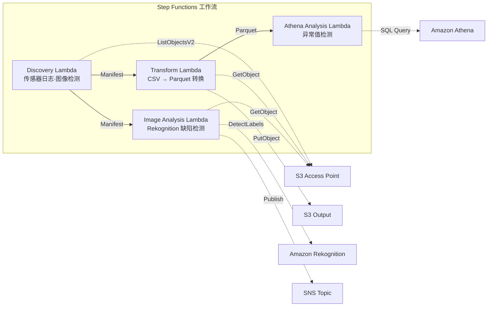

# UC3：制造业 — IoT 传感器日志·质量检查图像的分析

🌐 **Language / 言語**: [日本語](README.md) | [English](README.en.md) | [한국어](README.ko.md) | 简体中文 | [繁體中文](README.zh-TW.md) | [Français](README.fr.md) | [Deutsch](README.de.md) | [Español](README.es.md)

📚 **文档**: [架构图](docs/architecture.zh-CN.md) | [演示指南](docs/demo-guide.zh-CN.md)

## 概述

这是一个利用 Amazon FSx for NetApp ONTAP 的 S3 Access Points，实现 IoT 传感器日志异常检测和质量检查图像缺陷检测自动化的无服务器工作流。

### 适合此模式的场景

- 希望定期分析工厂文件服务器中积累的 CSV 传感器日志
- 希望用 AI 自动化并提高质量检查图像目视确认的效率
- 希望在不改变现有基于 NAS 的数据采集流程（PLC → 文件服务器）的情况下追加分析
- 希望通过 Athena SQL 实现灵活的基于阈值的异常检测
- 需要基于 Rekognition 置信度分数的分级判定（自动合格 / 人工复核 / 自动不合格）

### 不适合此模式的场景

- 需要毫秒级的实时异常检测（推荐 IoT Core + Kinesis）
- 需要批量处理 TB 规模的传感器日志（推荐 EMR Serverless Spark）
- 图像缺陷检测需要自定义训练模型（推荐 SageMaker 端点）
- 传感器数据已存储在时序数据库（如 Timestream）中

### 主要功能

- 通过 S3 AP 自动检测 CSV 传感器日志和 JPEG/PNG 检查图像
- 通过 CSV → Parquet 转换提高分析效率
- 通过 Amazon Athena SQL 进行基于阈值的异常传感器值检测
- 通过 Amazon Rekognition 进行缺陷检测和人工复核标志设置

## Success Metrics

### Outcome
通过对 IoT 传感器日志·质量检查图像的自动分析，加快异常检测速度并降低质量管理工时。

### Metrics
| 指标 | 目标值（示例） |
|-----------|------------|
| 每次执行的分析对象文件数 | > 1,000 files |
| 异常检测延迟 | < 1 小时（POLLING） |
| 误报率（False Positive） | < 5% |
| 处理吞吐量 | > 500 files/hour |
| 每次扫描的成本 | < $5 |
| Human Review 对象比例 | < 5%（仅告警通知） |

### Measurement Method
CloudWatch Metrics（FilesProcessed, AnomaliesDetected）、Athena 查询结果、SNS 通知日志。

## 架构



### 工作流步骤

1. **Discovery**：从 S3 AP 检测 CSV 传感器日志和 JPEG/PNG 检查图像，并生成 Manifest
2. **Transform**：将 CSV 文件转换为 Parquet 格式并输出到 S3（提高分析效率）
3. **Athena Analysis**：用 Athena SQL 基于阈值检测异常传感器值
4. **Image Analysis**：用 Rekognition 检测缺陷，当置信度低于阈值时设置人工复核标志

## 前提条件

- AWS 账户和适当的 IAM 权限
- FSx for ONTAP 文件系统（ONTAP 9.17.1P4D3 及以上）
- 已启用 S3 Access Point 的卷
- ONTAP REST API 凭证已注册到 Secrets Manager
- VPC、私有子网
- 可使用 Amazon Rekognition 的区域

## 部署步骤

### 1. 参数准备

部署前请确认以下值：

- FSx for ONTAP S3 Access Point Alias
- ONTAP 管理 IP 地址
- Secrets Manager 密钥名称
- VPC ID、私有子网 ID
- 异常检测阈值、缺陷检测置信度阈值

### 2. SAM 部署

```bash
# 前提：需要 AWS SAM CLI。sam build 会自动打包代码和共享层。
sam build

sam deploy \
  --stack-name fsxn-manufacturing-analytics \
  --parameter-overrides \
    S3AccessPointAlias=<your-volume-ext-s3alias> \
    S3AccessPointName=<your-s3ap-name> \
    S3AccessPointOutputAlias=<your-output-volume-ext-s3alias> \
    OntapSecretName=<your-ontap-secret-name> \
    OntapManagementIp=<your-ontap-management-ip> \
    ScheduleExpression="rate(1 hour)" \
    VpcId=<your-vpc-id> \
    PrivateSubnetIds=<subnet-1>,<subnet-2> \
    NotificationEmail=<your-email@example.com> \
    AnomalyThreshold=3.0 \
    ConfidenceThreshold=80.0 \
    EnableVpcEndpoints=false \
    EnableCloudWatchAlarms=false \
  --capabilities CAPABILITY_NAMED_IAM \
  --resolve-s3 \
  --region ap-northeast-1
```

> **注意**：`template.yaml` 用于 SAM CLI（`sam build` + `sam deploy`）。
> 如需使用 `aws cloudformation deploy` 命令直接部署，请改用 `template-deploy.yaml`（需要预先打包 Lambda zip 文件并上传到 S3）。

> **注意**：请将 `<...>` 占位符替换为实际的环境值。

### 3. 确认 SNS 订阅

部署后，指定的邮箱地址会收到 SNS 订阅确认邮件。

> **注意**：如果省略 `S3AccessPointName`，IAM 策略将仅基于 Alias，可能会发生 `AccessDenied` 错误。在生产环境中建议指定。详情请参阅[故障排查指南](../docs/guides/troubleshooting-guide.md#1-accessdenied-エラー)。

## 配置参数一览

| 参数 | 说明 | 默认值 | 必需 |
|-----------|------|----------|------|
| `S3AccessPointAlias` | FSx for ONTAP S3 AP Alias（输入用） | — | ✅ |
| `S3AccessPointName` | S3 AP 名称（用于基于 ARN 的 IAM 权限授予。省略时仅基于 Alias） | `""` | ⚠️ 推荐 |
| `S3AccessPointOutputAlias` | FSx for ONTAP S3 AP Alias（输出用） | — | ✅ |
| `OntapSecretName` | ONTAP 凭证的 Secrets Manager 密钥名称 | — | ✅ |
| `OntapManagementIp` | ONTAP 集群管理 IP 地址 | — | ✅ |
| `ScheduleExpression` | EventBridge Scheduler 的调度表达式 | `rate(1 hour)` | |
| `VpcId` | VPC ID | — | ✅ |
| `PrivateSubnetIds` | 私有子网 ID 列表 | — | ✅ |
| `NotificationEmail` | SNS 通知目标邮箱地址 | — | ✅ |
| `AnomalyThreshold` | 异常检测阈值（标准差的倍数） | `3.0` | |
| `ConfidenceThreshold` | Rekognition 缺陷检测的置信度阈值 | `80.0` | |
| `EnableVpcEndpoints` | 启用 Interface VPC Endpoints | `false` | |
| `EnableCloudWatchAlarms` | 启用 CloudWatch Alarms | `false` | |
| `EnableAthenaWorkgroup` | 启用 Athena Workgroup / Glue Data Catalog | `true` | |

## 成本结构

### 基于请求（按量计费）

| 服务 | 计费单位 | 概算（100 文件/月） |
|---------|---------|---------------------|
| Lambda | 请求数 + 执行时间 | ~$0.01 |
| Step Functions | 状态转换数 | 免费额度内 |
| S3 API | 请求数 | ~$0.01 |
| Athena | 扫描数据量 | ~$0.01 |
| Rekognition | 图像数 | ~$0.10 |

### 常驻运行（可选）

| 服务 | 参数 | 月费 |
|---------|-----------|------|
| Interface VPC Endpoints | `EnableVpcEndpoints=true` | ~$28.80 |
| CloudWatch Alarms | `EnableCloudWatchAlarms=true` | ~$0.30 |

> 在演示/PoC 环境中，仅需变动成本即可从 **~$0.13/月** 起使用。

## 清理

```bash
# 删除 CloudFormation 堆栈
aws cloudformation delete-stack \
  --stack-name fsxn-manufacturing-analytics \
  --region ap-northeast-1

# 等待删除完成
aws cloudformation wait stack-delete-complete \
  --stack-name fsxn-manufacturing-analytics \
  --region ap-northeast-1
```

> **注意**：如果 S3 存储桶中仍有对象，堆栈删除可能会失败。请事先清空存储桶。

## Supported Regions

UC3 使用以下服务：

| 服务 | 区域约束 |
|---------|-------------|
| Amazon Athena | 几乎所有区域均可使用 |
| Amazon Rekognition | 几乎所有区域均可使用 |
| AWS X-Ray | 几乎所有区域均可使用 |
| CloudWatch EMF | 几乎所有区域均可使用 |

> 详情请参阅[区域兼容性矩阵](../docs/region-compatibility.md)。

## 参考链接

### AWS 官方文档

- [FSx for ONTAP S3 Access Points 概述](https://docs.aws.amazon.com/fsx/latest/ONTAPGuide/accessing-data-via-s3-access-points.html)
- [使用 Athena 进行 SQL 查询（官方教程）](https://docs.aws.amazon.com/fsx/latest/ONTAPGuide/tutorial-query-data-with-athena.html)
- [使用 Glue 构建 ETL 管道（官方教程）](https://docs.aws.amazon.com/fsx/latest/ONTAPGuide/tutorial-transform-data-with-glue.html)
- [使用 Lambda 进行无服务器处理（官方教程）](https://docs.aws.amazon.com/fsx/latest/ONTAPGuide/tutorial-process-files-with-lambda.html)
- [Rekognition DetectLabels API](https://docs.aws.amazon.com/rekognition/latest/dg/API_DetectLabels.html)

### AWS 博客文章

- [S3 AP 发布博客](https://aws.amazon.com/blogs/aws/amazon-fsx-for-netapp-ontap-now-integrates-with-amazon-s3-for-seamless-data-access/)
- [三种无服务器架构模式](https://aws.amazon.com/blogs/storage/bridge-legacy-and-modern-applications-with-amazon-s3-access-points-for-amazon-fsx/)

### GitHub 示例

- [aws-samples/amazon-rekognition-serverless-large-scale-image-and-video-processing](https://github.com/aws-samples/amazon-rekognition-serverless-large-scale-image-and-video-processing) — Rekognition 大规模处理
- [aws-samples/serverless-patterns](https://github.com/aws-samples/serverless-patterns) — 无服务器模式合集
- [aws-samples/aws-stepfunctions-examples](https://github.com/aws-samples/aws-stepfunctions-examples) — Step Functions 示例

## 已验证环境

| 项目 | 值 |
|------|-----|
| AWS 区域 | ap-northeast-1 (东京) |
| FSx for ONTAP 版本 | ONTAP 9.17.1P4D3 |
| FSx 配置 | SINGLE_AZ_1 |
| Python | 3.12 |
| 部署方式 | CloudFormation (标准) |

## Lambda VPC 部署架构

基于验证获得的经验，Lambda 函数被分离部署在 VPC 内/外。

**VPC 内 Lambda**（仅限需要 ONTAP REST API 访问的函数）：
- Discovery Lambda — S3 AP + ONTAP API

**VPC 外 Lambda**（仅使用 AWS 托管服务 API）：
- 其他所有 Lambda 函数

> **理由**：要从 VPC 内 Lambda 访问 AWS 托管服务 API（Athena、Bedrock、Textract 等）需要 Interface VPC Endpoint（每个 $7.20/月）。VPC 外 Lambda 可通过互联网直接访问 AWS API，无需额外成本即可运行。

> **注意**：对于使用 ONTAP REST API 的 UC（UC1 法务·合规），`EnableVpcEndpoints=true` 为必需项。因为需要通过 Secrets Manager VPC Endpoint 获取 ONTAP 凭证。

---

## AWS 文档链接

| 服务 | 文档 |
|---------|------------|
| FSx for ONTAP | [FSx for ONTAP](https://docs.aws.amazon.com/fsx/latest/ONTAPGuide/what-is-fsx-ontap.html) |
| S3 Access Points | [S3 Access Points](https://docs.aws.amazon.com/fsx/latest/ONTAPGuide/s3-access-points.html) |
| Step Functions | [Step Functions](https://docs.aws.amazon.com/step-functions/latest/dg/welcome.html) |
| AWS Glue | [AWS Glue](https://docs.aws.amazon.com/glue/latest/dg/what-is-glue.html) |
| Amazon Athena | [Amazon Athena](https://docs.aws.amazon.com/athena/latest/ug/what-is.html) |
| Amazon Rekognition | [Amazon Rekognition](https://docs.aws.amazon.com/rekognition/latest/dg/what-is.html) |

### Well-Architected Framework 对应

| 支柱 | 对应 |
|----|------|
| 卓越运营 | X-Ray 追踪、EMF 指标、Glue 作业监控 |
| 安全性 | 最小权限 IAM、KMS 加密、VPC 隔离 |
| 可靠性 | Step Functions Retry/Catch、Glue 作业重试 |
| 性能效率 | Glue ETL 并行处理、Athena 分区 |
| 成本优化 | 无服务器、Glue DPU 自动扩缩 |
| 可持续性 | 按需执行、数据生命周期管理 |

---

## 本地测试

### Prerequisites 检查

```bash
# 确认前提条件
aws --version          # AWS CLI v2
sam --version          # SAM CLI
python3 --version      # Python 3.9+
docker --version       # Docker (sam local 用)
aws sts get-caller-identity  # AWS 凭证
```

### sam local invoke

```bash
# 构建
# 前提：需要 AWS SAM CLI。sam build 会自动打包代码和共享层。
sam build

# 本地运行 Discovery Lambda
sam local invoke DiscoveryFunction --event events/discovery-event.json

# 带环境变量覆盖
sam local invoke DiscoveryFunction \
  --event events/discovery-event.json \
  --env-vars env.json
```

### 单元测试

```bash
python3 -m pytest tests/ -v
```

详情请参阅[本地测试快速入门](../docs/local-testing-quick-start.md)。

---

## 输出示例 (Output Sample)

传感器数据 ETL + 图像分析的输出示例：

```json
{
  "discovery": {
    "status": "completed",
    "object_count": 150,
    "categories": {"csv_sensor": 120, "image_inspection": 30}
  },
  "etl_results": {
    "records_processed": 45000,
    "anomalies_detected": 7,
    "output_table": "manufacturing_metrics"
  },
  "image_analysis": [
    {
      "key": "inspection/line-A/frame-001.jpg",
      "defect_detected": true,
      "defect_type": "scratch",
      "confidence": 0.92,
      "bounding_box": {"x": 120, "y": 80, "w": 45, "h": 30}
    }
  ],
  "athena_summary": {
    "oee_score": 0.87,
    "defect_rate_pct": 2.3,
    "query_execution_id": "qe-abc123..."
  }
}
```

> **备注**：以上为示例输出，实际值因环境·输入数据而异。基准数值为 sizing reference，并非 service limit。

---

## Governance Note

> 本模式提供技术架构指导，并非法律·合规·监管方面的建议。组织应咨询具备资质的专业人员。

---

## S3AP Compatibility

关于 S3 Access Points for FSx for ONTAP 的兼容性约束、故障排查和触发模式，请参阅 [S3AP Compatibility Notes](../docs/s3ap-compatibility-notes.md)。
