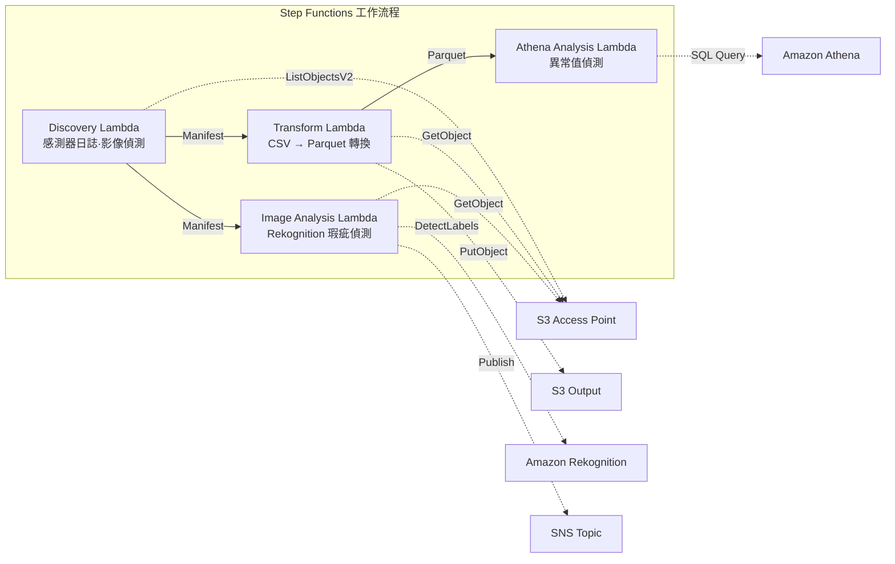

# UC3：製造業 — IoT 感測器日誌·品質檢查影像的分析

🌐 **Language / 言語**: [日本語](README.md) | [English](README.en.md) | [한국어](README.ko.md) | [简体中文](README.zh-CN.md) | 繁體中文 | [Français](README.fr.md) | [Deutsch](README.de.md) | [Español](README.es.md)

📚 **文件**: [架構圖](docs/architecture.zh-TW.md) | [示範指南](docs/demo-guide.zh-TW.md)

## 概述

這是一個運用 Amazon FSx for NetApp ONTAP 的 S3 Access Points，實現 IoT 感測器日誌異常偵測與品質檢查影像瑕疵偵測自動化的無伺服器工作流程。

### 適合此模式的情境

- 希望定期分析工廠檔案伺服器中累積的 CSV 感測器日誌
- 希望以 AI 自動化並提升品質檢查影像目視確認的效率
- 希望在不變更既有以 NAS 為基礎的資料採集流程（PLC → 檔案伺服器）的情況下追加分析
- 希望透過 Athena SQL 實現彈性的以閾值為基礎的異常偵測
- 需要基於 Rekognition 信心分數的分級判定（自動合格 / 人工複核 / 自動不合格）

### 不適合此模式的情境

- 需要毫秒等級的即時異常偵測（建議 IoT Core + Kinesis）
- 需要批次處理 TB 規模的感測器日誌（建議 EMR Serverless Spark）
- 影像瑕疵偵測需要自訂訓練模型（建議 SageMaker 端點）
- 感測器資料已儲存於時序資料庫（如 Timestream）中

### 主要功能

- 透過 S3 AP 自動偵測 CSV 感測器日誌與 JPEG/PNG 檢查影像
- 透過 CSV → Parquet 轉換提升分析效率
- 透過 Amazon Athena SQL 進行以閾值為基礎的異常感測器值偵測
- 透過 Amazon Rekognition 進行瑕疵偵測與人工複核旗標設定

## Success Metrics

### Outcome
透過對 IoT 感測器日誌·品質檢查影像的自動分析，加快異常偵測速度並降低品質管理工時。

### Metrics
| 指標 | 目標值（範例） |
|-----------|------------|
| 每次執行的分析對象檔案數 | > 1,000 files |
| 異常偵測延遲 | < 1 小時（POLLING） |
| 誤報率（False Positive） | < 5% |
| 處理吞吐量 | > 500 files/hour |
| 每次掃描的成本 | < $5 |
| Human Review 對象比例 | < 5%（僅告警通知） |

### Measurement Method
CloudWatch Metrics（FilesProcessed, AnomaliesDetected）、Athena 查詢結果、SNS 通知日誌。

## 架構



### 工作流程步驟

1. **Discovery**：從 S3 AP 偵測 CSV 感測器日誌與 JPEG/PNG 檢查影像，並產生 Manifest
2. **Transform**：將 CSV 檔案轉換為 Parquet 格式並輸出至 S3（提升分析效率）
3. **Athena Analysis**：以 Athena SQL 依閾值偵測異常感測器值
4. **Image Analysis**：以 Rekognition 偵測瑕疵，當信心度低於閾值時設定人工複核旗標

## 前提條件

- AWS 帳戶與適當的 IAM 權限
- FSx for ONTAP 檔案系統（ONTAP 9.17.1P4D3 以上）
- 已啟用 S3 Access Point 的磁碟區
- ONTAP REST API 憑證已註冊於 Secrets Manager
- VPC、私有子網路
- 可使用 Amazon Rekognition 的區域

## 部署步驟

### 1. 參數準備

部署前請確認以下值：

- FSx for ONTAP S3 Access Point Alias
- ONTAP 管理 IP 位址
- Secrets Manager 密鑰名稱
- VPC ID、私有子網路 ID
- 異常偵測閾值、瑕疵偵測信心度閾值

### 2. SAM 部署

```bash
# 前提：需要 AWS SAM CLI。sam build 會自動封裝程式碼與共用層。
sam build

sam deploy \
  --stack-name fsxn-manufacturing-analytics \
  --parameter-overrides \
    S3AccessPointAlias=<your-volume-ext-s3alias> \
    S3AccessPointName=<your-s3ap-name> \
    S3AccessPointOutputAlias=<your-output-volume-ext-s3alias> \
    OntapSecretName=<your-ontap-secret-name> \
    OntapManagementIp=<your-ontap-management-ip> \
    ScheduleExpression="rate(1 hour)" \
    VpcId=<your-vpc-id> \
    PrivateSubnetIds=<subnet-1>,<subnet-2> \
    NotificationEmail=<your-email@example.com> \
    AnomalyThreshold=3.0 \
    ConfidenceThreshold=80.0 \
    EnableVpcEndpoints=false \
    EnableCloudWatchAlarms=false \
  --capabilities CAPABILITY_NAMED_IAM \
  --resolve-s3 \
  --region ap-northeast-1
```

> **注意**：`template.yaml` 用於 SAM CLI（`sam build` + `sam deploy`）。
> 若要使用 `aws cloudformation deploy` 命令直接部署，請改用 `template-deploy.yaml`（需要預先封裝 Lambda zip 檔案並上傳至 S3）。

> **注意**：請將 `<...>` 佔位符替換為實際的環境值。

### 3. 確認 SNS 訂閱

部署後，指定的電子郵件地址會收到 SNS 訂閱確認郵件。

> **注意**：若省略 `S3AccessPointName`，IAM 政策將僅以 Alias 為基礎，可能會發生 `AccessDenied` 錯誤。在正式環境中建議指定。詳情請參閱[疑難排解指南](../docs/guides/troubleshooting-guide.md#1-accessdenied-エラー)。

## 設定參數一覽

| 參數 | 說明 | 預設值 | 必要 |
|-----------|------|----------|------|
| `S3AccessPointAlias` | FSx for ONTAP S3 AP Alias（輸入用） | — | ✅ |
| `S3AccessPointName` | S3 AP 名稱（用於以 ARN 為基礎的 IAM 權限授予。省略時僅以 Alias 為基礎） | `""` | ⚠️ 建議 |
| `S3AccessPointOutputAlias` | FSx for ONTAP S3 AP Alias（輸出用） | — | ✅ |
| `OntapSecretName` | ONTAP 憑證的 Secrets Manager 密鑰名稱 | — | ✅ |
| `OntapManagementIp` | ONTAP 叢集管理 IP 位址 | — | ✅ |
| `ScheduleExpression` | EventBridge Scheduler 的排程運算式 | `rate(1 hour)` | |
| `VpcId` | VPC ID | — | ✅ |
| `PrivateSubnetIds` | 私有子網路 ID 清單 | — | ✅ |
| `NotificationEmail` | SNS 通知目標電子郵件地址 | — | ✅ |
| `AnomalyThreshold` | 異常偵測閾值（標準差的倍數） | `3.0` | |
| `ConfidenceThreshold` | Rekognition 瑕疵偵測的信心度閾值 | `80.0` | |
| `EnableVpcEndpoints` | 啟用 Interface VPC Endpoints | `false` | |
| `EnableCloudWatchAlarms` | 啟用 CloudWatch Alarms | `false` | |
| `EnableAthenaWorkgroup` | 啟用 Athena Workgroup / Glue Data Catalog | `true` | |

## 成本結構

### 以請求為基礎（按量計費）

| 服務 | 計費單位 | 概算（100 檔案/月） |
|---------|---------|---------------------|
| Lambda | 請求數 + 執行時間 | ~$0.01 |
| Step Functions | 狀態轉換數 | 免費額度內 |
| S3 API | 請求數 | ~$0.01 |
| Athena | 掃描資料量 | ~$0.01 |
| Rekognition | 影像數 | ~$0.10 |

### 常駐運行（選用）

| 服務 | 參數 | 月費 |
|---------|-----------|------|
| Interface VPC Endpoints | `EnableVpcEndpoints=true` | ~$28.80 |
| CloudWatch Alarms | `EnableCloudWatchAlarms=true` | ~$0.30 |

> 在示範/PoC 環境中，僅需變動成本即可從 **~$0.13/月** 起使用。

## 清理

```bash
# 刪除 CloudFormation 堆疊
aws cloudformation delete-stack \
  --stack-name fsxn-manufacturing-analytics \
  --region ap-northeast-1

# 等待刪除完成
aws cloudformation wait stack-delete-complete \
  --stack-name fsxn-manufacturing-analytics \
  --region ap-northeast-1
```

> **注意**：若 S3 儲存貯體中仍有物件，堆疊刪除可能會失敗。請事先清空儲存貯體。

## Supported Regions

UC3 使用以下服務：

| 服務 | 區域限制 |
|---------|-------------|
| Amazon Athena | 幾乎所有區域皆可使用 |
| Amazon Rekognition | 幾乎所有區域皆可使用 |
| AWS X-Ray | 幾乎所有區域皆可使用 |
| CloudWatch EMF | 幾乎所有區域皆可使用 |

> 詳情請參閱[區域相容性矩陣](../docs/region-compatibility.md)。

## 參考連結

### AWS 官方文件

- [FSx for ONTAP S3 Access Points 概述](https://docs.aws.amazon.com/fsx/latest/ONTAPGuide/accessing-data-via-s3-access-points.html)
- [以 Athena 進行 SQL 查詢（官方教學）](https://docs.aws.amazon.com/fsx/latest/ONTAPGuide/tutorial-query-data-with-athena.html)
- [以 Glue 建構 ETL 管線（官方教學）](https://docs.aws.amazon.com/fsx/latest/ONTAPGuide/tutorial-transform-data-with-glue.html)
- [以 Lambda 進行無伺服器處理（官方教學）](https://docs.aws.amazon.com/fsx/latest/ONTAPGuide/tutorial-process-files-with-lambda.html)
- [Rekognition DetectLabels API](https://docs.aws.amazon.com/rekognition/latest/dg/API_DetectLabels.html)

### AWS 部落格文章

- [S3 AP 發表部落格](https://aws.amazon.com/blogs/aws/amazon-fsx-for-netapp-ontap-now-integrates-with-amazon-s3-for-seamless-data-access/)
- [三種無伺服器架構模式](https://aws.amazon.com/blogs/storage/bridge-legacy-and-modern-applications-with-amazon-s3-access-points-for-amazon-fsx/)

### GitHub 範例

- [aws-samples/amazon-rekognition-serverless-large-scale-image-and-video-processing](https://github.com/aws-samples/amazon-rekognition-serverless-large-scale-image-and-video-processing) — Rekognition 大規模處理
- [aws-samples/serverless-patterns](https://github.com/aws-samples/serverless-patterns) — 無伺服器模式合集
- [aws-samples/aws-stepfunctions-examples](https://github.com/aws-samples/aws-stepfunctions-examples) — Step Functions 範例

## 已驗證環境

| 項目 | 值 |
|------|-----|
| AWS 區域 | ap-northeast-1 (東京) |
| FSx for ONTAP 版本 | ONTAP 9.17.1P4D3 |
| FSx 組態 | SINGLE_AZ_1 |
| Python | 3.12 |
| 部署方式 | CloudFormation (標準) |

## Lambda VPC 佈署架構

根據驗證所獲得的經驗，Lambda 函數被分離佈署於 VPC 內/外。

**VPC 內 Lambda**（僅限需要 ONTAP REST API 存取的函數）：
- Discovery Lambda — S3 AP + ONTAP API

**VPC 外 Lambda**（僅使用 AWS 受管服務 API）：
- 其他所有 Lambda 函數

> **理由**：要從 VPC 內 Lambda 存取 AWS 受管服務 API（Athena、Bedrock、Textract 等）需要 Interface VPC Endpoint（每個 $7.20/月）。VPC 外 Lambda 可透過網際網路直接存取 AWS API，無需額外成本即可運行。

> **注意**：對於使用 ONTAP REST API 的 UC（UC1 法務·法規遵循），`EnableVpcEndpoints=true` 為必要項。因為需要透過 Secrets Manager VPC Endpoint 取得 ONTAP 憑證。

---

## AWS 文件連結

| 服務 | 文件 |
|---------|------------|
| FSx for ONTAP | [FSx for ONTAP](https://docs.aws.amazon.com/fsx/latest/ONTAPGuide/what-is-fsx-ontap.html) |
| S3 Access Points | [S3 Access Points](https://docs.aws.amazon.com/fsx/latest/ONTAPGuide/s3-access-points.html) |
| Step Functions | [Step Functions](https://docs.aws.amazon.com/step-functions/latest/dg/welcome.html) |
| AWS Glue | [AWS Glue](https://docs.aws.amazon.com/glue/latest/dg/what-is-glue.html) |
| Amazon Athena | [Amazon Athena](https://docs.aws.amazon.com/athena/latest/ug/what-is.html) |
| Amazon Rekognition | [Amazon Rekognition](https://docs.aws.amazon.com/rekognition/latest/dg/what-is.html) |

### Well-Architected Framework 對應

| 支柱 | 對應 |
|----|------|
| 卓越營運 | X-Ray 追蹤、EMF 指標、Glue 作業監控 |
| 安全性 | 最小權限 IAM、KMS 加密、VPC 隔離 |
| 可靠性 | Step Functions Retry/Catch、Glue 作業重試 |
| 效能效率 | Glue ETL 平行處理、Athena 分割區 |
| 成本最佳化 | 無伺服器、Glue DPU 自動擴縮 |
| 永續性 | 隨需執行、資料生命週期管理 |

---

## 本機測試

### Prerequisites 檢查

```bash
# 確認前提條件
aws --version          # AWS CLI v2
sam --version          # SAM CLI
python3 --version      # Python 3.9+
docker --version       # Docker (sam local 用)
aws sts get-caller-identity  # AWS 憑證
```

### sam local invoke

```bash
# 建置
# 前提：需要 AWS SAM CLI。sam build 會自動封裝程式碼與共用層。
sam build

# 本機執行 Discovery Lambda
sam local invoke DiscoveryFunction --event events/discovery-event.json

# 帶環境變數覆寫
sam local invoke DiscoveryFunction \
  --event events/discovery-event.json \
  --env-vars env.json
```

### 單元測試

```bash
python3 -m pytest tests/ -v
```

詳情請參閱[本機測試快速入門](../docs/local-testing-quick-start.md)。

---

## 輸出範例 (Output Sample)

感測器資料 ETL + 影像分析的輸出範例：

```json
{
  "discovery": {
    "status": "completed",
    "object_count": 150,
    "categories": {"csv_sensor": 120, "image_inspection": 30}
  },
  "etl_results": {
    "records_processed": 45000,
    "anomalies_detected": 7,
    "output_table": "manufacturing_metrics"
  },
  "image_analysis": [
    {
      "key": "inspection/line-A/frame-001.jpg",
      "defect_detected": true,
      "defect_type": "scratch",
      "confidence": 0.92,
      "bounding_box": {"x": 120, "y": 80, "w": 45, "h": 30}
    }
  ],
  "athena_summary": {
    "oee_score": 0.87,
    "defect_rate_pct": 2.3,
    "query_execution_id": "qe-abc123..."
  }
}
```

> **備註**：以上為範例輸出，實際值因環境·輸入資料而異。基準數值為 sizing reference，並非 service limit。

---

## Governance Note

> 本模式提供技術架構指引，並非法律·法規遵循·監管方面的建議。組織應諮詢具備資格的專業人員。

---

## S3AP Compatibility

關於 S3 Access Points for FSx for ONTAP 的相容性限制、疑難排解與觸發模式，請參閱 [S3AP Compatibility Notes](../docs/s3ap-compatibility-notes.md)。
