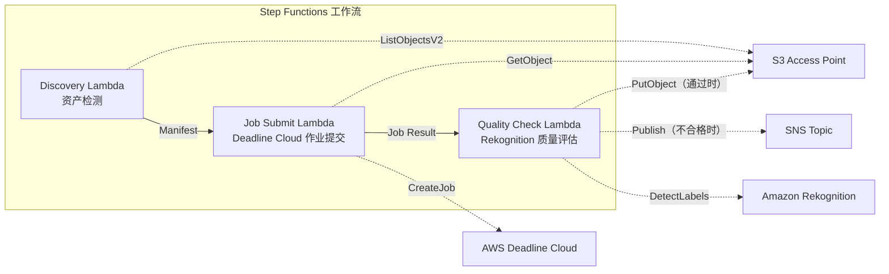

# UC4：媒体 — VFX 渲染管道

🌐 **Language / 言語**: [日本語](README.md) | [English](README.en.md) | [한국어](README.ko.md) | 简体中文 | [繁體中文](README.zh-TW.md) | [Français](README.fr.md) | [Deutsch](README.de.md) | [Español](README.es.md)

📚 **文档**: [架构图](docs/architecture.zh-CN.md) | [演示指南](docs/demo-guide.zh-CN.md)

## 概述

利用 FSx for ONTAP 的 S3 Access Points，实现 VFX 渲染作业的自动提交、质量检查以及已批准输出的写回的无服务器工作流。

### 适用此模式的情况

- 在 VFX / 动画制作中将 FSx for ONTAP 用作渲染存储
- 希望自动化渲染完成后的质量检查，减轻手动审查负担
- 希望将通过质量检查的资产自动写回文件服务器（S3 AP PutObject）
- 希望构建将 Deadline Cloud 与现有 NAS 存储集成的管道

### 不适用此模式的情况

- 需要渲染作业的即时触发（文件保存触发）
- 使用 Deadline Cloud 以外的渲染农场（如本地部署的 Thinkbox Deadline 等）
- 渲染输出超过 5 GB（S3 AP PutObject 的上限）
- 质量检查需要自有的画质评估模型（Rekognition 的标签检测不够充分）

### 主要功能

- 通过 S3 AP 自动检测渲染目标资产
- 向 AWS Deadline Cloud 自动提交渲染作业
- 使用 Amazon Rekognition 进行质量评估（分辨率、伪影、色彩一致性）
- 质量通过时通过 S3 AP 向 FSx for ONTAP 执行 PutObject，不合格时发送 SNS 通知

## Success Metrics

### Outcome
通过 VFX 资产的自动分类和元数据标注，缩短资产检索时间。

### Metrics
| 指标 | 目标值（示例） |
|-----------|------------|
| 每次执行处理的资产数 | > 200 files |
| 元数据标注成功率 | > 95% |
| 资产检索时间缩短 | > 60% |
| 每个文件的处理时间 | < 60 秒 |
| 每次执行的成本 | < $10 |
| Human Review 对象比例 | < 10% |

### Measurement Method
Step Functions 执行历史、Rekognition label count、S3 输出元数据。

## 架构



### 工作流步骤

1. **Discovery**：从 S3 AP 检测渲染目标资产并生成 Manifest
2. **Job Submit**：通过 S3 AP 获取资产，并向 AWS Deadline Cloud 提交渲染作业
3. **Quality Check**：使用 Rekognition 评估渲染结果的质量。通过时向 S3 AP 执行 PutObject，不合格时通过 SNS 通知标记为需重新渲染

## 前提条件

- AWS 账户和适当的 IAM 权限
- FSx for ONTAP 文件系统（ONTAP 9.17.1P4D3 或更高版本）
- 已启用 S3 Access Point 的卷
- 已在 Secrets Manager 中注册的 ONTAP REST API 凭据
- VPC、私有子网
- 已配置的 AWS Deadline Cloud Farm / Queue
- 可使用 Amazon Rekognition 的区域

## 部署步骤

### 1. 准备参数

部署前请确认以下值：

- FSx for ONTAP S3 Access Point Alias
- ONTAP 管理 IP 地址
- Secrets Manager 密钥名称
- AWS Deadline Cloud Farm ID / Queue ID
- VPC ID、私有子网 ID

### 2. SAM 部署

```bash
# 前提：需要 AWS SAM CLI。sam build 会自动打包代码和共享层。
sam build

sam deploy \
  --stack-name fsxn-media-vfx \
  --parameter-overrides \
    S3AccessPointAlias=<your-volume-ext-s3alias> \
    S3AccessPointName=<your-s3ap-name> \
    S3AccessPointOutputAlias=<your-output-volume-ext-s3alias> \
    OntapSecretName=<your-ontap-secret-name> \
    OntapManagementIp=<your-ontap-management-ip> \
    ScheduleExpression="rate(1 hour)" \
    VpcId=<your-vpc-id> \
    PrivateSubnetIds=<subnet-1>,<subnet-2> \
    NotificationEmail=<your-email@example.com> \
    DeadlineFarmId=<your-deadline-farm-id> \
    DeadlineQueueId=<your-deadline-queue-id> \
    QualityThreshold=80.0 \
    EnableVpcEndpoints=false \
    EnableCloudWatchAlarms=false \
  --capabilities CAPABILITY_NAMED_IAM \
  --resolve-s3 \
  --region ap-northeast-1
```

> **注意**：`template.yaml` 用于 SAM CLI（`sam build` + `sam deploy`）。
> 若使用 `aws cloudformation deploy` 命令直接部署，请改用 `template-deploy.yaml`（需要事先打包 Lambda zip 文件并上传到 S3）。

> **注意**：请将 `<...>` 占位符替换为实际的环境值。

### 3. 确认 SNS 订阅

部署后，会向指定的电子邮件地址发送 SNS 订阅确认邮件。

> **注意**：如果省略 `S3AccessPointName`，IAM 策略将仅基于 Alias，可能会发生 `AccessDenied` 错误。生产环境建议指定。详情请参阅[故障排除指南](../docs/guides/troubleshooting-guide.md#1-accessdenied-エラー)。

## 配置参数一览

| 参数 | 说明 | 默认值 | 必填 |
|-----------|------|----------|------|
| `S3AccessPointAlias` | FSx for ONTAP S3 AP Alias（输入用） | — | ✅ |
| `S3AccessPointName` | S3 AP 名称（用于基于 ARN 的 IAM 授权。省略时仅基于 Alias） | `""` | ⚠️ 推荐 |
| `S3AccessPointOutputAlias` | FSx for ONTAP S3 AP Alias（输出用） | — | ✅ |
| `OntapSecretName` | ONTAP 凭据的 Secrets Manager 密钥名称 | — | ✅ |
| `OntapManagementIp` | ONTAP 集群管理 IP 地址 | — | ✅ |
| `ScheduleExpression` | EventBridge Scheduler 的调度表达式 | `rate(1 hour)` | |
| `VpcId` | VPC ID | — | ✅ |
| `PrivateSubnetIds` | 私有子网 ID 列表 | — | ✅ |
| `NotificationEmail` | SNS 通知电子邮件地址 | — | ✅ |
| `DeadlineFarmId` | AWS Deadline Cloud Farm ID | — | ✅ |
| `DeadlineQueueId` | AWS Deadline Cloud Queue ID | — | ✅ |
| `QualityThreshold` | Rekognition 质量评估阈值（0.0〜100.0） | `80.0` | |
| `EnableVpcEndpoints` | 启用 Interface VPC Endpoints | `false` | |
| `EnableCloudWatchAlarms` | 启用 CloudWatch Alarms | `false` | |

## 成本结构

### 基于请求（按量计费）

| 服务 | 计费单位 | 概算（100 资产/月） |
|---------|---------|----------------------|
| Lambda | 请求数 + 执行时间 | ~$0.01 |
| Step Functions | 状态转换数 | 免费额度内 |
| S3 API | 请求数 | ~$0.01 |
| Rekognition | 图像数 | ~$0.10 |
| Deadline Cloud | 渲染时间 | 另行估算※ |

※ AWS Deadline Cloud 的成本取决于渲染作业的规模和时长。

### 常时运行（可选）

| 服务 | 参数 | 月费 |
|---------|-----------|------|
| Interface VPC Endpoints | `EnableVpcEndpoints=true` | ~$28.80 |
| CloudWatch Alarms | `EnableCloudWatchAlarms=true` | ~$0.20 |

> 在演示/PoC 环境中，仅凭可变成本即可从 **~$0.12/月**（不含 Deadline Cloud）起使用。

## 清理

```bash
# 删除 CloudFormation 堆栈
aws cloudformation delete-stack \
  --stack-name fsxn-media-vfx \
  --region ap-northeast-1

# 等待删除完成
aws cloudformation wait stack-delete-complete \
  --stack-name fsxn-media-vfx \
  --region ap-northeast-1
```

> **注意**：如果 S3 存储桶中仍有对象残留，堆栈删除可能会失败。请事先清空存储桶。

## Supported Regions

UC4 使用以下服务：

| 服务 | 区域约束 |
|---------|-------------|
| Amazon Rekognition | 几乎所有区域均可使用 |
| AWS Deadline Cloud | 支持的区域有限（[Deadline Cloud 支持的区域](https://docs.aws.amazon.com/general/latest/gr/deadline-cloud.html)） |
| AWS X-Ray | 几乎所有区域均可使用 |
| CloudWatch EMF | 几乎所有区域均可使用 |

> 详情请参阅[区域兼容性矩阵](../docs/region-compatibility.md)。

## 参考链接

### AWS 官方文档

- [FSx for ONTAP S3 Access Points 概述](https://docs.aws.amazon.com/fsx/latest/ONTAPGuide/accessing-data-via-s3-access-points.html)
- [使用 CloudFront 进行流式传输（官方教程）](https://docs.aws.amazon.com/fsx/latest/ONTAPGuide/tutorial-stream-video-with-cloudfront.html)
- [使用 Lambda 进行无服务器处理（官方教程）](https://docs.aws.amazon.com/fsx/latest/ONTAPGuide/tutorial-process-files-with-lambda.html)
- [Deadline Cloud API 参考](https://docs.aws.amazon.com/deadline-cloud/latest/APIReference/Welcome.html)
- [Rekognition DetectLabels API](https://docs.aws.amazon.com/rekognition/latest/dg/API_DetectLabels.html)

### AWS 博客文章

- [S3 AP 发布博客](https://aws.amazon.com/blogs/aws/amazon-fsx-for-netapp-ontap-now-integrates-with-amazon-s3-for-seamless-data-access/)
- [三种无服务器架构模式](https://aws.amazon.com/blogs/storage/bridge-legacy-and-modern-applications-with-amazon-s3-access-points-for-amazon-fsx/)

### GitHub 示例

- [aws-samples/amazon-rekognition-serverless-large-scale-image-and-video-processing](https://github.com/aws-samples/amazon-rekognition-serverless-large-scale-image-and-video-processing) — Rekognition 大规模处理
- [aws-samples/dotnet-serverless-imagerecognition](https://github.com/aws-samples/dotnet-serverless-imagerecognition) — Step Functions + Rekognition
- [aws-samples/serverless-patterns](https://github.com/aws-samples/serverless-patterns) — 无服务器模式集

### 项目内指南

- [FlexClone 无服务器模式（日语）](../docs/guides/flexclone-serverless-patterns.md) — 基于 FlexClone + Step Functions + S3AP 的连续帧处理管道、多协议挂载、行业用例
- [FlexClone Serverless Patterns (English)](../docs/guides/flexclone-serverless-patterns-en.md) — FlexClone + Step Functions + S3AP sequential frame processing pipeline

## 已验证环境

| 项目 | 值 |
|------|-----|
| AWS 区域 | ap-northeast-1 (东京) |
| FSx for ONTAP 版本 | ONTAP 9.17.1P4D3 |
| FSx 配置 | SINGLE_AZ_1 |
| Python | 3.12 |
| 部署方式 | CloudFormation (标准) |

## Lambda VPC 部署架构

基于验证中获得的经验，Lambda 函数被分离部署在 VPC 内/外。

**VPC 内 Lambda**（仅需要 ONTAP REST API 访问的函数）：
- Discovery Lambda — S3 AP + ONTAP API

**VPC 外 Lambda**（仅使用 AWS 托管服务 API）：
- 其他所有 Lambda 函数

> **原因**：从 VPC 内 Lambda 访问 AWS 托管服务 API（Athena、Bedrock、Textract 等）需要 Interface VPC Endpoint（每个 $7.20/月）。VPC 外 Lambda 可通过互联网直接访问 AWS API，无需额外成本即可运行。

> **注意**：对于使用 ONTAP REST API 的 UC（UC1 法务与合规），`EnableVpcEndpoints=true` 是必需的。因为需要通过 Secrets Manager VPC Endpoint 获取 ONTAP 凭据。

## FlexCache 渲染加速扩展

### 概述

在 VFX 渲染工作流中，render input assets（纹理、几何体、板块）以读取为主，是 FlexCache 的最佳适用对象。通过在作业开始时动态创建 FlexCache 并在渲染完成后自动删除，可以同时实现成本优化与性能改进。

### 渲染数据分类

| 数据类型 | 访问模式 | FlexCache 适用 | S3 AP 使用 |
|-----------|---------------|:---:|:---:|
| Textures | 只读 | ✅ | ⚠️ 二进制 |
| Geometry/Plates | 只读 | ✅ | ⚠️ 二进制 |
| Scene Files | 只读 | ✅ | ❌ |
| Render Output (EXR/PNG) | 写入 | ❌ | ✅ QC/元数据 |
| Logs | 写入 → 读取 | ❌ | ✅ 分析 |
| Cache (sim/fluid) | 读写 | ❌ | ❌ |

### Dynamic FlexCache Render Workflow

以作业为单位创建·删除 FlexCache 的工作流详情请参阅：

- **[Dynamic FlexCache Render/EDA Workflow](../dynamic-flexcache-render-workflow/README.md)** — 基于 Step Functions 的自动化
- [FlexCache AnyCast / DR](../flexcache-anycast-dr/README.md) — 多区域渲染农场
- [行业·工作负载映射](../docs/industry-workload-mapping.md) — Pattern E: Media/VFX Render Farm

### 预期效果

| KPI | 无 FlexCache | 有 FlexCache | 改善率 |
|-----|--------------|---------------|--------|
| 渲染启动等待 | 10-20分 | 2-5分 | 75% |
| 每帧时间 | 15分 | 10分 | 33% |
| WAN 传输量/作业 | 500GB | 50GB | 90% |
| 成本/帧 | $0.50 | $0.35 | 30% |

---

## AWS 文档链接

| 服务 | 文档 |
|---------|------------|
| FSx for ONTAP | [FSx for ONTAP](https://docs.aws.amazon.com/fsx/latest/ONTAPGuide/what-is-fsx-ontap.html) |
| S3 Access Points | [S3 Access Points](https://docs.aws.amazon.com/fsx/latest/ONTAPGuide/s3-access-points.html) |
| Step Functions | [Step Functions](https://docs.aws.amazon.com/step-functions/latest/dg/welcome.html) |
| Amazon CloudFront | [Amazon CloudFront](https://docs.aws.amazon.com/AmazonCloudFront/latest/DeveloperGuide/Introduction.html) |
| Amazon Bedrock | [Amazon Bedrock](https://docs.aws.amazon.com/bedrock/latest/userguide/what-is-bedrock.html) |

### Well-Architected Framework 对应

| 支柱 | 对应 |
|----|------|
| 卓越运营 | X-Ray 跟踪、EMF 指标、作业状态监控 |
| 安全性 | 最小权限 IAM、CloudFront OAC、KMS 加密 |
| 可靠性 | Step Functions Retry/Catch、质量检查门 |
| 性能效率 | CloudFront CDN 分发、Lambda 并行处理 |
| 成本优化 | 无服务器、CloudFront 缓存利用 |
| 可持续性 | 按需执行、通过 CDN 减轻源站负载 |

---

## 本地测试

### Prerequisites 检查

```bash
# 确认前提条件
aws --version          # AWS CLI v2
sam --version          # SAM CLI
python3 --version      # Python 3.9+
docker --version       # Docker (sam local 用)
aws sts get-caller-identity  # AWS 凭据
```

### sam local invoke

```bash
# 构建
# 前提：需要 AWS SAM CLI。sam build 会自动打包代码和共享层。
sam build

# 本地运行 Discovery Lambda
sam local invoke DiscoveryFunction --event events/discovery-event.json

# 带环境变量覆盖
sam local invoke DiscoveryFunction \
  --event events/discovery-event.json \
  --env-vars env.json
```

### 单元测试

```bash
python3 -m pytest tests/ -v
```

详情请参阅[本地测试快速入门](../docs/local-testing-quick-start.md)。

---

## 输出示例 (Output Sample)

VFX 渲染质量检查的输出示例：

```json
{
  "discovery": {
    "status": "completed",
    "object_count": 48,
    "prefix": "renders/shot-042/"
  },
  "quality_check": [
    {
      "key": "renders/shot-042/frame-0001.exr",
      "resolution": "4096x2160",
      "color_space": "ACEScg",
      "quality_score": 0.94,
      "issues": [],
      "cloudfront_url": "https://d1234.cloudfront.net/delivery/shot-042/frame-0001.exr"
    }
  ],
  "delivery": {
    "total_frames": 48,
    "passed_qc": 46,
    "failed_qc": 2,
    "cloudfront_distribution": "d1234.cloudfront.net"
  }
}
```

> **注记**：以上为示例输出，实际值因环境和输入数据而异。基准数值为 sizing reference，而非 service limit。

---

## Governance Note

> 本模式提供技术架构指导。并非法律、合规或监管方面的建议。组织应咨询合格的专业人士。

---

## S3AP Compatibility

有关 S3 Access Points for FSx for ONTAP 的兼容性约束、故障排除和触发模式，请参阅 [S3AP Compatibility Notes](../docs/s3ap-compatibility-notes.md)。
