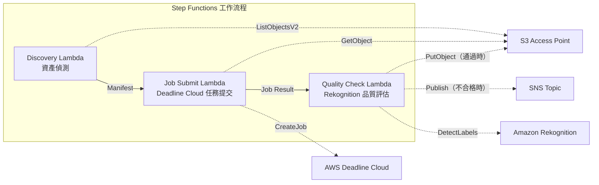

# UC4：媒體 — VFX 渲染管線

🌐 **Language / 言語**: [日本語](README.md) | [English](README.en.md) | [한국어](README.ko.md) | [简体中文](README.zh-CN.md) | 繁體中文 | [Français](README.fr.md) | [Deutsch](README.de.md) | [Español](README.es.md)

📚 **文件**: [架構圖](docs/architecture.zh-TW.md) | [示範指南](docs/demo-guide.zh-TW.md)

## 概述

利用 Amazon FSx for NetApp ONTAP 的 S3 Access Points，建立一個無伺服器工作流程，自動提交 VFX 渲染任務、進行品質檢查，並寫回已獲批准的輸出。

### 適用此模式的情況

- 在 VFX / 動畫製作中將 FSx for ONTAP 作為渲染儲存使用
- 希望自動化渲染完成後的品質檢查，減輕手動審查負擔
- 希望將通過品質檢查的資產自動寫回檔案伺服器（S3 AP PutObject）
- 希望建構將 Deadline Cloud 與現有 NAS 儲存整合的管線

### 不適用此模式的情況

- 需要渲染任務的即時觸發（檔案儲存觸發）
- 使用 Deadline Cloud 以外的渲染農場（如地端部署的 Thinkbox Deadline 等）
- 渲染輸出超過 5 GB（S3 AP PutObject 的上限）
- 品質檢查需要自有的畫質評估模型（Rekognition 的標籤偵測不夠充分）

### 主要功能

- 透過 S3 AP 自動偵測渲染目標資產
- 向 AWS Deadline Cloud 自動提交渲染任務
- 使用 Amazon Rekognition 進行品質評估（解析度、假影、色彩一致性）
- 品質通過時透過 S3 AP 向 FSx for ONTAP 執行 PutObject，不合格時發送 SNS 通知

## Success Metrics

### Outcome
透過 VFX 資產的自動分類與中繼資料標註，縮短資產檢索時間。

### Metrics
| 指標 | 目標值（範例） |
|-----------|------------|
| 每次執行處理的資產數 | > 200 files |
| 中繼資料標註成功率 | > 95% |
| 資產檢索時間縮短 | > 60% |
| 每個檔案的處理時間 | < 60 秒 |
| 每次執行的成本 | < $10 |
| Human Review 對象比例 | < 10% |

### Measurement Method
Step Functions 執行歷程、Rekognition label count、S3 輸出中繼資料。

## 架構



### 工作流程步驟

1. **Discovery**：從 S3 AP 偵測渲染目標資產並產生 Manifest
2. **Job Submit**：透過 S3 AP 取得資產，並向 AWS Deadline Cloud 提交渲染任務
3. **Quality Check**：使用 Rekognition 評估渲染結果的品質。通過時向 S3 AP 執行 PutObject，不合格時透過 SNS 通知標記為需重新渲染

## 前提條件

- AWS 帳戶與適當的 IAM 權限
- FSx for ONTAP 檔案系統（ONTAP 9.17.1P4D3 或更新版本）
- 已啟用 S3 Access Point 的磁碟區
- 已在 Secrets Manager 中註冊的 ONTAP REST API 憑證
- VPC、私有子網路
- 已設定的 AWS Deadline Cloud Farm / Queue
- 可使用 Amazon Rekognition 的區域

## 部署步驟

### 1. 準備參數

部署前請確認以下值：

- FSx for ONTAP S3 Access Point Alias
- ONTAP 管理 IP 位址
- Secrets Manager 密鑰名稱
- AWS Deadline Cloud Farm ID / Queue ID
- VPC ID、私有子網路 ID

### 2. SAM 部署

```bash
# 前提：需要 AWS SAM CLI。sam build 會自動封裝程式碼與共用層。
sam build

sam deploy \
  --stack-name fsxn-media-vfx \
  --parameter-overrides \
    S3AccessPointAlias=<your-volume-ext-s3alias> \
    S3AccessPointName=<your-s3ap-name> \
    S3AccessPointOutputAlias=<your-output-volume-ext-s3alias> \
    OntapSecretName=<your-ontap-secret-name> \
    OntapManagementIp=<your-ontap-management-ip> \
    ScheduleExpression="rate(1 hour)" \
    VpcId=<your-vpc-id> \
    PrivateSubnetIds=<subnet-1>,<subnet-2> \
    NotificationEmail=<your-email@example.com> \
    DeadlineFarmId=<your-deadline-farm-id> \
    DeadlineQueueId=<your-deadline-queue-id> \
    QualityThreshold=80.0 \
    EnableVpcEndpoints=false \
    EnableCloudWatchAlarms=false \
  --capabilities CAPABILITY_NAMED_IAM \
  --resolve-s3 \
  --region ap-northeast-1
```

> **注意**：`template.yaml` 用於 SAM CLI（`sam build` + `sam deploy`）。
> 若使用 `aws cloudformation deploy` 命令直接部署，請改用 `template-deploy.yaml`（需要事先封裝 Lambda zip 檔案並上傳到 S3）。

> **注意**：請將 `<...>` 佔位符替換為實際的環境值。

### 3. 確認 SNS 訂閱

部署後，會向指定的電子郵件地址發送 SNS 訂閱確認郵件。

> **注意**：若省略 `S3AccessPointName`，IAM 政策將僅基於 Alias，可能會發生 `AccessDenied` 錯誤。生產環境建議指定。詳情請參閱[疑難排解指南](../docs/guides/troubleshooting-guide.md#1-accessdenied-エラー)。

## 設定參數一覽

| 參數 | 說明 | 預設值 | 必填 |
|-----------|------|----------|------|
| `S3AccessPointAlias` | FSx for ONTAP S3 AP Alias（輸入用） | — | ✅ |
| `S3AccessPointName` | S3 AP 名稱（用於基於 ARN 的 IAM 授權。省略時僅基於 Alias） | `""` | ⚠️ 建議 |
| `S3AccessPointOutputAlias` | FSx for ONTAP S3 AP Alias（輸出用） | — | ✅ |
| `OntapSecretName` | ONTAP 憑證的 Secrets Manager 密鑰名稱 | — | ✅ |
| `OntapManagementIp` | ONTAP 叢集管理 IP 位址 | — | ✅ |
| `ScheduleExpression` | EventBridge Scheduler 的排程表達式 | `rate(1 hour)` | |
| `VpcId` | VPC ID | — | ✅ |
| `PrivateSubnetIds` | 私有子網路 ID 清單 | — | ✅ |
| `NotificationEmail` | SNS 通知電子郵件地址 | — | ✅ |
| `DeadlineFarmId` | AWS Deadline Cloud Farm ID | — | ✅ |
| `DeadlineQueueId` | AWS Deadline Cloud Queue ID | — | ✅ |
| `QualityThreshold` | Rekognition 品質評估閾值（0.0〜100.0） | `80.0` | |
| `EnableVpcEndpoints` | 啟用 Interface VPC Endpoints | `false` | |
| `EnableCloudWatchAlarms` | 啟用 CloudWatch Alarms | `false` | |

## 成本結構

### 基於請求（按量計費）

| 服務 | 計費單位 | 概算（100 資產/月） |
|---------|---------|----------------------|
| Lambda | 請求數 + 執行時間 | ~$0.01 |
| Step Functions | 狀態轉換數 | 免費額度內 |
| S3 API | 請求數 | ~$0.01 |
| Rekognition | 影像數 | ~$0.10 |
| Deadline Cloud | 渲染時間 | 另行估算※ |

※ AWS Deadline Cloud 的成本取決於渲染任務的規模與時長。

### 常時運行（選用）

| 服務 | 參數 | 月費 |
|---------|-----------|------|
| Interface VPC Endpoints | `EnableVpcEndpoints=true` | ~$28.80 |
| CloudWatch Alarms | `EnableCloudWatchAlarms=true` | ~$0.20 |

> 在示範/PoC 環境中，僅憑變動成本即可從 **~$0.12/月**（不含 Deadline Cloud）起使用。

## 清理

```bash
# 刪除 CloudFormation 堆疊
aws cloudformation delete-stack \
  --stack-name fsxn-media-vfx \
  --region ap-northeast-1

# 等待刪除完成
aws cloudformation wait stack-delete-complete \
  --stack-name fsxn-media-vfx \
  --region ap-northeast-1
```

> **注意**：若 S3 儲存貯體中仍有物件殘留，堆疊刪除可能會失敗。請事先清空儲存貯體。

## Supported Regions

UC4 使用以下服務：

| 服務 | 區域限制 |
|---------|-------------|
| Amazon Rekognition | 幾乎所有區域皆可使用 |
| AWS Deadline Cloud | 支援的區域有限（[Deadline Cloud 支援的區域](https://docs.aws.amazon.com/general/latest/gr/deadline-cloud.html)） |
| AWS X-Ray | 幾乎所有區域皆可使用 |
| CloudWatch EMF | 幾乎所有區域皆可使用 |

> 詳情請參閱[區域相容性矩陣](../docs/region-compatibility.md)。

## 參考連結

### AWS 官方文件

- [FSx for ONTAP S3 Access Points 概述](https://docs.aws.amazon.com/fsx/latest/ONTAPGuide/accessing-data-via-s3-access-points.html)
- [使用 CloudFront 進行串流（官方教學）](https://docs.aws.amazon.com/fsx/latest/ONTAPGuide/tutorial-stream-video-with-cloudfront.html)
- [使用 Lambda 進行無伺服器處理（官方教學）](https://docs.aws.amazon.com/fsx/latest/ONTAPGuide/tutorial-process-files-with-lambda.html)
- [Deadline Cloud API 參考](https://docs.aws.amazon.com/deadline-cloud/latest/APIReference/Welcome.html)
- [Rekognition DetectLabels API](https://docs.aws.amazon.com/rekognition/latest/dg/API_DetectLabels.html)

### AWS 部落格文章

- [S3 AP 發布部落格](https://aws.amazon.com/blogs/aws/amazon-fsx-for-netapp-ontap-now-integrates-with-amazon-s3-for-seamless-data-access/)
- [三種無伺服器架構模式](https://aws.amazon.com/blogs/storage/bridge-legacy-and-modern-applications-with-amazon-s3-access-points-for-amazon-fsx/)

### GitHub 範例

- [aws-samples/amazon-rekognition-serverless-large-scale-image-and-video-processing](https://github.com/aws-samples/amazon-rekognition-serverless-large-scale-image-and-video-processing) — Rekognition 大規模處理
- [aws-samples/dotnet-serverless-imagerecognition](https://github.com/aws-samples/dotnet-serverless-imagerecognition) — Step Functions + Rekognition
- [aws-samples/serverless-patterns](https://github.com/aws-samples/serverless-patterns) — 無伺服器模式集

### 專案內指南

- [FlexClone 無伺服器模式（日文）](../docs/guides/flexclone-serverless-patterns.md) — 基於 FlexClone + Step Functions + S3AP 的連續影格處理管線、多協定掛載、產業用例
- [FlexClone Serverless Patterns (English)](../docs/guides/flexclone-serverless-patterns-en.md) — FlexClone + Step Functions + S3AP sequential frame processing pipeline

## 已驗證環境

| 項目 | 值 |
|------|-----|
| AWS 區域 | ap-northeast-1 (東京) |
| FSx for ONTAP 版本 | ONTAP 9.17.1P4D3 |
| FSx 組態 | SINGLE_AZ_1 |
| Python | 3.12 |
| 部署方式 | CloudFormation (標準) |

## Lambda VPC 部署架構

基於驗證中獲得的經驗，Lambda 函數被分離部署在 VPC 內/外。

**VPC 內 Lambda**（僅需要 ONTAP REST API 存取的函數）：
- Discovery Lambda — S3 AP + ONTAP API

**VPC 外 Lambda**（僅使用 AWS 受管服務 API）：
- 其他所有 Lambda 函數

> **原因**：從 VPC 內 Lambda 存取 AWS 受管服務 API（Athena、Bedrock、Textract 等）需要 Interface VPC Endpoint（每個 $7.20/月）。VPC 外 Lambda 可透過網際網路直接存取 AWS API，無需額外成本即可運行。

> **注意**：對於使用 ONTAP REST API 的 UC（UC1 法務與合規），`EnableVpcEndpoints=true` 為必要項目。因為需要透過 Secrets Manager VPC Endpoint 取得 ONTAP 憑證。

## FlexCache 渲染加速擴充

### 概述

在 VFX 渲染工作流程中，render input assets（紋理、幾何體、板塊）以讀取為主，是 FlexCache 的最佳適用對象。透過在任務開始時動態建立 FlexCache 並在渲染完成後自動刪除，可以同時實現成本最佳化與效能改善。

### 渲染資料分類

| 資料類型 | 存取模式 | FlexCache 適用 | S3 AP 使用 |
|-----------|---------------|:---:|:---:|
| Textures | 唯讀 | ✅ | ⚠️ 二進位 |
| Geometry/Plates | 唯讀 | ✅ | ⚠️ 二進位 |
| Scene Files | 唯讀 | ✅ | ❌ |
| Render Output (EXR/PNG) | 寫入 | ❌ | ✅ QC/中繼資料 |
| Logs | 寫入 → 讀取 | ❌ | ✅ 分析 |
| Cache (sim/fluid) | 讀寫 | ❌ | ❌ |

### Dynamic FlexCache Render Workflow

以任務為單位建立·刪除 FlexCache 的工作流程詳情請參閱：

- **[Dynamic FlexCache Render/EDA Workflow](../dynamic-flexcache-render-workflow/README.md)** — 基於 Step Functions 的自動化
- [FlexCache AnyCast / DR](../flexcache-anycast-dr/README.md) — 多區域渲染農場
- [產業·工作負載對應](../docs/industry-workload-mapping.md) — Pattern E: Media/VFX Render Farm

### 預期效果

| KPI | 無 FlexCache | 有 FlexCache | 改善率 |
|-----|--------------|---------------|--------|
| 渲染啟動等待 | 10-20分 | 2-5分 | 75% |
| 每影格時間 | 15分 | 10分 | 33% |
| WAN 傳輸量/任務 | 500GB | 50GB | 90% |
| 成本/影格 | $0.50 | $0.35 | 30% |

---

## AWS 文件連結

| 服務 | 文件 |
|---------|------------|
| FSx for ONTAP | [FSx for ONTAP](https://docs.aws.amazon.com/fsx/latest/ONTAPGuide/what-is-fsx-ontap.html) |
| S3 Access Points | [S3 Access Points](https://docs.aws.amazon.com/fsx/latest/ONTAPGuide/s3-access-points.html) |
| Step Functions | [Step Functions](https://docs.aws.amazon.com/step-functions/latest/dg/welcome.html) |
| Amazon CloudFront | [Amazon CloudFront](https://docs.aws.amazon.com/AmazonCloudFront/latest/DeveloperGuide/Introduction.html) |
| Amazon Bedrock | [Amazon Bedrock](https://docs.aws.amazon.com/bedrock/latest/userguide/what-is-bedrock.html) |

### Well-Architected Framework 對應

| 支柱 | 對應 |
|----|------|
| 卓越營運 | X-Ray 追蹤、EMF 指標、任務狀態監控 |
| 安全性 | 最小權限 IAM、CloudFront OAC、KMS 加密 |
| 可靠性 | Step Functions Retry/Catch、品質檢查閘門 |
| 效能效率 | CloudFront CDN 傳遞、Lambda 平行處理 |
| 成本最佳化 | 無伺服器、CloudFront 快取運用 |
| 永續性 | 隨需執行、透過 CDN 減輕來源負載 |

---

## 本機測試

### Prerequisites 檢查

```bash
# 確認前提條件
aws --version          # AWS CLI v2
sam --version          # SAM CLI
python3 --version      # Python 3.9+
docker --version       # Docker (sam local 用)
aws sts get-caller-identity  # AWS 憑證
```

### sam local invoke

```bash
# 建置
# 前提：需要 AWS SAM CLI。sam build 會自動封裝程式碼與共用層。
sam build

# 本機執行 Discovery Lambda
sam local invoke DiscoveryFunction --event events/discovery-event.json

# 帶環境變數覆寫
sam local invoke DiscoveryFunction \
  --event events/discovery-event.json \
  --env-vars env.json
```

### 單元測試

```bash
python3 -m pytest tests/ -v
```

詳情請參閱[本機測試快速入門](../docs/local-testing-quick-start.md)。

---

## 輸出範例 (Output Sample)

VFX 渲染品質檢查的輸出範例：

```json
{
  "discovery": {
    "status": "completed",
    "object_count": 48,
    "prefix": "renders/shot-042/"
  },
  "quality_check": [
    {
      "key": "renders/shot-042/frame-0001.exr",
      "resolution": "4096x2160",
      "color_space": "ACEScg",
      "quality_score": 0.94,
      "issues": [],
      "cloudfront_url": "https://d1234.cloudfront.net/delivery/shot-042/frame-0001.exr"
    }
  ],
  "delivery": {
    "total_frames": 48,
    "passed_qc": 46,
    "failed_qc": 2,
    "cloudfront_distribution": "d1234.cloudfront.net"
  }
}
```

> **註記**：以上為範例輸出，實際值因環境與輸入資料而異。基準數值為 sizing reference，而非 service limit。

---

## Governance Note

> 本模式提供技術架構指引。並非法律、合規或監管方面的建議。組織應諮詢合格的專業人士。

---

## S3AP Compatibility

有關 S3 Access Points for FSx for ONTAP 的相容性限制、疑難排解與觸發模式，請參閱 [S3AP Compatibility Notes](../docs/s3ap-compatibility-notes.md)。
