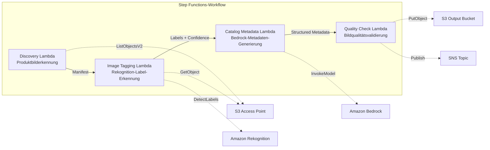

# UC11: Einzelhandel / E-Commerce — Automatisches Tagging von Produktbildern und Generierung von Katalog-Metadaten

🌐 **Language / 言語**: [日本語](README.md) | [English](README.en.md) | [한국어](README.ko.md) | [简体中文](README.zh-CN.md) | [繁體中文](README.zh-TW.md) | [Français](README.fr.md) | Deutsch | [Español](README.es.md)

📚 **Dokumentation**: [Architekturdiagramm](docs/architecture.de.md) | [Demo-Leitfaden](docs/demo-guide.de.md)

## Überblick

Ein serverloser Workflow, der die S3 Access Points von FSx for ONTAP nutzt, um das Tagging von Produktbildern, die Generierung von Katalog-Metadaten und Bildqualitätsprüfungen zu automatisieren.

### Wann dieses Pattern geeignet ist

- Eine große Menge an Produktbildern ist bereits auf FSx for ONTAP gespeichert
- Sie möchten ein automatisches Labeling von Produktbildern (Kategorie, Farbe, Material) mit Rekognition durchführen
- Sie möchten strukturierte Katalog-Metadaten (product_category, color, material, style_attributes) automatisch generieren
- Eine automatische Validierung von Bildqualitätsmetriken (Auflösung, Dateigröße, Seitenverhältnis) ist erforderlich
- Sie möchten die Verwaltung von Kennzeichnungen für die manuelle Überprüfung von Labels mit geringer Konfidenz automatisieren

### Wann dieses Pattern nicht geeignet ist

- Echtzeit-Verarbeitung von Produktbildern (API Gateway + Lambda ist besser geeignet)
- Groß angelegte Bildkonvertierung und -größenänderung (MediaConvert / EC2 ist besser geeignet)
- Eine direkte Integration mit einem bestehenden PIM-System (Product Information Management) ist erforderlich
- Umgebungen, in denen die Netzwerkerreichbarkeit der ONTAP REST API nicht sichergestellt werden kann

### Hauptfunktionen

- Automatische Erkennung von Produktbildern (.jpg, .jpeg, .png, .webp) über den S3 AP
- Label-Erkennung und Ermittlung von Konfidenzwerten mit Rekognition DetectLabels
- Setzen einer Kennzeichnung für die manuelle Überprüfung, wenn die Konfidenz unter dem Schwellenwert liegt (Standard: 70 %)
- Generierung strukturierter Katalog-Metadaten mit Bedrock
- Validierung von Bildqualitätsmetriken (Mindestauflösung, Dateigrößenbereich, Seitenverhältnis)

## Success Metrics

### Outcome
Reduzierung des Aufwands für die Aktualisierung der E-Commerce-Website durch Automatisierung des Taggings von Produktbildern und der Generierung von Katalog-Metadaten.

### Metrics
| Metrik | Zielwert (Beispiel) |
|-----------|------------|
| Verarbeitete Bilder / Ausführung | > 500 images |
| Genauigkeit der Label-Erkennung | > 90 % |
| Erfolgsrate der Metadaten-Generierung | > 95 % |
| Verarbeitungszeit / Bild | < 10 Sekunden |
| Kosten / Ausführung | < 5 $ |
| Anteil an Human Review | < 10 % (Labels mit geringer Konfidenz) |

### Measurement Method
Step Functions-Ausführungsverlauf, Rekognition label confidence, S3-Ausgabemetadaten, CloudWatch Metrics.

## Architektur



### Workflow-Schritte

1. **Discovery**: Erkennt .jpg-, .jpeg-, .png-, .webp-Dateien vom S3 AP
2. **Image Tagging**: Erkennt Labels mit Rekognition; setzt eine Kennzeichnung für die manuelle Überprüfung bei allem unterhalb des Konfidenzschwellenwerts
3. **Catalog Metadata**: Generiert strukturierte Katalog-Metadaten mit Bedrock
4. **Quality Check**: Validiert Bildqualitätsmetriken und kennzeichnet Bilder unterhalb der Schwellenwerte

## Voraussetzungen

- Ein AWS-Konto und geeignete IAM-Berechtigungen
- Ein FSx for ONTAP-Dateisystem (ONTAP 9.17.1P4D3 oder höher)
- Ein Volume mit aktiviertem S3 Access Point (zur Speicherung der Produktbilder)
- Ein VPC und private Subnetze
- Aktivierter Amazon Bedrock-Modellzugriff (Claude / Nova)

## Bereitstellungsschritte

### 1. SAM-Bereitstellung

```bash
# Voraussetzung: AWS SAM CLI erforderlich. 'sam build' packt Code und Shared Layer automatisch.
sam build

sam deploy \
  --stack-name fsxn-retail-catalog \
  --parameter-overrides \
    S3AccessPointAlias=<your-volume-ext-s3alias> \
    S3AccessPointName=<your-s3ap-name> \
    VpcId=<your-vpc-id> \
    PrivateSubnetIds=<subnet-1>,<subnet-2> \
    ScheduleExpression="rate(1 hour)" \
    NotificationEmail=<your-email@example.com> \
    EnableVpcEndpoints=false \
    EnableCloudWatchAlarms=false \
  --capabilities CAPABILITY_NAMED_IAM \
  --resolve-s3 \
  --region ap-northeast-1
```

> **Hinweis**: `template.yaml` wird mit der SAM CLI (`sam build` + `sam deploy`) verwendet.
> Für die direkte Bereitstellung mit dem Befehl `aws cloudformation deploy` verwenden Sie stattdessen `template-deploy.yaml` (erfordert das Vorpaketieren der Lambda-ZIP-Dateien und das Hochladen nach S3).

## Liste der Konfigurationsparameter

| Parameter | Beschreibung | Standard | Erforderlich |
|-----------|------|----------|------|
| `S3AccessPointAlias` | FSx for ONTAP S3 AP Alias (für die Eingabe) | — | ✅ |
| `S3AccessPointName` | S3 AP-Name (für die ARN-basierte IAM-Berechtigungsvergabe. Bei Weglassen nur Alias-basiert) | `""` | ⚠️ Empfohlen |
| `ScheduleExpression` | Zeitplanausdruck des EventBridge Scheduler | `rate(1 hour)` | |
| `VpcId` | VPC-ID | — | ✅ |
| `PrivateSubnetIds` | Liste der privaten Subnetz-IDs | — | ✅ |
| `NotificationEmail` | E-Mail-Adresse für SNS-Benachrichtigungen | — | ✅ |
| `ConfidenceThreshold` | Konfidenzschwellenwert der Rekognition-Labels (%) | `70` | |
| `MapConcurrency` | Anzahl paralleler Ausführungen des Map-Status | `10` | |
| `LambdaMemorySize` | Lambda-Speichergröße (MB) | `512` | |
| `LambdaTimeout` | Lambda-Timeout (Sekunden) | `300` | |
| `EnableVpcEndpoints` | Interface VPC Endpoints aktivieren | `false` | |
| `EnableCloudWatchAlarms` | CloudWatch Alarms aktivieren | `false` | |

## Bereinigung

```bash
aws s3 rm s3://fsxn-retail-catalog-output-${AWS_ACCOUNT_ID} --recursive

aws cloudformation delete-stack \
  --stack-name fsxn-retail-catalog \
  --region ap-northeast-1

aws cloudformation wait stack-delete-complete \
  --stack-name fsxn-retail-catalog \
  --region ap-northeast-1
```

## Referenzlinks

- [FSx for ONTAP S3 Access Points – Überblick](https://docs.aws.amazon.com/fsx/latest/ONTAPGuide/accessing-data-via-s3-access-points.html)
- [Amazon Rekognition DetectLabels](https://docs.aws.amazon.com/rekognition/latest/dg/labels-detect-labels-image.html)
- [Amazon Bedrock API-Referenz](https://docs.aws.amazon.com/bedrock/latest/APIReference/API_runtime_InvokeModel.html)
- [Leitfaden zur Auswahl Streaming vs. Polling](../docs/streaming-vs-polling-guide.md)

## Kinesis-Streaming-Modus (Phase 3)

In Phase 3 können Sie zusätzlich zum EventBridge-Polling optional eine **Near-Realtime-Verarbeitung mit Kinesis Data Streams** aktivieren.

### Aktivierung

```bash
# Voraussetzung: AWS SAM CLI erforderlich. 'sam build' packt Code und Shared Layer automatisch.
sam build

sam deploy \
  --stack-name fsxn-retail-catalog \
  --parameter-overrides \
    EnableStreamingMode=true \
    ... # weitere Parameter
  --capabilities CAPABILITY_NAMED_IAM \
  --resolve-s3
```

### Architektur des Streaming-Modus

```
EventBridge (rate(1 min)) → Stream Producer Lambda
  → Vergleich mit der DynamoDB-Statustabelle → Änderungserkennung
  → Kinesis Data Stream → Stream Consumer Lambda
  → Bestehende ImageTagging + CatalogMetadata-Pipeline
```

### Hauptmerkmale

- **Änderungserkennung**: Vergleicht im Minutentakt die Objektliste des S3 AP mit der DynamoDB-Statustabelle, um neue, geänderte und gelöschte Dateien zu erkennen
- **Idempotente Verarbeitung**: Verhindert doppelte Verarbeitung durch DynamoDB conditional writes
- **Fehlerbehandlung**: Isoliert fehlgeschlagene Datensätze mit bisect-on-error + einer DynamoDB-Dead-Letter-Tabelle
- **Koexistenz mit dem bestehenden Pfad**: Der Polling-Pfad (EventBridge + Step Functions) bleibt unverändert. Ein Hybridbetrieb ist möglich

### Pattern-Auswahl

Welches Pattern zu wählen ist, erfahren Sie im [Leitfaden zur Auswahl Streaming vs. Polling](../docs/streaming-vs-polling-guide.md).

## Supported Regions

UC11 verwendet die folgenden Dienste:

| Dienst | Regionale Einschränkung |
|---------|-------------|
| Amazon Rekognition | In fast allen Regionen verfügbar |
| Amazon Bedrock | Unterstützte Regionen prüfen ([Von Bedrock unterstützte Regionen](https://docs.aws.amazon.com/general/latest/gr/bedrock.html)) |
| Kinesis Data Streams | In fast allen Regionen verfügbar (Shard-Preise variieren je nach Region) |
| AWS X-Ray | In fast allen Regionen verfügbar |
| CloudWatch EMF | In fast allen Regionen verfügbar |

> Beachten Sie beim Aktivieren des Kinesis-Streaming-Modus, dass die Shard-Preise je nach Region variieren. Weitere Details finden Sie in der [Regionskompatibilitätsmatrix](../docs/region-compatibility.md).

---

## AWS-Dokumentationslinks

| Dienst | Dokumentation |
|---------|------------|
| FSx for ONTAP | [Benutzerhandbuch](https://docs.aws.amazon.com/fsx/latest/ONTAPGuide/what-is-fsx-ontap.html) |
| S3 Access Points | [S3 AP for FSx for ONTAP](https://docs.aws.amazon.com/fsx/latest/ONTAPGuide/s3-access-points.html) |
| Step Functions | [Entwicklerhandbuch](https://docs.aws.amazon.com/step-functions/latest/dg/welcome.html) |
| Amazon Rekognition | [Entwicklerhandbuch](https://docs.aws.amazon.com/rekognition/latest/dg/what-is.html) |
| Amazon Kinesis | [Entwicklerhandbuch](https://docs.aws.amazon.com/streams/latest/dev/introduction.html) |
| Amazon Bedrock | [Benutzerhandbuch](https://docs.aws.amazon.com/bedrock/latest/userguide/what-is-bedrock.html) |

### Well-Architected Framework-Zuordnung

| Säule | Zuordnung |
|----|------|
| Operative Exzellenz | X-Ray, EMF, Kinesis-Metriken, DLQ-Überwachung |
| Sicherheit | IAM mit geringsten Rechten, KMS-Verschlüsselung, Zugriffskontrolle für Produktdaten |
| Zuverlässigkeit | Kinesis bisect-on-error, DLQ, Step Functions Retry |
| Leistungseffizienz | Streaming-Verarbeitung, paralleles Bild-Tagging |
| Kostenoptimierung | Serverless, Kinesis On-Demand-Modus |
| Nachhaltigkeit | Inkrementelle Verarbeitung (nur geänderte Bilder), DynamoDB-Statusverwaltung |

---

## Kostenschätzung (monatliche Näherung)

> **Anmerkung**: Die folgenden Werte sind Näherungswerte für die Region ap-northeast-1; die tatsächlichen Kosten variieren je nach Nutzung. Prüfen Sie die aktuellen Preise mit dem [AWS Pricing Calculator](https://calculator.aws/).

### Serverlose Komponenten (nutzungsbasierte Abrechnung)

| Dienst | Stückpreis | Angenommene Nutzung | Monatliche Näherung |
|---------|------|-----------|---------|
| Lambda | $0.0000166667/GB-sec | 6 Funktionen × 500 images/Tag | ~$1-5 |
| S3 API (GetObject/ListObjects) | $0.0047/10K requests | ~10K requests/Tag | ~$1.5 |
| Step Functions | $0.025/1K state transitions | ~1K transitions/Tag | ~$0.75 |
| Bedrock (Nova Lite) | $0.00006/1K input tokens | ~50K tokens/Ausführung | ~$3-10 |
| Athena | $5/TB scanned | ~10 MB/Abfrage | ~$0.5-2 |
| SNS | $0.50/100K notifications | ~100 notifications/Tag | ~$0.15 |
| CloudWatch Logs | $0.76/GB ingested | ~1 GB/Monat | ~$0.76 |
| Kinesis Data Stream (optional) | $0.015/shard-hour |

### Fixkosten (FSx for ONTAP — unter Annahme einer bestehenden Umgebung)

| Komponente | Monatlich |
|--------------|------|
| FSx for ONTAP (128 MBps, 1 TB) | ~$230 (gemeinsam genutzte bestehende Umgebung) |
| S3 Access Point | Keine zusätzlichen Gebühren (nur S3 API-Gebühren) |

### Gesamtnäherung

| Konfiguration | Monatliche Näherung |
|------|---------|
| Minimalkonfiguration (einmal täglich) | ~$5-15 |
| Standardkonfiguration (stündlich) | ~$15-50 |
| Großkonfiguration (hohe Frequenz + Alarme) | ~$50-150 |

> **Governance Caveat**: Kostenschätzungen sind Näherungswerte und keine garantierten Werte. Der tatsächlich in Rechnung gestellte Betrag variiert je nach Nutzungsmustern, Datenvolumen und Region.

---

## Lokales Testen

### Prüfung der Prerequisites

```bash
# Voraussetzungen prüfen
aws --version          # AWS CLI v2
sam --version          # SAM CLI
python3 --version      # Python 3.9+
docker --version       # Docker (für sam local)
aws sts get-caller-identity  # AWS-Anmeldeinformationen
```

### sam local invoke

```bash
# Build
# Voraussetzung: AWS SAM CLI erforderlich. 'sam build' packt Code und Shared Layer automatisch.
sam build

# Discovery Lambda lokal ausführen
sam local invoke DiscoveryFunction --event events/discovery-event.json

# Mit Überschreibung der Umgebungsvariablen
sam local invoke DiscoveryFunction \
  --event events/discovery-event.json \
  --env-vars env.json
```

### Unit-Tests

```bash
python3 -m pytest tests/ -v
```

Weitere Details finden Sie im [Schnellstart für lokales Testen](../docs/local-testing-quick-start.md).

---

## Ausgabebeispiel (Output Sample)

Beispielausgabe der Pipeline zum Tagging von Produktbildern:

```json
{
  "discovery": {
    "status": "completed",
    "object_count": 50,
    "prefix": "product-images/"
  },
  "tagging_results": [
    {
      "key": "product-images/SKU-12345.jpg",
      "labels": [
        {"name": "Dress", "confidence": 0.98},
        {"name": "Red", "confidence": 0.95},
        {"name": "Summer", "confidence": 0.87}
      ],
      "category": "Apparel/Dresses",
      "catalog_metadata": {
        "color": "red",
        "season": "summer",
        "style": "casual"
      }
    }
  ],
  "report": {
    "total_processed": 50,
    "auto_tagged": 47,
    "requires_review": 3,
    "output_prefix": "s3://output-bucket/catalog-metadata/"
  }
}
```

> **Anmerkung**: Das obige ist eine Beispielausgabe; die tatsächlichen Werte variieren je nach Umgebung und Eingabedaten. Benchmark-Zahlen sind eine sizing reference, kein service limit.

---

## Governance Note

> Dieses Pattern bietet technische Architekturberatung. Es stellt keine rechtliche, Compliance- oder regulatorische Beratung dar. Organisationen sollten qualifizierte Fachleute konsultieren.

---

## S3AP Compatibility

Informationen zu Kompatibilitätseinschränkungen, Fehlerbehebung und Trigger-Patterns der S3 Access Points für FSx for ONTAP finden Sie in den [S3AP Compatibility Notes](../docs/s3ap-compatibility-notes.md).
