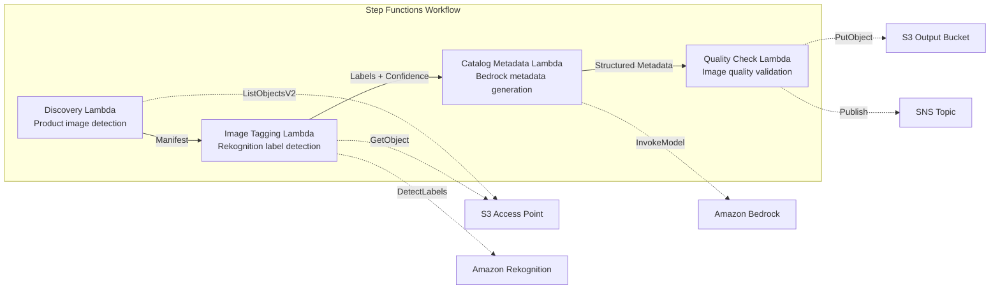

# UC11: Retail / E-commerce — Automatic Product Image Tagging and Catalog Metadata Generation

🌐 **Language / 言語**: [日本語](README.md) | English | [한국어](README.ko.md) | [简体中文](README.zh-CN.md) | [繁體中文](README.zh-TW.md) | [Français](README.fr.md) | [Deutsch](README.de.md) | [Español](README.es.md)

📚 **Documentation**: [Architecture Diagram](docs/architecture.en.md) | [Demo Guide](docs/demo-guide.en.md)

## Overview

A serverless workflow that leverages S3 Access Points on FSx for ONTAP to automate product image tagging, catalog metadata generation, and image quality checks.

### When this pattern is suitable

- A large volume of product images is already accumulated on FSx for ONTAP
- You want to run automatic labeling of product images (category, color, material) with Rekognition
- You want to automatically generate structured catalog metadata (product_category, color, material, style_attributes)
- Automatic validation of image quality metrics (resolution, file size, aspect ratio) is required
- You want to automate manual review flag management for low-confidence labels

### When this pattern is not suitable

- Real-time product image processing (API Gateway + Lambda is more appropriate)
- Large-scale image conversion and resizing (MediaConvert / EC2 is more appropriate)
- Direct integration with an existing PIM (Product Information Management) system is required
- Environments where network reachability to the ONTAP REST API cannot be ensured

### Main Features

- Automatically detects product images (.jpg, .jpeg, .png, .webp) via the S3 AP
- Label detection and confidence scoring with Rekognition DetectLabels
- Sets a manual review flag when confidence is below the threshold (default: 70%)
- Structured catalog metadata generation with Bedrock
- Image quality metric validation (minimum resolution, file size range, aspect ratio)

## Success Metrics

### Outcome
Reduce e-commerce site update effort by automating product image tagging and catalog metadata generation.

### Metrics
| Metric | Target (example) |
|-----------|------------|
| Images processed / run | > 500 images |
| Label detection accuracy | > 90% |
| Metadata generation success rate | > 95% |
| Processing time / image | < 10 seconds |
| Cost / run | < $5 |
| Human Review rate | < 10% (low-confidence labels) |

### Measurement Method
Step Functions execution history, Rekognition label confidence, S3 output metadata, CloudWatch Metrics.

## Architecture



### Workflow Steps

1. **Discovery**: Detect .jpg, .jpeg, .png, .webp files from the S3 AP
2. **Image Tagging**: Detect labels with Rekognition; set a manual review flag for anything below the confidence threshold
3. **Catalog Metadata**: Generate structured catalog metadata with Bedrock
4. **Quality Check**: Validate image quality metrics and flag images below the thresholds

## Prerequisites

- An AWS account and appropriate IAM permissions
- An FSx for ONTAP file system (ONTAP 9.17.1P4D3 or later)
- A volume with S3 Access Points enabled (storing the product images)
- A VPC and private subnets
- Amazon Bedrock model access enabled (Claude / Nova)

## Deployment Steps

### 1. SAM Deployment

```bash
# Prerequisite: AWS SAM CLI required. 'sam build' automatically packages the code and the shared layer.
sam build

sam deploy \
  --stack-name fsxn-retail-catalog \
  --parameter-overrides \
    S3AccessPointAlias=<your-volume-ext-s3alias> \
    S3AccessPointName=<your-s3ap-name> \
    VpcId=<your-vpc-id> \
    PrivateSubnetIds=<subnet-1>,<subnet-2> \
    ScheduleExpression="rate(1 hour)" \
    NotificationEmail=<your-email@example.com> \
    EnableVpcEndpoints=false \
    EnableCloudWatchAlarms=false \
  --capabilities CAPABILITY_NAMED_IAM \
  --resolve-s3 \
  --region ap-northeast-1
```

> **Note**: `template.yaml` is used with the SAM CLI (`sam build` + `sam deploy`).
> To deploy directly with the `aws cloudformation deploy` command, use `template-deploy.yaml` instead (this requires pre-packaging the Lambda zip files and uploading them to S3).

## Configuration Parameters

| Parameter | Description | Default | Required |
|-----------|------|----------|------|
| `S3AccessPointAlias` | FSx for ONTAP S3 AP Alias (for input) | — | ✅ |
| `S3AccessPointName` | S3 AP name (for ARN-based IAM permission grants; when omitted, Alias-based only) | `""` | ⚠️ Recommended |
| `ScheduleExpression` | EventBridge Scheduler schedule expression | `rate(1 hour)` | |
| `VpcId` | VPC ID | — | ✅ |
| `PrivateSubnetIds` | List of private subnet IDs | — | ✅ |
| `NotificationEmail` | SNS notification destination email address | — | ✅ |
| `ConfidenceThreshold` | Rekognition label confidence threshold (%) | `70` | |
| `MapConcurrency` | Map state parallel execution count | `10` | |
| `LambdaMemorySize` | Lambda memory size (MB) | `512` | |
| `LambdaTimeout` | Lambda timeout (seconds) | `300` | |
| `EnableVpcEndpoints` | Enable Interface VPC Endpoints | `false` | |
| `EnableCloudWatchAlarms` | Enable CloudWatch Alarms | `false` | |

## Cleanup

```bash
aws s3 rm s3://fsxn-retail-catalog-output-${AWS_ACCOUNT_ID} --recursive

aws cloudformation delete-stack \
  --stack-name fsxn-retail-catalog \
  --region ap-northeast-1

aws cloudformation wait stack-delete-complete \
  --stack-name fsxn-retail-catalog \
  --region ap-northeast-1
```

## References

- [FSx for ONTAP S3 Access Points Overview](https://docs.aws.amazon.com/fsx/latest/ONTAPGuide/accessing-data-via-s3-access-points.html)
- [Amazon Rekognition DetectLabels](https://docs.aws.amazon.com/rekognition/latest/dg/labels-detect-labels-image.html)
- [Amazon Bedrock API Reference](https://docs.aws.amazon.com/bedrock/latest/APIReference/API_runtime_InvokeModel.html)
- [Streaming vs Polling Selection Guide](../docs/streaming-vs-polling-guide.md)

## Kinesis Streaming Mode (Phase 3)

In Phase 3, in addition to EventBridge polling, you can opt in to **near-real-time processing with Kinesis Data Streams**.

### Activation

```bash
# Prerequisite: AWS SAM CLI required. 'sam build' automatically packages the code and the shared layer.
sam build

sam deploy \
  --stack-name fsxn-retail-catalog \
  --parameter-overrides \
    EnableStreamingMode=true \
    ... # other parameters
  --capabilities CAPABILITY_NAMED_IAM \
  --resolve-s3
```

### Streaming Mode Architecture

```
EventBridge (rate(1 min)) → Stream Producer Lambda
  → Compare against DynamoDB state table → Change detection
  → Kinesis Data Stream → Stream Consumer Lambda
  → Existing ImageTagging + CatalogMetadata pipeline
```

### Key Characteristics

- **Change detection**: Every minute, compares the S3 AP object listing against the DynamoDB state table to detect new, modified, and deleted files
- **Idempotent processing**: Prevents duplicate processing with DynamoDB conditional writes
- **Failure handling**: Uses bisect-on-error + a DynamoDB dead-letter table to quarantine failed records
- **Coexistence with the existing path**: The polling path (EventBridge + Step Functions) is unchanged. Hybrid operation is possible

### Pattern Selection

For guidance on which pattern to choose, see the [Streaming vs Polling Selection Guide](../docs/streaming-vs-polling-guide.md).

## Supported Regions

UC11 uses the following services:

| Service | Region constraint |
|---------|-------------|
| Amazon Rekognition | Available in almost all regions |
| Amazon Bedrock | Check supported regions ([Bedrock supported regions](https://docs.aws.amazon.com/general/latest/gr/bedrock.html)) |
| Kinesis Data Streams | Available in almost all regions (shard pricing varies by region) |
| AWS X-Ray | Available in almost all regions |
| CloudWatch EMF | Available in almost all regions |

> When enabling Kinesis streaming mode, note that shard pricing varies by region. See the [Region Compatibility Matrix](../docs/region-compatibility.md) for details.

---

## AWS Documentation Links

| Service | Documentation |
|---------|------------|
| FSx for ONTAP | [User Guide](https://docs.aws.amazon.com/fsx/latest/ONTAPGuide/what-is-fsx-ontap.html) |
| S3 Access Points | [S3 AP for FSx for ONTAP](https://docs.aws.amazon.com/fsx/latest/ONTAPGuide/s3-access-points.html) |
| Step Functions | [Developer Guide](https://docs.aws.amazon.com/step-functions/latest/dg/welcome.html) |
| Amazon Rekognition | [Developer Guide](https://docs.aws.amazon.com/rekognition/latest/dg/what-is.html) |
| Amazon Kinesis | [Developer Guide](https://docs.aws.amazon.com/streams/latest/dev/introduction.html) |
| Amazon Bedrock | [User Guide](https://docs.aws.amazon.com/bedrock/latest/userguide/what-is-bedrock.html) |

### Well-Architected Framework Alignment

| Pillar | Alignment |
|----|------|
| Operational Excellence | X-Ray, EMF, Kinesis metrics, DLQ monitoring |
| Security | Least-privilege IAM, KMS encryption, product data access control |
| Reliability | Kinesis bisect-on-error, DLQ, Step Functions Retry |
| Performance Efficiency | Streaming processing, parallel image tagging |
| Cost Optimization | Serverless, Kinesis On-Demand mode |
| Sustainability | Incremental processing (changed images only), DynamoDB state management |

---

## Cost Estimate (Monthly Approximate)

> **Note**: The following are approximate figures for the ap-northeast-1 region; actual costs vary with usage. Check the latest pricing with the [AWS Pricing Calculator](https://calculator.aws/).

### Serverless Components (pay-as-you-go)

| Service | Unit price | Assumed usage | Monthly approx. |
|---------|------|-----------|---------|
| Lambda | $0.0000166667/GB-sec | 6 functions × 500 images/day | ~$1-5 |
| S3 API (GetObject/ListObjects) | $0.0047/10K requests | ~10K requests/day | ~$1.5 |
| Step Functions | $0.025/1K state transitions | ~1K transitions/day | ~$0.75 |
| Bedrock (Nova Lite) | $0.00006/1K input tokens | ~50K tokens/run | ~$3-10 |
| Athena | $5/TB scanned | ~10 MB/query | ~$0.5-2 |
| SNS | $0.50/100K notifications | ~100 notifications/day | ~$0.15 |
| CloudWatch Logs | $0.76/GB ingested | ~1 GB/month | ~$0.76 |
| Kinesis Data Stream (optional) | $0.015/shard-hour |

### Fixed Costs (FSx for ONTAP — assuming an existing environment)

| Component | Monthly |
|--------------|------|
| FSx for ONTAP (128 MBps, 1 TB) | ~$230 (shared existing environment) |
| S3 Access Point | No additional charge (S3 API charges only) |

### Total Approximate

| Configuration | Monthly approx. |
|------|---------|
| Minimal (once daily) | ~$5-15 |
| Standard (hourly) | ~$15-50 |
| Large-scale (high frequency + alarms) | ~$50-150 |

> **Governance Caveat**: Cost estimates are approximate and not guaranteed values. Actual billing varies with usage patterns, data volume, and region.

---

## Local Testing

### Prerequisites Check

```bash
# Verify prerequisites
aws --version          # AWS CLI v2
sam --version          # SAM CLI
python3 --version      # Python 3.9+
docker --version       # Docker (for sam local)
aws sts get-caller-identity  # AWS credentials
```

### sam local invoke

```bash
# Build
# Prerequisite: AWS SAM CLI required. 'sam build' automatically packages the code and the shared layer.
sam build

# Run the Discovery Lambda locally
sam local invoke DiscoveryFunction --event events/discovery-event.json

# With environment variable overrides
sam local invoke DiscoveryFunction \
  --event events/discovery-event.json \
  --env-vars env.json
```

### Unit Tests

```bash
python3 -m pytest tests/ -v
```

For details, see the [Local Testing Quick Start](../docs/local-testing-quick-start.md).

---

## Output Sample

Example output of the product image tagging pipeline:

```json
{
  "discovery": {
    "status": "completed",
    "object_count": 50,
    "prefix": "product-images/"
  },
  "tagging_results": [
    {
      "key": "product-images/SKU-12345.jpg",
      "labels": [
        {"name": "Dress", "confidence": 0.98},
        {"name": "Red", "confidence": 0.95},
        {"name": "Summer", "confidence": 0.87}
      ],
      "category": "Apparel/Dresses",
      "catalog_metadata": {
        "color": "red",
        "season": "summer",
        "style": "casual"
      }
    }
  ],
  "report": {
    "total_processed": 50,
    "auto_tagged": 47,
    "requires_review": 3,
    "output_prefix": "s3://output-bucket/catalog-metadata/"
  }
}
```

> **Note**: The above is sample output; actual values vary with the environment and input data. Benchmark figures are a sizing reference, not a service limit.

---

## Governance Note

> This pattern provides technical architecture guidance. It is not legal, compliance, or regulatory advice. Organizations should consult qualified professionals.

---

## S3AP Compatibility

For compatibility constraints, troubleshooting, and trigger patterns of S3 Access Points for FSx for ONTAP, see the [S3AP Compatibility Notes](../docs/s3ap-compatibility-notes.md).
