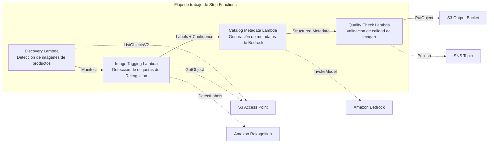

# UC11: Comercio minorista / Comercio electrónico — Etiquetado automático de imágenes de productos y generación de metadatos de catálogo

🌐 **Language / 言語**: [日本語](README.md) | [English](README.en.md) | [한국어](README.ko.md) | [简体中文](README.zh-CN.md) | [繁體中文](README.zh-TW.md) | [Français](README.fr.md) | [Deutsch](README.de.md) | Español

📚 **Documentación**: [Diagrama de arquitectura](docs/architecture.es.md) | [Guía de demostración](docs/demo-guide.es.md)

## Descripción general

Un flujo de trabajo serverless que aprovecha los S3 Access Points de FSx for ONTAP para automatizar el etiquetado de imágenes de productos, la generación de metadatos de catálogo y las comprobaciones de calidad de imagen.

### Cuándo es adecuado este patrón

- Ya hay un gran volumen de imágenes de productos acumuladas en FSx for ONTAP
- Desea realizar el etiquetado automático de imágenes de productos (categoría, color, material) con Rekognition
- Desea generar automáticamente metadatos de catálogo estructurados (product_category, color, material, style_attributes)
- Se requiere la validación automática de métricas de calidad de imagen (resolución, tamaño de archivo, relación de aspecto)
- Desea automatizar la gestión de indicadores de revisión manual para etiquetas de baja confianza

### Cuándo no es adecuado este patrón

- Procesamiento de imágenes de productos en tiempo real (API Gateway + Lambda es más adecuado)
- Conversión y cambio de tamaño de imágenes a gran escala (MediaConvert / EC2 es más adecuado)
- Se requiere la integración directa con un sistema PIM (Product Information Management) existente
- Entornos en los que no se puede garantizar la accesibilidad de red a la API REST de ONTAP

### Funciones principales

- Detección automática de imágenes de productos (.jpg, .jpeg, .png, .webp) a través del S3 AP
- Detección de etiquetas y obtención de puntuaciones de confianza con Rekognition DetectLabels
- Establecimiento de un indicador de revisión manual cuando la confianza está por debajo del umbral (predeterminado: 70 %)
- Generación de metadatos de catálogo estructurados con Bedrock
- Validación de métricas de calidad de imagen (resolución mínima, rango de tamaño de archivo, relación de aspecto)

## Success Metrics

### Outcome
Reducir el esfuerzo de actualización del sitio de comercio electrónico mediante la automatización del etiquetado de imágenes de productos y la generación de metadatos de catálogo.

### Metrics
| Métrica | Valor objetivo (ejemplo) |
|-----------|------------|
| Imágenes procesadas / ejecución | > 500 images |
| Precisión de detección de etiquetas | > 90 % |
| Tasa de éxito de generación de metadatos | > 95 % |
| Tiempo de procesamiento / imagen | < 10 segundos |
| Coste / ejecución | < 5 $ |
| Tasa de objetos en Human Review | < 10 % (etiquetas de baja confianza) |

### Measurement Method
Historial de ejecución de Step Functions, Rekognition label confidence, metadatos de salida de S3, CloudWatch Metrics.

## Arquitectura



### Pasos del flujo de trabajo

1. **Discovery**: detecta archivos .jpg, .jpeg, .png, .webp desde el S3 AP
2. **Image Tagging**: detecta etiquetas con Rekognition; establece un indicador de revisión manual para todo lo que esté por debajo del umbral de confianza
3. **Catalog Metadata**: genera metadatos de catálogo estructurados con Bedrock
4. **Quality Check**: valida las métricas de calidad de imagen y marca las imágenes por debajo de los umbrales

## Requisitos previos

- Una cuenta de AWS y los permisos de IAM adecuados
- Un sistema de archivos FSx for ONTAP (ONTAP 9.17.1P4D3 o posterior)
- Un volumen con S3 Access Point habilitado (que almacena las imágenes de productos)
- Una VPC y subredes privadas
- Acceso a modelos de Amazon Bedrock habilitado (Claude / Nova)

## Procedimiento de implementación

### 1. Implementación con SAM

```bash
# Requisito previo: se requiere AWS SAM CLI. 'sam build' empaqueta automáticamente el código y la capa compartida.
sam build

sam deploy \
  --stack-name fsxn-retail-catalog \
  --parameter-overrides \
    S3AccessPointAlias=<your-volume-ext-s3alias> \
    S3AccessPointName=<your-s3ap-name> \
    VpcId=<your-vpc-id> \
    PrivateSubnetIds=<subnet-1>,<subnet-2> \
    ScheduleExpression="rate(1 hour)" \
    NotificationEmail=<your-email@example.com> \
    EnableVpcEndpoints=false \
    EnableCloudWatchAlarms=false \
  --capabilities CAPABILITY_NAMED_IAM \
  --resolve-s3 \
  --region ap-northeast-1
```

> **Nota**: `template.yaml` se utiliza con la SAM CLI (`sam build` + `sam deploy`).
> Para implementar directamente con el comando `aws cloudformation deploy`, utilice en su lugar `template-deploy.yaml` (requiere empaquetar previamente los archivos zip de Lambda y subirlos a S3).

## Lista de parámetros de configuración

| Parámetro | Descripción | Predeterminado | Obligatorio |
|-----------|------|----------|------|
| `S3AccessPointAlias` | FSx for ONTAP S3 AP Alias (para la entrada) | — | ✅ |
| `S3AccessPointName` | Nombre del S3 AP (para la concesión de permisos de IAM basada en ARN. Si se omite, solo basada en Alias) | `""` | ⚠️ Recomendado |
| `ScheduleExpression` | Expresión de programación de EventBridge Scheduler | `rate(1 hour)` | |
| `VpcId` | ID de VPC | — | ✅ |
| `PrivateSubnetIds` | Lista de ID de subredes privadas | — | ✅ |
| `NotificationEmail` | Dirección de correo electrónico de destino de las notificaciones SNS | — | ✅ |
| `ConfidenceThreshold` | Umbral de confianza de las etiquetas de Rekognition (%) | `70` | |
| `MapConcurrency` | Número de ejecuciones paralelas del estado Map | `10` | |
| `LambdaMemorySize` | Tamaño de memoria de Lambda (MB) | `512` | |
| `LambdaTimeout` | Tiempo de espera de Lambda (segundos) | `300` | |
| `EnableVpcEndpoints` | Habilitar Interface VPC Endpoints | `false` | |
| `EnableCloudWatchAlarms` | Habilitar CloudWatch Alarms | `false` | |

## Limpieza

```bash
aws s3 rm s3://fsxn-retail-catalog-output-${AWS_ACCOUNT_ID} --recursive

aws cloudformation delete-stack \
  --stack-name fsxn-retail-catalog \
  --region ap-northeast-1

aws cloudformation wait stack-delete-complete \
  --stack-name fsxn-retail-catalog \
  --region ap-northeast-1
```

## Enlaces de referencia

- [Descripción general de los S3 Access Points para FSx for ONTAP](https://docs.aws.amazon.com/fsx/latest/ONTAPGuide/accessing-data-via-s3-access-points.html)
- [Amazon Rekognition DetectLabels](https://docs.aws.amazon.com/rekognition/latest/dg/labels-detect-labels-image.html)
- [Referencia de la API de Amazon Bedrock](https://docs.aws.amazon.com/bedrock/latest/APIReference/API_runtime_InvokeModel.html)
- [Guía de selección Streaming vs Polling](../docs/streaming-vs-polling-guide.md)

## Modo de streaming Kinesis (Phase 3)

En la Phase 3, además del polling de EventBridge, puede optar por un **procesamiento en tiempo casi real con Kinesis Data Streams**.

### Activación

```bash
# Requisito previo: se requiere AWS SAM CLI. 'sam build' empaqueta automáticamente el código y la capa compartida.
sam build

sam deploy \
  --stack-name fsxn-retail-catalog \
  --parameter-overrides \
    EnableStreamingMode=true \
    ... # otros parámetros
  --capabilities CAPABILITY_NAMED_IAM \
  --resolve-s3
```

### Arquitectura del modo de streaming

```
EventBridge (rate(1 min)) → Stream Producer Lambda
  → Comparación con la tabla de estado de DynamoDB → Detección de cambios
  → Kinesis Data Stream → Stream Consumer Lambda
  → Pipeline existente ImageTagging + CatalogMetadata
```

### Características principales

- **Detección de cambios**: compara cada minuto la lista de objetos del S3 AP con la tabla de estado de DynamoDB para detectar archivos nuevos, modificados y eliminados
- **Procesamiento idempotente**: evita el procesamiento duplicado con DynamoDB conditional writes
- **Gestión de fallos**: pone en cuarentena los registros fallidos mediante bisect-on-error + una tabla dead-letter de DynamoDB
- **Coexistencia con la ruta existente**: la ruta de polling (EventBridge + Step Functions) permanece sin cambios. Es posible una operación híbrida

### Selección de patrón

Para saber qué patrón elegir, consulte la [Guía de selección Streaming vs Polling](../docs/streaming-vs-polling-guide.md).

## Supported Regions

UC11 utiliza los siguientes servicios:

| Servicio | Restricción de región |
|---------|-------------|
| Amazon Rekognition | Disponible en casi todas las regiones |
| Amazon Bedrock | Compruebe las regiones compatibles ([Regiones compatibles con Bedrock](https://docs.aws.amazon.com/general/latest/gr/bedrock.html)) |
| Kinesis Data Streams | Disponible en casi todas las regiones (el precio de los shards varía según la región) |
| AWS X-Ray | Disponible en casi todas las regiones |
| CloudWatch EMF | Disponible en casi todas las regiones |

> Al habilitar el modo de streaming Kinesis, tenga en cuenta que el precio de los shards varía según la región. Consulte la [Matriz de compatibilidad de regiones](../docs/region-compatibility.md) para obtener más detalles.

---

## Enlaces a la documentación de AWS

| Servicio | Documentación |
|---------|------------|
| FSx for ONTAP | [Guía del usuario](https://docs.aws.amazon.com/fsx/latest/ONTAPGuide/what-is-fsx-ontap.html) |
| S3 Access Points | [S3 AP for FSx for ONTAP](https://docs.aws.amazon.com/fsx/latest/ONTAPGuide/s3-access-points.html) |
| Step Functions | [Guía para desarrolladores](https://docs.aws.amazon.com/step-functions/latest/dg/welcome.html) |
| Amazon Rekognition | [Guía para desarrolladores](https://docs.aws.amazon.com/rekognition/latest/dg/what-is.html) |
| Amazon Kinesis | [Guía para desarrolladores](https://docs.aws.amazon.com/streams/latest/dev/introduction.html) |
| Amazon Bedrock | [Guía del usuario](https://docs.aws.amazon.com/bedrock/latest/userguide/what-is-bedrock.html) |

### Alineación con el Well-Architected Framework

| Pilar | Alineación |
|----|------|
| Excelencia operativa | X-Ray, EMF, métricas de Kinesis, supervisión de DLQ |
| Seguridad | IAM de privilegio mínimo, cifrado KMS, control de acceso a datos de productos |
| Fiabilidad | Kinesis bisect-on-error, DLQ, Step Functions Retry |
| Eficiencia del rendimiento | Procesamiento en streaming, etiquetado de imágenes en paralelo |
| Optimización de costes | Serverless, modo Kinesis On-Demand |
| Sostenibilidad | Procesamiento incremental (solo imágenes modificadas), gestión de estado de DynamoDB |

---

## Estimación de costes (aproximación mensual)

> **Nota**: los valores siguientes son aproximaciones para la región ap-northeast-1; los costes reales varían según el uso. Compruebe los precios más recientes con la [AWS Pricing Calculator](https://calculator.aws/).

### Componentes serverless (facturación por uso)

| Servicio | Precio unitario | Uso supuesto | Aprox. mensual |
|---------|------|-----------|---------|
| Lambda | $0.0000166667/GB-sec | 6 funciones × 500 images/día | ~$1-5 |
| S3 API (GetObject/ListObjects) | $0.0047/10K requests | ~10K requests/día | ~$1.5 |
| Step Functions | $0.025/1K state transitions | ~1K transitions/día | ~$0.75 |
| Bedrock (Nova Lite) | $0.00006/1K input tokens | ~50K tokens/ejecución | ~$3-10 |
| Athena | $5/TB scanned | ~10 MB/consulta | ~$0.5-2 |
| SNS | $0.50/100K notifications | ~100 notifications/día | ~$0.15 |
| CloudWatch Logs | $0.76/GB ingested | ~1 GB/mes | ~$0.76 |
| Kinesis Data Stream (opcional) | $0.015/shard-hour |

### Costes fijos (FSx for ONTAP — asumiendo un entorno existente)

| Componente | Mensual |
|--------------|------|
| FSx for ONTAP (128 MBps, 1 TB) | ~$230 (entorno existente compartido) |
| S3 Access Point | Sin cargo adicional (solo cargos de S3 API) |

### Aproximación total

| Configuración | Aprox. mensual |
|------|---------|
| Configuración mínima (una vez al día) | ~$5-15 |
| Configuración estándar (por hora) | ~$15-50 |
| Configuración a gran escala (alta frecuencia + alarmas) | ~$50-150 |

> **Governance Caveat**: las estimaciones de costes son aproximaciones y no valores garantizados. El importe facturado real varía según los patrones de uso, el volumen de datos y la región.

---

## Pruebas locales

### Comprobación de Prerequisites

```bash
# Verificar los requisitos previos
aws --version          # AWS CLI v2
sam --version          # SAM CLI
python3 --version      # Python 3.9+
docker --version       # Docker (para sam local)
aws sts get-caller-identity  # Credenciales de AWS
```

### sam local invoke

```bash
# Build
# Requisito previo: se requiere AWS SAM CLI. 'sam build' empaqueta automáticamente el código y la capa compartida.
sam build

# Ejecutar la Discovery Lambda en local
sam local invoke DiscoveryFunction --event events/discovery-event.json

# Con anulación de variables de entorno
sam local invoke DiscoveryFunction \
  --event events/discovery-event.json \
  --env-vars env.json
```

### Pruebas unitarias

```bash
python3 -m pytest tests/ -v
```

Para obtener más detalles, consulte el [Inicio rápido de pruebas locales](../docs/local-testing-quick-start.md).

---

## Ejemplo de salida (Output Sample)

Ejemplo de salida del pipeline de etiquetado de imágenes de productos:

```json
{
  "discovery": {
    "status": "completed",
    "object_count": 50,
    "prefix": "product-images/"
  },
  "tagging_results": [
    {
      "key": "product-images/SKU-12345.jpg",
      "labels": [
        {"name": "Dress", "confidence": 0.98},
        {"name": "Red", "confidence": 0.95},
        {"name": "Summer", "confidence": 0.87}
      ],
      "category": "Apparel/Dresses",
      "catalog_metadata": {
        "color": "red",
        "season": "summer",
        "style": "casual"
      }
    }
  ],
  "report": {
    "total_processed": 50,
    "auto_tagged": 47,
    "requires_review": 3,
    "output_prefix": "s3://output-bucket/catalog-metadata/"
  }
}
```

> **Nota**: lo anterior es una salida de ejemplo; los valores reales varían según el entorno y los datos de entrada. Las cifras de benchmark son una sizing reference, no un service limit.

---

## Governance Note

> Este patrón proporciona orientación de arquitectura técnica. No constituye asesoramiento legal, de cumplimiento ni regulatorio. Las organizaciones deben consultar a profesionales cualificados.

---

## S3AP Compatibility

Para conocer las restricciones de compatibilidad, la resolución de problemas y los patrones de activación de los S3 Access Points para FSx for ONTAP, consulte las [S3AP Compatibility Notes](../docs/s3ap-compatibility-notes.md).
