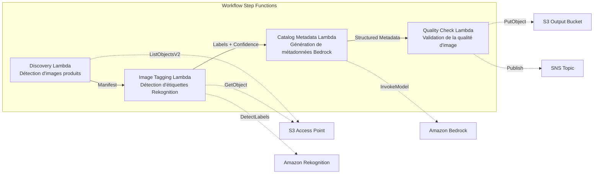

# UC11 : Commerce de détail / E-commerce — Étiquetage automatique des images produits et génération de métadonnées de catalogue

🌐 **Language / 言語**: [日本語](README.md) | [English](README.en.md) | [한국어](README.ko.md) | [简体中文](README.zh-CN.md) | [繁體中文](README.zh-TW.md) | Français | [Deutsch](README.de.md) | [Español](README.es.md)

📚 **Documentation** : [Schéma d'architecture](docs/architecture.fr.md) | [Guide de démonstration](docs/demo-guide.fr.md)

## Vue d'ensemble

Un workflow serverless qui exploite les S3 Access Points de FSx for ONTAP pour automatiser l'étiquetage des images produits, la génération de métadonnées de catalogue et les contrôles de qualité des images.

### Cas où ce pattern est adapté

- Un grand nombre d'images produits sont déjà accumulées sur FSx for ONTAP
- Vous souhaitez réaliser un étiquetage automatique des images produits (catégorie, couleur, matière) avec Rekognition
- Vous souhaitez générer automatiquement des métadonnées de catalogue structurées (product_category, color, material, style_attributes)
- Une validation automatique des métriques de qualité d'image (résolution, taille de fichier, ratio d'aspect) est nécessaire
- Vous souhaitez automatiser la gestion des indicateurs de revue manuelle pour les étiquettes à faible confiance

### Cas où ce pattern n'est pas adapté

- Traitement d'images produits en temps réel (API Gateway + Lambda est plus adapté)
- Conversion et redimensionnement d'images à grande échelle (MediaConvert / EC2 est plus adapté)
- Une intégration directe avec un système PIM (Product Information Management) existant est requise
- Environnements où l'accessibilité réseau à l'API REST ONTAP ne peut pas être assurée

### Fonctionnalités principales

- Détection automatique des images produits (.jpg, .jpeg, .png, .webp) via le S3 AP
- Détection d'étiquettes et obtention des scores de confiance avec Rekognition DetectLabels
- Définition d'un indicateur de revue manuelle lorsque la confiance est inférieure au seuil (par défaut : 70 %)
- Génération de métadonnées de catalogue structurées avec Bedrock
- Validation des métriques de qualité d'image (résolution minimale, plage de taille de fichier, ratio d'aspect)

## Success Metrics

### Outcome
Réduire l'effort de mise à jour du site e-commerce en automatisant l'étiquetage des images produits et la génération de métadonnées de catalogue.

### Metrics
| Métrique | Valeur cible (exemple) |
|-----------|------------|
| Images traitées / exécution | > 500 images |
| Précision de détection d'étiquettes | > 90 % |
| Taux de réussite de génération de métadonnées | > 95 % |
| Temps de traitement / image | < 10 secondes |
| Coût / exécution | < 5 $ |
| Taux d'objets en Human Review | < 10 % (étiquettes à faible confiance) |

### Measurement Method
Historique d'exécution de Step Functions, Rekognition label confidence, métadonnées de sortie S3, CloudWatch Metrics.

## Architecture



### Étapes du workflow

1. **Discovery** : détecte les fichiers .jpg, .jpeg, .png, .webp depuis le S3 AP
2. **Image Tagging** : détecte les étiquettes avec Rekognition ; définit un indicateur de revue manuelle pour tout ce qui est en dessous du seuil de confiance
3. **Catalog Metadata** : génère des métadonnées de catalogue structurées avec Bedrock
4. **Quality Check** : valide les métriques de qualité d'image et signale les images en dessous des seuils

## Prérequis

- Un compte AWS et les autorisations IAM appropriées
- Un système de fichiers FSx for ONTAP (ONTAP 9.17.1P4D3 ou version ultérieure)
- Un volume avec S3 Access Point activé (stockant les images produits)
- Un VPC et des sous-réseaux privés
- Accès aux modèles Amazon Bedrock activé (Claude / Nova)

## Procédure de déploiement

### 1. Déploiement SAM

```bash
# Prérequis : AWS SAM CLI est requis. 'sam build' package automatiquement le code et la couche partagée.
sam build

sam deploy \
  --stack-name fsxn-retail-catalog \
  --parameter-overrides \
    S3AccessPointAlias=<your-volume-ext-s3alias> \
    S3AccessPointName=<your-s3ap-name> \
    VpcId=<your-vpc-id> \
    PrivateSubnetIds=<subnet-1>,<subnet-2> \
    ScheduleExpression="rate(1 hour)" \
    NotificationEmail=<your-email@example.com> \
    EnableVpcEndpoints=false \
    EnableCloudWatchAlarms=false \
  --capabilities CAPABILITY_NAMED_IAM \
  --resolve-s3 \
  --region ap-northeast-1
```

> **Remarque** : `template.yaml` s'utilise avec la SAM CLI (`sam build` + `sam deploy`).
> Pour déployer directement avec la commande `aws cloudformation deploy`, utilisez plutôt `template-deploy.yaml` (nécessite le pré-packaging des fichiers zip Lambda et leur téléversement sur S3).

## Liste des paramètres de configuration

| Paramètre | Description | Par défaut | Requis |
|-----------|------|----------|------|
| `S3AccessPointAlias` | Alias FSx for ONTAP S3 AP (pour l'entrée) | — | ✅ |
| `S3AccessPointName` | Nom du S3 AP (pour l'octroi d'autorisations IAM basées sur l'ARN. En cas d'omission, basé uniquement sur l'Alias) | `""` | ⚠️ Recommandé |
| `ScheduleExpression` | Expression de planification d'EventBridge Scheduler | `rate(1 hour)` | |
| `VpcId` | ID du VPC | — | ✅ |
| `PrivateSubnetIds` | Liste des ID de sous-réseaux privés | — | ✅ |
| `NotificationEmail` | Adresse e-mail de destination des notifications SNS | — | ✅ |
| `ConfidenceThreshold` | Seuil de confiance des étiquettes Rekognition (%) | `70` | |
| `MapConcurrency` | Nombre d'exécutions parallèles de l'état Map | `10` | |
| `LambdaMemorySize` | Taille de la mémoire Lambda (Mo) | `512` | |
| `LambdaTimeout` | Délai d'expiration Lambda (secondes) | `300` | |
| `EnableVpcEndpoints` | Activer les Interface VPC Endpoints | `false` | |
| `EnableCloudWatchAlarms` | Activer les CloudWatch Alarms | `false` | |

## Nettoyage

```bash
aws s3 rm s3://fsxn-retail-catalog-output-${AWS_ACCOUNT_ID} --recursive

aws cloudformation delete-stack \
  --stack-name fsxn-retail-catalog \
  --region ap-northeast-1

aws cloudformation wait stack-delete-complete \
  --stack-name fsxn-retail-catalog \
  --region ap-northeast-1
```

## Liens de référence

- [Présentation des S3 Access Points pour FSx for ONTAP](https://docs.aws.amazon.com/fsx/latest/ONTAPGuide/accessing-data-via-s3-access-points.html)
- [Amazon Rekognition DetectLabels](https://docs.aws.amazon.com/rekognition/latest/dg/labels-detect-labels-image.html)
- [Référence de l'API Amazon Bedrock](https://docs.aws.amazon.com/bedrock/latest/APIReference/API_runtime_InvokeModel.html)
- [Guide de choix Streaming vs Polling](../docs/streaming-vs-polling-guide.md)

## Mode streaming Kinesis (Phase 3)

En Phase 3, en plus du polling EventBridge, vous pouvez activer en option un **traitement en quasi-temps réel avec Kinesis Data Streams**.

### Activation

```bash
# Prérequis : AWS SAM CLI est requis. 'sam build' package automatiquement le code et la couche partagée.
sam build

sam deploy \
  --stack-name fsxn-retail-catalog \
  --parameter-overrides \
    EnableStreamingMode=true \
    ... # autres paramètres
  --capabilities CAPABILITY_NAMED_IAM \
  --resolve-s3
```

### Architecture du mode streaming

```
EventBridge (rate(1 min)) → Stream Producer Lambda
  → Comparaison avec la table d'état DynamoDB → Détection de changement
  → Kinesis Data Stream → Stream Consumer Lambda
  → Pipeline existant ImageTagging + CatalogMetadata
```

### Caractéristiques principales

- **Détection de changement** : compare toutes les minutes la liste des objets du S3 AP avec la table d'état DynamoDB pour détecter les fichiers nouveaux, modifiés et supprimés
- **Traitement idempotent** : prévient le traitement en double grâce aux DynamoDB conditional writes
- **Gestion des défaillances** : met en quarantaine les enregistrements en échec avec bisect-on-error + une table dead-letter DynamoDB
- **Coexistence avec le chemin existant** : le chemin de polling (EventBridge + Step Functions) reste inchangé. Une exploitation hybride est possible

### Sélection du pattern

Pour savoir quel pattern choisir, consultez le [Guide de choix Streaming vs Polling](../docs/streaming-vs-polling-guide.md).

## Supported Regions

UC11 utilise les services suivants :

| Service | Contrainte de région |
|---------|-------------|
| Amazon Rekognition | Disponible dans presque toutes les régions |
| Amazon Bedrock | Vérifiez les régions prises en charge ([Régions prises en charge par Bedrock](https://docs.aws.amazon.com/general/latest/gr/bedrock.html)) |
| Kinesis Data Streams | Disponible dans presque toutes les régions (la tarification des shards varie selon la région) |
| AWS X-Ray | Disponible dans presque toutes les régions |
| CloudWatch EMF | Disponible dans presque toutes les régions |

> Lors de l'activation du mode streaming Kinesis, notez que la tarification des shards varie selon la région. Consultez la [Matrice de compatibilité des régions](../docs/region-compatibility.md) pour plus de détails.

---

## Liens vers la documentation AWS

| Service | Documentation |
|---------|------------|
| FSx for ONTAP | [Guide de l'utilisateur](https://docs.aws.amazon.com/fsx/latest/ONTAPGuide/what-is-fsx-ontap.html) |
| S3 Access Points | [S3 AP for FSx for ONTAP](https://docs.aws.amazon.com/fsx/latest/ONTAPGuide/s3-access-points.html) |
| Step Functions | [Guide du développeur](https://docs.aws.amazon.com/step-functions/latest/dg/welcome.html) |
| Amazon Rekognition | [Guide du développeur](https://docs.aws.amazon.com/rekognition/latest/dg/what-is.html) |
| Amazon Kinesis | [Guide du développeur](https://docs.aws.amazon.com/streams/latest/dev/introduction.html) |
| Amazon Bedrock | [Guide de l'utilisateur](https://docs.aws.amazon.com/bedrock/latest/userguide/what-is-bedrock.html) |

### Conformité au Well-Architected Framework

| Pilier | Conformité |
|----|------|
| Excellence opérationnelle | X-Ray, EMF, métriques Kinesis, surveillance DLQ |
| Sécurité | IAM à moindre privilège, chiffrement KMS, contrôle d'accès aux données produits |
| Fiabilité | Kinesis bisect-on-error, DLQ, Step Functions Retry |
| Efficacité des performances | Traitement en streaming, étiquetage d'images en parallèle |
| Optimisation des coûts | Serverless, mode Kinesis On-Demand |
| Durabilité | Traitement incrémental (images modifiées uniquement), gestion de l'état DynamoDB |

---

## Estimation des coûts (approximation mensuelle)

> **Note** : les valeurs ci-dessous sont des approximations pour la région ap-northeast-1 ; les coûts réels varient selon l'utilisation. Vérifiez les tarifs les plus récents avec l'[AWS Pricing Calculator](https://calculator.aws/).

### Composants serverless (facturation à l'usage)

| Service | Prix unitaire | Utilisation supposée | Approx. mensuelle |
|---------|------|-----------|---------|
| Lambda | $0.0000166667/GB-sec | 6 fonctions × 500 images/jour | ~$1-5 |
| S3 API (GetObject/ListObjects) | $0.0047/10K requests | ~10K requests/jour | ~$1.5 |
| Step Functions | $0.025/1K state transitions | ~1K transitions/jour | ~$0.75 |
| Bedrock (Nova Lite) | $0.00006/1K input tokens | ~50K tokens/exécution | ~$3-10 |
| Athena | $5/TB scanned | ~10 MB/requête | ~$0.5-2 |
| SNS | $0.50/100K notifications | ~100 notifications/jour | ~$0.15 |
| CloudWatch Logs | $0.76/GB ingested | ~1 GB/mois | ~$0.76 |
| Kinesis Data Stream (optionnel) | $0.015/shard-hour |

### Coûts fixes (FSx for ONTAP — en supposant un environnement existant)

| Composant | Mensuel |
|--------------|------|
| FSx for ONTAP (128 MBps, 1 To) | ~$230 (environnement existant partagé) |
| S3 Access Point | Aucun frais supplémentaire (frais S3 API uniquement) |

### Total approximatif

| Configuration | Approx. mensuelle |
|------|---------|
| Configuration minimale (1 exécution par jour) | ~$5-15 |
| Configuration standard (exécution horaire) | ~$15-50 |
| Configuration à grande échelle (haute fréquence + alarmes) | ~$50-150 |

> **Governance Caveat** : les estimations de coûts sont des approximations et ne constituent pas des valeurs garanties. Le montant réel facturé varie selon les modèles d'utilisation, le volume de données et la région.

---

## Tests locaux

### Vérification des Prerequisites

```bash
# Vérifier les prérequis
aws --version          # AWS CLI v2
sam --version          # SAM CLI
python3 --version      # Python 3.9+
docker --version       # Docker (pour sam local)
aws sts get-caller-identity  # Informations d'identification AWS
```

### sam local invoke

```bash
# Build
# Prérequis : AWS SAM CLI est requis. 'sam build' package automatiquement le code et la couche partagée.
sam build

# Exécuter la Discovery Lambda en local
sam local invoke DiscoveryFunction --event events/discovery-event.json

# Avec surcharge des variables d'environnement
sam local invoke DiscoveryFunction \
  --event events/discovery-event.json \
  --env-vars env.json
```

### Tests unitaires

```bash
python3 -m pytest tests/ -v
```

Pour plus de détails, consultez le [Démarrage rapide des tests locaux](../docs/local-testing-quick-start.md).

---

## Exemple de sortie (Output Sample)

Exemple de sortie du pipeline d'étiquetage des images produits :

```json
{
  "discovery": {
    "status": "completed",
    "object_count": 50,
    "prefix": "product-images/"
  },
  "tagging_results": [
    {
      "key": "product-images/SKU-12345.jpg",
      "labels": [
        {"name": "Dress", "confidence": 0.98},
        {"name": "Red", "confidence": 0.95},
        {"name": "Summer", "confidence": 0.87}
      ],
      "category": "Apparel/Dresses",
      "catalog_metadata": {
        "color": "red",
        "season": "summer",
        "style": "casual"
      }
    }
  ],
  "report": {
    "total_processed": 50,
    "auto_tagged": 47,
    "requires_review": 3,
    "output_prefix": "s3://output-bucket/catalog-metadata/"
  }
}
```

> **Note** : ce qui précède est un exemple de sortie ; les valeurs réelles varient selon l'environnement et les données d'entrée. Les chiffres de benchmark sont une sizing reference, pas une service limit.

---

## Governance Note

> Ce pattern fournit des orientations d'architecture technique. Il ne constitue pas un conseil juridique, de conformité ou réglementaire. Les organisations doivent consulter des professionnels qualifiés.

---

## S3AP Compatibility

Pour les contraintes de compatibilité, le dépannage et les patterns de déclenchement des S3 Access Points pour FSx for ONTAP, consultez les [S3AP Compatibility Notes](../docs/s3ap-compatibility-notes.md).
