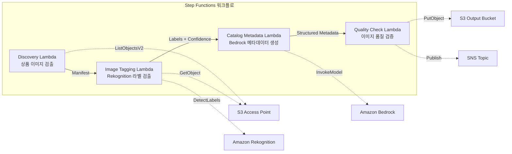

# UC11: 리테일 / 이커머스 — 상품 이미지 자동 태깅 및 카탈로그 메타데이터 생성

🌐 **Language / 言語**: [日本語](README.md) | [English](README.en.md) | 한국어 | [简体中文](README.zh-CN.md) | [繁體中文](README.zh-TW.md) | [Français](README.fr.md) | [Deutsch](README.de.md) | [Español](README.es.md)

📚 **문서**: [아키텍처 다이어그램](docs/architecture.ko.md) | [데모 가이드](docs/demo-guide.ko.md)

## 개요

FSx for ONTAP의 S3 Access Points를 활용하여 상품 이미지 자동 태깅, 카탈로그 메타데이터 생성, 이미지 품질 검사를 자동화하는 서버리스 워크플로입니다.

### 이 패턴이 적합한 경우

- 상품 이미지가 FSx for ONTAP에 대량으로 축적되어 있음
- Rekognition을 통한 상품 이미지 자동 라벨링(카테고리, 색상, 소재)을 수행하고 싶음
- 구조화된 카탈로그 메타데이터(product_category, color, material, style_attributes)를 자동 생성하고 싶음
- 이미지 품질 메트릭(해상도, 파일 크기, 종횡비)의 자동 검증이 필요함
- 낮은 신뢰도 라벨의 수동 검토 플래그 관리를 자동화하고 싶음

### 이 패턴이 적합하지 않은 경우

- 실시간 상품 이미지 처리(API Gateway + Lambda가 적합)
- 대규모 이미지 변환·리사이즈 처리(MediaConvert / EC2가 적합)
- 기존 PIM(Product Information Management) 시스템과의 직접 통합이 필요함
- ONTAP REST API에 대한 네트워크 도달성을 확보할 수 없는 환경

### 주요 기능

- S3 AP를 통해 상품 이미지(.jpg, .jpeg, .png, .webp)를 자동 검출
- Rekognition DetectLabels를 통한 라벨 검출 및 신뢰도 점수 취득
- 신뢰도 임계값(기본값: 70%) 미만인 경우 수동 검토 플래그 설정
- Bedrock을 통한 구조화된 카탈로그 메타데이터 생성
- 이미지 품질 메트릭 검증(최소 해상도, 파일 크기 범위, 종횡비)

## Success Metrics

### Outcome
상품 이미지 태깅·카탈로그 메타데이터 생성 자동화를 통해 이커머스 사이트 업데이트 공수를 절감합니다.

### Metrics
| 메트릭 | 목표값(예시) |
|-----------|------------|
| 처리된 이미지 수 / 실행 | > 500 images |
| 라벨 검출 정확도 | > 90% |
| 메타데이터 생성 성공률 | > 95% |
| 처리 시간 / 이미지 | < 10 초 |
| 비용 / 실행 | < $5 |
| Human Review 대상 비율 | < 10%(낮은 신뢰도 라벨) |

### Measurement Method
Step Functions 실행 이력, Rekognition label confidence, S3 출력 메타데이터, CloudWatch Metrics.

## 아키텍처



### 워크플로 단계

1. **Discovery**: S3 AP에서 .jpg, .jpeg, .png, .webp 파일을 검출
2. **Image Tagging**: Rekognition으로 라벨 검출, 신뢰도 임계값 미만은 수동 검토 플래그 설정
3. **Catalog Metadata**: Bedrock으로 구조화된 카탈로그 메타데이터를 생성
4. **Quality Check**: 이미지 품질 메트릭을 검증하고 임계값 미만 이미지를 플래그

## 전제 조건

- AWS 계정 및 적절한 IAM 권한
- FSx for ONTAP 파일 시스템(ONTAP 9.17.1P4D3 이상)
- S3 Access Point가 활성화된 볼륨(상품 이미지 저장)
- VPC, 프라이빗 서브넷
- Amazon Bedrock 모델 액세스 활성화(Claude / Nova)

## 배포 절차

### 1. SAM 배포

```bash
# 전제: AWS SAM CLI가 필요합니다. sam build가 코드와 공유 레이어를 자동으로 패키징합니다.
sam build

sam deploy \
  --stack-name fsxn-retail-catalog \
  --parameter-overrides \
    S3AccessPointAlias=<your-volume-ext-s3alias> \
    S3AccessPointName=<your-s3ap-name> \
    VpcId=<your-vpc-id> \
    PrivateSubnetIds=<subnet-1>,<subnet-2> \
    ScheduleExpression="rate(1 hour)" \
    NotificationEmail=<your-email@example.com> \
    EnableVpcEndpoints=false \
    EnableCloudWatchAlarms=false \
  --capabilities CAPABILITY_NAMED_IAM \
  --resolve-s3 \
  --region ap-northeast-1
```

> **참고**: `template.yaml`은 SAM CLI(`sam build` + `sam deploy`)로 사용합니다.
> `aws cloudformation deploy` 명령으로 직접 배포하는 경우 `template-deploy.yaml`을 사용하세요(Lambda zip 파일의 사전 패키징과 S3 업로드가 필요합니다).

## 설정 파라미터 목록

| 파라미터 | 설명 | 기본값 | 필수 |
|-----------|------|----------|------|
| `S3AccessPointAlias` | FSx for ONTAP S3 AP Alias(입력용) | — | ✅ |
| `S3AccessPointName` | S3 AP 이름(ARN 기반 IAM 권한 부여용. 생략 시 Alias 기반만) | `""` | ⚠️ 권장 |
| `ScheduleExpression` | EventBridge Scheduler 스케줄 표현식 | `rate(1 hour)` | |
| `VpcId` | VPC ID | — | ✅ |
| `PrivateSubnetIds` | 프라이빗 서브넷 ID 목록 | — | ✅ |
| `NotificationEmail` | SNS 알림 대상 이메일 주소 | — | ✅ |
| `ConfidenceThreshold` | Rekognition 라벨 신뢰도 임계값 (%) | `70` | |
| `MapConcurrency` | Map 상태의 병렬 실행 수 | `10` | |
| `LambdaMemorySize` | Lambda 메모리 크기 (MB) | `512` | |
| `LambdaTimeout` | Lambda 타임아웃 (초) | `300` | |
| `EnableVpcEndpoints` | Interface VPC Endpoints 활성화 | `false` | |
| `EnableCloudWatchAlarms` | CloudWatch Alarms 활성화 | `false` | |

## 정리

```bash
aws s3 rm s3://fsxn-retail-catalog-output-${AWS_ACCOUNT_ID} --recursive

aws cloudformation delete-stack \
  --stack-name fsxn-retail-catalog \
  --region ap-northeast-1

aws cloudformation wait stack-delete-complete \
  --stack-name fsxn-retail-catalog \
  --region ap-northeast-1
```

## 참고 링크

- [FSx for ONTAP S3 Access Points 개요](https://docs.aws.amazon.com/fsx/latest/ONTAPGuide/accessing-data-via-s3-access-points.html)
- [Amazon Rekognition DetectLabels](https://docs.aws.amazon.com/rekognition/latest/dg/labels-detect-labels-image.html)
- [Amazon Bedrock API 레퍼런스](https://docs.aws.amazon.com/bedrock/latest/APIReference/API_runtime_InvokeModel.html)
- [스트리밍 vs 폴링 선택 가이드](../docs/streaming-vs-polling-guide.md)

## Kinesis 스트리밍 모드(Phase 3)

Phase 3에서는 EventBridge 폴링에 더해 **Kinesis Data Streams를 통한 준실시간 처리**를 옵트인으로 이용할 수 있습니다.

### 활성화

```bash
# 전제: AWS SAM CLI가 필요합니다. sam build가 코드와 공유 레이어를 자동으로 패키징합니다.
sam build

sam deploy \
  --stack-name fsxn-retail-catalog \
  --parameter-overrides \
    EnableStreamingMode=true \
    ... # 기타 파라미터
  --capabilities CAPABILITY_NAMED_IAM \
  --resolve-s3
```

### 스트리밍 모드 아키텍처

```
EventBridge (rate(1 min)) → Stream Producer Lambda
  → DynamoDB 상태 테이블과 비교 → 변경 감지
  → Kinesis Data Stream → Stream Consumer Lambda
  → 기존 ImageTagging + CatalogMetadata 파이프라인
```

### 주요 특징

- **변경 감지**: 1분 간격으로 S3 AP 객체 목록과 DynamoDB 상태 테이블을 비교하여 신규·변경·삭제 파일을 검출
- **멱등 처리**: DynamoDB conditional writes를 통한 중복 처리 방지
- **장애 처리**: bisect-on-error + DynamoDB dead-letter 테이블로 실패 레코드를 격리
- **기존 경로와의 공존**: 폴링 경로(EventBridge + Step Functions)는 변경 없음. 하이브리드 운영이 가능

### 패턴 선택

어떤 패턴을 선택해야 하는지는 [스트리밍 vs 폴링 선택 가이드](../docs/streaming-vs-polling-guide.md)를 참조하세요.

## Supported Regions

UC11은 다음 서비스를 사용합니다:

| 서비스 | 리전 제약 |
|---------|-------------|
| Amazon Rekognition | 거의 모든 리전에서 이용 가능 |
| Amazon Bedrock | 지원 리전 확인([Bedrock 지원 리전](https://docs.aws.amazon.com/general/latest/gr/bedrock.html)) |
| Kinesis Data Streams | 거의 모든 리전에서 이용 가능(샤드 요금은 리전에 따라 다름) |
| AWS X-Ray | 거의 모든 리전에서 이용 가능 |
| CloudWatch EMF | 거의 모든 리전에서 이용 가능 |

> Kinesis 스트리밍 모드를 활성화하는 경우 샤드 요금이 리전에 따라 다르다는 점에 유의하세요. 자세한 내용은 [리전 호환성 매트릭스](../docs/region-compatibility.md)를 참조하세요.

---

## AWS 문서 링크

| 서비스 | 문서 |
|---------|------------|
| FSx for ONTAP | [사용자 가이드](https://docs.aws.amazon.com/fsx/latest/ONTAPGuide/what-is-fsx-ontap.html) |
| S3 Access Points | [S3 AP for FSx for ONTAP](https://docs.aws.amazon.com/fsx/latest/ONTAPGuide/s3-access-points.html) |
| Step Functions | [개발자 가이드](https://docs.aws.amazon.com/step-functions/latest/dg/welcome.html) |
| Amazon Rekognition | [개발자 가이드](https://docs.aws.amazon.com/rekognition/latest/dg/what-is.html) |
| Amazon Kinesis | [개발자 가이드](https://docs.aws.amazon.com/streams/latest/dev/introduction.html) |
| Amazon Bedrock | [사용자 가이드](https://docs.aws.amazon.com/bedrock/latest/userguide/what-is-bedrock.html) |

### Well-Architected Framework 대응

| 기둥 | 대응 |
|----|------|
| 운영 우수성 | X-Ray, EMF, Kinesis 메트릭, DLQ 모니터링 |
| 보안 | 최소 권한 IAM, KMS 암호화, 상품 데이터 액세스 제어 |
| 신뢰성 | Kinesis bisect-on-error, DLQ, Step Functions Retry |
| 성능 효율성 | 스트리밍 처리, 병렬 이미지 태깅 |
| 비용 최적화 | 서버리스, Kinesis On-Demand 모드 |
| 지속 가능성 | 차분 처리(변경 이미지만), DynamoDB 상태 관리 |

---

## 비용 견적(월간 개산)

> **참고**: 아래는 ap-northeast-1 리전의 개산이며 실제 비용은 사용량에 따라 다릅니다. 최신 요금은 [AWS Pricing Calculator](https://calculator.aws/)에서 확인하세요.

### 서버리스 컴포넌트(종량 과금)

| 서비스 | 단가 | 예상 사용량 | 월간 개산 |
|---------|------|-----------|---------|
| Lambda | $0.0000166667/GB-sec | 6 함수 × 500 images/일 | ~$1-5 |
| S3 API (GetObject/ListObjects) | $0.0047/10K requests | ~10K requests/일 | ~$1.5 |
| Step Functions | $0.025/1K state transitions | ~1K transitions/일 | ~$0.75 |
| Bedrock (Nova Lite) | $0.00006/1K input tokens | ~50K tokens/실행 | ~$3-10 |
| Athena | $5/TB scanned | ~10 MB/쿼리 | ~$0.5-2 |
| SNS | $0.50/100K notifications | ~100 notifications/일 | ~$0.15 |
| CloudWatch Logs | $0.76/GB ingested | ~1 GB/월 | ~$0.76 |
| Kinesis Data Stream (옵션) | $0.015/shard-hour |

### 고정 비용(FSx for ONTAP — 기존 환경 전제)

| 컴포넌트 | 월간 |
|--------------|------|
| FSx for ONTAP (128 MBps, 1 TB) | ~$230 (기존 환경 공유) |
| S3 Access Point | 추가 요금 없음(S3 API 요금만) |

### 합계 개산

| 구성 | 월간 개산 |
|------|---------|
| 최소 구성(일 1회 실행) | ~$5-15 |
| 표준 구성(시간별 실행) | ~$15-50 |
| 대규모 구성(고빈도 + 알람) | ~$50-150 |

> **Governance Caveat**: 비용 견적은 개산이며 보장값이 아닙니다. 실제 청구액은 사용 패턴, 데이터 양, 리전에 따라 다릅니다.

---

## 로컬 테스트

### Prerequisites 확인

```bash
# 전제 조건 확인
aws --version          # AWS CLI v2
sam --version          # SAM CLI
python3 --version      # Python 3.9+
docker --version       # Docker (sam local 용)
aws sts get-caller-identity  # AWS 자격 증명
```

### sam local invoke

```bash
# 빌드
# 전제: AWS SAM CLI가 필요합니다. sam build가 코드와 공유 레이어를 자동으로 패키징합니다.
sam build

# Discovery Lambda 로컬 실행
sam local invoke DiscoveryFunction --event events/discovery-event.json

# 환경 변수 오버라이드 포함
sam local invoke DiscoveryFunction \
  --event events/discovery-event.json \
  --env-vars env.json
```

### 유닛 테스트

```bash
python3 -m pytest tests/ -v
```

자세한 내용은 [로컬 테스트 퀵 스타트](../docs/local-testing-quick-start.md)를 참조하세요.

---

## 출력 샘플 (Output Sample)

상품 이미지 태깅 파이프라인의 출력 예시:

```json
{
  "discovery": {
    "status": "completed",
    "object_count": 50,
    "prefix": "product-images/"
  },
  "tagging_results": [
    {
      "key": "product-images/SKU-12345.jpg",
      "labels": [
        {"name": "Dress", "confidence": 0.98},
        {"name": "Red", "confidence": 0.95},
        {"name": "Summer", "confidence": 0.87}
      ],
      "category": "Apparel/Dresses",
      "catalog_metadata": {
        "color": "red",
        "season": "summer",
        "style": "casual"
      }
    }
  ],
  "report": {
    "total_processed": 50,
    "auto_tagged": 47,
    "requires_review": 3,
    "output_prefix": "s3://output-bucket/catalog-metadata/"
  }
}
```

> **참고**: 위는 샘플 출력이며 실제 값은 환경·입력 데이터에 따라 다릅니다. 벤치마크 수치는 sizing reference이며 service limit이 아닙니다.

---

## Governance Note

> 본 패턴은 기술 아키텍처 가이던스를 제공합니다. 법적·컴플라이언스·규제상의 조언이 아닙니다. 조직은 적격한 전문가에게 상담하세요.

---

## S3AP Compatibility

S3 Access Points for FSx for ONTAP의 호환성 제약, 트러블슈팅, 트리거 패턴에 대해서는 [S3AP Compatibility Notes](../docs/s3ap-compatibility-notes.md)를 참조하세요.
