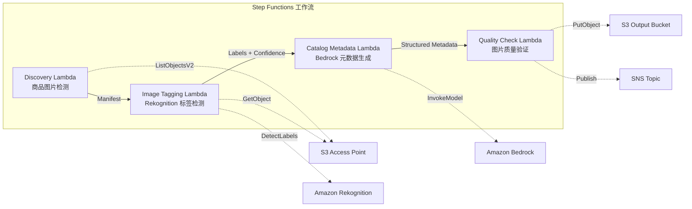

# UC11：零售 / 电商 — 商品图片自动打标签与目录元数据生成

🌐 **Language / 言語**: [日本語](README.md) | [English](README.en.md) | [한국어](README.ko.md) | 简体中文 | [繁體中文](README.zh-TW.md) | [Français](README.fr.md) | [Deutsch](README.de.md) | [Español](README.es.md)

📚 **文档**: [架构图](docs/architecture.zh-CN.md) | [演示指南](docs/demo-guide.zh-CN.md)

## 概述

这是一个利用 FSx for ONTAP 的 S3 Access Points，自动完成商品图片打标签、目录元数据生成和图片质量检查的无服务器工作流。

### 适用此模式的场景

- 大量商品图片已积累在 FSx for ONTAP 上
- 希望通过 Rekognition 对商品图片进行自动标注（类别、颜色、材质）
- 希望自动生成结构化目录元数据（product_category、color、material、style_attributes）
- 需要自动验证图片质量指标（分辨率、文件大小、纵横比）
- 希望自动化低置信度标签的人工复核标记管理

### 不适用此模式的场景

- 实时商品图片处理（API Gateway + Lambda 更合适）
- 大规模图片转换与调整尺寸处理（MediaConvert / EC2 更合适）
- 需要与现有 PIM（Product Information Management）系统直接集成
- 无法确保对 ONTAP REST API 网络可达性的环境

### 主要功能

- 通过 S3 AP 自动检测商品图片（.jpg、.jpeg、.png、.webp）
- 通过 Rekognition DetectLabels 进行标签检测并获取置信度分数
- 置信度低于阈值（默认：70%）时设置人工复核标记
- 通过 Bedrock 生成结构化目录元数据
- 图片质量指标验证（最小分辨率、文件大小范围、纵横比）

## Success Metrics

### Outcome
通过自动化商品图片打标签与目录元数据生成，降低电商站点更新工作量。

### Metrics
| 指标 | 目标值（示例） |
|-----------|------------|
| 已处理图片数 / 执行 | > 500 images |
| 标签检测准确率 | > 90% |
| 元数据生成成功率 | > 95% |
| 处理时间 / 图片 | < 10 秒 |
| 成本 / 执行 | < $5 |
| Human Review 对象比例 | < 10%（低置信度标签） |

### Measurement Method
Step Functions 执行历史、Rekognition label confidence、S3 输出元数据、CloudWatch Metrics。

## 架构



### 工作流步骤

1. **Discovery**：从 S3 AP 检测 .jpg、.jpeg、.png、.webp 文件
2. **Image Tagging**：通过 Rekognition 检测标签，低于置信度阈值的设置人工复核标记
3. **Catalog Metadata**：通过 Bedrock 生成结构化目录元数据
4. **Quality Check**：验证图片质量指标，并对低于阈值的图片进行标记

## 前提条件

- AWS 账户及适当的 IAM 权限
- FSx for ONTAP 文件系统（ONTAP 9.17.1P4D3 或更高版本）
- 已启用 S3 Access Point 的卷（用于存储商品图片）
- VPC、私有子网
- 已启用 Amazon Bedrock 模型访问（Claude / Nova）

## 部署步骤

### 1. SAM 部署

```bash
# 前提：需要 AWS SAM CLI。sam build 会自动打包代码和共享层。
sam build

sam deploy \
  --stack-name fsxn-retail-catalog \
  --parameter-overrides \
    S3AccessPointAlias=<your-volume-ext-s3alias> \
    S3AccessPointName=<your-s3ap-name> \
    VpcId=<your-vpc-id> \
    PrivateSubnetIds=<subnet-1>,<subnet-2> \
    ScheduleExpression="rate(1 hour)" \
    NotificationEmail=<your-email@example.com> \
    EnableVpcEndpoints=false \
    EnableCloudWatchAlarms=false \
  --capabilities CAPABILITY_NAMED_IAM \
  --resolve-s3 \
  --region ap-northeast-1
```

> **注意**：`template.yaml` 用于 SAM CLI（`sam build` + `sam deploy`）。
> 如需使用 `aws cloudformation deploy` 命令直接部署，请使用 `template-deploy.yaml`（需要预先打包 Lambda zip 文件并上传到 S3）。

## 配置参数一览

| 参数 | 说明 | 默认值 | 必填 |
|-----------|------|----------|------|
| `S3AccessPointAlias` | FSx for ONTAP S3 AP Alias（用于输入） | — | ✅ |
| `S3AccessPointName` | S3 AP 名称（用于基于 ARN 的 IAM 权限授予。省略时仅基于 Alias） | `""` | ⚠️ 推荐 |
| `ScheduleExpression` | EventBridge Scheduler 的调度表达式 | `rate(1 hour)` | |
| `VpcId` | VPC ID | — | ✅ |
| `PrivateSubnetIds` | 私有子网 ID 列表 | — | ✅ |
| `NotificationEmail` | SNS 通知目标电子邮件地址 | — | ✅ |
| `ConfidenceThreshold` | Rekognition 标签置信度阈值 (%) | `70` | |
| `MapConcurrency` | Map 状态的并行执行数 | `10` | |
| `LambdaMemorySize` | Lambda 内存大小 (MB) | `512` | |
| `LambdaTimeout` | Lambda 超时 (秒) | `300` | |
| `EnableVpcEndpoints` | 启用 Interface VPC Endpoints | `false` | |
| `EnableCloudWatchAlarms` | 启用 CloudWatch Alarms | `false` | |

## 清理

```bash
aws s3 rm s3://fsxn-retail-catalog-output-${AWS_ACCOUNT_ID} --recursive

aws cloudformation delete-stack \
  --stack-name fsxn-retail-catalog \
  --region ap-northeast-1

aws cloudformation wait stack-delete-complete \
  --stack-name fsxn-retail-catalog \
  --region ap-northeast-1
```

## 参考链接

- [FSx for ONTAP S3 Access Points 概述](https://docs.aws.amazon.com/fsx/latest/ONTAPGuide/accessing-data-via-s3-access-points.html)
- [Amazon Rekognition DetectLabels](https://docs.aws.amazon.com/rekognition/latest/dg/labels-detect-labels-image.html)
- [Amazon Bedrock API 参考](https://docs.aws.amazon.com/bedrock/latest/APIReference/API_runtime_InvokeModel.html)
- [流式 vs 轮询选择指南](../docs/streaming-vs-polling-guide.md)

## Kinesis 流式模式（Phase 3）

在 Phase 3 中，除 EventBridge 轮询外，还可选择性启用 **通过 Kinesis Data Streams 的近实时处理**。

### 启用

```bash
# 前提：需要 AWS SAM CLI。sam build 会自动打包代码和共享层。
sam build

sam deploy \
  --stack-name fsxn-retail-catalog \
  --parameter-overrides \
    EnableStreamingMode=true \
    ... # 其他参数
  --capabilities CAPABILITY_NAMED_IAM \
  --resolve-s3
```

### 流式模式架构

```
EventBridge (rate(1 min)) → Stream Producer Lambda
  → 与 DynamoDB 状态表比较 → 变更检测
  → Kinesis Data Stream → Stream Consumer Lambda
  → 现有 ImageTagging + CatalogMetadata 管道
```

### 主要特征

- **变更检测**：以 1 分钟间隔比较 S3 AP 对象列表与 DynamoDB 状态表，检测新增、变更、删除文件
- **幂等处理**：通过 DynamoDB conditional writes 防止重复处理
- **故障处理**：使用 bisect-on-error + DynamoDB dead-letter 表隔离失败记录
- **与现有路径共存**：轮询路径（EventBridge + Step Functions）保持不变。可进行混合运行

### 模式选择

关于应选择哪种模式，请参阅 [流式 vs 轮询选择指南](../docs/streaming-vs-polling-guide.md)。

## Supported Regions

UC11 使用以下服务：

| 服务 | 区域约束 |
|---------|-------------|
| Amazon Rekognition | 几乎所有区域均可用 |
| Amazon Bedrock | 确认支持的区域（[Bedrock 支持的区域](https://docs.aws.amazon.com/general/latest/gr/bedrock.html)） |
| Kinesis Data Streams | 几乎所有区域均可用（分片费用因区域而异） |
| AWS X-Ray | 几乎所有区域均可用 |
| CloudWatch EMF | 几乎所有区域均可用 |

> 启用 Kinesis 流式模式时，请注意分片费用因区域而异。详情请参阅 [区域兼容性矩阵](../docs/region-compatibility.md)。

---

## AWS 文档链接

| 服务 | 文档 |
|---------|------------|
| FSx for ONTAP | [用户指南](https://docs.aws.amazon.com/fsx/latest/ONTAPGuide/what-is-fsx-ontap.html) |
| S3 Access Points | [S3 AP for FSx for ONTAP](https://docs.aws.amazon.com/fsx/latest/ONTAPGuide/s3-access-points.html) |
| Step Functions | [开发者指南](https://docs.aws.amazon.com/step-functions/latest/dg/welcome.html) |
| Amazon Rekognition | [开发者指南](https://docs.aws.amazon.com/rekognition/latest/dg/what-is.html) |
| Amazon Kinesis | [开发者指南](https://docs.aws.amazon.com/streams/latest/dev/introduction.html) |
| Amazon Bedrock | [用户指南](https://docs.aws.amazon.com/bedrock/latest/userguide/what-is-bedrock.html) |

### Well-Architected Framework 对应

| 支柱 | 对应 |
|----|------|
| 卓越运营 | X-Ray、EMF、Kinesis 指标、DLQ 监控 |
| 安全性 | 最小权限 IAM、KMS 加密、商品数据访问控制 |
| 可靠性 | Kinesis bisect-on-error、DLQ、Step Functions Retry |
| 性能效率 | 流式处理、并行图片打标签 |
| 成本优化 | 无服务器、Kinesis On-Demand 模式 |
| 可持续性 | 增量处理（仅变更图片）、DynamoDB 状态管理 |

---

## 成本估算（月度概算）

> **注记**：以下为 ap-northeast-1 区域的概算，实际成本因使用量而异。最新价格请在 [AWS Pricing Calculator](https://calculator.aws/) 上确认。

### 无服务器组件（按量计费）

| 服务 | 单价 | 预计使用量 | 月度概算 |
|---------|------|-----------|---------|
| Lambda | $0.0000166667/GB-sec | 6 函数 × 500 images/天 | ~$1-5 |
| S3 API (GetObject/ListObjects) | $0.0047/10K requests | ~10K requests/天 | ~$1.5 |
| Step Functions | $0.025/1K state transitions | ~1K transitions/天 | ~$0.75 |
| Bedrock (Nova Lite) | $0.00006/1K input tokens | ~50K tokens/执行 | ~$3-10 |
| Athena | $5/TB scanned | ~10 MB/查询 | ~$0.5-2 |
| SNS | $0.50/100K notifications | ~100 notifications/天 | ~$0.15 |
| CloudWatch Logs | $0.76/GB ingested | ~1 GB/月 | ~$0.76 |
| Kinesis Data Stream (可选) | $0.015/shard-hour |

### 固定成本（FSx for ONTAP — 以现有环境为前提）

| 组件 | 月度 |
|--------------|------|
| FSx for ONTAP (128 MBps, 1 TB) | ~$230 (共享现有环境) |
| S3 Access Point | 无额外费用（仅 S3 API 费用） |

### 合计概算

| 配置 | 月度概算 |
|------|---------|
| 最小配置（每日 1 次执行） | ~$5-15 |
| 标准配置（每小时执行） | ~$15-50 |
| 大规模配置（高频 + 告警） | ~$50-150 |

> **Governance Caveat**：成本估算为概算，并非保证值。实际账单因使用模式、数据量、区域而异。

---

## 本地测试

### Prerequisites 检查

```bash
# 确认前提条件
aws --version          # AWS CLI v2
sam --version          # SAM CLI
python3 --version      # Python 3.9+
docker --version       # Docker (用于 sam local)
aws sts get-caller-identity  # AWS 凭证
```

### sam local invoke

```bash
# 构建
# 前提：需要 AWS SAM CLI。sam build 会自动打包代码和共享层。
sam build

# 在本地运行 Discovery Lambda
sam local invoke DiscoveryFunction --event events/discovery-event.json

# 附带环境变量覆盖
sam local invoke DiscoveryFunction \
  --event events/discovery-event.json \
  --env-vars env.json
```

### 单元测试

```bash
python3 -m pytest tests/ -v
```

详情请参阅 [本地测试快速入门](../docs/local-testing-quick-start.md)。

---

## 输出示例 (Output Sample)

商品图片打标签管道的输出示例：

```json
{
  "discovery": {
    "status": "completed",
    "object_count": 50,
    "prefix": "product-images/"
  },
  "tagging_results": [
    {
      "key": "product-images/SKU-12345.jpg",
      "labels": [
        {"name": "Dress", "confidence": 0.98},
        {"name": "Red", "confidence": 0.95},
        {"name": "Summer", "confidence": 0.87}
      ],
      "category": "Apparel/Dresses",
      "catalog_metadata": {
        "color": "red",
        "season": "summer",
        "style": "casual"
      }
    }
  ],
  "report": {
    "total_processed": 50,
    "auto_tagged": 47,
    "requires_review": 3,
    "output_prefix": "s3://output-bucket/catalog-metadata/"
  }
}
```

> **注记**：以上为示例输出，实际值因环境和输入数据而异。基准数值为 sizing reference，并非 service limit。

---

## Governance Note

> 本模式提供技术架构指导。它不是法律、合规或监管方面的建议。组织应咨询合格的专业人士。

---

## S3AP Compatibility

有关 S3 Access Points for FSx for ONTAP 的兼容性约束、故障排查和触发模式，请参阅 [S3AP Compatibility Notes](../docs/s3ap-compatibility-notes.md)。
