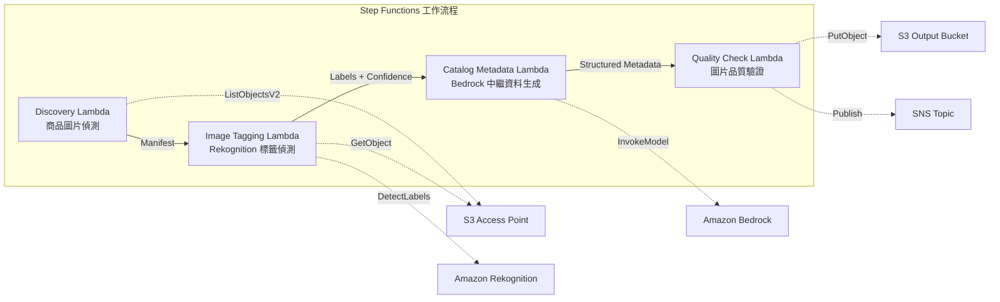

# UC11：零售 / 電商 — 商品圖片自動標籤與目錄中繼資料生成

🌐 **Language / 言語**: [日本語](README.md) | [English](README.en.md) | [한국어](README.ko.md) | [简体中文](README.zh-CN.md) | 繁體中文 | [Français](README.fr.md) | [Deutsch](README.de.md) | [Español](README.es.md)

📚 **文件**: [架構圖](docs/architecture.zh-TW.md) | [示範指南](docs/demo-guide.zh-TW.md)

## 概述

這是一個利用 FSx for ONTAP 的 S3 Access Points，自動完成商品圖片標籤、目錄中繼資料生成與圖片品質檢查的無伺服器工作流程。

### 適用此模式的情境

- 大量商品圖片已累積在 FSx for ONTAP 上
- 希望透過 Rekognition 對商品圖片進行自動標註（類別、顏色、材質）
- 希望自動生成結構化目錄中繼資料（product_category、color、material、style_attributes）
- 需要自動驗證圖片品質指標（解析度、檔案大小、長寬比）
- 希望自動化低信賴度標籤的人工審查標記管理

### 不適用此模式的情境

- 即時商品圖片處理（API Gateway + Lambda 較合適）
- 大規模圖片轉換與尺寸調整處理（MediaConvert / EC2 較合適）
- 需要與現有 PIM（Product Information Management）系統直接整合
- 無法確保對 ONTAP REST API 網路可達性的環境

### 主要功能

- 透過 S3 AP 自動偵測商品圖片（.jpg、.jpeg、.png、.webp）
- 透過 Rekognition DetectLabels 進行標籤偵測並取得信賴度分數
- 信賴度低於閾值（預設：70%）時設定人工審查標記
- 透過 Bedrock 生成結構化目錄中繼資料
- 圖片品質指標驗證（最小解析度、檔案大小範圍、長寬比）

## Success Metrics

### Outcome
透過自動化商品圖片標籤與目錄中繼資料生成，降低電商網站更新工時。

### Metrics
| 指標 | 目標值（範例） |
|-----------|------------|
| 已處理圖片數 / 執行 | > 500 images |
| 標籤偵測準確率 | > 90% |
| 中繼資料生成成功率 | > 95% |
| 處理時間 / 圖片 | < 10 秒 |
| 成本 / 執行 | < $5 |
| Human Review 對象比例 | < 10%（低信賴度標籤） |

### Measurement Method
Step Functions 執行歷程、Rekognition label confidence、S3 輸出中繼資料、CloudWatch Metrics。

## 架構



### 工作流程步驟

1. **Discovery**：從 S3 AP 偵測 .jpg、.jpeg、.png、.webp 檔案
2. **Image Tagging**：透過 Rekognition 偵測標籤，低於信賴度閾值者設定人工審查標記
3. **Catalog Metadata**：透過 Bedrock 生成結構化目錄中繼資料
4. **Quality Check**：驗證圖片品質指標，並對低於閾值的圖片進行標記

## 前提條件

- AWS 帳戶及適當的 IAM 權限
- FSx for ONTAP 檔案系統（ONTAP 9.17.1P4D3 或更新版本）
- 已啟用 S3 Access Point 的磁碟區（用於儲存商品圖片）
- VPC、私有子網路
- 已啟用 Amazon Bedrock 模型存取（Claude / Nova）

## 部署步驟

### 1. SAM 部署

```bash
# 前提：需要 AWS SAM CLI。sam build 會自動封裝程式碼與共用層。
sam build

sam deploy \
  --stack-name fsxn-retail-catalog \
  --parameter-overrides \
    S3AccessPointAlias=<your-volume-ext-s3alias> \
    S3AccessPointName=<your-s3ap-name> \
    VpcId=<your-vpc-id> \
    PrivateSubnetIds=<subnet-1>,<subnet-2> \
    ScheduleExpression="rate(1 hour)" \
    NotificationEmail=<your-email@example.com> \
    EnableVpcEndpoints=false \
    EnableCloudWatchAlarms=false \
  --capabilities CAPABILITY_NAMED_IAM \
  --resolve-s3 \
  --region ap-northeast-1
```

> **注意**：`template.yaml` 用於 SAM CLI（`sam build` + `sam deploy`）。
> 如需使用 `aws cloudformation deploy` 命令直接部署，請使用 `template-deploy.yaml`（需要預先封裝 Lambda zip 檔案並上傳至 S3）。

## 設定參數一覽

| 參數 | 說明 | 預設值 | 必填 |
|-----------|------|----------|------|
| `S3AccessPointAlias` | FSx for ONTAP S3 AP Alias（用於輸入） | — | ✅ |
| `S3AccessPointName` | S3 AP 名稱（用於基於 ARN 的 IAM 權限授予。省略時僅基於 Alias） | `""` | ⚠️ 建議 |
| `ScheduleExpression` | EventBridge Scheduler 的排程運算式 | `rate(1 hour)` | |
| `VpcId` | VPC ID | — | ✅ |
| `PrivateSubnetIds` | 私有子網路 ID 清單 | — | ✅ |
| `NotificationEmail` | SNS 通知目標電子郵件地址 | — | ✅ |
| `ConfidenceThreshold` | Rekognition 標籤信賴度閾值 (%) | `70` | |
| `MapConcurrency` | Map 狀態的並行執行數 | `10` | |
| `LambdaMemorySize` | Lambda 記憶體大小 (MB) | `512` | |
| `LambdaTimeout` | Lambda 逾時 (秒) | `300` | |
| `EnableVpcEndpoints` | 啟用 Interface VPC Endpoints | `false` | |
| `EnableCloudWatchAlarms` | 啟用 CloudWatch Alarms | `false` | |

## 清理

```bash
aws s3 rm s3://fsxn-retail-catalog-output-${AWS_ACCOUNT_ID} --recursive

aws cloudformation delete-stack \
  --stack-name fsxn-retail-catalog \
  --region ap-northeast-1

aws cloudformation wait stack-delete-complete \
  --stack-name fsxn-retail-catalog \
  --region ap-northeast-1
```

## 參考連結

- [FSx for ONTAP S3 Access Points 概觀](https://docs.aws.amazon.com/fsx/latest/ONTAPGuide/accessing-data-via-s3-access-points.html)
- [Amazon Rekognition DetectLabels](https://docs.aws.amazon.com/rekognition/latest/dg/labels-detect-labels-image.html)
- [Amazon Bedrock API 參考](https://docs.aws.amazon.com/bedrock/latest/APIReference/API_runtime_InvokeModel.html)
- [串流 vs 輪詢選擇指南](../docs/streaming-vs-polling-guide.md)

## Kinesis 串流模式（Phase 3）

在 Phase 3 中，除 EventBridge 輪詢外，還可選擇性啟用 **透過 Kinesis Data Streams 的近即時處理**。

### 啟用

```bash
# 前提：需要 AWS SAM CLI。sam build 會自動封裝程式碼與共用層。
sam build

sam deploy \
  --stack-name fsxn-retail-catalog \
  --parameter-overrides \
    EnableStreamingMode=true \
    ... # 其他參數
  --capabilities CAPABILITY_NAMED_IAM \
  --resolve-s3
```

### 串流模式架構

```
EventBridge (rate(1 min)) → Stream Producer Lambda
  → 與 DynamoDB 狀態表比較 → 變更偵測
  → Kinesis Data Stream → Stream Consumer Lambda
  → 現有 ImageTagging + CatalogMetadata 管線
```

### 主要特徵

- **變更偵測**：以 1 分鐘間隔比較 S3 AP 物件清單與 DynamoDB 狀態表，偵測新增、變更、刪除檔案
- **冪等處理**：透過 DynamoDB conditional writes 防止重複處理
- **故障處理**：使用 bisect-on-error + DynamoDB dead-letter 表隔離失敗記錄
- **與現有路徑共存**：輪詢路徑（EventBridge + Step Functions）維持不變。可進行混合運行

### 模式選擇

關於應選擇哪種模式，請參閱 [串流 vs 輪詢選擇指南](../docs/streaming-vs-polling-guide.md)。

## Supported Regions

UC11 使用以下服務：

| 服務 | 區域限制 |
|---------|-------------|
| Amazon Rekognition | 幾乎所有區域均可使用 |
| Amazon Bedrock | 確認支援的區域（[Bedrock 支援的區域](https://docs.aws.amazon.com/general/latest/gr/bedrock.html)） |
| Kinesis Data Streams | 幾乎所有區域均可使用（分片費用因區域而異） |
| AWS X-Ray | 幾乎所有區域均可使用 |
| CloudWatch EMF | 幾乎所有區域均可使用 |

> 啟用 Kinesis 串流模式時，請注意分片費用因區域而異。詳情請參閱 [區域相容性矩陣](../docs/region-compatibility.md)。

---

## AWS 文件連結

| 服務 | 文件 |
|---------|------------|
| FSx for ONTAP | [使用者指南](https://docs.aws.amazon.com/fsx/latest/ONTAPGuide/what-is-fsx-ontap.html) |
| S3 Access Points | [S3 AP for FSx for ONTAP](https://docs.aws.amazon.com/fsx/latest/ONTAPGuide/s3-access-points.html) |
| Step Functions | [開發人員指南](https://docs.aws.amazon.com/step-functions/latest/dg/welcome.html) |
| Amazon Rekognition | [開發人員指南](https://docs.aws.amazon.com/rekognition/latest/dg/what-is.html) |
| Amazon Kinesis | [開發人員指南](https://docs.aws.amazon.com/streams/latest/dev/introduction.html) |
| Amazon Bedrock | [使用者指南](https://docs.aws.amazon.com/bedrock/latest/userguide/what-is-bedrock.html) |

### Well-Architected Framework 對應

| 支柱 | 對應 |
|----|------|
| 卓越營運 | X-Ray、EMF、Kinesis 指標、DLQ 監控 |
| 安全性 | 最小權限 IAM、KMS 加密、商品資料存取控制 |
| 可靠性 | Kinesis bisect-on-error、DLQ、Step Functions Retry |
| 效能效率 | 串流處理、並行圖片標籤 |
| 成本最佳化 | 無伺服器、Kinesis On-Demand 模式 |
| 永續性 | 差分處理（僅變更圖片）、DynamoDB 狀態管理 |

---

## 成本估算（每月概算）

> **註記**：以下為 ap-northeast-1 區域的概算，實際成本因使用量而異。最新價格請於 [AWS Pricing Calculator](https://calculator.aws/) 上確認。

### 無伺服器元件（依用量計費）

| 服務 | 單價 | 預計使用量 | 每月概算 |
|---------|------|-----------|---------|
| Lambda | $0.0000166667/GB-sec | 6 函數 × 500 images/日 | ~$1-5 |
| S3 API (GetObject/ListObjects) | $0.0047/10K requests | ~10K requests/日 | ~$1.5 |
| Step Functions | $0.025/1K state transitions | ~1K transitions/日 | ~$0.75 |
| Bedrock (Nova Lite) | $0.00006/1K input tokens | ~50K tokens/執行 | ~$3-10 |
| Athena | $5/TB scanned | ~10 MB/查詢 | ~$0.5-2 |
| SNS | $0.50/100K notifications | ~100 notifications/日 | ~$0.15 |
| CloudWatch Logs | $0.76/GB ingested | ~1 GB/月 | ~$0.76 |
| Kinesis Data Stream (選用) | $0.015/shard-hour |

### 固定成本（FSx for ONTAP — 以現有環境為前提）

| 元件 | 每月 |
|--------------|------|
| FSx for ONTAP (128 MBps, 1 TB) | ~$230 (共用現有環境) |
| S3 Access Point | 無額外費用（僅 S3 API 費用） |

### 合計概算

| 組態 | 每月概算 |
|------|---------|
| 最小組態（每日 1 次執行） | ~$5-15 |
| 標準組態（每小時執行） | ~$15-50 |
| 大規模組態（高頻率 + 警示） | ~$50-150 |

> **Governance Caveat**：成本估算為概算，並非保證值。實際帳單因使用模式、資料量、區域而異。

---

## 本機測試

### Prerequisites 檢查

```bash
# 確認前提條件
aws --version          # AWS CLI v2
sam --version          # SAM CLI
python3 --version      # Python 3.9+
docker --version       # Docker (用於 sam local)
aws sts get-caller-identity  # AWS 憑證
```

### sam local invoke

```bash
# 建置
# 前提：需要 AWS SAM CLI。sam build 會自動封裝程式碼與共用層。
sam build

# 在本機執行 Discovery Lambda
sam local invoke DiscoveryFunction --event events/discovery-event.json

# 附帶環境變數覆寫
sam local invoke DiscoveryFunction \
  --event events/discovery-event.json \
  --env-vars env.json
```

### 單元測試

```bash
python3 -m pytest tests/ -v
```

詳情請參閱 [本機測試快速入門](../docs/local-testing-quick-start.md)。

---

## 輸出範例 (Output Sample)

商品圖片標籤管線的輸出範例：

```json
{
  "discovery": {
    "status": "completed",
    "object_count": 50,
    "prefix": "product-images/"
  },
  "tagging_results": [
    {
      "key": "product-images/SKU-12345.jpg",
      "labels": [
        {"name": "Dress", "confidence": 0.98},
        {"name": "Red", "confidence": 0.95},
        {"name": "Summer", "confidence": 0.87}
      ],
      "category": "Apparel/Dresses",
      "catalog_metadata": {
        "color": "red",
        "season": "summer",
        "style": "casual"
      }
    }
  ],
  "report": {
    "total_processed": 50,
    "auto_tagged": 47,
    "requires_review": 3,
    "output_prefix": "s3://output-bucket/catalog-metadata/"
  }
}
```

> **註記**：以上為範例輸出，實際值因環境與輸入資料而異。基準數值為 sizing reference，並非 service limit。

---

## Governance Note

> 本模式提供技術架構指導。它不是法律、合規或法規方面的建議。組織應諮詢合格的專業人士。

---

## S3AP Compatibility

有關 S3 Access Points for FSx for ONTAP 的相容性限制、疑難排解與觸發模式，請參閱 [S3AP Compatibility Notes](../docs/s3ap-compatibility-notes.md)。
