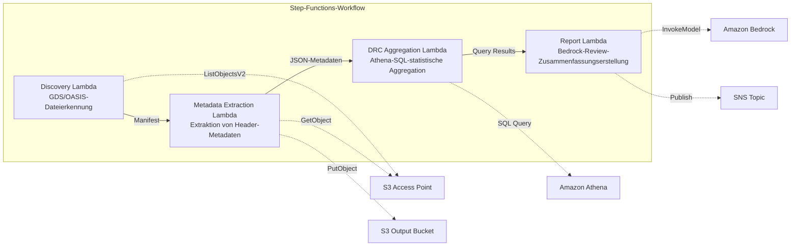
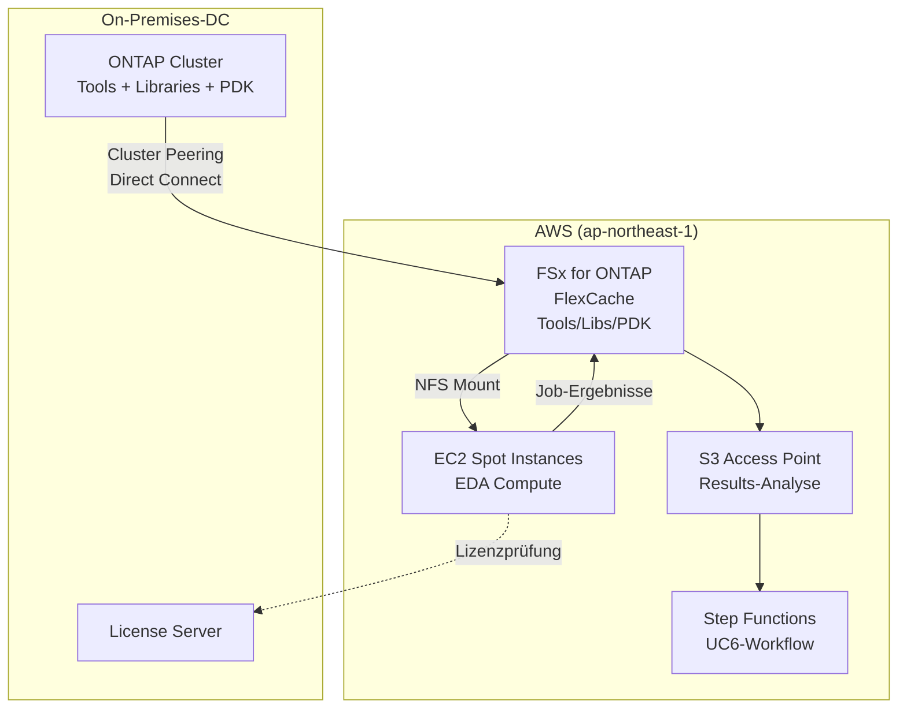

# UC6: Halbleiter / EDA — Validierung von Designdateien und Metadatenextraktion

🌐 **Language / 言語**: [日本語](README.md) | [English](README.en.md) | [한국어](README.ko.md) | [简体中文](README.zh-CN.md) | [繁體中文](README.zh-TW.md) | [Français](README.fr.md) | Deutsch | [Español](README.es.md)

📚 **Dokumentation**: [Architekturdiagramm](docs/architecture.de.md) | [Demo-Leitfaden](docs/demo-guide.de.md)

## Überblick

Ein Serverless-Workflow, der die S3 Access Points für FSx for ONTAP nutzt, um die Validierung, Metadatenextraktion und die statistische DRC-Aggregation (Design Rule Check) von GDS/OASIS-Halbleiter-Designdateien zu automatisieren.

### Wann dieses Muster geeignet ist

- Große Mengen an GDS/OASIS-Designdateien sind auf FSx for ONTAP angesammelt
- Sie möchten die Metadaten von Designdateien (Bibliotheksname, Zellenanzahl, Bounding Box usw.) automatisch katalogisieren
- Sie müssen DRC-Statistiken regelmäßig aggregieren, um Trends in der Designqualität zu verfolgen
- Eine übergreifende Analyse von Design-Metadaten über Athena SQL ist erforderlich
- Sie möchten Design-Review-Zusammenfassungen in natürlicher Sprache automatisch generieren

### Wann dieses Muster nicht geeignet ist

- Eine Echtzeit-DRC-Ausführung ist erforderlich (setzt EDA-Tool-Integration voraus)
- Eine physische Validierung von Designdateien (vollständige Prüfung der Konformität mit Fertigungsregeln) ist erforderlich
- Eine EC2-basierte EDA-Toolchain ist bereits in Betrieb und die Migrationskosten rechtfertigen sich nicht
- Eine Umgebung, in der die Netzwerkerreichbarkeit zur ONTAP REST API nicht gewährleistet werden kann

### Hauptfunktionen

- Automatische Erkennung von GDS/OASIS-Dateien über S3 AP (.gds, .gds2, .oas, .oasis)
- Extraktion von Header-Metadaten (library_name, units, cell_count, bounding_box, creation_date)
- Statistische DRC-Aggregation über Athena SQL (Verteilung der Zellenanzahl, Bounding-Box-Ausreißer, Verstöße gegen Benennungskonventionen)
- Generierung von Design-Review-Zusammenfassungen in natürlicher Sprache über Amazon Bedrock
- Sofortige Ergebnisweitergabe über SNS-Benachrichtigungen


## Success Metrics

### Outcome
Reduzierung des Vorbereitungsaufwands für Design-Reviews durch Automatisierung der GDS/OASIS-Validierung und Metadatenextraktion.

### Metrics
| Metrik | Zielwert (Beispiel) |
|-----------|------------|
| Verarbeitete Designdateien / Ausführung | > 100 files |
| Erkennungsrate von Validierungsfehlern | 100 % (bekannte Fehlermuster) |
| Erstellungszeit des Bedrock-Berichts | < 3 Minuten |
| Antwortzeit der Athena-Abfrage | < 10 Sekunden |
| Kosten / Ausführung | < $5 |
| Zielrate für Human Review | < 15 % (Design-Review-Feststellungen) |

### Measurement Method
Step-Functions-Ausführungsverlauf, Athena-Abfrageergebnisse, Bedrock-Berichtsmetadaten, CloudWatch Metrics.

## Architektur



### Workflow-Schritte

1. **Discovery**: Erkennt .gds-, .gds2-, .oas-, .oasis-Dateien aus dem S3 AP und generiert ein Manifest
2. **Metadata Extraction**: Extrahiert Metadaten aus dem Header jeder Designdatei und gibt datumspartitioniertes JSON an S3 aus
3. **DRC Aggregation**: Führt eine übergreifende Analyse des Metadatenkatalogs über Athena SQL durch und aggregiert DRC-Statistiken
4. **Report Generation**: Erstellt eine Design-Review-Zusammenfassung über Bedrock und gibt sie an S3 + SNS-Benachrichtigung aus

## Voraussetzungen

- AWS-Konto mit entsprechenden IAM-Berechtigungen
- FSx-for-ONTAP-Dateisystem (ONTAP 9.17.1P4D3 oder höher)
- Ein Volume mit aktiviertem S3 Access Point (das GDS/OASIS-Dateien enthält)
- VPC, private Subnetze
- **NAT Gateway oder VPC Endpoints** (erforderlich, damit die Discovery Lambda aus der VPC heraus auf AWS-Services zugreifen kann)
- Zugriff auf Amazon-Bedrock-Modelle aktiviert (Claude / Nova)
- ONTAP-REST-API-Anmeldeinformationen in Secrets Manager gespeichert

## Bereitstellungsschritte

### 1. Den S3 Access Point erstellen

Erstellen Sie einen S3 Access Point auf dem Volume, das die GDS/OASIS-Dateien speichert.

#### Erstellung über AWS CLI

```bash
aws fsx create-and-attach-s3-access-point \
  --name <your-s3ap-name> \
  --type ONTAP \
  --ontap-configuration '{
    "VolumeId": "<your-volume-id>",
    "FileSystemIdentity": {
      "Type": "UNIX",
      "UnixUser": {
        "Name": "root"
      }
    }
  }' \
  --region <your-region>
```

Notieren Sie sich nach der Erstellung den `S3AccessPoint.Alias` aus der Antwort (im Format `xxx-ext-s3alias`).

#### Erstellung über die AWS-Managementkonsole

1. Öffnen Sie die [Amazon-FSx-Konsole](https://console.aws.amazon.com/fsx/)
2. Wählen Sie das Zieldateisystem aus
3. Wählen Sie das Zielvolume auf der Registerkarte „Volumes" aus
4. Wählen Sie die Registerkarte „S3-Zugriffspunkte" aus
5. Klicken Sie auf „S3-Zugriffspunkt erstellen und anhängen"
6. Geben Sie den Namen des Zugriffspunkts ein und geben Sie den Dateisystem-Identitätstyp (UNIX/WINDOWS) und den Benutzer an
7. Klicken Sie auf „Erstellen"

> Weitere Informationen finden Sie unter [Erstellen von S3 Access Points für FSx for ONTAP](https://docs.aws.amazon.com/fsx/latest/ONTAPGuide/s3-access-points-create-fsxn.html).

#### Überprüfung des S3-AP-Status

```bash
aws fsx describe-s3-access-point-attachments --region <your-region> \
  --query 'S3AccessPointAttachments[*].{Name:Name,Lifecycle:Lifecycle,Alias:S3AccessPoint.Alias}' \
  --output table
```

Warten Sie, bis `Lifecycle` den Wert `AVAILABLE` erreicht (in der Regel 1–2 Minuten).

### 2. Beispieldateien hochladen (optional)

Laden Sie Test-GDS-Dateien in das Volume hoch:

```bash
S3AP_ALIAS="<your-s3ap-alias>"

aws s3 cp test-data/semiconductor-eda/eda-designs/test_chip.gds \
  "s3://${S3AP_ALIAS}/eda-designs/test_chip.gds" --region <your-region>

aws s3 cp test-data/semiconductor-eda/eda-designs/test_chip_v2.gds2 \
  "s3://${S3AP_ALIAS}/eda-designs/test_chip_v2.gds2" --region <your-region>
```

### 3. SAM-Bereitstellung

```bash
# Voraussetzung: AWS SAM CLI erforderlich. „sam build" verpackt den Code und den Shared Layer automatisch.
sam build

sam deploy \
  --stack-name fsxn-semiconductor-eda \
  --parameter-overrides \
    S3AccessPointAlias=<your-s3ap-alias> \
    S3AccessPointName=<your-s3ap-name> \
    OntapSecretName=<your-secret-name> \
    OntapManagementIp=<ontap-mgmt-ip> \
    SvmUuid=<your-svm-uuid> \
    VpcId=<your-vpc-id> \
    PrivateSubnetIds=<subnet-1>,<subnet-2> \
    PrivateRouteTableIds=<rtb-1>,<rtb-2> \
    NotificationEmail=<your-email@example.com> \
    BedrockModelId=amazon.nova-lite-v1:0 \
    EnableVpcEndpoints=true \
    MapConcurrency=10 \
    LambdaMemorySize=512 \
    LambdaTimeout=300 \
  --capabilities CAPABILITY_NAMED_IAM \
  --resolve-s3 \
  --region <your-region>
```

> **Wichtig**: `S3AccessPointName` ist der Name des S3 AP (der bei der Erstellung angegebene Name, nicht der Alias). Er wird für ARN-basierte Berechtigungserteilungen in IAM-Richtlinien verwendet. Das Weglassen kann zu `AccessDenied`-Fehlern führen.

### 4. SNS-Abonnement bestätigen

Nach der Bereitstellung wird eine Bestätigungs-E-Mail an die angegebene E-Mail-Adresse gesendet. Klicken Sie auf den Link, um zu bestätigen.

### 5. Betrieb überprüfen

Führen Sie die Step-Functions-Zustandsmaschine manuell aus, um den Betrieb zu überprüfen:

```bash
aws stepfunctions start-execution \
  --state-machine-arn "arn:aws:states:<region>:<account-id>:stateMachine:fsxn-semiconductor-eda-workflow" \
  --input '{}' \
  --region <your-region>
```

> **Hinweis**: Bei der ersten Ausführung können die Athena-DRC-Aggregationsergebnisse 0 Zeilen zurückgeben. Dies liegt an einer Zeitverzögerung, bevor die Metadaten in der Glue-Tabelle widergespiegelt werden. Ab der zweiten Ausführung werden korrekte Statistiken erzielt.

> **Hinweis**: `template.yaml` ist für die Verwendung mit der SAM CLI (`sam build` + `sam deploy`) konzipiert.
> Um mit dem reinen Befehl `aws cloudformation deploy` bereitzustellen, verwenden Sie stattdessen `template-deploy.yaml` (erfordert das Vorpaketieren von Lambda-Zip-Dateien und deren Hochladen in einen S3-Bucket).

## Liste der Konfigurationsparameter

| Parameter | Beschreibung | Standard | Erforderlich |
|-----------|------|----------|------|
| `S3AccessPointAlias` | FSx for ONTAP S3 AP Alias (für die Eingabe) | — | ✅ |
| `S3AccessPointName` | S3-AP-Name (für ARN-basierte IAM-Berechtigungserteilungen) | `""` | ⚠️ Empfohlen |
| `OntapSecretName` | Secrets-Manager-Secret-Name für ONTAP-REST-API-Anmeldeinformationen | — | ✅ |
| `OntapManagementIp` | Verwaltungs-IP-Adresse des ONTAP-Clusters | — | ✅ |
| `SvmUuid` | ONTAP SVM UUID | — | ✅ |
| `ScheduleExpression` | Zeitplanausdruck des EventBridge Scheduler | `rate(1 hour)` | |
| `VpcId` | VPC ID | — | ✅ |
| `PrivateSubnetIds` | Liste der privaten Subnetz-IDs | — | ✅ |
| `PrivateRouteTableIds` | Liste der Routentabellen-IDs privater Subnetze (für S3 Gateway Endpoint) | `""` | |
| `NotificationEmail` | Ziel-E-Mail-Adresse für SNS-Benachrichtigungen | — | ✅ |
| `BedrockModelId` | Bedrock-Modell-ID | `amazon.nova-lite-v1:0` | |
| `MapConcurrency` | Anzahl paralleler Ausführungen des Map-Zustands | `10` | |
| `LambdaMemorySize` | Lambda-Speichergröße (MB) | `256` | |
| `LambdaTimeout` | Lambda-Timeout (Sekunden) | `300` | |
| `EnableVpcEndpoints` | Interface VPC Endpoints aktivieren | `false` | |
| `EnableCloudWatchAlarms` | CloudWatch Alarms aktivieren | `false` | |
| `EnableXRayTracing` | X-Ray-Tracing aktivieren | `true` | |

> ⚠️ **`S3AccessPointName`**: Optional, aber wenn er weggelassen wird, ist die IAM-Richtlinie nur Alias-basiert, was in einigen Umgebungen zu `AccessDenied`-Fehlern führen kann. Die Angabe dieses Parameters wird für Produktionsumgebungen empfohlen.

## Fehlerbehebung

### Die Discovery Lambda läuft in einen Timeout

**Ursache**: Die in der VPC ausgeführte Lambda kann AWS-Services (Secrets Manager, S3, CloudWatch) nicht erreichen.

**Lösung**: Überprüfen Sie eines der folgenden Punkte:
1. Stellen Sie mit `EnableVpcEndpoints=true` bereit und geben Sie `PrivateRouteTableIds` an
2. In der VPC existiert ein NAT Gateway und die Routentabellen der privaten Subnetze haben eine Route zum NAT Gateway

### AccessDenied-Fehler (ListObjectsV2)

**Ursache**: In der IAM-Richtlinie fehlen ARN-basierte Berechtigungen für den S3 Access Point.

**Lösung**: Geben Sie den Namen des S3 AP (den bei der Erstellung vergebenen Namen, nicht den Alias) im Parameter `S3AccessPointName` an und aktualisieren Sie den Stack.

### Athena-DRC-Aggregation gibt 0 Ergebnisse zurück

**Ursache**: Der von der DRC Aggregation Lambda verwendete `metadata_prefix`-Filter stimmt möglicherweise nicht mit den tatsächlichen `file_key`-Werten im Metadaten-JSON überein. Außerdem existieren bei der ersten Ausführung keine Metadaten in der Glue-Tabelle, was zu 0 Zeilen führt.

**Lösung**:
1. Führen Sie den Step-Functions-Workflow zweimal aus (die erste Ausführung schreibt Metadaten nach S3, und die zweite Ausführung ermöglicht Athena die Aggregation)
2. Führen Sie `SELECT * FROM "<db>"."<table>" LIMIT 10` direkt in der Athena-Konsole aus, um zu bestätigen, dass die Daten lesbar sind
3. Wenn die Daten lesbar sind, die Aggregation aber 0 Ergebnisse zurückgibt, überprüfen Sie die Konsistenz zwischen den `file_key`-Werten und dem `prefix`-Filter

## Bereinigung

```bash
# Den S3-Bucket leeren
aws s3 rm s3://fsxn-semiconductor-eda-output-${AWS_ACCOUNT_ID} --recursive

# Den CloudFormation-Stack löschen
aws cloudformation delete-stack \
  --stack-name fsxn-semiconductor-eda \
  --region ap-northeast-1

# Auf den Abschluss der Löschung warten
aws cloudformation wait stack-delete-complete \
  --stack-name fsxn-semiconductor-eda \
  --region ap-northeast-1
```

## Supported Regions

UC6 verwendet die folgenden Services:

| Service | Regionale Einschränkungen |
|---------|-------------|
| Amazon Athena | In den meisten Regionen verfügbar |
| Amazon Bedrock | Überprüfen Sie die unterstützten Regionen ([Von Bedrock unterstützte Regionen](https://docs.aws.amazon.com/general/latest/gr/bedrock.html)) |
| AWS X-Ray | In den meisten Regionen verfügbar |
| CloudWatch EMF | In den meisten Regionen verfügbar |

> Weitere Informationen finden Sie in der [Matrix der regionalen Kompatibilität](../docs/region-compatibility.md).

## Referenzlinks

- [Übersicht über S3 Access Points für FSx for ONTAP](https://docs.aws.amazon.com/fsx/latest/ONTAPGuide/accessing-data-via-s3-access-points.html)
- [Erstellen und Anhängen von S3 Access Points](https://docs.aws.amazon.com/fsx/latest/ONTAPGuide/s3-access-points-create-fsxn.html)
- [Zugriffsverwaltung für S3 Access Points](https://docs.aws.amazon.com/fsx/latest/ONTAPGuide/s3-ap-manage-access-fsxn.html)
- [Amazon Athena Benutzerhandbuch](https://docs.aws.amazon.com/athena/latest/ug/what-is.html)
- [Amazon Bedrock API-Referenz](https://docs.aws.amazon.com/bedrock/latest/APIReference/API_runtime_InvokeModel.html)
- [GDSII-Formatspezifikation](https://boolean.klaasholwerda.nl/interface/bnf/gdsformat.html)

## FlexCache-Cloud-Burst-Erweiterung

### Überblick

In EDA-Workloads sind Tools/Libraries/PDK leselastig und ideale Ziele für FlexCache. Durch das Caching der auf einem lokalen ONTAP Origin gespeicherten EDA-Toolchain in FSx for ONTAP FlexCache auf AWS können Sie die Datenzugriffsleistung während des Cloud Bursting erheblich verbessern.

### EDA-Volume-Klassifizierung und FlexCache-Anwendbarkeit

| Volume-Typ | Zugriffsmuster | FlexCache-Anwendbarkeit | S3-AP-Nutzung |
|--------------|---------------|:---:|:---:|
| Tools (Cadence/Synopsys/Siemens) | Nur Lesen | ✅ Optimal | ⚠️ Binär |
| Libraries | Nur Lesen | ✅ Optimal | ⚠️ Binär |
| PDK (Process Design Kit) | Nur Lesen | ✅ Optimal | ⚠️ Binär |
| RCS (Revision Control) | Lesen/Schreiben | ❌ | ❌ |
| Home | Lesen/Schreiben | ❌ | ❌ |
| Scratch | Schreiblastig | ❌ | ❌ |
| Results | Schreiben → Lesen | ❌ | ✅ Für Analyse |

### Cloud-Burst-Konfiguration



### KPI

| KPI | Ohne FlexCache | Mit FlexCache | Verbesserung |
|-----|--------------|---------------|--------|
| EDA-Job-Startwartezeit | 15-30 Min (WAN) | 1-3 Min (cache hit) | 80-90 % |
| Regressionsabschlusszeit | 8 Stunden | 3 Stunden | 62 % |
| WAN-Übertragungsvolumen/Tag | 500 GB | 50 GB | 90 % |
| Lizenznutzungseffizienz | 60 % | 85 % | +25 pt |

### Zugehörige Muster

- [Dynamic FlexCache Render/EDA Workflow](../dynamic-flexcache-render-workflow/README.md) — Dynamische FlexCache-Erstellung und -Löschung pro Job
- [FlexCache AnyCast / DR](../flexcache-anycast-dr/README.md) — Multi-Region-Cloud-Bursting
- [Branchen-/Workload-Zuordnung](../docs/industry-workload-mapping.md) — Pattern D: EDA Cloud Burst


---

## AWS-Dokumentationslinks

| Service | Dokumentation |
|---------|------------|
| FSx for ONTAP | [Benutzerhandbuch](https://docs.aws.amazon.com/fsx/latest/ONTAPGuide/what-is-fsx-ontap.html) |
| S3 Access Points | [S3 AP for FSx for ONTAP](https://docs.aws.amazon.com/fsx/latest/ONTAPGuide/s3-access-points.html) |
| Step Functions | [Entwicklerhandbuch](https://docs.aws.amazon.com/step-functions/latest/dg/welcome.html) |
| Amazon Athena | [Benutzerhandbuch](https://docs.aws.amazon.com/athena/latest/ug/what-is.html) |
| Amazon Bedrock | [Benutzerhandbuch](https://docs.aws.amazon.com/bedrock/latest/userguide/what-is-bedrock.html) |

### Ausrichtung am Well-Architected Framework

| Säule | Ausrichtung |
|----|------|
| Operative Exzellenz | X-Ray-Tracing, EMF-Metriken, DRC-Statistik-Dashboard |
| Sicherheit | IAM mit geringsten Rechten, KMS-Verschlüsselung, Zugriffssteuerung für Designdaten |
| Zuverlässigkeit | Step Functions Retry/Catch, Wiederholungen der Metadatenextraktion |
| Leistungseffizienz | Teilweises Lesen des GDS-Headers, Athena-Partitionierung |
| Kostenoptimierung | Serverless (nur bei Nutzung berechnet), Athena-Scan-Optimierung |
| Nachhaltigkeit | Bedarfsgesteuerte Ausführung, inkrementelle Verarbeitung (nur geänderte Dateien) |


---

## Kostenschätzung (monatliche Näherung)

> **Anmerkung**: Die folgenden Werte sind Näherungen für die Region ap-northeast-1; die tatsächlichen Kosten variieren je nach Nutzung. Überprüfen Sie die aktuellen Preise mit dem [AWS Pricing Calculator](https://calculator.aws/).

### Serverless-Komponenten (nutzungsabhängige Abrechnung)

| Service | Stückpreis | Geschätzte Nutzung | Monatliche Näherung |
|---------|------|-----------|---------|
| Lambda | $0.0000166667/GB-sec | 5 Funktionen × 100 files/Tag | ~$1-5 |
| S3 API (GetObject/ListObjects) | $0.0047/10K requests | ~10K requests/Tag | ~$1.5 |
| Step Functions | $0.025/1K state transitions | ~1K transitions/Tag | ~$0.75 |
| Bedrock (Nova Lite) | $0.00006/1K input tokens | ~50K tokens/Ausführung | ~$3-10 |
| Athena | $5/TB scanned | ~10 MB/Abfrage | ~$0.5-2 |
| SNS | $0.50/100K notifications | ~100 notifications/Tag | ~$0.15 |
| CloudWatch Logs | $0.76/GB ingested | ~1 GB/Monat | ~$0.76 |
| Glue ETL (optional) | $0.44/DPU-hour |


### Fixkosten (FSx for ONTAP — unter Annahme einer bestehenden Umgebung)

| Komponente | Monatlich |
|--------------|------|
| FSx for ONTAP (128 MBps, 1 TB) | ~$230 (gemeinsam mit bestehender Umgebung genutzt) |
| S3 Access Point | Keine zusätzlichen Gebühren (nur S3-API-Gebühren) |

### Gesamtschätzung

| Konfiguration | Monatliche Näherung |
|------|---------|
| Minimalkonfiguration (einmal täglich) | ~$5-15 |
| Standardkonfiguration (stündlich) | ~$15-50 |
| Großkonfiguration (hohe Frequenz + Alarme) | ~$50-150 |

> **Governance Caveat**: Kostenschätzungen sind Näherungswerte und nicht garantiert. Die tatsächlichen Gebühren variieren je nach Nutzungsmuster, Datenvolumen und Region.

---

## Lokales Testen

### Prüfung der Voraussetzungen

```bash
# Voraussetzungen überprüfen
aws --version          # AWS CLI v2
sam --version          # SAM CLI
python3 --version      # Python 3.9+
docker --version       # Docker (für sam local)
aws sts get-caller-identity  # AWS-Anmeldeinformationen
```

### sam local invoke

```bash
# Build
# Voraussetzung: AWS SAM CLI erforderlich. „sam build" verpackt den Code und den Shared Layer automatisch.
sam build

# Discovery Lambda lokal ausführen
sam local invoke DiscoveryFunction --event events/discovery-event.json

# Mit Überschreibung von Umgebungsvariablen
sam local invoke DiscoveryFunction \
  --event events/discovery-event.json \
  --env-vars env.json
```

### Unit-Tests

```bash
python3 -m pytest tests/ -v
```

Weitere Informationen finden Sie im [Schnellstart für lokales Testen](../docs/local-testing-quick-start.md).

---

## Ausgabebeispiel (Output Sample)

Beispielausgabe der EDA-Designdatei-Validierung:

```json
{
  "discovery": {
    "status": "completed",
    "object_count": 5,
    "prefix": "eda-designs/"
  },
  "metadata_extraction": [
    {
      "key": "eda-designs/top_chip_v3.gds",
      "format": "GDSII",
      "cell_count": 1284,
      "bounding_box": {"max_x": 12000.5, "max_y": 9800.2}
    }
  ],
  "drc_aggregation": {
    "total_violations": 23,
    "critical": 2,
    "major": 8,
    "minor": 13,
    "categories": {"spacing": 10, "width": 8, "enclosure": 5}
  },
  "report": {
    "report_key": "reports/design-review-2026-05-23.md",
    "recommendation": "2 critical DRC violations require manual review before tapeout"
  }
}
```

> **Anmerkung**: Das Obige ist eine Beispielausgabe; die tatsächlichen Werte variieren je nach Umgebung und Eingabedaten. Benchmark-Zahlen sind Dimensionierungsreferenzen, keine Service-Limits.

---

## Governance Note

> Dieses Muster bietet technische Architekturleitlinien. Es handelt sich nicht um rechtliche, Compliance- oder regulatorische Beratung. Organisationen sollten qualifizierte Fachleute konsultieren.

---

## S3AP Compatibility

Informationen zu Kompatibilitätseinschränkungen, Fehlerbehebung und Trigger-Mustern für S3 Access Points für FSx for ONTAP finden Sie in den [S3AP Compatibility Notes](../docs/s3ap-compatibility-notes.md).
