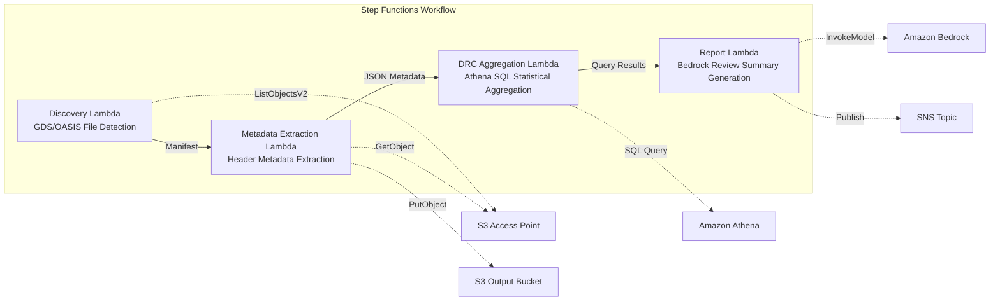
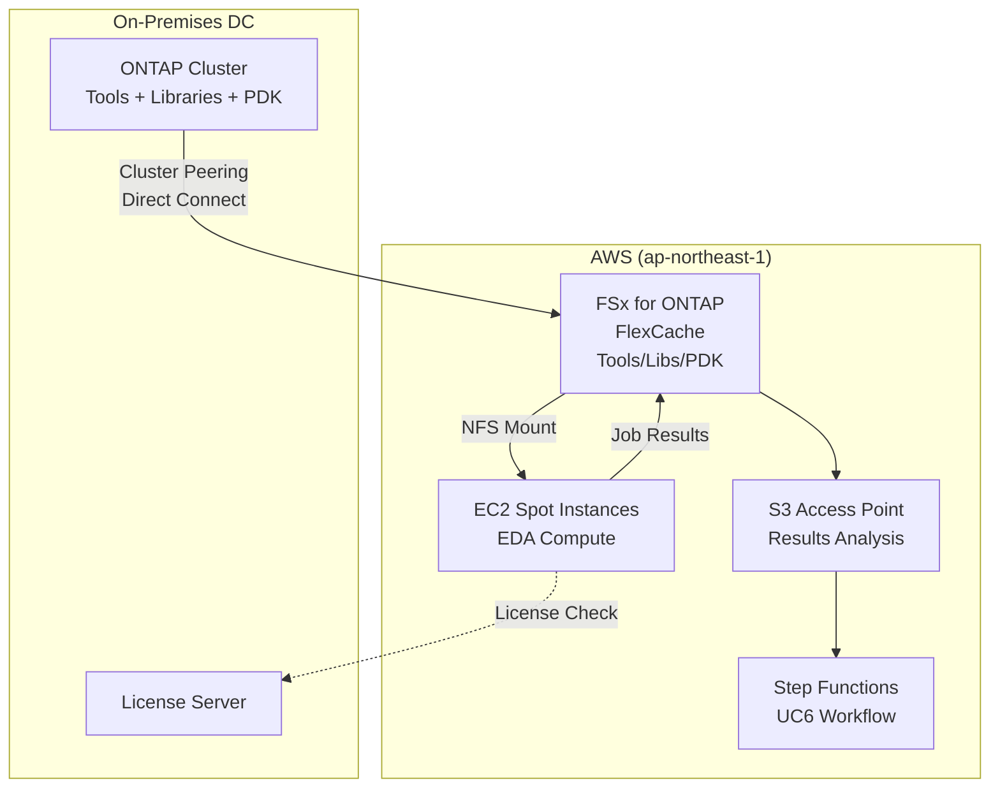

# UC6: Semiconductor / EDA — Design File Validation & Metadata Extraction

🌐 **Language / 言語**: [日本語](README.md) | English | [한국어](README.ko.md) | [简体中文](README.zh-CN.md) | [繁體中文](README.zh-TW.md) | [Français](README.fr.md) | [Deutsch](README.de.md) | [Español](README.es.md)

📚 **Documentation**: [Architecture Diagram](docs/architecture.en.md) | [Demo Guide](docs/demo-guide.en.md) | [Workshop Lab](https://catalog.us-east-1.prod.workshops.aws/workshops/9cd82e0b-8348-456b-932a-818b9e5825a1/en-US)

## Overview

A serverless workflow that leverages S3 Access Points for FSx for ONTAP to automate validation, metadata extraction, and DRC (Design Rule Check) statistical aggregation of GDS/OASIS semiconductor design files.

### When This Pattern Is a Good Fit

- Large volumes of GDS/OASIS design files are accumulated on FSx for ONTAP
- You want to automatically catalog design file metadata (library name, cell count, bounding box, etc.)
- You need to periodically aggregate DRC statistics to track design quality trends
- Cross-cutting design metadata analysis via Athena SQL is required
- You want to auto-generate natural language design review summaries

### When This Pattern Is Not a Good Fit

- Real-time DRC execution is required (assumes EDA tool integration)
- Physical validation of design files (full manufacturing rule compliance verification) is needed
- An EC2-based EDA toolchain is already running and migration costs are not justified
- Network reachability to the ONTAP REST API cannot be ensured

### Key Features

- Automatic detection of GDS/OASIS files via S3 AP (.gds, .gds2, .oas, .oasis)
- Header metadata extraction (library_name, units, cell_count, bounding_box, creation_date)
- DRC statistical aggregation via Athena SQL (cell count distribution, bounding box outliers, naming convention violations)
- Natural language design review summary generation via Amazon Bedrock
- Immediate result sharing via SNS notifications


## Success Metrics

### Outcome
Reduce design review preparation effort by automating GDS/OASIS validation and metadata extraction.

### Metrics
| Metric | Target (example) |
|-----------|------------|
| Design files processed / execution | > 100 files |
| Validation error detection rate | 100% (known error patterns) |
| Bedrock report generation time | < 3 minutes |
| Athena query response time | < 10 seconds |
| Cost / execution | < $5 |
| Human Review target rate | < 15% (design review findings) |

### Measurement Method
Step Functions execution history, Athena query results, Bedrock report metadata, CloudWatch Metrics.

## Architecture



### Workflow Steps

1. **Discovery**: Detects .gds, .gds2, .oas, .oasis files from the S3 AP and generates a Manifest
2. **Metadata Extraction**: Extracts metadata from each design file's header and outputs date-partitioned JSON to S3
3. **DRC Aggregation**: Performs cross-cutting analysis of the metadata catalog via Athena SQL and aggregates DRC statistics
4. **Report Generation**: Generates a design review summary via Bedrock and outputs to S3 + SNS notification

## Prerequisites

- AWS account with appropriate IAM permissions
- FSx for ONTAP file system (ONTAP 9.17.1P4D3 or later)
- A volume with S3 Access Point enabled (containing GDS/OASIS files)
- VPC with private subnets
- **NAT Gateway or VPC Endpoints** (required for Discovery Lambda to access AWS services from within the VPC)
- Amazon Bedrock model access enabled (Claude / Nova)
- ONTAP REST API credentials stored in Secrets Manager

## Deployment Steps

### 1. Create the S3 Access Point

Create an S3 Access Point on the volume that stores GDS/OASIS files.

#### Creating via AWS CLI

```bash
aws fsx create-and-attach-s3-access-point \
  --name <your-s3ap-name> \
  --type ONTAP \
  --ontap-configuration '{
    "VolumeId": "<your-volume-id>",
    "FileSystemIdentity": {
      "Type": "UNIX",
      "UnixUser": {
        "Name": "root"
      }
    }
  }' \
  --region <your-region>
```

After creation, note the `S3AccessPoint.Alias` from the response (in the format `xxx-ext-s3alias`).

#### Creating via AWS Management Console

1. Open the [Amazon FSx console](https://console.aws.amazon.com/fsx/)
2. Select the target file system
3. Select the target volume from the "Volumes" tab
4. Select the "S3 access points" tab
5. Click "Create and attach S3 access point"
6. Enter the access point name and specify the file system identity type (UNIX/WINDOWS) and user
7. Click "Create"

> For details, see [Creating S3 Access Points for FSx for ONTAP](https://docs.aws.amazon.com/fsx/latest/ONTAPGuide/s3-access-points-create-fsxn.html).

#### Checking S3 AP Status

```bash
aws fsx describe-s3-access-point-attachments --region <your-region> \
  --query 'S3AccessPointAttachments[*].{Name:Name,Lifecycle:Lifecycle,Alias:S3AccessPoint.Alias}' \
  --output table
```

Wait until `Lifecycle` becomes `AVAILABLE` (typically 1–2 minutes).

### 2. Upload Sample Files (Optional)

Upload test GDS files to the volume:

```bash
S3AP_ALIAS="<your-s3ap-alias>"

aws s3 cp test-data/semiconductor-eda/eda-designs/test_chip.gds \
  "s3://${S3AP_ALIAS}/eda-designs/test_chip.gds" --region <your-region>

aws s3 cp test-data/semiconductor-eda/eda-designs/test_chip_v2.gds2 \
  "s3://${S3AP_ALIAS}/eda-designs/test_chip_v2.gds2" --region <your-region>
```

### 3. SAM Deployment

```bash
# Prerequisite: AWS SAM CLI required. 'sam build' packages the code and shared layer automatically.
sam build

sam deploy \
  --stack-name fsxn-semiconductor-eda \
  --parameter-overrides \
    S3AccessPointAlias=<your-s3ap-alias> \
    S3AccessPointName=<your-s3ap-name> \
    OntapSecretName=<your-secret-name> \
    OntapManagementIp=<ontap-mgmt-ip> \
    SvmUuid=<your-svm-uuid> \
    VpcId=<your-vpc-id> \
    PrivateSubnetIds=<subnet-1>,<subnet-2> \
    PrivateRouteTableIds=<rtb-1>,<rtb-2> \
    NotificationEmail=<your-email@example.com> \
    BedrockModelId=apac.amazon.nova-lite-v1:0 \
    EnableVpcEndpoints=true \
    MapConcurrency=10 \
    LambdaMemorySize=512 \
    LambdaTimeout=300 \
  --capabilities CAPABILITY_NAMED_IAM \
  --resolve-s3 \
  --region <your-region>
```

> **Important**: `S3AccessPointName` is the name of the S3 AP (the name specified at creation time, not the Alias). It is used for ARN-based permission grants in IAM policies. Omitting it may result in `AccessDenied` errors.

### 4. Confirm SNS Subscription

After deployment, a confirmation email will be sent to the specified email address. Click the link to confirm.

### 5. Verify Operation

Manually execute the Step Functions state machine to verify operation:

```bash
aws stepfunctions start-execution \
  --state-machine-arn "arn:aws:states:<region>:<account-id>:stateMachine:fsxn-semiconductor-eda-workflow" \
  --input '{}' \
  --region <your-region>
```

> **Note**: On the first execution, the Athena DRC aggregation results may return 0 rows. This is because there is a time lag before metadata is reflected in the Glue table. Correct statistics will be obtained from the second execution onward.

> **Note**: `template.yaml` is designed for use with SAM CLI (`sam build` + `sam deploy`).
> To deploy with raw `aws cloudformation deploy`, use `template-deploy.yaml` instead (requires pre-packaging Lambda zip files and uploading them to an S3 bucket).

## Configuration Parameters

| Parameter | Description | Default | Required |
|-----------|-------------|---------|----------|
| `S3AccessPointAlias` | FSx for ONTAP S3 AP Alias (for input) | — | ✅ |
| `S3AccessPointName` | S3 AP name (for ARN-based IAM permission grants) | `""` | ⚠️ Recommended |
| `OntapSecretName` | Secrets Manager secret name for ONTAP REST API credentials | — | ✅ |
| `OntapManagementIp` | ONTAP cluster management IP address | — | ✅ |
| `SvmUuid` | ONTAP SVM UUID | — | ✅ |
| `ScheduleExpression` | EventBridge Scheduler schedule expression | `rate(1 hour)` | |
| `VpcId` | VPC ID | — | ✅ |
| `PrivateSubnetIds` | List of private subnet IDs | — | ✅ |
| `PrivateRouteTableIds` | Route table IDs for private subnets (for S3 Gateway Endpoint) | `""` | |
| `NotificationEmail` | SNS notification email address | — | ✅ |
| `BedrockModelId` | Bedrock model ID | `apac.amazon.nova-lite-v1:0` | |
| `MapConcurrency` | Map state parallel execution count | `10` | |
| `LambdaMemorySize` | Lambda memory size (MB) | `256` | |
| `LambdaTimeout` | Lambda timeout (seconds) | `300` | |
| `EnableVpcEndpoints` | Enable Interface VPC Endpoints | `false` | |
| `EnableCloudWatchAlarms` | Enable CloudWatch Alarms | `false` | |
| `EnableXRayTracing` | Enable X-Ray tracing | `true` | |

> ⚠️ **`S3AccessPointName`**: Optional, but if omitted the IAM policy will be Alias-based only, which may cause `AccessDenied` errors in some environments. Specifying this parameter is recommended for production environments.

## Troubleshooting

### Discovery Lambda Times Out

**Cause**: Lambda running in the VPC cannot reach AWS services (Secrets Manager, S3, CloudWatch).

**Solution**: Verify one of the following:
1. Deploy with `EnableVpcEndpoints=true` and specify `PrivateRouteTableIds`
2. A NAT Gateway exists in the VPC and the private subnet route tables have a route to the NAT Gateway

### AccessDenied Error (ListObjectsV2)

**Cause**: The IAM policy is missing ARN-based permissions for the S3 Access Point.

**Solution**: Specify the S3 AP name (the name given at creation time, not the Alias) in the `S3AccessPointName` parameter and update the stack.

### Athena DRC Aggregation Returns 0 Results

**Cause**: The `metadata_prefix` filter used by the DRC Aggregation Lambda may not match the actual `file_key` values in the metadata JSON. Additionally, on the first execution, no metadata exists in the Glue table, resulting in 0 rows.

**Solution**:
1. Execute the Step Functions workflow twice (the first run writes metadata to S3, and the second run allows Athena to aggregate it)
2. Run `SELECT * FROM "<db>"."<table>" LIMIT 10` directly in the Athena console to confirm data is readable
3. If data is readable but aggregation returns 0 results, check the consistency between `file_key` values and the `prefix` filter

## Cleanup

```bash
# Empty the S3 bucket
aws s3 rm s3://fsxn-semiconductor-eda-output-${AWS_ACCOUNT_ID} --recursive

# Delete the CloudFormation stack
aws cloudformation delete-stack \
  --stack-name fsxn-semiconductor-eda \
  --region ap-northeast-1

# Wait for deletion to complete
aws cloudformation wait stack-delete-complete \
  --stack-name fsxn-semiconductor-eda \
  --region ap-northeast-1
```

## Supported Regions

UC6 uses the following services:

| Service | Regional Constraints |
|---------|-------------|
| Amazon Athena | Available in most regions |
| Amazon Bedrock | Check supported regions ([Bedrock supported regions](https://docs.aws.amazon.com/general/latest/gr/bedrock.html)) |
| AWS X-Ray | Available in most regions |
| CloudWatch EMF | Available in most regions |

> For details, see the [Region Compatibility Matrix](../docs/region-compatibility.md).

## References

- [FSx for ONTAP S3 Access Points Overview](https://docs.aws.amazon.com/fsx/latest/ONTAPGuide/accessing-data-via-s3-access-points.html)
- [Creating and Attaching S3 Access Points](https://docs.aws.amazon.com/fsx/latest/ONTAPGuide/s3-access-points-create-fsxn.html)
- [Managing Access for S3 Access Points](https://docs.aws.amazon.com/fsx/latest/ONTAPGuide/s3-ap-manage-access-fsxn.html)
- [Amazon Athena User Guide](https://docs.aws.amazon.com/athena/latest/ug/what-is.html)
- [Amazon Bedrock API Reference](https://docs.aws.amazon.com/bedrock/latest/APIReference/API_runtime_InvokeModel.html)
- [GDSII Format Specification](https://boolean.klaasholwerda.nl/interface/bnf/gdsformat.html)
- [AWS Workshop Studio: Amazon Quick + FSx for ONTAP S3 AP Hands-on](https://catalog.us-east-1.prod.workshops.aws/workshops/9cd82e0b-8348-456b-932a-818b9e5825a1/en-US/08-quicksuite/61-setup)
- [AWS Storage Blog: Enabling AI-powered analytics on enterprise file data](https://aws.amazon.com/blogs/storage/enabling-ai-powered-analytics-on-enterprise-file-data-configuring-s3-access-points-for-amazon-fsx-for-netapp-ontap-with-active-directory/)
- [Guidance for Scaling Electronic Design Automation (EDA) on AWS](https://aws.amazon.com/solutions/guidance/scaling-electronic-design-automation-on-aws/)

## Amazon Quick Integration (AI-Powered EDA Data Access)

By integrating UC6 outputs (DRC statistics, design metadata, review summaries) with **Amazon Quick** (the evolution of Amazon QuickSight into a unified AI workspace), EDA teams can access design quality data through natural language queries.

### Quick Features Mapped to UC6 Outputs

| Quick Feature | UC6 Integration Point | Data Type |
|-----------|-----------------|-----------|
| **Quick Index / Research** | Search design files + Bedrock review summaries on S3 AP | GDS/OASIS + reports (md/json) |
| **Quick Sight** | BI dashboards from Athena/Glue DRC statistics tables | Structured data (Parquet/CSV) |
| **Quick Flows** | Auto-create review requests when DRC anomalies detected | Action automation (json) |
| **Quick Automate** | Triage regression results → assign owners automatically | End-to-end process |

### Setup Steps (Overview)

1. Create FSx for ONTAP S3 AP with **AD user (Windows identity)**
2. Amazon Quick console → Integrations → Knowledge bases → Amazon S3
3. Enter `s3://<S3-AP-alias>` as the S3 bucket URL and sync
4. DRC statistics dashboard: Add Athena as a Quick Sight dataset
5. Configure Quick Flows for DRC threshold alerts and review automation

> **Prerequisite**: The S3 AP must be configured with an AD-based Windows identity (UNIX identity does not allow adding Quick's data access role to the AP policy). See the [AWS Workshop Studio hands-on lab](https://catalog.us-east-1.prod.workshops.aws/workshops/9cd82e0b-8348-456b-932a-818b9e5825a1/en-US/08-quicksuite/61-setup) for detailed steps.

### EDA Team Use Case Examples

| Scenario | Experience Enabled by Quick |
|---------|---------------------|
| Designer checks DRC trends | Ask "What are the top 5 DRC error cells from last week?" in natural language |
| Team lead retrieves quality reports | Cross-search design review summaries via Quick Research |
| Manager automates weekly reports | Quick Flows sends DRC statistics summary every Monday |
| Regression result triage for new process node | Quick Automate classifies errors → assigns owners → creates Jira tickets |

### Related Patterns

- [Amazon Quick Agentic Workspace (UC30)](../../genai/quick-agentic-workspace/) — Full implementation of an agentic workspace using all Quick Suite features
- [Verification script: verify-quick-s3ap.sh](../../../scripts/verify-quick-s3ap.sh) — E2E verification from AD environment setup to Quick connection

---

## Workshop-Validated EDA Scenarios

> **Hands-on Lab**: [FSx for ONTAP S3 Access Points Workshop](https://catalog.us-east-1.prod.workshops.aws/workshops/9cd82e0b-8348-456b-932a-818b9e5825a1/en-US)
>
> Detailed integration guide: [Workshop EDA Integration Guide](../../../docs/en/workshop-eda-integration.md)

EDA workflow scenarios validated in AWS Workshop Studio can be productionized with this UC6 pattern.

### Data Generation (Module 06)

The Workshop generates 500 EDA jobs with ~2,000 log files covering:

| EDA Tool | Log Type | UC6 Processing |
|----------|----------|----------------|
| LSF (IBM Spectrum) | Job scheduling | Resource usage aggregation, bottleneck identification |
| Cadence ncvlog/ncelab | Compilation | Error/warning count, per-module aggregation |
| Cadence Xcelium | Simulation | PASS/FAIL/UVM_FATAL detection, triage |
| Coverage Analysis | Post-processing | Coverage rate aggregation, threshold alerts |

> No licenses needed — all scenarios can be experienced with synthetic data using DemoMode=true.

### Athena SQL Analysis (Module 13)

Run SQL queries directly on CSV data via S3 AP to analyze EDA regression results:

```sql
-- Per-module failure count
SELECT module_name, COUNT(*) as failure_count
FROM eda_regression WHERE status = 'FAIL'
GROUP BY module_name ORDER BY failure_count DESC;

-- Identify timing violations
SELECT job_id, module_name, timing_slack
FROM eda_regression WHERE timing_slack < 0
ORDER BY timing_slack ASC LIMIT 20;

-- License failure root cause
SELECT license_feature, COUNT(*) as checkout_failures
FROM eda_regression WHERE error_type = 'LICENSE_CHECKOUT_FAILED'
GROUP BY license_feature ORDER BY checkout_failures DESC;
```

### Glue Data Catalog (Module 14)

Auto-discover data schema on S3 AP with Glue Crawler, enabling unified access from Athena / Quick Sight / SageMaker:

```yaml
# IAM policy: Glue Crawler → S3 AP
- Sid: GlueCrawlerS3APAccess
  Effect: Allow
  Action:
    - s3:GetObject
    - s3:ListBucket
  Resource:
    - !Sub "arn:aws:s3:${AWS::Region}:${AWS::AccountId}:accesspoint/${S3AccessPointName}"
    - !Sub "arn:aws:s3:${AWS::Region}:${AWS::AccountId}:accesspoint/${S3AccessPointName}/object/*"
```

### Event-Driven Processing (Module 15)

EventBridge Scheduler + Lambda automatically parses logs after regression completes and immediately alerts on UVM_FATAL errors:

| Trigger Approach | Latency | Complexity | Pattern Support |
|-----------------|---------|-----------|:---:|
| EventBridge Scheduler (polling) | Minutes to hours | Low | ✅ TriggerMode=POLLING |
| FPolicy → EventBridge (event-driven) | Seconds to minutes | High | ✅ TriggerMode=EVENT_DRIVEN |
| S3 Event Notifications | — | — | ❌ Not supported for S3 AP |

### Quick Automations (Module 12)

Automation scenarios for EDA teams:

| Automation | Trigger | Action |
|-----------|---------|--------|
| Daily triage | Every morning 9:00 | Email regression failure summary |
| Coverage gate | Real-time | Alert when module coverage < 80% |
| License monitor | Every 15 min | Detect and notify recurring checkout failures |

---

## FlexCache Cloud Burst Extension

### Overview

In EDA workloads, Tools/Libraries/PDK are read-centric and are ideal targets for FlexCache. By caching the EDA toolchain stored on an on-premises ONTAP Origin into FSx for ONTAP FlexCache on AWS, you can significantly improve data access performance during cloud bursting.

### EDA Volume Classification and FlexCache Applicability

| Volume Type | Access Pattern | FlexCache Applicability | S3 AP Usage |
|--------------|---------------|:---:|:---:|
| Tools (Cadence/Synopsys/Siemens) | Read-only | ✅ Optimal | ⚠️ Binary |
| Libraries | Read-only | ✅ Optimal | ⚠️ Binary |
| PDK (Process Design Kit) | Read-only | ✅ Optimal | ⚠️ Binary |
| RCS (Revision Control) | Read/write | ❌ | ❌ |
| Home | Read/write | ❌ | ❌ |
| Scratch | Write-centric | ❌ | ❌ |
| Results | Write → read | ❌ | ✅ For analysis |

### Cloud Burst Architecture



### KPI

| KPI | Without FlexCache | With FlexCache | Improvement |
|-----|--------------|---------------|--------|
| EDA job start wait time | 15-30 min (WAN) | 1-3 min (cache hit) | 80-90% |
| Regression completion time | 8 hours | 3 hours | 62% |
| WAN transfer volume/day | 500GB | 50GB | 90% |
| License utilization efficiency | 60% | 85% | +25pt |

### Related Patterns

- [Dynamic FlexCache Render/EDA Workflow](../dynamic-flexcache-render-workflow/README.md) — Dynamic per-job FlexCache creation and deletion
- [FlexCache AnyCast / DR](../flexcache-anycast-dr/README.md) — Multi-region cloud bursting
- [Industry / Workload Mapping](../docs/industry-workload-mapping.md) — Pattern D: EDA Cloud Burst


---

## AWS Documentation Links

| Service | Documentation |
|---------|------------|
| FSx for ONTAP | [User Guide](https://docs.aws.amazon.com/fsx/latest/ONTAPGuide/what-is-fsx-ontap.html) |
| S3 Access Points | [S3 AP for FSx for ONTAP](https://docs.aws.amazon.com/fsx/latest/ONTAPGuide/s3-access-points.html) |
| Step Functions | [Developer Guide](https://docs.aws.amazon.com/step-functions/latest/dg/welcome.html) |
| Amazon Athena | [User Guide](https://docs.aws.amazon.com/athena/latest/ug/what-is.html) |
| Amazon Bedrock | [User Guide](https://docs.aws.amazon.com/bedrock/latest/userguide/what-is-bedrock.html) |

### Well-Architected Framework Alignment

| Pillar | Alignment |
|----|------|
| Operational Excellence | X-Ray tracing, EMF metrics, DRC statistics dashboard |
| Security | Least-privilege IAM, KMS encryption, design data access control |
| Reliability | Step Functions Retry/Catch, metadata extraction retries |
| Performance Efficiency | GDS header partial reads, Athena partitioning |
| Cost Optimization | Serverless (billed only when used), Athena scan optimization |
| Sustainability | On-demand execution, incremental processing (changed files only) |


---

## Cost Estimate (Approximate Monthly)

> **Note**: The following are estimates for the ap-northeast-1 region; actual costs vary by usage. Check the latest pricing with the [AWS Pricing Calculator](https://calculator.aws/).

### Serverless Components (Pay-as-you-go)

| Service | Unit Price | Estimated Usage | Approx. Monthly |
|---------|------|-----------|---------|
| Lambda | $0.0000166667/GB-sec | 5 functions × 100 files/day | ~$1-5 |
| S3 API (GetObject/ListObjects) | $0.0047/10K requests | ~10K requests/day | ~$1.5 |
| Step Functions | $0.025/1K state transitions | ~1K transitions/day | ~$0.75 |
| Bedrock (Nova Lite) | $0.00006/1K input tokens | ~50K tokens/execution | ~$3-10 |
| Athena | $5/TB scanned | ~10 MB/query | ~$0.5-2 |
| SNS | $0.50/100K notifications | ~100 notifications/day | ~$0.15 |
| CloudWatch Logs | $0.76/GB ingested | ~1 GB/month | ~$0.76 |
| Glue ETL (optional) | $0.44/DPU-hour |


### Fixed Cost (FSx for ONTAP — Assuming Existing Environment)

| Component | Monthly |
|--------------|------|
| FSx for ONTAP (128 MBps, 1 TB) | ~$230 (shared with existing environment) |
| S3 Access Point | No additional charge (S3 API charges only) |

### Total Estimate

| Configuration | Approx. Monthly |
|------|---------|
| Minimal (once daily) | ~$5-15 |
| Standard (hourly) | ~$15-50 |
| Large-scale (high frequency + alarms) | ~$50-150 |

> **Governance Caveat**: Cost estimates are approximate and not guaranteed. Actual charges vary by usage pattern, data volume, and region.

---

## Local Testing

### Prerequisites Check

```bash
# Verify prerequisites
aws --version          # AWS CLI v2
sam --version          # SAM CLI
python3 --version      # Python 3.9+
docker --version       # Docker (for sam local)
aws sts get-caller-identity  # AWS credentials
```

### sam local invoke

```bash
# Build
# Prerequisite: AWS SAM CLI required. 'sam build' packages the code and shared layer automatically.
sam build

# Run Discovery Lambda locally
sam local invoke DiscoveryFunction --event events/discovery-event.json

# With environment variable overrides
sam local invoke DiscoveryFunction \
  --event events/discovery-event.json \
  --env-vars env.json
```

### Unit Tests

```bash
python3 -m pytest tests/ -v
```

For details, see the [Local Testing Quick Start](../docs/local-testing-quick-start.md).

---

## Output Sample (Output Sample)

Example output of EDA design file validation:

```json
{
  "discovery": {
    "status": "completed",
    "object_count": 5,
    "prefix": "eda-designs/"
  },
  "metadata_extraction": [
    {
      "key": "eda-designs/top_chip_v3.gds",
      "format": "GDSII",
      "cell_count": 1284,
      "bounding_box": {"max_x": 12000.5, "max_y": 9800.2}
    }
  ],
  "drc_aggregation": {
    "total_violations": 23,
    "critical": 2,
    "major": 8,
    "minor": 13,
    "categories": {"spacing": 10, "width": 8, "enclosure": 5}
  },
  "report": {
    "report_key": "reports/design-review-2026-05-23.md",
    "recommendation": "2 critical DRC violations require manual review before tapeout"
  }
}
```

> **Note**: The above is sample output; actual values vary by environment and input data. Benchmark figures are sizing references, not service limits.

---

## Governance Note

> This pattern provides technical architecture guidance. It is not legal, compliance, or regulatory advice. Organizations should consult qualified professionals.

---

## S3AP Compatibility

For compatibility constraints, troubleshooting, and trigger patterns for S3 Access Points for FSx for ONTAP, see [S3AP Compatibility Notes](../docs/s3ap-compatibility-notes.md).
