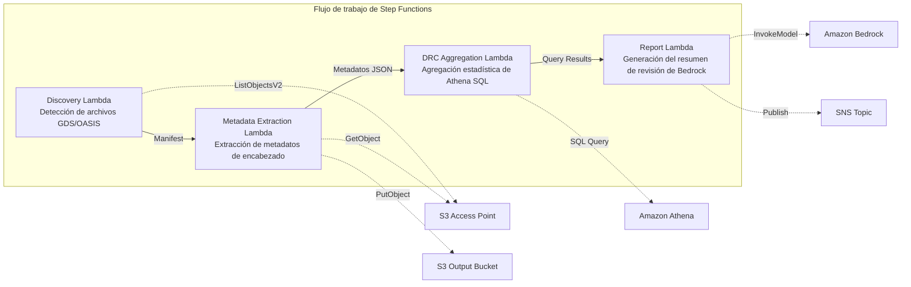
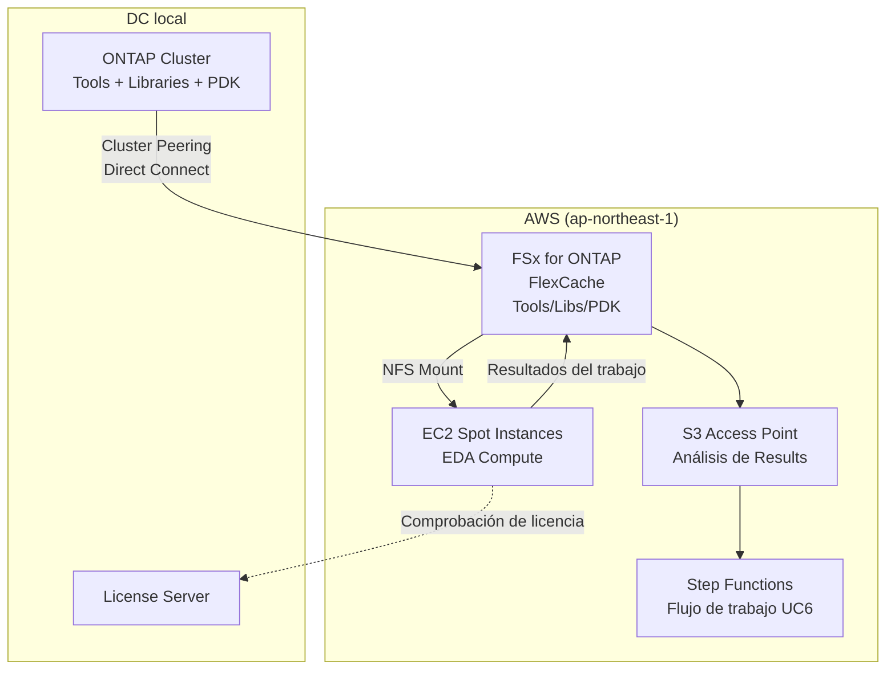

# UC6: Semiconductores / EDA — Validación de archivos de diseño y extracción de metadatos

🌐 **Language / 言語**: [日本語](README.md) | [English](README.en.md) | [한국어](README.ko.md) | [简体中文](README.zh-CN.md) | [繁體中文](README.zh-TW.md) | [Français](README.fr.md) | [Deutsch](README.de.md) | Español

📚 **Documentación**: [Diagrama de arquitectura](docs/architecture.es.md) | [Guía de demostración](docs/demo-guide.es.md) | [Workshop Lab](https://catalog.us-east-1.prod.workshops.aws/workshops/9cd82e0b-8348-456b-932a-818b9e5825a1/en-US)

## Descripción general

Un flujo de trabajo sin servidor que aprovecha los S3 Access Points para FSx for ONTAP con el fin de automatizar la validación, la extracción de metadatos y la agregación estadística de DRC (Design Rule Check) de archivos de diseño de semiconductores GDS/OASIS.

### Cuándo es adecuado este patrón

- Se han acumulado grandes volúmenes de archivos de diseño GDS/OASIS en FSx for ONTAP
- Desea catalogar automáticamente los metadatos de los archivos de diseño (nombre de biblioteca, número de celdas, cuadro delimitador, etc.)
- Necesita agregar periódicamente las estadísticas de DRC para seguir las tendencias de calidad del diseño
- Se requiere un análisis transversal de los metadatos de diseño mediante Athena SQL
- Desea generar automáticamente resúmenes de revisión de diseño en lenguaje natural

### Cuándo no es adecuado este patrón

- Se requiere la ejecución de DRC en tiempo real (se supone la integración de herramientas EDA)
- Se necesita la validación física de los archivos de diseño (verificación completa del cumplimiento de las reglas de fabricación)
- Ya está en funcionamiento una cadena de herramientas EDA basada en EC2 y los costes de migración no se justifican
- Un entorno en el que no se puede garantizar la accesibilidad de red a la API REST de ONTAP

### Funciones principales

- Detección automática de archivos GDS/OASIS a través del S3 AP (.gds, .gds2, .oas, .oasis)
- Extracción de metadatos de encabezado (library_name, units, cell_count, bounding_box, creation_date)
- Agregación estadística de DRC mediante Athena SQL (distribución del número de celdas, valores atípicos del cuadro delimitador, infracciones de la convención de nombres)
- Generación de resúmenes de revisión de diseño en lenguaje natural mediante Amazon Bedrock
- Uso compartido inmediato de resultados mediante notificaciones SNS


## Success Metrics

### Outcome
Reducir el esfuerzo de preparación de las revisiones de diseño automatizando la validación GDS/OASIS y la extracción de metadatos.

### Metrics
| Métrica | Valor objetivo (ejemplo) |
|-----------|------------|
| Archivos de diseño procesados / ejecución | > 100 files |
| Tasa de detección de errores de validación | 100 % (patrones de error conocidos) |
| Tiempo de generación del informe de Bedrock | < 3 minutos |
| Tiempo de respuesta de la consulta de Athena | < 10 segundos |
| Coste / ejecución | < $5 |
| Tasa objetivo de Human Review | < 15 % (observaciones de revisión de diseño) |

### Measurement Method
Historial de ejecución de Step Functions, resultados de consultas de Athena, metadatos del informe de Bedrock, CloudWatch Metrics.

## Arquitectura



### Pasos del flujo de trabajo

1. **Discovery**: Detecta archivos .gds, .gds2, .oas, .oasis desde el S3 AP y genera un Manifest
2. **Metadata Extraction**: Extrae metadatos del encabezado de cada archivo de diseño y genera JSON particionado por fecha en S3
3. **DRC Aggregation**: Realiza un análisis transversal del catálogo de metadatos mediante Athena SQL y agrega las estadísticas de DRC
4. **Report Generation**: Genera un resumen de revisión de diseño mediante Bedrock y lo envía a S3 + notificación SNS

## Requisitos previos

- Cuenta de AWS con los permisos IAM adecuados
- Sistema de archivos FSx for ONTAP (ONTAP 9.17.1P4D3 o posterior)
- Un volumen con S3 Access Point habilitado (que contenga archivos GDS/OASIS)
- VPC, subredes privadas
- **NAT Gateway o VPC Endpoints** (necesarios para que la Discovery Lambda acceda a los servicios de AWS desde dentro de la VPC)
- Acceso a los modelos de Amazon Bedrock habilitado (Claude / Nova)
- Credenciales de la API REST de ONTAP almacenadas en Secrets Manager

## Pasos de implementación

### 1. Crear el S3 Access Point

Cree un S3 Access Point en el volumen que almacena los archivos GDS/OASIS.

#### Creación mediante AWS CLI

```bash
aws fsx create-and-attach-s3-access-point \
  --name <your-s3ap-name> \
  --type ONTAP \
  --ontap-configuration '{
    "VolumeId": "<your-volume-id>",
    "FileSystemIdentity": {
      "Type": "UNIX",
      "UnixUser": {
        "Name": "root"
      }
    }
  }' \
  --region <your-region>
```

Después de la creación, anote el `S3AccessPoint.Alias` de la respuesta (en el formato `xxx-ext-s3alias`).

#### Creación mediante la consola de administración de AWS

1. Abra la [consola de Amazon FSx](https://console.aws.amazon.com/fsx/)
2. Seleccione el sistema de archivos de destino
3. Seleccione el volumen de destino en la pestaña «Volúmenes»
4. Seleccione la pestaña «Puntos de acceso de S3»
5. Haga clic en «Crear y adjuntar punto de acceso de S3»
6. Introduzca el nombre del punto de acceso y especifique el tipo de identidad del sistema de archivos (UNIX/WINDOWS) y el usuario
7. Haga clic en «Crear»

> Para más detalles, consulte [Creación de S3 Access Points para FSx for ONTAP](https://docs.aws.amazon.com/fsx/latest/ONTAPGuide/s3-access-points-create-fsxn.html).

#### Comprobación del estado del S3 AP

```bash
aws fsx describe-s3-access-point-attachments --region <your-region> \
  --query 'S3AccessPointAttachments[*].{Name:Name,Lifecycle:Lifecycle,Alias:S3AccessPoint.Alias}' \
  --output table
```

Espere hasta que `Lifecycle` sea `AVAILABLE` (normalmente de 1 a 2 minutos).

### 2. Cargar archivos de ejemplo (opcional)

Cargue archivos GDS de prueba en el volumen:

```bash
S3AP_ALIAS="<your-s3ap-alias>"

aws s3 cp test-data/semiconductor-eda/eda-designs/test_chip.gds \
  "s3://${S3AP_ALIAS}/eda-designs/test_chip.gds" --region <your-region>

aws s3 cp test-data/semiconductor-eda/eda-designs/test_chip_v2.gds2 \
  "s3://${S3AP_ALIAS}/eda-designs/test_chip_v2.gds2" --region <your-region>
```

### 3. Implementación de SAM

```bash
# Requisito previo: se necesita AWS SAM CLI. «sam build» empaqueta automáticamente el código y la capa compartida.
sam build

sam deploy \
  --stack-name fsxn-semiconductor-eda \
  --parameter-overrides \
    S3AccessPointAlias=<your-s3ap-alias> \
    S3AccessPointName=<your-s3ap-name> \
    OntapSecretName=<your-secret-name> \
    OntapManagementIp=<ontap-mgmt-ip> \
    SvmUuid=<your-svm-uuid> \
    VpcId=<your-vpc-id> \
    PrivateSubnetIds=<subnet-1>,<subnet-2> \
    PrivateRouteTableIds=<rtb-1>,<rtb-2> \
    NotificationEmail=<your-email@example.com> \
    BedrockModelId=apac.amazon.nova-lite-v1:0 \
    EnableVpcEndpoints=true \
    MapConcurrency=10 \
    LambdaMemorySize=512 \
    LambdaTimeout=300 \
  --capabilities CAPABILITY_NAMED_IAM \
  --resolve-s3 \
  --region <your-region>
```

> **Importante**: `S3AccessPointName` es el nombre del S3 AP (el nombre especificado en el momento de la creación, no el Alias). Se utiliza para las concesiones de permisos basadas en ARN en las políticas IAM. Omitirlo puede provocar errores `AccessDenied`.

### 4. Confirmar la suscripción de SNS

Después de la implementación, se enviará un correo electrónico de confirmación a la dirección de correo especificada. Haga clic en el enlace para confirmar.

### 5. Verificar el funcionamiento

Ejecute manualmente la máquina de estados de Step Functions para verificar el funcionamiento:

```bash
aws stepfunctions start-execution \
  --state-machine-arn "arn:aws:states:<region>:<account-id>:stateMachine:fsxn-semiconductor-eda-workflow" \
  --input '{}' \
  --region <your-region>
```

> **Nota**: En la primera ejecución, los resultados de agregación de DRC de Athena pueden devolver 0 filas. Esto se debe a que hay un retardo antes de que los metadatos se reflejen en la tabla de Glue. Se obtendrán estadísticas correctas a partir de la segunda ejecución.

> **Nota**: `template.yaml` está diseñado para su uso con SAM CLI (`sam build` + `sam deploy`).
> Para implementar con el comando puro `aws cloudformation deploy`, utilice en su lugar `template-deploy.yaml` (requiere empaquetar previamente los archivos zip de Lambda y cargarlos en un bucket de S3).

## Lista de parámetros de configuración

| Parámetro | Descripción | Predeterminado | Obligatorio |
|-----------|------|----------|------|
| `S3AccessPointAlias` | FSx for ONTAP S3 AP Alias (para la entrada) | — | ✅ |
| `S3AccessPointName` | Nombre del S3 AP (para concesiones de permisos IAM basadas en ARN) | `""` | ⚠️ Recomendado |
| `OntapSecretName` | Nombre del secreto de Secrets Manager para las credenciales de la API REST de ONTAP | — | ✅ |
| `OntapManagementIp` | Dirección IP de gestión del clúster de ONTAP | — | ✅ |
| `SvmUuid` | ONTAP SVM UUID | — | ✅ |
| `ScheduleExpression` | Expresión de programación de EventBridge Scheduler | `rate(1 hour)` | |
| `VpcId` | VPC ID | — | ✅ |
| `PrivateSubnetIds` | Lista de ID de subredes privadas | — | ✅ |
| `PrivateRouteTableIds` | Lista de ID de tablas de rutas de subredes privadas (para S3 Gateway Endpoint) | `""` | |
| `NotificationEmail` | Dirección de correo electrónico de destino de las notificaciones SNS | — | ✅ |
| `BedrockModelId` | ID del modelo de Bedrock | `apac.amazon.nova-lite-v1:0` | |
| `MapConcurrency` | Número de ejecuciones en paralelo del estado Map | `10` | |
| `LambdaMemorySize` | Tamaño de memoria de Lambda (MB) | `256` | |
| `LambdaTimeout` | Tiempo de espera de Lambda (segundos) | `300` | |
| `EnableVpcEndpoints` | Habilitar los Interface VPC Endpoints | `false` | |
| `EnableCloudWatchAlarms` | Habilitar las CloudWatch Alarms | `false` | |
| `EnableXRayTracing` | Habilitar el rastreo de X-Ray | `true` | |

> ⚠️ **`S3AccessPointName`**: Opcional, pero si se omite, la política IAM se basará únicamente en el Alias, lo que puede provocar errores `AccessDenied` en algunos entornos. Se recomienda especificar este parámetro en entornos de producción.

## Solución de problemas

### La Discovery Lambda agota el tiempo de espera

**Causa**: La Lambda que se ejecuta en la VPC no puede alcanzar los servicios de AWS (Secrets Manager, S3, CloudWatch).

**Solución**: Verifique una de las siguientes opciones:
1. Implemente con `EnableVpcEndpoints=true` y especifique `PrivateRouteTableIds`
2. Existe un NAT Gateway en la VPC y las tablas de rutas de las subredes privadas tienen una ruta hacia el NAT Gateway

### Error AccessDenied (ListObjectsV2)

**Causa**: A la política IAM le faltan los permisos basados en ARN para el S3 Access Point.

**Solución**: Especifique el nombre del S3 AP (el nombre dado en el momento de la creación, no el Alias) en el parámetro `S3AccessPointName` y actualice la stack.

### La agregación de DRC de Athena devuelve 0 resultados

**Causa**: El filtro `metadata_prefix` que utiliza la DRC Aggregation Lambda puede no coincidir con los valores `file_key` reales del JSON de metadatos. Además, en la primera ejecución no existen metadatos en la tabla de Glue, lo que da como resultado 0 filas.

**Solución**:
1. Ejecute el flujo de trabajo de Step Functions dos veces (la primera ejecución escribe los metadatos en S3 y la segunda permite que Athena los agregue)
2. Ejecute `SELECT * FROM "<db>"."<table>" LIMIT 10` directamente en la consola de Athena para confirmar que los datos son legibles
3. Si los datos son legibles pero la agregación devuelve 0 resultados, compruebe la coherencia entre los valores `file_key` y el filtro `prefix`

## Limpieza

```bash
# Vaciar el bucket de S3
aws s3 rm s3://fsxn-semiconductor-eda-output-${AWS_ACCOUNT_ID} --recursive

# Eliminar la stack de CloudFormation
aws cloudformation delete-stack \
  --stack-name fsxn-semiconductor-eda \
  --region ap-northeast-1

# Esperar a que se complete la eliminación
aws cloudformation wait stack-delete-complete \
  --stack-name fsxn-semiconductor-eda \
  --region ap-northeast-1
```

## Supported Regions

UC6 utiliza los siguientes servicios:

| Servicio | Restricciones regionales |
|---------|-------------|
| Amazon Athena | Disponible en la mayoría de las regiones |
| Amazon Bedrock | Compruebe las regiones compatibles ([Regiones compatibles con Bedrock](https://docs.aws.amazon.com/general/latest/gr/bedrock.html)) |
| AWS X-Ray | Disponible en la mayoría de las regiones |
| CloudWatch EMF | Disponible en la mayoría de las regiones |

> Para más detalles, consulte la [matriz de compatibilidad regional](../docs/region-compatibility.md).

## Enlaces de referencia

- [Descripción general de los S3 Access Points para FSx for ONTAP](https://docs.aws.amazon.com/fsx/latest/ONTAPGuide/accessing-data-via-s3-access-points.html)
- [Creación y adjunción de S3 Access Points](https://docs.aws.amazon.com/fsx/latest/ONTAPGuide/s3-access-points-create-fsxn.html)
- [Gestión de acceso para los S3 Access Points](https://docs.aws.amazon.com/fsx/latest/ONTAPGuide/s3-ap-manage-access-fsxn.html)
- [Guía del usuario de Amazon Athena](https://docs.aws.amazon.com/athena/latest/ug/what-is.html)
- [Referencia de la API de Amazon Bedrock](https://docs.aws.amazon.com/bedrock/latest/APIReference/API_runtime_InvokeModel.html)
- [Especificación del formato GDSII](https://boolean.klaasholwerda.nl/interface/bnf/gdsformat.html)
- [AWS Workshop: Amazon Quick + FSx for ONTAP S3 AP](https://catalog.us-east-1.prod.workshops.aws/workshops/9cd82e0b-8348-456b-932a-818b9e5825a1/en-US/08-quicksuite/61-setup)
- [AWS Storage Blog: AI-powered analytics on enterprise file data](https://aws.amazon.com/blogs/storage/enabling-ai-powered-analytics-on-enterprise-file-data-configuring-s3-access-points-for-amazon-fsx-for-netapp-ontap-with-active-directory/)
- [Guidance: Scaling EDA on AWS](https://aws.amazon.com/solutions/guidance/scaling-electronic-design-automation-on-aws/)

## Escenarios EDA validados por Workshop

> **Lab práctico**: [FSx for ONTAP S3 Access Points Workshop](https://catalog.us-east-1.prod.workshops.aws/workshops/9cd82e0b-8348-456b-932a-818b9e5825a1/en-US)

| Herramienta EDA | Tipo de log | Procesamiento UC6 |
|----------------|------------|-------------------|
| LSF (IBM Spectrum) | Programación de trabajos | Agregación de uso de recursos |
| Cadence ncvlog/ncelab | Compilación | Conteo de errores/advertencias |
| Cadence Xcelium | Simulación | Detección PASS/FAIL/UVM_FATAL |
| Coverage Analysis | Post-procesamiento | Agregación de tasa de cobertura |

| Método de activación | Latencia | Complejidad | Soporte |
|--------------------|----------|------------|:---:|
| EventBridge Scheduler (polling) | Minutos a horas | Baja | ✅ TriggerMode=POLLING |
| FPolicy → EventBridge (event-driven) | Segundos a minutos | Alta | ✅ TriggerMode=EVENT_DRIVEN |
| S3 Event Notifications | — | — | ❌ No soportado para S3 AP |

---

## Extensión Cloud Burst de FlexCache

### Descripción general

En las cargas de trabajo de EDA, los Tools/Libraries/PDK son de lectura predominante y son objetivos ideales para FlexCache. Al almacenar en caché la cadena de herramientas EDA guardada en un ONTAP Origin local en FSx for ONTAP FlexCache en AWS, puede mejorar considerablemente el rendimiento de acceso a los datos durante el cloud bursting.

### Clasificación de volúmenes EDA y aplicabilidad de FlexCache

| Tipo de volumen | Patrón de acceso | Aplicabilidad de FlexCache | Uso de S3 AP |
|--------------|---------------|:---:|:---:|
| Tools (Cadence/Synopsys/Siemens) | Solo lectura | ✅ Óptimo | ⚠️ Binario |
| Libraries | Solo lectura | ✅ Óptimo | ⚠️ Binario |
| PDK (Process Design Kit) | Solo lectura | ✅ Óptimo | ⚠️ Binario |
| RCS (Revision Control) | Lectura/escritura | ❌ | ❌ |
| Home | Lectura/escritura | ❌ | ❌ |
| Scratch | Escritura predominante | ❌ | ❌ |
| Results | Escritura → lectura | ❌ | ✅ Para análisis |

### Configuración de Cloud Burst



### KPI

| KPI | Sin FlexCache | Con FlexCache | Mejora |
|-----|--------------|---------------|--------|
| Tiempo de espera de inicio de trabajo EDA | 15-30 min (WAN) | 1-3 min (cache hit) | 80-90 % |
| Tiempo de finalización de la regresión | 8 horas | 3 horas | 62 % |
| Volumen de transferencia WAN/día | 500 GB | 50 GB | 90 % |
| Eficiencia de uso de licencias | 60 % | 85 % | +25 pt |

### Patrones relacionados

- [Dynamic FlexCache Render/EDA Workflow](../dynamic-flexcache-render-workflow/README.md) — Creación y eliminación dinámicas de FlexCache por trabajo
- [FlexCache AnyCast / DR](../flexcache-anycast-dr/README.md) — Cloud bursting multirregión
- [Asignación de sector/carga de trabajo](../docs/industry-workload-mapping.md) — Pattern D: EDA Cloud Burst


---

## Enlaces a la documentación de AWS

| Servicio | Documentación |
|---------|------------|
| FSx for ONTAP | [Guía del usuario](https://docs.aws.amazon.com/fsx/latest/ONTAPGuide/what-is-fsx-ontap.html) |
| S3 Access Points | [S3 AP for FSx for ONTAP](https://docs.aws.amazon.com/fsx/latest/ONTAPGuide/s3-access-points.html) |
| Step Functions | [Guía del desarrollador](https://docs.aws.amazon.com/step-functions/latest/dg/welcome.html) |
| Amazon Athena | [Guía del usuario](https://docs.aws.amazon.com/athena/latest/ug/what-is.html) |
| Amazon Bedrock | [Guía del usuario](https://docs.aws.amazon.com/bedrock/latest/userguide/what-is-bedrock.html) |

### Alineación con el Well-Architected Framework

| Pilar | Alineación |
|----|------|
| Excelencia operativa | Rastreo de X-Ray, métricas de EMF, panel de estadísticas de DRC |
| Seguridad | IAM de mínimo privilegio, cifrado KMS, control de acceso a los datos de diseño |
| Fiabilidad | Step Functions Retry/Catch, reintentos de extracción de metadatos |
| Eficiencia del rendimiento | Lectura parcial del encabezado GDS, particionamiento de Athena |
| Optimización de costes | Sin servidor (se factura solo cuando se usa), optimización del escaneo de Athena |
| Sostenibilidad | Ejecución bajo demanda, procesamiento incremental (solo archivos modificados) |


---

## Estimación de costes (aproximación mensual)

> **Nota**: Los valores siguientes son aproximaciones para la región ap-northeast-1; los costes reales varían según el uso. Compruebe los precios más recientes con la [AWS Pricing Calculator](https://calculator.aws/).

### Componentes sin servidor (pago por uso)

| Servicio | Precio unitario | Uso estimado | Aprox. mensual |
|---------|------|-----------|---------|
| Lambda | $0.0000166667/GB-sec | 5 funciones × 100 files/día | ~$1-5 |
| S3 API (GetObject/ListObjects) | $0.0047/10K requests | ~10K requests/día | ~$1.5 |
| Step Functions | $0.025/1K state transitions | ~1K transitions/día | ~$0.75 |
| Bedrock (Nova Lite) | $0.00006/1K input tokens | ~50K tokens/ejecución | ~$3-10 |
| Athena | $5/TB scanned | ~10 MB/consulta | ~$0.5-2 |
| SNS | $0.50/100K notifications | ~100 notifications/día | ~$0.15 |
| CloudWatch Logs | $0.76/GB ingested | ~1 GB/mes | ~$0.76 |
| Glue ETL (opcional) | $0.44/DPU-hour |


### Coste fijo (FSx for ONTAP — asumiendo un entorno existente)

| Componente | Mensual |
|--------------|------|
| FSx for ONTAP (128 MBps, 1 TB) | ~$230 (compartido con el entorno existente) |
| S3 Access Point | Sin cargo adicional (solo cargos de S3 API) |

### Estimación total

| Configuración | Aprox. mensual |
|------|---------|
| Configuración mínima (una vez al día) | ~$5-15 |
| Configuración estándar (por hora) | ~$15-50 |
| Configuración a gran escala (alta frecuencia + alarmas) | ~$50-150 |

> **Governance Caveat**: Las estimaciones de costes son aproximadas y no están garantizadas. Los cargos reales varían según el patrón de uso, el volumen de datos y la región.

---

## Pruebas locales

### Comprobación de requisitos previos

```bash
# Comprobar los requisitos previos
aws --version          # AWS CLI v2
sam --version          # SAM CLI
python3 --version      # Python 3.9+
docker --version       # Docker (para sam local)
aws sts get-caller-identity  # Credenciales de AWS
```

### sam local invoke

```bash
# Build
# Requisito previo: se necesita AWS SAM CLI. «sam build» empaqueta automáticamente el código y la capa compartida.
sam build

# Ejecutar la Discovery Lambda localmente
sam local invoke DiscoveryFunction --event events/discovery-event.json

# Con sobrescritura de variables de entorno
sam local invoke DiscoveryFunction \
  --event events/discovery-event.json \
  --env-vars env.json
```

### Pruebas unitarias

```bash
python3 -m pytest tests/ -v
```

Para más detalles, consulte la [Guía de inicio rápido de pruebas locales](../docs/local-testing-quick-start.md).

---

## Muestra de salida (Output Sample)

Ejemplo de salida de la validación de archivos de diseño EDA:

```json
{
  "discovery": {
    "status": "completed",
    "object_count": 5,
    "prefix": "eda-designs/"
  },
  "metadata_extraction": [
    {
      "key": "eda-designs/top_chip_v3.gds",
      "format": "GDSII",
      "cell_count": 1284,
      "bounding_box": {"max_x": 12000.5, "max_y": 9800.2}
    }
  ],
  "drc_aggregation": {
    "total_violations": 23,
    "critical": 2,
    "major": 8,
    "minor": 13,
    "categories": {"spacing": 10, "width": 8, "enclosure": 5}
  },
  "report": {
    "report_key": "reports/design-review-2026-05-23.md",
    "recommendation": "2 critical DRC violations require manual review before tapeout"
  }
}
```

> **Nota**: Lo anterior es una salida de muestra; los valores reales varían según el entorno y los datos de entrada. Las cifras de referencia son referencias de dimensionamiento, no límites de servicio.

---

## Governance Note

> Este patrón proporciona orientación de arquitectura técnica. No constituye asesoramiento legal, de cumplimiento ni normativo. Las organizaciones deben consultar a profesionales cualificados.

---

## S3AP Compatibility

Para conocer las restricciones de compatibilidad, la solución de problemas y los patrones de activación de los S3 Access Points para FSx for ONTAP, consulte las [S3AP Compatibility Notes](../docs/s3ap-compatibility-notes.md).
