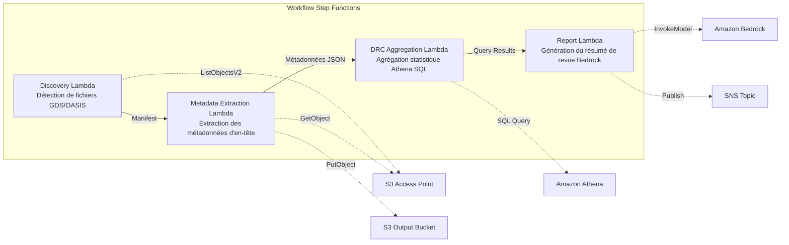
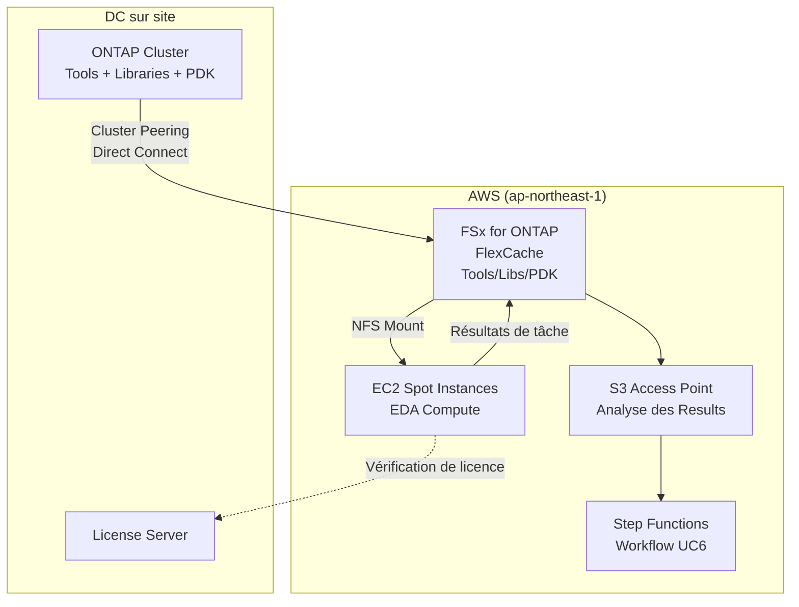

# UC6 : Semi-conducteurs / EDA — Validation des fichiers de conception et extraction de métadonnées

🌐 **Language / 言語**: [日本語](README.md) | [English](README.en.md) | [한국어](README.ko.md) | [简体中文](README.zh-CN.md) | [繁體中文](README.zh-TW.md) | Français | [Deutsch](README.de.md) | [Español](README.es.md)

📚 **Documentation** : [Schéma d'architecture](docs/architecture.fr.md) | [Guide de démonstration](docs/demo-guide.fr.md)

## Vue d'ensemble

Un workflow serverless qui exploite les S3 Access Points pour FSx for ONTAP afin d'automatiser la validation, l'extraction de métadonnées et l'agrégation statistique DRC (Design Rule Check) des fichiers de conception de semi-conducteurs GDS/OASIS.

### Quand ce modèle convient

- De grands volumes de fichiers de conception GDS/OASIS sont accumulés sur FSx for ONTAP
- Vous souhaitez cataloguer automatiquement les métadonnées des fichiers de conception (nom de bibliothèque, nombre de cellules, boîte englobante, etc.)
- Vous devez agréger périodiquement les statistiques DRC pour suivre les tendances de qualité de conception
- Une analyse transversale des métadonnées de conception via Athena SQL est requise
- Vous souhaitez générer automatiquement des résumés de revue de conception en langage naturel

### Quand ce modèle ne convient pas

- Une exécution DRC en temps réel est requise (suppose une intégration d'outils EDA)
- Une validation physique des fichiers de conception (vérification complète de la conformité aux règles de fabrication) est nécessaire
- Une chaîne d'outils EDA basée sur EC2 est déjà en service et les coûts de migration ne sont pas justifiés
- Un environnement où la joignabilité réseau vers l'API REST ONTAP ne peut pas être garantie

### Principales fonctionnalités

- Détection automatique des fichiers GDS/OASIS via S3 AP (.gds, .gds2, .oas, .oasis)
- Extraction des métadonnées d'en-tête (library_name, units, cell_count, bounding_box, creation_date)
- Agrégation statistique DRC via Athena SQL (distribution du nombre de cellules, valeurs aberrantes de boîte englobante, violations de convention de nommage)
- Génération de résumés de revue de conception en langage naturel via Amazon Bedrock
- Partage immédiat des résultats via notifications SNS


## Success Metrics

### Outcome
Réduire l'effort de préparation des revues de conception en automatisant la validation GDS/OASIS et l'extraction de métadonnées.

### Metrics
| Métrique | Valeur cible (exemple) |
|-----------|------------|
| Fichiers de conception traités / exécution | > 100 files |
| Taux de détection des erreurs de validation | 100 % (schémas d'erreurs connus) |
| Temps de génération du rapport Bedrock | < 3 minutes |
| Temps de réponse des requêtes Athena | < 10 secondes |
| Coût / exécution | < $5 |
| Taux ciblé pour Human Review | < 15 % (observations de revue de conception) |

### Measurement Method
Historique d'exécution Step Functions, résultats de requêtes Athena, métadonnées de rapport Bedrock, CloudWatch Metrics.

## Architecture



### Étapes du workflow

1. **Discovery** : Détecte les fichiers .gds, .gds2, .oas, .oasis depuis le S3 AP et génère un Manifest
2. **Metadata Extraction** : Extrait les métadonnées de l'en-tête de chaque fichier de conception et produit un JSON partitionné par date vers S3
3. **DRC Aggregation** : Effectue une analyse transversale du catalogue de métadonnées via Athena SQL et agrège les statistiques DRC
4. **Report Generation** : Génère un résumé de revue de conception via Bedrock et produit vers S3 + notification SNS

## Prérequis

- Compte AWS avec les autorisations IAM appropriées
- Système de fichiers FSx for ONTAP (ONTAP 9.17.1P4D3 ou ultérieur)
- Un volume avec S3 Access Point activé (contenant les fichiers GDS/OASIS)
- VPC, sous-réseaux privés
- **NAT Gateway ou VPC Endpoints** (requis pour que la Discovery Lambda accède aux services AWS depuis le VPC)
- Accès aux modèles Amazon Bedrock activé (Claude / Nova)
- Identifiants de l'API REST ONTAP stockés dans Secrets Manager

## Étapes de déploiement

### 1. Créer le S3 Access Point

Créez un S3 Access Point sur le volume qui stocke les fichiers GDS/OASIS.

#### Création via AWS CLI

```bash
aws fsx create-and-attach-s3-access-point \
  --name <your-s3ap-name> \
  --type ONTAP \
  --ontap-configuration '{
    "VolumeId": "<your-volume-id>",
    "FileSystemIdentity": {
      "Type": "UNIX",
      "UnixUser": {
        "Name": "root"
      }
    }
  }' \
  --region <your-region>
```

Après la création, notez le `S3AccessPoint.Alias` de la réponse (au format `xxx-ext-s3alias`).

#### Création via la console de gestion AWS

1. Ouvrez la [console Amazon FSx](https://console.aws.amazon.com/fsx/)
2. Sélectionnez le système de fichiers cible
3. Sélectionnez le volume cible dans l'onglet « Volumes »
4. Sélectionnez l'onglet « Points d'accès S3 »
5. Cliquez sur « Créer et attacher un point d'accès S3 »
6. Saisissez le nom du point d'accès et spécifiez le type d'identité du système de fichiers (UNIX/WINDOWS) et l'utilisateur
7. Cliquez sur « Créer »

> Pour plus de détails, consultez [Création de S3 Access Points pour FSx for ONTAP](https://docs.aws.amazon.com/fsx/latest/ONTAPGuide/s3-access-points-create-fsxn.html).

#### Vérification de l'état du S3 AP

```bash
aws fsx describe-s3-access-point-attachments --region <your-region> \
  --query 'S3AccessPointAttachments[*].{Name:Name,Lifecycle:Lifecycle,Alias:S3AccessPoint.Alias}' \
  --output table
```

Attendez que `Lifecycle` devienne `AVAILABLE` (généralement 1 à 2 minutes).

### 2. Téléverser des fichiers d'exemple (facultatif)

Téléversez des fichiers GDS de test vers le volume :

```bash
S3AP_ALIAS="<your-s3ap-alias>"

aws s3 cp test-data/semiconductor-eda/eda-designs/test_chip.gds \
  "s3://${S3AP_ALIAS}/eda-designs/test_chip.gds" --region <your-region>

aws s3 cp test-data/semiconductor-eda/eda-designs/test_chip_v2.gds2 \
  "s3://${S3AP_ALIAS}/eda-designs/test_chip_v2.gds2" --region <your-region>
```

### 3. Déploiement SAM

```bash
# Prérequis : AWS SAM CLI requis. « sam build » empaquette automatiquement le code et la couche partagée.
sam build

sam deploy \
  --stack-name fsxn-semiconductor-eda \
  --parameter-overrides \
    S3AccessPointAlias=<your-s3ap-alias> \
    S3AccessPointName=<your-s3ap-name> \
    OntapSecretName=<your-secret-name> \
    OntapManagementIp=<ontap-mgmt-ip> \
    SvmUuid=<your-svm-uuid> \
    VpcId=<your-vpc-id> \
    PrivateSubnetIds=<subnet-1>,<subnet-2> \
    PrivateRouteTableIds=<rtb-1>,<rtb-2> \
    NotificationEmail=<your-email@example.com> \
    BedrockModelId=amazon.nova-lite-v1:0 \
    EnableVpcEndpoints=true \
    MapConcurrency=10 \
    LambdaMemorySize=512 \
    LambdaTimeout=300 \
  --capabilities CAPABILITY_NAMED_IAM \
  --resolve-s3 \
  --region <your-region>
```

> **Important** : `S3AccessPointName` est le nom du S3 AP (le nom spécifié à la création, pas l'Alias). Il est utilisé pour les octrois d'autorisations basés sur l'ARN dans les politiques IAM. Son omission peut entraîner des erreurs `AccessDenied`.

### 4. Confirmer l'abonnement SNS

Après le déploiement, un e-mail de confirmation sera envoyé à l'adresse e-mail spécifiée. Cliquez sur le lien pour confirmer.

### 5. Vérifier le fonctionnement

Exécutez manuellement la machine à états Step Functions pour vérifier le fonctionnement :

```bash
aws stepfunctions start-execution \
  --state-machine-arn "arn:aws:states:<region>:<account-id>:stateMachine:fsxn-semiconductor-eda-workflow" \
  --input '{}' \
  --region <your-region>
```

> **Remarque** : Lors de la première exécution, les résultats d'agrégation DRC d'Athena peuvent renvoyer 0 ligne. Cela est dû à un décalage temporel avant que les métadonnées ne soient reflétées dans la table Glue. Des statistiques correctes seront obtenues à partir de la deuxième exécution.

> **Remarque** : `template.yaml` est conçu pour être utilisé avec la SAM CLI (`sam build` + `sam deploy`).
> Pour déployer avec la commande brute `aws cloudformation deploy`, utilisez plutôt `template-deploy.yaml` (nécessite l'empaquetage préalable des fichiers zip Lambda et leur téléversement vers un bucket S3).

## Liste des paramètres de configuration

| Paramètre | Description | Par défaut | Requis |
|-----------|------|----------|------|
| `S3AccessPointAlias` | FSx for ONTAP S3 AP Alias (pour l'entrée) | — | ✅ |
| `S3AccessPointName` | Nom du S3 AP (pour les octrois d'autorisations IAM basés sur l'ARN) | `""` | ⚠️ Recommandé |
| `OntapSecretName` | Nom du secret Secrets Manager pour les identifiants de l'API REST ONTAP | — | ✅ |
| `OntapManagementIp` | Adresse IP de gestion du cluster ONTAP | — | ✅ |
| `SvmUuid` | ONTAP SVM UUID | — | ✅ |
| `ScheduleExpression` | Expression de planification EventBridge Scheduler | `rate(1 hour)` | |
| `VpcId` | VPC ID | — | ✅ |
| `PrivateSubnetIds` | Liste des ID de sous-réseaux privés | — | ✅ |
| `PrivateRouteTableIds` | Liste des ID de tables de routage des sous-réseaux privés (pour S3 Gateway Endpoint) | `""` | |
| `NotificationEmail` | Adresse e-mail de destination des notifications SNS | — | ✅ |
| `BedrockModelId` | ID du modèle Bedrock | `amazon.nova-lite-v1:0` | |
| `MapConcurrency` | Nombre d'exécutions parallèles de l'état Map | `10` | |
| `LambdaMemorySize` | Taille de mémoire Lambda (Mo) | `256` | |
| `LambdaTimeout` | Délai d'expiration Lambda (secondes) | `300` | |
| `EnableVpcEndpoints` | Activer les Interface VPC Endpoints | `false` | |
| `EnableCloudWatchAlarms` | Activer les CloudWatch Alarms | `false` | |
| `EnableXRayTracing` | Activer le traçage X-Ray | `true` | |

> ⚠️ **`S3AccessPointName`** : Facultatif, mais s'il est omis, la politique IAM sera uniquement basée sur l'Alias, ce qui peut provoquer des erreurs `AccessDenied` dans certains environnements. Sa spécification est recommandée pour les environnements de production.

## Dépannage

### La Discovery Lambda expire

**Cause** : La Lambda exécutée dans le VPC ne peut pas atteindre les services AWS (Secrets Manager, S3, CloudWatch).

**Solution** : Vérifiez l'un des points suivants :
1. Déployez avec `EnableVpcEndpoints=true` et spécifiez `PrivateRouteTableIds`
2. Une NAT Gateway existe dans le VPC et les tables de routage des sous-réseaux privés ont une route vers la NAT Gateway

### Erreur AccessDenied (ListObjectsV2)

**Cause** : La politique IAM ne dispose pas des autorisations basées sur l'ARN pour le S3 Access Point.

**Solution** : Spécifiez le nom du S3 AP (le nom donné à la création, pas l'Alias) dans le paramètre `S3AccessPointName` et mettez à jour la stack.

### L'agrégation DRC d'Athena renvoie 0 résultat

**Cause** : Le filtre `metadata_prefix` utilisé par la DRC Aggregation Lambda peut ne pas correspondre aux valeurs `file_key` réelles dans le JSON de métadonnées. De plus, lors de la première exécution, aucune métadonnée n'existe dans la table Glue, d'où 0 ligne.

**Solution** :
1. Exécutez le workflow Step Functions deux fois (la première exécution écrit les métadonnées vers S3, et la seconde permet à Athena de les agréger)
2. Exécutez `SELECT * FROM "<db>"."<table>" LIMIT 10` directement dans la console Athena pour confirmer que les données sont lisibles
3. Si les données sont lisibles mais que l'agrégation renvoie 0 résultat, vérifiez la cohérence entre les valeurs `file_key` et le filtre `prefix`

## Nettoyage

```bash
# Vider le bucket S3
aws s3 rm s3://fsxn-semiconductor-eda-output-${AWS_ACCOUNT_ID} --recursive

# Supprimer la stack CloudFormation
aws cloudformation delete-stack \
  --stack-name fsxn-semiconductor-eda \
  --region ap-northeast-1

# Attendre la fin de la suppression
aws cloudformation wait stack-delete-complete \
  --stack-name fsxn-semiconductor-eda \
  --region ap-northeast-1
```

## Supported Regions

UC6 utilise les services suivants :

| Service | Contraintes régionales |
|---------|-------------|
| Amazon Athena | Disponible dans la plupart des régions |
| Amazon Bedrock | Vérifiez les régions prises en charge ([Régions prises en charge par Bedrock](https://docs.aws.amazon.com/general/latest/gr/bedrock.html)) |
| AWS X-Ray | Disponible dans la plupart des régions |
| CloudWatch EMF | Disponible dans la plupart des régions |

> Pour plus de détails, consultez la [matrice de compatibilité régionale](../docs/region-compatibility.md).

## Liens de référence

- [Présentation des S3 Access Points pour FSx for ONTAP](https://docs.aws.amazon.com/fsx/latest/ONTAPGuide/accessing-data-via-s3-access-points.html)
- [Création et attachement de S3 Access Points](https://docs.aws.amazon.com/fsx/latest/ONTAPGuide/s3-access-points-create-fsxn.html)
- [Gestion des accès pour les S3 Access Points](https://docs.aws.amazon.com/fsx/latest/ONTAPGuide/s3-ap-manage-access-fsxn.html)
- [Guide de l'utilisateur Amazon Athena](https://docs.aws.amazon.com/athena/latest/ug/what-is.html)
- [Référence de l'API Amazon Bedrock](https://docs.aws.amazon.com/bedrock/latest/APIReference/API_runtime_InvokeModel.html)
- [Spécification du format GDSII](https://boolean.klaasholwerda.nl/interface/bnf/gdsformat.html)

## Extension Cloud Burst FlexCache

### Vue d'ensemble

Dans les charges de travail EDA, les Tools/Libraries/PDK sont principalement en lecture et constituent des cibles idéales pour FlexCache. En mettant en cache la chaîne d'outils EDA stockée sur un ONTAP Origin sur site dans FSx for ONTAP FlexCache sur AWS, vous pouvez améliorer considérablement les performances d'accès aux données lors du cloud bursting.

### Classification des volumes EDA et applicabilité de FlexCache

| Type de volume | Modèle d'accès | Applicabilité FlexCache | Utilisation S3 AP |
|--------------|---------------|:---:|:---:|
| Tools (Cadence/Synopsys/Siemens) | Lecture seule | ✅ Optimal | ⚠️ Binaire |
| Libraries | Lecture seule | ✅ Optimal | ⚠️ Binaire |
| PDK (Process Design Kit) | Lecture seule | ✅ Optimal | ⚠️ Binaire |
| RCS (Revision Control) | Lecture/écriture | ❌ | ❌ |
| Home | Lecture/écriture | ❌ | ❌ |
| Scratch | Écriture principalement | ❌ | ❌ |
| Results | Écriture → lecture | ❌ | ✅ Pour analyse |

### Configuration Cloud Burst



### KPI

| KPI | Sans FlexCache | Avec FlexCache | Amélioration |
|-----|--------------|---------------|--------|
| Temps d'attente au démarrage d'une tâche EDA | 15-30 min (WAN) | 1-3 min (cache hit) | 80-90 % |
| Temps de complétion de la régression | 8 heures | 3 heures | 62 % |
| Volume de transfert WAN/jour | 500 Go | 50 Go | 90 % |
| Efficacité d'utilisation des licences | 60 % | 85 % | +25 pt |

### Modèles associés

- [Dynamic FlexCache Render/EDA Workflow](../dynamic-flexcache-render-workflow/README.md) — Création et suppression dynamiques de FlexCache par tâche
- [FlexCache AnyCast / DR](../flexcache-anycast-dr/README.md) — Cloud bursting multi-région
- [Cartographie secteur/charge de travail](../docs/industry-workload-mapping.md) — Pattern D: EDA Cloud Burst


---

## Liens vers la documentation AWS

| Service | Documentation |
|---------|------------|
| FSx for ONTAP | [Guide de l'utilisateur](https://docs.aws.amazon.com/fsx/latest/ONTAPGuide/what-is-fsx-ontap.html) |
| S3 Access Points | [S3 AP for FSx for ONTAP](https://docs.aws.amazon.com/fsx/latest/ONTAPGuide/s3-access-points.html) |
| Step Functions | [Guide du développeur](https://docs.aws.amazon.com/step-functions/latest/dg/welcome.html) |
| Amazon Athena | [Guide de l'utilisateur](https://docs.aws.amazon.com/athena/latest/ug/what-is.html) |
| Amazon Bedrock | [Guide de l'utilisateur](https://docs.aws.amazon.com/bedrock/latest/userguide/what-is-bedrock.html) |

### Alignement avec le Well-Architected Framework

| Pilier | Alignement |
|----|------|
| Excellence opérationnelle | Traçage X-Ray, métriques EMF, tableau de bord des statistiques DRC |
| Sécurité | IAM à moindre privilège, chiffrement KMS, contrôle d'accès aux données de conception |
| Fiabilité | Step Functions Retry/Catch, nouvelles tentatives d'extraction de métadonnées |
| Efficacité des performances | Lecture partielle de l'en-tête GDS, partitionnement Athena |
| Optimisation des coûts | Serverless (facturé uniquement à l'utilisation), optimisation du balayage Athena |
| Durabilité | Exécution à la demande, traitement incrémentiel (fichiers modifiés uniquement) |


---

## Estimation des coûts (approximation mensuelle)

> **Note** : Les valeurs suivantes sont des approximations pour la région ap-northeast-1 ; les coûts réels varient selon l'utilisation. Vérifiez les tarifs les plus récents avec l'[AWS Pricing Calculator](https://calculator.aws/).

### Composants serverless (paiement à l'usage)

| Service | Prix unitaire | Utilisation estimée | Approx. mensuel |
|---------|------|-----------|---------|
| Lambda | $0.0000166667/GB-sec | 5 fonctions × 100 files/jour | ~$1-5 |
| S3 API (GetObject/ListObjects) | $0.0047/10K requests | ~10K requests/jour | ~$1.5 |
| Step Functions | $0.025/1K state transitions | ~1K transitions/jour | ~$0.75 |
| Bedrock (Nova Lite) | $0.00006/1K input tokens | ~50K tokens/exécution | ~$3-10 |
| Athena | $5/TB scanned | ~10 MB/requête | ~$0.5-2 |
| SNS | $0.50/100K notifications | ~100 notifications/jour | ~$0.15 |
| CloudWatch Logs | $0.76/GB ingested | ~1 GB/mois | ~$0.76 |
| Glue ETL (facultatif) | $0.44/DPU-hour |


### Coût fixe (FSx for ONTAP — en supposant un environnement existant)

| Composant | Mensuel |
|--------------|------|
| FSx for ONTAP (128 MBps, 1 TB) | ~$230 (partagé avec l'environnement existant) |
| S3 Access Point | Aucun frais supplémentaire (frais S3 API uniquement) |

### Estimation totale

| Configuration | Approx. mensuel |
|------|---------|
| Configuration minimale (une fois par jour) | ~$5-15 |
| Configuration standard (horaire) | ~$15-50 |
| Configuration à grande échelle (haute fréquence + alarmes) | ~$50-150 |

> **Governance Caveat** : Les estimations de coûts sont approximatives et non garanties. Les frais réels varient selon le modèle d'utilisation, le volume de données et la région.

---

## Tests locaux

### Vérification des prérequis

```bash
# Vérifier les prérequis
aws --version          # AWS CLI v2
sam --version          # SAM CLI
python3 --version      # Python 3.9+
docker --version       # Docker (pour sam local)
aws sts get-caller-identity  # Identifiants AWS
```

### sam local invoke

```bash
# Build
# Prérequis : AWS SAM CLI requis. « sam build » empaquette automatiquement le code et la couche partagée.
sam build

# Exécuter la Discovery Lambda localement
sam local invoke DiscoveryFunction --event events/discovery-event.json

# Avec substitution de variables d'environnement
sam local invoke DiscoveryFunction \
  --event events/discovery-event.json \
  --env-vars env.json
```

### Tests unitaires

```bash
python3 -m pytest tests/ -v
```

Pour plus de détails, consultez le [Démarrage rapide des tests locaux](../docs/local-testing-quick-start.md).

---

## Exemple de sortie (Output Sample)

Exemple de sortie de validation de fichier de conception EDA :

```json
{
  "discovery": {
    "status": "completed",
    "object_count": 5,
    "prefix": "eda-designs/"
  },
  "metadata_extraction": [
    {
      "key": "eda-designs/top_chip_v3.gds",
      "format": "GDSII",
      "cell_count": 1284,
      "bounding_box": {"max_x": 12000.5, "max_y": 9800.2}
    }
  ],
  "drc_aggregation": {
    "total_violations": 23,
    "critical": 2,
    "major": 8,
    "minor": 13,
    "categories": {"spacing": 10, "width": 8, "enclosure": 5}
  },
  "report": {
    "report_key": "reports/design-review-2026-05-23.md",
    "recommendation": "2 critical DRC violations require manual review before tapeout"
  }
}
```

> **Note** : Ce qui précède est une sortie d'exemple ; les valeurs réelles varient selon l'environnement et les données d'entrée. Les chiffres de référence sont des références de dimensionnement, pas des limites de service.

---

## Governance Note

> Ce modèle fournit des orientations d'architecture technique. Il ne s'agit pas de conseils juridiques, de conformité ou réglementaires. Les organisations doivent consulter des professionnels qualifiés.

---

## S3AP Compatibility

Pour les contraintes de compatibilité, le dépannage et les modèles de déclenchement des S3 Access Points pour FSx for ONTAP, consultez les [S3AP Compatibility Notes](../docs/s3ap-compatibility-notes.md).
