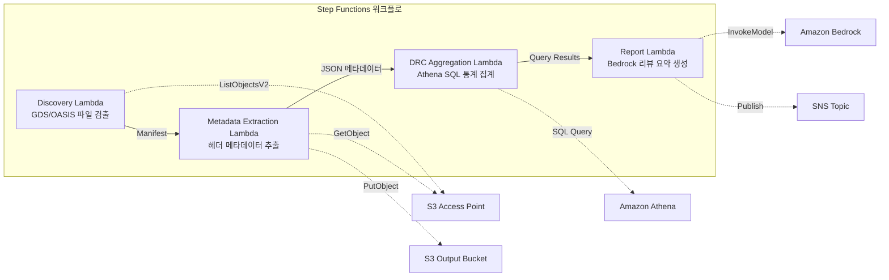
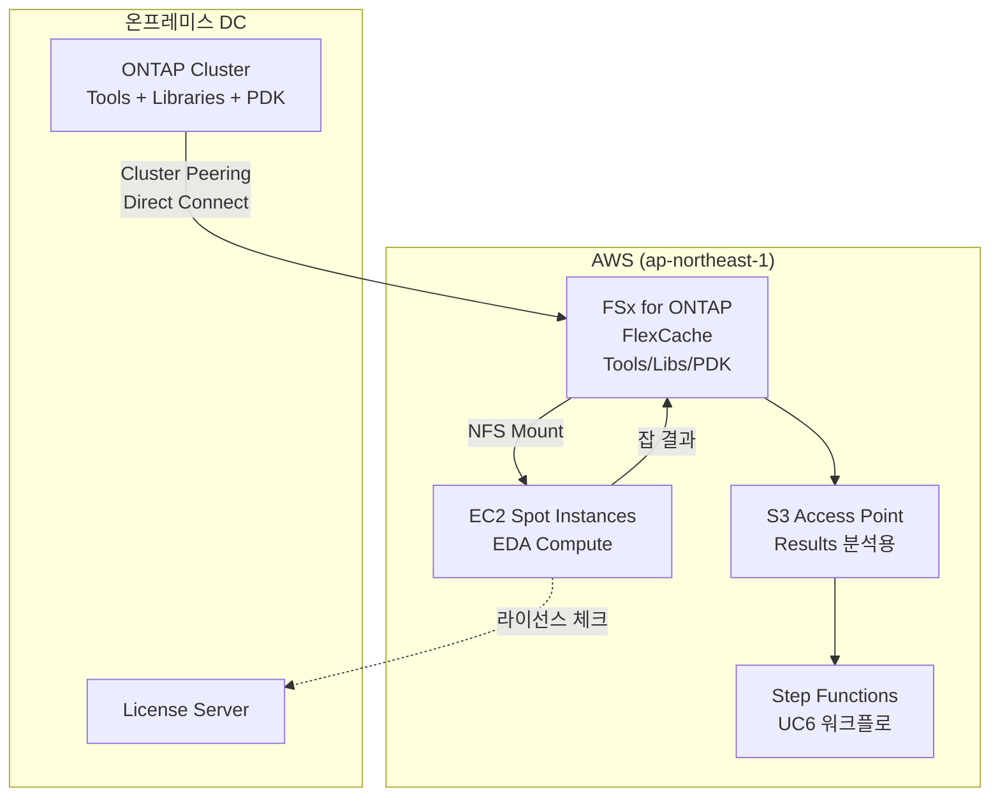

# UC6: 반도체 / EDA — 설계 파일 검증·메타데이터 추출

🌐 **Language / 言語**: [日本語](README.md) | [English](README.en.md) | 한국어 | [简体中文](README.zh-CN.md) | [繁體中文](README.zh-TW.md) | [Français](README.fr.md) | [Deutsch](README.de.md) | [Español](README.es.md)

📚 **문서**: [아키텍처 다이어그램](docs/architecture.ko.md) | [데모 가이드](docs/demo-guide.ko.md)

## 개요

FSx for ONTAP 의 S3 Access Points 를 활용하여 GDS/OASIS 반도체 설계 파일의 검증, 메타데이터 추출, DRC(Design Rule Check) 통계 집계를 자동화하는 서버리스 워크플로입니다.

### 이 패턴이 적합한 경우

- GDS/OASIS 설계 파일이 FSx for ONTAP 에 대량으로 축적되어 있다
- 설계 파일의 메타데이터(라이브러리명, 셀 수, 바운딩 박스 등)를 자동으로 카탈로그화하고 싶다
- DRC 통계를 정기적으로 집계하여 설계 품질 경향을 파악하고 싶다
- Athena SQL 을 이용한 횡단적 설계 메타데이터 분석이 필요하다
- 자연어 설계 리뷰 요약을 자동 생성하고 싶다

### 이 패턴이 적합하지 않은 경우

- 실시간 DRC 실행이 필요하다(EDA 도구 연동이 전제)
- 설계 파일의 물리적 검증(제조 규칙 적합성 완전 검증)이 필요하다
- EC2 기반 EDA 도구 체인이 이미 가동 중이며 마이그레이션 비용이 맞지 않는다
- ONTAP REST API 로의 네트워크 도달성을 확보할 수 없는 환경

### 주요 기능

- S3 AP 경유로 GDS/OASIS 파일을 자동 검출(.gds, .gds2, .oas, .oasis)
- 헤더 메타데이터 추출(library_name, units, cell_count, bounding_box, creation_date)
- Athena SQL 을 이용한 DRC 통계 집계(셀 수 분포, 바운딩 박스 이상치, 명명 규칙 위반)
- Amazon Bedrock 을 이용한 자연어 설계 리뷰 요약 생성
- SNS 알림을 통한 결과의 즉시 공유


## Success Metrics

### Outcome
GDS/OASIS 검증·메타데이터 추출의 자동화를 통해 설계 리뷰 준비 공수를 절감한다.

### Metrics
| 메트릭 | 목표값(예) |
|-----------|------------|
| 처리된 설계 파일 수 / 실행 | > 100 files |
| 검증 오류 검출률 | 100%(알려진 오류 패턴) |
| Bedrock 리포트 생성 시간 | < 3 분 |
| Athena 쿼리 응답 시간 | < 10 초 |
| 비용 / 실행 | < $5 |
| Human Review 대상률 | < 15%(설계 리뷰 지적) |

### Measurement Method
Step Functions 실행 이력, Athena 쿼리 결과, Bedrock 리포트 메타데이터, CloudWatch Metrics.

## 아키텍처



### 워크플로 단계

1. **Discovery**: S3 AP 에서 .gds, .gds2, .oas, .oasis 파일을 검출하고 Manifest 를 생성
2. **Metadata Extraction**: 각 설계 파일의 헤더에서 메타데이터를 추출하고 날짜 파티션이 포함된 JSON 으로 S3 에 출력
3. **DRC Aggregation**: Athena SQL 로 메타데이터 카탈로그를 횡단 분석하고 DRC 통계를 집계
4. **Report Generation**: Bedrock 으로 설계 리뷰 요약을 생성하고 S3 출력 + SNS 알림

## 전제 조건

- AWS 계정과 적절한 IAM 권한
- FSx for ONTAP 파일 시스템(ONTAP 9.17.1P4D3 이상)
- S3 Access Point 가 활성화된 볼륨(GDS/OASIS 파일 저장)
- VPC, 프라이빗 서브넷
- **NAT Gateway 또는 VPC Endpoints**(Discovery Lambda 가 VPC 내부에서 AWS 서비스에 액세스하기 위해 필요)
- Amazon Bedrock 모델 액세스가 활성화됨(Claude / Nova)
- ONTAP REST API 자격 증명이 Secrets Manager 에 저장됨

## 배포 절차

### 1. S3 Access Point 생성

GDS/OASIS 파일을 저장하는 볼륨에 S3 Access Point 를 생성합니다.

#### AWS CLI 로 생성

```bash
aws fsx create-and-attach-s3-access-point \
  --name <your-s3ap-name> \
  --type ONTAP \
  --ontap-configuration '{
    "VolumeId": "<your-volume-id>",
    "FileSystemIdentity": {
      "Type": "UNIX",
      "UnixUser": {
        "Name": "root"
      }
    }
  }' \
  --region <your-region>
```

생성 후 응답의 `S3AccessPoint.Alias` 를 메모해 두세요(`xxx-ext-s3alias` 형식).

#### AWS Management Console 로 생성

1. [Amazon FSx 콘솔](https://console.aws.amazon.com/fsx/) 을 엽니다
2. 대상 파일 시스템을 선택합니다
3. "볼륨" 탭에서 대상 볼륨을 선택합니다
4. "S3 액세스 포인트" 탭을 선택합니다
5. "S3 액세스 포인트 생성 및 연결" 을 클릭합니다
6. 액세스 포인트 이름을 입력하고 파일 시스템 ID 유형(UNIX/WINDOWS)과 사용자를 지정합니다
7. "생성" 을 클릭합니다

> 자세한 내용은 [S3 Access Points for FSx for ONTAP 생성](https://docs.aws.amazon.com/fsx/latest/ONTAPGuide/s3-access-points-create-fsxn.html) 을 참조하세요.

#### S3 AP 상태 확인

```bash
aws fsx describe-s3-access-point-attachments --region <your-region> \
  --query 'S3AccessPointAttachments[*].{Name:Name,Lifecycle:Lifecycle,Alias:S3AccessPoint.Alias}' \
  --output table
```

`Lifecycle` 이 `AVAILABLE` 이 될 때까지 대기하세요(일반적으로 1~2 분).

### 2. 샘플 파일 업로드(옵션)

테스트용 GDS 파일을 볼륨에 업로드합니다:

```bash
S3AP_ALIAS="<your-s3ap-alias>"

aws s3 cp test-data/semiconductor-eda/eda-designs/test_chip.gds \
  "s3://${S3AP_ALIAS}/eda-designs/test_chip.gds" --region <your-region>

aws s3 cp test-data/semiconductor-eda/eda-designs/test_chip_v2.gds2 \
  "s3://${S3AP_ALIAS}/eda-designs/test_chip_v2.gds2" --region <your-region>
```

### 3. SAM 배포

```bash
# 전제: AWS SAM CLI 가 필요합니다. sam build 가 코드와 공유 레이어를 자동으로 패키징합니다.
sam build

sam deploy \
  --stack-name fsxn-semiconductor-eda \
  --parameter-overrides \
    S3AccessPointAlias=<your-s3ap-alias> \
    S3AccessPointName=<your-s3ap-name> \
    OntapSecretName=<your-secret-name> \
    OntapManagementIp=<ontap-mgmt-ip> \
    SvmUuid=<your-svm-uuid> \
    VpcId=<your-vpc-id> \
    PrivateSubnetIds=<subnet-1>,<subnet-2> \
    PrivateRouteTableIds=<rtb-1>,<rtb-2> \
    NotificationEmail=<your-email@example.com> \
    BedrockModelId=amazon.nova-lite-v1:0 \
    EnableVpcEndpoints=true \
    MapConcurrency=10 \
    LambdaMemorySize=512 \
    LambdaTimeout=300 \
  --capabilities CAPABILITY_NAMED_IAM \
  --resolve-s3 \
  --region <your-region>
```

> **중요**: `S3AccessPointName` 은 S3 AP 의 이름(Alias 가 아니라 생성 시 지정한 이름)입니다. IAM 정책에서 ARN 기반 권한 부여에 사용됩니다. 생략하면 `AccessDenied` 오류가 발생할 수 있습니다.

### 4. SNS 구독 확인

배포 후 지정한 이메일 주소로 확인 메일이 도착합니다. 링크를 클릭하여 확인하세요.

### 5. 동작 확인

Step Functions 를 수동 실행하여 동작을 확인합니다:

```bash
aws stepfunctions start-execution \
  --state-machine-arn "arn:aws:states:<region>:<account-id>:stateMachine:fsxn-semiconductor-eda-workflow" \
  --input '{}' \
  --region <your-region>
```

> **주의**: 첫 실행에서는 Athena 의 DRC 집계 결과가 0 건이 되는 경우가 있습니다. 이는 Glue 테이블로의 메타데이터 반영에 시간 지연이 있기 때문입니다. 두 번째 이후 실행에서 올바른 통계를 얻을 수 있습니다.

> **주의**: `template.yaml` 은 SAM CLI(`sam build` + `sam deploy`)로 사용합니다.
> `aws cloudformation deploy` 명령으로 직접 배포하는 경우 `template-deploy.yaml` 을 사용하세요(Lambda zip 파일의 사전 패키징과 S3 업로드가 필요합니다).

## 설정 파라미터 목록

| 파라미터 | 설명 | 기본값 | 필수 |
|-----------|------|----------|------|
| `S3AccessPointAlias` | FSx for ONTAP S3 AP Alias(입력용) | — | ✅ |
| `S3AccessPointName` | S3 AP 이름(ARN 기반 IAM 권한 부여용) | `""` | ⚠️ 권장 |
| `OntapSecretName` | ONTAP REST API 자격 증명의 Secrets Manager 시크릿 이름 | — | ✅ |
| `OntapManagementIp` | ONTAP 클러스터 관리 IP 주소 | — | ✅ |
| `SvmUuid` | ONTAP SVM UUID | — | ✅ |
| `ScheduleExpression` | EventBridge Scheduler 스케줄 식 | `rate(1 hour)` | |
| `VpcId` | VPC ID | — | ✅ |
| `PrivateSubnetIds` | 프라이빗 서브넷 ID 목록 | — | ✅ |
| `PrivateRouteTableIds` | 프라이빗 서브넷의 라우팅 테이블 ID 목록(S3 Gateway Endpoint 용) | `""` | |
| `NotificationEmail` | SNS 알림 대상 이메일 주소 | — | ✅ |
| `BedrockModelId` | Bedrock 모델 ID | `amazon.nova-lite-v1:0` | |
| `MapConcurrency` | Map 상태의 병렬 실행 수 | `10` | |
| `LambdaMemorySize` | Lambda 메모리 크기 (MB) | `256` | |
| `LambdaTimeout` | Lambda 타임아웃 (초) | `300` | |
| `EnableVpcEndpoints` | Interface VPC Endpoints 활성화 | `false` | |
| `EnableCloudWatchAlarms` | CloudWatch Alarms 활성화 | `false` | |
| `EnableXRayTracing` | X-Ray 트레이싱 활성화 | `true` | |

> ⚠️ **`S3AccessPointName`**: 생략 가능하지만 지정하지 않으면 IAM 정책이 Alias 기반만 되어 일부 환경에서 `AccessDenied` 오류가 발생합니다. 프로덕션 환경에서는 지정을 권장합니다.

## 문제 해결

### Discovery Lambda 가 타임아웃된다

**원인**: VPC 내의 Lambda 가 AWS 서비스(Secrets Manager, S3, CloudWatch)에 도달할 수 없습니다.

**해결책**: 다음 중 하나를 확인하세요:
1. `EnableVpcEndpoints=true` 로 배포하고 `PrivateRouteTableIds` 를 지정합니다
2. VPC 에 NAT Gateway 가 존재하고 프라이빗 서브넷의 라우팅 테이블에 NAT Gateway 로의 경로가 있습니다

### AccessDenied 오류(ListObjectsV2)

**원인**: IAM 정책에 S3 Access Point 의 ARN 기반 권한이 부족합니다.

**해결책**: `S3AccessPointName` 파라미터에 S3 AP 의 이름(Alias 가 아니라 생성 시의 이름)을 지정하여 스택을 업데이트합니다.

### Athena DRC 집계 결과가 0 건

**원인**: DRC Aggregation Lambda 가 사용하는 `metadata_prefix` 필터와 실제 메타데이터 JSON 내의 `file_key` 값이 일치하지 않는 경우가 있습니다. 또한 첫 실행 시에는 Glue 테이블에 메타데이터가 존재하지 않기 때문에 0 건이 됩니다.

**해결책**:
1. Step Functions 를 2 회 실행합니다(1 회째에 메타데이터가 S3 에 기록되고, 2 회째에 Athena 가 집계 가능해집니다)
2. Athena 콘솔에서 직접 `SELECT * FROM "<db>"."<table>" LIMIT 10` 을 실행하여 데이터를 읽을 수 있는지 확인합니다
3. 데이터를 읽을 수 있는데 집계가 0 건인 경우 `file_key` 의 값과 `prefix` 필터의 정합성을 확인합니다

## 정리

```bash
# S3 버킷을 비웁니다
aws s3 rm s3://fsxn-semiconductor-eda-output-${AWS_ACCOUNT_ID} --recursive

# CloudFormation 스택 삭제
aws cloudformation delete-stack \
  --stack-name fsxn-semiconductor-eda \
  --region ap-northeast-1

# 삭제 완료 대기
aws cloudformation wait stack-delete-complete \
  --stack-name fsxn-semiconductor-eda \
  --region ap-northeast-1
```

## Supported Regions

UC6 은 다음 서비스를 사용합니다:

| 서비스 | 리전 제약 |
|---------|-------------|
| Amazon Athena | 거의 모든 리전에서 이용 가능 |
| Amazon Bedrock | 지원 리전을 확인([Bedrock 지원 리전](https://docs.aws.amazon.com/general/latest/gr/bedrock.html)) |
| AWS X-Ray | 거의 모든 리전에서 이용 가능 |
| CloudWatch EMF | 거의 모든 리전에서 이용 가능 |

> 자세한 내용은 [리전 호환성 매트릭스](../docs/region-compatibility.md) 를 참조하세요.

## 참고 링크

- [FSx for ONTAP S3 Access Points 개요](https://docs.aws.amazon.com/fsx/latest/ONTAPGuide/accessing-data-via-s3-access-points.html)
- [S3 Access Points 생성 및 연결](https://docs.aws.amazon.com/fsx/latest/ONTAPGuide/s3-access-points-create-fsxn.html)
- [S3 Access Points 의 액세스 관리](https://docs.aws.amazon.com/fsx/latest/ONTAPGuide/s3-ap-manage-access-fsxn.html)
- [Amazon Athena 사용자 가이드](https://docs.aws.amazon.com/athena/latest/ug/what-is.html)
- [Amazon Bedrock API 참조](https://docs.aws.amazon.com/bedrock/latest/APIReference/API_runtime_InvokeModel.html)
- [GDSII 포맷 사양](https://boolean.klaasholwerda.nl/interface/bnf/gdsformat.html)

## FlexCache 클라우드 버스트 확장

### 개요

EDA 워크로드에서는 Tools/Libraries/PDK 가 읽기 중심이며 FlexCache 의 최적 적용 대상입니다. 온프레미스의 ONTAP Origin 에 저장된 EDA 도구 체인을 AWS 상의 FSx for ONTAP FlexCache 에 캐시함으로써 클라우드 버스트 시 데이터 액세스 성능을 크게 개선할 수 있습니다.

### EDA 볼륨 분류와 FlexCache 적용

| 볼륨 종류 | 액세스 패턴 | FlexCache 적용 | S3 AP 이용 |
|--------------|---------------|:---:|:---:|
| Tools (Cadence/Synopsys/Siemens) | 읽기 전용 | ✅ 최적 | ⚠️ 바이너리 |
| Libraries | 읽기 전용 | ✅ 최적 | ⚠️ 바이너리 |
| PDK (Process Design Kit) | 읽기 전용 | ✅ 최적 | ⚠️ 바이너리 |
| RCS (Revision Control) | 읽기/쓰기 | ❌ | ❌ |
| Home | 읽기/쓰기 | ❌ | ❌ |
| Scratch | 쓰기 중심 | ❌ | ❌ |
| Results | 쓰기 → 읽기 | ❌ | ✅ 분석용 |

### 클라우드 버스트 구성



### KPI

| KPI | FlexCache 없음 | FlexCache 있음 | 개선율 |
|-----|--------------|---------------|--------|
| EDA 잡 시작 대기 시간 | 15-30분 (WAN) | 1-3분 (cache hit) | 80-90% |
| Regression 완료 시간 | 8시간 | 3시간 | 62% |
| WAN 전송량/일 | 500GB | 50GB | 90% |
| 라이선스 이용 효율 | 60% | 85% | +25pt |

### 관련 패턴

- [Dynamic FlexCache Render/EDA Workflow](../dynamic-flexcache-render-workflow/README.md) — 잡 단위의 FlexCache 동적 생성·삭제
- [FlexCache AnyCast / DR](../flexcache-anycast-dr/README.md) — 멀티 리전 클라우드 버스트
- [업계·워크로드 매핑](../docs/industry-workload-mapping.md) — Pattern D: EDA Cloud Burst


---

## AWS 문서 링크

| 서비스 | 문서 |
|---------|------------|
| FSx for ONTAP | [사용자 가이드](https://docs.aws.amazon.com/fsx/latest/ONTAPGuide/what-is-fsx-ontap.html) |
| S3 Access Points | [S3 AP for FSx for ONTAP](https://docs.aws.amazon.com/fsx/latest/ONTAPGuide/s3-access-points.html) |
| Step Functions | [개발자 가이드](https://docs.aws.amazon.com/step-functions/latest/dg/welcome.html) |
| Amazon Athena | [사용자 가이드](https://docs.aws.amazon.com/athena/latest/ug/what-is.html) |
| Amazon Bedrock | [사용자 가이드](https://docs.aws.amazon.com/bedrock/latest/userguide/what-is-bedrock.html) |

### Well-Architected Framework 대응

| 기둥 | 대응 |
|----|------|
| 운영 우수성 | X-Ray 트레이싱, EMF 메트릭, DRC 통계 대시보드 |
| 보안 | 최소 권한 IAM, KMS 암호화, 설계 데이터 액세스 제어 |
| 신뢰성 | Step Functions Retry/Catch, 메타데이터 추출 재시도 |
| 성능 효율 | GDS 헤더 부분 읽기, Athena 파티션 |
| 비용 최적화 | 서버리스(사용 시에만 과금), Athena 스캔 최적화 |
| 지속 가능성 | 온디맨드 실행, 차분 처리(변경 파일만) |


---

## 비용 견적(월액 개산)

> **비고**: 다음은 ap-northeast-1 리전의 개산이며 실제 비용은 사용량에 따라 다릅니다. 최신 요금은 [AWS Pricing Calculator](https://calculator.aws/) 에서 확인하세요.

### 서버리스 컴포넌트(종량 과금)

| 서비스 | 단가 | 예상 사용량 | 월액 개산 |
|---------|------|-----------|---------|
| Lambda | $0.0000166667/GB-sec | 5 함수 × 100 files/일 | ~$1-5 |
| S3 API (GetObject/ListObjects) | $0.0047/10K requests | ~10K requests/일 | ~$1.5 |
| Step Functions | $0.025/1K state transitions | ~1K transitions/일 | ~$0.75 |
| Bedrock (Nova Lite) | $0.00006/1K input tokens | ~50K tokens/실행 | ~$3-10 |
| Athena | $5/TB scanned | ~10 MB/쿼리 | ~$0.5-2 |
| SNS | $0.50/100K notifications | ~100 notifications/일 | ~$0.15 |
| CloudWatch Logs | $0.76/GB ingested | ~1 GB/월 | ~$0.76 |
| Glue ETL (옵션) | $0.44/DPU-hour |


### 고정 비용(FSx for ONTAP — 기존 환경 전제)

| 컴포넌트 | 월액 |
|--------------|------|
| FSx for ONTAP (128 MBps, 1 TB) | ~$230 (기존 환경을 공유) |
| S3 Access Point | 추가 요금 없음(S3 API 요금만) |

### 합계 개산

| 구성 | 월액 개산 |
|------|---------|
| 최소 구성(일 1 회 실행) | ~$5-15 |
| 표준 구성(시간별 실행) | ~$15-50 |
| 대규모 구성(고빈도 + 알람) | ~$50-150 |

> **Governance Caveat**: 비용 견적은 개산이며 보증값이 아닙니다. 실제 청구액은 사용 패턴, 데이터 양, 리전에 따라 다릅니다.

---

## 로컬 테스트

### Prerequisites 체크

```bash
# 전제 조건 확인
aws --version          # AWS CLI v2
sam --version          # SAM CLI
python3 --version      # Python 3.9+
docker --version       # Docker (sam local 용)
aws sts get-caller-identity  # AWS 자격 증명
```

### sam local invoke

```bash
# 빌드
# 전제: AWS SAM CLI 가 필요합니다. sam build 가 코드와 공유 레이어를 자동으로 패키징합니다.
sam build

# Discovery Lambda 의 로컬 실행
sam local invoke DiscoveryFunction --event events/discovery-event.json

# 환경 변수 오버라이드 포함
sam local invoke DiscoveryFunction \
  --event events/discovery-event.json \
  --env-vars env.json
```

### 유닛 테스트

```bash
python3 -m pytest tests/ -v
```

자세한 내용은 [로컬 테스트 퀵 스타트](../docs/local-testing-quick-start.md) 를 참조하세요.

---

## 출력 샘플 (Output Sample)

EDA 설계 파일 검증의 출력 예:

```json
{
  "discovery": {
    "status": "completed",
    "object_count": 5,
    "prefix": "eda-designs/"
  },
  "metadata_extraction": [
    {
      "key": "eda-designs/top_chip_v3.gds",
      "format": "GDSII",
      "cell_count": 1284,
      "bounding_box": {"max_x": 12000.5, "max_y": 9800.2}
    }
  ],
  "drc_aggregation": {
    "total_violations": 23,
    "critical": 2,
    "major": 8,
    "minor": 13,
    "categories": {"spacing": 10, "width": 8, "enclosure": 5}
  },
  "report": {
    "report_key": "reports/design-review-2026-05-23.md",
    "recommendation": "2 critical DRC violations require manual review before tapeout"
  }
}
```

> **비고**: 위는 샘플 출력이며 실제 값은 환경·입력 데이터에 따라 다릅니다. 벤치마크 수치는 sizing reference 이며 service limit 이 아닙니다.

---

## Governance Note

> 본 패턴은 기술 아키텍처 가이던스를 제공합니다. 법적·컴플라이언스·규제상의 조언이 아닙니다. 조직은 적격한 전문가에게 상담하세요.

---

## S3AP Compatibility

S3 Access Points for FSx for ONTAP 의 호환성 제약, 문제 해결, 트리거 패턴에 대해서는 [S3AP Compatibility Notes](../docs/s3ap-compatibility-notes.md) 를 참조하세요.
