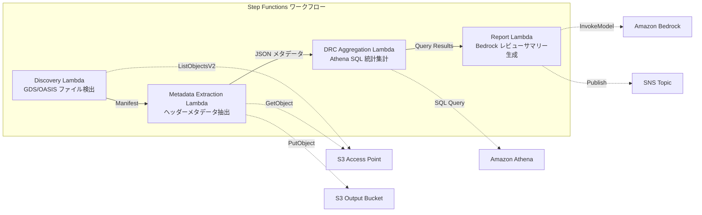
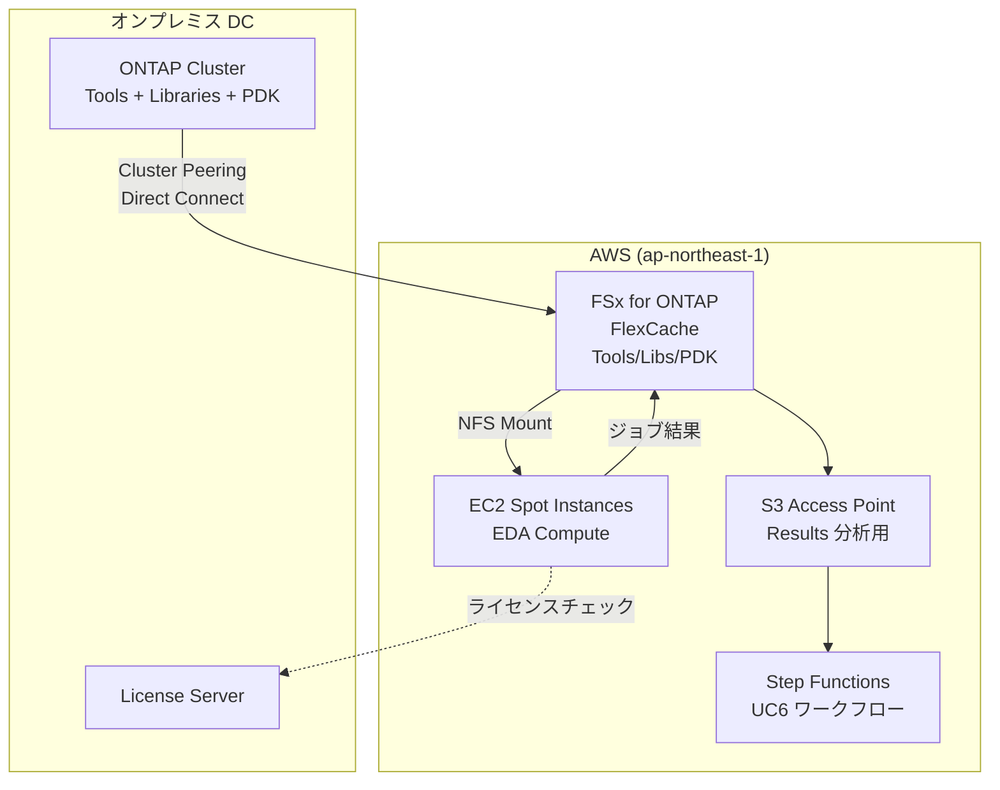

# UC6: 半導体 / EDA — 設計ファイルバリデーション・メタデータ抽出

🌐 **Language / 言語**: 日本語 | [English](README.en.md) | [한국어](README.ko.md) | [简体中文](README.zh-CN.md) | [繁體中文](README.zh-TW.md) | [Français](README.fr.md) | [Deutsch](README.de.md) | [Español](README.es.md)

📚 **ドキュメント**: [アーキテクチャ図](docs/architecture.md) | [デモガイド](docs/demo-guide.md)

## 概要

FSx for ONTAP の S3 Access Points を活用し、GDS/OASIS 半導体設計ファイルのバリデーション、メタデータ抽出、DRC（Design Rule Check）統計集計を自動化するサーバーレスワークフローです。

### このパターンが適しているケース

- GDS/OASIS 設計ファイルが FSx for ONTAP 上に大量に蓄積されている
- 設計ファイルのメタデータ（ライブラリ名、セル数、バウンディングボックス等）を自動カタログ化したい
- DRC 統計を定期的に集計し、設計品質の傾向を把握したい
- Athena SQL による横断的な設計メタデータ分析が必要
- 自然言語の設計レビューサマリーを自動生成したい

### このパターンが適さないケース

- リアルタイムの DRC 実行が必要（EDA ツール連携が前提）
- 設計ファイルの物理的なバリデーション（製造ルール適合性の完全検証）が必要
- EC2 ベースの EDA ツールチェーンが既に稼働しており、移行コストが見合わない
- ONTAP REST API へのネットワーク到達性が確保できない環境

### 主な機能

- S3 AP 経由で GDS/OASIS ファイルを自動検出（.gds, .gds2, .oas, .oasis）
- ヘッダーメタデータ抽出（library_name, units, cell_count, bounding_box, creation_date）
- Athena SQL による DRC 統計集計（セル数分布、バウンディングボックス外れ値、命名規則違反）
- Amazon Bedrock による自然言語設計レビューサマリー生成
- SNS 通知による結果の即時共有


## Success Metrics

### Outcome
GDS/OASIS バリデーション・メタデータ抽出の自動化により、設計レビュー準備工数を削減する。

### Metrics
| メトリクス | 目標値（例） |
|-----------|------------|
| 処理済み設計ファイル数 / 実行 | > 100 files |
| バリデーションエラー検出率 | 100%（既知エラーパターン） |
| Bedrock レポート生成時間 | < 3 分 |
| Athena クエリ応答時間 | < 10 秒 |
| コスト / 実行 | < $5 |
| Human Review 対象率 | < 15%（設計レビュー指摘） |

### Measurement Method
Step Functions 実行履歴、Athena クエリ結果、Bedrock レポートメタデータ、CloudWatch Metrics。

## アーキテクチャ



### ワークフローステップ

1. **Discovery**: S3 AP から .gds, .gds2, .oas, .oasis ファイルを検出し、Manifest を生成
2. **Metadata Extraction**: 各設計ファイルのヘッダーからメタデータを抽出し、日付パーティション付き JSON で S3 出力
3. **DRC Aggregation**: Athena SQL でメタデータカタログを横断分析し、DRC 統計を集計
4. **Report Generation**: Bedrock で設計レビューサマリーを生成し、S3 出力 + SNS 通知

## 前提条件

- AWS アカウントと適切な IAM 権限
- FSx for ONTAP ファイルシステム（ONTAP 9.17.1P4D3 以上）
- S3 Access Point が有効化されたボリューム（GDS/OASIS ファイルを格納）
- VPC、プライベートサブネット
- **NAT Gateway または VPC Endpoints**（Discovery Lambda が VPC 内から AWS サービスにアクセスするために必要）
- Amazon Bedrock モデルアクセスが有効（Claude / Nova）
- ONTAP REST API 認証情報が Secrets Manager に格納済み

## デプロイ手順

### 1. S3 Access Point の作成

GDS/OASIS ファイルを格納するボリュームに S3 Access Point を作成します。

#### AWS CLI での作成

```bash
aws fsx create-and-attach-s3-access-point \
  --name <your-s3ap-name> \
  --type ONTAP \
  --ontap-configuration '{
    "VolumeId": "<your-volume-id>",
    "FileSystemIdentity": {
      "Type": "UNIX",
      "UnixUser": {
        "Name": "root"
      }
    }
  }' \
  --region <your-region>
```

作成後、レスポンスの `S3AccessPoint.Alias` を控えてください（`xxx-ext-s3alias` 形式）。

#### AWS マネジメントコンソールでの作成

1. [Amazon FSx コンソール](https://console.aws.amazon.com/fsx/) を開く
2. 対象のファイルシステムを選択
3. 「ボリューム」タブで対象ボリュームを選択
4. 「S3 アクセスポイント」タブを選択
5. 「S3 アクセスポイントの作成とアタッチ」をクリック
6. アクセスポイント名を入力し、ファイルシステム ID タイプ（UNIX/WINDOWS）とユーザーを指定
7. 「作成」をクリック

> 詳細は [S3 Access Points for FSx for ONTAP の作成](https://docs.aws.amazon.com/fsx/latest/ONTAPGuide/s3-access-points-create-fsxn.html) を参照してください。

#### S3 AP の状態確認

```bash
aws fsx describe-s3-access-point-attachments --region <your-region> \
  --query 'S3AccessPointAttachments[*].{Name:Name,Lifecycle:Lifecycle,Alias:S3AccessPoint.Alias}' \
  --output table
```

`Lifecycle` が `AVAILABLE` になるまで待機してください（通常 1〜2 分）。

### 2. サンプルファイルのアップロード（オプション）

テスト用の GDS ファイルをボリュームにアップロードします:

```bash
S3AP_ALIAS="<your-s3ap-alias>"

aws s3 cp test-data/semiconductor-eda/eda-designs/test_chip.gds \
  "s3://${S3AP_ALIAS}/eda-designs/test_chip.gds" --region <your-region>

aws s3 cp test-data/semiconductor-eda/eda-designs/test_chip_v2.gds2 \
  "s3://${S3AP_ALIAS}/eda-designs/test_chip_v2.gds2" --region <your-region>
```

### 3. Lambda デプロイパッケージの作成

`template-deploy.yaml` を使用する場合、Lambda 関数のコードを zip パッケージとして S3 にアップロードする必要があります。

```bash
# デプロイ用 S3 バケットの作成
DEPLOY_BUCKET="<your-deploy-bucket-name>"
aws s3 mb "s3://${DEPLOY_BUCKET}" --region <your-region>

# 各 Lambda 関数をパッケージング
for func in discovery metadata_extraction drc_aggregation report_generation; do
  TMPDIR=$(mktemp -d)
  cp semiconductor-eda/functions/${func}/handler.py "${TMPDIR}/"
  cp -r shared "${TMPDIR}/shared"
  (cd "${TMPDIR}" && zip -r "/tmp/semiconductor-eda-${func}.zip" . \
    -x "*.pyc" "__pycache__/*" "shared/tests/*" "shared/cfn/*")
  aws s3 cp "/tmp/semiconductor-eda-${func}.zip" \
    "s3://${DEPLOY_BUCKET}/lambda/semiconductor-eda-${func}.zip" --region <your-region>
  rm -rf "${TMPDIR}"
done
```

### 4. SAM デプロイ

```bash
# 前提: AWS SAM CLI が必要です。sam build がコードと共有レイヤーを自動でパッケージングします。
sam build

sam deploy \
  --stack-name fsxn-semiconductor-eda \
  --parameter-overrides \
    S3AccessPointAlias=<your-s3ap-alias> \
    S3AccessPointName=<your-s3ap-name> \
    OntapSecretName=<your-secret-name> \
    OntapManagementIp=<ontap-mgmt-ip> \
    SvmUuid=<your-svm-uuid> \
    VpcId=<your-vpc-id> \
    PrivateSubnetIds=<subnet-1>,<subnet-2> \
    PrivateRouteTableIds=<rtb-1>,<rtb-2> \
    NotificationEmail=<your-email@example.com> \
    BedrockModelId=amazon.nova-lite-v1:0 \
    EnableVpcEndpoints=true \
    MapConcurrency=10 \
    LambdaMemorySize=512 \
    LambdaTimeout=300 \
  --capabilities CAPABILITY_NAMED_IAM \
  --resolve-s3 \
  --region <your-region>
```

> **重要**: `S3AccessPointName` は S3 AP の名前（Alias ではなく作成時に指定した名前）です。IAM ポリシーで ARN ベースの権限付与に使用されます。省略すると `AccessDenied` エラーが発生する場合があります。

### 5. SNS サブスクリプションの確認

デプロイ後、指定したメールアドレスに確認メールが届きます。リンクをクリックして確認してください。

### 6. 動作確認

Step Functions を手動実行して動作を確認します:

```bash
aws stepfunctions start-execution \
  --state-machine-arn "arn:aws:states:<region>:<account-id>:stateMachine:fsxn-semiconductor-eda-workflow" \
  --input '{}' \
  --region <your-region>
```

> **注意**: 初回実行では Athena の DRC 集計結果が 0 件になる場合があります。これは Glue テーブルへのメタデータ反映にタイムラグがあるためです。2 回目以降の実行で正しい統計が得られます。

### テンプレートの使い分け

| テンプレート | 用途 | Lambda コード |
|-------------|------|--------------|
| `template.yaml` | SAM CLI でのローカル開発・テスト | インラインパス参照（`sam build` が必要） |
| `template-deploy.yaml` | 本番デプロイ | S3 バケットから zip 取得 |

`template.yaml` を直接 `aws cloudformation deploy` で使用する場合は、SAM Transform の処理が必要です。本番デプロイには `template-deploy.yaml` を使用してください。

## 設定パラメータ一覧

| パラメータ | 説明 | デフォルト | 必須 |
|-----------|------|----------|------|
| `DeployBucket` | Lambda zip を格納する S3 バケット名 | — | ✅ |
| `S3AccessPointAlias` | FSx for ONTAP S3 AP Alias（入力用） | — | ✅ |
| `S3AccessPointName` | S3 AP 名（ARN ベースの IAM 権限付与用） | `""` | ⚠️ 推奨 |
| `OntapSecretName` | ONTAP REST API 認証情報の Secrets Manager シークレット名 | — | ✅ |
| `OntapManagementIp` | ONTAP クラスタ管理 IP アドレス | — | ✅ |
| `SvmUuid` | ONTAP SVM UUID | — | ✅ |
| `ScheduleExpression` | EventBridge Scheduler のスケジュール式 | `rate(1 hour)` | |
| `VpcId` | VPC ID | — | ✅ |
| `PrivateSubnetIds` | プライベートサブネット ID リスト | — | ✅ |
| `PrivateRouteTableIds` | プライベートサブネットのルートテーブル ID リスト（S3 Gateway Endpoint 用） | `""` | |
| `NotificationEmail` | SNS 通知先メールアドレス | — | ✅ |
| `BedrockModelId` | Bedrock モデル ID | `amazon.nova-lite-v1:0` | |
| `MapConcurrency` | Map ステートの並列実行数 | `10` | |
| `LambdaMemorySize` | Lambda メモリサイズ (MB) | `256` | |
| `LambdaTimeout` | Lambda タイムアウト (秒) | `300` | |
| `EnableVpcEndpoints` | Interface VPC Endpoints の有効化 | `false` | |
| `EnableCloudWatchAlarms` | CloudWatch Alarms の有効化 | `false` | |
| `EnableXRayTracing` | X-Ray トレーシングの有効化 | `true` | |

> ⚠️ **`S3AccessPointName`**: 省略可能ですが、指定しないと IAM ポリシーが Alias ベースのみとなり、一部の環境で `AccessDenied` エラーが発生します。本番環境では指定を推奨します。

## トラブルシューティング

### Discovery Lambda がタイムアウトする

**原因**: VPC 内の Lambda が AWS サービス（Secrets Manager, S3, CloudWatch）に到達できない。

**解決策**: 以下のいずれかを確認してください:
1. `EnableVpcEndpoints=true` でデプロイし、`PrivateRouteTableIds` を指定する
2. VPC に NAT Gateway が存在し、プライベートサブネットのルートテーブルに NAT Gateway へのルートがある

### AccessDenied エラー（ListObjectsV2）

**原因**: IAM ポリシーに S3 Access Point の ARN ベース権限が不足。

**解決策**: `S3AccessPointName` パラメータに S3 AP の名前（Alias ではなく作成時の名前）を指定してスタックを更新する。

### Athena DRC 集計結果が 0 件

**原因**: DRC Aggregation Lambda が使用する `metadata_prefix` フィルタと、実際のメタデータ JSON 内の `file_key` 値が一致しない場合があります。また、初回実行時は Glue テーブルにメタデータが存在しないため 0 件になります。

**解決策**:
1. Step Functions を 2 回実行する（1 回目でメタデータが S3 に書き込まれ、2 回目で Athena が集計可能になる）
2. Athena コンソールで直接 `SELECT * FROM "<db>"."<table>" LIMIT 10` を実行し、データが読めることを確認する
3. データが読めるのに集計が 0 件の場合、`file_key` の値と `prefix` フィルタの整合性を確認する

## クリーンアップ

```bash
# S3 バケットを空にする
aws s3 rm s3://fsxn-semiconductor-eda-output-${AWS_ACCOUNT_ID} --recursive

# CloudFormation スタックの削除
aws cloudformation delete-stack \
  --stack-name fsxn-semiconductor-eda \
  --region ap-northeast-1

# 削除完了を待機
aws cloudformation wait stack-delete-complete \
  --stack-name fsxn-semiconductor-eda \
  --region ap-northeast-1
```

## Supported Regions

UC6 は以下のサービスを使用します:

| サービス | リージョン制約 |
|---------|-------------|
| Amazon Athena | ほぼ全リージョンで利用可能 |
| Amazon Bedrock | 対応リージョンを確認（[Bedrock 対応リージョン](https://docs.aws.amazon.com/general/latest/gr/bedrock.html)） |
| AWS X-Ray | ほぼ全リージョンで利用可能 |
| CloudWatch EMF | ほぼ全リージョンで利用可能 |

> 詳細は [リージョン互換性マトリックス](../docs/region-compatibility.md) を参照。

## 参考リンク

- [FSx for ONTAP S3 Access Points 概要](https://docs.aws.amazon.com/fsx/latest/ONTAPGuide/accessing-data-via-s3-access-points.html)
- [S3 Access Points の作成とアタッチ](https://docs.aws.amazon.com/fsx/latest/ONTAPGuide/s3-access-points-create-fsxn.html)
- [S3 Access Points のアクセス管理](https://docs.aws.amazon.com/fsx/latest/ONTAPGuide/s3-ap-manage-access-fsxn.html)
- [Amazon Athena ユーザーガイド](https://docs.aws.amazon.com/athena/latest/ug/what-is.html)
- [Amazon Bedrock API リファレンス](https://docs.aws.amazon.com/bedrock/latest/APIReference/API_runtime_InvokeModel.html)
- [GDSII フォーマット仕様](https://boolean.klaasholwerda.nl/interface/bnf/gdsformat.html)

## FlexCache クラウドバースト拡張

### 概要

EDA ワークロードでは、Tools/Libraries/PDK は読み取り中心であり、FlexCache の最適な適用対象です。オンプレミスの ONTAP Origin に格納された EDA ツールチェーンを、AWS 上の FSx for ONTAP FlexCache にキャッシュすることで、クラウドバースト時のデータアクセス性能を大幅に改善できます。

### EDA ボリューム分類と FlexCache 適用

| ボリューム種別 | アクセスパターン | FlexCache 適用 | S3 AP 利用 |
|--------------|---------------|:---:|:---:|
| Tools (Cadence/Synopsys/Siemens) | 読み取り専用 | ✅ 最適 | ⚠️ バイナリ |
| Libraries | 読み取り専用 | ✅ 最適 | ⚠️ バイナリ |
| PDK (Process Design Kit) | 読み取り専用 | ✅ 最適 | ⚠️ バイナリ |
| RCS (Revision Control) | 読み書き | ❌ | ❌ |
| Home | 読み書き | ❌ | ❌ |
| Scratch | 書き込み中心 | ❌ | ❌ |
| Results | 書き込み → 読み取り | ❌ | ✅ 分析用 |

### クラウドバースト構成



### KPI

| KPI | FlexCache なし | FlexCache あり | 改善率 |
|-----|--------------|---------------|--------|
| EDA ジョブ開始待ち時間 | 15-30分 (WAN) | 1-3分 (cache hit) | 80-90% |
| Regression 完了時間 | 8時間 | 3時間 | 62% |
| WAN 転送量/日 | 500GB | 50GB | 90% |
| ライセンス利用効率 | 60% | 85% | +25pt |

### 関連パターン

- [Dynamic FlexCache Render/EDA Workflow](../dynamic-flexcache-render-workflow/README.md) — ジョブ単位の FlexCache 動的作成・削除
- [FlexCache AnyCast / DR](../flexcache-anycast-dr/README.md) — マルチリージョンクラウドバースト
- [業界・ワークロード マッピング](../docs/industry-workload-mapping.md) — Pattern D: EDA Cloud Burst


---

## AWS ドキュメントリンク

| サービス | ドキュメント |
|---------|------------|
| FSx for ONTAP | [ユーザーガイド](https://docs.aws.amazon.com/fsx/latest/ONTAPGuide/what-is-fsx-ontap.html) |
| S3 Access Points | [S3 AP for FSx for ONTAP](https://docs.aws.amazon.com/fsx/latest/ONTAPGuide/s3-access-points.html) |
| Step Functions | [開発者ガイド](https://docs.aws.amazon.com/step-functions/latest/dg/welcome.html) |
| Amazon Athena | [ユーザーガイド](https://docs.aws.amazon.com/athena/latest/ug/what-is.html) |
| Amazon Bedrock | [ユーザーガイド](https://docs.aws.amazon.com/bedrock/latest/userguide/what-is-bedrock.html) |

### Well-Architected Framework 対応

| 柱 | 対応 |
|----|------|
| 運用上の優秀性 | X-Ray トレーシング、EMF メトリクス、DRC 統計ダッシュボード |
| セキュリティ | 最小権限 IAM、KMS 暗号化、設計データアクセス制御 |
| 信頼性 | Step Functions Retry/Catch、メタデータ抽出リトライ |
| パフォーマンス効率 | GDS ヘッダー部分読み取り、Athena パーティション |
| コスト最適化 | サーバーレス（使用時のみ課金）、Athena スキャン最適化 |
| 持続可能性 | オンデマンド実行、差分処理（変更ファイルのみ） |


---

## コスト見積もり（月額概算）

> **注記**: 以下は ap-northeast-1 リージョンの概算であり、実際のコストは使用量により異なります。最新の料金は [AWS Pricing Calculator](https://calculator.aws/) で確認してください。

### サーバーレスコンポーネント（従量課金）

| サービス | 単価 | 想定使用量 | 月額概算 |
|---------|------|-----------|---------|
| Lambda | $0.0000166667/GB-sec | 5 関数 × 100 files/日 | ~$1-5 |
| S3 API (GetObject/ListObjects) | $0.0047/10K requests | ~10K requests/日 | ~$1.5 |
| Step Functions | $0.025/1K state transitions | ~1K transitions/日 | ~$0.75 |
| Bedrock (Nova Lite) | $0.00006/1K input tokens | ~50K tokens/実行 | ~$3-10 |
| Athena | $5/TB scanned | ~10 MB/クエリ | ~$0.5-2 |
| SNS | $0.50/100K notifications | ~100 notifications/日 | ~$0.15 |
| CloudWatch Logs | $0.76/GB ingested | ~1 GB/月 | ~$0.76 |
| Glue ETL (オプション) | $0.44/DPU-hour |


### 固定コスト（FSx for ONTAP — 既存環境前提）

| コンポーネント | 月額 |
|--------------|------|
| FSx for ONTAP (128 MBps, 1 TB) | ~$230 (既存環境を共有) |
| S3 Access Point | 追加料金なし（S3 API 料金のみ） |

### 合計概算

| 構成 | 月額概算 |
|------|---------|
| 最小構成（日次 1 回実行） | ~$5-15 |
| 標準構成（時次実行） | ~$15-50 |
| 大規模構成（高頻度 + アラーム） | ~$50-150 |

> **Governance Caveat**: コスト見積もりは概算であり、保証値ではありません。実際の請求額は使用パターン、データ量、リージョンにより異なります。

---

## ローカルテスト

### Prerequisites チェック

```bash
# 前提条件の確認
aws --version          # AWS CLI v2
sam --version          # SAM CLI
python3 --version      # Python 3.9+
docker --version       # Docker (sam local 用)
aws sts get-caller-identity  # AWS 認証情報
```

### sam local invoke

```bash
# ビルド
# 前提: AWS SAM CLI が必要です。sam build がコードと共有レイヤーを自動でパッケージングします。
sam build

# Discovery Lambda のローカル実行
sam local invoke DiscoveryFunction --event events/discovery-event.json

# 環境変数オーバーライド付き
sam local invoke DiscoveryFunction \
  --event events/discovery-event.json \
  --env-vars env.json
```

### ユニットテスト

```bash
python3 -m pytest tests/ -v
```

詳細は [ローカルテスト クイックスタート](../docs/local-testing-quick-start.md) を参照してください。

---

## 出力サンプル (Output Sample)

EDA 設計ファイルバリデーションの出力例:

```json
{
  "discovery": {
    "status": "completed",
    "object_count": 5,
    "prefix": "eda-designs/"
  },
  "metadata_extraction": [
    {
      "key": "eda-designs/top_chip_v3.gds",
      "format": "GDSII",
      "cell_count": 1284,
      "bounding_box": {"max_x": 12000.5, "max_y": 9800.2}
    }
  ],
  "drc_aggregation": {
    "total_violations": 23,
    "critical": 2,
    "major": 8,
    "minor": 13,
    "categories": {"spacing": 10, "width": 8, "enclosure": 5}
  },
  "report": {
    "report_key": "reports/design-review-2026-05-23.md",
    "recommendation": "2 critical DRC violations require manual review before tapeout"
  }
}
```

> **注記**: 上記はサンプル出力であり、実際の値は環境・入力データにより異なります。ベンチマーク数値は sizing reference であり、service limit ではありません。

---

## Governance Note

> 本パターンは技術アーキテクチャガイダンスを提供します。法的・コンプライアンス・規制上の助言ではありません。組織は適格な専門家に相談してください。

---

## S3AP Compatibility

S3 Access Points for FSx for ONTAP の互換性制約、トラブルシューティング、トリガーパターンについては [S3AP Compatibility Notes](../docs/s3ap-compatibility-notes.md) を参照してください。