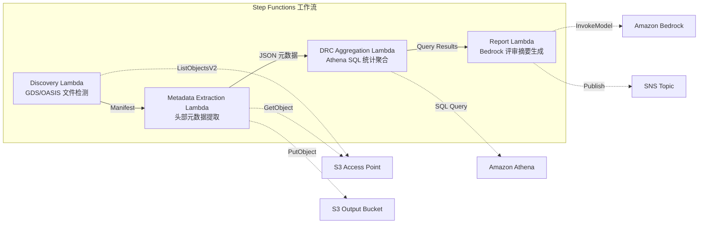
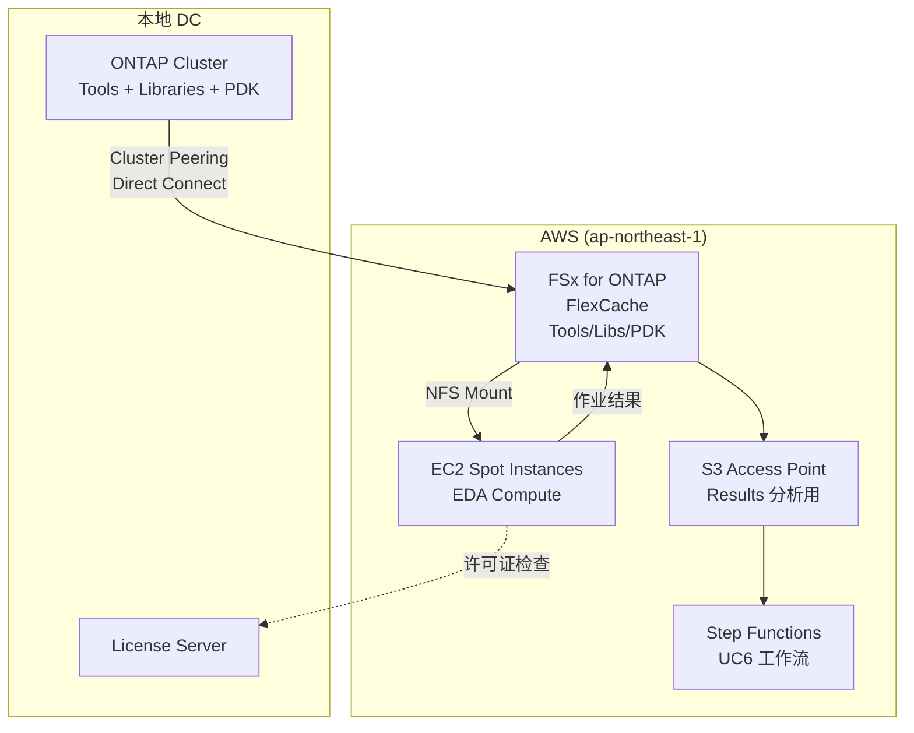

# UC6：半导体 / EDA — 设计文件校验·元数据提取

🌐 **Language / 言語**: [日本語](README.md) | [English](README.en.md) | [한국어](README.ko.md) | 简体中文 | [繁體中文](README.zh-TW.md) | [Français](README.fr.md) | [Deutsch](README.de.md) | [Español](README.es.md)

📚 **文档**: [架构图](docs/architecture.zh-CN.md) | [演示指南](docs/demo-guide.zh-CN.md)

## 概述

一个利用 FSx for ONTAP 的 S3 Access Points，自动化 GDS/OASIS 半导体设计文件的校验、元数据提取以及 DRC（Design Rule Check）统计聚合的无服务器工作流。

### 适合此模式的场景

- 大量 GDS/OASIS 设计文件已积累在 FSx for ONTAP 上
- 希望自动为设计文件的元数据（库名、单元数、边界框等）编制目录
- 希望定期聚合 DRC 统计以掌握设计质量趋势
- 需要通过 Athena SQL 进行横向的设计元数据分析
- 希望自动生成自然语言的设计评审摘要

### 不适合此模式的场景

- 需要实时执行 DRC（以 EDA 工具集成为前提）
- 需要对设计文件进行物理校验（制造规则符合性的完整验证）
- 已经运行基于 EC2 的 EDA 工具链，迁移成本不划算
- 无法确保到 ONTAP REST API 的网络可达性的环境

### 主要功能

- 通过 S3 AP 自动检测 GDS/OASIS 文件（.gds, .gds2, .oas, .oasis）
- 头部元数据提取（library_name, units, cell_count, bounding_box, creation_date）
- 通过 Athena SQL 进行 DRC 统计聚合（单元数分布、边界框离群值、命名规则违规）
- 通过 Amazon Bedrock 生成自然语言设计评审摘要
- 通过 SNS 通知即时共享结果


## Success Metrics

### Outcome
通过自动化 GDS/OASIS 校验·元数据提取，削减设计评审准备工时。

### Metrics
| 指标 | 目标值（示例） |
|-----------|------------|
| 已处理设计文件数 / 执行 | > 100 files |
| 校验错误检出率 | 100%（已知错误模式） |
| Bedrock 报告生成时间 | < 3 分钟 |
| Athena 查询响应时间 | < 10 秒 |
| 成本 / 执行 | < $5 |
| Human Review 对象率 | < 15%（设计评审指摘） |

### Measurement Method
Step Functions 执行历史、Athena 查询结果、Bedrock 报告元数据、CloudWatch Metrics。

## 架构



### 工作流步骤

1. **Discovery**：从 S3 AP 检测 .gds, .gds2, .oas, .oasis 文件并生成 Manifest
2. **Metadata Extraction**：从各设计文件的头部提取元数据，并以带日期分区的 JSON 输出到 S3
3. **DRC Aggregation**：通过 Athena SQL 横向分析元数据目录并聚合 DRC 统计
4. **Report Generation**：通过 Bedrock 生成设计评审摘要，输出到 S3 + SNS 通知

## 前提条件

- AWS 账户和适当的 IAM 权限
- FSx for ONTAP 文件系统（ONTAP 9.17.1P4D3 或更高版本）
- 已启用 S3 Access Point 的卷（存储 GDS/OASIS 文件）
- VPC、私有子网
- **NAT Gateway 或 VPC Endpoints**（Discovery Lambda 从 VPC 内访问 AWS 服务所必需）
- 已启用 Amazon Bedrock 模型访问（Claude / Nova）
- ONTAP REST API 凭证已存储在 Secrets Manager 中

## 部署步骤

### 1. 创建 S3 Access Point

在存储 GDS/OASIS 文件的卷上创建 S3 Access Point。

#### 通过 AWS CLI 创建

```bash
aws fsx create-and-attach-s3-access-point \
  --name <your-s3ap-name> \
  --type ONTAP \
  --ontap-configuration '{
    "VolumeId": "<your-volume-id>",
    "FileSystemIdentity": {
      "Type": "UNIX",
      "UnixUser": {
        "Name": "root"
      }
    }
  }' \
  --region <your-region>
```

创建后，请记下响应中的 `S3AccessPoint.Alias`（`xxx-ext-s3alias` 格式）。

#### 通过 AWS 管理控制台创建

1. 打开 [Amazon FSx 控制台](https://console.aws.amazon.com/fsx/)
2. 选择目标文件系统
3. 在"卷"选项卡中选择目标卷
4. 选择"S3 访问点"选项卡
5. 点击"创建并连接 S3 访问点"
6. 输入访问点名称，并指定文件系统 ID 类型（UNIX/WINDOWS）和用户
7. 点击"创建"

> 详情请参阅 [创建 S3 Access Points for FSx for ONTAP](https://docs.aws.amazon.com/fsx/latest/ONTAPGuide/s3-access-points-create-fsxn.html)。

#### 确认 S3 AP 状态

```bash
aws fsx describe-s3-access-point-attachments --region <your-region> \
  --query 'S3AccessPointAttachments[*].{Name:Name,Lifecycle:Lifecycle,Alias:S3AccessPoint.Alias}' \
  --output table
```

请等待 `Lifecycle` 变为 `AVAILABLE`（通常 1~2 分钟）。

### 2. 上传示例文件（可选）

将测试用的 GDS 文件上传到卷：

```bash
S3AP_ALIAS="<your-s3ap-alias>"

aws s3 cp test-data/semiconductor-eda/eda-designs/test_chip.gds \
  "s3://${S3AP_ALIAS}/eda-designs/test_chip.gds" --region <your-region>

aws s3 cp test-data/semiconductor-eda/eda-designs/test_chip_v2.gds2 \
  "s3://${S3AP_ALIAS}/eda-designs/test_chip_v2.gds2" --region <your-region>
```

### 3. SAM 部署

```bash
# 前提：需要 AWS SAM CLI。sam build 会自动打包代码和共享层。
sam build

sam deploy \
  --stack-name fsxn-semiconductor-eda \
  --parameter-overrides \
    S3AccessPointAlias=<your-s3ap-alias> \
    S3AccessPointName=<your-s3ap-name> \
    OntapSecretName=<your-secret-name> \
    OntapManagementIp=<ontap-mgmt-ip> \
    SvmUuid=<your-svm-uuid> \
    VpcId=<your-vpc-id> \
    PrivateSubnetIds=<subnet-1>,<subnet-2> \
    PrivateRouteTableIds=<rtb-1>,<rtb-2> \
    NotificationEmail=<your-email@example.com> \
    BedrockModelId=amazon.nova-lite-v1:0 \
    EnableVpcEndpoints=true \
    MapConcurrency=10 \
    LambdaMemorySize=512 \
    LambdaTimeout=300 \
  --capabilities CAPABILITY_NAMED_IAM \
  --resolve-s3 \
  --region <your-region>
```

> **重要**：`S3AccessPointName` 是 S3 AP 的名称（不是 Alias，而是创建时指定的名称）。用于 IAM 策略中基于 ARN 的权限授予。省略时可能会发生 `AccessDenied` 错误。

### 4. 确认 SNS 订阅

部署后，指定的电子邮件地址会收到确认邮件。请点击链接进行确认。

### 5. 验证运行

手动执行 Step Functions 以验证运行：

```bash
aws stepfunctions start-execution \
  --state-machine-arn "arn:aws:states:<region>:<account-id>:stateMachine:fsxn-semiconductor-eda-workflow" \
  --input '{}' \
  --region <your-region>
```

> **注意**：首次执行时，Athena 的 DRC 聚合结果可能为 0 条。这是因为元数据反映到 Glue 表存在时间延迟。从第二次执行起可获得正确的统计。

> **注意**：`template.yaml` 用于 SAM CLI（`sam build` + `sam deploy`）。
> 若使用 `aws cloudformation deploy` 命令直接部署，请使用 `template-deploy.yaml`（需要预先打包 Lambda zip 文件并上传到 S3）。

## 配置参数一览

| 参数 | 说明 | 默认值 | 必需 |
|-----------|------|----------|------|
| `S3AccessPointAlias` | FSx for ONTAP S3 AP Alias（用于输入） | — | ✅ |
| `S3AccessPointName` | S3 AP 名称（用于基于 ARN 的 IAM 权限授予） | `""` | ⚠️ 推荐 |
| `OntapSecretName` | ONTAP REST API 凭证的 Secrets Manager 密钥名称 | — | ✅ |
| `OntapManagementIp` | ONTAP 集群管理 IP 地址 | — | ✅ |
| `SvmUuid` | ONTAP SVM UUID | — | ✅ |
| `ScheduleExpression` | EventBridge Scheduler 的调度表达式 | `rate(1 hour)` | |
| `VpcId` | VPC ID | — | ✅ |
| `PrivateSubnetIds` | 私有子网 ID 列表 | — | ✅ |
| `PrivateRouteTableIds` | 私有子网的路由表 ID 列表（用于 S3 Gateway Endpoint） | `""` | |
| `NotificationEmail` | SNS 通知目标电子邮件地址 | — | ✅ |
| `BedrockModelId` | Bedrock 模型 ID | `amazon.nova-lite-v1:0` | |
| `MapConcurrency` | Map 状态的并行执行数 | `10` | |
| `LambdaMemorySize` | Lambda 内存大小 (MB) | `256` | |
| `LambdaTimeout` | Lambda 超时 (秒) | `300` | |
| `EnableVpcEndpoints` | 启用 Interface VPC Endpoints | `false` | |
| `EnableCloudWatchAlarms` | 启用 CloudWatch Alarms | `false` | |
| `EnableXRayTracing` | 启用 X-Ray 跟踪 | `true` | |

> ⚠️ **`S3AccessPointName`**：可省略，但若不指定，IAM 策略将仅基于 Alias，在某些环境中会发生 `AccessDenied` 错误。生产环境建议指定。

## 故障排查

### Discovery Lambda 超时

**原因**：VPC 内的 Lambda 无法到达 AWS 服务（Secrets Manager, S3, CloudWatch）。

**解决方法**：请确认以下之一：
1. 以 `EnableVpcEndpoints=true` 部署并指定 `PrivateRouteTableIds`
2. VPC 中存在 NAT Gateway，且私有子网的路由表中有到 NAT Gateway 的路由

### AccessDenied 错误（ListObjectsV2）

**原因**：IAM 策略缺少 S3 Access Point 的基于 ARN 的权限。

**解决方法**：在 `S3AccessPointName` 参数中指定 S3 AP 的名称（不是 Alias，而是创建时的名称）并更新堆栈。

### Athena DRC 聚合结果为 0 条

**原因**：DRC Aggregation Lambda 使用的 `metadata_prefix` 过滤器与实际元数据 JSON 中的 `file_key` 值可能不一致。此外，首次执行时 Glue 表中不存在元数据，因此为 0 条。

**解决方法**：
1. 执行 Step Functions 两次（第一次将元数据写入 S3，第二次让 Athena 可以聚合）
2. 在 Athena 控制台中直接执行 `SELECT * FROM "<db>"."<table>" LIMIT 10`，确认数据可读
3. 如果数据可读但聚合为 0 条，请确认 `file_key` 的值与 `prefix` 过滤器的一致性

## 清理

```bash
# 清空 S3 存储桶
aws s3 rm s3://fsxn-semiconductor-eda-output-${AWS_ACCOUNT_ID} --recursive

# 删除 CloudFormation 堆栈
aws cloudformation delete-stack \
  --stack-name fsxn-semiconductor-eda \
  --region ap-northeast-1

# 等待删除完成
aws cloudformation wait stack-delete-complete \
  --stack-name fsxn-semiconductor-eda \
  --region ap-northeast-1
```

## Supported Regions

UC6 使用以下服务：

| 服务 | 区域限制 |
|---------|-------------|
| Amazon Athena | 几乎所有区域均可用 |
| Amazon Bedrock | 请确认支持的区域（[Bedrock 支持区域](https://docs.aws.amazon.com/general/latest/gr/bedrock.html)） |
| AWS X-Ray | 几乎所有区域均可用 |
| CloudWatch EMF | 几乎所有区域均可用 |

> 详情请参阅 [区域兼容性矩阵](../docs/region-compatibility.md)。

## 参考链接

- [FSx for ONTAP S3 Access Points 概述](https://docs.aws.amazon.com/fsx/latest/ONTAPGuide/accessing-data-via-s3-access-points.html)
- [创建并连接 S3 Access Points](https://docs.aws.amazon.com/fsx/latest/ONTAPGuide/s3-access-points-create-fsxn.html)
- [S3 Access Points 的访问管理](https://docs.aws.amazon.com/fsx/latest/ONTAPGuide/s3-ap-manage-access-fsxn.html)
- [Amazon Athena 用户指南](https://docs.aws.amazon.com/athena/latest/ug/what-is.html)
- [Amazon Bedrock API 参考](https://docs.aws.amazon.com/bedrock/latest/APIReference/API_runtime_InvokeModel.html)
- [GDSII 格式规范](https://boolean.klaasholwerda.nl/interface/bnf/gdsformat.html)

## FlexCache 云爆发扩展

### 概述

在 EDA 工作负载中，Tools/Libraries/PDK 以读取为主，是 FlexCache 的最佳适用对象。通过将存储在本地 ONTAP Origin 上的 EDA 工具链缓存到 AWS 上的 FSx for ONTAP FlexCache，可大幅改善云爆发时的数据访问性能。

### EDA 卷分类与 FlexCache 适用

| 卷类型 | 访问模式 | FlexCache 适用 | S3 AP 使用 |
|--------------|---------------|:---:|:---:|
| Tools (Cadence/Synopsys/Siemens) | 只读 | ✅ 最佳 | ⚠️ 二进制 |
| Libraries | 只读 | ✅ 最佳 | ⚠️ 二进制 |
| PDK (Process Design Kit) | 只读 | ✅ 最佳 | ⚠️ 二进制 |
| RCS (Revision Control) | 读写 | ❌ | ❌ |
| Home | 读写 | ❌ | ❌ |
| Scratch | 写入为主 | ❌ | ❌ |
| Results | 写入 → 读取 | ❌ | ✅ 分析用 |

### 云爆发构成



### KPI

| KPI | 无 FlexCache | 有 FlexCache | 改善率 |
|-----|--------------|---------------|--------|
| EDA 作业启动等待时间 | 15-30分钟 (WAN) | 1-3分钟 (cache hit) | 80-90% |
| Regression 完成时间 | 8小时 | 3小时 | 62% |
| WAN 传输量/日 | 500GB | 50GB | 90% |
| 许可证利用效率 | 60% | 85% | +25pt |

### 相关模式

- [Dynamic FlexCache Render/EDA Workflow](../dynamic-flexcache-render-workflow/README.md) — 按作业的 FlexCache 动态创建·删除
- [FlexCache AnyCast / DR](../flexcache-anycast-dr/README.md) — 多区域云爆发
- [行业·工作负载映射](../docs/industry-workload-mapping.md) — Pattern D: EDA Cloud Burst


---

## AWS 文档链接

| 服务 | 文档 |
|---------|------------|
| FSx for ONTAP | [用户指南](https://docs.aws.amazon.com/fsx/latest/ONTAPGuide/what-is-fsx-ontap.html) |
| S3 Access Points | [S3 AP for FSx for ONTAP](https://docs.aws.amazon.com/fsx/latest/ONTAPGuide/s3-access-points.html) |
| Step Functions | [开发者指南](https://docs.aws.amazon.com/step-functions/latest/dg/welcome.html) |
| Amazon Athena | [用户指南](https://docs.aws.amazon.com/athena/latest/ug/what-is.html) |
| Amazon Bedrock | [用户指南](https://docs.aws.amazon.com/bedrock/latest/userguide/what-is-bedrock.html) |

### Well-Architected Framework 对应

| 支柱 | 对应 |
|----|------|
| 卓越运营 | X-Ray 跟踪、EMF 指标、DRC 统计仪表板 |
| 安全性 | 最小权限 IAM、KMS 加密、设计数据访问控制 |
| 可靠性 | Step Functions Retry/Catch、元数据提取重试 |
| 性能效率 | GDS 头部部分读取、Athena 分区 |
| 成本优化 | 无服务器（仅使用时计费）、Athena 扫描优化 |
| 可持续性 | 按需执行、增量处理（仅变更文件） |


---

## 成本估算（月度概算）

> **注记**：以下为 ap-northeast-1 区域的概算，实际成本因使用量而异。最新价格请在 [AWS Pricing Calculator](https://calculator.aws/) 确认。

### 无服务器组件（按量计费）

| 服务 | 单价 | 预估使用量 | 月度概算 |
|---------|------|-----------|---------|
| Lambda | $0.0000166667/GB-sec | 5 函数 × 100 files/日 | ~$1-5 |
| S3 API (GetObject/ListObjects) | $0.0047/10K requests | ~10K requests/日 | ~$1.5 |
| Step Functions | $0.025/1K state transitions | ~1K transitions/日 | ~$0.75 |
| Bedrock (Nova Lite) | $0.00006/1K input tokens | ~50K tokens/执行 | ~$3-10 |
| Athena | $5/TB scanned | ~10 MB/查询 | ~$0.5-2 |
| SNS | $0.50/100K notifications | ~100 notifications/日 | ~$0.15 |
| CloudWatch Logs | $0.76/GB ingested | ~1 GB/月 | ~$0.76 |
| Glue ETL (可选) | $0.44/DPU-hour |


### 固定成本（FSx for ONTAP — 以现有环境为前提）

| 组件 | 月度 |
|--------------|------|
| FSx for ONTAP (128 MBps, 1 TB) | ~$230 (共享现有环境) |
| S3 Access Point | 无额外费用（仅 S3 API 费用） |

### 合计概算

| 构成 | 月度概算 |
|------|---------|
| 最小构成（每日 1 次执行） | ~$5-15 |
| 标准构成（按小时执行） | ~$15-50 |
| 大规模构成（高频 + 告警） | ~$50-150 |

> **Governance Caveat**：成本估算为概算，非保证值。实际账单金额因使用模式、数据量、区域而异。

---

## 本地测试

### Prerequisites 检查

```bash
# 确认前提条件
aws --version          # AWS CLI v2
sam --version          # SAM CLI
python3 --version      # Python 3.9+
docker --version       # Docker (用于 sam local)
aws sts get-caller-identity  # AWS 凭证
```

### sam local invoke

```bash
# 构建
# 前提：需要 AWS SAM CLI。sam build 会自动打包代码和共享层。
sam build

# 本地执行 Discovery Lambda
sam local invoke DiscoveryFunction --event events/discovery-event.json

# 带环境变量覆盖
sam local invoke DiscoveryFunction \
  --event events/discovery-event.json \
  --env-vars env.json
```

### 单元测试

```bash
python3 -m pytest tests/ -v
```

详情请参阅 [本地测试快速入门](../docs/local-testing-quick-start.md)。

---

## 输出示例 (Output Sample)

EDA 设计文件校验的输出示例：

```json
{
  "discovery": {
    "status": "completed",
    "object_count": 5,
    "prefix": "eda-designs/"
  },
  "metadata_extraction": [
    {
      "key": "eda-designs/top_chip_v3.gds",
      "format": "GDSII",
      "cell_count": 1284,
      "bounding_box": {"max_x": 12000.5, "max_y": 9800.2}
    }
  ],
  "drc_aggregation": {
    "total_violations": 23,
    "critical": 2,
    "major": 8,
    "minor": 13,
    "categories": {"spacing": 10, "width": 8, "enclosure": 5}
  },
  "report": {
    "report_key": "reports/design-review-2026-05-23.md",
    "recommendation": "2 critical DRC violations require manual review before tapeout"
  }
}
```

> **注记**：上述为示例输出，实际值因环境·输入数据而异。基准数值为 sizing reference，而非 service limit。

---

## Governance Note

> 本模式提供技术架构指导。它不是法律、合规或监管方面的建议。组织应咨询合格的专业人士。

---

## S3AP Compatibility

关于 S3 Access Points for FSx for ONTAP 的兼容性约束、故障排查和触发模式，请参阅 [S3AP Compatibility Notes](../docs/s3ap-compatibility-notes.md)。
