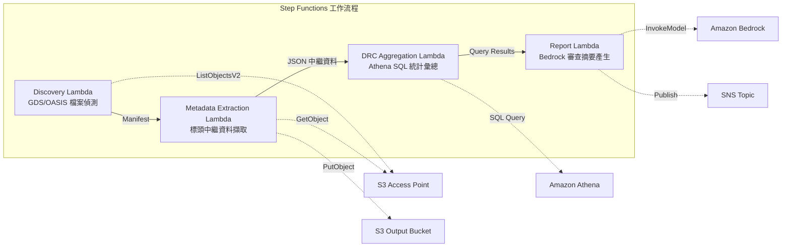
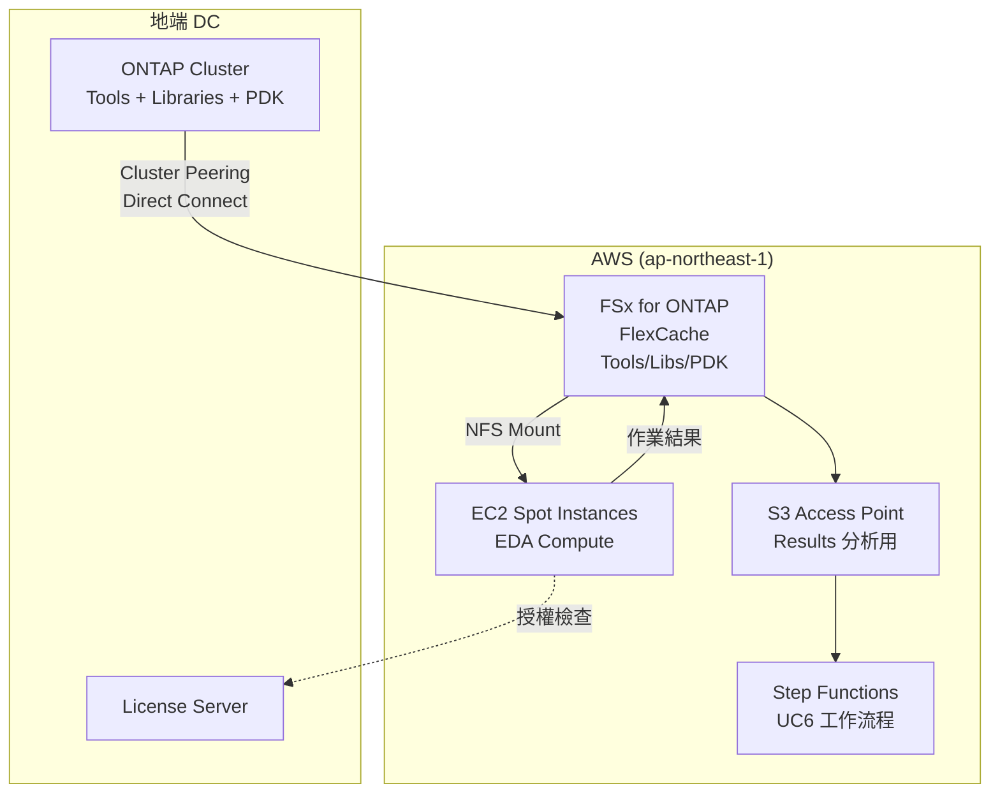

# UC6：半導體 / EDA — 設計檔案驗證·中繼資料擷取

🌐 **Language / 言語**: [日本語](README.md) | [English](README.en.md) | [한국어](README.ko.md) | [简体中文](README.zh-CN.md) | 繁體中文 | [Français](README.fr.md) | [Deutsch](README.de.md) | [Español](README.es.md)

📚 **文件**: [架構圖](docs/architecture.zh-TW.md) | [示範指南](docs/demo-guide.zh-TW.md) | [Workshop Lab](https://catalog.us-east-1.prod.workshops.aws/workshops/9cd82e0b-8348-456b-932a-818b9e5825a1/en-US)

## 概述

一個利用 FSx for ONTAP 的 S3 Access Points，自動化 GDS/OASIS 半導體設計檔案的驗證、中繼資料擷取以及 DRC（Design Rule Check）統計彙總的無伺服器工作流程。

### 適合此模式的情境

- 大量 GDS/OASIS 設計檔案已累積在 FSx for ONTAP 上
- 希望自動為設計檔案的中繼資料（程式庫名稱、單元數、邊界框等）建立目錄
- 希望定期彙總 DRC 統計以掌握設計品質趨勢
- 需要透過 Athena SQL 進行橫向的設計中繼資料分析
- 希望自動產生自然語言的設計審查摘要

### 不適合此模式的情境

- 需要即時執行 DRC（以 EDA 工具整合為前提）
- 需要對設計檔案進行實體驗證（製造規則符合性的完整驗證）
- 已經運行基於 EC2 的 EDA 工具鏈，遷移成本不划算
- 無法確保到 ONTAP REST API 的網路可達性的環境

### 主要功能

- 透過 S3 AP 自動偵測 GDS/OASIS 檔案（.gds, .gds2, .oas, .oasis）
- 標頭中繼資料擷取（library_name, units, cell_count, bounding_box, creation_date）
- 透過 Athena SQL 進行 DRC 統計彙總（單元數分佈、邊界框離群值、命名規則違規）
- 透過 Amazon Bedrock 產生自然語言設計審查摘要
- 透過 SNS 通知即時共享結果


## Success Metrics

### Outcome
透過自動化 GDS/OASIS 驗證·中繼資料擷取，削減設計審查準備工時。

### Metrics
| 指標 | 目標值（範例） |
|-----------|------------|
| 已處理設計檔案數 / 執行 | > 100 files |
| 驗證錯誤偵測率 | 100%（已知錯誤模式） |
| Bedrock 報告產生時間 | < 3 分鐘 |
| Athena 查詢回應時間 | < 10 秒 |
| 成本 / 執行 | < $5 |
| Human Review 對象率 | < 15%（設計審查指摘） |

### Measurement Method
Step Functions 執行歷史、Athena 查詢結果、Bedrock 報告中繼資料、CloudWatch Metrics。

## 架構



### 工作流程步驟

1. **Discovery**：從 S3 AP 偵測 .gds, .gds2, .oas, .oasis 檔案並產生 Manifest
2. **Metadata Extraction**：從各設計檔案的標頭擷取中繼資料，並以帶日期分割的 JSON 輸出到 S3
3. **DRC Aggregation**：透過 Athena SQL 橫向分析中繼資料目錄並彙總 DRC 統計
4. **Report Generation**：透過 Bedrock 產生設計審查摘要，輸出到 S3 + SNS 通知

## 前提條件

- AWS 帳戶和適當的 IAM 權限
- FSx for ONTAP 檔案系統（ONTAP 9.17.1P4D3 或更新版本）
- 已啟用 S3 Access Point 的磁碟區（儲存 GDS/OASIS 檔案）
- VPC、私有子網路
- **NAT Gateway 或 VPC Endpoints**（Discovery Lambda 從 VPC 內存取 AWS 服務所必需）
- 已啟用 Amazon Bedrock 模型存取（Claude / Nova）
- ONTAP REST API 憑證已儲存在 Secrets Manager 中

## 部署步驟

### 1. 建立 S3 Access Point

在儲存 GDS/OASIS 檔案的磁碟區上建立 S3 Access Point。

#### 透過 AWS CLI 建立

```bash
aws fsx create-and-attach-s3-access-point \
  --name <your-s3ap-name> \
  --type ONTAP \
  --ontap-configuration '{
    "VolumeId": "<your-volume-id>",
    "FileSystemIdentity": {
      "Type": "UNIX",
      "UnixUser": {
        "Name": "root"
      }
    }
  }' \
  --region <your-region>
```

建立後，請記下回應中的 `S3AccessPoint.Alias`（`xxx-ext-s3alias` 格式）。

#### 透過 AWS 管理主控台建立

1. 開啟 [Amazon FSx 主控台](https://console.aws.amazon.com/fsx/)
2. 選擇目標檔案系統
3. 在「磁碟區」索引標籤中選擇目標磁碟區
4. 選擇「S3 存取點」索引標籤
5. 按一下「建立並連接 S3 存取點」
6. 輸入存取點名稱，並指定檔案系統 ID 類型（UNIX/WINDOWS）和使用者
7. 按一下「建立」

> 詳情請參閱 [建立 S3 Access Points for FSx for ONTAP](https://docs.aws.amazon.com/fsx/latest/ONTAPGuide/s3-access-points-create-fsxn.html)。

#### 確認 S3 AP 狀態

```bash
aws fsx describe-s3-access-point-attachments --region <your-region> \
  --query 'S3AccessPointAttachments[*].{Name:Name,Lifecycle:Lifecycle,Alias:S3AccessPoint.Alias}' \
  --output table
```

請等待 `Lifecycle` 變為 `AVAILABLE`（通常 1~2 分鐘）。

### 2. 上傳範例檔案（選用）

將測試用的 GDS 檔案上傳到磁碟區：

```bash
S3AP_ALIAS="<your-s3ap-alias>"

aws s3 cp test-data/semiconductor-eda/eda-designs/test_chip.gds \
  "s3://${S3AP_ALIAS}/eda-designs/test_chip.gds" --region <your-region>

aws s3 cp test-data/semiconductor-eda/eda-designs/test_chip_v2.gds2 \
  "s3://${S3AP_ALIAS}/eda-designs/test_chip_v2.gds2" --region <your-region>
```

### 3. SAM 部署

```bash
# 前提：需要 AWS SAM CLI。sam build 會自動封裝程式碼和共享層。
sam build

sam deploy \
  --stack-name fsxn-semiconductor-eda \
  --parameter-overrides \
    S3AccessPointAlias=<your-s3ap-alias> \
    S3AccessPointName=<your-s3ap-name> \
    OntapSecretName=<your-secret-name> \
    OntapManagementIp=<ontap-mgmt-ip> \
    SvmUuid=<your-svm-uuid> \
    VpcId=<your-vpc-id> \
    PrivateSubnetIds=<subnet-1>,<subnet-2> \
    PrivateRouteTableIds=<rtb-1>,<rtb-2> \
    NotificationEmail=<your-email@example.com> \
    BedrockModelId=apac.amazon.nova-lite-v1:0 \
    EnableVpcEndpoints=true \
    MapConcurrency=10 \
    LambdaMemorySize=512 \
    LambdaTimeout=300 \
  --capabilities CAPABILITY_NAMED_IAM \
  --resolve-s3 \
  --region <your-region>
```

> **重要**：`S3AccessPointName` 是 S3 AP 的名稱（不是 Alias，而是建立時指定的名稱）。用於 IAM 政策中基於 ARN 的權限授予。省略時可能會發生 `AccessDenied` 錯誤。

### 4. 確認 SNS 訂閱

部署後，指定的電子郵件地址會收到確認郵件。請按一下連結進行確認。

### 5. 驗證運行

手動執行 Step Functions 以驗證運行：

```bash
aws stepfunctions start-execution \
  --state-machine-arn "arn:aws:states:<region>:<account-id>:stateMachine:fsxn-semiconductor-eda-workflow" \
  --input '{}' \
  --region <your-region>
```

> **注意**：首次執行時，Athena 的 DRC 彙總結果可能為 0 筆。這是因為中繼資料反映到 Glue 表格存在時間延遲。從第二次執行起可取得正確的統計。

> **注意**：`template.yaml` 用於 SAM CLI（`sam build` + `sam deploy`）。
> 若使用 `aws cloudformation deploy` 命令直接部署，請使用 `template-deploy.yaml`（需要預先封裝 Lambda zip 檔案並上傳到 S3）。

## 設定參數一覽

| 參數 | 說明 | 預設值 | 必填 |
|-----------|------|----------|------|
| `S3AccessPointAlias` | FSx for ONTAP S3 AP Alias（用於輸入） | — | ✅ |
| `S3AccessPointName` | S3 AP 名稱（用於基於 ARN 的 IAM 權限授予） | `""` | ⚠️ 建議 |
| `OntapSecretName` | ONTAP REST API 憑證的 Secrets Manager 密鑰名稱 | — | ✅ |
| `OntapManagementIp` | ONTAP 叢集管理 IP 位址 | — | ✅ |
| `SvmUuid` | ONTAP SVM UUID | — | ✅ |
| `ScheduleExpression` | EventBridge Scheduler 的排程運算式 | `rate(1 hour)` | |
| `VpcId` | VPC ID | — | ✅ |
| `PrivateSubnetIds` | 私有子網路 ID 清單 | — | ✅ |
| `PrivateRouteTableIds` | 私有子網路的路由表 ID 清單（用於 S3 Gateway Endpoint） | `""` | |
| `NotificationEmail` | SNS 通知目標電子郵件地址 | — | ✅ |
| `BedrockModelId` | Bedrock 模型 ID | `apac.amazon.nova-lite-v1:0` | |
| `MapConcurrency` | Map 狀態的平行執行數 | `10` | |
| `LambdaMemorySize` | Lambda 記憶體大小 (MB) | `256` | |
| `LambdaTimeout` | Lambda 逾時 (秒) | `300` | |
| `EnableVpcEndpoints` | 啟用 Interface VPC Endpoints | `false` | |
| `EnableCloudWatchAlarms` | 啟用 CloudWatch Alarms | `false` | |
| `EnableXRayTracing` | 啟用 X-Ray 追蹤 | `true` | |

> ⚠️ **`S3AccessPointName`**：可省略，但若不指定，IAM 政策將僅基於 Alias，在某些環境中會發生 `AccessDenied` 錯誤。生產環境建議指定。

## 疑難排解

### Discovery Lambda 逾時

**原因**：VPC 內的 Lambda 無法到達 AWS 服務（Secrets Manager, S3, CloudWatch）。

**解決方法**：請確認以下之一：
1. 以 `EnableVpcEndpoints=true` 部署並指定 `PrivateRouteTableIds`
2. VPC 中存在 NAT Gateway，且私有子網路的路由表中有到 NAT Gateway 的路由

### AccessDenied 錯誤（ListObjectsV2）

**原因**：IAM 政策缺少 S3 Access Point 的基於 ARN 的權限。

**解決方法**：在 `S3AccessPointName` 參數中指定 S3 AP 的名稱（不是 Alias，而是建立時的名稱）並更新堆疊。

### Athena DRC 彙總結果為 0 筆

**原因**：DRC Aggregation Lambda 使用的 `metadata_prefix` 篩選器與實際中繼資料 JSON 中的 `file_key` 值可能不一致。此外，首次執行時 Glue 表格中不存在中繼資料，因此為 0 筆。

**解決方法**：
1. 執行 Step Functions 兩次（第一次將中繼資料寫入 S3，第二次讓 Athena 可以彙總）
2. 在 Athena 主控台中直接執行 `SELECT * FROM "<db>"."<table>" LIMIT 10`，確認資料可讀
3. 如果資料可讀但彙總為 0 筆，請確認 `file_key` 的值與 `prefix` 篩選器的一致性

## 清理

```bash
# 清空 S3 儲存貯體
aws s3 rm s3://fsxn-semiconductor-eda-output-${AWS_ACCOUNT_ID} --recursive

# 刪除 CloudFormation 堆疊
aws cloudformation delete-stack \
  --stack-name fsxn-semiconductor-eda \
  --region ap-northeast-1

# 等待刪除完成
aws cloudformation wait stack-delete-complete \
  --stack-name fsxn-semiconductor-eda \
  --region ap-northeast-1
```

## Supported Regions

UC6 使用以下服務：

| 服務 | 區域限制 |
|---------|-------------|
| Amazon Athena | 幾乎所有區域均可用 |
| Amazon Bedrock | 請確認支援的區域（[Bedrock 支援區域](https://docs.aws.amazon.com/general/latest/gr/bedrock.html)） |
| AWS X-Ray | 幾乎所有區域均可用 |
| CloudWatch EMF | 幾乎所有區域均可用 |

> 詳情請參閱 [區域相容性矩陣](../docs/region-compatibility.md)。

## 參考連結

- [FSx for ONTAP S3 Access Points 概述](https://docs.aws.amazon.com/fsx/latest/ONTAPGuide/accessing-data-via-s3-access-points.html)
- [建立並連接 S3 Access Points](https://docs.aws.amazon.com/fsx/latest/ONTAPGuide/s3-access-points-create-fsxn.html)
- [S3 Access Points 的存取管理](https://docs.aws.amazon.com/fsx/latest/ONTAPGuide/s3-ap-manage-access-fsxn.html)
- [Amazon Athena 使用者指南](https://docs.aws.amazon.com/athena/latest/ug/what-is.html)
- [Amazon Bedrock API 參考](https://docs.aws.amazon.com/bedrock/latest/APIReference/API_runtime_InvokeModel.html)
- [GDSII 格式規範](https://boolean.klaasholwerda.nl/interface/bnf/gdsformat.html)
- [AWS Workshop: Amazon Quick + FSx for ONTAP S3 AP](https://catalog.us-east-1.prod.workshops.aws/workshops/9cd82e0b-8348-456b-932a-818b9e5825a1/en-US/08-quicksuite/61-setup)
- [AWS Storage Blog: AI-powered analytics on enterprise file data](https://aws.amazon.com/blogs/storage/enabling-ai-powered-analytics-on-enterprise-file-data-configuring-s3-access-points-for-amazon-fsx-for-netapp-ontap-with-active-directory/)
- [Guidance: Scaling EDA on AWS](https://aws.amazon.com/solutions/guidance/scaling-electronic-design-automation-on-aws/)

## Workshop 驗證的 EDA 場景

> **動手實驗**: [FSx for ONTAP S3 Access Points Workshop](https://catalog.us-east-1.prod.workshops.aws/workshops/9cd82e0b-8348-456b-932a-818b9e5825a1/en-US)

| EDA 工具 | 日誌類型 | UC6 處理 |
|----------|---------|----------|
| LSF (IBM Spectrum) | 作業排程 | 資源使用量彙總 |
| Cadence ncvlog/ncelab | 編譯 | 錯誤/警告計數 |
| Cadence Xcelium | 模擬 | PASS/FAIL/UVM_FATAL 偵測 |
| Coverage Analysis | 後處理 | 覆蓋率彙總 |

| 觸發方式 | 延遲 | 實作複雜度 | 模式支援 |
|---------|------|-----------|:---:|
| EventBridge Scheduler (輪詢) | 分鐘~小時 | 低 | ✅ TriggerMode=POLLING |
| FPolicy → EventBridge (事件驅動) | 秒~分鐘 | 高 | ✅ TriggerMode=EVENT_DRIVEN |
| S3 Event Notifications | — | — | ❌ S3 AP 不支援 |

---

## FlexCache 雲端爆發擴充

### 概述

在 EDA 工作負載中，Tools/Libraries/PDK 以讀取為主，是 FlexCache 的最佳適用對象。透過將儲存在地端 ONTAP Origin 上的 EDA 工具鏈快取到 AWS 上的 FSx for ONTAP FlexCache，可大幅改善雲端爆發時的資料存取效能。

### EDA 磁碟區分類與 FlexCache 適用

| 磁碟區類型 | 存取模式 | FlexCache 適用 | S3 AP 使用 |
|--------------|---------------|:---:|:---:|
| Tools (Cadence/Synopsys/Siemens) | 唯讀 | ✅ 最佳 | ⚠️ 二進位 |
| Libraries | 唯讀 | ✅ 最佳 | ⚠️ 二進位 |
| PDK (Process Design Kit) | 唯讀 | ✅ 最佳 | ⚠️ 二進位 |
| RCS (Revision Control) | 讀寫 | ❌ | ❌ |
| Home | 讀寫 | ❌ | ❌ |
| Scratch | 寫入為主 | ❌ | ❌ |
| Results | 寫入 → 讀取 | ❌ | ✅ 分析用 |

### 雲端爆發構成



### KPI

| KPI | 無 FlexCache | 有 FlexCache | 改善率 |
|-----|--------------|---------------|--------|
| EDA 作業啟動等待時間 | 15-30分鐘 (WAN) | 1-3分鐘 (cache hit) | 80-90% |
| Regression 完成時間 | 8小時 | 3小時 | 62% |
| WAN 傳輸量/日 | 500GB | 50GB | 90% |
| 授權利用效率 | 60% | 85% | +25pt |

### 相關模式

- [Dynamic FlexCache Render/EDA Workflow](../dynamic-flexcache-render-workflow/README.md) — 按作業的 FlexCache 動態建立·刪除
- [FlexCache AnyCast / DR](../flexcache-anycast-dr/README.md) — 多區域雲端爆發
- [產業·工作負載對應](../docs/industry-workload-mapping.md) — Pattern D: EDA Cloud Burst


---

## AWS 文件連結

| 服務 | 文件 |
|---------|------------|
| FSx for ONTAP | [使用者指南](https://docs.aws.amazon.com/fsx/latest/ONTAPGuide/what-is-fsx-ontap.html) |
| S3 Access Points | [S3 AP for FSx for ONTAP](https://docs.aws.amazon.com/fsx/latest/ONTAPGuide/s3-access-points.html) |
| Step Functions | [開發人員指南](https://docs.aws.amazon.com/step-functions/latest/dg/welcome.html) |
| Amazon Athena | [使用者指南](https://docs.aws.amazon.com/athena/latest/ug/what-is.html) |
| Amazon Bedrock | [使用者指南](https://docs.aws.amazon.com/bedrock/latest/userguide/what-is-bedrock.html) |

### Well-Architected Framework 對應

| 支柱 | 對應 |
|----|------|
| 卓越營運 | X-Ray 追蹤、EMF 指標、DRC 統計儀表板 |
| 安全性 | 最小權限 IAM、KMS 加密、設計資料存取控制 |
| 可靠性 | Step Functions Retry/Catch、中繼資料擷取重試 |
| 效能效率 | GDS 標頭部分讀取、Athena 分割 |
| 成本最佳化 | 無伺服器（僅使用時計費）、Athena 掃描最佳化 |
| 永續性 | 隨需執行、增量處理（僅變更檔案） |


---

## 成本估算（月度概算）

> **註記**：以下為 ap-northeast-1 區域的概算，實際成本因使用量而異。最新價格請在 [AWS Pricing Calculator](https://calculator.aws/) 確認。

### 無伺服器元件（用量計費）

| 服務 | 單價 | 預估使用量 | 月度概算 |
|---------|------|-----------|---------|
| Lambda | $0.0000166667/GB-sec | 5 函數 × 100 files/日 | ~$1-5 |
| S3 API (GetObject/ListObjects) | $0.0047/10K requests | ~10K requests/日 | ~$1.5 |
| Step Functions | $0.025/1K state transitions | ~1K transitions/日 | ~$0.75 |
| Bedrock (Nova Lite) | $0.00006/1K input tokens | ~50K tokens/執行 | ~$3-10 |
| Athena | $5/TB scanned | ~10 MB/查詢 | ~$0.5-2 |
| SNS | $0.50/100K notifications | ~100 notifications/日 | ~$0.15 |
| CloudWatch Logs | $0.76/GB ingested | ~1 GB/月 | ~$0.76 |
| Glue ETL (選用) | $0.44/DPU-hour |


### 固定成本（FSx for ONTAP — 以現有環境為前提）

| 元件 | 月度 |
|--------------|------|
| FSx for ONTAP (128 MBps, 1 TB) | ~$230 (共享現有環境) |
| S3 Access Point | 無額外費用（僅 S3 API 費用） |

### 合計概算

| 構成 | 月度概算 |
|------|---------|
| 最小構成（每日 1 次執行） | ~$5-15 |
| 標準構成（每小時執行） | ~$15-50 |
| 大規模構成（高頻 + 警示） | ~$50-150 |

> **Governance Caveat**：成本估算為概算，非保證值。實際帳單金額因使用模式、資料量、區域而異。

---

## 本地測試

### Prerequisites 檢查

```bash
# 確認前提條件
aws --version          # AWS CLI v2
sam --version          # SAM CLI
python3 --version      # Python 3.9+
docker --version       # Docker (用於 sam local)
aws sts get-caller-identity  # AWS 憑證
```

### sam local invoke

```bash
# 建置
# 前提：需要 AWS SAM CLI。sam build 會自動封裝程式碼和共享層。
sam build

# 本地執行 Discovery Lambda
sam local invoke DiscoveryFunction --event events/discovery-event.json

# 帶環境變數覆寫
sam local invoke DiscoveryFunction \
  --event events/discovery-event.json \
  --env-vars env.json
```

### 單元測試

```bash
python3 -m pytest tests/ -v
```

詳情請參閱 [本地測試快速入門](../docs/local-testing-quick-start.md)。

---

## 輸出範例 (Output Sample)

EDA 設計檔案驗證的輸出範例：

```json
{
  "discovery": {
    "status": "completed",
    "object_count": 5,
    "prefix": "eda-designs/"
  },
  "metadata_extraction": [
    {
      "key": "eda-designs/top_chip_v3.gds",
      "format": "GDSII",
      "cell_count": 1284,
      "bounding_box": {"max_x": 12000.5, "max_y": 9800.2}
    }
  ],
  "drc_aggregation": {
    "total_violations": 23,
    "critical": 2,
    "major": 8,
    "minor": 13,
    "categories": {"spacing": 10, "width": 8, "enclosure": 5}
  },
  "report": {
    "report_key": "reports/design-review-2026-05-23.md",
    "recommendation": "2 critical DRC violations require manual review before tapeout"
  }
}
```

> **註記**：上述為範例輸出，實際值因環境·輸入資料而異。基準數值為 sizing reference，而非 service limit。

---

## Governance Note

> 本模式提供技術架構指導。它不是法律、合規或監管方面的建議。組織應諮詢合格的專業人士。

---

## S3AP Compatibility

關於 S3 Access Points for FSx for ONTAP 的相容性限制、疑難排解和觸發模式，請參閱 [S3AP Compatibility Notes](../docs/s3ap-compatibility-notes.md)。
