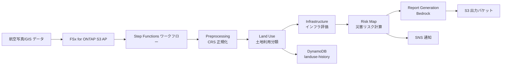

# スマートシティ — 地理空間データ解析パイプライン Demo Guide

🌐 **Language / 言語**: 日本語 | [English](demo-guide.en.md) | [한국어](demo-guide.ko.md) | [简体中文](demo-guide.zh-CN.md) | [繁體中文](demo-guide.zh-TW.md) | [Français](demo-guide.fr.md) | [Deutsch](demo-guide.de.md) | [Español](demo-guide.es.md)

## Executive Summary

自治体の都市計画・災害対応・インフラ保全において GIS データ活用が増加しているが、解析は ArcGIS / QGIS 等の専門ソフトウェア中心で自動化が困難だった。本デモでは FSx for ONTAP S3 AP + サーバーレスにより、CRS 正規化・土地利用分類・災害リスク評価・Bedrock による都市計画レポート生成を自動化する。分析担当者はファイルサーバー上の GIS データをそのまま活用しながら、AI による高度な地理空間分析を実現できる。

## Target Audience & Persona

| 項目 | 内容 |
|------|------|
| **ユースケース ID** | UC17 |
| **業界** | スマートシティ / 自治体 |
| **主要ペルソナ** | 自治体 都市計画担当 / スマートシティ推進室 |
| **役割** | 都市計画策定、災害リスク評価、インフラ更新計画 |
| **課題** | GIS 解析の専門性が高く、都市計画レポート作成に時間がかかる |
| **期待する成果** | AI による自動リスク評価と Bedrock レポート生成で、データドリブンな都市計画を迅速に推進 |
| **技術レベル** | GIS ツール（QGIS 等）の基本操作、クラウドは初級レベル |

## Demo Scenario



**ワークフロー概要**:

1. 航空写真（GeoTIFF）を FSx for ONTAP ボリュームに配置（S3 AP 経由でアクセス）
2. CRS（座標参照系）の正規化で混在するデータソースを統一
3. 土地利用分類（住宅・商業・農地・森林等）
4. インフラ状態評価
5. 洪水・地震・土砂崩れの災害リスクスコア計算
6. Bedrock（Nova Lite）による都市計画レポート（Markdown）自動生成
7. DynamoDB に土地利用履歴を時系列で保存

## ステップバイステップ デプロイ・検証手順

### Step 1: 前提条件の確認

以下の環境が整っていることを確認してください:

- AWS アカウント、ap-northeast-1 リージョン
- FSx for ONTAP + S3 Access Point が構成済み
- Bedrock Nova Lite v1:0 モデル利用可能化（Bedrock コンソールでモデルアクセスを有効化）
- AWS CLI v2 がインストール済み
- 適切な IAM 権限（CloudFormation, Step Functions, S3, Lambda, Bedrock）

```bash
# AWS CLI の確認
aws --version
aws sts get-caller-identity

# Bedrock モデルアクセス確認
aws bedrock list-foundation-models \
  --query "modelSummaries[?modelId=='amazon.nova-lite-v1:0'].modelId" \
  --output text

# S3 Access Point の疎通確認
aws s3 ls s3://<your-ap-ext-s3alias>/ --max-items 5
```

### Step 2: リポジトリのクローンとディレクトリ移動

```bash
git clone https://github.com/Yoshiki0705/fsxn-s3ap-serverless-patterns.git
cd fsxn-s3ap-serverless-patterns/solutions/industry/smart-city-geospatial
```

### Step 3: テスト用サンプルデータの配置

```bash
# サンプル航空写真アップロード（仙台市の一画）
aws s3 cp sendai_district.tif \
  s3://<s3-ap-arn>/gis/2026/05/sendai.tif
```

### Step 4: SAM ビルドとデプロイ

```bash
# 前提: AWS SAM CLI が必要です。sam build がコードと共有レイヤーを自動でパッケージングします。
sam build

sam deploy \
  --stack-name fsxn-uc17-demo \
  --parameter-overrides \
    S3AccessPointAlias=<your-ap-ext-s3alias> \
    VpcId=<vpc-id> \
    PrivateSubnetIds=<subnet-ids> \
    NotificationEmail=ops@example.com \
    BedrockModelId=amazon.nova-lite-v1:0 \
  --capabilities CAPABILITY_NAMED_IAM \
  --resolve-s3
```

デプロイ完了まで約 5 分。CloudFormation コンソールでスタックステータスが `CREATE_COMPLETE` になることを確認。

### Step 5: ワークフローの手動実行

```bash
# Step Functions 実行
aws stepfunctions start-execution \
  --state-machine-arn <uc17-StateMachineArn> \
  --input '{}'
```

- AWS コンソールで Step Functions グラフを確認（Preprocessing → LandUse → Infrastructure → RiskMap → ReportGeneration）
- SUCCEEDED までの実行時間を確認（通常 3-5 分、Bedrock レポート生成含む）

### Step 6: 出力結果の確認

```bash
# CRS 正規化メタデータ
aws s3 ls s3://<output-bucket>/preprocessed/

# 土地利用分類結果
aws s3 ls s3://<output-bucket>/landuse/

# 災害リスクマップ
aws s3 ls s3://<output-bucket>/risk-maps/

# Bedrock 生成レポート
aws s3 ls s3://<output-bucket>/reports/
```

出力構造:
- `preprocessed/gis/2026/05/sendai.tif.metadata.json`（CRS 情報）
- `landuse/gis/2026/05/sendai.tif.json`（土地利用分布）
- `risk-maps/gis/2026/05/sendai.tif.json`（災害リスクスコア）
- `reports/2026/05/10/gis/2026/05/sendai.tif.md`（Bedrock 生成レポート）

追加確認:
- DynamoDB `landuse-history` テーブルで時系列変化確認
- Bedrock 生成レポートのマークダウンを表示
- 洪水・地震・土砂リスクスコアの可視化（CRITICAL/HIGH/MEDIUM/LOW）

## 検証チェックリスト

| # | 検証項目 | 期待結果 | 確認方法 |
|---|----------|----------|----------|
| 1 | CloudFormation スタック作成 | `CREATE_COMPLETE` | AWS コンソール |
| 2 | Step Functions 実行 | `SUCCEEDED` | 実行履歴 |
| 3 | CRS 正規化 | `preprocessed/` 配下に metadata.json | S3 バケット |
| 4 | 土地利用分類 | `landuse/` 配下に JSON | S3 バケット |
| 5 | リスクマップ生成 | `risk-maps/` 配下に JSON（スコア付き） | S3 バケット |
| 6 | Bedrock レポート | `reports/` 配下に .md ファイル | S3 バケット |
| 7 | 土地利用履歴 | DynamoDB にレコード追加 | DynamoDB コンソール |
| 8 | リスクアラート通知 | SNS メール受信（CRITICAL/HIGH 時） | メール確認 |

## よくある質問と回答

**Q. CRS 変換は実際に行われる？**  
A. rasterio / pyproj Layer 配置時のみ。`PYPROJ_AVAILABLE` チェックでフォールバック。

**Q. Bedrock モデルの選択基準？**  
A. Nova Lite はコスト/精度バランス良好。長文が必要なら Claude Sonnet 推奨。
A. Nova Lite は日本語レポート生成でコスト効率が高い。Claude 3 Haiku は精度優先時の代替。

**Q. Amazon Location Service との連携は？**  
A. 将来的に Location Service の Geofence / Tracker と統合し、リアルタイム位置情報解析を計画中。

**Q. 点群データ（LAS）は処理可能？**  
A. 本格運用時に LAS Layer をデプロイすれば可能。現行プロトタイプは GeoTIFF のみ対応。

**Q. リスクスコアの計算式は？**  
A. 洪水（河川距離・標高）、地震（活断層距離・地盤種別）、土砂崩れ（傾斜角・降水量）の複合スコア。

## トラブルシューティング

| 症状 | 原因 | 解決策 |
|------|------|--------|
| Bedrock が `AccessDeniedException` | モデルアクセスが有効化されていない | Bedrock コンソールで `amazon.nova-lite-v1:0` のモデルアクセスを有効化 |
| CRS 正規化が skip される | rasterio / pyproj Lambda Layer 未配置 | `PYPROJ_AVAILABLE=false` のフォールバックモードで動作（CRS はそのまま保持） |
| S3 AP から `AccessDenied` | IAM ポリシーの ARN 形式不正 | `arn:aws:s3:{region}:{account}:accesspoint/{name}/object/*` 形式を使用 |
| Bedrock レポートが空 | 入力トークンが不足 | landuse / risk-maps の出力が正常に生成されているか確認 |
| DynamoDB に履歴レコードなし | LandUse Lambda がエラー | CloudWatch Logs で Lambda 実行ログを確認 |
| Step Functions タイムアウト | Bedrock レスポンスが遅い | Lambda タイムアウトを 300 秒以上に設定 |
| デプロイ時 `ROLLBACK_COMPLETE` | Bedrock モデル ID の指定ミス | `BedrockModelId=amazon.nova-lite-v1:0` を正確に指定 |

---

## 出力先について: OutputDestination で選択可能 (Pattern B)

UC17 smart-city-geospatial は 2026-05-11 のアップデートで `OutputDestination` パラメータをサポートしました
（`docs/output-destination-patterns.md` 参照）。

**対象ワークロード**: CRS 正規化メタデータ / 土地利用分類 / インフラ評価 / リスクマップ / Bedrock 生成レポート

**2 つのモード**:

### STANDARD_S3（デフォルト、従来どおり）
新しい S3 バケット（`${AWS::StackName}-output-${AWS::AccountId}`）を作成し、
AI 成果物をそこに書き込みます。Discovery Lambda の manifest のみ S3 Access Point
に書き込まれます（従来通り）。

```bash
sam deploy \
  --stack-name fsxn-smart-city-demo \
  --parameter-overrides \
    OutputDestination=STANDARD_S3 \
    ... (他の必須パラメータ)
```

### FSXN_S3AP（"no data movement" パターン）
CRS 正規化メタデータ、土地利用分類結果、インフラ評価、リスクマップ、Bedrock が生成する
都市計画レポート（Markdown）を、FSx for ONTAP S3 Access Point 経由でオリジナル GIS データと
**同一の FSx for ONTAP ボリューム**に書き戻します。
都市計画担当者が SMB/NFS の既存ディレクトリ構造内で AI 成果物を直接参照できます。
標準 S3 バケットは作成されません。

```bash
sam deploy \
  --stack-name fsxn-smart-city-demo \
  --parameter-overrides \
    OutputDestination=FSXN_S3AP \
    OutputS3APPrefix=ai-outputs/ \
    S3AccessPointName=eda-demo-s3ap \
    ... (他の必須パラメータ)
```

**注意事項**:

- `S3AccessPointName` の指定を強く推奨（Alias 形式と ARN 形式の両方で IAM 許可する）
- 5GB 超のオブジェクトは FSx for ONTAP S3 AP では不可（AWS 仕様）、マルチパートアップロード必須
- ChangeDetection Lambda は DynamoDB のみを使用するため `OutputDestination` の影響を受けません
- Bedrock レポートは Markdown（`text/markdown; charset=utf-8`）として書き出されるため、SMB/NFS
  クライアントのテキストエディタで直接閲覧可能
- AWS 仕様上の制約は
  [プロジェクト README の "AWS 仕様上の制約と回避策" セクション](../../README.md#aws-仕様上の制約と回避策)
  および [`docs/output-destination-patterns.md`](../../docs/output-destination-patterns.md) を参照

---

## クリーンアップ

デモ終了後は以下の手順でリソースを削除してください:

```bash
# CloudFormation スタック削除
aws cloudformation delete-stack \
  --stack-name fsxn-uc17-demo \
  --region ap-northeast-1

# 削除完了を待機
aws cloudformation wait stack-delete-complete \
  --stack-name fsxn-uc17-demo \
  --region ap-northeast-1

# S3 出力バケットの手動削除（バケットが空でない場合）
aws s3 rb s3://fsxn-uc17-demo-output-<account-id> --force
```

> **注意**: VPC Lambda の ENI 解放に 15-30 分かかる場合があります（AWS の仕様）。`DELETE_FAILED` になった場合は数分後に再試行してください。

---

## 検証済みの UI/UX スクリーンショット

Phase 7 UC15/16/17 と UC6/11/14 のデモと同じ方針で、**エンドユーザーが日常業務で実際に
見る UI/UX 画面**を対象とする。技術者向けビュー（Step Functions グラフ、CloudFormation
スタックイベント等）は `docs/verification-results-*.md` に集約。

### このユースケースの検証ステータス

- ✅ **E2E 検証**: SUCCEEDED（Phase 7 Extended Round, commit b77fc3b）
- 📸 **UI/UX 撮影**: ✅ 完了（Phase 8 Theme D, commit d7ebabd）

### 既存スクリーンショット（Phase 7 検証時）


### 再検証時の UI/UX 対象画面（推奨撮影リスト）

- S3 出力バケット（tiles/、land-use/、change-detection/、risk-maps/、reports/）
- Bedrock 生成の都市計画レポート（Markdown プレビュー）
- DynamoDB landuse_history テーブル（土地利用分類履歴）
- リスクマップ JSON プレビュー（CRITICAL/HIGH/MEDIUM/LOW 分類）
- FSx for ONTAP ボリューム上の AI 成果物（FSXN_S3AP モード時 — SMB/NFS で閲覧可能な Markdown レポート）

### 撮影ガイド

1. **事前準備**:
   - `bash scripts/verify_phase7_prerequisites.sh` で前提確認（共通 VPC/S3 AP 有無）
   - `UC=smart-city-geospatial bash scripts/package_generic_uc.sh` で Lambda パッケージ
   - `bash scripts/deploy_generic_ucs.sh UC17` でデプロイ

2. **サンプルデータ配置**:
   - S3 AP Alias 経由で `gis/` プレフィックスにサンプル GeoTIFF をアップロード
   - Step Functions `fsxn-smart-city-geospatial-demo-workflow` を起動（入力 `{}`）

3. **撮影**（CloudShell・ターミナルは閉じる、ブラウザ右上のユーザー名は黒塗り）:
   - S3 出力バケット `fsxn-smart-city-geospatial-demo-output-<account>` の俯瞰
   - Bedrock レポート Markdown のブラウザプレビュー
   - DynamoDB landuse_history テーブルのアイテム一覧
   - リスクマップ JSON の構造確認

4. **マスク処理**:
   - `python3 scripts/mask_uc_demos.py smart-city-geospatial-demo` で自動マスク
   - `docs/screenshots/MASK_GUIDE.md` に従って追加マスク（必要に応じて）

5. **クリーンアップ**:
   - `bash scripts/cleanup_generic_ucs.sh UC17` で削除
   - VPC Lambda ENI 解放に 15-30 分（AWS の仕様）
