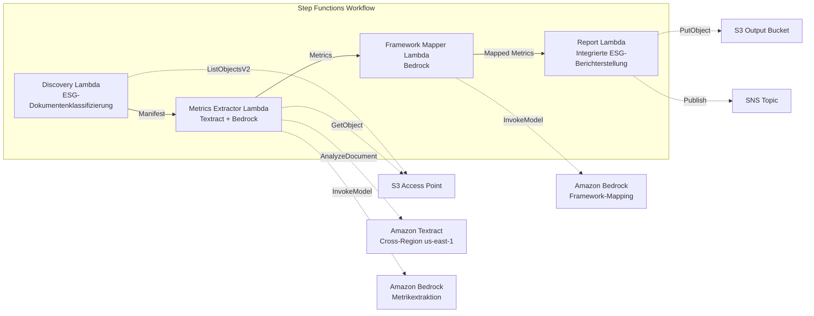

# UC23: Nachhaltigkeit & ESG — Metrikextraktion / Framework-Mapping

🌐 **Language / 言語**: [日本語](README.md) | [English](README.en.md) | [한국어](README.ko.md) | [简体中文](README.zh-CN.md) | [繁體中文](README.zh-TW.md) | [Français](README.fr.md) | Deutsch | [Español](README.es.md)

📚 **Dokumentation**: [Architektur](docs/architecture.de.md) | [Demo-Leitfaden](docs/demo-guide.de.md)

## Überblick

Ein serverloser Workflow, der die S3 Access Points von FSx for ONTAP nutzt, um automatisch quantitative Metriken aus ESG-bezogenen Dokumenten wie Nachhaltigkeitsberichten, Energieverbrauchsaufzeichnungen und Abfallmanifesten zu extrahieren, Einheiten zu normalisieren und auf Reporting-Frameworks abzubilden.

### Wann dieses Muster passt

- ESG-bezogene Dokumente (Nachhaltigkeitsberichte, Energieaufzeichnungen, Abfallmanifeste) sind auf FSx for ONTAP angesammelt
- Sie möchten CO2-Emissionen, Energieverbrauch, Abfallmenge und Wasserverbrauch aus unterschiedlichen Einheiten automatisch auf eine einheitliche Basis normalisieren
- Sie benötigen ein automatisches Mapping auf Frameworks wie GRI, TCFD und CDP
- Sie möchten die ESG-Leistung mit einer Jahresvergleichs-Trendanalyse (YoY) visualisieren
- Sie möchten den Aufwand für die Erstellung von ESG-Offenlegungsberichten reduzieren

### Wann dieses Muster nicht passt

- Sie benötigen ein Echtzeit-ESG-Monitoring-Dashboard
- Sie müssen eine Emissionshandelsplattform aufbauen
- Sie benötigen eine vollständige Automatisierung von Prüfungen durch Dritte
- Sie befinden sich in einer Umgebung, in der die Netzwerkerreichbarkeit der ONTAP REST API nicht sichergestellt werden kann

### Hauptfunktionen

- Automatische Erkennung und Kategorisierung von ESG-Dokumenten über den S3 AP (Environmental / Social / Governance)
- Extraktion quantitativer Metriken mit Textract + Bedrock (CO2-Emissionen, Energie, Abfall, Wasserverbrauch)
- Einheitennormalisierung (CO2→tCO2e, Energie→MWh, Abfall→t, Wasser→m³)
- Automatisches Mapping auf die Frameworks GRI / TCFD / CDP
- Erstellung eines integrierten ESG-Berichts (Aggregation nach Kategorie + nach Berichtszeitraum, YoY-Trendanalyse)
- Validierungsprüfungen (fehlende Einheiten, Widersprüche, Ausreißer)

## Success Metrics

### Outcome
Durch die Automatisierung der ESG-Metrikextraktion und der integrierten Berichterstellung die Qualität der Nachhaltigkeitsoffenlegung verbessern und die Effizienz des Berichtswesens steigern.

### Metrics
| Metrik | Zielwert (Beispiel) |
|--------|---------------------|
| Genauigkeit der ESG-Metrikextraktion | ≥ 85 % |
| Konsistenz der Einheitennormalisierung | 100 % (konform mit der definierten Umrechnungstabelle) |
| Abdeckung des Framework-Mappings | ≥ 80 % (GRI/TCFD/CDP) |
| Berichterstellungszeit | < 5 Min / Batch |
| Kosten / tägliche Ausführung | < 2,00 $ |
| Erforderliche Human-Review-Quote | > 20 % (validierungsfehlgeschlagene Metriken) |

### Measurement Method
Step-Functions-Ausführungsverlauf, Textract-Extraktionsergebnisse, Bedrock-Mapping-Genauigkeitsprotokolle, CloudWatch EMF Metrics (ProcessingDuration, SuccessCount, ErrorCount).

### Human Review Requirements
- Validierungsfehlgeschlagene Metriken (fehlende Einheiten, widersprüchliche Werte, Ausreißer) werden vom Nachhaltigkeitsteam geprüft
- Framework-Mapping-Ergebnisse werden vom Offenlegungsverantwortlichen überprüft
- Der jährliche integrierte ESG-Bericht wird von der Geschäftsleitung und dem IR-Team endgültig genehmigt

## Architektur



### Workflow-Schritte

1. **Discovery**: ESG-Dokumente aus dem S3 AP erkennen und in E/S/G-Kategorien klassifizieren
2. **Metrics Extractor**: Quantitative Metriken mit Textract + Bedrock extrahieren und Einheiten normalisieren
3. **Framework Mapper**: Mit Bedrock auf GRI/TCFD/CDP-Framework-Identifikatoren abbilden
4. **Report**: Integrierten ESG-Bericht erstellen (nach Kategorie + YoY-Trend), SNS-Benachrichtigung

## Voraussetzungen

> **Hinweis zum S3-AP-NetworkOrigin**: Die Discovery Lambda wird innerhalb einer VPC bereitgestellt. Wenn der NetworkOrigin des S3 Access Point `Internet` ist, kann nicht über einen S3 Gateway VPC Endpoint zugegriffen werden (Anfragen werden nicht an die FSx-Datenebene weitergeleitet). Verwenden Sie einen S3 AP mit NetworkOrigin=VPC oder konfigurieren Sie den Zugriff über ein NAT Gateway. Weitere Details siehe [S3AP Compatibility Notes](../docs/s3ap-compatibility-notes.md).

- AWS-Konto und angemessene IAM-Berechtigungen
- FSx for ONTAP-Dateisystem (ONTAP 9.17.1P4D3 oder höher)
- Ein Volume mit aktiviertem S3 Access Point
- VPC, private Subnetze
- Aktivierter Amazon-Bedrock-Modellzugriff (Claude / Nova)
- Amazon Textract — Cross-Region (us-east-1) Aufrufkonfiguration

## Bereitstellungsverfahren

### 1. Parameter überprüfen

Überprüfen Sie im Voraus die Pfadmuster der ESG-Dokumente (Environmental/Social/Governance-Präfixe).

### 2. SAM-Bereitstellung

```bash
# Voraussetzung: AWS SAM CLI ist erforderlich. 'sam build' verpackt den Code und den Shared Layer automatisch.
sam build

sam deploy \
  --stack-name fsxn-esg-reporting \
  --parameter-overrides \
    S3AccessPointAlias=<your-volume-ext-s3alias> \
    S3AccessPointName=<your-s3ap-name> \
    VpcId=<your-vpc-id> \
    PrivateSubnetIds=<subnet-1>,<subnet-2> \
    ScheduleExpression="cron(0 0 * * ? *)" \
    NotificationEmail=<your-email@example.com> \
    EnableVpcEndpoints=false \
    EnableCloudWatchAlarms=false \
  --capabilities CAPABILITY_NAMED_IAM \
  --resolve-s3 \
  --region ap-northeast-1
```

> **Hinweis**: `template.yaml` wird mit der SAM CLI (`sam build` + `sam deploy`) verwendet.
> Um direkt mit dem Befehl `aws cloudformation deploy` bereitzustellen, verwenden Sie stattdessen `template-deploy.yaml` (dies erfordert das vorherige Verpacken der Lambda-Zip-Dateien und deren Hochladen zu S3).

## Liste der Konfigurationsparameter

| Parameter | Beschreibung | Standard | Erforderlich |
|-----------|--------------|----------|--------------|
| `S3AccessPointAlias` | FSx for ONTAP S3 AP Alias (für Eingabe) | — | ✅ |
| `S3AccessPointName` | S3-AP-Name (zur Vergabe von IAM-Berechtigungen) | `""` | ⚠️ Empfohlen |
| `ScheduleExpression` | EventBridge-Scheduler-Zeitplanausdruck | `cron(0 0 * * ? *)` | |
| `VpcId` | VPC ID | — | ✅ |
| `PrivateSubnetIds` | Liste privater Subnetz-IDs | — | ✅ |
| `NotificationEmail` | SNS-Benachrichtigungs-E-Mail-Adresse | — | ✅ |
| `MapConcurrency` | Anzahl paralleler Ausführungen des Map-Status | `10` | |
| `LambdaMemorySize` | Lambda-Speichergröße (MB) | `512` | |
| `LambdaTimeout` | Lambda-Timeout (Sekunden) | `300` | |
| `EnableVpcEndpoints` | Interface VPC Endpoints aktivieren | `false` | |
| `EnableCloudWatchAlarms` | CloudWatch Alarms aktivieren | `false` | |

## ⚠️ Hinweise zur Performance

- Die Durchsatzkapazität von FSx for ONTAP wird **über NFS/SMB/S3 AP gemeinsam genutzt**. Bei paralleler Verarbeitung mit MapConcurrency=10 kann dies andere Workloads auf demselben Volume beeinträchtigen.
- Prüfen Sie bei der Stapelverarbeitung großer Dateimengen die Throughput Capacity (MBps) von FSx for ONTAP und passen Sie MapConcurrency nach Bedarf an.
- Empfohlen: Beginnen Sie in der Produktion mit MapConcurrency=5 und erhöhen Sie den Wert schrittweise, während Sie die CloudWatch-Metrik von FSx for ONTAP (ThroughputUtilization) überwachen.

## Bereinigung

```bash
aws s3 rm s3://fsxn-esg-reporting-output-${AWS_ACCOUNT_ID} --recursive

aws cloudformation delete-stack \
  --stack-name fsxn-esg-reporting \
  --region ap-northeast-1

aws cloudformation wait stack-delete-complete \
  --stack-name fsxn-esg-reporting \
  --region ap-northeast-1
```

## Supported Regions

| Dienst | Regionsbeschränkung |
|--------|---------------------|
| Amazon Textract | Cross-Region (us-east-1) Aufruf |
| Amazon Bedrock | Unterstützte Regionen prüfen ([Von Bedrock unterstützte Regionen](https://docs.aws.amazon.com/general/latest/gr/bedrock.html)) |

> UC23 ruft nur Textract in Cross-Region (us-east-1) auf.

## Kostenschätzung (monatlicher Näherungswert)

> **Anmerkung**: Näherungswert für die Region ap-northeast-1. Die tatsächlichen Kosten variieren je nach Nutzung.

| Dienst | Angenommene Nutzung | Monatlicher Näherungswert |
|--------|---------------------|---------------------------|
| Lambda | 4 Funktionen × tägliche Ausführung | ~1-3 $ |
| S3 API | ~2K requests/Tag | ~0,30 $ |
| Step Functions | ~200 transitions/Tag | ~0,20 $ |
| Textract | ~100 pages/Tag | ~2-5 $ |
| Bedrock (Nova Lite) | ~30K tokens/Ausführung | ~2-5 $ |

| Konfiguration | Monatlicher Näherungswert |
|---------------|---------------------------|
| Minimalkonfiguration (1x täglich) | ~6-15 $ |
| Standardkonfiguration | ~15-40 $ |

---

## Governance Note

> Dieses Muster bietet technische Architekturberatung. Es stellt keine rechtliche, Compliance- oder regulatorische Beratung dar. Die Genauigkeit der ESG-Offenlegungsdaten sollte durch eine unabhängige Prüfstelle verifiziert werden. Antworten auf die GRI Standards, die TCFD-Empfehlungen und den CDP-Fragebogen sollten unter der Aufsicht spezialisierter Berater erfolgen.

> **Zugehörige Vorschriften**: Gesetz über Finanzinstrumente und Börsen (Wertpapierbericht), klimabezogene Finanzoffenlegung

---

## S3AP Compatibility

Informationen zu Kompatibilitätsbeschränkungen, Fehlerbehebung und Trigger-Mustern der FSx for ONTAP S3 Access Points finden Sie unter [S3AP Compatibility Notes](../docs/s3ap-compatibility-notes.md).
