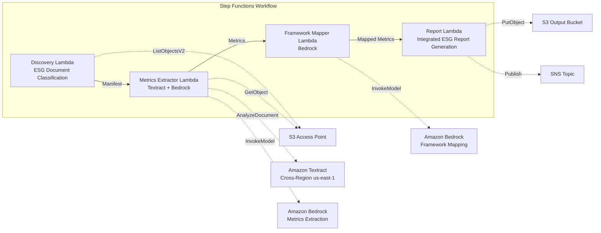

# UC23: Sustainability & ESG — Metrics Extraction / Framework Mapping

🌐 **Language / 言語**: [日本語](README.md) | English | [한국어](README.ko.md) | [简体中文](README.zh-CN.md) | [繁體中文](README.zh-TW.md) | [Français](README.fr.md) | [Deutsch](README.de.md) | [Español](README.es.md)

📚 **Documentation**: [Architecture](docs/architecture.en.md) | [Demo Guide](docs/demo-guide.en.md)

## Overview

A serverless workflow that leverages FSx for ONTAP S3 Access Points to automatically extract quantitative metrics from ESG-related documents such as sustainability reports, energy consumption records, and waste manifests, then normalizes units and maps them to reporting frameworks.

### When this pattern fits

- ESG-related documents (sustainability reports, energy records, waste manifests) are accumulated on FSx for ONTAP
- You want to automatically normalize CO2 emissions, energy usage, waste volume, and water usage from different units to a unified baseline
- You need automatic mapping to frameworks such as GRI, TCFD, and CDP
- You want to visualize ESG performance with year-over-year (YoY) trend analysis
- You want to reduce the effort of preparing ESG disclosure reports

### When this pattern does not fit

- You need a real-time ESG monitoring dashboard
- You need to build an emissions trading platform
- You need full automation of third-party assurance audits
- You are in an environment where network reachability to the ONTAP REST API cannot be ensured

### Key features

- Automatic detection and categorization of ESG documents via the S3 AP (Environmental / Social / Governance)
- Quantitative metrics extraction with Textract + Bedrock (CO2 emissions, energy, waste, water usage)
- Unit normalization (CO2→tCO2e, energy→MWh, waste→t, water→m³)
- Automatic mapping to the GRI / TCFD / CDP frameworks
- Integrated ESG report generation (aggregation by category + reporting period, YoY trend analysis)
- Validation checks (missing units, contradictions, outliers)

## Success Metrics

### Outcome
By automating ESG metrics extraction and integrated report generation, improve the quality of sustainability disclosure and increase the efficiency of reporting operations.

### Metrics
| Metric | Target (Example) |
|--------|-----------------|
| ESG metric extraction accuracy | ≥ 85% |
| Unit normalization consistency | 100% (compliant with the defined conversion table) |
| Framework mapping coverage | ≥ 80% (GRI/TCFD/CDP) |
| Report generation time | < 5 min / batch |
| Cost / daily execution | < $2.00 |
| Human Review required rate | > 20% (validation-failed metrics) |

### Measurement Method
Step Functions execution history, Textract extraction results, Bedrock mapping accuracy logs, CloudWatch EMF Metrics (ProcessingDuration, SuccessCount, ErrorCount).

### Human Review Requirements
- Validation-failed metrics (missing units, contradictory values, outliers) are reviewed by the sustainability team
- Framework mapping results are reviewed by the disclosure officer
- The annual integrated ESG report is finally approved by executives and the IR team

## Architecture



### Workflow steps

1. **Discovery**: Detect ESG documents from the S3 AP and classify them into E/S/G categories
2. **Metrics Extractor**: Extract quantitative metrics with Textract + Bedrock and normalize units
3. **Framework Mapper**: Map to GRI/TCFD/CDP framework identifiers with Bedrock
4. **Report**: Generate the integrated ESG report (by category + YoY trend) and send SNS notification

## Prerequisites

> **S3 AP NetworkOrigin Note**: The Discovery Lambda is deployed inside a VPC. If the S3 Access Point's NetworkOrigin is `Internet`, it cannot be accessed via an S3 Gateway VPC Endpoint (requests are not routed to the FSx data plane). Use an S3 AP with NetworkOrigin=VPC, or configure access through a NAT Gateway. See [S3AP Compatibility Notes](../docs/s3ap-compatibility-notes.md) for details.

- AWS account and appropriate IAM permissions
- FSx for ONTAP file system (ONTAP 9.17.1P4D3 or later)
- A volume with S3 Access Point enabled
- VPC and private subnets
- Amazon Bedrock model access enabled (Claude / Nova)
- Amazon Textract — Cross-Region (us-east-1) invocation configuration

## Deployment

### 1. Verify parameters

Verify the ESG document path patterns (Environmental/Social/Governance prefixes) in advance.

### 2. SAM deploy

```bash
# Prerequisite: AWS SAM CLI is required. 'sam build' packages the code and the shared layer automatically.
sam build

sam deploy \
  --stack-name fsxn-esg-reporting \
  --parameter-overrides \
    S3AccessPointAlias=<your-volume-ext-s3alias> \
    S3AccessPointName=<your-s3ap-name> \
    VpcId=<your-vpc-id> \
    PrivateSubnetIds=<subnet-1>,<subnet-2> \
    ScheduleExpression="cron(0 0 * * ? *)" \
    NotificationEmail=<your-email@example.com> \
    EnableVpcEndpoints=false \
    EnableCloudWatchAlarms=false \
  --capabilities CAPABILITY_NAMED_IAM \
  --resolve-s3 \
  --region ap-northeast-1
```

> **Note**: `template.yaml` is used with the SAM CLI (`sam build` + `sam deploy`).
> To deploy directly with the `aws cloudformation deploy` command, use `template-deploy.yaml` instead (it requires pre-packaging the Lambda zip files and uploading them to S3).

## Configuration Parameters

| Parameter | Description | Default | Required |
|-----------|-------------|---------|----------|
| `S3AccessPointAlias` | FSx for ONTAP S3 AP Alias (for input) | — | ✅ |
| `S3AccessPointName` | S3 AP name (for granting IAM permissions) | `""` | ⚠️ Recommended |
| `ScheduleExpression` | EventBridge Scheduler schedule expression | `cron(0 0 * * ? *)` | |
| `VpcId` | VPC ID | — | ✅ |
| `PrivateSubnetIds` | List of private subnet IDs | — | ✅ |
| `NotificationEmail` | SNS notification email address | — | ✅ |
| `MapConcurrency` | Map state parallel execution count | `10` | |
| `LambdaMemorySize` | Lambda memory size (MB) | `512` | |
| `LambdaTimeout` | Lambda timeout (seconds) | `300` | |
| `EnableVpcEndpoints` | Enable Interface VPC Endpoints | `false` | |
| `EnableCloudWatchAlarms` | Enable CloudWatch Alarms | `false` | |

## ⚠️ Performance Considerations

- FSx for ONTAP throughput capacity is **shared across NFS/SMB/S3 AP**. When running parallel processing with MapConcurrency=10, it may impact other workloads on the same volume.
- For bulk processing of large numbers of files, check the FSx for ONTAP Throughput Capacity (MBps) and adjust MapConcurrency as needed.
- Recommended: In production, start with MapConcurrency=5 and increase gradually while monitoring the FSx for ONTAP CloudWatch metric (ThroughputUtilization).

## Cleanup

```bash
aws s3 rm s3://fsxn-esg-reporting-output-${AWS_ACCOUNT_ID} --recursive

aws cloudformation delete-stack \
  --stack-name fsxn-esg-reporting \
  --region ap-northeast-1

aws cloudformation wait stack-delete-complete \
  --stack-name fsxn-esg-reporting \
  --region ap-northeast-1
```

## Supported Regions

| Service | Region constraint |
|---------|-------------------|
| Amazon Textract | Cross-Region (us-east-1) invocation |
| Amazon Bedrock | Check supported regions ([Bedrock supported regions](https://docs.aws.amazon.com/general/latest/gr/bedrock.html)) |

> UC23 invokes only Textract in Cross-Region (us-east-1).

## Cost Estimate (Monthly)

> **Note**: Approximate for the ap-northeast-1 region. Actual costs vary by usage.

| Service | Assumed usage | Monthly estimate |
|---------|---------------|------------------|
| Lambda | 4 functions × daily execution | ~$1-3 |
| S3 API | ~2K requests/day | ~$0.30 |
| Step Functions | ~200 transitions/day | ~$0.20 |
| Textract | ~100 pages/day | ~$2-5 |
| Bedrock (Nova Lite) | ~30K tokens/execution | ~$2-5 |

| Configuration | Monthly estimate |
|---------------|------------------|
| Minimum (daily 1x) | ~$6-15 |
| Standard | ~$15-40 |

---

## Governance Note

> This pattern provides technical architecture guidance. It does not constitute legal, compliance, or regulatory advice. The accuracy of ESG disclosure data should be verified by a third-party assurance body. Responses to the GRI Standards, TCFD recommendations, and the CDP questionnaire should be carried out under the supervision of specialist consultants.

> **Related Regulations**: Financial Instruments and Exchange Act (annual securities report), climate-related financial disclosure

---

## S3AP Compatibility

For FSx for ONTAP S3 Access Points compatibility constraints, troubleshooting, and trigger patterns, see [S3AP Compatibility Notes](../docs/s3ap-compatibility-notes.md).
